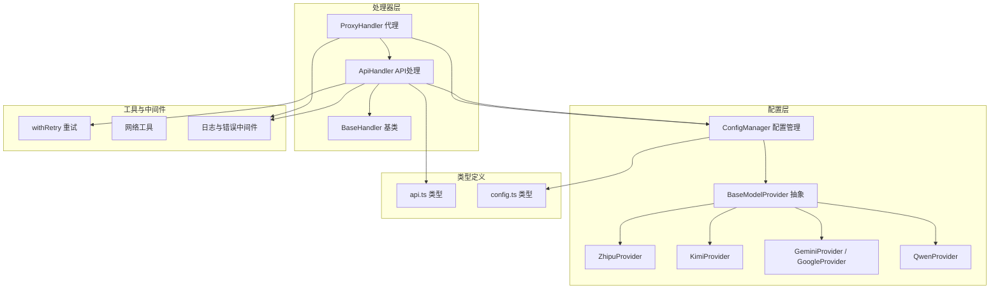
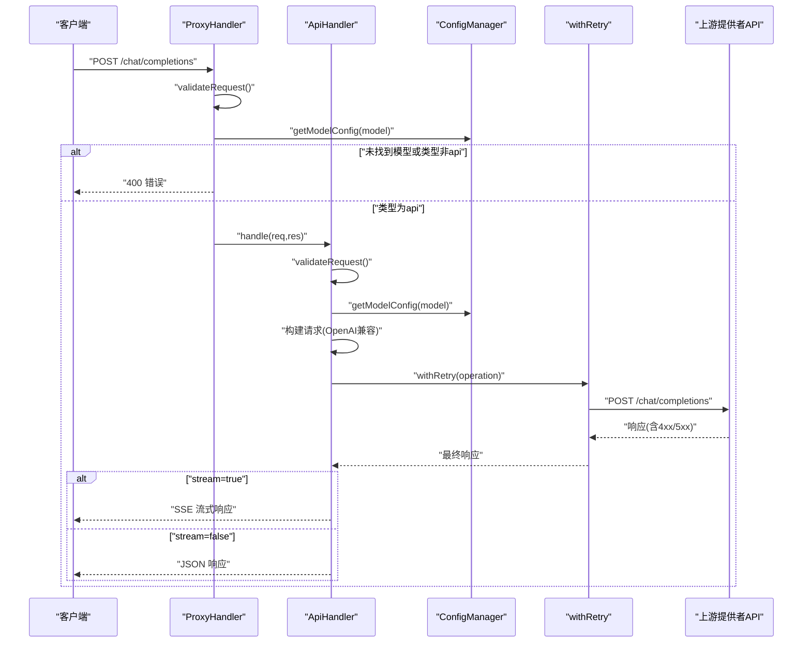
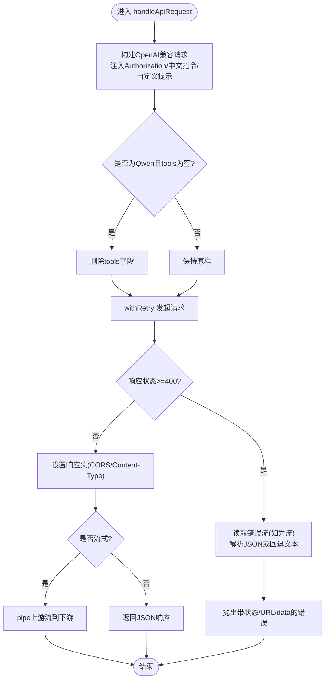
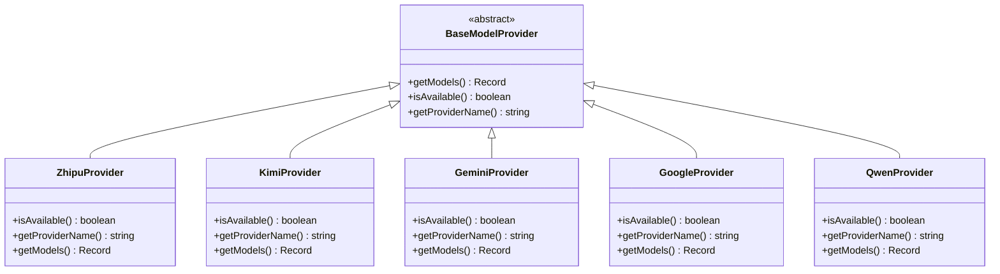
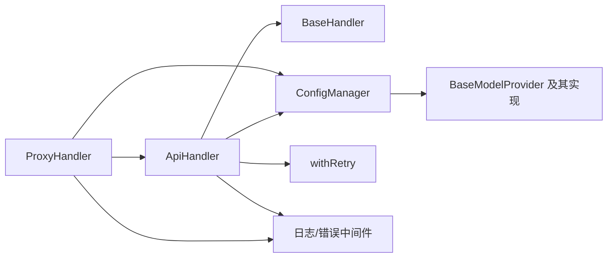

# API 处理器

<cite>
**本文引用的文件**
- [src/handlers/api.ts](file://src/handlers/api.ts)
- [src/handlers/base.ts](file://src/handlers/base.ts)
- [src/handlers/proxy.ts](file://src/handlers/proxy.ts)
- [src/config/config.ts](file://src/config/config.ts)
- [src/config/models/base.ts](file://src/config/models/base.ts)
- [src/config/models/zhipu.ts](file://src/config/models/zhipu.ts)
- [src/config/models/kimi.ts](file://src/config/models/kimi.ts)
- [src/config/models/gemini.ts](file://src/config/models/gemini.ts)
- [src/config/models/google.ts](file://src/config/models/google.ts)
- [src/config/models/qwen.ts](file://src/config/models/qwen.ts)
- [src/utils/retry.ts](file://src/utils/retry.ts)
- [src/utils/network.ts](file://src/utils/network.ts)
- [src/middlewares/common.ts](file://src/middlewares/common.ts)
- [src/types/api.ts](file://src/types/api.ts)
- [src/types/config.ts](file://src/types/config.ts)
- [package.json](file://package.json)
</cite>

## 目录
1. [简介](#简介)
2. [项目结构](#项目结构)
3. [核心组件](#核心组件)
4. [架构总览](#架构总览)
5. [详细组件分析](#详细组件分析)
6. [依赖关系分析](#依赖关系分析)
7. [性能考量](#性能考量)
8. [故障排除指南](#故障排除指南)
9. [结论](#结论)
10. [附录](#附录)

## 简介
本文件聚焦于 API 处理器的实现与使用，系统性阐述 ApiHandler 的职责、与 BaseModelProvider 的交互方式、对多模型提供者（智谱、Kimi、Google Gemini、通义千问）的统一接入、请求与响应处理、流式与非流式响应、参数校验与错误处理、重试机制与网络异常处理，并提供调试技巧与排障建议。

## 项目结构
该服务采用分层与按功能模块组织的结构：
- handlers：HTTP 请求入口与业务处理（ApiHandler、ProxyHandler、BaseHandler）
- config：配置管理与模型提供者注册（ConfigManager、各 Provider 实现）
- utils：通用工具（withRetry、网络信息）
- middlewares：中间件（日志与错误处理）
- types：类型定义（请求/响应/配置）
- server：应用启动入口

图表来源
- [src/handlers/proxy.ts:1-66](file://src/handlers/proxy.ts#L1-L66)
- [src/handlers/api.ts:1-196](file://src/handlers/api.ts#L1-L196)
- [src/handlers/base.ts:1-40](file://src/handlers/base.ts#L1-L40)
- [src/config/config.ts:1-123](file://src/config/config.ts#L1-L123)
- [src/config/models/base.ts:1-13](file://src/config/models/base.ts#L1-L13)
- [src/config/models/zhipu.ts:1-34](file://src/config/models/zhipu.ts#L1-L34)
- [src/config/models/kimi.ts:1-34](file://src/config/models/kimi.ts#L1-L34)
- [src/config/models/gemini.ts:1-34](file://src/config/models/gemini.ts#L1-L34)
- [src/config/models/google.ts:1-34](file://src/config/models/google.ts#L1-L34)
- [src/config/models/qwen.ts:1-35](file://src/config/models/qwen.ts#L1-L35)
- [src/utils/retry.ts:1-34](file://src/utils/retry.ts#L1-L34)
- [src/middlewares/common.ts:1-25](file://src/middlewares/common.ts#L1-L25)
- [src/types/api.ts:1-58](file://src/types/api.ts#L1-L58)
- [src/types/config.ts:1-48](file://src/types/config.ts#L1-L48)

章节来源
- [src/handlers/api.ts:1-196](file://src/handlers/api.ts#L1-L196)
- [src/handlers/proxy.ts:1-66](file://src/handlers/proxy.ts#L1-L66)
- [src/config/config.ts:1-123](file://src/config/config.ts#L1-L123)

## 核心组件
- BaseHandler：定义统一的请求校验、错误发送与日志记录能力，作为所有处理器的基类。
- ApiHandler：负责对接多模型提供者的 OpenAI 兼容端点，构建请求、执行重试、处理流式与非流式响应。
- ProxyHandler：对外暴露统一入口，根据模型配置路由到 ApiHandler，并提供模型列表与健康检查。
- ConfigManager：集中管理应用配置与模型配置，注册各 Provider 并导出可用模型映射。
- BaseModelProvider 及其子类：封装各提供者的可用性判断、提供者名称与模型映射。
- withRetry：通用重试工具，支持指数退避式重试策略。
- 中间件：日志与全局错误处理，保证一致的可观测性与错误响应格式。

章节来源
- [src/handlers/base.ts:1-40](file://src/handlers/base.ts#L1-L40)
- [src/handlers/api.ts:1-196](file://src/handlers/api.ts#L1-L196)
- [src/handlers/proxy.ts:1-66](file://src/handlers/proxy.ts#L1-L66)
- [src/config/config.ts:1-123](file://src/config/config.ts#L1-L123)
- [src/config/models/base.ts:1-13](file://src/config/models/base.ts#L1-L13)
- [src/utils/retry.ts:1-34](file://src/utils/retry.ts#L1-L34)
- [src/middlewares/common.ts:1-25](file://src/middlewares/common.ts#L1-L25)

## 架构总览
下图展示了从客户端请求到上游模型提供者的完整链路，以及 ApiHandler 如何统一处理不同提供者的差异。

图表来源
- [src/handlers/proxy.ts:9-37](file://src/handlers/proxy.ts#L9-L37)
- [src/handlers/api.ts:9-28](file://src/handlers/api.ts#L9-L28)
- [src/handlers/api.ts:30-195](file://src/handlers/api.ts#L30-L195)
- [src/config/config.ts:109-115](file://src/config/config.ts#L109-L115)
- [src/utils/retry.ts:1-26](file://src/utils/retry.ts#L1-L26)

## 详细组件分析

### ApiHandler：统一 API 处理与响应透传
- 职责
  - 参数校验：确保 model 与 messages 存在且格式正确。
  - 模型解析：依据 model 查找 ApiModelConfig，仅处理 type='api' 的模型。
  - 请求构建：统一使用 OpenAI 兼容格式，注入 Authorization、中文交流指令与自定义系统提示。
  - 上游调用：基于 axios 发起请求，支持超时、压缩禁用与 HTTPS Agent（Kimi）。
  - 错误处理：捕获上游错误，读取流式错误体并构造可读错误对象。
  - 响应透传：流式场景直接 pipe；非流式场景设置 CORS 头并返回 JSON。
  - 重试机制：通过 withRetry 执行指数退避式重试。
- 关键流程
  - 请求预处理：插入中文交流指令与自定义系统提示，保证输出语言一致性。
  - Qwen 特例：当 tools 为空数组时删除该字段以满足其 API 约束。
  - 流式错误读取：若上游返回 4xx/5xx 且响应为流，则读取流片段并解析 JSON。
  - 响应头设置：SSE 场景设置 text/event-stream，其他场景保留上游 content-type 并附加 CORS。

图表来源
- [src/handlers/api.ts:30-195](file://src/handlers/api.ts#L30-L195)
- [src/utils/retry.ts:1-26](file://src/utils/retry.ts#L1-L26)

章节来源
- [src/handlers/api.ts:8-196](file://src/handlers/api.ts#L8-L196)

### BaseModelProvider 与模型提供者集成
- 设计模式
  - 抽象基类 BaseModelProvider 定义统一接口：isAvailable、getProviderName、getModels。
  - 各提供者（Zhipu、Kimi、Gemini、Qwen）继承并返回各自模型映射。
- 集成要点
  - ConfigManager 在初始化时实例化各 Provider，并将返回的模型映射合并到全局模型表中。
  - ApiHandler 通过 ConfigManager.getModelConfig(model) 获取对应 ApiModelConfig，其中包含 provider、apiUrl、apiKey 等。
- 提供者差异
  - 智谱：提供 glm-4.5 映射，指向其 PaaS v4 接口。
  - Kimi：提供 kimi-k2-0905-preview 映射，指向 moonshot API。
  - Gemini：提供 gemini-2.5-pro 与 gemini-pro 映射，分别指向 OpenAI 兼容端点与标准端点。
  - 通义千问：提供 qwen-max 映射，指向 dashscope 兼容模式。

图表来源
- [src/config/models/base.ts:1-13](file://src/config/models/base.ts#L1-L13)
- [src/config/models/zhipu.ts:1-34](file://src/config/models/zhipu.ts#L1-L34)
- [src/config/models/kimi.ts:1-34](file://src/config/models/kimi.ts#L1-L34)
- [src/config/models/gemini.ts:1-34](file://src/config/models/gemini.ts#L1-L34)
- [src/config/models/google.ts:1-34](file://src/config/models/google.ts#L1-L34)
- [src/config/models/qwen.ts:1-35](file://src/config/models/qwen.ts#L1-L35)

章节来源
- [src/config/models/base.ts:1-13](file://src/config/models/base.ts#L1-L13)
- [src/config/models/zhipu.ts:1-34](file://src/config/models/zhipu.ts#L1-L34)
- [src/config/models/kimi.ts:1-34](file://src/config/models/kimi.ts#L1-L34)
- [src/config/models/gemini.ts:1-34](file://src/config/models/gemini.ts#L1-L34)
- [src/config/models/google.ts:1-34](file://src/config/models/google.ts#L1-L34)
- [src/config/models/qwen.ts:1-35](file://src/config/models/qwen.ts#L1-L35)
- [src/config/config.ts:69-99](file://src/config/config.ts#L69-L99)

### 参数验证与错误处理
- 参数验证
  - BaseHandler.validateRequest：要求 model 与 messages 存在且 messages 为数组。
- 错误处理
  - BaseHandler.sendError：统一返回 { error: { message, type } } JSON 结构，避免重复设置响应头。
  - ApiHandler.handle：捕获异常并发送 500 错误。
  - ProxyHandler.handle：若模型不存在或类型未知，返回 400/500 错误。
  - 中间件 errorHandler：兜底处理未捕获异常，返回 500。

章节来源
- [src/handlers/base.ts:10-34](file://src/handlers/base.ts#L10-L34)
- [src/handlers/api.ts:24-28](file://src/handlers/api.ts#L24-L28)
- [src/handlers/proxy.ts:14-31](file://src/handlers/proxy.ts#L14-L31)
- [src/middlewares/common.ts:9-25](file://src/middlewares/common.ts#L9-L25)

### 流式与非流式响应
- 流式响应
  - 当 requestBody.stream 为 true 时，ApiHandler 将上游流直接 pipe 到下游，并设置 SSE 必需响应头。
- 非流式响应
  - 直接将上游 JSON 响应写入响应体，并设置 CORS 与 Content-Type。

章节来源
- [src/handlers/api.ts:176-194](file://src/handlers/api.ts#L176-L194)

### 请求头与响应格式
- 认证头
  - 统一添加 Authorization: Bearer <apiKey>，适用于所有提供者（包括 Gemini 的 OpenAI 兼容端点）。
- 压缩与超时
  - 禁用压缩以便调试；设置请求超时；Kimi 使用专用 HTTPS Agent。
- 响应头
  - 非流式：保留上游 content-type，并附加 CORS 头；流式：设置 text/event-stream 与缓存控制头。

章节来源
- [src/handlers/api.ts:36-47](file://src/handlers/api.ts#L36-L47)
- [src/handlers/api.ts:169-190](file://src/handlers/api.ts#L169-L190)

### 与模型提供者的集成示例路径
- 智谱（GLM-4.5）
  - 模型映射：参见 [src/config/models/zhipu.ts:20-32](file://src/config/models/zhipu.ts#L20-L32)
  - 请求示例路径：参见 [src/handlers/api.ts:110-114](file://src/handlers/api.ts#L110-L114)
- Kimi（Moonshot）
  - 模型映射：参见 [src/config/models/kimi.ts:20-31](file://src/config/models/kimi.ts#L20-L31)
  - 请求示例路径：参见 [src/handlers/api.ts:110-114](file://src/handlers/api.ts#L110-L114)
- Google Gemini（OpenAI 兼容端点）
  - 模型映射：参见 [src/config/models/gemini.ts:20-31](file://src/config/models/gemini.ts#L20-L31)
  - 请求示例路径：参见 [src/handlers/api.ts:110-114](file://src/handlers/api.ts#L110-L114)
- 通义千问（DashScope 兼容模式）
  - 模型映射：参见 [src/config/models/qwen.ts:20-31](file://src/config/models/qwen.ts#L20-L31)
  - 请求示例路径：参见 [src/handlers/api.ts:110-114](file://src/handlers/api.ts#L110-L114)

章节来源
- [src/config/models/zhipu.ts:20-32](file://src/config/models/zhipu.ts#L20-L32)
- [src/config/models/kimi.ts:20-31](file://src/config/models/kimi.ts#L20-L31)
- [src/config/models/gemini.ts:20-31](file://src/config/models/gemini.ts#L20-L31)
- [src/config/models/qwen.ts:20-31](file://src/config/models/qwen.ts#L20-L31)
- [src/handlers/api.ts:110-114](file://src/handlers/api.ts#L110-L114)

### 重试机制与网络异常处理
- 重试策略
  - withRetry：按最大重试次数与递增延迟执行，记录每次尝试与失败原因，最终抛出最后一次错误。
- 网络异常
  - 超时：由 axios.timeout 控制；Kimi 使用专用 HTTPS Agent。
  - 错误响应：对 4xx/5xx 响应进行统一处理，流式错误读取与解析，构造可读错误对象。

章节来源
- [src/utils/retry.ts:1-26](file://src/utils/retry.ts#L1-L26)
- [src/handlers/api.ts:42-47](file://src/handlers/api.ts#L42-L47)
- [src/handlers/api.ts:117-121](file://src/handlers/api.ts#L117-L121)
- [src/handlers/api.ts:133-163](file://src/handlers/api.ts#L133-L163)

## 依赖关系分析
- 处理器依赖
  - ApiHandler 依赖 ConfigManager 获取模型配置，依赖 withRetry 执行重试，依赖 BaseHandler 的校验与错误发送能力。
  - ProxyHandler 依赖 ApiHandler 进行实际转发，并提供模型列表与健康检查。
- 配置依赖
  - ConfigManager 依赖各 Provider 的 getModels 输出，合并为全局模型表。
- 工具与中间件
  - 日志与错误中间件贯穿请求生命周期，保证统一可观测性与错误格式。

图表来源
- [src/handlers/proxy.ts:1-66](file://src/handlers/proxy.ts#L1-L66)
- [src/handlers/api.ts:1-196](file://src/handlers/api.ts#L1-L196)
- [src/handlers/base.ts:1-40](file://src/handlers/base.ts#L1-L40)
- [src/config/config.ts:1-123](file://src/config/config.ts#L1-L123)
- [src/utils/retry.ts:1-34](file://src/utils/retry.ts#L1-L34)
- [src/middlewares/common.ts:1-25](file://src/middlewares/common.ts#L1-L25)

章节来源
- [src/handlers/proxy.ts:1-66](file://src/handlers/proxy.ts#L1-L66)
- [src/handlers/api.ts:1-196](file://src/handlers/api.ts#L1-L196)
- [src/config/config.ts:1-123](file://src/config/config.ts#L1-L123)

## 性能考量
- 超时与重试
  - 合理设置 requestTimeout 与 maxRetries/RETRY_DELAY，避免长时间阻塞与资源浪费。
- 流式传输
  - 流式场景直接 pipe，减少内存占用；非流式场景直接返回 JSON，避免额外序列化开销。
- 压缩与头部
  - 禁用压缩便于调试，但生产环境可根据网络状况调整以降低带宽。
- HTTPS Agent
  - 对特定提供者启用 keepAlive 与超时，提升连接复用效率。

章节来源
- [src/config/config.ts:53-67](file://src/config/config.ts#L53-L67)
- [src/utils/retry.ts:1-26](file://src/utils/retry.ts#L1-L26)
- [src/handlers/api.ts:42-56](file://src/handlers/api.ts#L42-L56)
- [src/handlers/api.ts:176-194](file://src/handlers/api.ts#L176-L194)

## 故障排除指南
- 常见问题定位
  - 模型不可用：确认 ConfigManager 初始化是否成功加载 Provider，查看模型映射是否存在。
  - 认证失败：核对 Authorization 头是否正确注入，确认 apiKey 是否配置。
  - 流式错误：若上游返回 4xx/5xx 且为流，检查错误流读取逻辑与 JSON 解析。
  - 超时/网络异常：调整 requestTimeout、maxRetries、RETRY_DELAY；必要时为提供者配置专用 Agent。
- 调试技巧
  - 开启压缩禁用与详细日志，观察请求 URL、请求体与响应状态。
  - 使用本地 IP 与端口信息辅助定位网络问题。
- 建议步骤
  - 校验环境变量与最小可用密钥集合。
  - 使用健康检查端点确认服务可用性。
  - 逐步缩小范围：先验证单个提供者，再验证流式/非流式场景。

章节来源
- [src/config/config.ts:29-51](file://src/config/config.ts#L29-L51)
- [src/utils/network.ts:1-51](file://src/utils/network.ts#L1-L51)
- [src/handlers/api.ts:102-108](file://src/handlers/api.ts#L102-L108)
- [src/handlers/api.ts:133-163](file://src/handlers/api.ts#L133-L163)

## 结论
ApiHandler 通过统一的 OpenAI 兼容请求格式与可插拔的 Provider 架构，实现了对智谱、Kimi、Google Gemini、通义千问等多模型提供者的无缝集成。配合 withRetry 的重试机制、完善的参数校验与错误处理、以及对流式/非流式的差异化响应策略，能够在复杂网络环境下稳定地代理上游 API 并向上游提供一致的响应格式与可观测性。

## 附录
- 类型定义概览
  - 请求/响应类型：ChatCompletionRequest、ChatCompletionResponse、ErrorResponse、ModelsResponse。
  - 配置类型：ApiModelConfig、AppConfig、EnvConfig。
- 依赖声明
  - 核心依赖包括 axios、express、dotenv、cors 等，详见 package.json。

章节来源
- [src/types/api.ts:11-58](file://src/types/api.ts#L11-L58)
- [src/types/config.ts:8-48](file://src/types/config.ts#L8-L48)
- [package.json:14-29](file://package.json#L14-L29)