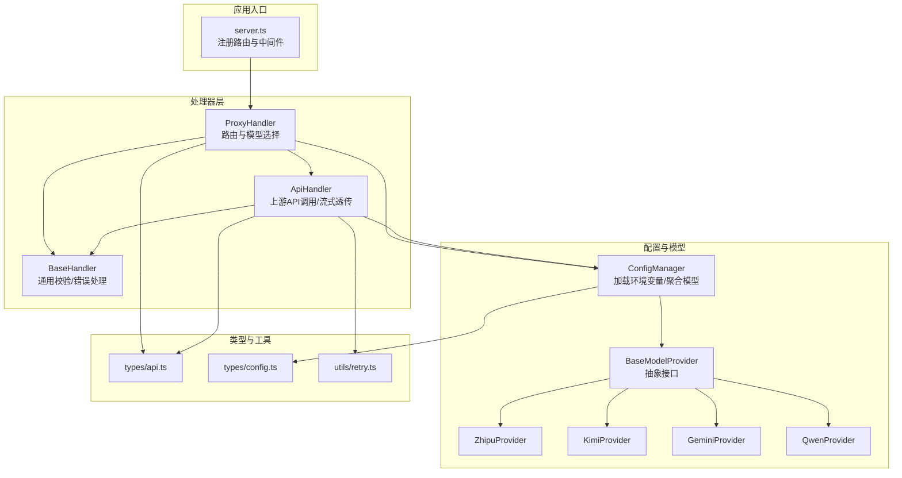
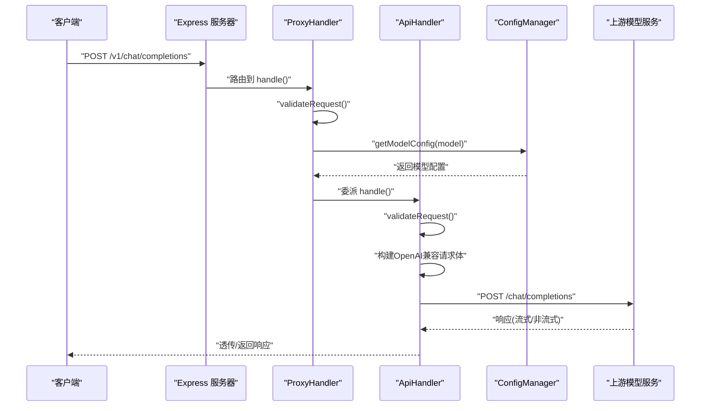
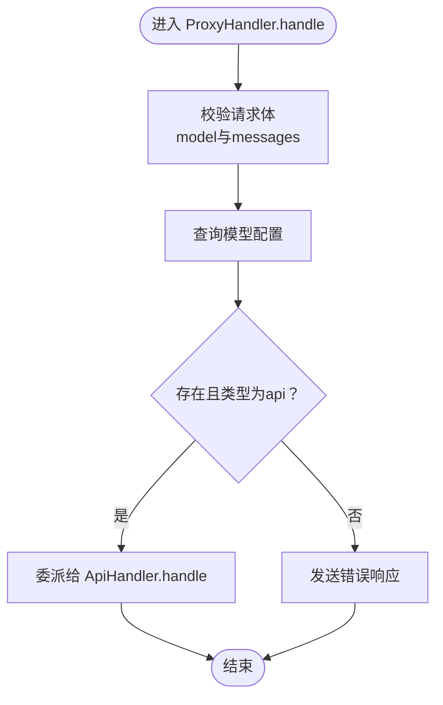
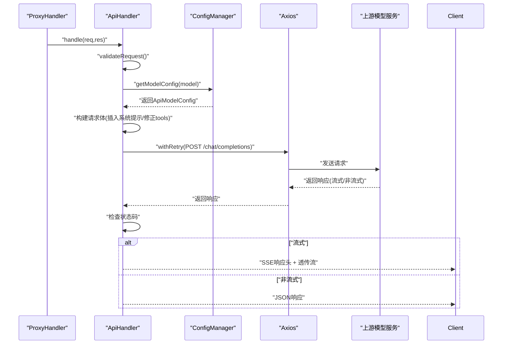
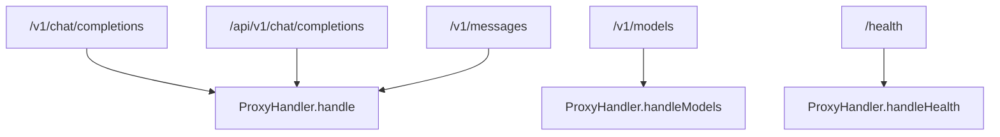
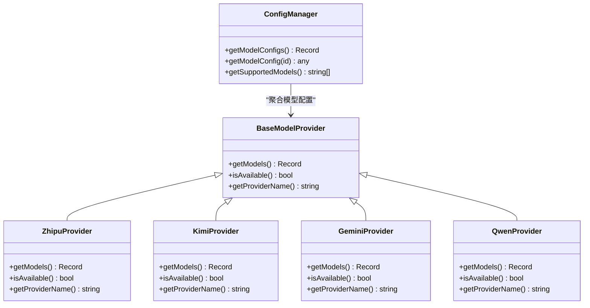
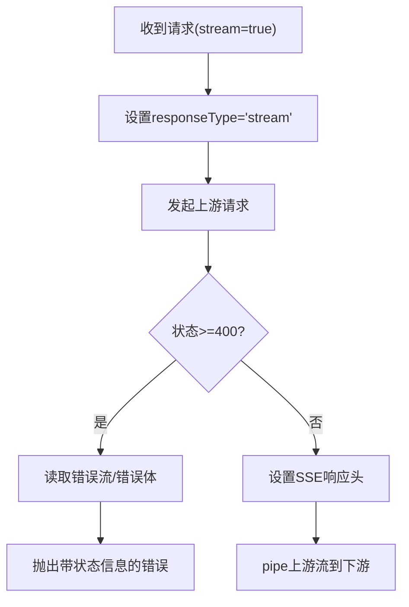
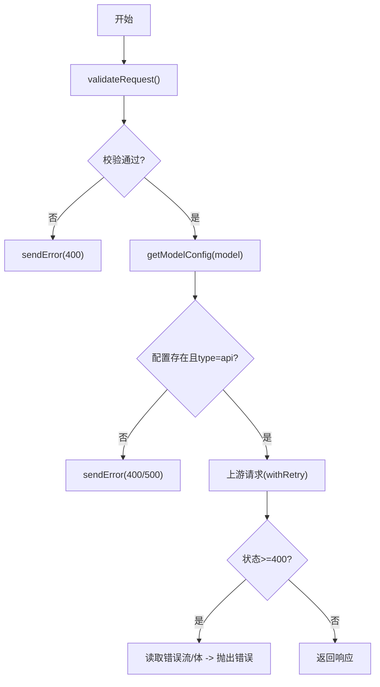
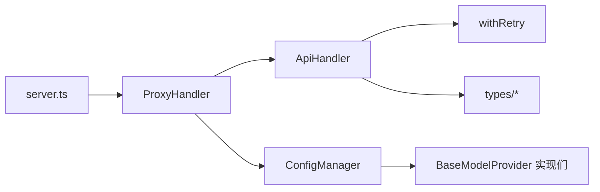

# 代理处理器

<cite>
**本文引用的文件**
- [src/server.ts](file://src/server.ts)
- [src/handlers/proxy.ts](file://src/handlers/proxy.ts)
- [src/handlers/api.ts](file://src/handlers/api.ts)
- [src/handlers/base.ts](file://src/handlers/base.ts)
- [src/config/config.ts](file://src/config/config.ts)
- [src/config/models/base.ts](file://src/config/models/base.ts)
- [src/config/models/zhipu.ts](file://src/config/models/zhipu.ts)
- [src/config/models/kimi.ts](file://src/config/models/kimi.ts)
- [src/config/models/gemini.ts](file://src/config/models/gemini.ts)
- [src/config/models/qwen.ts](file://src/config/models/qwen.ts)
- [src/types/api.ts](file://src/types/api.ts)
- [src/types/config.ts](file://src/types/config.ts)
- [src/utils/retry.ts](file://src/utils/retry.ts)
</cite>

## 目录
1. [简介](#简介)
2. [项目结构](#项目结构)
3. [核心组件](#核心组件)
4. [架构总览](#架构总览)
5. [详细组件分析](#详细组件分析)
6. [依赖关系分析](#依赖关系分析)
7. [性能考虑](#性能考虑)
8. [故障排查指南](#故障排查指南)
9. [结论](#结论)
10. [附录](#附录)

## 简介
本文件面向“代理处理器”的实现与使用，重点阐述 ProxyHandler 的路由分发、模型选择策略、请求转发机制以及与 BaseModelProvider 的交互方式。文档同时覆盖多端点路由（/v1/chat/completions、/api/v1/chat/completions、/v1/messages）、流式响应与 SSE 支持、错误处理策略、性能优化建议与最佳实践，并通过图示帮助读者快速理解系统的工作流程。

## 项目结构
该服务采用 Express 作为 Web 框架，按职责划分为以下模块：
- 服务器入口与路由注册：在服务器中集中注册健康检查、模型列表与聊天补全等端点。
- 处理器层：BaseHandler 提供通用校验与错误发送能力；ProxyHandler 负责路由与模型选择；ApiHandler 负责具体 API 调用与流式透传。
- 配置与模型提供者：ConfigManager 负责加载环境变量、初始化各 Provider 并聚合模型配置；各 Provider 定义模型到上游 API 的映射。
- 类型定义：统一定义聊天请求/响应、模型配置与环境变量等类型。
- 工具：重试工具 withRetry 提供指数退避重试能力。

图表来源
- [src/server.ts:29-40](file://src/server.ts#L29-L40)
- [src/handlers/proxy.ts:6-37](file://src/handlers/proxy.ts#L6-L37)
- [src/handlers/api.ts:8-28](file://src/handlers/api.ts#L8-L28)
- [src/config/config.ts:67-97](file://src/config/config.ts#L67-L97)
- [src/config/models/base.ts:3-7](file://src/config/models/base.ts#L3-L7)
- [src/types/api.ts:11-20](file://src/types/api.ts#L11-L20)
- [src/types/config.ts:8-16](file://src/types/config.ts#L8-L16)
- [src/utils/retry.ts:1-26](file://src/utils/retry.ts#L1-L26)

章节来源
- [src/server.ts:29-40](file://src/server.ts#L29-L40)
- [src/handlers/proxy.ts:6-37](file://src/handlers/proxy.ts#L6-L37)
- [src/handlers/api.ts:8-28](file://src/handlers/api.ts#L8-L28)
- [src/config/config.ts:67-97](file://src/config/config.ts#L67-L97)

## 核心组件
- 服务器与路由
  - 注册健康检查、模型列表与多端点聊天补全路由。
  - 使用 CORS、JSON 中间件与日志中间件。
- 代理处理器（ProxyHandler）
  - 接收请求，校验必要字段，解析模型配置，委派给 ApiHandler 处理。
  - 提供模型列表查询与健康检查接口。
- API 处理器（ApiHandler）
  - 校验请求、构建 OpenAI 兼容请求体、注入系统提示、执行带重试的网络请求。
  - 支持流式与非流式响应，透传上游 SSE 流或直接返回 JSON。
- 配置管理（ConfigManager）
  - 加载环境变量，初始化各 Provider，聚合模型配置，提供查询接口。
- 模型提供者（BaseModelProvider 及其实现）
  - 定义模型到上游 API 的映射（API 地址、鉴权、模型别名等）。
- 类型与工具
  - 统一请求/响应结构、模型配置结构与环境变量结构。
  - withRetry 提供可配置的重试策略。

章节来源
- [src/server.ts:23-44](file://src/server.ts#L23-L44)
- [src/handlers/proxy.ts:6-57](file://src/handlers/proxy.ts#L6-L57)
- [src/handlers/api.ts:8-196](file://src/handlers/api.ts#L8-L196)
- [src/config/config.ts:7-121](file://src/config/config.ts#L7-L121)
- [src/config/models/base.ts:3-7](file://src/config/models/base.ts#L3-L7)
- [src/types/api.ts:11-58](file://src/types/api.ts#L11-L58)
- [src/types/config.ts:1-48](file://src/types/config.ts#L1-L48)
- [src/utils/retry.ts:1-34](file://src/utils/retry.ts#L1-L34)

## 架构总览
下图展示了从客户端请求到上游模型服务的整体链路，包括路由分发、模型选择与请求转发。

图表来源
- [src/server.ts:36-39](file://src/server.ts#L36-L39)
- [src/handlers/proxy.ts:9-31](file://src/handlers/proxy.ts#L9-L31)
- [src/handlers/api.ts:9-22](file://src/handlers/api.ts#L9-L22)
- [src/config/config.ts:107-113](file://src/config/config.ts#L107-L113)

## 详细组件分析

### ProxyHandler：路由与模型选择
- 构造函数参数
  - 无显式参数，内部通过单例 ConfigManager 获取全局配置。
- handle 方法
  - 校验请求体（model、messages 必填且格式有效）。
  - 查询模型配置：若不存在则返回错误；若类型非 api 则返回未知类型错误。
  - 将请求委派给 ApiHandler 处理。
- 辅助方法
  - handleModels：返回支持的模型列表（OpenAI 兼容格式）。
  - handleHealth：返回服务健康状态与模型数量。

图表来源
- [src/handlers/proxy.ts:9-31](file://src/handlers/proxy.ts#L9-L31)
- [src/handlers/base.ts:10-22](file://src/handlers/base.ts#L10-L22)
- [src/config/config.ts:107-113](file://src/config/config.ts#L107-L113)

章节来源
- [src/handlers/proxy.ts:6-37](file://src/handlers/proxy.ts#L6-L37)
- [src/handlers/base.ts:10-34](file://src/handlers/base.ts#L10-L34)
- [src/config/config.ts:107-113](file://src/config/config.ts#L107-L113)

### ApiHandler：请求转发与流式处理
- handle
  - 校验请求体并记录模型与是否流式。
  - 获取模型配置（必须为 api 类型），随后进入内部处理流程。
- handleApiRequest
  - 构建请求头（Content-Type、Authorization、Accept-Encoding）。
  - 根据是否流式设置 responseType，并配置超时与状态码校验。
  - 对 Kimi 特殊配置 HTTPS Agent。
  - 构建 OpenAI 兼容请求体：
    - 插入中文交流指令与自定义系统提示（仅在首个 system 消息后插入一次）。
    - 处理 Qwen 的 tools 字段（空数组删除）。
  - 使用 withRetry 执行请求，允许 4xx 通过以便调试。
  - 响应处理：
    - 非流式：设置跨域响应头，直接返回 JSON。
    - 流式：设置 SSE 头，透传上游流至客户端。
  - 错误处理：
    - 若上游返回 4xx/5xx，读取错误流或错误体并抛出带状态信息的错误，交由上层 BaseHandler 统一错误响应。

图表来源
- [src/handlers/api.ts:9-28](file://src/handlers/api.ts#L9-L28)
- [src/handlers/api.ts:30-195](file://src/handlers/api.ts#L30-L195)
- [src/config/config.ts:107-113](file://src/config/config.ts#L107-L113)
- [src/utils/retry.ts:1-26](file://src/utils/retry.ts#L1-L26)

章节来源
- [src/handlers/api.ts:8-196](file://src/handlers/api.ts#L8-L196)
- [src/utils/retry.ts:1-34](file://src/utils/retry.ts#L1-L34)

### 路由分发逻辑与端点支持
- 路由注册
  - /health：健康检查。
  - /v1/models：模型列表。
  - /v1/chat/completions、/api/v1/chat/completions、/v1/messages：聊天补全。
- 分发策略
  - 所有聊天补全端点均路由到 ProxyHandler.handle，由其完成模型选择与委派。
  - 模型列表与健康检查由 ProxyHandler 自身处理。

图表来源
- [src/server.ts:29-40](file://src/server.ts#L29-L40)
- [src/handlers/proxy.ts:39-65](file://src/handlers/proxy.ts#L39-L65)

章节来源
- [src/server.ts:29-40](file://src/server.ts#L29-L40)
- [src/handlers/proxy.ts:39-65](file://src/handlers/proxy.ts#L39-L65)

### 模型选择策略与 BaseModelProvider 交互
- ConfigManager 初始化阶段
  - 依次实例化各 Provider（智谱、Kimi、Gemini、通义），并将它们返回的模型配置合并到全局字典。
- Provider 行为
  - BaseModelProvider 抽象接口定义 getModels、isAvailable、getProviderName。
  - 各 Provider 返回键为模型 ID、值为 ApiModelConfig 的映射，其中包含：
    - type: 'api'
    - apiUrl、apiKey、provider、name、可选 model（上游实际使用的模型名）
- 选择流程
  - ProxyHandler 通过 ConfigManager.getModelConfig(modelId) 获取配置，若不存在则报错。
  - ApiHandler 再次校验类型为 'api'，确保安全。

图表来源
- [src/config/models/base.ts:3-7](file://src/config/models/base.ts#L3-L7)
- [src/config/models/zhipu.ts:4-33](file://src/config/models/zhipu.ts#L4-L33)
- [src/config/models/kimi.ts:4-33](file://src/config/models/kimi.ts#L4-L33)
- [src/config/models/gemini.ts:4-33](file://src/config/models/gemini.ts#L4-L33)
- [src/config/models/qwen.ts:4-34](file://src/config/models/qwen.ts#L4-L34)
- [src/config/config.ts:67-97](file://src/config/config.ts#L67-L97)

章节来源
- [src/config/config.ts:67-97](file://src/config/config.ts#L67-L97)
- [src/config/models/base.ts:3-7](file://src/config/models/base.ts#L3-L7)
- [src/config/models/zhipu.ts:20-33](file://src/config/models/zhipu.ts#L20-L33)
- [src/config/models/kimi.ts:20-33](file://src/config/models/kimi.ts#L20-L33)
- [src/config/models/gemini.ts:20-33](file://src/config/models/gemini.ts#L20-L33)
- [src/config/models/qwen.ts:20-34](file://src/config/models/qwen.ts#L20-L34)

### 流式响应与 SSE 支持
- 触发条件
  - 当客户端请求体中 stream=true 时，ApiHandler 将 responseType 设为 'stream'。
- 透传机制
  - 设置 Content-Type 为 text/event-stream，以及必要的缓存与跨域头。
  - 直接将上游响应流 pipe 到下游响应对象，保持 SSE 协议。
- 错误流读取
  - 若上游返回错误且为流式，尝试读取流内容以提取 JSON 或文本错误详情，再抛出统一错误。

图表来源
- [src/handlers/api.ts:35-44](file://src/handlers/api.ts#L35-L44)
- [src/handlers/api.ts:131-164](file://src/handlers/api.ts#L131-L164)
- [src/handlers/api.ts:176-194](file://src/handlers/api.ts#L176-L194)

章节来源
- [src/handlers/api.ts:35-44](file://src/handlers/api.ts#L35-L44)
- [src/handlers/api.ts:131-164](file://src/handlers/api.ts#L131-L164)
- [src/handlers/api.ts:176-194](file://src/handlers/api.ts#L176-L194)

### 错误处理策略与异常情况
- 参数校验
  - 缺少 model 或 messages 非数组时，立即返回错误。
- 模型配置缺失
  - 未找到模型配置或类型非 api 时，返回相应错误与可用模型列表提示。
- 上游错误
  - 允许 4xx 通过以便调试；若状态码 >= 400，读取错误流或错误体，构造统一错误对象并抛出。
- 统一错误响应
  - BaseHandler.sendError 统一输出标准错误结构，避免重复逻辑。

图表来源
- [src/handlers/base.ts:10-34](file://src/handlers/base.ts#L10-L34)
- [src/handlers/proxy.ts:14-31](file://src/handlers/proxy.ts#L14-L31)
- [src/handlers/api.ts:24-27](file://src/handlers/api.ts#L24-L27)
- [src/handlers/api.ts:123-164](file://src/handlers/api.ts#L123-L164)

章节来源
- [src/handlers/base.ts:10-34](file://src/handlers/base.ts#L10-L34)
- [src/handlers/proxy.ts:14-31](file://src/handlers/proxy.ts#L14-L31)
- [src/handlers/api.ts:24-27](file://src/handlers/api.ts#L24-L27)
- [src/handlers/api.ts:123-164](file://src/handlers/api.ts#L123-L164)

### 代码示例：不同端点的处理流程
- /v1/chat/completions
  - 路由到 ProxyHandler.handle → 校验 → 查询模型 → 委派 ApiHandler → 上游请求 → 返回/透传。
- /api/v1/chat/completions
  - 同上，仅路径不同。
- /v1/messages
  - 同上，路径不同，但语义一致。

章节来源
- [src/server.ts:36-39](file://src/server.ts#L36-L39)
- [src/handlers/proxy.ts:9-31](file://src/handlers/proxy.ts#L9-L31)
- [src/handlers/api.ts:9-22](file://src/handlers/api.ts#L9-L22)

## 依赖关系分析
- 低耦合高内聚
  - ProxyHandler 仅负责路由与模型选择，不直接关心上游细节。
  - ApiHandler 专注网络请求、重试与响应处理。
  - ConfigManager 与 Provider 解耦，新增模型只需扩展 Provider。
- 关键依赖链
  - 服务器路由 → ProxyHandler → ApiHandler → ConfigManager/Provider → 上游 API。
  - 错误路径：ApiHandler 抛错 → BaseHandler 统一处理 → 客户端。

图表来源
- [src/server.ts:29-40](file://src/server.ts#L29-L40)
- [src/handlers/proxy.ts:6-37](file://src/handlers/proxy.ts#L6-L37)
- [src/handlers/api.ts:8-28](file://src/handlers/api.ts#L8-L28)
- [src/utils/retry.ts:1-26](file://src/utils/retry.ts#L1-L26)
- [src/config/config.ts:67-97](file://src/config/config.ts#L67-L97)

章节来源
- [src/server.ts:29-40](file://src/server.ts#L29-L40)
- [src/handlers/proxy.ts:6-37](file://src/handlers/proxy.ts#L6-L37)
- [src/handlers/api.ts:8-28](file://src/handlers/api.ts#L8-L28)
- [src/utils/retry.ts:1-26](file://src/utils/retry.ts#L1-L26)
- [src/config/config.ts:67-97](file://src/config/config.ts#L67-L97)

## 性能考虑
- 重试策略
  - withRetry 提供递增延迟的重试，减少瞬时波动对用户体验的影响。
  - 建议根据上游 SLA 调整最大重试次数与基础延迟。
- 超时控制
  - 请求超时默认 60 秒，可根据模型响应时间调整。
- 流式传输
  - 流式场景下直接 pipe，避免额外缓冲与内存占用。
- 证书与连接复用
  - Kimi 场景启用 HTTPS Agent，提升连接复用与稳定性。
- 日志与可观测性
  - 在关键节点打印请求摘要与状态，便于定位问题。

[本节为通用性能建议，无需特定文件引用]

## 故障排查指南
- 常见错误与定位
  - 缺少 model 或 messages：检查请求体结构与必填字段。
  - 不支持的模型：确认模型 ID 是否在支持列表中。
  - 上游 4xx/5xx：查看错误流或错误体，结合状态码与 URL 定位问题。
- 日志要点
  - 请求体与目标 URL、响应状态、错误详情与重试过程均有日志输出。
- 重试与超时
  - 若出现偶发失败，适当提高重试次数或延长超时时间。

章节来源
- [src/handlers/base.ts:24-34](file://src/handlers/base.ts#L24-L34)
- [src/handlers/api.ts:123-164](file://src/handlers/api.ts#L123-L164)
- [src/utils/retry.ts:8-26](file://src/utils/retry.ts#L8-L26)

## 结论
本代理处理器通过清晰的分层设计实现了对多模型提供商的统一接入：ProxyHandler 负责路由与模型选择，ApiHandler 负责请求转发与流式透传，ConfigManager 与 Provider 负责配置聚合与模型映射。配合 withRetry 与完善的错误处理，系统在易用性与稳定性之间取得良好平衡。对于新模型接入，仅需扩展 Provider 并在 ConfigManager 中注册即可。

[本节为总结性内容，无需特定文件引用]

## 附录
- 类型与配置参考
  - ChatCompletionRequest/Response、模型配置与环境变量定义参见类型文件。
- 最佳实践
  - 明确区分路由层与业务层职责。
  - 对上游错误进行分类处理，保留原始状态信息。
  - 在生产环境中谨慎放宽 4xx 校验，仅用于调试场景。

章节来源
- [src/types/api.ts:11-58](file://src/types/api.ts#L11-L58)
- [src/types/config.ts:1-48](file://src/types/config.ts#L1-L48)