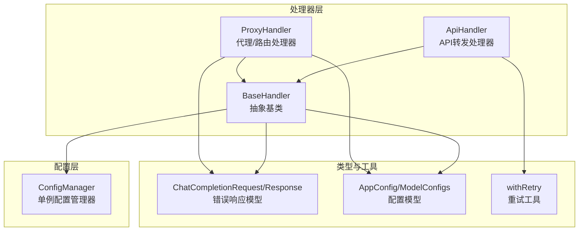
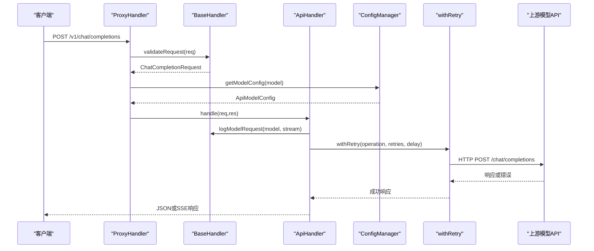
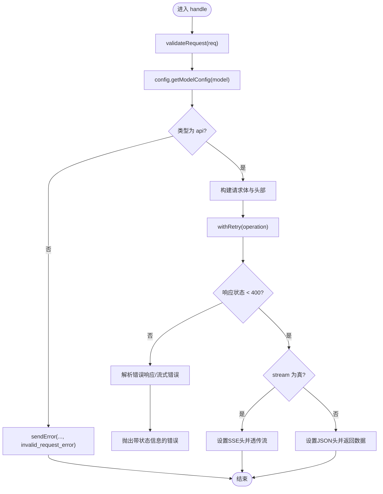
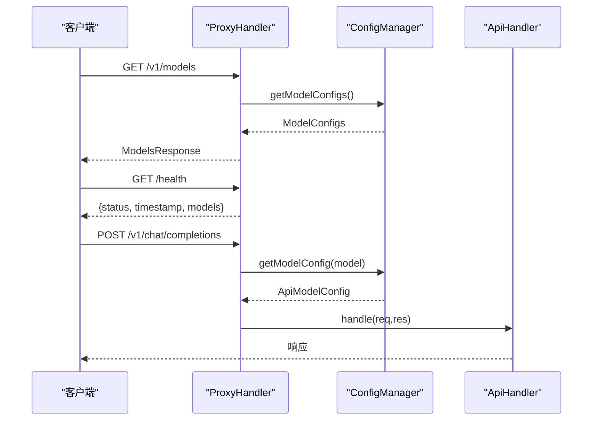
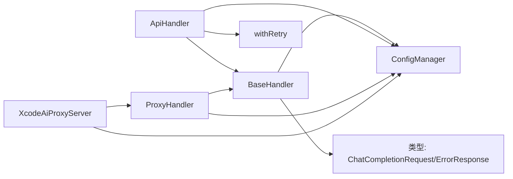

# 基础处理器

<cite>
**本文档引用的文件**
- [src/handlers/base.ts](file://src/handlers/base.ts)
- [src/handlers/api.ts](file://src/handlers/api.ts)
- [src/handlers/proxy.ts](file://src/handlers/proxy.ts)
- [src/config/config.ts](file://src/config/config.ts)
- [src/config/index.ts](file://src/config/index.ts)
- [src/types/api.ts](file://src/types/api.ts)
- [src/types/config.ts](file://src/types/config.ts)
- [src/utils/retry.ts](file://src/utils/retry.ts)
- [src/middlewares/common.ts](file://src/middlewares/common.ts)
- [src/server.ts](file://src/server.ts)
</cite>

## 目录
1. [简介](#简介)
2. [项目结构](#项目结构)
3. [核心组件](#核心组件)
4. [架构总览](#架构总览)
5. [详细组件分析](#详细组件分析)
6. [依赖分析](#依赖分析)
7. [性能考虑](#性能考虑)
8. [故障排查指南](#故障排查指南)
9. [结论](#结论)
10. [附录](#附录)

## 简介
本文件聚焦于基础处理器 BaseHandler 的设计理念、通用功能实现与扩展机制，系统阐述请求验证逻辑、错误响应格式化、日志记录功能，以及抽象方法 handle 的设计意图与子类实现要求。同时说明与 ConfigManager 的集成关系、配置访问方式，并提供扩展 BaseHandler 的最佳实践与注意事项。文档面向不同技术背景的读者，既提供高层概览，也给出代码级的可视化与参考路径。

## 项目结构
该模块位于 src/handlers 目录下，核心文件包括：
- base.ts：定义抽象基类 BaseHandler，提供统一的验证、错误处理与日志能力
- api.ts：具体处理器 ApiHandler，继承 BaseHandler 并实现 OpenAI 兼容 API 的转发
- proxy.ts：代理处理器 ProxyHandler，负责路由分发与模型配置查询

图表来源
- [src/handlers/base.ts:1-40](file://src/handlers/base.ts#L1-L40)
- [src/handlers/api.ts:1-196](file://src/handlers/api.ts#L1-L196)
- [src/handlers/proxy.ts:1-66](file://src/handlers/proxy.ts#L1-L66)
- [src/config/config.ts:1-123](file://src/config/config.ts#L1-L123)
- [src/types/api.ts:1-58](file://src/types/api.ts#L1-L58)
- [src/types/config.ts:1-48](file://src/types/config.ts#L1-L48)
- [src/utils/retry.ts:1-34](file://src/utils/retry.ts#L1-L34)

章节来源
- [src/handlers/base.ts:1-40](file://src/handlers/base.ts#L1-L40)
- [src/handlers/api.ts:1-196](file://src/handlers/api.ts#L1-L196)
- [src/handlers/proxy.ts:1-66](file://src/handlers/proxy.ts#L1-L66)
- [src/config/config.ts:1-123](file://src/config/config.ts#L1-L123)
- [src/types/api.ts:1-58](file://src/types/api.ts#L1-L58)
- [src/types/config.ts:1-48](file://src/types/config.ts#L1-L48)
- [src/utils/retry.ts:1-34](file://src/utils/retry.ts#L1-L34)

## 核心组件
- BaseHandler 抽象类
  - 提供受保护的配置访问：通过 ConfigManager 单例获取应用与模型配置
  - 定义抽象方法 handle(req, res)，强制子类实现业务处理流程
  - 提供受保护的通用能力：
    - validateRequest：校验请求体中的 model 与 messages 字段
    - sendError：标准化错误响应，避免重复发送头部
    - logModelRequest：输出模型与流式标志的日志
- ApiHandler 具体实现
  - 继承 BaseHandler，完成 OpenAI 兼容 API 的请求构建、转发与响应透传
  - 使用 withRetry 实现指数退避重试
  - 支持流式与非流式响应，设置跨域与缓存头
- ProxyHandler 路由分发
  - 统一入口，根据 model 查询配置并委派给 ApiHandler
  - 提供 /v1/models 与 /health 等辅助接口

章节来源
- [src/handlers/base.ts:5-40](file://src/handlers/base.ts#L5-L40)
- [src/handlers/api.ts:8-196](file://src/handlers/api.ts#L8-L196)
- [src/handlers/proxy.ts:6-66](file://src/handlers/proxy.ts#L6-L66)

## 架构总览
BaseHandler 作为抽象基类，向上承接 ProxyHandler 的路由分发，向下被 ApiHandler 等具体处理器继承复用。配置通过 ConfigManager 单例注入，确保全局一致的配置访问。类型系统在 types 下定义，保证请求/响应与配置的数据结构一致性。

图表来源
- [src/handlers/proxy.ts:9-37](file://src/handlers/proxy.ts#L9-L37)
- [src/handlers/base.ts:10-22](file://src/handlers/base.ts#L10-L22)
- [src/handlers/api.ts:30-195](file://src/handlers/api.ts#L30-L195)
- [src/config/config.ts:109-115](file://src/config/config.ts#L109-L115)
- [src/utils/retry.ts:1-26](file://src/utils/retry.ts#L1-L26)

## 详细组件分析

### BaseHandler 抽象类
- 设计理念
  - 将“请求验证、错误格式化、日志记录”等横切关注点下沉到基类，减少重复代码
  - 通过抽象方法 handle 强制子类实现业务逻辑，保持统一的入口签名
  - 通过 ConfigManager 注入配置，实现“运行时可配置”的能力
- 关键方法
  - validateRequest(req)
    - 校验 model 与 messages 字段存在性与类型
    - 返回 ChatCompletionRequest 类型对象，供后续处理使用
  - sendError(res, status, message, type)
    - 统一错误响应结构，避免重复发送响应头
    - 默认错误类型为 request_error，便于前端识别
  - logModelRequest(model, isStream)
    - 输出模型名与是否流式的日志，便于调试与审计
  - handle(req, res)
    - 抽象方法，子类必须实现具体业务逻辑
- 与 ConfigManager 的集成
  - 通过受保护字段 config 访问单例实例
  - 可调用 getAppConfig、getModelConfig、getSupportedModels 等方法
- 与类型系统的协作
  - 使用 ChatCompletionRequest、ErrorResponse 等类型，确保契约清晰

章节来源
- [src/handlers/base.ts:5-40](file://src/handlers/base.ts#L5-L40)
- [src/types/api.ts:11-20](file://src/types/api.ts#L11-L20)
- [src/types/api.ts:52-58](file://src/types/api.ts#L52-L58)

### ApiHandler 具体实现
- 设计意图
  - 将上游模型 API 的差异封装在配置与请求构建中，对外暴露统一的 OpenAI 兼容接口
  - 支持流式与非流式响应，自动设置跨域与缓存头
- 关键流程
  - validateRequest：复用基类校验
  - 获取模型配置：通过 ConfigManager.getModelConfig(model)
  - 构建请求：统一使用 OpenAI 兼容格式，按需插入系统提示
  - 发起请求：withRetry 包装，支持指数退避与最大重试次数
  - 响应处理：区分流式与非流式，设置相应头并透传或直接返回 JSON
- 错误处理
  - 对上游 4xx/5xx 响应进行解析与日志记录
  - 流式错误响应读取并转换为结构化错误
  - 统一通过 sendError 返回标准错误格式

图表来源
- [src/handlers/api.ts:9-28](file://src/handlers/api.ts#L9-L28)
- [src/handlers/api.ts:30-195](file://src/handlers/api.ts#L30-L195)
- [src/utils/retry.ts:1-26](file://src/utils/retry.ts#L1-L26)

章节来源
- [src/handlers/api.ts:8-196](file://src/handlers/api.ts#L8-L196)
- [src/utils/retry.ts:1-34](file://src/utils/retry.ts#L1-L34)

### ProxyHandler 路由与模型管理
- 设计意图
  - 作为统一入口，负责模型合法性校验与分发
  - 提供 /v1/models 与 /health 接口，便于客户端发现与健康检查
- 关键流程
  - validateRequest：复用基类校验
  - getModelConfig：若无配置则返回支持的模型列表
  - 分发：当前仅支持 type 为 api 的模型，委派给 ApiHandler
  - 辅助接口：handleModels 返回模型清单；handleHealth 返回健康状态

图表来源
- [src/handlers/proxy.ts:39-65](file://src/handlers/proxy.ts#L39-L65)
- [src/handlers/proxy.ts:9-37](file://src/handlers/proxy.ts#L9-L37)
- [src/config/config.ts:105-115](file://src/config/config.ts#L105-L115)

章节来源
- [src/handlers/proxy.ts:6-66](file://src/handlers/proxy.ts#L6-L66)

### 配置管理与类型系统
- ConfigManager
  - 单例模式，初始化时加载环境变量并构建应用与模型配置
  - 提供 getAppConfig、getModelConfigs、getModelConfig、getSupportedModels 等方法
- 类型系统
  - ChatCompletionRequest/Response：OpenAI 兼容的请求/响应结构
  - ErrorResponse：统一错误响应结构
  - ApiModelConfig/AppConfig：模型与应用配置结构

章节来源
- [src/config/config.ts:7-123](file://src/config/config.ts#L7-L123)
- [src/types/api.ts:11-58](file://src/types/api.ts#L11-L58)
- [src/types/config.ts:8-48](file://src/types/config.ts#L8-L48)

## 依赖分析
- 组件耦合
  - BaseHandler 依赖 ConfigManager 与类型系统
  - ApiHandler 依赖 BaseHandler、ConfigManager、withRetry 与第三方 HTTP 库
  - ProxyHandler 依赖 BaseHandler 与 ConfigManager
- 外部依赖
  - Express：Web 框架与路由
  - Axios：HTTP 客户端
  - Dotenv：环境变量加载
- 循环依赖
  - 当前结构未见循环依赖，各层职责清晰

图表来源
- [src/handlers/base.ts:6](file://src/handlers/base.ts#L6)
- [src/handlers/api.ts:4](file://src/handlers/api.ts#L4)
- [src/handlers/proxy.ts:2](file://src/handlers/proxy.ts#L2)
- [src/server.ts:3-6](file://src/server.ts#L3-L6)

章节来源
- [src/handlers/base.ts:1-40](file://src/handlers/base.ts#L1-L40)
- [src/handlers/api.ts:1-196](file://src/handlers/api.ts#L1-L196)
- [src/handlers/proxy.ts:1-66](file://src/handlers/proxy.ts#L1-L66)
- [src/server.ts:1-88](file://src/server.ts#L1-L88)

## 性能考虑
- 重试策略
  - withRetry 采用递增延迟，避免雪崩效应
  - 最大重试次数与基础延迟可通过配置调整
- 流式响应
  - 流式场景下直接透传上游响应流，减少内存占用
  - 非流式场景一次性返回 JSON，适合短文本与批量任务
- 超时控制
  - 请求超时时间来自 AppConfig，避免长时间阻塞
- 日志开销
  - 建议在生产环境降低日志级别，避免影响吞吐量

章节来源
- [src/utils/retry.ts:1-34](file://src/utils/retry.ts#L1-L34)
- [src/config/config.ts:53-67](file://src/config/config.ts#L53-L67)
- [src/handlers/api.ts:176-194](file://src/handlers/api.ts#L176-L194)

## 故障排查指南
- 常见错误类型
  - 缺少必要参数：validateRequest 会抛出错误，建议检查请求体
  - 不支持的模型：ProxyHandler 会返回可用模型列表
  - 上游 API 错误：ApiHandler 会解析错误响应并记录详细信息
- 统一错误响应
  - sendError 与中间件 errorHandler 均返回统一的 ErrorResponse 结构
- 日志定位
  - BaseHandler.logModelRequest 输出模型与流式标志
  - ApiHandler 在关键节点打印请求与响应摘要
  - 中间件 loggingMiddleware 记录请求方法与路径

章节来源
- [src/handlers/base.ts:24-34](file://src/handlers/base.ts#L24-L34)
- [src/middlewares/common.ts:9-25](file://src/middlewares/common.ts#L9-L25)
- [src/handlers/api.ts:124-164](file://src/handlers/api.ts#L124-L164)

## 结论
BaseHandler 通过抽象与复用，将请求验证、错误格式化与日志记录等横切能力集中管理，配合 ConfigManager 的统一配置与类型系统，实现了高内聚、低耦合的处理器体系。ApiHandler 与 ProxyHandler 分别承担“业务实现”与“路由分发”，共同构成可扩展的代理框架。遵循本文档的扩展指导与最佳实践，可在不破坏现有契约的前提下快速新增处理器与模型。

## 附录

### 如何继承 BaseHandler 创建自定义处理器
- 步骤
  - 新建类继承 BaseHandler
  - 实现抽象方法 handle(req, res)
  - 在 handle 中调用 validateRequest 获取标准化请求体
  - 使用 this.config 访问配置（如 getAppConfig、getModelConfig）
  - 使用 sendError 统一错误响应
  - 使用 logModelRequest 记录关键信息
- 示例参考路径
  - [src/handlers/base.ts:8](file://src/handlers/base.ts#L8)
  - [src/handlers/api.ts:9-28](file://src/handlers/api.ts#L9-L28)
  - [src/handlers/proxy.ts:9-37](file://src/handlers/proxy.ts#L9-L37)

章节来源
- [src/handlers/base.ts:5-40](file://src/handlers/base.ts#L5-L40)
- [src/handlers/api.ts:8-196](file://src/handlers/api.ts#L8-L196)
- [src/handlers/proxy.ts:6-66](file://src/handlers/proxy.ts#L6-L66)

### 错误处理最佳实践与统一响应格式
- 统一响应格式
  - 使用 ErrorResponse 结构，包含 message 与 type 字段
  - sendError 默认 type 为 request_error，便于前端识别
- 错误分类
  - 参数缺失/非法：invalid_request_error
  - 代理内部错误：proxy_error
  - 上游 API 错误：api_error
  - 服务器内部错误：server_error（由中间件处理）
- 实践建议
  - 在 try/catch 中捕获异常并调用 sendError
  - 对流式错误进行特殊处理，读取并解析错误内容
  - 保留状态码与 URL 等上下文信息，便于排障

章节来源
- [src/types/api.ts:52-58](file://src/types/api.ts#L52-L58)
- [src/handlers/base.ts:24-34](file://src/handlers/base.ts#L24-L34)
- [src/middlewares/common.ts:9-25](file://src/middlewares/common.ts#L9-L25)
- [src/handlers/api.ts:157-164](file://src/handlers/api.ts#L157-L164)

### 扩展 BaseHandler 的指导与注意事项
- 设计原则
  - 保持 handle 方法职责单一，尽量将复杂逻辑拆分为私有方法
  - 优先复用 validateRequest 与 sendError，避免重复校验与格式化
  - 通过 ConfigManager 访问配置，避免硬编码
- 注意事项
  - 避免在 handle 中直接修改请求体，使用深拷贝或构造新对象
  - 对流式响应，注意设置正确的 Content-Type 与跨域头
  - 在生产环境谨慎输出敏感信息（如 API Key），可通过配置开关控制日志级别
- 参考实现
  - [src/handlers/api.ts:30-195](file://src/handlers/api.ts#L30-L195)
  - [src/handlers/proxy.ts:39-65](file://src/handlers/proxy.ts#L39-L65)

章节来源
- [src/handlers/base.ts:10-39](file://src/handlers/base.ts#L10-L39)
- [src/handlers/api.ts:30-195](file://src/handlers/api.ts#L30-L195)
- [src/handlers/proxy.ts:39-65](file://src/handlers/proxy.ts#L39-L65)