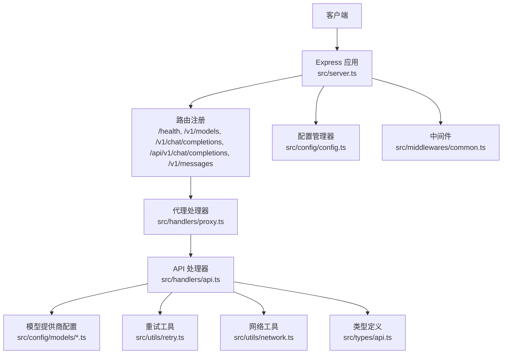
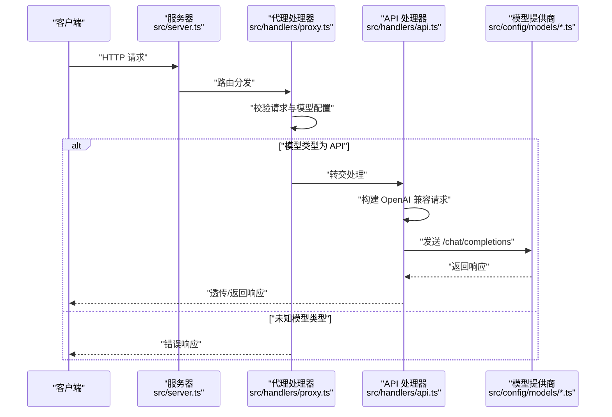
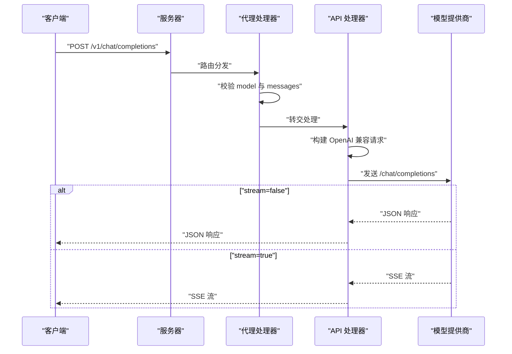
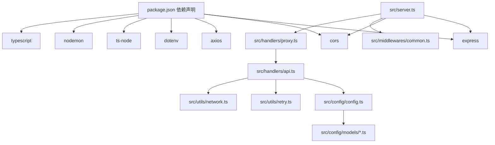

# API 接口参考

<cite>
**本文引用的文件**
- [src/server.ts](file://src/server.ts)
- [src/handlers/proxy.ts](file://src/handlers/proxy.ts)
- [src/handlers/api.ts](file://src/handlers/api.ts)
- [src/handlers/base.ts](file://src/handlers/base.ts)
- [src/middlewares/common.ts](file://src/middlewares/common.ts)
- [src/utils/network.ts](file://src/utils/network.ts)
- [src/utils/retry.ts](file://src/utils/retry.ts)
- [src/config/config.ts](file://src/config/config.ts)
- [src/config/models/index.ts](file://src/config/models/index.ts)
- [src/config/models/zhipu.ts](file://src/config/models/zhipu.ts)
- [src/config/models/kimi.ts](file://src/config/models/kimi.ts)
- [src/config/models/gemini.ts](file://src/config/models/gemini.ts)
- [src/config/models/qwen.ts](file://src/config/models/qwen.ts)
- [src/types/api.ts](file://src/types/api.ts)
- [package.json](file://package.json)
</cite>

## 目录
1. [简介](#简介)
2. [项目结构](#项目结构)
3. [核心组件](#核心组件)
4. [架构总览](#架构总览)
5. [详细组件分析](#详细组件分析)
6. [依赖关系分析](#依赖关系分析)
7. [性能考量](#性能考量)
8. [故障排查指南](#故障排查指南)
9. [结论](#结论)
10. [附录](#附录)

## 简介
本文件为 xcode-ai-proxy 的完整 API 接口参考，覆盖以下端点：
- 健康检查：GET /health
- 模型查询：GET /v1/models
- 聊天补全：POST /v1/chat/completions、POST /api/v1/chat/completions、POST /v1/messages

文档内容包括：
- 端点定义、HTTP 方法、URL 模式
- 请求/响应模式与 OpenAI 兼容格式
- 认证方式与安全注意事项
- 错误处理策略、状态码含义
- 协议特定行为（如流式响应）、重试机制
- 常见用例、客户端实现建议、性能优化技巧
- 调试工具与监控方法
- 版本信息与兼容性说明

## 项目结构
该服务基于 Express 构建，采用分层设计：
- 服务器入口负责中间件、路由注册与错误处理
- 代理处理器根据模型类型分发到具体 API 处理器
- API 处理器对接各模型提供商，统一返回 OpenAI 兼容格式
- 配置管理器集中管理应用与模型配置
- 类型定义确保请求/响应结构一致

图表来源
- [src/server.ts:29-40](file://src/server.ts#L29-L40)
- [src/handlers/proxy.ts:6-37](file://src/handlers/proxy.ts#L6-L37)
- [src/handlers/api.ts:8-28](file://src/handlers/api.ts#L8-L28)
- [src/config/config.ts:67-97](file://src/config/config.ts#L67-L97)
- [src/utils/retry.ts:1-34](file://src/utils/retry.ts#L1-L34)
- [src/utils/network.ts:35-51](file://src/utils/network.ts#L35-L51)
- [src/middlewares/common.ts:4-25](file://src/middlewares/common.ts#L4-L25)
- [src/types/api.ts:11-58](file://src/types/api.ts#L11-L58)

章节来源
- [src/server.ts:29-40](file://src/server.ts#L29-L40)
- [src/handlers/proxy.ts:6-37](file://src/handlers/proxy.ts#L6-L37)
- [src/handlers/api.ts:8-28](file://src/handlers/api.ts#L8-L28)
- [src/config/config.ts:67-97](file://src/config/config.ts#L67-L97)
- [src/utils/retry.ts:1-34](file://src/utils/retry.ts#L1-L34)
- [src/utils/network.ts:35-51](file://src/utils/network.ts#L35-L51)
- [src/middlewares/common.ts:4-25](file://src/middlewares/common.ts#L4-L25)
- [src/types/api.ts:11-58](file://src/types/api.ts#L11-L58)

## 核心组件
- 服务器与路由
  - 中间件：CORS、JSON 解析（最大 50MB）、日志中间件
  - 路由：/health、/v1/models、/v1/chat/completions、/api/v1/chat/completions、/v1/messages
- 代理处理器
  - 校验请求、解析模型配置、按模型类型分发
  - 提供模型列表与健康检查响应
- API 处理器
  - 统一 OpenAI 兼容请求格式
  - 流式/非流式响应透传或直接返回
  - Bearer 认证、中文交流指令注入、自定义系统提示注入
- 配置管理器
  - 应用配置：端口、主机、最大重试、重试延迟、请求超时、自定义系统提示
  - 模型配置：智谱、Kimi、Gemini、通义四家提供商
- 类型定义
  - ChatCompletionRequest/Response、ModelsResponse、ErrorResponse

章节来源
- [src/server.ts:23-44](file://src/server.ts#L23-L44)
- [src/server.ts:29-40](file://src/server.ts#L29-L40)
- [src/handlers/proxy.ts:9-37](file://src/handlers/proxy.ts#L9-L37)
- [src/handlers/proxy.ts:39-65](file://src/handlers/proxy.ts#L39-L65)
- [src/handlers/api.ts:9-28](file://src/handlers/api.ts#L9-L28)
- [src/handlers/api.ts:30-195](file://src/handlers/api.ts#L30-L195)
- [src/config/config.ts:51-97](file://src/config/config.ts#L51-L97)
- [src/types/api.ts:11-58](file://src/types/api.ts#L11-L58)

## 架构总览
下图展示从客户端到模型提供商的整体调用链路与关键处理节点。

图表来源
- [src/server.ts:29-40](file://src/server.ts#L29-L40)
- [src/handlers/proxy.ts:9-37](file://src/handlers/proxy.ts#L9-L37)
- [src/handlers/api.ts:30-195](file://src/handlers/api.ts#L30-L195)
- [src/config/models/zhipu.ts:20-33](file://src/config/models/zhipu.ts#L20-L33)
- [src/config/models/kimi.ts:20-33](file://src/config/models/kimi.ts#L20-L33)
- [src/config/models/gemini.ts:20-33](file://src/config/models/gemini.ts#L20-L33)
- [src/config/models/qwen.ts:20-34](file://src/config/models/qwen.ts#L20-L34)

## 详细组件分析

### 健康检查接口
- 方法与路径
  - GET /health
- 功能描述
  - 返回服务运行状态、时间戳与支持模型数量
- 响应格式
  - 字段：status（字符串）、timestamp（ISO 时间）、models（整数）
- 示例
  - 成功响应示例路径：[示例响应:59-65](file://src/handlers/proxy.ts#L59-L65)
- 状态码
  - 200：成功
- 安全与认证
  - 无需认证
- 常见用例
  - 健康探针、CI/CD 集成、容器编排

章节来源
- [src/server.ts:30-31](file://src/server.ts#L30-L31)
- [src/handlers/proxy.ts:59-65](file://src/handlers/proxy.ts#L59-L65)

### 模型查询接口
- 方法与路径
  - GET /v1/models
- 功能描述
  - 返回当前已配置的模型列表，每项包含 id、owned_by、name 等字段
- 响应格式
  - object：固定为 list
  - data：数组，元素为模型对象，包含 id、object、created、owned_by、name
- 示例
  - 响应示例路径：[示例响应:42-56](file://src/handlers/proxy.ts#L42-L56)
- 状态码
  - 200：成功
- 安全与认证
  - 无需认证
- 常见用例
  - 客户端初始化时拉取可用模型清单

章节来源
- [src/server.ts:33-34](file://src/server.ts#L33-L34)
- [src/handlers/proxy.ts:39-57](file://src/handlers/proxy.ts#L39-L57)

### 聊天补全接口
- 方法与路径
  - POST /v1/chat/completions
  - POST /api/v1/chat/completions
  - POST /v1/messages
- 功能描述
  - 接收 OpenAI 兼容的聊天请求，转发至对应模型提供商，并返回兼容响应
  - 支持流式与非流式两种响应模式
- 请求体（OpenAI 兼容）
  - model：字符串，目标模型 ID（需在已配置模型中）
  - messages：数组，消息列表（role 可为 system、user、assistant；content 为字符串或文本内容数组）
  - max_tokens、temperature、top_p、frequency_penalty、presence_penalty：可选数值参数
  - stream：布尔值，是否启用流式响应
- 响应体（OpenAI 兼容）
  - 非流式：标准 OpenAI 响应结构（choices、usage 等）
  - 流式：text/event-stream，逐条推送数据块
- 认证方式
  - 所有模型统一使用 Bearer 认证，Token 来源于对应模型配置中的 API Key
- 协议特定行为
  - 流式响应：设置 Content-Type 为 text/event-stream，保留连接
  - 非流式响应：直接返回 JSON
  - 中文交流指令与自定义系统提示会在首个 system 消息后自动注入
- 错误处理与状态码
  - 400：请求参数缺失或模型不支持
  - 500：内部错误或上游 API 失败
  - 4xx/5xx：上游返回的错误会透传（允许 4xx 通过以便调试）
- 示例
  - 请求体示例路径：[请求体定义:11-20](file://src/types/api.ts#L11-L20)
  - 响应体示例路径：[响应体定义:22-37](file://src/types/api.ts#L22-L37)
  - 流式响应示例路径：[流式响应处理:176-183](file://src/handlers/api.ts#L176-L183)
- 安全与认证
  - 使用 Bearer Token，Token 来自模型配置
  - CORS 已启用，允许跨域访问
- 性能与优化
  - 支持最大 50MB 的请求体
  - 内置指数退避重试（默认最多 3 次，每次延迟递增）
  - 请求超时可配置，默认 60 秒
- 常见用例
  - 通用聊天、多轮对话、工具调用（部分模型）
- 客户端实现建议
  - 使用 OpenAI SDK 适配本服务的兼容格式
  - 对于流式场景，注意 SSE 解析与断线重连
  - 将 Authorization: Bearer <token> 设置到请求头（token 来自模型配置）

图表来源
- [src/server.ts:36-40](file://src/server.ts#L36-L40)
- [src/handlers/proxy.ts:9-37](file://src/handlers/proxy.ts#L9-L37)
- [src/handlers/api.ts:30-195](file://src/handlers/api.ts#L30-L195)

章节来源
- [src/server.ts:36-40](file://src/server.ts#L36-L40)
- [src/handlers/proxy.ts:9-37](file://src/handlers/proxy.ts#L9-L37)
- [src/handlers/api.ts:9-28](file://src/handlers/api.ts#L9-L28)
- [src/handlers/api.ts:30-195](file://src/handlers/api.ts#L30-L195)
- [src/types/api.ts:11-37](file://src/types/api.ts#L11-L37)

## 依赖关系分析
- 运行时依赖
  - express、cors、axios、dotenv
- 开发依赖
  - @types/*、ts-node、nodemon、typescript
- 关键模块耦合
  - 服务器仅通过路由与处理器交互，低耦合高内聚
  - 代理处理器依赖配置管理器解析模型配置
  - API 处理器依赖配置管理器与重试工具

图表来源
- [package.json:14-28](file://package.json#L14-L28)
- [src/server.ts:1-7](file://src/server.ts#L1-L7)
- [src/handlers/proxy.ts:1-7](file://src/handlers/proxy.ts#L1-L7)
- [src/handlers/api.ts:1-7](file://src/handlers/api.ts#L1-L7)
- [src/config/config.ts:1-5](file://src/config/config.ts#L1-L5)
- [src/utils/retry.ts:1-34](file://src/utils/retry.ts#L1-L34)
- [src/utils/network.ts:1-51](file://src/utils/network.ts#L1-L51)

章节来源
- [package.json:14-28](file://package.json#L14-L28)
- [src/server.ts:1-7](file://src/server.ts#L1-L7)
- [src/handlers/proxy.ts:1-7](file://src/handlers/proxy.ts#L1-L7)
- [src/handlers/api.ts:1-7](file://src/handlers/api.ts#L1-L7)
- [src/config/config.ts:1-5](file://src/config/config.ts#L1-L5)
- [src/utils/retry.ts:1-34](file://src/utils/retry.ts#L1-L34)
- [src/utils/network.ts:1-51](file://src/utils/network.ts#L1-L51)

## 性能考量
- 请求体大小
  - JSON 解析上限为 50MB，满足大模型长上下文需求
- 超时与重试
  - 请求超时默认 60 秒，可通过环境变量配置
  - 默认最多重试 3 次，每次延迟递增（毫秒级）
- 流式响应
  - 流式场景减少内存占用，提升首字节到达速度
- 并发与资源
  - 服务器未内置限流，建议在反向代理层或网关层实施限流与配额控制
- 日志与可观测性
  - 内置请求日志与错误日志，便于定位问题

章节来源
- [src/server.ts:24-26](file://src/server.ts#L24-L26)
- [src/config/config.ts:51-59](file://src/config/config.ts#L51-L59)
- [src/utils/retry.ts:1-34](file://src/utils/retry.ts#L1-L34)
- [src/middlewares/common.ts:4-25](file://src/middlewares/common.ts#L4-L25)

## 故障排查指南
- 常见错误与处理
  - 缺少必要参数（model/messages）：返回 400，错误类型为 invalid_request_error
  - 模型不支持：返回 400，提示支持的模型列表
  - 上游 API 失败：返回 500，错误类型为 api_error 或 proxy_error
  - 服务器异常：统一 500，错误类型为 server_error
- 调试建议
  - 查看服务启动日志，确认监听地址与模型列表
  - 启用流式时，注意 SSE 解析与网络抓包
  - 检查环境变量与模型配置是否正确
- 监控方法
  - 结合日志与指标系统，关注错误率、响应时间、重试次数
  - 对外暴露 /health 用于健康检查

章节来源
- [src/handlers/base.ts:10-34](file://src/handlers/base.ts#L10-L34)
- [src/handlers/proxy.ts:17-36](file://src/handlers/proxy.ts#L17-L36)
- [src/handlers/api.ts:24-28](file://src/handlers/api.ts#L24-L28)
- [src/middlewares/common.ts:9-25](file://src/middlewares/common.ts#L9-L25)
- [src/server.ts:54-83](file://src/server.ts#L54-L83)

## 结论
本服务以最小耦合的方式实现了对多家模型提供商的统一代理，遵循 OpenAI 兼容格式，支持流式与非流式响应。通过可配置的重试与超时策略，以及清晰的错误处理与日志输出，能够满足多数集成场景的需求。建议在生产环境中配合反向代理进行限流、鉴权与 TLS 终止，并结合监控体系保障稳定性。

## 附录

### 端点一览表
- GET /health
  - 用途：健康检查
  - 认证：无需
  - 响应：状态、时间戳、模型数量
- GET /v1/models
  - 用途：查询可用模型
  - 认证：无需
  - 响应：模型列表
- POST /v1/chat/completions
  - 用途：聊天补全
  - 认证：Bearer Token（来自模型配置）
  - 请求：OpenAI 兼容格式
  - 响应：OpenAI 兼容格式（支持流式）
- POST /api/v1/chat/completions
  - 用途：同上（兼容路径）
- POST /v1/messages
  - 用途：同上（兼容路径）

章节来源
- [src/server.ts:30-40](file://src/server.ts#L30-L40)
- [src/handlers/proxy.ts:39-65](file://src/handlers/proxy.ts#L39-L65)
- [src/handlers/api.ts:9-28](file://src/handlers/api.ts#L9-L28)

### 认证与安全
- 认证方式
  - Bearer Token，Token 来自模型配置
- 安全建议
  - 在反向代理层启用 HTTPS 与访问控制
  - 限制模型列表与可用端点，避免暴露内部实现细节
  - 控制日志敏感信息输出

章节来源
- [src/handlers/api.ts:46-47](file://src/handlers/api.ts#L46-L47)
- [src/config/config.ts:27-49](file://src/config/config.ts#L27-L49)

### 配置与环境变量
- 应用配置
  - PORT、HOST、MAX_RETRIES、RETRY_DELAY、REQUEST_TIMEOUT、CUSTOM_SYSTEM_PROMPT
- 模型配置
  - ZHIPU_API_KEY、KIMI_API_KEY、GEMINI_API_KEY、QWEN_API_KEY
  - 可选覆盖：ZHIPU_API_URL、KIMI_API_URL、GEMINI_API_URL、QWEN_API_URL

章节来源
- [src/config/config.ts:51-59](file://src/config/config.ts#L51-L59)
- [src/config/config.ts:27-49](file://src/config/config.ts#L27-L49)

### 版本信息与兼容性
- 版本
  - 服务版本：1.0.0
- 兼容性
  - 请求/响应严格遵循 OpenAI 兼容格式
  - 支持多路径兼容端点，便于不同客户端接入
  - 未发现弃用功能

章节来源
- [package.json:3](file://package.json#L3)
- [src/server.ts:36-40](file://src/server.ts#L36-L40)
- [src/types/api.ts:11-58](file://src/types/api.ts#L11-L58)