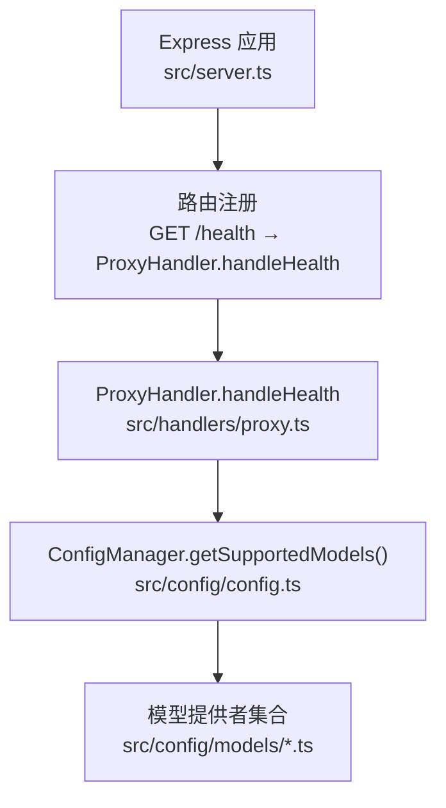
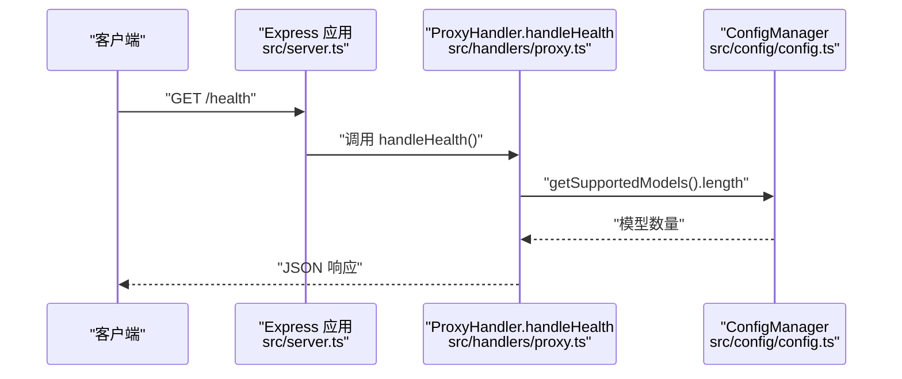
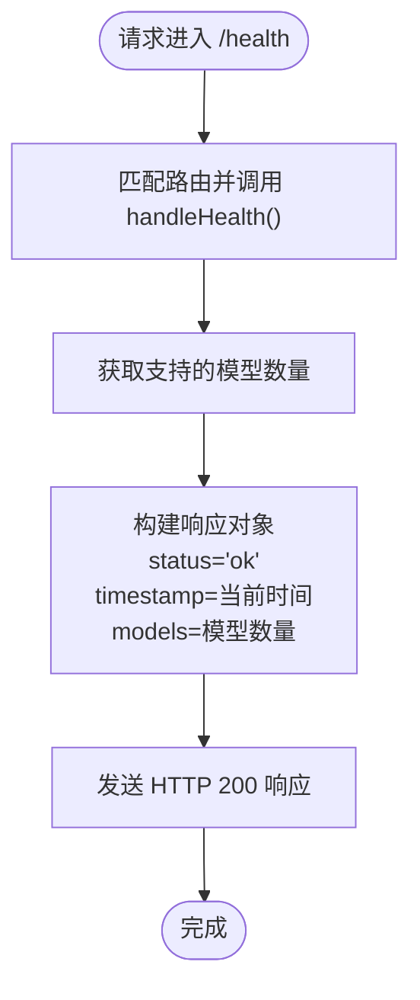
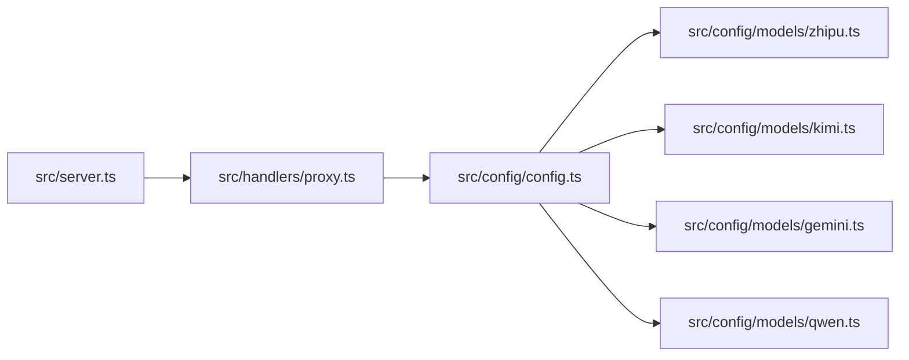

# 健康检查接口

<cite>
**本文档引用的文件**
- [src/server.ts](file://src/server.ts)
- [src/handlers/proxy.ts](file://src/handlers/proxy.ts)
- [src/handlers/base.ts](file://src/handlers/base.ts)
- [src/config/config.ts](file://src/config/config.ts)
- [src/config/models/base.ts](file://src/config/models/base.ts)
- [src/config/models/zhipu.ts](file://src/config/models/zhipu.ts)
- [src/config/models/kimi.ts](file://src/config/models/kimi.ts)
- [src/config/models/gemini.ts](file://src/config/models/gemini.ts)
- [src/config/models/qwen.ts](file://src/config/models/qwen.ts)
- [package.json](file://package.json)
</cite>

## 目录
1. [简介](#简介)
2. [项目结构](#项目结构)
3. [核心组件](#核心组件)
4. [架构总览](#架构总览)
5. [详细组件分析](#详细组件分析)
6. [依赖关系分析](#依赖关系分析)
7. [性能考虑](#性能考虑)
8. [故障排查指南](#故障排查指南)
9. [结论](#结论)
10. [附录](#附录)

## 简介
本文件为健康检查接口 GET /health 的详细 API 文档。该接口用于检查服务器运行状态，返回包含服务器状态、检查时间以及支持的模型数量等信息。文档涵盖接口用途、响应结构、最佳实践、客户端调用示例（curl 与 JavaScript fetch），以及在负载均衡与容器编排场景中的应用建议。

## 项目结构
- 服务器入口与路由注册位于 [src/server.ts](file://src/server.ts)，其中定义了 GET /health 路由并绑定到 ProxyHandler 的健康检查处理函数。
- 健康检查的具体实现位于 [src/handlers/proxy.ts](file://src/handlers/proxy.ts) 中的 handleHealth 方法。
- 基类处理器与错误发送逻辑位于 [src/handlers/base.ts](file://src/handlers/base.ts)。
- 配置管理与模型列表来源于 [src/config/config.ts](file://src/config/config.ts)，模型提供者定义于 [src/config/models/](file://src/config/models/) 下的各文件中。

图表来源
- [src/server.ts:29-40](file://src/server.ts#L29-L40)
- [src/handlers/proxy.ts:59-65](file://src/handlers/proxy.ts#L59-L65)
- [src/config/config.ts:107-113](file://src/config/config.ts#L107-L113)

章节来源
- [src/server.ts:29-40](file://src/server.ts#L29-L40)
- [src/handlers/proxy.ts:59-65](file://src/handlers/proxy.ts#L59-L65)
- [src/config/config.ts:107-113](file://src/config/config.ts#L107-L113)

## 核心组件
- 健康检查路由：在服务器启动时注册 GET /health，绑定至 ProxyHandler.handleHealth。
- 健康检查处理器：返回固定结构的 JSON，包含 status、timestamp 和 models 字段。
- 配置管理：提供 getSupportedModels() 获取当前可用模型总数，供健康检查返回 models 字段使用。

章节来源
- [src/server.ts:29-40](file://src/server.ts#L29-L40)
- [src/handlers/proxy.ts:59-65](file://src/handlers/proxy.ts#L59-L65)
- [src/config/config.ts:107-113](file://src/config/config.ts#L107-L113)

## 架构总览
下图展示了从客户端发起健康检查请求到服务器返回响应的整体流程，以及与配置管理的关系。

图表来源
- [src/server.ts:30-31](file://src/server.ts#L30-L31)
- [src/handlers/proxy.ts:59-65](file://src/handlers/proxy.ts#L59-L65)
- [src/config/config.ts:111-113](file://src/config/config.ts#L111-L113)

## 详细组件分析

### 接口定义
- 方法与路径：GET /health
- 功能：检查服务器运行状态，返回服务器状态、检查时间以及支持的模型数量。
- 成功响应：HTTP 200 OK
- 错误响应：服务器内部错误时返回 500，但健康检查本身不会触发 500（除非路由或处理器异常）。

章节来源
- [src/server.ts:30-31](file://src/server.ts#L30-L31)
- [src/handlers/proxy.ts:59-65](file://src/handlers/proxy.ts#L59-L65)

### 响应结构
- 字段说明
  - status：字符串，表示服务器状态。健康检查返回固定值 "ok"。
  - timestamp：字符串，ISO 8601 时间戳，表示本次健康检查的时间。
  - models：整数，表示当前服务器支持的模型数量（即 ConfigManager.getSupportedModels().length）。
- 示例响应（字段说明，不含具体数值）
  - status: "ok"
  - timestamp: "2025-01-01T00:00:00.000Z"
  - models: 4

章节来源
- [src/handlers/proxy.ts:60-64](file://src/handlers/proxy.ts#L60-L64)
- [src/config/config.ts:111-113](file://src/config/config.ts#L111-L113)

### 客户端调用示例

- curl 命令
  - curl -sS "http://localhost:3000/health"
  - 注意：将 localhost:3000 替换为实际部署地址与端口。

- JavaScript fetch 调用
  - fetch("http://localhost:3000/health")
    .then(response => response.json())
    .then(data => {
      console.log("状态:", data.status);
      console.log("时间:", data.timestamp);
      console.log("模型数:", data.models);
    })
    .catch(error => console.error("请求失败:", error));

章节来源
- [src/server.ts:49-51](file://src/server.ts#L49-L51)

### 健康检查最佳实践
- 负载均衡探活：将 /health 作为 Liveness/Readiness 探针路径，定期轮询以判断实例是否存活与就绪。
- 容器编排：在 Kubernetes 等平台中，可将 /health 作为 readinessProbe 的 HTTPGet 目标，确保仅在 models > 0 且服务正常时接收流量。
- 健康阈值：结合业务需求设置探测间隔与超时，避免频繁探活造成压力。
- 日志与监控：记录 /health 的响应时间与成功率，纳入告警体系。

[本节为通用实践说明，无需特定文件引用]

### 数据流与处理逻辑
- 客户端请求到达 /health。
- Express 路由匹配到 ProxyHandler.handleHealth。
- 处理器调用 ConfigManager.getSupportedModels().length 获取模型数量。
- 返回包含 status、timestamp、models 的 JSON 响应。

图表来源
- [src/server.ts:30-31](file://src/server.ts#L30-L31)
- [src/handlers/proxy.ts:59-65](file://src/handlers/proxy.ts#L59-L65)
- [src/config/config.ts:111-113](file://src/config/config.ts#L111-L113)

## 依赖关系分析
- 路由层依赖处理器层：/health 路由绑定到 ProxyHandler.handleHealth。
- 处理器层依赖配置管理层：handleHealth 使用 ConfigManager.getSupportedModels()。
- 配置管理层聚合多个模型提供者：Zhipu、Kimi、Gemini、Qwen 提供模型配置，最终汇总为可用模型列表。

图表来源
- [src/server.ts:29-40](file://src/server.ts#L29-L40)
- [src/handlers/proxy.ts:59-65](file://src/handlers/proxy.ts#L59-L65)
- [src/config/config.ts:67-97](file://src/config/config.ts#L67-L97)
- [src/config/models/zhipu.ts:20-33](file://src/config/models/zhipu.ts#L20-L33)
- [src/config/models/kimi.ts:20-33](file://src/config/models/kimi.ts#L20-L33)
- [src/config/models/gemini.ts:20-33](file://src/config/models/gemini.ts#L20-L33)
- [src/config/models/qwen.ts:20-34](file://src/config/models/qwen.ts#L20-L34)

章节来源
- [src/server.ts:29-40](file://src/server.ts#L29-L40)
- [src/handlers/proxy.ts:59-65](file://src/handlers/proxy.ts#L59-L65)
- [src/config/config.ts:67-97](file://src/config/config.ts#L67-L97)

## 性能考虑
- 健康检查为轻量级操作，不涉及外部 API 调用，通常响应时间极短。
- 建议在高并发场景下合理设置探活频率，避免过度探活导致资源浪费。
- 如需扩展，可在响应中加入额外指标（如内存、CPU 使用率），但需确保不影响健康检查的快速性与稳定性。

[本节为通用性能建议，无需特定文件引用]

## 故障排查指南
- 无法访问 /health
  - 检查服务器是否已启动并监听对应主机与端口。
  - 确认防火墙或安全组未阻断端口。
- 响应异常
  - 查看服务器日志，确认路由是否正确绑定。
  - 若出现 500 错误，检查处理器与配置管理器是否存在异常。
- 模型数量为 0
  - 检查环境变量与模型提供者配置，确保至少配置了一个有效 API 密钥。
  - 确认模型提供者处于可用状态（isAvailable 返回 true）。

章节来源
- [src/server.ts:49-51](file://src/server.ts#L49-L51)
- [src/config/config.ts:27-49](file://src/config/config.ts#L27-L49)
- [src/config/models/base.ts:12-13](file://src/config/models/base.ts#L12-L13)

## 结论
GET /health 接口提供了简洁可靠的服务器健康状态检查能力，返回关键运行指标（状态、时间、模型数量）。结合负载均衡与容器编排的探活机制，可有效保障服务的可用性与稳定性。建议在生产环境中将其作为默认的健康检查入口，并配合监控与告警体系使用。

[本节为总结性内容，无需特定文件引用]

## 附录

### 端点定义
- 方法：GET
- 路径：/health
- 成功响应：200 OK
- 响应体字段：
  - status：字符串，固定为 "ok"
  - timestamp：字符串，ISO 8601 时间戳
  - models：整数，当前支持的模型数量

章节来源
- [src/handlers/proxy.ts:59-65](file://src/handlers/proxy.ts#L59-L65)

### 支持的模型提供者
- 智谱（Zhipu）
  - 模型 ID：glm-4.5
  - 提供者名称：zhipu
- Kimi
  - 模型 ID：kimi-k2-0905-preview
  - 提供者名称：kimi
- Gemini
  - 模型 ID：gemini-2.5-pro
  - 提供者名称：google
- Qwen
  - 模型 ID：qwen-max
  - 提供者名称：qwen

章节来源
- [src/config/models/zhipu.ts:20-33](file://src/config/models/zhipu.ts#L20-L33)
- [src/config/models/kimi.ts:20-33](file://src/config/models/kimi.ts#L20-L33)
- [src/config/models/gemini.ts:20-33](file://src/config/models/gemini.ts#L20-L33)
- [src/config/models/qwen.ts:20-34](file://src/config/models/qwen.ts#L20-L34)

### 运行与开发信息
- 启动脚本与开发模式参考 [package.json](file://package.json) 中的 scripts 字段。
- 服务器默认监听端口与主机可通过环境变量配置，详见 [src/config/config.ts](file://src/config/config.ts)。

章节来源
- [package.json:6-12](file://package.json#L6-L12)
- [src/config/config.ts:51-59](file://src/config/config.ts#L51-L59)