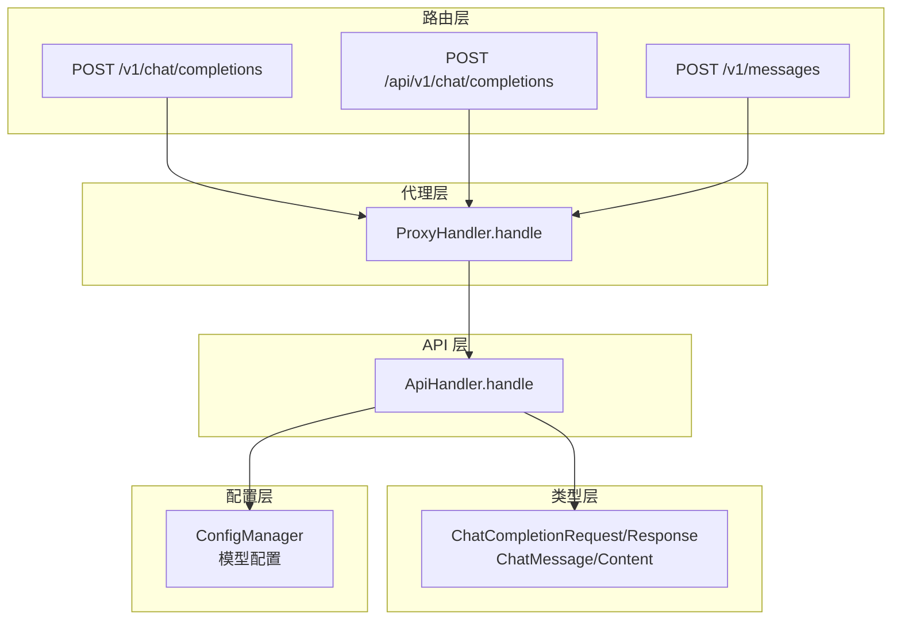
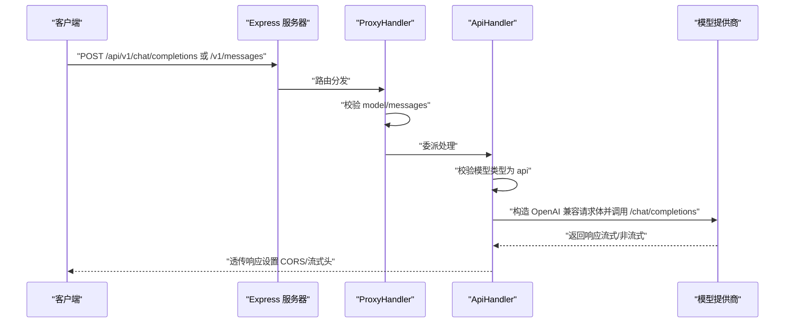
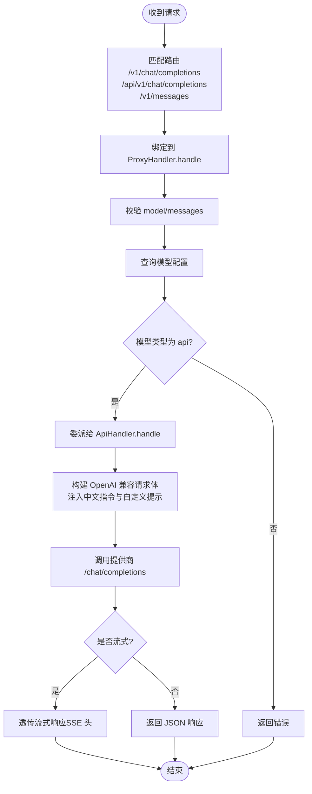
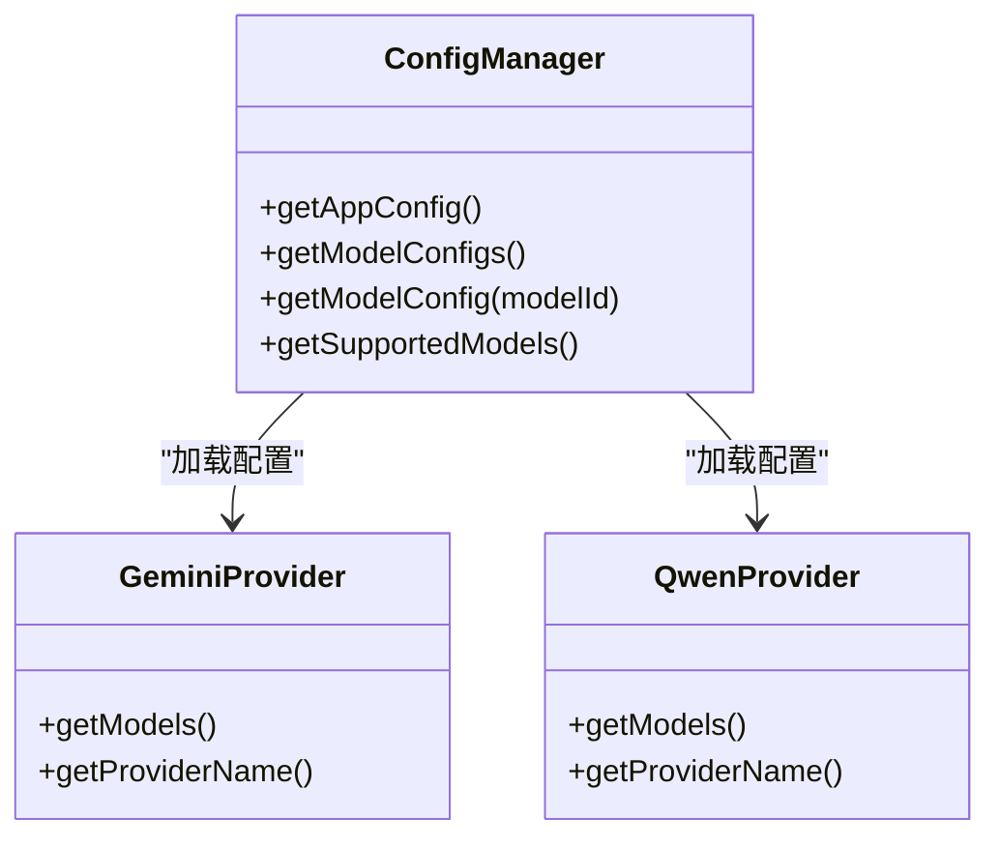
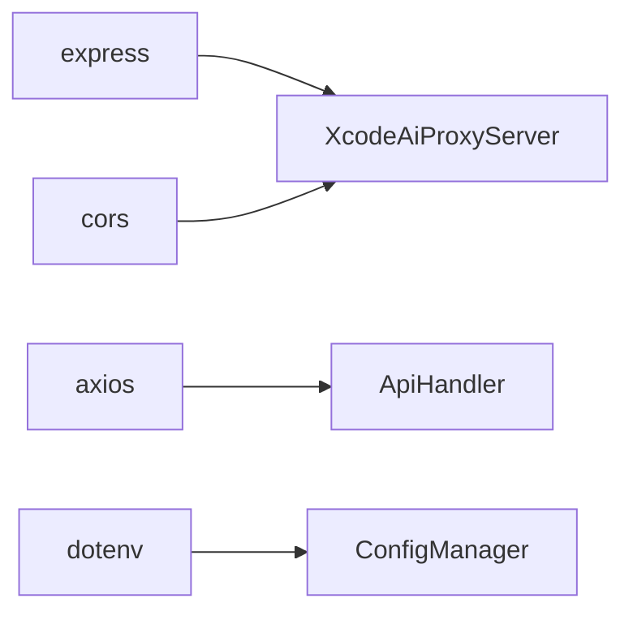

# 兼容性端点

<cite>
**本文引用的文件**
- [src/server.ts](file://src/server.ts)
- [src/handlers/proxy.ts](file://src/handlers/proxy.ts)
- [src/handlers/api.ts](file://src/handlers/api.ts)
- [src/handlers/base.ts](file://src/handlers/base.ts)
- [src/types/api.ts](file://src/types/api.ts)
- [src/config/config.ts](file://src/config/config.ts)
- [src/config/models/gemini.ts](file://src/config/models/gemini.ts)
- [src/config/models/qwen.ts](file://src/config/models/qwen.ts)
- [package.json](file://package.json)
</cite>

## 目录
1. [简介](#简介)
2. [项目结构](#项目结构)
3. [核心组件](#核心组件)
4. [架构总览](#架构总览)
5. [详细组件分析](#详细组件分析)
6. [依赖关系分析](#依赖关系分析)
7. [性能考量](#性能考量)
8. [故障排查指南](#故障排查指南)
9. [结论](#结论)
10. [附录](#附录)

## 简介
本文件面向兼容性端点 POST /api/v1/chat/completions 与 POST /v1/messages 的使用与迁移。这些端点并非业务主接口，而是为了兼容其他 AI 服务（尤其是 OpenAI 兼容生态）而提供的额外路由。它们与主聊天补全接口（POST /v1/chat/completions）共享同一处理链路，即统一由代理处理器转发到具体模型提供商的 OpenAI 兼容端点。

- 为什么需要兼容性端点
  - 许多第三方客户端、SDK 或工具默认调用 OpenAI 风格的路径，如 /api/v1/chat/completions 或 /v1/messages。若直接对接本项目的主路径，会导致兼容性问题。
  - 通过在服务层增加这些兼容路由，可零改动或最小改动地适配现有客户端，降低迁移成本。

- 使用场景
  - 已有基于 OpenAI 兼容路径的脚本、自动化工具或 IDE 插件。
  - 需要快速替换后端供应商但不希望修改上层调用逻辑。
  - 在多供应商混用或灰度迁移阶段，提供平滑过渡。

- 迁移建议
  - 优先迁移到主路径 /v1/chat/completions，以获得更一致的语义与未来扩展性。
  - 在过渡期内同时支持多个路径，逐步下线兼容路径。

## 项目结构
- 路由层：在服务器启动时注册多个兼容路径，均指向同一代理处理器。
- 代理层：解析请求、校验参数、选择模型配置，并将请求转交给 API 处理器。
- API 层：按 OpenAI 兼容格式构造请求，调用各模型提供商的 /chat/completions 接口，透传流式或非流式响应。
- 类型层：统一定义聊天消息、请求与响应的数据结构。
- 配置层：集中管理应用配置与模型提供商配置，支持多厂商模型。

**图表来源**
- [src/server.ts:29-40](file://src/server.ts#L29-L40)
- [src/handlers/proxy.ts:9-37](file://src/handlers/proxy.ts#L9-L37)
- [src/handlers/api.ts:9-28](file://src/handlers/api.ts#L9-L28)
- [src/types/api.ts:11-37](file://src/types/api.ts#L11-L37)
- [src/config/config.ts:69-99](file://src/config/config.ts#L69-L99)

**章节来源**
- [src/server.ts:29-40](file://src/server.ts#L29-L40)
- [src/handlers/proxy.ts:9-37](file://src/handlers/proxy.ts#L9-L37)
- [src/handlers/api.ts:9-28](file://src/handlers/api.ts#L9-L28)
- [src/types/api.ts:11-37](file://src/types/api.ts#L11-L37)
- [src/config/config.ts:69-99](file://src/config/config.ts#L69-L99)

## 核心组件
- 路由注册
  - 在服务器初始化时，注册三个等价的聊天补全端点，全部绑定到代理处理器的 handle 方法。
  - 主路径为 /v1/chat/completions；兼容路径为 /api/v1/chat/completions 与 /v1/messages。

- 代理处理器
  - 校验请求参数（model、messages），查询模型配置。
  - 将请求委派给 API 处理器进行实际转发。

- API 处理器
  - 校验模型类型为 api。
  - 构造 OpenAI 兼容请求体，注入中文交流指令与自定义系统提示（仅在首次系统消息后插入一次）。
  - 调用对应提供商的 /chat/completions 接口，透传流式或非流式响应。
  - 对 4xx/5xx 响应进行错误解析与回传。

- 数据类型
  - 统一的聊天消息结构与 OpenAI 兼容的请求/响应字段，确保兼容性端点与主路径行为一致。

**章节来源**
- [src/server.ts:36-40](file://src/server.ts#L36-L40)
- [src/handlers/proxy.ts:9-37](file://src/handlers/proxy.ts#L9-L37)
- [src/handlers/api.ts:9-28](file://src/handlers/api.ts#L9-L28)
- [src/types/api.ts:11-37](file://src/types/api.ts#L11-L37)

## 架构总览
兼容性端点与主路径共享同一处理链：HTTP 请求进入后，统一经由代理处理器进行参数校验与模型选择，再由 API 处理器完成对上游模型提供商的调用。该设计保证了：
- 行为一致性：兼容端点与主路径在请求格式、错误处理、流式透传等方面保持一致。
- 易维护性：新增模型或调整上游协议只需在 API 层处理，无需改动路由层。

**图表来源**
- [src/server.ts:36-40](file://src/server.ts#L36-L40)
- [src/handlers/proxy.ts:9-37](file://src/handlers/proxy.ts#L9-L37)
- [src/handlers/api.ts:30-195](file://src/handlers/api.ts#L30-L195)

## 详细组件分析

### 兼容性端点与主路径的关系
- 路由绑定
  - 三个端点均指向同一代理处理器方法，确保行为一致。
- 请求/响应格式
  - 兼容性端点与主路径使用相同的请求体结构与响应结构，满足 OpenAI 兼容规范。
- 流式支持
  - 当客户端设置 stream=true 时，服务端会透传上游的流式响应，保持事件流格式不变。

**图表来源**
- [src/server.ts:36-40](file://src/server.ts#L36-L40)
- [src/handlers/proxy.ts:9-37](file://src/handlers/proxy.ts#L9-L37)
- [src/handlers/api.ts:30-195](file://src/handlers/api.ts#L30-L195)
- [src/types/api.ts:11-37](file://src/types/api.ts#L11-L37)

**章节来源**
- [src/server.ts:36-40](file://src/server.ts#L36-L40)
- [src/handlers/proxy.ts:9-37](file://src/handlers/proxy.ts#L9-L37)
- [src/handlers/api.ts:30-195](file://src/handlers/api.ts#L30-L195)
- [src/types/api.ts:11-37](file://src/types/api.ts#L11-L37)

### 请求/响应格式对比与差异说明
- 共同点
  - 请求体字段：model、messages、max_tokens、temperature、stream、top_p、frequency_penalty、presence_penalty。
  - 响应体字段：id、object、created、model、choices（含 message 与 finish_reason）、usage（prompt_tokens、completion_tokens、total_tokens）。
- 兼容性端点与主路径差异
  - 路径不同，行为完全一致。
  - 兼容性端点的存在仅为兼容第三方客户端的默认调用路径。

- 与 OpenAI 原生的差异
  - 本项目在首次系统消息后自动注入中文交流指令与自定义系统提示，以确保对话始终使用中文。
  - 某些提供商（如 Qwen）对空的 tools 数组有特殊要求，已在请求构建时进行清理。

**章节来源**
- [src/types/api.ts:11-37](file://src/types/api.ts#L11-L37)
- [src/handlers/api.ts:59-100](file://src/handlers/api.ts#L59-L100)

### 与模型提供商的集成
- 配置加载
  - 应用启动时加载环境变量，初始化应用配置与模型配置。
  - 支持智谱、Kimi、Gemini、Qwen 等多家提供商，统一映射为 OpenAI 兼容格式。
- 兼容端点的上游调用
  - 所有兼容端点最终都会调用各提供商的 /chat/completions 接口。
  - 通过统一的请求头与请求体格式，屏蔽不同提供商的差异。

**图表来源**
- [src/config/config.ts:69-99](file://src/config/config.ts#L69-L99)
- [src/config/models/gemini.ts:20-33](file://src/config/models/gemini.ts#L20-L33)
- [src/config/models/qwen.ts:20-33](file://src/config/models/qwen.ts#L20-L33)

**章节来源**
- [src/config/config.ts:69-99](file://src/config/config.ts#L69-L99)
- [src/config/models/gemini.ts:20-33](file://src/config/models/gemini.ts#L20-L33)
- [src/config/models/qwen.ts:20-33](file://src/config/models/qwen.ts#L20-L33)

### 迁移指南
- 从 /api/v1/chat/completions 或 /v1/messages 迁移到 /v1/chat/completions
  - 修改客户端或工具的请求地址为 /v1/chat/completions。
  - 保持请求体结构不变，即可无缝切换。
- 迁移验证
  - 使用健康检查与模型列表接口确认服务可用与模型加载正常。
  - 通过日志观察请求是否被正确路由至代理处理器与 API 处理器。

- 迁移后的最佳实践
  - 固化使用 /v1/chat/completions 作为统一入口，减少路径歧义。
  - 如需保留兼容路径，建议在后续版本中逐步下线，避免长期维护成本。

**章节来源**
- [src/server.ts:36-40](file://src/server.ts#L36-L40)
- [src/handlers/proxy.ts:39-66](file://src/handlers/proxy.ts#L39-L66)

## 依赖关系分析
- 依赖概览
  - Express 提供 Web 服务与路由能力。
  - Axios 用于向模型提供商发起 HTTP 请求。
  - CORS 中间件允许跨域访问。
  - dotenv 用于加载环境变量。

**图表来源**
- [package.json:14-28](file://package.json#L14-L28)
- [src/server.ts:1-8](file://src/server.ts#L1-L8)
- [src/handlers/api.ts:1-7](file://src/handlers/api.ts#L1-L7)
- [src/config/config.ts:1-6](file://src/config/config.ts#L1-L6)

**章节来源**
- [package.json:14-28](file://package.json#L14-L28)
- [src/server.ts:1-8](file://src/server.ts#L1-L8)
- [src/handlers/api.ts:1-7](file://src/handlers/api.ts#L1-L7)
- [src/config/config.ts:1-6](file://src/config/config.ts#L1-L6)

## 性能考量
- 流式响应
  - 当启用流式时，服务端会透传上游的流式数据，避免额外的缓冲与转换，降低延迟。
- 超时与重试
  - 可配置请求超时与最大重试次数，提升网络波动下的稳定性。
- 日志与可观测性
  - 关键节点输出请求与响应信息，便于定位问题与优化性能。

[本节为通用指导，无需特定文件引用]

## 故障排查指南
- 常见错误类型
  - invalid_request_error：缺少 model 或 messages，或格式不合法。
  - api_error：上游模型提供商返回错误，服务端会尝试读取流式错误内容并回传。
  - proxy_error：代理层内部异常。
- 定位步骤
  - 查看服务启动日志，确认路由注册与模型加载情况。
  - 检查请求体是否符合 ChatCompletionRequest 规范。
  - 若为流式错误，关注 API 层对流式错误响应的读取与回传逻辑。

**章节来源**
- [src/handlers/base.ts:24-34](file://src/handlers/base.ts#L24-L34)
- [src/handlers/api.ts:124-164](file://src/handlers/api.ts#L124-L164)

## 结论
兼容性端点 /api/v1/chat/completions 与 /v1/messages 通过统一的代理与 API 处理链路，实现了与 OpenAI 兼容生态的无缝对接。它们的存在降低了迁移成本，但建议尽快迁移到主路径 /v1/chat/completions，以获得更清晰的语义与更好的可维护性。在迁移过程中，保持请求体结构不变即可实现零侵入切换。

[本节为总结性内容，无需特定文件引用]

## 附录
- 健康检查与模型列表
  - 健康检查：GET /health
  - 模型列表：GET /v1/models
- 环境变量与配置
  - 应用配置：端口、主机、最大重试次数、重试延迟、请求超时、自定义系统提示。
  - 模型配置：各提供商的 API Key 与 API URL。

**章节来源**
- [src/server.ts:31-34](file://src/server.ts#L31-L34)
- [src/config/config.ts:53-67](file://src/config/config.ts#L53-L67)
- [src/config/config.ts:69-99](file://src/config/config.ts#L69-L99)