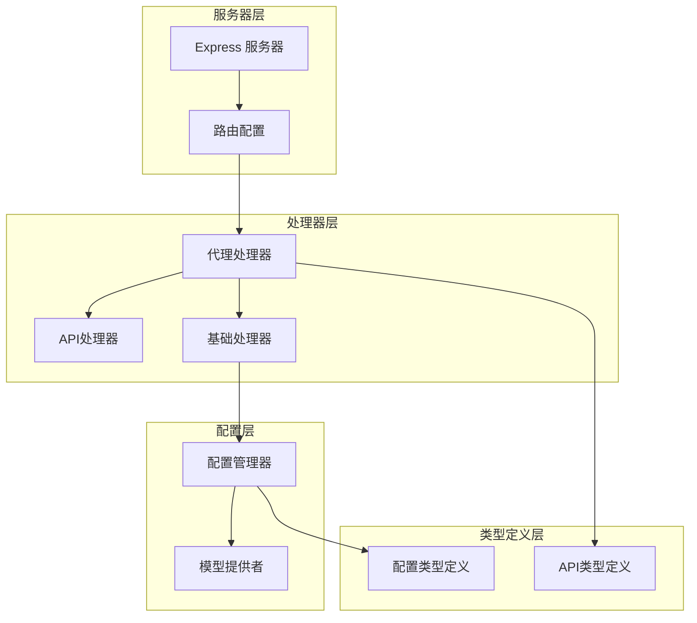
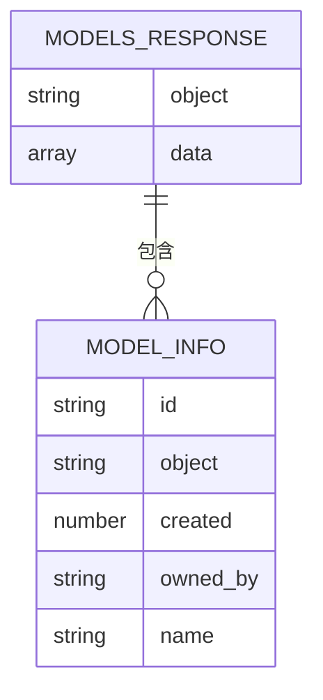
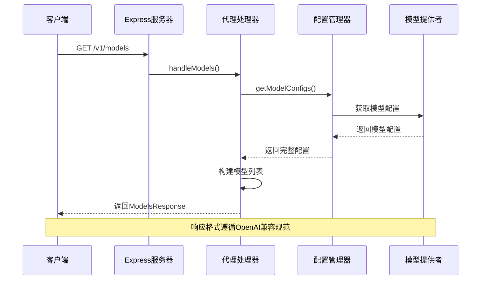
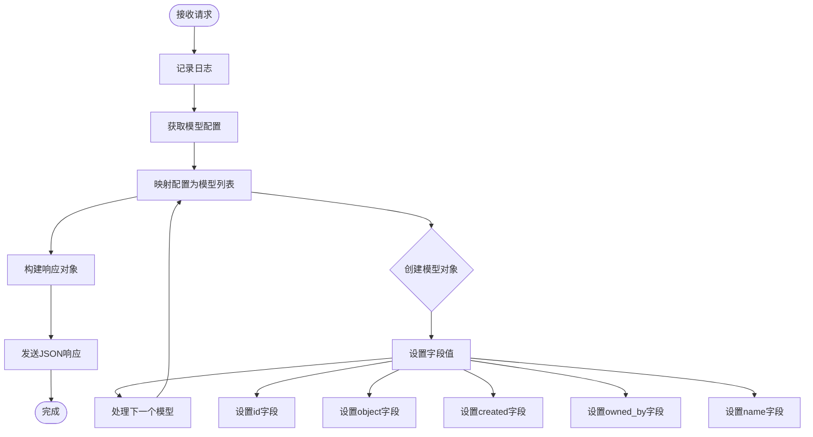
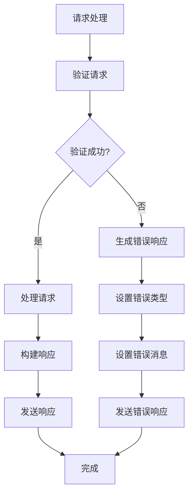
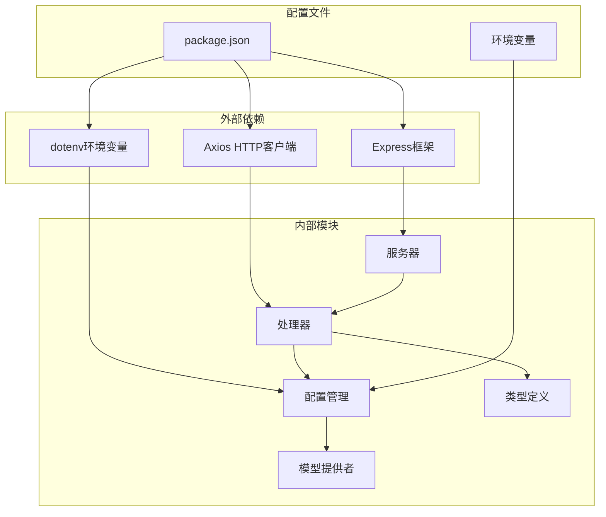
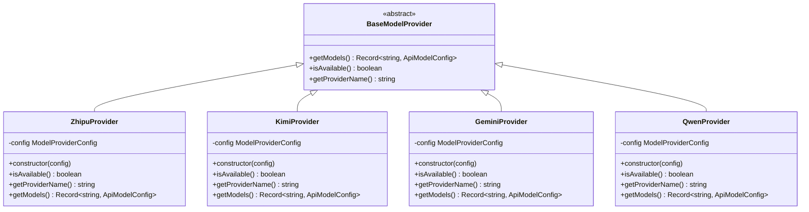

# 模型查询接口

<cite>
**本文档引用的文件**
- [server.ts](file://src/server.ts)
- [proxy.ts](file://src/handlers/proxy.ts)
- [base.ts](file://src/handlers/base.ts)
- [config.ts](file://src/config/config.ts)
- [api.ts](file://src/handlers/api.ts)
- [api.ts 类型定义](file://src/types/api.ts)
- [配置类型定义](file://src/types/config.ts)
- [模型提供者基类](file://src/config/models/base.ts)
- [Qwen 模型提供者](file://src/config/models/qwen.ts)
- [Gemini 模型提供者](file://src/config/models/gemini.ts)
- [Kimi 模型提供者](file://src/config/models/kimi.ts)
- [智谱模型提供者](file://src/config/models/zhipu.ts)
- [package.json](file://package.json)
</cite>

## 目录
1. [简介](#简介)
2. [项目结构](#项目结构)
3. [核心组件](#核心组件)
4. [架构概览](#架构概览)
5. [详细组件分析](#详细组件分析)
6. [依赖关系分析](#依赖关系分析)
7. [性能考虑](#性能考虑)
8. [故障排除指南](#故障排除指南)
9. [结论](#结论)

## 简介

本文档详细描述了模型查询接口 `GET /v1/models` 的完整 API 文档。该接口用于获取支持的 AI 模型列表，为开发者提供当前代理服务所支持的所有 AI 模型信息。该接口遵循 OpenAI 兼容的响应格式，返回标准的模型列表结构，便于集成到各种 AI 应用程序中。

## 项目结构

该项目采用模块化架构设计，主要包含以下核心模块：



**图表来源**
- [server.ts:29-40](file://src/server.ts#L29-L40)
- [proxy.ts:6-37](file://src/handlers/proxy.ts#L6-L37)
- [config.ts:7-27](file://src/config/config.ts#L7-L27)

**章节来源**
- [server.ts:1-88](file://src/server.ts#L1-L88)
- [package.json:1-30](file://package.json#L1-L30)

## 核心组件

### 模型查询接口概述

模型查询接口 `GET /v1/models` 是一个只读接口，无需请求参数即可调用。该接口返回当前代理服务支持的所有 AI 模型的完整列表。

### 接口规范

- **HTTP 方法**: GET
- **端点**: `/v1/models`
- **请求参数**: 无
- **响应格式**: JSON
- **响应类型**: `ModelsResponse`

### 响应数据结构

模型查询接口返回的标准响应格式如下：



**图表来源**
- [api.ts 类型定义:47-50](file://src/types/api.ts#L47-L50)
- [api.ts 类型定义:39-45](file://src/types/api.ts#L39-L45)

**章节来源**
- [proxy.ts:39-57](file://src/handlers/proxy.ts#L39-L57)
- [api.ts 类型定义:39-50](file://src/types/api.ts#L39-L50)

## 架构概览

模型查询接口在整个系统架构中的位置和交互流程如下：



**图表来源**
- [server.ts:33-34](file://src/server.ts#L33-L34)
- [proxy.ts:39-57](file://src/handlers/proxy.ts#L39-L57)
- [config.ts:105-115](file://src/config/config.ts#L105-L115)

## 详细组件分析

### 代理处理器实现

代理处理器负责处理模型查询请求，其核心实现逻辑如下：



**图表来源**
- [proxy.ts:39-57](file://src/handlers/proxy.ts#L39-L57)
- [proxy.ts:42-49](file://src/handlers/proxy.ts#L42-L49)

### 模型配置与实际服务提供商关系

每个模型配置都明确关联到具体的服务提供商：

| 模型ID | 提供商 | 实际服务 | API端点 |
|--------|--------|----------|---------|
| `glm-4.5` | 智谱AI | BigModel | `https://open.bigmodel.cn/api/paas/v4` |
| `kimi-k2-0905-preview` | Moonshot AI | Kimi | `https://api.moonshot.cn/v1` |
| `gemini-2.5-pro` | Google AI | Gemini | `https://generativelanguage.googleapis.com/v1beta/openai` |
| `qwen-max` | 阿里云 | DashScope | `https://dashscope.aliyuncs.com/compatible-mode/v1` |

### 响应示例

以下是完整的响应示例，展示了模型查询接口的标准输出格式：

```json
{
  "object": "list",
  "data": [
    {
      "id": "glm-4.5",
      "object": "model",
      "created": 1677610602,
      "owned_by": "zhipu",
      "name": "GLM-4.5"
    },
    {
      "id": "kimi-k2-0905-preview",
      "object": "model",
      "created": 1677610602,
      "owned_by": "kimi",
      "name": "Kimi K2"
    },
    {
      "id": "gemini-2.5-pro",
      "object": "model",
      "created": 1677610602,
      "owned_by": "google",
      "name": "Gemini 2.5 Pro"
    },
    {
      "id": "qwen-max",
      "object": "model",
      "created": 1677610602,
      "owned_by": "qwen",
      "name": "Qwen Max"
    }
  ]
}
```

### 使用场景和最佳实践

#### 场景1：解析模型列表
```javascript
// JavaScript 示例
fetch('http://localhost:3000/v1/models')
  .then(response => response.json())
  .then(data => {
    console.log('可用模型数量:', data.data.length);
    data.data.forEach(model => {
      console.log(`- ${model.id}: ${model.name} (提供商: ${model.owned_by})`);
    });
  });
```

#### 场景2：根据模型类型进行路由
```javascript
// 根据提供商类型选择不同的API端点
function getModelEndpoint(modelId) {
  const model = supportedModels.find(m => m.id === modelId);
  switch(model.owned_by) {
    case 'zhipu':
      return 'https://open.bigmodel.cn/api/paas/v4';
    case 'kimi':
      return 'https://api.moonshot.cn/v1';
    case 'google':
      return 'https://generativelanguage.googleapis.com/v1beta/openai';
    case 'qwen':
      return 'https://dashscope.aliyuncs.com/compatible-mode/v1';
    default:
      throw new Error(`未知提供商: ${model.owned_by}`);
  }
}
```

#### 场景3：动态配置模型
```javascript
// 动态添加新模型
function addCustomModel(modelId, provider, apiKey, apiUrl) {
  const config = ConfigManager.getInstance();
  const providerClass = getProviderClass(provider);
  const providerInstance = new providerClass({ apiKey, apiUrl });
  
  const customModels = providerInstance.getModels();
  Object.assign(config.getModelConfigs(), customModels);
}
```

**章节来源**
- [proxy.ts:39-57](file://src/handlers/proxy.ts#L39-L57)
- [config.ts:69-99](file://src/config/config.ts#L69-L99)

### 错误处理机制

模型查询接口的错误处理遵循统一的错误响应格式：



**图表来源**
- [base.ts:24-34](file://src/handlers/base.ts#L24-L34)
- [base.ts:10-22](file://src/handlers/base.ts#L10-L22)

**章节来源**
- [base.ts:24-34](file://src/handlers/base.ts#L24-L34)
- [proxy.ts:39-57](file://src/handlers/proxy.ts#L39-L57)

## 依赖关系分析

### 核心依赖关系图



**图表来源**
- [package.json:14-28](file://package.json#L14-L28)
- [server.ts:1-6](file://src/server.ts#L1-L6)
- [config.ts:1-5](file://src/config/config.ts#L1-L5)

### 模型提供者架构



**图表来源**
- [config/models/base.ts:3-7](file://src/config/models/base.ts#L3-L7)
- [config/models/zhipu.ts:4-33](file://src/config/models/zhipu.ts#L4-L33)
- [config/models/kimi.ts:4-33](file://src/config/models/kimi.ts#L4-L33)
- [config/models/gemini.ts:4-33](file://src/config/models/gemini.ts#L4-L33)
- [config/models/qwen.ts:4-33](file://src/config/models/qwen.ts#L4-L33)

**章节来源**
- [config/models/base.ts:1-13](file://src/config/models/base.ts#L1-L13)
- [config/models/index.ts:1-5](file://src/config/models/index.ts#L1-L5)

## 性能考虑

### 响应时间优化

模型查询接口采用内存缓存策略，直接从配置管理器获取模型配置，无需额外的网络请求或数据库查询。由于配置在应用启动时一次性加载，后续的模型查询请求具有极低的延迟特性。

### 内存使用优化

- 模型配置以键值对形式存储在内存中
- 每个模型对象仅包含必要的元数据信息
- 配置加载完成后，模型列表的构建操作为 O(n) 时间复杂度

### 可扩展性设计

系统设计支持动态添加新的模型提供者，通过实现 BaseModelProvider 抽象类即可无缝集成到现有架构中，无需修改核心逻辑。

## 故障排除指南

### 常见问题及解决方案

#### 问题1：接口返回空列表
**症状**: 模型查询返回空的 data 数组
**可能原因**:
- 未正确配置任何 API 密钥
- 模型提供者被禁用
- 环境变量配置错误

**解决方法**:
1. 检查环境变量配置
2. 验证 API 密钥的有效性
3. 确认模型提供者的 enabled 状态

#### 问题2：响应格式不符合预期
**症状**: 响应缺少某些字段或包含意外字段
**解决方法**:
- 确保使用正确的 Content-Type: application/json
- 验证客户端是否正确解析 JSON 响应
- 检查是否有中间件修改了响应格式

#### 问题3：CORS 跨域问题
**症状**: 浏览器控制台显示 CORS 错误
**解决方法**:
- 确认客户端请求包含适当的 CORS 头部
- 检查服务器端 CORS 中间件配置
- 验证请求的 Origin 是否在允许列表中

**章节来源**
- [config.ts:29-51](file://src/config/config.ts#L29-L51)
- [server.ts:23-27](file://src/server.ts#L23-L27)

## 结论

模型查询接口 `GET /v1/models` 提供了一个简洁、高效的机制来获取当前代理服务支持的所有 AI 模型信息。该接口遵循 OpenAI 兼容的响应格式，确保了与其他工具和服务的无缝集成。

### 主要优势

1. **标准化响应**: 遵循 OpenAI 兼容规范，便于集成
2. **实时更新**: 基于当前配置动态生成模型列表
3. **易于扩展**: 支持添加新的模型提供者而无需修改核心逻辑
4. **性能优异**: 内存缓存机制确保快速响应

### 最佳实践建议

1. **定期轮询**: 客户端可以定期调用此接口来获取最新的模型列表
2. **错误处理**: 始终实现适当的错误处理机制
3. **缓存策略**: 考虑在客户端实现短期缓存以减少请求频率
4. **监控集成**: 将模型查询作为健康检查的一部分

该接口为构建 AI 应用程序提供了坚实的基础，使得开发者能够轻松地发现和使用当前代理服务支持的各种 AI 模型。