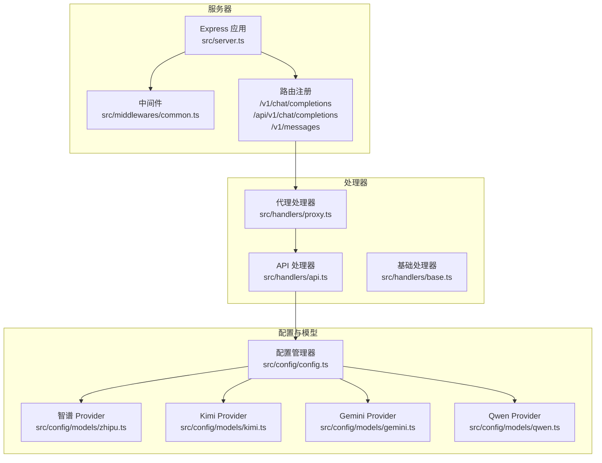
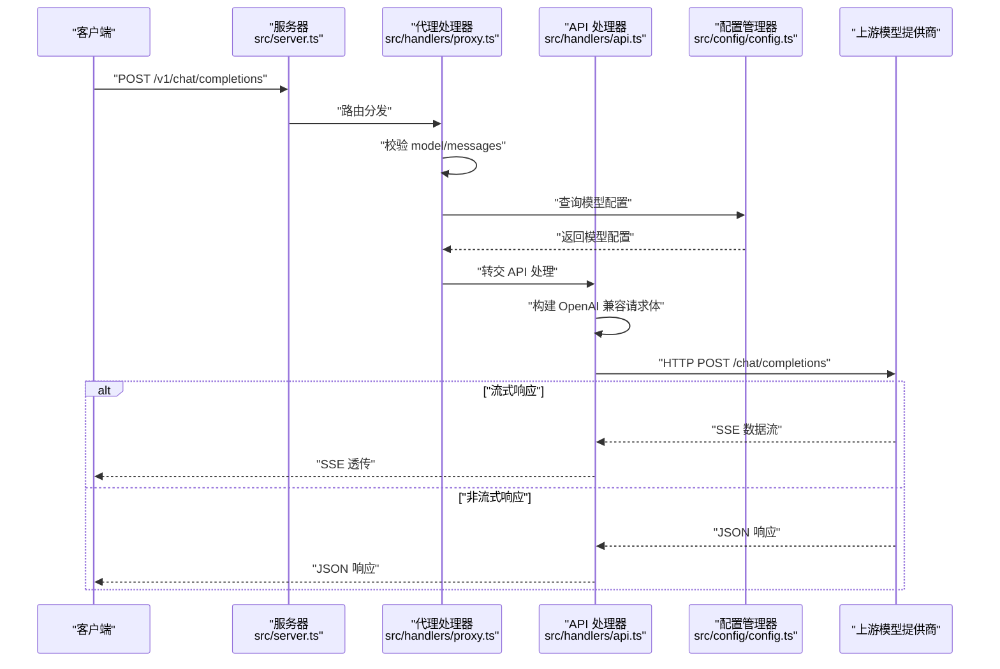
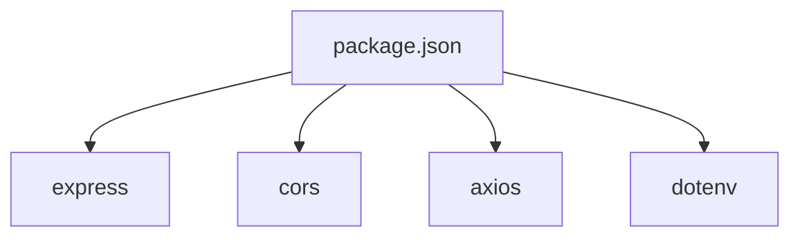

# 聊天补全接口

<cite>
**本文档引用的文件**
- [src/server.ts](file://src/server.ts)
- [src/handlers/proxy.ts](file://src/handlers/proxy.ts)
- [src/handlers/api.ts](file://src/handlers/api.ts)
- [src/handlers/base.ts](file://src/handlers/base.ts)
- [src/types/api.ts](file://src/types/api.ts)
- [src/types/config.ts](file://src/types/config.ts)
- [src/config/config.ts](file://src/config/config.ts)
- [src/config/models/zhipu.ts](file://src/config/models/zhipu.ts)
- [src/config/models/kimi.ts](file://src/config/models/kimi.ts)
- [src/config/models/gemini.ts](file://src/config/models/gemini.ts)
- [src/config/models/qwen.ts](file://src/config/models/qwen.ts)
- [src/middlewares/common.ts](file://src/middlewares/common.ts)
- [src/utils/retry.ts](file://src/utils/retry.ts)
- [src/utils/network.ts](file://src/utils/network.ts)
- [package.json](file://package.json)
</cite>

## 目录
1. [简介](#简介)
2. [项目结构](#项目结构)
3. [核心组件](#核心组件)
4. [架构总览](#架构总览)
5. [详细组件分析](#详细组件分析)
6. [依赖关系分析](#依赖关系分析)
7. [性能考虑](#性能考虑)
8. [故障排除指南](#故障排除指南)
9. [结论](#结论)
10. [附录](#附录)

## 简介
本文件为聊天补全接口 POST /v1/chat/completions 提供完整、可操作的技术文档。该接口用于向后端发送聊天消息并接收 AI 响应，支持非流式与流式（SSE）两种响应模式，并提供统一的错误处理机制。接口严格遵循 OpenAI 兼容的请求/响应格式，便于在 Xcode 等开发环境中直接集成。

## 项目结构
后端采用 Express 作为 Web 框架，通过路由层、代理层、API 层和配置层协作完成请求处理与转发。核心路由注册在服务器启动阶段完成，支持多条路径以适配不同客户端习惯。

**图表来源**
- [src/server.ts:29-40](file://src/server.ts#L29-L40)
- [src/handlers/proxy.ts:6-37](file://src/handlers/proxy.ts#L6-L37)
- [src/handlers/api.ts:8-28](file://src/handlers/api.ts#L8-L28)
- [src/config/config.ts:69-99](file://src/config/config.ts#L69-L99)

**章节来源**
- [src/server.ts:29-40](file://src/server.ts#L29-L40)
- [src/handlers/proxy.ts:6-37](file://src/handlers/proxy.ts#L6-L37)
- [src/handlers/api.ts:8-28](file://src/handlers/api.ts#L8-L28)
- [src/config/config.ts:69-99](file://src/config/config.ts#L69-L99)

## 核心组件
- 路由与服务器
  - 注册 /v1/chat/completions、/api/v1/chat/completions、/v1/messages 三条路径，均指向代理处理器。
  - 启用 CORS、JSON 解析（最大 50MB）、日志中间件。
- 代理处理器
  - 校验请求必填项（model、messages），查询模型配置，分发到 API 处理器。
  - 提供 /v1/models 与 /health 健康检查接口。
- API 处理器
  - 校验模型类型为 API，构造 OpenAI 兼容请求体，注入中文交流指令与自定义系统提示。
  - 支持流式与非流式响应，透传上游 SSE 流或返回 JSON。
  - 使用带重试的网络调用，处理 4xx/5xx 并转换为标准错误响应。
- 配置管理
  - 从环境变量加载各模型提供商的 API Key 与 URL，初始化应用级重试、超时等参数。
  - 提供模型可用性检测与模型列表生成。

**章节来源**
- [src/server.ts:23-44](file://src/server.ts#L23-L44)
- [src/handlers/proxy.ts:9-37](file://src/handlers/proxy.ts#L9-L37)
- [src/handlers/api.ts:9-28](file://src/handlers/api.ts#L9-L28)
- [src/config/config.ts:29-67](file://src/config/config.ts#L29-L67)

## 架构总览
下图展示了从客户端到上游模型提供商的整体调用链路，包括请求校验、模型选择、请求构建、网络调用与响应透传。

**图表来源**
- [src/server.ts:36-39](file://src/server.ts#L36-L39)
- [src/handlers/proxy.ts:9-37](file://src/handlers/proxy.ts#L9-L37)
- [src/handlers/api.ts:30-195](file://src/handlers/api.ts#L30-L195)
- [src/config/config.ts:101-115](file://src/config/config.ts#L101-L115)

## 详细组件分析

### 接口定义与兼容性
- 接口路径
  - POST /v1/chat/completions
  - POST /api/v1/chat/completions
  - POST /v1/messages
- 兼容性
  - 请求/响应格式严格遵循 OpenAI 兼容规范，便于在 Xcode 等工具中直接替换基础地址进行集成。
  - 支持流式响应（SSE），响应头设置为 text/event-stream，便于前端实时渲染。

**章节来源**
- [src/server.ts:36-39](file://src/server.ts#L36-L39)
- [src/handlers/api.ts:168-194](file://src/handlers/api.ts#L168-L194)

### 请求体参数说明
- model: 必填。指定使用的模型 ID，需在配置中存在。
- messages: 必填。消息数组，每条消息包含 role 与 content 字段。支持字符串或富文本内容数组。
- max_tokens: 可选。最大生成长度。
- temperature: 可选。采样温度，控制随机性。
- stream: 可选。是否启用流式响应，默认关闭。
- top_p: 可选。核采样概率质量。
- frequency_penalty: 可选。频率惩罚系数。
- presence_penalty: 可选。出现惩罚系数。

上述字段均来自 OpenAI 兼容格式，确保与主流 SDK 和工具链无缝对接。

**章节来源**
- [src/types/api.ts:11-20](file://src/types/api.ts#L11-L20)

### 响应格式
- 非流式响应
  - 返回标准 OpenAI 格式的 JSON，包含 id、object、created、model、choices、usage 等字段。
- 流式响应（SSE）
  - 当 stream=true 时，后端将上游 SSE 流透传给客户端，逐条推送数据块，直至结束事件。

**章节来源**
- [src/types/api.ts:22-37](file://src/types/api.ts#L22-L37)
- [src/handlers/api.ts:168-194](file://src/handlers/api.ts#L168-L194)

### 请求预处理与系统提示注入
- 中文交流指令
  - 在首个系统消息之后自动注入“请务必使用中文与用户交流”的指令，确保输出语言一致性。
- 自定义系统提示
  - 若配置了自定义系统提示，将在中文指令之后追加该提示，便于统一角色设定。

**章节来源**
- [src/handlers/api.ts:58-88](file://src/handlers/api.ts#L58-L88)
- [src/config/config.ts:53-67](file://src/config/config.ts#L53-L67)

### 错误处理策略
- 请求校验失败
  - 缺失 model 或 messages 格式不正确时，返回 400 错误，包含错误类型与消息。
- 模型不可用
  - 指定 model 不存在或类型非 API 时，返回 400 错误，列出支持的模型清单。
- 上游 API 错误
  - 对 4xx/5xx 响应进行捕获与转换，若为流式则读取错误流内容，最终返回标准化错误。
- 服务器内部错误
  - 未被处理的异常统一返回 500 错误。

**章节来源**
- [src/handlers/base.ts:10-34](file://src/handlers/base.ts#L10-L34)
- [src/handlers/proxy.ts:14-31](file://src/handlers/proxy.ts#L14-L31)
- [src/handlers/api.ts:124-164](file://src/handlers/api.ts#L124-L164)
- [src/middlewares/common.ts:9-25](file://src/middlewares/common.ts#L9-L25)

### 流式响应支持（SSE）
- 客户端行为
  - 设置 stream=true，监听 text/event-stream 类型的数据流，逐条解析数据块。
- 服务端行为
  - 识别 stream=true 后，设置响应头为 SSE，并将上游数据流直接 pipe 到客户端。
  - 对于非流式请求，直接返回 JSON 响应。

**章节来源**
- [src/handlers/api.ts:168-194](file://src/handlers/api.ts#L168-L194)

### 与 OpenAI API 的兼容性
- 请求体字段完全兼容 OpenAI 规范，便于直接替换基础地址进行集成。
- 响应体结构与 OpenAI 兼容，便于前端 SDK 无感迁移。

**章节来源**
- [src/types/api.ts:11-37](file://src/types/api.ts#L11-L37)
- [src/handlers/api.ts:90-95](file://src/handlers/api.ts#L90-L95)

### Xcode 集成最佳实践
- 服务端配置
  - 启动后会打印本地与局域网访问地址，便于在 Xcode 中配置代理地址。
  - 支持通过环境变量调整端口、主机、重试次数、超时等参数。
- 客户端配置
  - 将 Xcode 中的 API 基础地址指向本服务提供的局域网地址。
  - 认证方式统一使用 Bearer Token，Token 值可任意字符串（本服务仅做透传）。

**章节来源**
- [src/server.ts:54-83](file://src/server.ts#L54-L83)
- [src/config/config.ts:53-67](file://src/config/config.ts#L53-L67)

### 请求/响应示例（基于规范）
- 基本非流式对话
  - 请求：POST /v1/chat/completions，body 包含 model、messages、max_tokens、temperature 等字段。
  - 响应：标准 OpenAI JSON，包含 choices 与 usage。
- 流式输出
  - 请求：在基本请求基础上设置 stream=true。
  - 响应：SSE 流，逐条推送数据块，直至结束事件。
- 错误处理
  - 请求缺失 model：返回 400，包含错误类型与消息。
  - 指定模型不存在：返回 400，提示支持的模型列表。
  - 上游 API 返回 4xx/5xx：读取错误流或响应体，转换为标准错误 JSON。

**章节来源**
- [src/handlers/base.ts:10-34](file://src/handlers/base.ts#L10-L34)
- [src/handlers/proxy.ts:14-31](file://src/handlers/proxy.ts#L14-L31)
- [src/handlers/api.ts:124-164](file://src/handlers/api.ts#L124-L164)

## 依赖关系分析
- 运行时依赖
  - express：Web 框架与路由。
  - cors：跨域支持。
  - axios：HTTP 客户端，用于与上游模型提供商通信。
  - dotenv：环境变量加载。
- 开发依赖
  - TypeScript、ts-node、nodemon 等，便于开发与热重载。

**图表来源**
- [package.json:14-28](file://package.json#L14-L28)

**章节来源**
- [package.json:14-28](file://package.json#L14-L28)

## 性能考虑
- 超时与重试
  - 默认请求超时可配置，最大重试次数与递增延迟可配置，提升网络波动下的稳定性。
- 流式传输
  - 流式响应采用直通管道，避免额外缓冲与序列化开销，降低端到端延迟。
- 日志与可观测性
  - 关键节点输出日志，便于定位问题；健康检查接口可用于服务监控。

**章节来源**
- [src/config/config.ts:53-67](file://src/config/config.ts#L53-L67)
- [src/utils/retry.ts:1-34](file://src/utils/retry.ts#L1-L34)
- [src/handlers/api.ts:168-194](file://src/handlers/api.ts#L168-L194)

## 故障排除指南
- 无法连接服务
  - 检查端口与主机绑定，确认防火墙放行；查看启动日志中的访问地址。
- 模型不可用
  - 确认环境变量中对应模型的 API Key 已正确配置；检查模型是否启用。
- 流式响应无输出
  - 确认客户端正确设置 stream=true 并监听 text/event-stream；检查上游提供商是否支持流式。
- 4xx/5xx 错误
  - 查看服务端日志中的错误详情；对于流式错误，尝试读取错误流内容以定位问题。

**章节来源**
- [src/server.ts:54-83](file://src/server.ts#L54-L83)
- [src/config/config.ts:29-51](file://src/config/config.ts#L29-L51)
- [src/handlers/api.ts:124-164](file://src/handlers/api.ts#L124-L164)

## 结论
POST /v1/chat/completions 接口通过统一的代理与 API 处理器，实现了对多家模型提供商的兼容与抽象，既满足非流式与流式响应需求，又提供了完善的错误处理与可观测性。结合 OpenAI 兼容的请求/响应格式，能够快速在 Xcode 等开发环境中落地使用。

## 附录

### 模型配置与可用性
- 智谱 GLM-4.5
  - 提供商：zhipu
  - 模型 ID：glm-4.5
  - API URL：可配置
- Kimi
  - 提供商：kimi
  - 模型 ID：kimi-k2-0905-preview
  - API URL：可配置
- Gemini
  - 提供商：google
  - 模型 ID：gemini-2.5-pro
  - API URL：可配置
- Qwen
  - 提供商：qwen
  - 模型 ID：qwen-max
  - API URL：可配置

**章节来源**
- [src/config/models/zhipu.ts:20-32](file://src/config/models/zhipu.ts#L20-L32)
- [src/config/models/kimi.ts:20-32](file://src/config/models/kimi.ts#L20-L32)
- [src/config/models/gemini.ts:20-32](file://src/config/models/gemini.ts#L20-L32)
- [src/config/models/qwen.ts:20-33](file://src/config/models/qwen.ts#L20-L33)