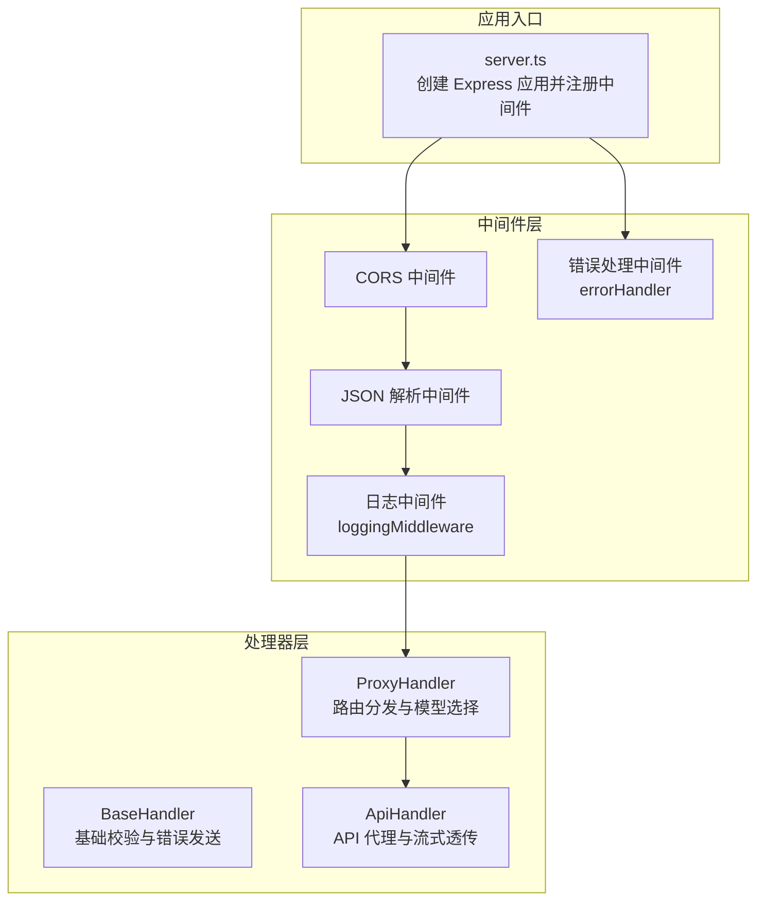
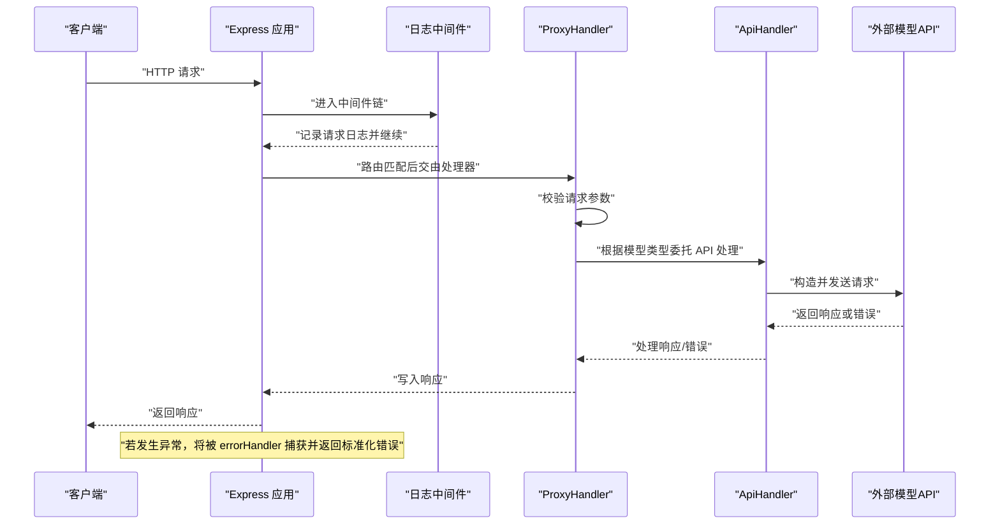
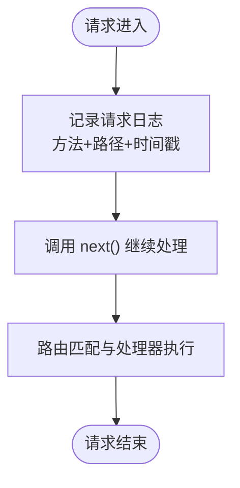
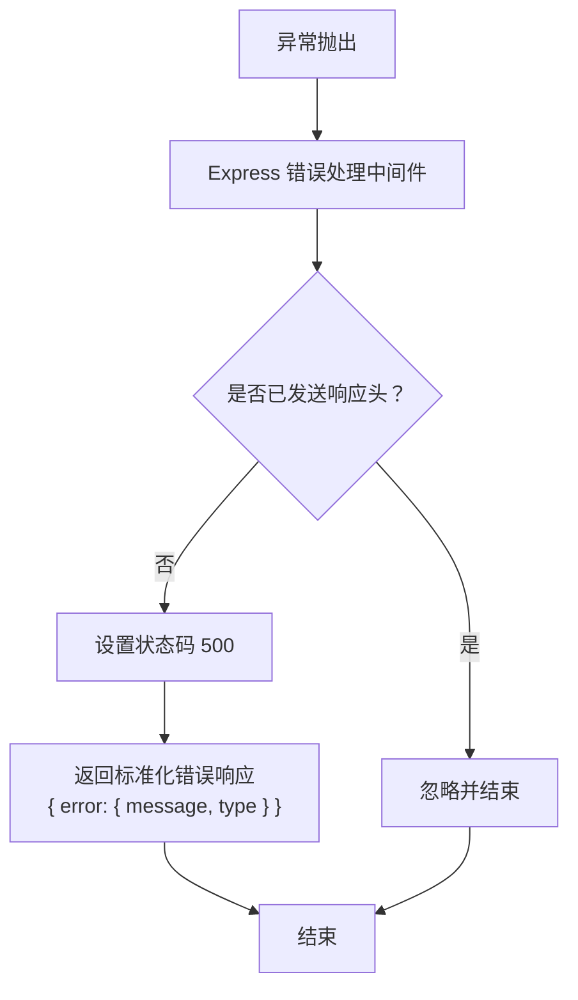
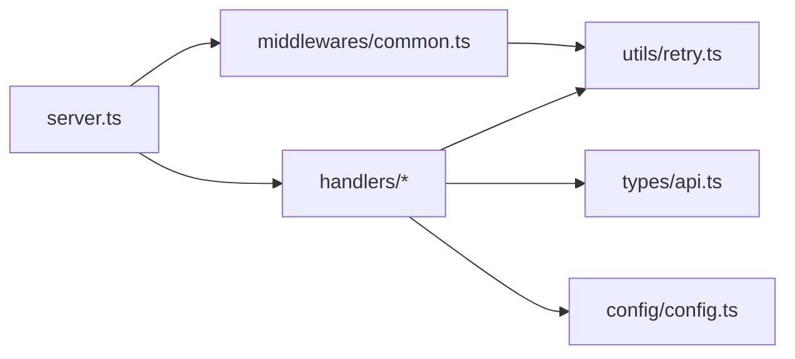

# 中间件系统

<cite>
**本文档引用的文件**
- [src/middlewares/index.ts](file://src/middlewares/index.ts)
- [src/middlewares/common.ts](file://src/middlewares/common.ts)
- [src/server.ts](file://src/server.ts)
- [src/utils/retry.ts](file://src/utils/retry.ts)
- [src/utils/network.ts](file://src/utils/network.ts)
- [src/handlers/base.ts](file://src/handlers/base.ts)
- [src/handlers/proxy.ts](file://src/handlers/proxy.ts)
- [src/handlers/api.ts](file://src/handlers/api.ts)
- [src/config/config.ts](file://src/config/config.ts)
- [src/types/api.ts](file://src/types/api.ts)
- [package.json](file://package.json)
</cite>

## 目录
1. [简介](#简介)
2. [项目结构](#项目结构)
3. [核心组件](#核心组件)
4. [架构总览](#架构总览)
5. [详细组件分析](#详细组件分析)
6. [依赖关系分析](#依赖关系分析)
7. [性能考量](#性能考量)
8. [故障排查指南](#故障排查指南)
9. [结论](#结论)
10. [附录](#附录)

## 简介
本文件聚焦于 xcode-ai-proxy 的中间件系统，围绕日志中间件与错误处理中间件展开，详细说明：
- 日志中间件如何记录请求日志、响应日志与错误日志，以及其记录格式与存储方式
- 错误处理中间件的设计思路，包括错误捕获、错误分类与响应格式标准化
- 中间件的配置选项与可扩展方法
- 中间件的执行顺序与优先级
- 与 Express.js 框架的集成方式
- 调试与监控中间件状态的方法

## 项目结构
中间件系统位于 src/middlewares 目录，当前包含两个导出模块：index.ts 与 common.ts。Express 应用在 server.ts 中完成中间件注册与路由绑定，错误处理中间件在最后统一挂载。

图表来源
- [src/server.ts:23-44](file://src/server.ts#L23-L44)
- [src/middlewares/common.ts:4-25](file://src/middlewares/common.ts#L4-L25)
- [src/handlers/base.ts:5-39](file://src/handlers/base.ts#L5-L39)
- [src/handlers/proxy.ts:6-37](file://src/handlers/proxy.ts#L6-L37)
- [src/handlers/api.ts:8-28](file://src/handlers/api.ts#L8-L28)

章节来源
- [src/server.ts:23-44](file://src/server.ts#L23-L44)
- [src/middlewares/index.ts:1](file://src/middlewares/index.ts#L1)
- [src/middlewares/common.ts:1-25](file://src/middlewares/common.ts#L1-L25)

## 核心组件
- 日志中间件 loggingMiddleware：在每次请求进入时记录请求方法与路径，使用通用日志函数输出时间戳、HTTP 方法与路径信息。
- 错误处理中间件 errorHandler：作为 Express 的错误处理中间件，在任何阶段抛出的异常都会被该中间件捕获，统一输出错误信息并返回标准化的错误响应。

章节来源
- [src/middlewares/common.ts:4-25](file://src/middlewares/common.ts#L4-L25)
- [src/utils/retry.ts:32-34](file://src/utils/retry.ts#L32-L34)

## 架构总览
下图展示了从客户端到处理器再到外部 API 的调用链路，以及中间件在其中的位置与职责。

图表来源
- [src/server.ts:29-40](file://src/server.ts#L29-L40)
- [src/middlewares/common.ts:4-7](file://src/middlewares/common.ts#L4-L7)
- [src/handlers/proxy.ts:9-37](file://src/handlers/proxy.ts#L9-L37)
- [src/handlers/api.ts:30-195](file://src/handlers/api.ts#L30-L195)

## 详细组件分析

### 日志中间件 loggingMiddleware
- 作用：在请求进入时记录请求方法与路径，便于追踪请求来源与访问路径。
- 记录格式：使用通用日志函数输出带时间戳的日志，格式包含“时间戳 + HTTP 方法 + 路径”。
- 存储方式：当前实现直接输出到标准控制台，未进行文件落盘或结构化日志存储。
- 执行位置：在 Express 应用中注册为普通中间件，位于 CORS 与 JSON 解析之后，路由之前。

图表来源
- [src/middlewares/common.ts:4-7](file://src/middlewares/common.ts#L4-L7)
- [src/utils/retry.ts:32-34](file://src/utils/retry.ts#L32-L34)

章节来源
- [src/middlewares/common.ts:4-7](file://src/middlewares/common.ts#L4-L7)
- [src/utils/retry.ts:32-34](file://src/utils/retry.ts#L32-L34)

### 错误处理中间件 errorHandler
- 作用：作为 Express 的错误处理中间件，捕获所有未处理异常，统一输出错误信息并返回标准化错误响应。
- 错误捕获：在 Express 中以四个参数形式注册，接收错误对象、请求对象、响应对象与下一个中间件。
- 错误分类与响应格式：
  - 统一返回 JSON 结构，包含 error 对象，内含 message 与 type 字段。
  - 默认类型为 server_error；在不同处理器中会设置更具体的类型（如 invalid_request_error、proxy_error、api_error）。
- 响应策略：若响应头尚未发送，则返回 500 并写入错误响应；否则不再重复写入。

图表来源
- [src/middlewares/common.ts:9-25](file://src/middlewares/common.ts#L9-L25)
- [src/handlers/base.ts:24-34](file://src/handlers/base.ts#L24-L34)
- [src/handlers/proxy.ts:17-22](file://src/handlers/proxy.ts#L17-L22)
- [src/handlers/api.ts:24-27](file://src/handlers/api.ts#L24-L27)

章节来源
- [src/middlewares/common.ts:9-25](file://src/middlewares/common.ts#L9-L25)
- [src/handlers/base.ts:24-34](file://src/handlers/base.ts#L24-L34)
- [src/handlers/proxy.ts:17-22](file://src/handlers/proxy.ts#L17-L22)
- [src/handlers/api.ts:24-27](file://src/handlers/api.ts#L24-L27)

### 中间件执行顺序与优先级
- 注册顺序：CORS -> JSON 解析 -> 日志中间件 -> 路由处理器 -> 错误处理中间件。
- 顺序意义：
  - CORS 与 JSON 解析必须在业务逻辑前执行，确保跨域与请求体解析正常。
  - 日志中间件在路由前执行，保证所有请求均被记录。
  - 错误处理中间件置于末尾，确保所有异常都能被捕获并统一处理。

章节来源
- [src/server.ts:23-44](file://src/server.ts#L23-L44)

### 与 Express.js 的集成方式
- 中间件注册：通过 app.use() 注册 CORS、JSON 解析与日志中间件；通过 app.get/app.post 注册路由。
- 错误处理：通过 app.use(errorHandler) 将错误处理中间件挂载到应用实例。
- 路由绑定：在 server.ts 中定义健康检查、模型列表与聊天补全等路由，并绑定对应处理器。

章节来源
- [src/server.ts:23-44](file://src/server.ts#L23-L44)

### 配置选项与自定义方法
- 配置项来源：ConfigManager 提供应用配置（端口、主机、最大重试次数、重试延迟、请求超时、自定义系统提示等），这些配置影响中间件行为（例如重试策略与超时）。
- 自定义扩展：
  - 可在现有日志中间件基础上增加字段（如用户标识、请求ID等），但需保持与通用日志函数的兼容性。
  - 可在错误处理中间件中增加错误分类与日志级别，或接入外部日志系统（如文件、远程日志服务）。
  - 可新增中间件（如鉴权、限流、指标采集）并按需调整注册顺序。

章节来源
- [src/config/config.ts:51-65](file://src/config/config.ts#L51-L65)
- [src/config/config.ts:115-120](file://src/config/config.ts#L115-L120)
- [src/utils/retry.ts:1-34](file://src/utils/retry.ts#L1-L34)

### 扩展指南与自定义中间件开发示例
- 新增中间件步骤：
  1) 在 src/middlewares 下创建新文件，导出中间件函数（req, res, next 或 四参数错误处理版本）。
  2) 在 server.ts 中的 setupMiddlewares() 或 setupErrorHandling() 中注册。
  3) 如需在特定路由前执行，可使用 app.use(path, middleware) 进行路径级注册。
- 示例场景：
  - 鉴权中间件：在日志中间件之后、路由之前执行，校验 Authorization 头并注入用户上下文。
  - 指标采集中间件：统计请求耗时、成功率，输出到监控系统。
  - 流量控制中间件：限制每 IP 的并发请求数或 QPS。

章节来源
- [src/server.ts:23-44](file://src/server.ts#L23-L44)
- [src/middlewares/index.ts:1](file://src/middlewares/index.ts#L1)

## 依赖关系分析
- 中间件依赖：
  - loggingMiddleware 依赖通用日志函数，用于输出带时间戳的请求日志。
  - errorHandler 依赖 Express 的错误处理机制，统一返回标准化错误响应。
- 处理器依赖：
  - BaseHandler 提供基础校验与错误发送能力，ProxyHandler 与 ApiHandler 继承该基类。
  - ApiHandler 使用 withRetry 实现重试逻辑，受 ConfigManager 中的重试配置影响。
- 外部依赖：
  - Express、Axios、CORS 等库用于框架、HTTP 客户端与跨域支持。

图表来源
- [src/middlewares/common.ts:1-2](file://src/middlewares/common.ts#L1-L2)
- [src/server.ts:1-6](file://src/server.ts#L1-L6)
- [src/handlers/api.ts:5-6](file://src/handlers/api.ts#L5-L6)
- [src/config/config.ts:1-5](file://src/config/config.ts#L1-L5)
- [src/types/api.ts:1-58](file://src/types/api.ts#L1-L58)

章节来源
- [src/middlewares/common.ts:1-2](file://src/middlewares/common.ts#L1-L2)
- [src/server.ts:1-6](file://src/server.ts#L1-L6)
- [src/handlers/api.ts:5-6](file://src/handlers/api.ts#L5-L6)
- [src/config/config.ts:1-5](file://src/config/config.ts#L1-L5)
- [src/types/api.ts:1-58](file://src/types/api.ts#L1-L58)

## 性能考量
- 日志开销：当前日志仅输出到控制台，无额外 IO 开销；若扩展为文件或远程日志，需评估磁盘与网络开销。
- 错误处理：错误处理中间件仅在异常发生时触发，正常路径无额外开销。
- 重试与超时：ApiHandler 使用 withRetry 控制重试次数与延迟，ConfigManager 提供全局配置，避免频繁失败导致的资源浪费。
- 流式响应：当启用流式时，直接透传外部响应流，减少内存占用与序列化成本。

章节来源
- [src/utils/retry.ts:1-34](file://src/utils/retry.ts#L1-L34)
- [src/config/config.ts:51-65](file://src/config/config.ts#L51-L65)
- [src/handlers/api.ts:176-194](file://src/handlers/api.ts#L176-L194)

## 故障排查指南
- 日志定位：
  - 查看控制台输出的请求日志（包含时间戳、方法与路径），确认请求是否到达服务。
  - 在处理器中可增加额外日志（如模型选择、请求体、响应状态），便于定位问题。
- 错误排查：
  - 错误处理中间件统一返回标准化错误响应，可通过响应体中的 message 与 type 快速判断错误类型。
  - 若响应头已发送，错误处理中间件不会重复写入，需检查上游处理器是否提前返回。
- 网络与超时：
  - 检查 ConfigManager 中的 requestTimeout 配置，避免长时间阻塞。
  - 对于 Kimi 等需要 HTTPS Agent 的模型，确认代理配置正确。
- 重试策略：
  - 通过 withRetry 的日志输出观察重试次数与延迟，必要时调整 MAX_RETRIES 与 RETRY_DELAY。

章节来源
- [src/middlewares/common.ts:15-24](file://src/middlewares/common.ts#L15-L24)
- [src/handlers/base.ts:24-34](file://src/handlers/base.ts#L24-L34)
- [src/handlers/proxy.ts:33-36](file://src/handlers/proxy.ts#L33-L36)
- [src/handlers/api.ts:117-121](file://src/handlers/api.ts#L117-L121)
- [src/config/config.ts:51-65](file://src/config/config.ts#L51-L65)

## 结论
xcode-ai-proxy 的中间件系统简洁而实用：日志中间件负责请求级可观测性，错误处理中间件提供统一的异常兜底。两者与 Express 的集成清晰，配合处理器层的参数校验与错误发送，形成从请求进入、处理到异常捕获的完整闭环。未来可在日志与错误处理上进一步增强可配置性与可观测性，同时保持中间件链的最小侵入与高可维护性。

## 附录
- 关键类型与接口参考：ChatCompletionRequest、ErrorResponse 等，用于统一请求与错误响应格式。
- 依赖清单：Express、Axios、CORS、dotenv 等，用于框架、HTTP 客户端、跨域与环境变量加载。

章节来源
- [src/types/api.ts:11-58](file://src/types/api.ts#L11-L58)
- [package.json:14-28](file://package.json#L14-L28)