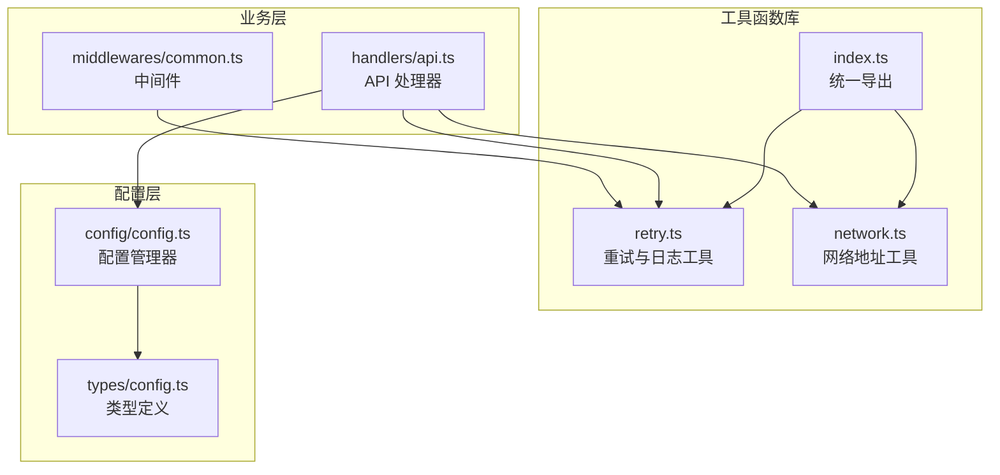
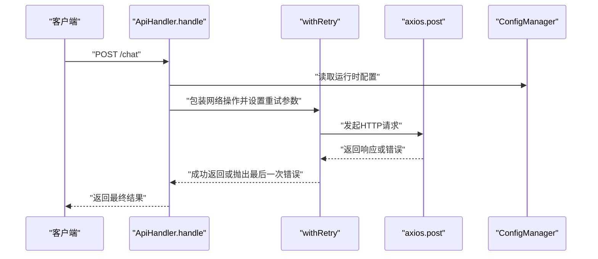
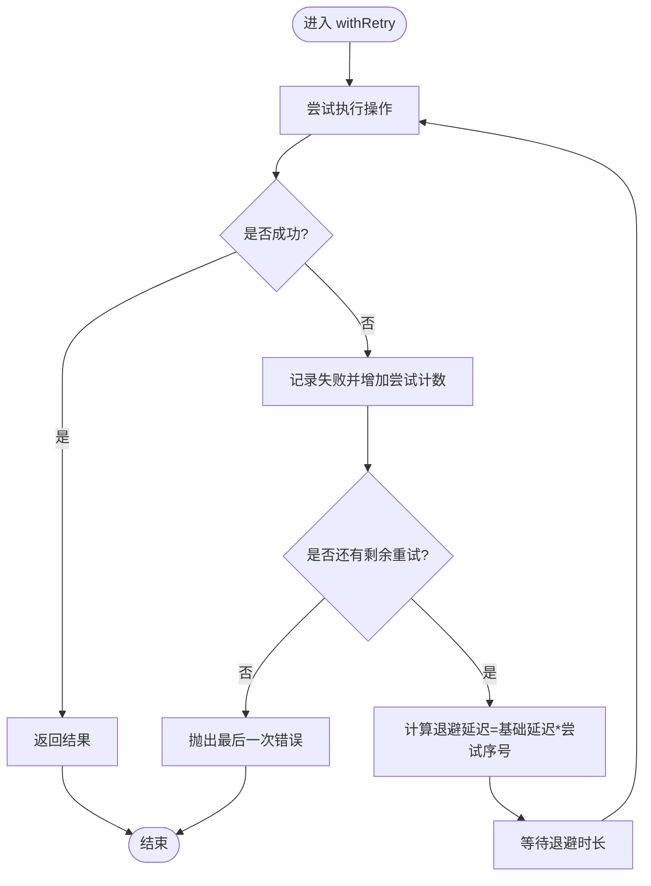
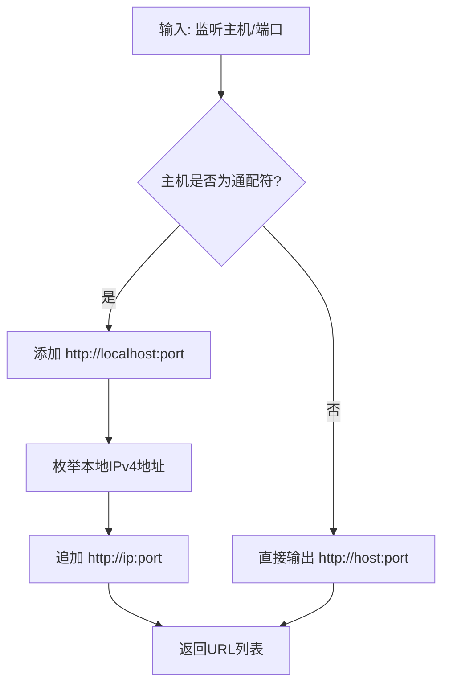
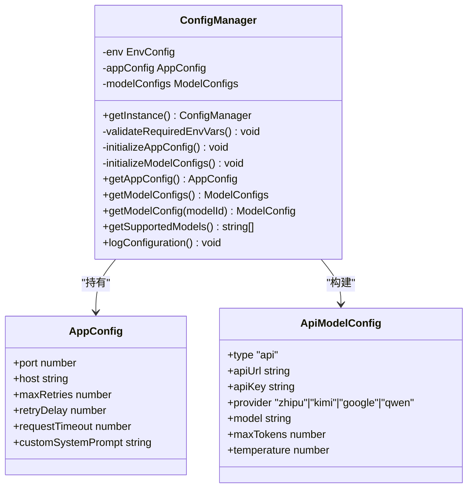
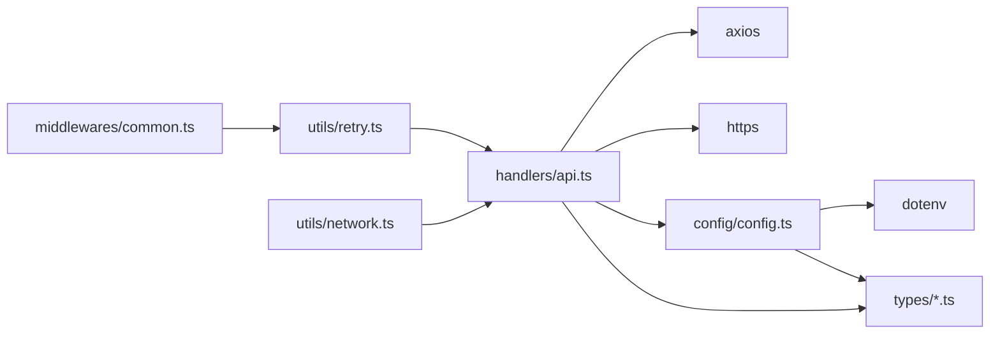

# 工具函数库

<cite>
**本文引用的文件**
- [src/utils/retry.ts](file://src/utils/retry.ts)
- [src/utils/network.ts](file://src/utils/network.ts)
- [src/utils/index.ts](file://src/utils/index.ts)
- [src/handlers/api.ts](file://src/handlers/api.ts)
- [src/middlewares/common.ts](file://src/middlewares/common.ts)
- [src/config/config.ts](file://src/config/config.ts)
- [src/types/config.ts](file://src/types/config.ts)
- [src/types/api.ts](file://src/types/api.ts)
- [package.json](file://package.json)
</cite>

## 目录
1. [简介](#简介)
2. [项目结构](#项目结构)
3. [核心组件](#核心组件)
4. [架构总览](#架构总览)
5. [详细组件分析](#详细组件分析)
6. [依赖分析](#依赖分析)
7. [性能考虑](#性能考虑)
8. [故障排查指南](#故障排查指南)
9. [结论](#结论)
10. [附录](#附录)

## 简介
本文件面向 xcode-ai-proxy 的工具函数库，聚焦以下目标：
- 深入解析智能重试机制：重试策略、退避算法、最大重试次数配置
- 网络工具函数：本地 IP 获取、主地址选择、服务 URL 生成
- 通用工具函数：时间戳、请求日志
- 配置项与可定制参数：环境变量、运行时配置
- 性能优化建议与最佳实践
- 测试策略与质量保障
- 扩展与修改指南

## 项目结构
工具函数库位于 src/utils 目录，对外通过统一导出入口提供能力；在业务层（如 API 处理器）中被调用，并由配置模块提供运行时参数。

图表来源
- [src/utils/index.ts:1-2](file://src/utils/index.ts#L1-L2)
- [src/utils/retry.ts:1-34](file://src/utils/retry.ts#L1-L34)
- [src/utils/network.ts:1-51](file://src/utils/network.ts#L1-L51)
- [src/handlers/api.ts:1-196](file://src/handlers/api.ts#L1-L196)
- [src/middlewares/common.ts:1-25](file://src/middlewares/common.ts#L1-L25)
- [src/config/config.ts:1-121](file://src/config/config.ts#L1-L121)
- [src/types/config.ts:1-48](file://src/types/config.ts#L1-L48)

章节来源
- [src/utils/index.ts:1-2](file://src/utils/index.ts#L1-L2)
- [src/utils/retry.ts:1-34](file://src/utils/retry.ts#L1-L34)
- [src/utils/network.ts:1-51](file://src/utils/network.ts#L1-L51)
- [src/handlers/api.ts:1-196](file://src/handlers/api.ts#L1-L196)
- [src/middlewares/common.ts:1-25](file://src/middlewares/common.ts#L1-L25)
- [src/config/config.ts:1-121](file://src/config/config.ts#L1-L121)
- [src/types/config.ts:1-48](file://src/types/config.ts#L1-L48)

## 核心组件
- 智能重试工具 withRetry：提供带退避的重试执行器，支持最大重试次数与基础延迟配置
- 通用日志工具：当前时间戳与请求日志记录
- 网络地址工具：本地 IPv4 地址枚举、主地址选择、服务 URL 列表生成
- 统一导出：通过 utils/index.ts 对外暴露上述能力

章节来源
- [src/utils/retry.ts:1-34](file://src/utils/retry.ts#L1-L34)
- [src/utils/network.ts:1-51](file://src/utils/network.ts#L1-L51)
- [src/utils/index.ts:1-2](file://src/utils/index.ts#L1-L2)

## 架构总览
工具函数库在业务层被调用，配置层提供运行时参数，类型定义确保参数一致性。

图表来源
- [src/handlers/api.ts:117-121](file://src/handlers/api.ts#L117-L121)
- [src/utils/retry.ts:1-26](file://src/utils/retry.ts#L1-L26)
- [src/config/config.ts:51-65](file://src/config/config.ts#L51-L65)

## 详细组件分析

### 智能重试机制 withRetry
- 功能概述
  - 将任意异步操作包裹在重试循环中，按尝试次数线性增加延迟进行退避
  - 记录每次尝试与最终失败信息，保留最后一次错误用于上抛
- 重试策略
  - 固定最大重试次数：由外部传入或默认值决定
  - 退避算法：基础延迟乘以当前尝试序号（线性增长）
  - 失败条件：捕获异常即视为失败；若未达最大次数则等待退避后重试
- 关键参数
  - 最大重试次数：默认 3 次
  - 基础延迟（毫秒）：默认 1000ms
- 使用方式
  - 在业务处理器中将网络请求封装为异步操作，传入 withRetry 并注入运行时配置
- 日志与可观测性
  - 每次尝试打印尝试编号与失败原因
  - 重试前打印延迟时长
  - 所有重试失败后打印失败统计

图表来源
- [src/utils/retry.ts:1-26](file://src/utils/retry.ts#L1-L26)

章节来源
- [src/utils/retry.ts:1-34](file://src/utils/retry.ts#L1-L34)
- [src/handlers/api.ts:117-121](file://src/handlers/api.ts#L117-L121)
- [src/config/config.ts:55-57](file://src/config/config.ts#L55-L57)

### 网络工具函数
- 本地 IP 地址枚举
  - 遍历系统网络接口，过滤 IPv4 且非内部地址，返回可用地址列表
- 主本地 IP 选择
  - 优先返回私网网段（192.168.x.x、10.x.x.x、172.x.x.x）中的首个地址
  - 若无私网地址，则返回第一个可用地址；否则回退到 localhost
- 服务 URL 列表生成
  - 当监听地址为通配符时，同时输出 localhost 与所有可用内网地址
  - 当指定具体主机时，仅输出该主机对应的 URL

图表来源
- [src/utils/network.ts:35-51](file://src/utils/network.ts#L35-L51)

章节来源
- [src/utils/network.ts:1-51](file://src/utils/network.ts#L1-L51)

### 通用工具函数
- 当前时间戳
  - 输出 ISO 字符串形式的时间戳，用于日志与审计
- 请求日志
  - 记录请求方法与路径，结合中间件统一接入

章节来源
- [src/utils/retry.ts:28-34](file://src/utils/retry.ts#L28-L34)
- [src/middlewares/common.ts:4-7](file://src/middlewares/common.ts#L4-L7)

### 配置选项与自定义参数
- 运行时配置（来自环境变量）
  - 端口、主机、最大重试次数、重试延迟、请求超时、自定义系统提示
- 类型约束
  - AppConfig/AppModelConfig/EnvConfig 定义了字段类型与可选性
- 配置加载流程
  - ConfigManager 单例初始化时校验必要环境变量，构建应用与模型配置
  - 提供查询接口供处理器使用

图表来源
- [src/config/config.ts:7-121](file://src/config/config.ts#L7-L121)
- [src/types/config.ts:24-48](file://src/types/config.ts#L24-L48)

章节来源
- [src/config/config.ts:1-121](file://src/config/config.ts#L1-L121)
- [src/types/config.ts:1-48](file://src/types/config.ts#L1-L48)

### 在业务中的使用示例
- API 处理器使用 withRetry 包裹 axios 请求，读取运行时配置作为重试参数
- 中间件使用日志工具记录请求信息
- 类型定义确保请求/响应结构一致

章节来源
- [src/handlers/api.ts:117-121](file://src/handlers/api.ts#L117-L121)
- [src/middlewares/common.ts:4-7](file://src/middlewares/common.ts#L4-L7)
- [src/types/api.ts:11-58](file://src/types/api.ts#L11-L58)

## 依赖分析
- 工具函数库依赖
  - 无外部依赖，纯工具函数
- 业务层依赖
  - axios：HTTP 请求封装
  - https：Kimi 模型的 HTTPS Agent（连接复用与超时）
- 配置层依赖
  - dotenv：环境变量加载
  - 类型定义：确保配置与请求结构一致

图表来源
- [src/handlers/api.ts:1-196](file://src/handlers/api.ts#L1-L196)
- [src/middlewares/common.ts:1-25](file://src/middlewares/common.ts#L1-L25)
- [src/config/config.ts:1-121](file://src/config/config.ts#L1-L121)
- [package.json:14-29](file://package.json#L14-L29)

章节来源
- [package.json:14-29](file://package.json#L14-L29)
- [src/handlers/api.ts:1-196](file://src/handlers/api.ts#L1-L196)
- [src/middlewares/common.ts:1-25](file://src/middlewares/common.ts#L1-L25)
- [src/config/config.ts:1-121](file://src/config/config.ts#L1-L121)

## 性能考虑
- 重试退避
  - 当前采用线性退避（基础延迟 × 尝试序号），适合偶发瞬时错误
  - 建议在高并发场景下引入抖动（随机扰动）以避免“同步风暴”
- 连接复用
  - 对特定提供商启用 HTTPS Agent 以复用 TCP 连接，降低握手开销
- 超时控制
  - 请求超时由运行时配置统一设定，避免长时间阻塞
- 流式传输
  - 支持流式响应时直接透传数据流，减少内存占用
- 日志频率
  - 重试与请求日志会带来 IO 开销，生产环境建议降低日志级别或采样

## 故障排查指南
- 重试相关
  - 确认最大重试次数与基础延迟配置是否合理
  - 观察日志中每次尝试与退避等待信息，定位失败根因
- 网络相关
  - 检查本地 IP 枚举与主地址选择逻辑，确认服务 URL 是否可达
  - 若监听地址为通配符，确认防火墙与路由允许内网访问
- 错误处理
  - 中间件统一捕获服务器错误并返回标准错误结构
  - API 处理器对 4xx/5xx 响应进行差异化处理，流式错误读取与解析
- 配置检查
  - 确保至少配置一个有效 API 密钥
  - 自定义系统提示与端口/主机等配置生效

章节来源
- [src/middlewares/common.ts:9-25](file://src/middlewares/common.ts#L9-L25)
- [src/handlers/api.ts:123-164](file://src/handlers/api.ts#L123-L164)
- [src/config/config.ts:27-49](file://src/config/config.ts#L27-L49)

## 结论
工具函数库提供了简洁可靠的重试与网络辅助能力，配合配置层与类型定义，形成从配置到执行的一致性闭环。通过合理的退避策略、连接复用与超时控制，可在保证稳定性的同时兼顾性能。建议在生产环境中进一步增强退避抖动、日志采样与监控埋点，持续优化用户体验与系统韧性。

## 附录

### 配置项一览（环境变量）
- ZHIPU_API_KEY / ZHIPU_API_URL：智谱 AI 配置
- KIMI_API_KEY / KIMI_API_URL：Kimi 配置
- GEMINI_API_KEY / GEMINI_API_URL：Gemini 配置
- QWEN_API_KEY / QWEN_API_URL：通义千问配置
- CUSTOM_SYSTEM_PROMPT：自定义系统提示
- PORT：服务端口
- HOST：监听主机
- MAX_RETRIES：最大重试次数
- RETRY_DELAY：基础重试延迟（毫秒）
- REQUEST_TIMEOUT：请求超时（毫秒）

章节来源
- [src/config/config.ts:27-59](file://src/config/config.ts#L27-L59)
- [src/types/config.ts:33-48](file://src/types/config.ts#L33-L48)

### 可扩展与修改指南
- 新增重试策略
  - 在 withRetry 内部扩展退避算法（指数/指数退避+抖动）
  - 为不同错误类型设置不同的最大重试次数或退避参数
- 新增网络地址策略
  - 扩展主地址选择规则（如优先网卡、VLAN 策略）
  - 增加 IPv6 支持或过滤条件
- 新增日志维度
  - 在请求日志中加入 traceId、模型标识、耗时统计
- 集成监控
  - 在重试与网络工具中埋点指标（成功率、耗时、错误码分布）
- 类型与配置扩展
  - 在类型定义中新增字段，配置管理器中读取并传递给处理器