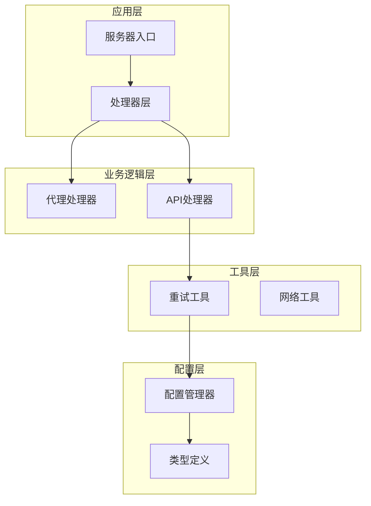
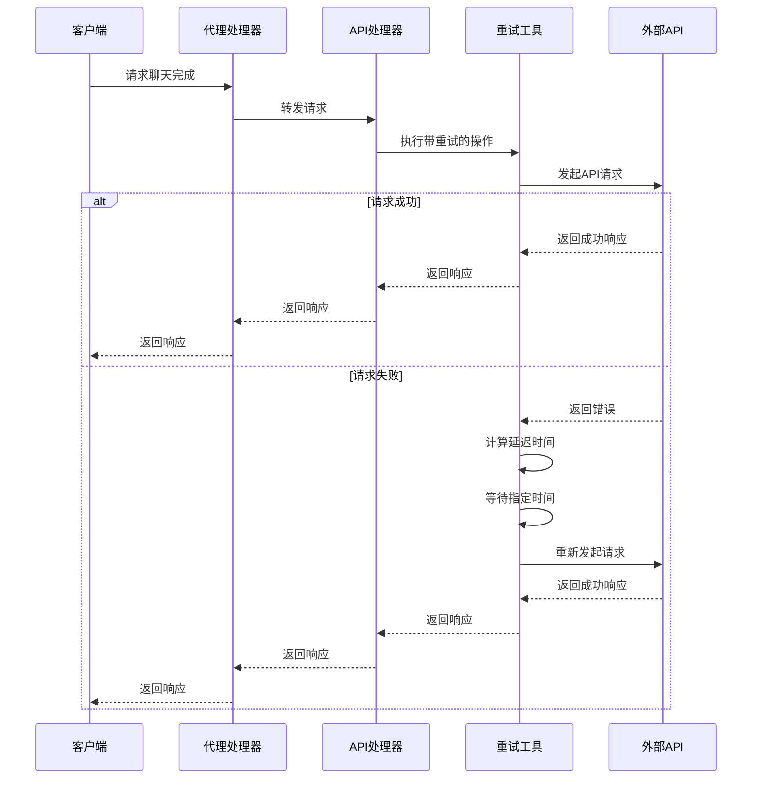
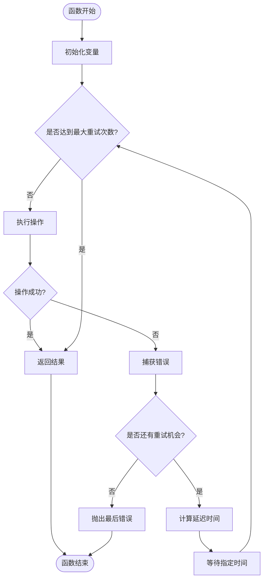
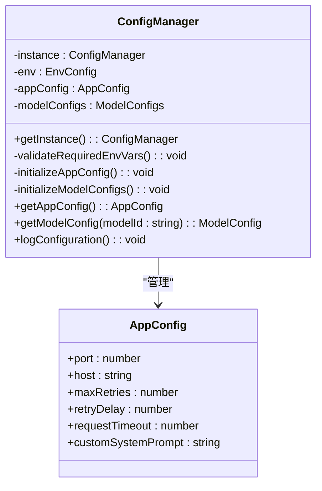
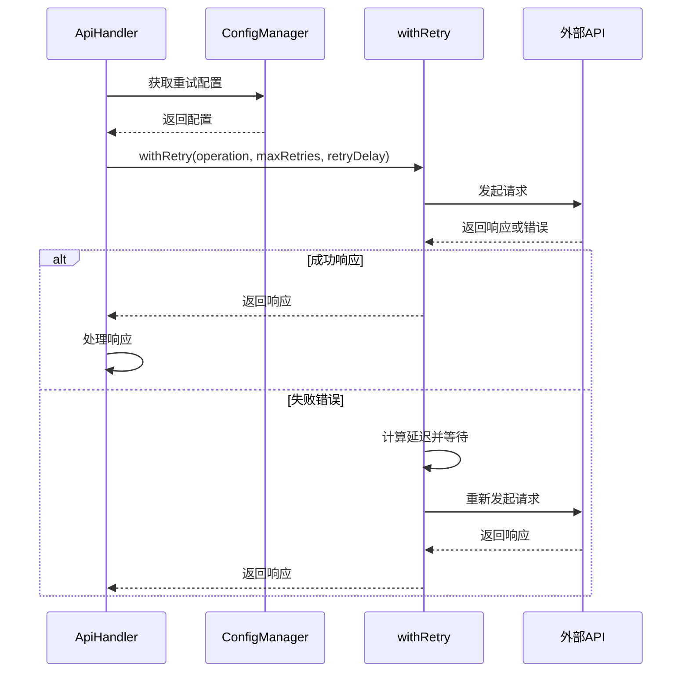
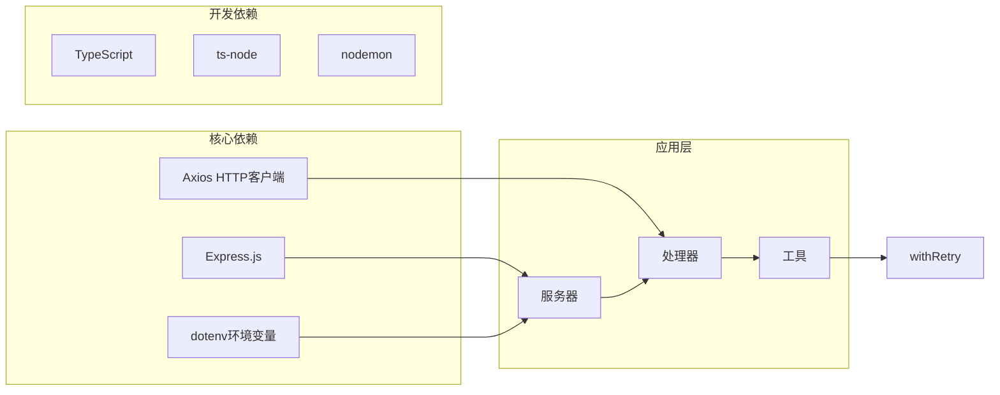
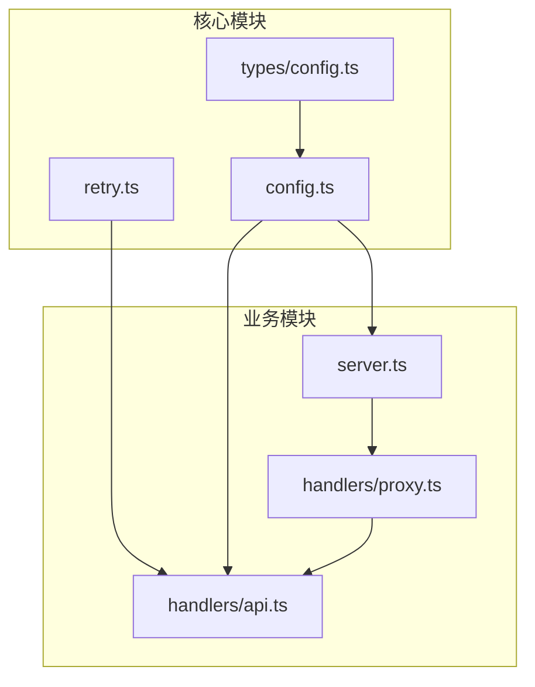

# 智能重试机制

<cite>
**本文档引用的文件**
- [src/utils/retry.ts](file://src/utils/retry.ts)
- [src/handlers/api.ts](file://src/handlers/api.ts)
- [src/config/config.ts](file://src/config/config.ts)
- [src/types/config.ts](file://src/types/config.ts)
- [src/server.ts](file://src/server.ts)
- [src/handlers/proxy.ts](file://src/handlers/proxy.ts)
- [package.json](file://package.json)
</cite>

## 目录
1. [简介](#简介)
2. [项目结构](#项目结构)
3. [核心组件](#核心组件)
4. [架构概览](#架构概览)
5. [详细组件分析](#详细组件分析)
6. [依赖关系分析](#依赖关系分析)
7. [性能考虑](#性能考虑)
8. [故障排除指南](#故障排除指南)
9. [结论](#结论)
10. [附录](#附录)

## 简介

智能重试机制是本AI代理服务的核心功能之一，旨在提高系统的稳定性和可靠性。该机制通过指数退避算法、可配置的重试参数和完善的错误处理，确保在面对网络波动、API限流或临时性故障时能够自动恢复。

本项目实现了基于递增延迟的智能重试策略，支持最大重试次数配置、基础延迟时间设置，并提供了详细的日志记录机制。重试机制广泛应用于AI代理服务中，特别是在调用第三方AI模型API时，能够有效提升服务的可用性和用户体验。

## 项目结构

该项目采用模块化架构设计，重试机制作为独立的工具模块被多个业务组件复用：



**图表来源**
- [src/server.ts:1-88](file://src/server.ts#L1-L88)
- [src/handlers/proxy.ts:1-66](file://src/handlers/proxy.ts#L1-L66)
- [src/handlers/api.ts:1-196](file://src/handlers/api.ts#L1-L196)
- [src/utils/retry.ts:1-34](file://src/utils/retry.ts#L1-L34)

**章节来源**
- [src/server.ts:1-88](file://src/server.ts#L1-L88)
- [src/utils/retry.ts:1-34](file://src/utils/retry.ts#L1-L34)

## 核心组件

### withRetry 函数

`withRetry` 是智能重试机制的核心实现，提供了以下关键功能：

- **递增延迟策略**：每次重试的延迟时间为基础延迟乘以重试次数
- **可配置重试参数**：支持最大重试次数和基础延迟时间的配置
- **完整错误处理**：捕获异常、记录日志并进行适当的延迟等待
- **最终失败抛出**：当达到最大重试次数后，抛出最后一次错误

### 配置管理系统

配置管理器负责管理所有运行时配置，包括重试相关的参数：

- **maxRetries**：最大重试次数，默认值为3
- **retryDelay**：基础重试延迟（毫秒），默认值为1000
- **requestTimeout**：请求超时时间（毫秒），默认值为60000

### 类型定义

系统提供了完整的类型定义，确保配置参数的正确性和安全性：

- **AppConfig**：应用程序配置接口
- **EnvConfig**：环境变量配置接口  
- **ApiModelConfig**：API模型配置接口

**章节来源**
- [src/utils/retry.ts:1-34](file://src/utils/retry.ts#L1-L34)
- [src/config/config.ts:51-65](file://src/config/config.ts#L51-L65)
- [src/types/config.ts:24-48](file://src/types/config.ts#L24-L48)

## 架构概览

智能重试机制在整个系统中的位置和交互关系如下：



**图表来源**
- [src/handlers/proxy.ts:9-37](file://src/handlers/proxy.ts#L9-L37)
- [src/handlers/api.ts:117-121](file://src/handlers/api.ts#L117-L121)
- [src/utils/retry.ts:8-25](file://src/utils/retry.ts#L8-L25)

## 详细组件分析

### withRetry 函数实现

`withRetry` 函数实现了完整的重试逻辑，具有以下特点：

#### 核心算法流程



**图表来源**
- [src/utils/retry.ts:8-25](file://src/utils/retry.ts#L8-L25)

#### 重试策略分析

1. **递增延迟算法**：延迟时间 = 基础延迟 × 重试次数
   - 第1次重试：1000ms
   - 第2次重试：2000ms  
   - 第3次重试：3000ms
   - 以此类推...

2. **最大重试限制**：防止无限重试导致资源浪费

3. **错误传播**：保留最后一次错误信息用于上层处理

#### 错误处理机制

- **异常捕获**：使用 try-catch 捕获所有异步操作异常
- **日志记录**：详细记录每次重试的状态和错误信息
- **状态跟踪**：保存最后一次错误以便最终抛出

**章节来源**
- [src/utils/retry.ts:1-34](file://src/utils/retry.ts#L1-L34)

### 配置集成

#### 环境变量配置

系统支持通过环境变量配置重试行为：

| 环境变量 | 默认值 | 说明 |
|---------|--------|------|
| MAX_RETRIES | 3 | 最大重试次数 |
| RETRY_DELAY | 1000 | 基础重试延迟(毫秒) |
| REQUEST_TIMEOUT | 60000 | 请求超时时间(毫秒) |

#### 运行时配置管理

配置管理器提供了统一的配置访问接口：



**图表来源**
- [src/config/config.ts:7-121](file://src/config/config.ts#L7-L121)
- [src/types/config.ts:24-31](file://src/types/config.ts#L24-L31)

**章节来源**
- [src/config/config.ts:51-65](file://src/config/config.ts#L51-L65)
- [src/types/config.ts:24-48](file://src/types/config.ts#L24-L48)

### 实际应用示例

#### API处理器中的重试应用

在API处理器中，重试机制被集成到请求处理流程中：



**图表来源**
- [src/handlers/api.ts:117-121](file://src/handlers/api.ts#L117-L121)
- [src/utils/retry.ts:1-34](file://src/utils/retry.ts#L1-L34)

**章节来源**
- [src/handlers/api.ts:117-121](file://src/handlers/api.ts#L117-L121)

## 依赖关系分析

### 外部依赖

项目使用了以下关键外部依赖：



**图表来源**
- [package.json:14-29](file://package.json#L14-L29)

### 内部模块依赖



**图表来源**
- [src/utils/retry.ts:1-34](file://src/utils/retry.ts#L1-L34)
- [src/handlers/api.ts:1-196](file://src/handlers/api.ts#L1-L196)
- [src/config/config.ts:1-121](file://src/config/config.ts#L1-L121)

**章节来源**
- [package.json:14-29](file://package.json#L14-L29)

## 性能考虑

### 时间复杂度分析

智能重试机制的时间复杂度分析：

- **最佳情况**：O(1) - 首次请求成功
- **最坏情况**：O(n²) - 需要n次重试，其中延迟总和为 n(n+1)/2 × 基础延迟
- **平均情况**：O(n²)，其中n为重试次数

### 内存使用

- **常量空间**：只存储最后一次错误和少量状态变量
- **无内存泄漏**：每次重试后及时释放中间结果

### 性能优化建议

1. **合理配置重试参数**：
   - 对于实时性要求高的场景，减少最大重试次数
   - 对于网络不稳定环境，适当增加基础延迟

2. **监控重试效果**：
   - 观察重试成功率和平均延迟时间
   - 根据实际使用情况进行参数调整

3. **避免过度重试**：
   - 设置合理的最大重试次数上限
   - 对于永久性错误及时放弃重试

## 故障排除指南

### 常见问题及解决方案

#### 重试次数过多导致延迟过长

**症状**：请求响应时间过长，用户体验下降

**原因分析**：
- 最大重试次数设置过高
- 基础延迟时间过大
- 外部API持续不可用

**解决方案**：
1. 调整环境变量配置：
   ```bash
   export MAX_RETRIES=2
   export RETRY_DELAY=500
   ```

2. 实施分级重试策略：
   - 快速失败：前几次重试使用较小延迟
   - 渐进式：后续重试逐步增加延迟

#### 错误信息不明确

**症状**：重试失败但无法确定具体原因

**诊断步骤**：
1. 检查网络连接状态
2. 验证API密钥有效性
3. 查看外部API的响应状态码

**解决方案**：
1. 增加详细的日志记录
2. 实现更精确的错误分类
3. 提供重试统计信息

#### 内存泄漏风险

**症状**：长时间运行后内存使用量持续增长

**预防措施**：
1. 确保所有Promise正确处理
2. 及时清理事件监听器
3. 监控长时间运行的进程

### 调试技巧

#### 启用详细日志

系统提供了丰富的日志输出，包括：
- 重试尝试次数
- 错误信息详情
- 延迟时间计算
- 最终失败原因

#### 性能监控

建议添加以下监控指标：
- 平均重试次数
- 重试成功率
- 总响应时间分布
- 错误类型统计

**章节来源**
- [src/utils/retry.ts:10-25](file://src/utils/retry.ts#L10-L25)
- [src/handlers/api.ts:124-164](file://src/handlers/api.ts#L124-L164)

## 结论

智能重试机制是本AI代理服务的重要组成部分，通过合理的递增延迟策略、可配置的参数设置和完善的错误处理，显著提升了系统的稳定性和可靠性。

该机制的主要优势包括：
- **简单易用**：API设计简洁，易于集成到现有代码中
- **灵活配置**：支持通过环境变量进行参数调整
- **详细日志**：提供完整的重试过程记录
- **性能友好**：避免无限重试，防止资源浪费

在AI代理服务的实际应用中，智能重试机制能够有效应对第三方API的临时性故障，提升用户体验和服务可用性。通过合理的参数配置和监控，可以进一步优化重试效果，满足不同场景的需求。

## 附录

### 使用示例

#### 基本使用方式

```typescript
// 导入重试工具
import { withRetry } from './utils/retry';

// 定义异步操作
const operation = async () => {
  // 执行可能失败的操作
  return await someAsyncOperation();
};

// 执行带重试的操作
try {
  const result = await withRetry(operation, 3, 1000);
  console.log('操作成功:', result);
} catch (error) {
  console.error('最终失败:', error.message);
}
```

#### 在API处理器中的应用

```typescript
// 在ApiHandler中使用
const response = await withRetry(
  operation,
  this.config.getAppConfig().maxRetries,
  this.config.getAppConfig().retryDelay
);
```

### 配置参数参考

| 参数名称 | 类型 | 默认值 | 说明 |
|---------|------|--------|------|
| maxRetries | number | 3 | 最大重试次数 |
| retryDelay | number | 1000 | 基础重试延迟(毫秒) |
| requestTimeout | number | 60000 | 请求超时时间(毫秒) |

### 最佳实践建议

1. **合理设置重试参数**：根据API特性和网络环境调整参数
2. **实施错误分类**：区分可重试错误和不可重试错误
3. **监控重试效果**：定期评估重试策略的有效性
4. **提供降级方案**：在重试失败时提供备选方案
5. **记录重试统计**：收集重试数据用于性能优化