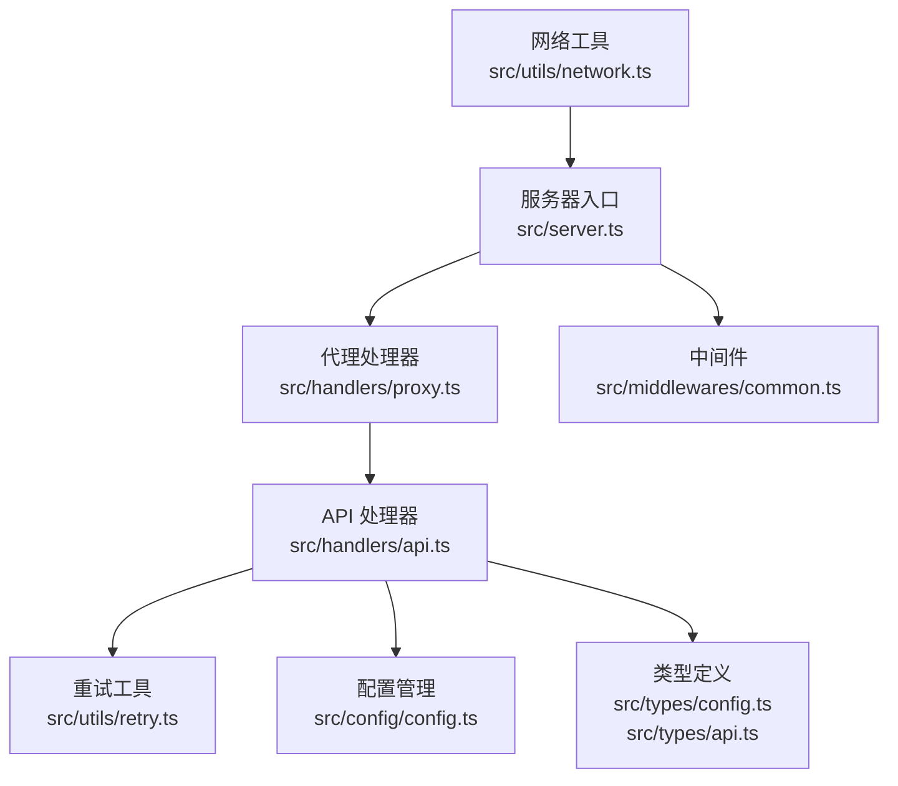
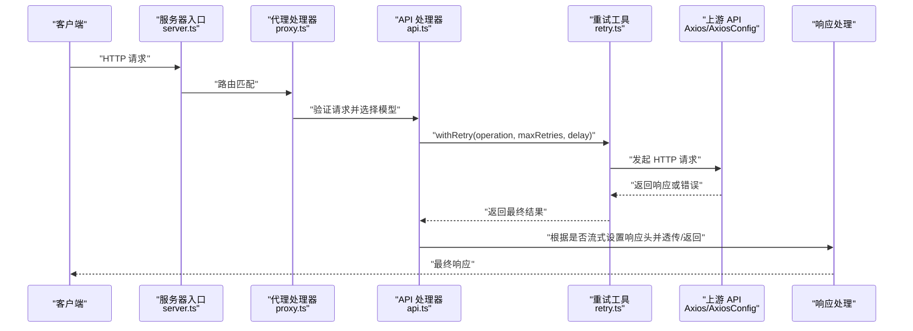
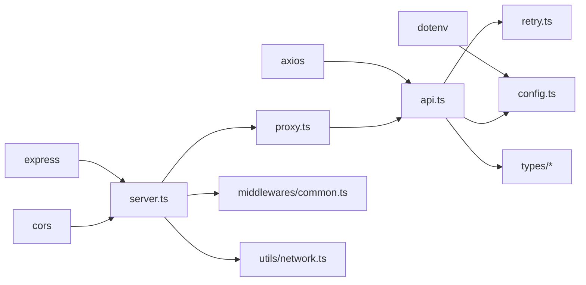

# 网络工具函数

<cite>
**本文档引用的文件**
- [src/utils/network.ts](file://src/utils/network.ts)
- [src/utils/retry.ts](file://src/utils/retry.ts)
- [src/handlers/api.ts](file://src/handlers/api.ts)
- [src/handlers/proxy.ts](file://src/handlers/proxy.ts)
- [src/handlers/base.ts](file://src/handlers/base.ts)
- [src/config/config.ts](file://src/config/config.ts)
- [src/server.ts](file://src/server.ts)
- [src/middlewares/common.ts](file://src/middlewares/common.ts)
- [src/types/config.ts](file://src/types/config.ts)
- [src/types/api.ts](file://src/types/api.ts)
- [package.json](file://package.json)
</cite>

## 目录
1. [简介](#简介)
2. [项目结构](#项目结构)
3. [核心组件](#核心组件)
4. [架构总览](#架构总览)
5. [详细组件分析](#详细组件分析)
6. [依赖关系分析](#依赖关系分析)
7. [性能考虑](#性能考虑)
8. [故障排查指南](#故障排查指南)
9. [结论](#结论)
10. [附录](#附录)

## 简介
本文件聚焦于网络工具函数与网络请求封装的实现细节，涵盖：
- HTTP 客户端配置与请求头管理
- 响应处理与流式传输
- 连接池与超时控制策略
- 并发限制与重试机制
- 配置项与自定义参数
- 错误处理与可观测性
- 在代理服务中的作用与集成方式
- 使用示例与最佳实践

## 项目结构
该项目采用分层架构，网络相关能力主要集中在以下模块：
- 服务器入口与路由：[src/server.ts](file://src/server.ts)
- 代理处理器：[src/handlers/proxy.ts](file://src/handlers/proxy.ts)
- API 处理器（网络请求封装）：[src/handlers/api.ts](file://src/handlers/api.ts)
- 基础处理器与请求校验：[src/handlers/base.ts](file://src/handlers/base.ts)
- 配置管理与模型配置：[src/config/config.ts](file://src/config/config.ts)
- 网络工具（本地 IP/URL 计算）：[src/utils/network.ts](file://src/utils/network.ts)
- 重试工具（withRetry）：[src/utils/retry.ts](file://src/utils/retry.ts)
- 中间件（日志与错误处理）：[src/middlewares/common.ts](file://src/middlewares/common.ts)
- 类型定义（配置与 API）：[src/types/config.ts](file://src/types/config.ts)、[src/types/api.ts](file://src/types/api.ts)

图表来源
- [src/server.ts:1-88](file://src/server.ts#L1-L88)
- [src/handlers/proxy.ts:1-66](file://src/handlers/proxy.ts#L1-L66)
- [src/handlers/api.ts:1-196](file://src/handlers/api.ts#L1-L196)
- [src/utils/retry.ts:1-34](file://src/utils/retry.ts#L1-L34)
- [src/config/config.ts:1-123](file://src/config/config.ts#L1-L123)
- [src/middlewares/common.ts:1-25](file://src/middlewares/common.ts#L1-L25)
- [src/utils/network.ts:1-51](file://src/utils/network.ts#L1-L51)
- [src/types/config.ts:1-48](file://src/types/config.ts#L1-L48)
- [src/types/api.ts:1-58](file://src/types/api.ts#L1-L58)

章节来源
- [src/server.ts:1-88](file://src/server.ts#L1-L88)
- [src/handlers/proxy.ts:1-66](file://src/handlers/proxy.ts#L1-L66)
- [src/handlers/api.ts:1-196](file://src/handlers/api.ts#L1-L196)
- [src/utils/network.ts:1-51](file://src/utils/network.ts#L1-L51)
- [src/utils/retry.ts:1-34](file://src/utils/retry.ts#L1-L34)
- [src/config/config.ts:1-123](file://src/config/config.ts#L1-L123)
- [src/middlewares/common.ts:1-25](file://src/middlewares/common.ts#L1-L25)
- [src/types/config.ts:1-48](file://src/types/config.ts#L1-L48)
- [src/types/api.ts:1-58](file://src/types/api.ts#L1-L58)

## 核心组件
- HTTP 客户端封装与请求头管理
  - 使用 Axios 发起请求，统一设置 Content-Type、Authorization、Accept-Encoding 等头部
  - 流式响应时设置 SSE 头部，透传上游流
  - 非流式响应时直接返回 JSON 数据
- 连接池与超时控制
  - 通过 Axios 的默认连接池与超时配置实现
  - 对特定提供商（如 Kimi）启用 HTTPS Agent 并设置 keepAlive 与超时
- 重试机制
  - 提供 withRetry 函数，支持最大重试次数与递增延迟
  - 在 API 处理器中调用 withRetry 包裹网络请求
- 配置与自定义参数
  - 通过环境变量与配置类集中管理端口、主机、重试、超时、自定义系统提示等
  - 模型配置按提供商聚合，统一暴露 OpenAI 兼容接口
- 错误处理与可观测性
  - 统一的错误中间件输出标准错误响应
  - 详细的日志记录，包括请求方法、路径、模型、流式状态、错误详情等

章节来源
- [src/handlers/api.ts:30-196](file://src/handlers/api.ts#L30-L196)
- [src/utils/retry.ts:1-34](file://src/utils/retry.ts#L1-L34)
- [src/config/config.ts:53-123](file://src/config/config.ts#L53-L123)
- [src/middlewares/common.ts:9-25](file://src/middlewares/common.ts#L9-L25)

## 架构总览
下图展示了从客户端到上游 API 的完整链路，以及代理层如何进行请求转发、头部注入、流式透传与错误处理。

图表来源
- [src/server.ts:29-40](file://src/server.ts#L29-L40)
- [src/handlers/proxy.ts:9-37](file://src/handlers/proxy.ts#L9-L37)
- [src/handlers/api.ts:30-196](file://src/handlers/api.ts#L30-L196)
- [src/utils/retry.ts:1-34](file://src/utils/retry.ts#L1-L34)

## 详细组件分析

### HTTP 客户端配置与请求头管理
- 请求头策略
  - 固定 Content-Type 为 application/json
  - Authorization 使用 Bearer 方案，值来自模型配置
  - Accept-Encoding 设为 identity 以便调试
- 响应类型
  - 根据请求是否开启流式，设置 responseType 为 stream 或 json
- 超时控制
  - 通过 timeout 字段统一设置请求超时时间
- 流式响应
  - 当 stream=true 时，设置 SSE 相关响应头，并将上游流透传给客户端
- 非流式响应
  - 设置标准 JSON 响应头并返回上游 JSON 数据

章节来源
- [src/handlers/api.ts:35-44](file://src/handlers/api.ts#L35-L44)
- [src/handlers/api.ts:168-194](file://src/handlers/api.ts#L168-L194)

### 连接池管理机制与超时控制
- 默认连接池
  - Axios 使用 Node.js 内置的 http/https Agent，默认具备连接复用能力
- 特定提供商的 Agent 配置
  - Kimi 提供商启用 https.Agent，设置 keepAlive、timeout、rejectUnauthorized
- 超时策略
  - 通过 requestTimeout 配置统一超时时间，应用于 Axios 请求
- 并发限制
  - 未显式设置并发上限；默认由底层 Agent 和网络栈控制

章节来源
- [src/handlers/api.ts:50-56](file://src/handlers/api.ts#L50-L56)
- [src/config/config.ts:57-61](file://src/config/config.ts#L57-L61)

### 重试机制与错误处理
- 重试策略
  - withRetry 接受操作函数、最大重试次数与基础延迟，按递增延迟执行
  - 每次失败会记录日志并在达到最大重试前等待相应时间
- 错误处理
  - API 层对 4xx/5xx 响应进行统一处理，必要时读取流式错误内容
  - 将错误信息与状态码、URL、原始数据封装为标准错误对象
  - 服务器级错误中间件捕获异常并返回统一错误响应

章节来源
- [src/utils/retry.ts:1-34](file://src/utils/retry.ts#L1-L34)
- [src/handlers/api.ts:117-164](file://src/handlers/api.ts#L117-L164)
- [src/middlewares/common.ts:9-25](file://src/middlewares/common.ts#L9-L25)

### 配置选项与自定义参数
- 应用配置（AppConfig）
  - port、host、maxRetries、retryDelay、requestTimeout、customSystemPrompt
- 环境变量映射
  - 通过 dotenv 加载，支持多个提供商的 API Key 与 URL
- 模型配置（ModelConfigs）
  - 按提供商聚合，统一暴露 OpenAI 兼容的 chat/completions 接口
- 自定义系统提示
  - 在首个系统消息后自动注入中文交流指令与自定义提示

章节来源
- [src/config/config.ts:53-123](file://src/config/config.ts#L53-L123)
- [src/types/config.ts:24-48](file://src/types/config.ts#L24-L48)
- [src/handlers/api.ts:58-88](file://src/handlers/api.ts#L58-L88)

### 网络工具函数
- 本地 IP 获取
  - 遍历系统网络接口，过滤 IPv4 非内部地址，返回可用地址列表
- 主机 IP 选择
  - 优先返回私有网段地址（192.168.x.x、10.x.x.x、172.x.x.x），否则返回任意地址或 localhost
- 服务器 URL 列表
  - 当监听 0.0.0.0 或 :: 时，生成本机与各网卡可访问的 URL 列表

章节来源
- [src/utils/network.ts:3-51](file://src/utils/network.ts#L3-L51)

### 代理服务中的作用与集成方式
- 路由与入口
  - 服务器在启动时注册健康检查、模型列表、聊天补全等路由
  - 代理处理器负责模型选择与 API 处理器委派
- 集成点
  - API 处理器通过 withRetry 与 Axios 完成对外部 API 的请求
  - 配置管理集中提供应用与模型配置，贯穿请求生命周期

章节来源
- [src/server.ts:29-40](file://src/server.ts#L29-L40)
- [src/handlers/proxy.ts:6-37](file://src/handlers/proxy.ts#L6-L37)
- [src/handlers/api.ts:30-196](file://src/handlers/api.ts#L30-L196)

## 依赖关系分析
- 外部依赖
  - express：Web 服务器与路由
  - axios：HTTP 客户端
  - cors：跨域支持
  - dotenv：环境变量加载
- 内部依赖
  - 服务器依赖配置管理、代理处理器、中间件
  - 代理处理器依赖 API 处理器与配置管理
  - API 处理器依赖重试工具、配置管理与类型定义

图表来源
- [package.json:14-29](file://package.json#L14-L29)
- [src/server.ts:1-88](file://src/server.ts#L1-L88)
- [src/handlers/api.ts:1-196](file://src/handlers/api.ts#L1-L196)
- [src/handlers/proxy.ts:1-66](file://src/handlers/proxy.ts#L1-L66)
- [src/utils/retry.ts:1-34](file://src/utils/retry.ts#L1-L34)
- [src/config/config.ts:1-123](file://src/config/config.ts#L1-L123)
- [src/middlewares/common.ts:1-25](file://src/middlewares/common.ts#L1-L25)
- [src/utils/network.ts:1-51](file://src/utils/network.ts#L1-L51)

章节来源
- [package.json:14-29](file://package.json#L14-L29)
- [src/server.ts:1-88](file://src/server.ts#L1-L88)
- [src/handlers/api.ts:1-196](file://src/handlers/api.ts#L1-L196)
- [src/handlers/proxy.ts:1-66](file://src/handlers/proxy.ts#L1-L66)
- [src/utils/retry.ts:1-34](file://src/utils/retry.ts#L1-L34)
- [src/config/config.ts:1-123](file://src/config/config.ts#L1-L123)
- [src/middlewares/common.ts:1-25](file://src/middlewares/common.ts#L1-L25)
- [src/utils/network.ts:1-51](file://src/utils/network.ts#L1-L51)

## 性能考虑
- 连接复用
  - Axios 默认使用 Node.js Agent，具备连接复用能力，有助于降低握手开销
- 超时与背压
  - 合理设置 requestTimeout，避免长时间占用连接
  - 流式响应时注意上游流的背压与下游消费速度
- 并发控制
  - 当前未显式限制并发数；若上游 API 有限额，可在业务层增加队列或限流
- 压缩与编码
  - Accept-Encoding 设置为 identity 便于调试，生产环境可按需调整以减少带宽
- 日志与可观测性
  - 建议引入结构化日志与指标采集（如请求耗时、错误率、并发数）

## 故障排查指南
- 常见问题定位
  - 环境变量缺失：检查至少配置一个提供商的 API Key
  - 请求超时：检查 requestTimeout 设置与网络状况
  - 流式错误：API 层会尝试读取流式错误内容，确认上游是否返回标准错误格式
- 错误响应格式
  - 服务器错误中间件统一返回包含 message 与 type 的错误对象
- 日志要点
  - 关注模型选择、请求头、响应状态、错误详情与重试日志

章节来源
- [src/config/config.ts:29-51](file://src/config/config.ts#L29-L51)
- [src/handlers/api.ts:117-164](file://src/handlers/api.ts#L117-L164)
- [src/middlewares/common.ts:9-25](file://src/middlewares/common.ts#L9-L25)

## 结论
本项目的网络工具函数围绕 Axios 实现了统一的 HTTP 客户端封装，结合 withRetry 提供稳健的重试能力，并通过配置中心集中管理应用与模型参数。代理层在路由、模型选择、头部注入、流式透传与错误处理方面形成闭环，适合在多提供商场景下提供一致的 OpenAI 兼容接口。

## 附录

### 使用示例与最佳实践
- 启动与访问
  - 使用开发模式启动：npm run dev
  - 访问健康检查与模型列表接口，确认服务正常
- 配置建议
  - 根据网络环境调整 requestTimeout
  - 如上游 API 有限额，建议在业务层增加并发控制
- 调试技巧
  - 保持 Accept-Encoding 为 identity 以便查看原始响应
  - 关注重试日志，定位偶发性失败原因

章节来源
- [src/server.ts:46-83](file://src/server.ts#L46-L83)
- [src/utils/retry.ts:10-26](file://src/utils/retry.ts#L10-L26)