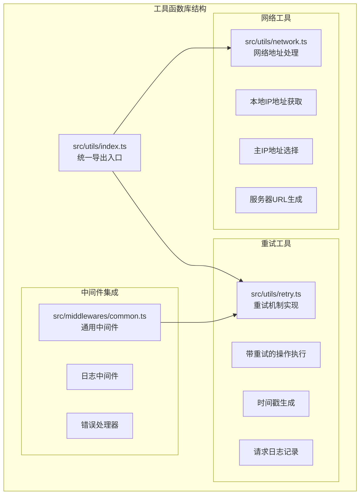
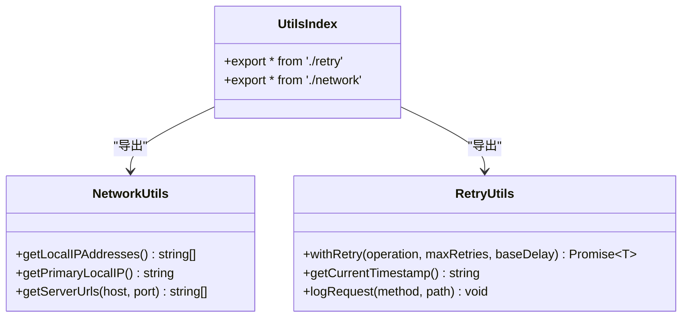
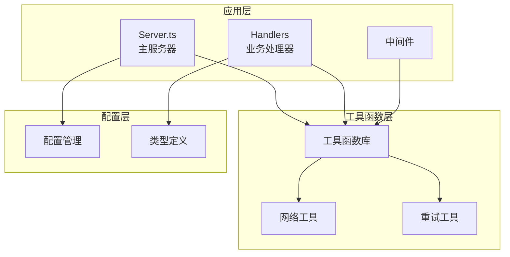
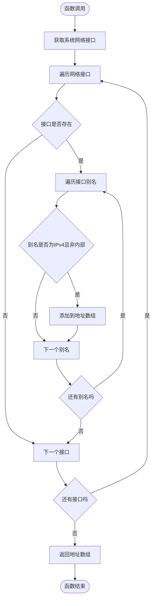
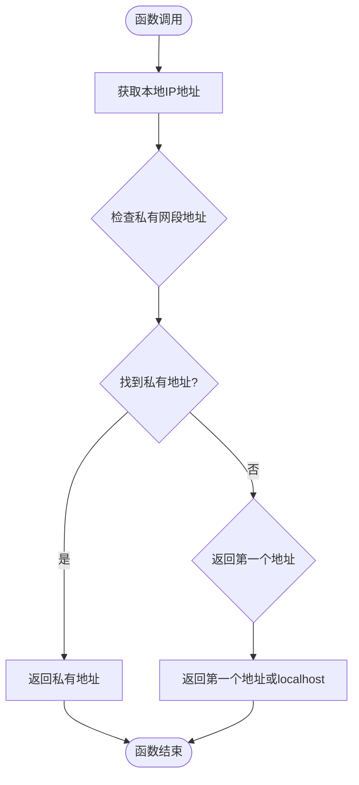
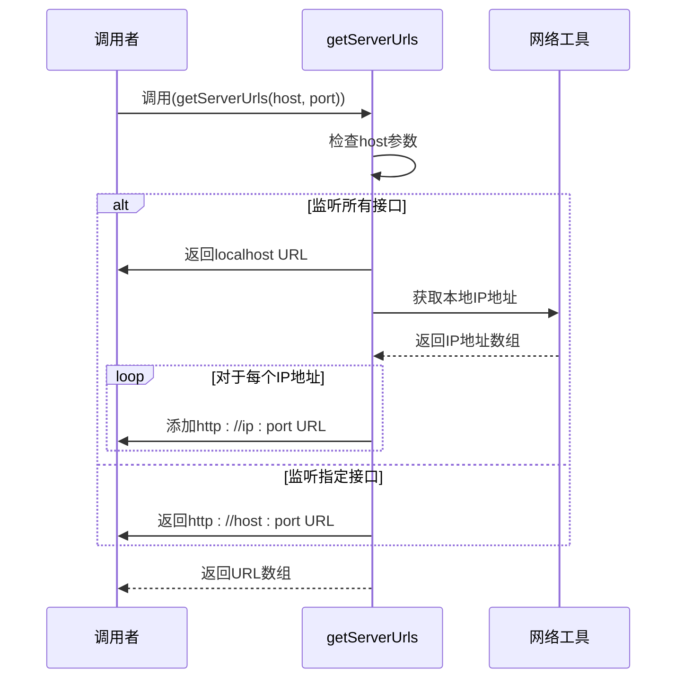
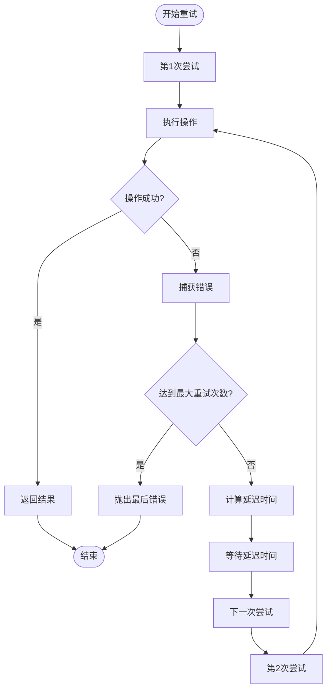
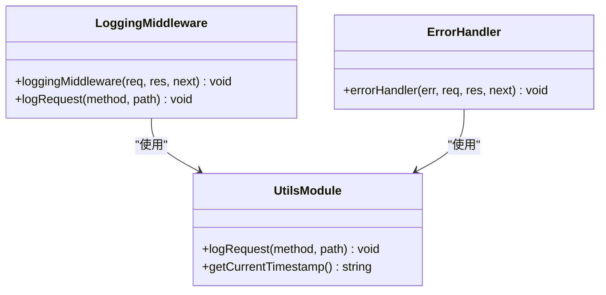
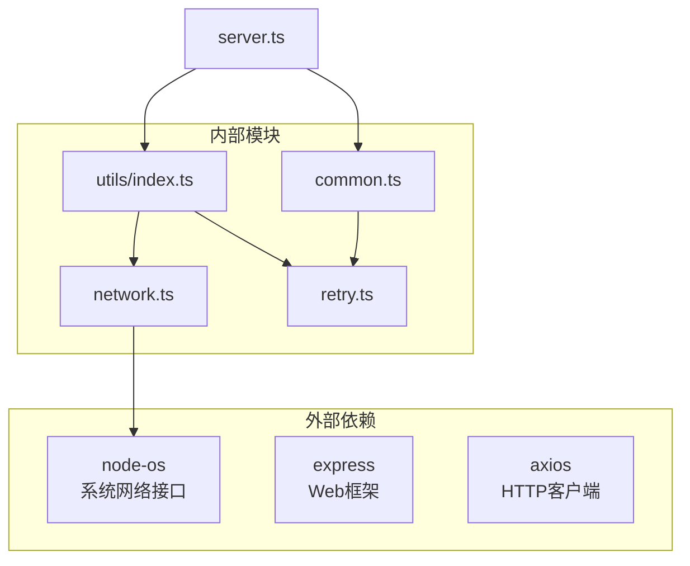

# 通用工具函数

<cite>
**本文档引用的文件**
- [src/utils/index.ts](file://src/utils/index.ts)
- [src/utils/network.ts](file://src/utils/network.ts)
- [src/utils/retry.ts](file://src/utils/retry.ts)
- [src/middlewares/common.ts](file://src/middlewares/common.ts)
- [src/middlewares/index.ts](file://src/middlewares/index.ts)
- [src/server.ts](file://src/server.ts)
- [src/handlers/base.ts](file://src/handlers/base.ts)
- [src/types/api.ts](file://src/types/api.ts)
- [src/types/index.ts](file://src/types/index.ts)
- [package.json](file://package.json)
</cite>

## 目录
1. [简介](#简介)
2. [项目结构](#项目结构)
3. [核心组件](#核心组件)
4. [架构概览](#架构概览)
5. [详细组件分析](#详细组件分析)
6. [依赖分析](#依赖分析)
7. [性能考虑](#性能考虑)
8. [故障排除指南](#故障排除指南)
9. [结论](#结论)

## 简介

本文档详细介绍了 xcode-ai-proxy 项目中的通用工具函数库。该工具函数库提供了网络地址解析、请求重试机制、日志记录等核心功能，为整个代理服务提供基础设施支持。工具函数采用模块化设计，通过统一的导出机制向其他模块提供可复用的功能。

## 项目结构

工具函数库位于 `src/utils/` 目录下，采用清晰的模块化组织结构：

**图表来源**
- [src/utils/index.ts:1-2](file://src/utils/index.ts#L1-L2)
- [src/utils/network.ts:1-51](file://src/utils/network.ts#L1-L51)
- [src/utils/retry.ts:1-34](file://src/utils/retry.ts#L1-L34)
- [src/middlewares/common.ts:1-25](file://src/middlewares/common.ts#L1-L25)

**章节来源**
- [src/utils/index.ts:1-2](file://src/utils/index.ts#L1-L2)
- [src/utils/network.ts:1-51](file://src/utils/network.ts#L1-L51)
- [src/utils/retry.ts:1-34](file://src/utils/retry.ts#L1-L34)
- [src/middlewares/common.ts:1-25](file://src/middlewares/common.ts#L1-L25)

## 核心组件

### 工具函数库组织结构

工具函数库采用统一的导出机制，通过 `index.ts` 文件集中管理模块导出：

**图表来源**
- [src/utils/index.ts:1-2](file://src/utils/index.ts#L1-L2)
- [src/utils/network.ts:3-51](file://src/utils/network.ts#L3-L51)
- [src/utils/retry.ts:1-34](file://src/utils/retry.ts#L1-L34)

### 网络工具函数

网络工具函数负责处理本地IP地址获取、主IP地址选择和服务器URL生成等网络相关功能。

**章节来源**
- [src/utils/network.ts:3-51](file://src/utils/network.ts#L3-L51)

### 重试工具函数

重试工具函数提供带指数退避的重试机制、时间戳生成和请求日志记录功能。

**章节来源**
- [src/utils/retry.ts:1-34](file://src/utils/retry.ts#L1-L34)

## 架构概览

工具函数库在整个系统架构中扮演基础设施的角色，为其他模块提供可复用的功能：

**图表来源**
- [src/server.ts:1-88](file://src/server.ts#L1-L88)
- [src/utils/index.ts:1-2](file://src/utils/index.ts#L1-L2)
- [src/middlewares/common.ts:1-25](file://src/middlewares/common.ts#L1-L25)

## 详细组件分析

### 网络工具函数分析

#### getLocalIPAddresses 函数

该函数负责获取本机所有可用的IPv4地址，过滤掉内部回环地址和IPv6地址。

**图表来源**
- [src/utils/network.ts:3-20](file://src/utils/network.ts#L3-L20)

**输入参数**: 无
**返回值**: 字符串数组，包含所有可用的IPv4外部地址
**使用场景**: 
- 服务器启动时显示可访问的URL地址
- 自动检测本机网络环境
- 网络诊断和连接测试

#### getPrimaryLocalIP 函数

该函数从所有本地IP地址中选择最优的主IP地址。

**图表来源**
- [src/utils/network.ts:22-33](file://src/utils/network.ts#L22-L33)

**输入参数**: 无
**返回值**: 字符串，最优的本地IP地址
**使用场景**:
- 生成默认的服务器绑定地址
- 提供用户友好的默认配置
- 网络环境自适应

#### getServerUrls 函数

该函数根据主机名和端口号生成完整的服务器访问URL列表。

**图表来源**
- [src/utils/network.ts:35-51](file://src/utils/network.ts#L35-L51)

**输入参数**:
- host: 字符串，服务器监听的主机名或IP地址
- port: 数字，服务器监听的端口号
**返回值**: 字符串数组，包含所有可能的服务器访问URL
**使用场景**:
- 服务器启动时显示可访问地址
- 生成客户端配置信息
- 网络调试和诊断

**章节来源**
- [src/utils/network.ts:3-51](file://src/utils/network.ts#L3-L51)

### 重试工具函数分析

#### withRetry 函数

这是最核心的重试机制实现，提供带指数退避的自动重试功能。

**图表来源**
- [src/utils/retry.ts:1-26](file://src/utils/retry.ts#L1-L26)

**输入参数**:
- operation: 函数，需要执行的操作
- maxRetries: 数字，默认3，最大重试次数
- baseDelay: 数字，默认1000，基础延迟时间（毫秒）
**返回值**: Promise，包含操作结果
**使用场景**:
- 网络请求的自动重试
- 外部API调用的容错处理
- 数据库连接的稳定性保障

#### getCurrentTimestamp 函数

生成当前时间的标准ISO格式字符串。

**输入参数**: 无
**返回值**: 字符串，当前时间的ISO格式表示
**使用场景**:
- 日志记录的时间戳
- 请求追踪和审计
- 性能监控数据标记

#### logRequest 函数

记录HTTP请求的基本信息。

**输入参数**:
- method: 字符串，HTTP方法（GET、POST等）
- path: 字符串，请求路径
**返回值**: 无
**使用场景**:
- API调用的日志记录
- 请求监控和分析
- 调试和问题排查

**章节来源**
- [src/utils/retry.ts:1-34](file://src/utils/retry.ts#L1-L34)

### 中间件集成分析

工具函数与Express中间件系统的集成展示了良好的模块化设计：

**图表来源**
- [src/middlewares/common.ts:1-25](file://src/middlewares/common.ts#L1-L25)
- [src/utils/retry.ts:28-34](file://src/utils/retry.ts#L28-L34)

**章节来源**
- [src/middlewares/common.ts:1-25](file://src/middlewares/common.ts#L1-L25)
- [src/middlewares/index.ts:1-1](file://src/middlewares/index.ts#L1-L1)

## 依赖分析

工具函数库的依赖关系清晰且简洁，遵循最小依赖原则：

**图表来源**
- [src/utils/network.ts:1-1](file://src/utils/network.ts#L1-L1)
- [src/server.ts:1-88](file://src/server.ts#L1-L88)
- [src/middlewares/common.ts:1-25](file://src/middlewares/common.ts#L1-L25)

**章节来源**
- [package.json:14-28](file://package.json#L14-L28)
- [src/utils/network.ts:1-1](file://src/utils/network.ts#L1-L1)

## 性能考虑

### 时间复杂度分析

1. **getLocalIPAddresses**: O(n*m)，其中n是网络接口数量，m是每个接口的别名数量
2. **getPrimaryLocalIP**: O(k)，其中k是找到的第一个匹配私有地址的位置
3. **getServerUrls**: O(m)，其中m是本地IP地址数量
4. **withRetry**: O(r)，其中r是重试次数

### 内存使用优化

- 所有函数都使用原生JavaScript数据结构，避免额外的内存开销
- 网络地址获取使用迭代器模式，逐个处理接口和别名
- 错误处理不创建额外的对象实例

### 缓存策略

当前实现没有使用缓存机制。对于频繁调用的场景，可以考虑：
- 缓存网络接口信息一段时间
- 实现轻量级的内存缓存

## 故障排除指南

### 常见问题及解决方案

#### 网络地址获取失败

**问题症状**: `getLocalIPAddresses` 返回空数组
**可能原因**:
- 系统网络接口配置异常
- 权限不足访问网络信息
- Docker容器环境限制

**解决方案**:
- 检查系统网络配置
- 确认应用程序权限
- 在Docker环境中使用正确的网络模式

#### 重试机制失效

**问题症状**: `withRetry` 不按预期工作
**可能原因**:
- 操作函数未正确抛出异常
- 重试次数设置过小
- 延迟时间计算异常

**解决方案**:
- 确保操作函数在失败时抛出异常
- 检查maxRetries和baseDelay参数
- 验证Promise的正确使用

#### 日志记录异常

**问题症状**: `logRequest` 输出格式不正确
**可能原因**:
- 时间戳生成异常
- 控制台输出被重定向
- 字符编码问题

**解决方案**:
- 检查系统时间和时区设置
- 验证控制台输出权限
- 确认字符编码兼容性

**章节来源**
- [src/utils/network.ts:3-51](file://src/utils/network.ts#L3-L51)
- [src/utils/retry.ts:1-34](file://src/utils/retry.ts#L1-L34)
- [src/middlewares/common.ts:9-25](file://src/middlewares/common.ts#L9-L25)

## 结论

xcode-ai-proxy 项目的通用工具函数库展现了优秀的模块化设计和实用性。通过精心设计的网络工具和重试机制，为整个代理服务提供了稳定可靠的基础设施支持。

### 设计优势

1. **模块化设计**: 清晰的职责分离，每个函数都有明确的功能边界
2. **简单易用**: API设计直观，易于理解和使用
3. **可扩展性**: 良好的扩展点，便于添加新的工具函数
4. **性能优化**: 采用高效的算法和数据结构

### 改进建议

1. **增加单元测试**: 为关键函数添加全面的测试用例
2. **文档完善**: 为每个函数添加详细的JSDoc注释
3. **类型安全**: 使用更严格的TypeScript类型定义
4. **错误处理**: 增强错误处理和异常情况的处理能力

这些工具函数为构建可靠的AI代理服务奠定了坚实的基础，其设计理念和实现方式值得在其他项目中借鉴和应用。