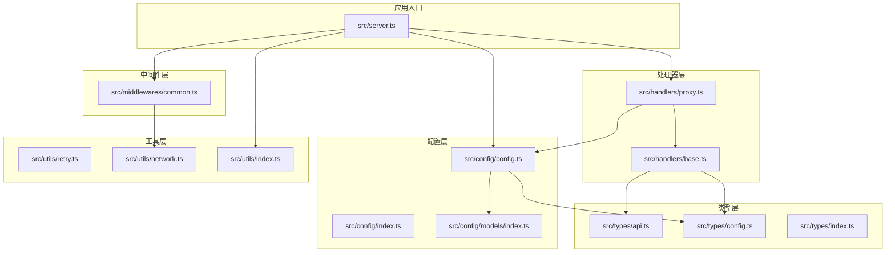
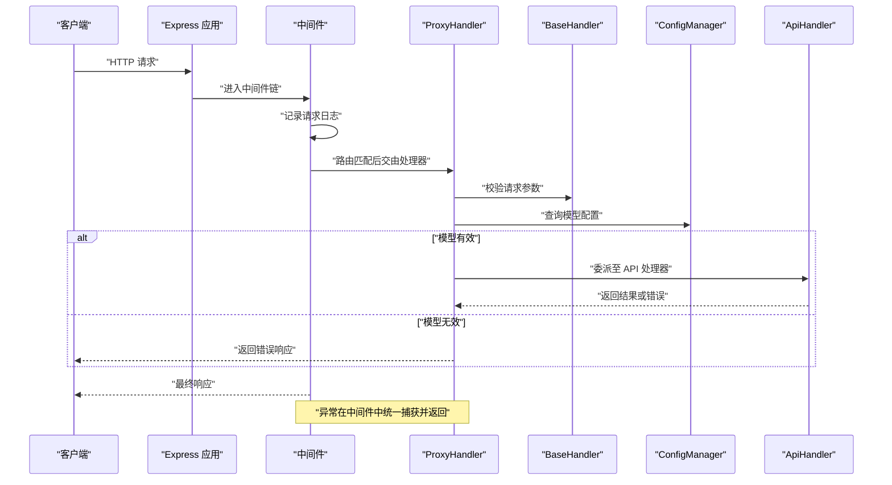
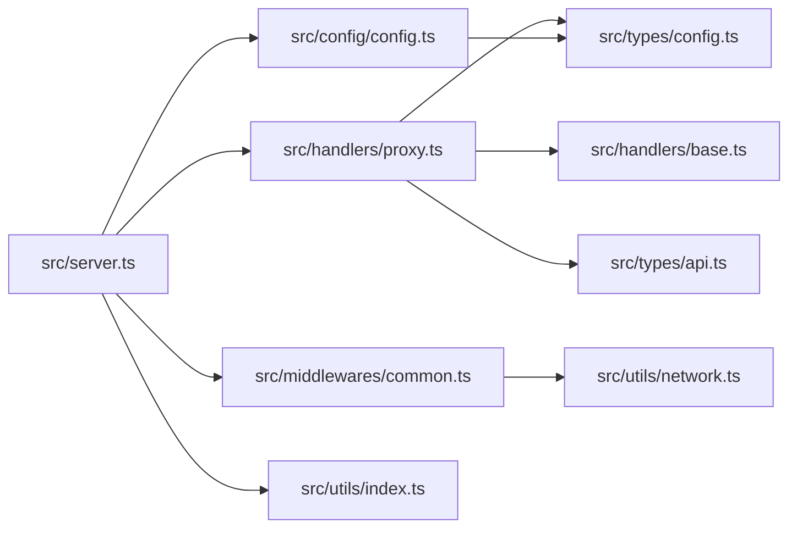

# 代码规范与约定

<cite>
**本文引用的文件**
- [package.json](file://package.json)
- [tsconfig.json](file://tsconfig.json)
- [src/server.ts](file://src/server.ts)
- [src/types/index.ts](file://src/types/index.ts)
- [src/types/api.ts](file://src/types/api.ts)
- [src/types/config.ts](file://src/types/config.ts)
- [src/config/index.ts](file://src/config/index.ts)
- [src/config/config.ts](file://src/config/config.ts)
- [src/config/models/index.ts](file://src/config/models/index.ts)
- [src/handlers/base.ts](file://src/handlers/base.ts)
- [src/handlers/proxy.ts](file://src/handlers/proxy.ts)
- [src/middlewares/common.ts](file://src/middlewares/common.ts)
- [src/utils/index.ts](file://src/utils/index.ts)
- [src/utils/network.ts](file://src/utils/network.ts)
- [src/utils/retry.ts](file://src/utils/retry.ts)
</cite>

## 目录
1. [引言](#引言)
2. [项目结构](#项目结构)
3. [核心组件](#核心组件)
4. [架构总览](#架构总览)
5. [详细组件分析](#详细组件分析)
6. [依赖分析](#依赖分析)
7. [性能考虑](#性能考虑)
8. [故障排查指南](#故障排查指南)
9. [结论](#结论)
10. [附录](#附录)

## 引言
本文件为 xcode-ai-proxy 的代码规范与约定文档，面向 TypeScript 开发者，聚焦以下方面：
- 接口定义、类型声明与泛型使用规范
- 文件组织结构与命名约定（目录、文件、模块导出/导入）
- 注释标准（JSDoc 注释格式、函数注释模板、复杂逻辑注释要求）
- 代码风格指南（缩进、空格、换行）
- 错误处理规范与异常抛出约定
- 代码审查检查清单与质量门禁标准

本规范以仓库现有实现为依据，结合 tsconfig.json 的编译选项与 package.json 的脚本约定，形成可落地的工程实践。

## 项目结构
项目采用按“职责分层 + 功能聚合”相结合的组织方式：
- src/config：配置管理与模型提供者
- src/handlers：HTTP 处理器（基础抽象与具体实现）
- src/middlewares：中间件（日志与错误处理）
- src/types：类型定义（API、配置）
- src/utils：通用工具（网络、重试、日志）
- 根级入口：src/server.ts

图表来源
- [src/server.ts:1-88](file://src/server.ts#L1-L88)
- [src/config/config.ts:1-123](file://src/config/config.ts#L1-L123)
- [src/handlers/base.ts:1-40](file://src/handlers/base.ts#L1-L40)
- [src/handlers/proxy.ts:1-66](file://src/handlers/proxy.ts#L1-L66)
- [src/middlewares/common.ts:1-25](file://src/middlewares/common.ts#L1-L25)
- [src/types/api.ts:1-58](file://src/types/api.ts#L1-L58)
- [src/types/config.ts:1-48](file://src/types/config.ts#L1-L48)
- [src/utils/retry.ts:1-34](file://src/utils/retry.ts#L1-L34)
- [src/utils/network.ts:1-51](file://src/utils/network.ts#L1-L51)

章节来源
- [src/server.ts:1-88](file://src/server.ts#L1-L88)
- [tsconfig.json:1-35](file://tsconfig.json#L1-L35)
- [package.json:1-30](file://package.json#L1-L30)

## 核心组件
- 应用入口与路由：在入口类中集中初始化 Express 实例、中间件、路由与错误处理，并输出启动信息。
- 配置管理：单例模式读取环境变量，校验必要项，构建应用配置与模型配置映射。
- 处理器体系：抽象基类统一请求校验与错误发送；代理处理器根据模型类型委派到具体 API 处理器。
- 中间件：统一日志与错误捕获，保证响应一致性。
- 类型系统：围绕 OpenAI 兼容的聊天补全请求/响应与内部配置进行强类型建模。
- 工具库：网络地址解析、重试机制与通用日志。

章节来源
- [src/server.ts:8-84](file://src/server.ts#L8-L84)
- [src/config/config.ts:7-123](file://src/config/config.ts#L7-L123)
- [src/handlers/base.ts:5-40](file://src/handlers/base.ts#L5-L40)
- [src/handlers/proxy.ts:6-66](file://src/handlers/proxy.ts#L6-L66)
- [src/middlewares/common.ts:4-25](file://src/middlewares/common.ts#L4-L25)
- [src/types/api.ts:1-58](file://src/types/api.ts#L1-L58)
- [src/types/config.ts:1-48](file://src/types/config.ts#L1-L48)
- [src/utils/network.ts:1-51](file://src/utils/network.ts#L1-L51)
- [src/utils/retry.ts:1-34](file://src/utils/retry.ts#L1-L34)

## 架构总览
下图展示从客户端请求到响应的关键交互流程，以及各组件间的依赖关系。

图表来源
- [src/server.ts:23-44](file://src/server.ts#L23-L44)
- [src/middlewares/common.ts:9-25](file://src/middlewares/common.ts#L9-L25)
- [src/handlers/proxy.ts:9-37](file://src/handlers/proxy.ts#L9-L37)
- [src/handlers/base.ts:10-34](file://src/handlers/base.ts#L10-L34)
- [src/config/config.ts:101-115](file://src/config/config.ts#L101-L115)

## 详细组件分析

### 类型系统与接口定义
- 设计原则
  - 使用接口描述外部兼容的数据结构（如聊天消息、请求/响应、模型信息）。
  - 使用联合类型与字面量类型约束枚举值，确保调用端与运行时一致。
  - 对可选字段明确标注，避免隐式 undefined。
- 关键类型与用途
  - 请求体与响应体：用于与上游模型服务通信的结构化数据。
  - 配置类型：封装模型提供商、URL、密钥等配置项。
  - 应用配置：端口、主机、重试策略、超时等运行时参数。
- 泛型使用建议
  - 在工具函数中使用泛型以保持返回值类型安全（例如重试工具的返回值类型）。
  - 在处理器中对可能的异步操作使用 Promise<T> 明确类型边界。

章节来源
- [src/types/api.ts:1-58](file://src/types/api.ts#L1-L58)
- [src/types/config.ts:1-48](file://src/types/config.ts#L1-L48)
- [src/utils/retry.ts:1-26](file://src/utils/retry.ts#L1-L26)

### 文件组织与命名约定
- 目录结构
  - config：配置与模型提供者
  - handlers：请求处理器（抽象与具体实现）
  - middlewares：中间件
  - types：类型定义
  - utils：工具函数
  - server.ts：应用入口
- 文件命名
  - 采用小驼峰命名，如 server.ts、network.ts、retry.ts。
  - 类型文件以对应领域命名，如 api.ts、config.ts。
- 模块导出/导入
  - 采用显式导出与按需导入，避免通配符导出造成命名冲突。
  - 在 index.ts 中统一再导出，便于上层模块集中引用。

章节来源
- [src/config/index.ts:1](file://src/config/index.ts#L1)
- [src/config/models/index.ts:1-5](file://src/config/models/index.ts#L1-L5)
- [src/types/index.ts:1-2](file://src/types/index.ts#L1-L2)
- [src/utils/index.ts:1-2](file://src/utils/index.ts#L1-L2)

### 注释标准
- JSDoc 注释格式
  - 函数/方法：使用 JSDoc 注释块，包含 @param、@returns、@throws 等标签。
  - 类与接口：对公共属性与方法进行简要说明。
- 函数注释模板
  - 描述函数目的、输入参数、返回值与异常情况。
  - 对复杂逻辑分步骤说明，必要时给出调用示例或注意事项。
- 复杂逻辑注释要求
  - 对分支判断、循环、异步流程、错误恢复路径进行注释。
  - 对配置项、默认值、边界条件进行说明。

章节来源
- [src/handlers/base.ts:10-34](file://src/handlers/base.ts#L10-L34)
- [src/handlers/proxy.ts:9-37](file://src/handlers/proxy.ts#L9-L37)
- [src/utils/retry.ts:1-26](file://src/utils/retry.ts#L1-L26)

### 代码风格指南
- 缩进与空格
  - 统一使用 2 空格缩进，避免混用制表符。
  - 逗号后加空格，运算符两侧加空格。
- 换行
  - 行宽不超过 120 字符；对象与数组的键/元素分行书写。
  - 函数签名、条件语句与循环语句的左括号独占一行。
- 命名
  - 类名使用帕斯卡命名法；方法与变量使用小驼峰命名法。
  - 常量使用全大写与下划线组合。
- 结构化排版
  - 导入语句分组：第三方库、内部模块、相对路径模块。
  - 类成员按访问控制与职责分组排列。

章节来源
- [tsconfig.json:8-25](file://tsconfig.json#L8-L25)

### 错误处理规范与异常抛出约定
- 统一错误响应
  - 使用统一的错误响应结构，包含 message 与 type 字段。
  - 在中间件中捕获未处理异常，返回 500 并包含错误类型。
- 请求参数校验
  - 在处理器基类中对必需参数进行校验，缺失时抛出带明确信息的错误。
- 业务错误
  - 对不支持的模型、未知类型等情况，返回 4xx 并携带错误类型。
- 异常传播
  - 在代理处理器中捕获异常并转换为统一错误响应，避免泄露内部细节。

章节来源
- [src/handlers/base.ts:24-34](file://src/handlers/base.ts#L24-L34)
- [src/middlewares/common.ts:15-24](file://src/middlewares/common.ts#L15-L24)
- [src/handlers/proxy.ts:14-36](file://src/handlers/proxy.ts#L14-L36)

### 配置管理与模型提供者
- 单例配置
  - ConfigManager 以单例模式加载环境变量，校验必要项并初始化应用与模型配置。
- 模型配置
  - 将不同提供商的模型集合合并为统一映射，供处理器查询。
- 运行时参数
  - 端口、主机、最大重试次数、重试延迟、请求超时等均来自环境变量或默认值。

章节来源
- [src/config/config.ts:7-123](file://src/config/config.ts#L7-L123)
- [src/config/index.ts:1](file://src/config/index.ts#L1)
- [src/config/models/index.ts:1-5](file://src/config/models/index.ts#L1-L5)

### 处理器与中间件
- 抽象处理器
  - 提供请求校验与错误发送的通用能力，子类仅关注业务细节。
- 代理处理器
  - 根据模型 ID 查询配置，委派给具体 API 处理器；对无效模型返回错误。
- 中间件
  - 日志中间件记录请求方法与路径；错误中间件统一捕获异常并返回标准化错误。

章节来源
- [src/handlers/base.ts:5-40](file://src/handlers/base.ts#L5-L40)
- [src/handlers/proxy.ts:6-66](file://src/handlers/proxy.ts#L6-L66)
- [src/middlewares/common.ts:4-25](file://src/middlewares/common.ts#L4-L25)

### 工具库
- 网络工具
  - 获取本地 IP 列表、主 IP 与服务访问 URL，支持监听所有接口时的多地址展示。
- 重试工具
  - 带指数退避的重试机制，记录每次尝试与延迟时间，最终抛出最后一次错误。
- 通用日志
  - 输出带时间戳的请求日志，便于问题定位。

章节来源
- [src/utils/network.ts:1-51](file://src/utils/network.ts#L1-L51)
- [src/utils/retry.ts:1-34](file://src/utils/retry.ts#L1-L34)

## 依赖分析
- 内部依赖
  - server.ts 依赖 config、handlers、middlewares、utils。
  - handlers 依赖 types 与 config。
  - middlewares 依赖 utils。
  - utils 被 server 与 middlewares 使用。
- 外部依赖
  - express、cors、axios、dotenv 等。
- 类型依赖
  - types 下的 api.ts 与 config.ts 为 handlers 与 config 提供类型支撑。

图表来源
- [src/server.ts:1-88](file://src/server.ts#L1-L88)
- [src/handlers/proxy.ts:1-66](file://src/handlers/proxy.ts#L1-L66)
- [src/handlers/base.ts:1-40](file://src/handlers/base.ts#L1-L40)
- [src/middlewares/common.ts:1-25](file://src/middlewares/common.ts#L1-L25)
- [src/utils/network.ts:1-51](file://src/utils/network.ts#L1-L51)
- [src/utils/index.ts:1-2](file://src/utils/index.ts#L1-L2)
- [src/types/api.ts:1-58](file://src/types/api.ts#L1-L58)
- [src/types/config.ts:1-48](file://src/types/config.ts#L1-L48)
- [src/config/config.ts:1-123](file://src/config/config.ts#L1-L123)

章节来源
- [package.json:14-28](file://package.json#L14-L28)
- [tsconfig.json:22-25](file://tsconfig.json#L22-L25)

## 性能考虑
- 请求体大小限制
  - Express JSON 解析限制为 50MB，满足大模型请求场景。
- 超时与重试
  - 应用配置支持请求超时与重试策略，配合指数退避降低抖动。
- 流式响应
  - 处理器支持流式输出，减少一次性响应体积与等待时间。
- 日志开销
  - 在开发与调试阶段保留日志；生产环境可通过中间件与日志级别控制。

章节来源
- [src/server.ts:25](file://src/server.ts#L25)
- [src/config/config.ts:53-67](file://src/config/config.ts#L53-L67)
- [src/utils/retry.ts:1-34](file://src/utils/retry.ts#L1-L34)

## 故障排查指南
- 启动失败
  - 检查环境变量是否配置齐全（至少一个提供商的密钥）。
  - 查看启动日志中的模型列表与重试配置。
- 请求错误
  - 确认请求体包含必需字段（model、messages）。
  - 检查模型 ID 是否在支持列表中。
- 代理异常
  - 中间件会捕获异常并返回统一错误；查看错误类型与消息。
- 网络与地址
  - 当监听 0.0.0.0 时，确认本机与局域网访问地址是否正确。

章节来源
- [src/config/config.ts:29-51](file://src/config/config.ts#L29-L51)
- [src/server.ts:54-83](file://src/server.ts#L54-L83)
- [src/handlers/base.ts:10-22](file://src/handlers/base.ts#L10-L22)
- [src/handlers/proxy.ts:14-36](file://src/handlers/proxy.ts#L14-L36)
- [src/middlewares/common.ts:15-24](file://src/middlewares/common.ts#L15-L24)
- [src/utils/network.ts:35-51](file://src/utils/network.ts#L35-L51)

## 结论
本规范基于现有代码实现总结而来，强调类型安全、结构清晰、错误统一与可维护性。建议在后续迭代中持续完善注释与测试覆盖，确保规范落地执行。

## 附录

### 代码审查检查清单
- 类型与接口
  - 是否使用接口描述外部兼容结构？
  - 是否对可选字段与联合类型进行明确标注？
  - 是否在工具函数中使用泛型提升类型安全？
- 文件组织与命名
  - 目录与文件命名是否符合约定？
  - 是否存在通配符导出导致的命名冲突？
- 注释与文档
  - 函数/方法是否具备 JSDoc 注释？
  - 复杂逻辑是否有必要注释说明？
- 错误处理
  - 是否统一错误响应结构？
  - 是否在中间件中捕获未处理异常？
- 风格与一致性
  - 缩进、空格、换行是否符合规范？
  - 命名是否一致且语义明确？

### 质量门禁标准
- 编译与类型检查
  - 通过类型检查命令，无任何类型错误。
- 代码风格
  - 通过编辑器/IDE 的格式化设置，保持一致风格。
- 变更范围
  - 新增或修改的文件必须补充类型定义与注释。
- 测试与验证
  - 关键路径（配置加载、请求校验、错误处理）应有单元/集成验证。

章节来源
- [package.json:12](file://package.json#L12)
- [tsconfig.json:8-25](file://tsconfig.json#L8-L25)