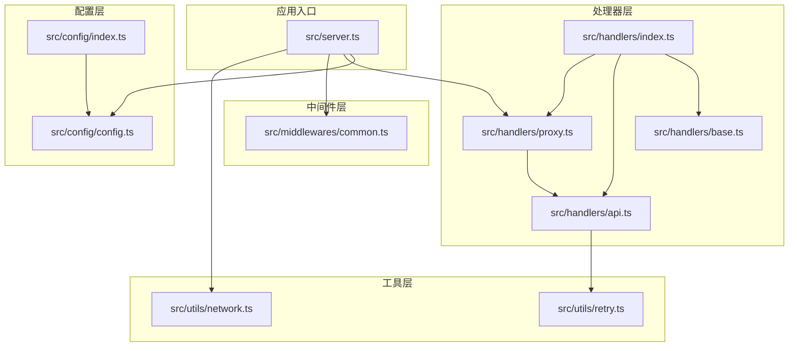
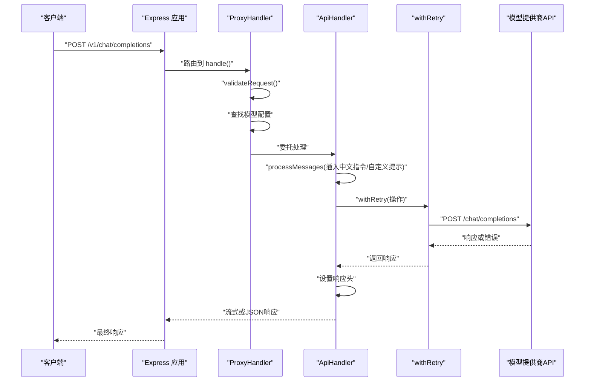
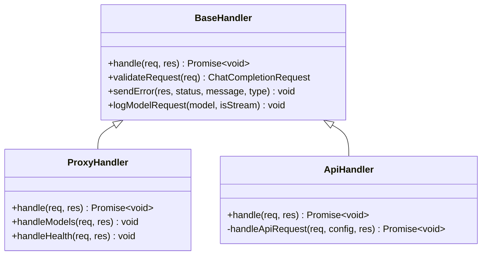
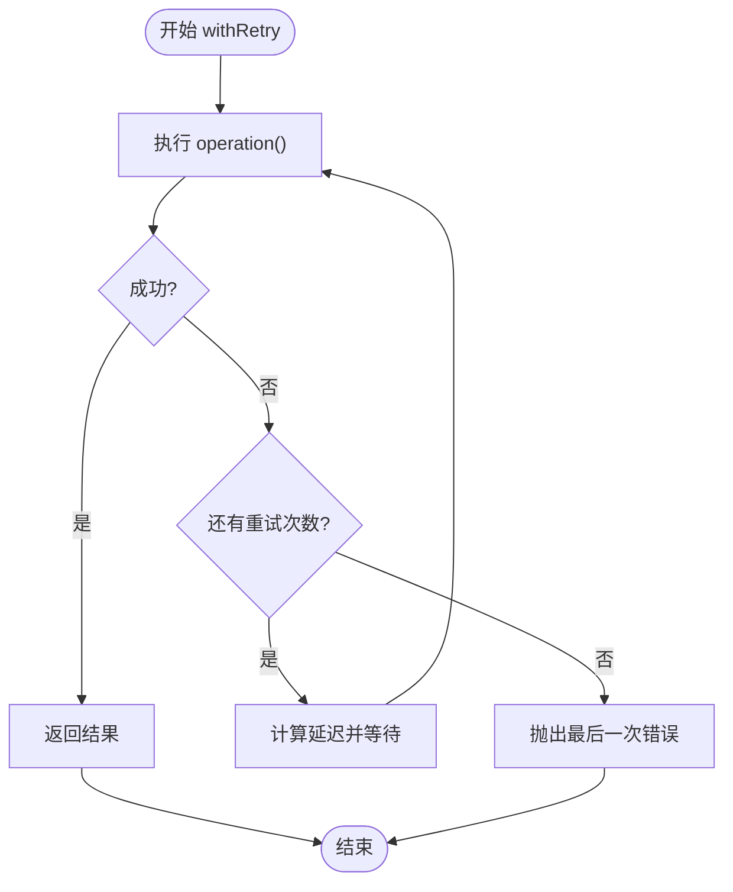
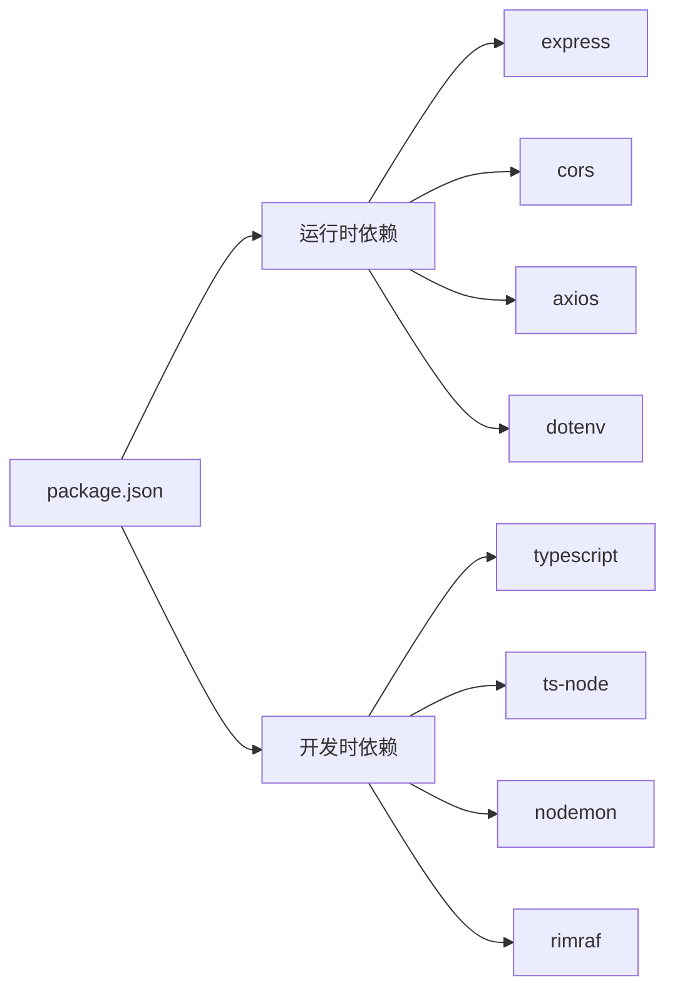

# 开发指南

<cite>
**本文档引用的文件**
- [package.json](file://package.json)
- [tsconfig.json](file://tsconfig.json)
- [src/server.ts](file://src/server.ts)
- [src/config/config.ts](file://src/config/config.ts)
- [src/config/index.ts](file://src/config/index.ts)
- [src/handlers/base.ts](file://src/handlers/base.ts)
- [src/handlers/api.ts](file://src/handlers/api.ts)
- [src/handlers/proxy.ts](file://src/handlers/proxy.ts)
- [src/handlers/index.ts](file://src/handlers/index.ts)
- [src/middlewares/common.ts](file://src/middlewares/common.ts)
- [src/utils/network.ts](file://src/utils/network.ts)
- [src/utils/retry.ts](file://src/utils/retry.ts)
- [.gitignore](file://.gitignore)
</cite>

## 目录
1. [简介](#简介)
2. [项目结构](#项目结构)
3. [核心组件](#核心组件)
4. [架构总览](#架构总览)
5. [详细组件分析](#详细组件分析)
6. [依赖分析](#依赖分析)
7. [性能考虑](#性能考虑)
8. [故障排查指南](#故障排查指南)
9. [结论](#结论)
10. [附录](#附录)

## 简介
本指南面向 xcode-ai-proxy 项目的开发者，覆盖从开发环境搭建到构建部署的全流程，包括 Node.js 与 TypeScript 配置、代码规范与约定、调试技巧、测试策略、代码审查与质量保障、贡献流程以及构建与打包实践。项目采用 Express 作为 Web 服务器，统一代理多家大模型厂商的 OpenAI 兼容接口，支持健康检查、模型列表查询、聊天补全（含流式）与智能重试。

## 项目结构
项目采用按功能分层的目录组织方式：
- src/config：配置管理与多模型提供商适配
- src/handlers：HTTP 请求处理器（基础抽象、API 代理、路由入口）
- src/middlewares：通用中间件（日志、错误处理）
- src/types：类型定义（API、配置、索引导出）
- src/utils：工具模块（网络地址解析、重试机制、日志）
- 根目录：构建脚本、类型检查、运行时入口

**图表来源**
- [src/server.ts:1-88](file://src/server.ts#L1-L88)
- [src/config/config.ts:1-121](file://src/config/config.ts#L1-L121)
- [src/handlers/base.ts:1-40](file://src/handlers/base.ts#L1-L40)
- [src/handlers/api.ts:1-196](file://src/handlers/api.ts#L1-L196)
- [src/handlers/proxy.ts:1-66](file://src/handlers/proxy.ts#L1-L66)
- [src/middlewares/common.ts:1-25](file://src/middlewares/common.ts#L1-L25)
- [src/utils/network.ts:1-51](file://src/utils/network.ts#L1-L51)
- [src/utils/retry.ts:1-34](file://src/utils/retry.ts#L1-L34)

**章节来源**
- [src/server.ts:1-88](file://src/server.ts#L1-L88)
- [src/config/index.ts:1-1](file://src/config/index.ts#L1-L1)
- [src/handlers/index.ts:1-3](file://src/handlers/index.ts#L1-L3)

## 核心组件
- 服务器与路由
  - Express 应用初始化、CORS、JSON 解析、日志中间件、统一错误处理
  - 提供 /health、/v1/models、/v1/chat/completions、/api/v1/chat/completions、/v1/messages 等端点
- 配置管理
  - 单例模式加载环境变量，校验至少配置一个 API Key
  - 初始化应用配置（端口、主机、最大重试、重试延迟、请求超时、自定义系统提示）
  - 聚合多家模型提供商配置（智谱、Kimi、Gemini、通义）
- 处理器
  - 基类提供请求校验、错误封装与日志
  - 代理处理器负责模型选择与路由至 API 处理器
  - API 处理器对接各厂商 OpenAI 兼容接口，支持流式与非流式响应、特殊 Provider 配置、重试与错误透传
- 中间件
  - 日志中间件与全局错误处理中间件
- 工具
  - 网络工具：本地 IP 获取、主 IP 选择、服务地址生成
  - 重试工具：指数退避重试、请求时间戳与日志

**章节来源**
- [src/server.ts:8-84](file://src/server.ts#L8-L84)
- [src/config/config.ts:7-121](file://src/config/config.ts#L7-L121)
- [src/handlers/base.ts:5-40](file://src/handlers/base.ts#L5-L40)
- [src/handlers/proxy.ts:6-66](file://src/handlers/proxy.ts#L6-L66)
- [src/handlers/api.ts:8-196](file://src/handlers/api.ts#L8-L196)
- [src/middlewares/common.ts:4-25](file://src/middlewares/common.ts#L4-L25)
- [src/utils/network.ts:3-51](file://src/utils/network.ts#L3-L51)
- [src/utils/retry.ts:1-34](file://src/utils/retry.ts#L1-L34)

## 架构总览
下图展示从客户端请求到模型 API 的完整链路，包括路由、校验、模型选择、重试与响应透传。

**图表来源**
- [src/server.ts:29-44](file://src/server.ts#L29-L44)
- [src/handlers/proxy.ts:9-37](file://src/handlers/proxy.ts#L9-L37)
- [src/handlers/api.ts:30-195](file://src/handlers/api.ts#L30-L195)
- [src/utils/retry.ts:1-26](file://src/utils/retry.ts#L1-L26)

## 详细组件分析

### 服务器与路由
- 职责
  - 初始化 Express 实例，注册 CORS、JSON 解析、日志中间件
  - 注册健康检查、模型列表、聊天补全等路由
  - 统一错误处理中间件
  - 启动监听，打印启动信息（支持的模型、重试配置、Xcode 配置示例）
- 关键点
  - 支持多路径格式的聊天补全端点，便于兼容不同客户端
  - JSON 体大小限制提升至 50MB，满足多模态场景
  - 启动日志包含本机与局域网访问地址，便于调试

**章节来源**
- [src/server.ts:23-84](file://src/server.ts#L23-L84)

### 配置管理（ConfigManager）
- 职责
  - 单例加载环境变量，校验至少存在一个 API Key
  - 初始化应用配置（端口、主机、重试、超时、自定义系统提示）
  - 聚合多家模型提供商配置，暴露查询接口
- 设计要点
  - 使用 Provider 抽象统一不同厂商的模型映射
  - 提供日志输出当前加载的模型清单

**章节来源**
- [src/config/config.ts:27-121](file://src/config/config.ts#L27-L121)

### 处理器层次
- BaseHandler
  - 统一请求校验（model、messages 必填与格式）
  - 统一错误响应封装
  - 日志记录模型与是否流式
- ProxyHandler
  - 校验请求后根据 model 定位配置
  - 将请求委派给 ApiHandler 处理
  - 提供 /v1/models 与 /health 接口
- ApiHandler
  - 构造 OpenAI 兼容请求体，插入中文交流指令与自定义系统提示
  - 针对 Kimi 使用 HTTPS Agent 并禁用压缩
  - 支持流式与非流式响应透传
  - 使用 withRetry 执行带指数退避的重试
  - 对 4xx 响应允许透传，便于调试

**图表来源**
- [src/handlers/base.ts:5-40](file://src/handlers/base.ts#L5-L40)
- [src/handlers/proxy.ts:6-66](file://src/handlers/proxy.ts#L6-L66)
- [src/handlers/api.ts:8-196](file://src/handlers/api.ts#L8-L196)

**章节来源**
- [src/handlers/base.ts:10-39](file://src/handlers/base.ts#L10-L39)
- [src/handlers/proxy.ts:9-57](file://src/handlers/proxy.ts#L9-L57)
- [src/handlers/api.ts:9-28](file://src/handlers/api.ts#L9-L28)

### 中间件
- loggingMiddleware：记录请求方法与路径
- errorHandler：统一捕获异常，返回 JSON 错误响应

**章节来源**
- [src/middlewares/common.ts:4-25](file://src/middlewares/common.ts#L4-L25)

### 工具模块
- network：获取本地 IPv4 地址、主 IP 与服务访问地址集合
- retry：withRetry 实现指数退避重试；日志与时间戳工具

**图表来源**
- [src/utils/retry.ts:1-26](file://src/utils/retry.ts#L1-L26)

**章节来源**
- [src/utils/network.ts:3-51](file://src/utils/network.ts#L3-L51)
- [src/utils/retry.ts:1-34](file://src/utils/retry.ts#L1-L34)

## 依赖分析
- 运行时依赖
  - express：Web 框架
  - cors：跨域支持
  - axios：HTTP 客户端
  - dotenv：环境变量加载
- 开发时依赖
  - @types/*：类型声明
  - ts-node/nodemon：开发与热重载
  - rimraf：清理构建目录
  - typescript：编译器

**图表来源**
- [package.json:14-28](file://package.json#L14-L28)

**章节来源**
- [package.json:6-12](file://package.json#L6-L12)

## 性能考虑
- 流式响应
  - 当客户端启用流式时，直接透传上游流，减少内存占用
- 超时与重试
  - 可配置请求超时与最大重试次数，指数退避降低雪崩风险
- 日志与调试
  - 禁用压缩便于调试，但生产中建议关闭以节省带宽
- 内存与并发
  - JSON 体上限提高至 50MB，注意在高并发场景下的内存压力

[本节为通用指导，无需列出章节来源]

## 故障排查指南
- 启动与访问
  - 启动后会打印本机与局域网访问地址，请确认防火墙与端口开放
  - 如需仅监听本机，可调整 HOST 与 PORT
- 模型不可用
  - 确认至少配置一个 API Key；查看启动日志中的支持模型清单
  - 若返回不支持的模型，检查请求 body 的 model 字段
- 流式响应问题
  - 确认客户端正确处理 SSE；如遇上游错误流，服务会尝试读取并记录错误内容
- 4xx 响应
  - 服务允许 4xx 透传以便调试；请检查 Authorization、模型名与请求体格式
- 重试与超时
  - 查看重试日志与延迟配置；必要时调高 MAX_RETRIES 或 RETRY_DELAY

**章节来源**
- [src/server.ts:54-83](file://src/server.ts#L54-L83)
- [src/config/config.ts:27-49](file://src/config/config.ts#L27-L49)
- [src/handlers/proxy.ts:14-24](file://src/handlers/proxy.ts#L14-L24)
- [src/handlers/api.ts:124-164](file://src/handlers/api.ts#L124-L164)
- [src/utils/retry.ts:8-26](file://src/utils/retry.ts#L8-L26)

## 结论
本项目通过清晰的分层设计与统一的 OpenAI 兼容接口，实现了对多家模型提供商的代理与增强（中文提示、自定义系统提示、流式与重试）。遵循本文档的开发与调试流程，可快速完成本地开发、测试与部署。

[本节为总结性内容，无需列出章节来源]

## 附录

### 开发环境搭建
- Node.js 与包管理
  - 使用 Node.js LTS 版本，推荐通过 nvm 安装与切换
  - 使用 npm 作为包管理器，确保版本较新
- 依赖安装
  - 在项目根目录执行安装命令，自动拉取运行时与开发时依赖
- TypeScript 配置
  - 目标版本与模块系统：ES2020 + commonjs
  - 输出目录 dist，源码目录 src
  - 严格模式开启，生成 declaration 与 sourceMap
  - 包含 src/**/*，排除 node_modules、dist 与 *.test.ts

**章节来源**
- [package.json:6-12](file://package.json#L6-L12)
- [tsconfig.json:2-26](file://tsconfig.json#L2-L26)

### 代码规范与约定
- 命名规范
  - 类名使用 PascalCase；方法与变量使用 camelCase
  - 文件名与导出保持一致，单例类以 Manager 结尾
- 文件组织
  - 按功能分层：config、handlers、middlewares、types、utils
  - index.ts 用于聚合导出，简化导入路径
- 注释标准
  - 公共 API 与复杂逻辑添加简要注释
  - 关键配置项与行为变更在变更日志或提交信息中说明

[本节为通用规范，无需列出章节来源]

### 调试技巧
- 开发服务器启动
  - 开发模式：使用脚本启动，支持热重载
  - 生产模式：先构建再运行
- 断点调试
  - 使用 VS Code 的 Node 调试器附加到 ts-node 进程
  - 在关键处理器（BaseHandler、ApiHandler）设置断点
- 日志与可观测性
  - 启动日志包含支持模型、重试与超时配置
  - 请求日志记录方法与路径；错误日志包含详细上下文

**章节来源**
- [package.json:9-10](file://package.json#L9-L10)
- [src/server.ts:54-83](file://src/server.ts#L54-L83)
- [src/middlewares/common.ts:15-24](file://src/middlewares/common.ts#L15-L24)

### 测试策略
- 单元测试
  - 对工具函数（如 withRetry、getServerUrls）进行独立测试
  - 使用最小化 Mock 模拟外部依赖（如 axios）
- 集成测试
  - 启动本地服务器，调用 /health 与 /v1/models 端点验证路由
  - 调用 /v1/chat/completions 并断言响应结构（非流式）
- API 测试
  - 使用真实或模拟的模型提供商端点，验证流式与非流式响应
  - 覆盖错误场景（4xx/5xx、超时、无 API Key）

[本节为通用策略，无需列出章节来源]

### 代码审查指南与质量保证
- 审查重点
  - 配置校验与错误处理是否完备
  - 请求体转换与头部设置是否符合 OpenAI 兼容规范
  - 流式响应透传是否正确设置响应头
  - 重试策略与日志是否充分
- 质量保障
  - 强制类型检查（type-check）
  - 代码风格与静态分析（可引入 ESLint/Prettier）
  - 提交前运行构建与类型检查脚本

**章节来源**
- [package.json:12](file://package.json#L12)
- [src/handlers/api.ts:168-194](file://src/handlers/api.ts#L168-L194)

### 贡献指南与 Pull Request 流程
- 分支策略
  - 从 main 分支创建特性分支，完成后发起 PR
- 提交流程
  - 更新变更日志与相关文档
  - 通过本地构建与类型检查
  - 代码审查通过后合并

[本节为通用流程，无需列出章节来源]

### 构建与打包
- TypeScript 编译
  - 使用 tsc 编译 src 到 dist，生成声明文件与 sourceMap
- 产物优化
  - 保留声明与映射文件便于调试
  - 生产部署前可进行二次压缩与体积分析（可选）
- 部署准备
  - 准备 .env 文件（参考 .gitignore 中的忽略规则）
  - 确保环境变量（API Key、端口、重试等）正确配置
  - 使用 start 脚本运行生产构建产物

**章节来源**
- [package.json:7-8](file://package.json#L7-L8)
- [tsconfig.json:6](file://tsconfig.json#L6)