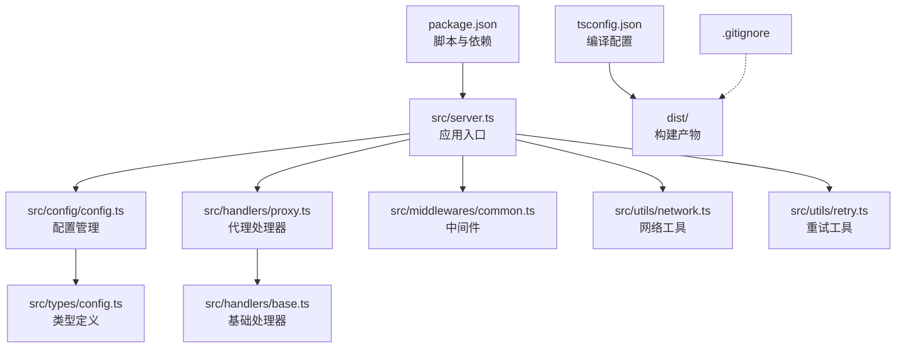
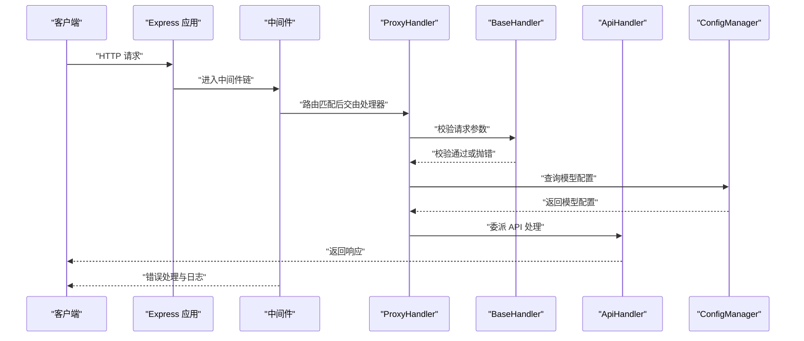
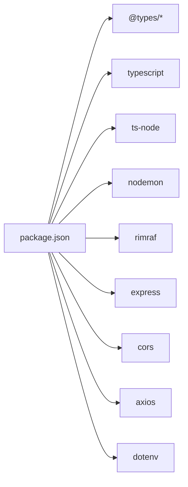

# 开发环境搭建

<cite>
**本文引用的文件**
- [package.json](file://package.json)
- [tsconfig.json](file://tsconfig.json)
- [src/server.ts](file://src/server.ts)
- [src/config/config.ts](file://src/config/config.ts)
- [src/config/index.ts](file://src/config/index.ts)
- [src/types/config.ts](file://src/types/config.ts)
- [src/utils/network.ts](file://src/utils/network.ts)
- [src/utils/retry.ts](file://src/utils/retry.ts)
- [src/middlewares/common.ts](file://src/middlewares/common.ts)
- [src/handlers/base.ts](file://src/handlers/base.ts)
- [src/handlers/proxy.ts](file://src/handlers/proxy.ts)
- [.gitignore](file://.gitignore)
- [src/types/index.ts](file://src/types/index.ts)
- [src/utils/index.ts](file://src/utils/index.ts)
- [src/handlers/index.ts](file://src/handlers/index.ts)
- [src/middlewares/index.ts](file://src/middlewares/index.ts)
</cite>

## 目录
1. [简介](#简介)
2. [项目结构](#项目结构)
3. [核心组件](#核心组件)
4. [架构总览](#架构总览)
5. [详细组件分析](#详细组件分析)
6. [依赖分析](#依赖分析)
7. [性能考虑](#性能考虑)
8. [故障排查指南](#故障排查指南)
9. [结论](#结论)
10. [附录](#附录)

## 简介
本指南面向首次参与 xcode-ai-proxy 项目的开发者，帮助你在本地快速搭建可运行的开发环境。内容涵盖 Node.js 版本与安装（含 nvm 推荐）、依赖安装顺序、TypeScript 编译配置、开发服务器启动方式（dev 与 dev:watch 的差异）、环境变量与 .env 配置、IDE 配置建议（VS Code 插件与调试），以及常见问题排查。

## 项目结构
该项目采用“按功能分层”的目录组织方式：入口在 src/server.ts，核心逻辑分布在 config、handlers、middlewares、types、utils 等子模块中；构建产物输出到 dist 目录，源码位于 src 目录；TypeScript 配置集中于根目录 tsconfig.json；包管理与脚本集中在 package.json。

图表来源
- [src/server.ts:1-88](file://src/server.ts#L1-L88)
- [src/config/config.ts:1-121](file://src/config/config.ts#L1-L121)
- [src/handlers/proxy.ts:1-66](file://src/handlers/proxy.ts#L1-L66)
- [src/middlewares/common.ts:1-25](file://src/middlewares/common.ts#L1-L25)
- [src/utils/network.ts:1-51](file://src/utils/network.ts#L1-L51)
- [src/utils/retry.ts:1-34](file://src/utils/retry.ts#L1-L34)
- [src/types/config.ts:1-48](file://src/types/config.ts#L1-L48)
- [tsconfig.json:1-35](file://tsconfig.json#L1-L35)
- [package.json:1-30](file://package.json#L1-L30)

章节来源
- [package.json:1-30](file://package.json#L1-L30)
- [tsconfig.json:1-35](file://tsconfig.json#L1-L35)
- [src/server.ts:1-88](file://src/server.ts#L1-L88)

## 核心组件
- 应用入口与路由：src/server.ts 创建 Express 应用，注册 CORS、JSON 解析、日志中间件与错误处理，并暴露健康检查、模型列表、对话补全等路由。
- 配置管理：src/config/config.ts 读取 .env 并校验必要环境变量，初始化应用配置与各模型提供商配置，提供单例访问。
- 处理器链路：src/handlers/proxy.ts 校验请求、解析模型配置并委派给 ApiHandler 处理；基础处理器提供通用校验与错误发送能力。
- 中间件：src/middlewares/common.ts 提供统一日志与错误处理。
- 工具函数：src/utils/network.ts 计算可访问地址；src/utils/retry.ts 提供带退避的重试机制。
- 类型定义：src/types/config.ts 定义应用配置、环境变量、模型配置等类型。

章节来源
- [src/server.ts:1-88](file://src/server.ts#L1-L88)
- [src/config/config.ts:1-121](file://src/config/config.ts#L1-L121)
- [src/handlers/proxy.ts:1-66](file://src/handlers/proxy.ts#L1-L66)
- [src/middlewares/common.ts:1-25](file://src/middlewares/common.ts#L1-L25)
- [src/utils/network.ts:1-51](file://src/utils/network.ts#L1-L51)
- [src/utils/retry.ts:1-34](file://src/utils/retry.ts#L1-L34)
- [src/types/config.ts:1-48](file://src/types/config.ts#L1-L48)

## 架构总览
下图展示从客户端到服务端的关键交互流程：Express 路由接收请求，经中间件与处理器链路，最终根据模型配置调用对应 API 提供商。

图表来源
- [src/server.ts:29-44](file://src/server.ts#L29-L44)
- [src/handlers/proxy.ts:9-37](file://src/handlers/proxy.ts#L9-L37)
- [src/handlers/base.ts:10-34](file://src/handlers/base.ts#L10-L34)
- [src/config/config.ts:99-113](file://src/config/config.ts#L99-L113)

## 详细组件分析

### 服务器启动与路由
- 入口类负责装配中间件、路由与错误处理，并在启动时打印可访问地址、支持的模型与重试配置，便于 Xcode 配置对接。
- 路由覆盖健康检查、模型列表与多条聊天补全路径，适配不同客户端格式。

章节来源
- [src/server.ts:8-84](file://src/server.ts#L8-L84)

### 配置管理与环境变量
- 通过 dotenv 加载 .env；至少需配置一个提供商的 API 密钥，否则直接退出。
- 应用配置包括监听地址、端口、最大重试次数、重试延迟、请求超时与自定义系统提示。
- 模型配置来自多个提供商（智谱、Kimi、Gemini、通义），统一注入到模型字典中，供路由层查询使用。

章节来源
- [src/config/config.ts:27-97](file://src/config/config.ts#L27-L97)
- [src/types/config.ts:24-48](file://src/types/config.ts#L24-L48)

### 处理器与错误处理
- BaseHandler 提供请求参数校验与错误响应模板。
- ProxyHandler 在路由层进行模型存在性校验，并将请求委派给 ApiHandler；同时提供模型列表与健康检查接口。
- 中间件统一记录请求日志并在异常时返回标准错误体。

章节来源
- [src/handlers/base.ts:5-40](file://src/handlers/base.ts#L5-L40)
- [src/handlers/proxy.ts:6-66](file://src/handlers/proxy.ts#L6-L66)
- [src/middlewares/common.ts:4-25](file://src/middlewares/common.ts#L4-L25)

### 网络与重试工具
- network 工具用于计算本机 IP 与可访问 URL 列表，便于在多网卡环境下选择正确的局域网地址。
- retry 工具提供指数退避重试策略，支持最大重试次数与基础延迟配置。

章节来源
- [src/utils/network.ts:35-51](file://src/utils/network.ts#L35-L51)
- [src/utils/retry.ts:1-34](file://src/utils/retry.ts#L1-L34)

## 依赖分析
- 生产依赖：express、cors、axios、dotenv，分别用于 Web 服务、跨域、HTTP 请求与环境变量加载。
- 开发依赖：@types/*、ts-node、nodemon、rimraf、typescript，分别用于类型声明、TS 运行与热重载、清理构建目录、类型检查与编译。
- 脚本命令：build、start、dev、dev:watch、clean、type-check，覆盖编译、运行、开发模式与类型检查。

图表来源
- [package.json:14-28](file://package.json#L14-L28)

章节来源
- [package.json:6-13](file://package.json#L6-L13)
- [package.json:14-28](file://package.json#L14-L28)

## 性能考虑
- 启动参数与日志：启动时会打印可访问地址、支持模型与重试配置，便于快速定位服务状态。
- 请求体大小：JSON 中间件限制为 50MB，满足大模型请求场景。
- 重试策略：默认最多重试若干次，每次延迟递增，降低瞬时故障对用户体验的影响。
- 网络可达性：当监听地址为 0.0.0.0 时，自动列出所有可用局域网地址，便于多设备联调。

章节来源
- [src/server.ts:23-27](file://src/server.ts#L23-L27)
- [src/utils/retry.ts:1-34](file://src/utils/retry.ts#L1-L34)
- [src/utils/network.ts:35-51](file://src/utils/network.ts#L35-L51)

## 故障排查指南
- 环境变量缺失
  - 现象：启动时报错并退出，提示至少需要配置一个 API 密钥。
  - 处理：在 .env 中补齐至少一个提供商的 API 密钥与可选的 API 地址。
  - 参考：[src/config/config.ts:27-49](file://src/config/config.ts#L27-L49)
- 端口占用
  - 现象：启动失败，提示端口被占用。
  - 处理：修改 .env 中的端口或释放占用端口。
  - 参考：[src/config/config.ts:51-65](file://src/config/config.ts#L51-L65)
- 跨域问题
  - 现象：浏览器控制台出现跨域错误。
  - 处理：确认已启用 CORS 中间件；如需自定义策略，请在中间件层调整。
  - 参考：[src/server.ts:23-27](file://src/server.ts#L23-L27)
- 请求参数错误
  - 现象：返回请求错误，提示缺少 model 或 messages。
  - 处理：确保请求体包含合法的 model 与 messages 数组。
  - 参考：[src/handlers/base.ts:10-22](file://src/handlers/base.ts#L10-L22)
- 模型未支持
  - 现象：返回不支持的模型错误。
  - 处理：确认 .env 中已正确配置该模型对应的 API 密钥与名称。
  - 参考：[src/handlers/proxy.ts:14-24](file://src/handlers/proxy.ts#L14-L24)
- 热重载失效
  - 现象：修改代码后未自动重启。
  - 处理：确认已安装 nodemon 并使用 dev:watch 脚本；检查 ts-node 配置。
  - 参考：[package.json:9-10](file://package.json#L9-L10)

## 结论
通过本指南，你可以完成 Node.js 环境准备、依赖安装、TypeScript 配置与开发服务器启动，并基于 .env 正确配置各模型提供商的密钥与参数。遇到问题时，可依据“故障排查指南”逐项定位与修复。

## 附录

### Node.js 版本与安装（含 nvm 建议）
- 版本要求
  - TypeScript 与 Node.js 版本需兼容。当前项目使用 ES2020 目标与 commonjs 模块，建议使用较新的 LTS 版本（例如 18.x 或 20.x）。
  - 若使用 nvm，可先安装并切换到目标版本，再执行后续步骤。
- 安装步骤
  - 安装 nvm（参考官方安装脚本）。
  - 使用 nvm 安装并切换到推荐的 Node.js 版本。
  - 验证安装：node -v 与 npm -v。

### 依赖安装顺序与说明
- 安装生产依赖与开发依赖：npm install
- 清理构建目录：npm run clean
- 编译构建：npm run build
- 类型检查：npm run type-check
- 运行生产服务：npm start
- 开发模式（一次性 TS 运行）：npm run dev
- 开发模式（热重载）：npm run dev:watch

章节来源
- [package.json:6-13](file://package.json#L6-L13)

### TypeScript 配置说明
- 目标与模块：ES2020 与 commonjs，保证与运行时兼容。
- 输出与根目录：输出至 dist，源码根目录为 src。
- 严格模式：开启多项严格选项（如严格空值检查、无隐式 any 等），提升类型安全。
- 映射与声明：生成 sourceMap、声明文件与映射，便于调试与二次开发。
- 包含与排除：仅编译 src 下文件，排除 node_modules、dist 与测试文件。

章节来源
- [tsconfig.json:2-26](file://tsconfig.json#L2-L26)
- [tsconfig.json:27-34](file://tsconfig.json#L27-L34)

### 开发服务器启动方法
- dev：使用 ts-node 直接运行 src/server.ts，适合快速验证。
- dev:watch：使用 nodemon 监听文件变化并以 ts-node 重新运行，适合持续开发。
- 区别与场景
  - dev：启动快、无需额外进程，适合简单验证。
  - dev:watch：具备热重载能力，适合长时间开发与联调。

章节来源
- [package.json:9-10](file://package.json#L9-L10)
- [src/server.ts:46-52](file://src/server.ts#L46-L52)

### 环境变量与 .env 设置
- 必填项
  - 至少配置一个提供商的 API 密钥（例如 ZHIPU_API_KEY、KIMI_API_KEY、GEMINI_API_KEY、QWEN_API_KEY）。
- 可选项
  - 端口、主机、最大重试次数、重试延迟、请求超时、自定义系统提示。
  - 各提供商的 API 地址（如 ZHIPU_API_URL、KIMI_API_URL、GEMINI_API_URL、QWEN_API_URL）。
- 配置示例（请勿直接复制以下内容，仅作字段参考）
  - PORT=3000
  - HOST=0.0.0.0
  - MAX_RETRIES=3
  - RETRY_DELAY=1000
  - REQUEST_TIMEOUT=60000
  - ZHIPU_API_KEY=your_zhipu_key
  - ZHIPU_API_URL=https://open.bigmodel.cn/api/paas/v4
  - GEMINI_API_KEY=your_gemini_key
  - KIMI_API_KEY=your_kimi_key
  - QWEN_API_KEY=your_qwen_key

章节来源
- [src/config/config.ts:27-97](file://src/config/config.ts#L27-L97)
- [src/types/config.ts:33-48](file://src/types/config.ts#L33-L48)

### IDE 配置建议（VS Code）
- 插件推荐
  - ESLint：统一代码风格与规则。
  - Prettier：格式化代码。
  - TypeScript Importer：自动导入类型与模块。
  - DotENV：.env 文件语法高亮与校验。
- 调试配置
  - 使用 launch.json 配置 Node 调试任务，指向 ts-node 或直接运行编译后的 dist/server.js。
  - 可结合 nodemon 的 dev:watch 脚本进行热重载调试。
- 项目设置
  - 将工作区设置中的 editor.formatOnSave 设为 true，提升一致性。
  - 使用 VS Code 内置的 TypeScript 语言服务进行类型检查与跳转。

### 常见问题与解决方案
- 启动后无法访问
  - 检查 HOST 与 PORT，确认防火墙放行；若监听 0.0.0.0，查看控制台打印的局域网地址。
  - 参考：[src/server.ts:54-83](file://src/server.ts#L54-L83)，[src/utils/network.ts:35-51](file://src/utils/network.ts#L35-L51)
- 模型列表为空
  - 确认至少配置了一个 API 密钥；检查模型配置是否正确注入。
  - 参考：[src/config/config.ts:67-97](file://src/config/config.ts#L67-L97)
- 流式响应异常
  - 确认客户端支持流式传输；检查网络与超时设置。
  - 参考：[src/utils/retry.ts:1-34](file://src/utils/retry.ts#L1-L34)