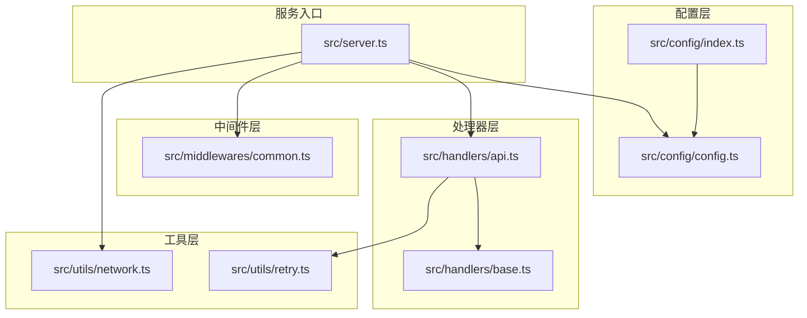
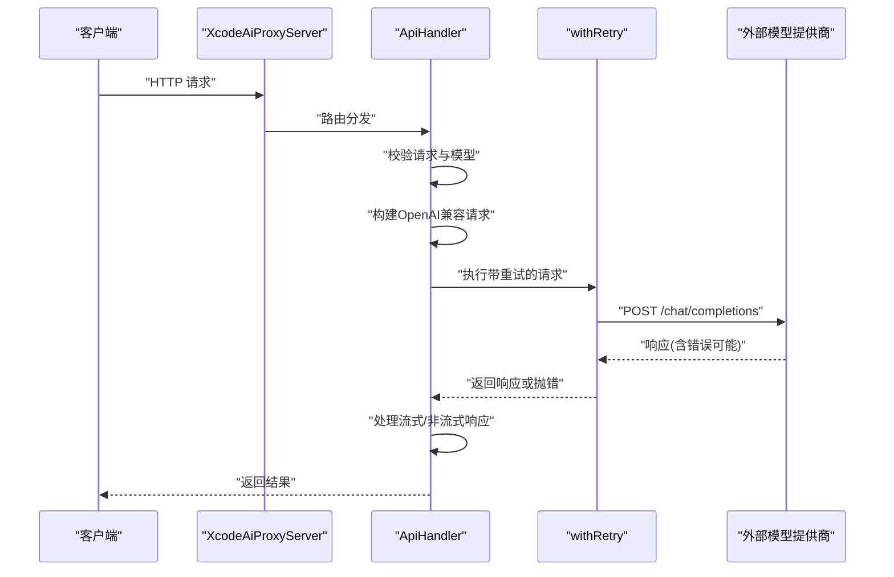
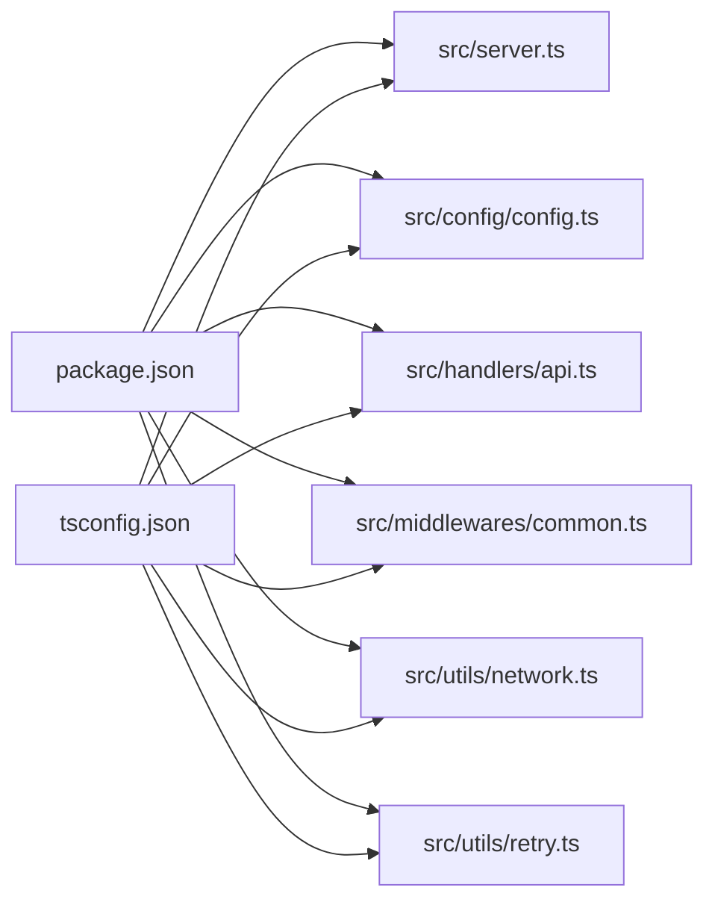

# 调试与测试

<cite>
**本文引用的文件**
- [package.json](file://package.json)
- [tsconfig.json](file://tsconfig.json)
- [src/server.ts](file://src/server.ts)
- [src/config/config.ts](file://src/config/config.ts)
- [src/config/index.ts](file://src/config/index.ts)
- [src/handlers/base.ts](file://src/handlers/base.ts)
- [src/handlers/api.ts](file://src/handlers/api.ts)
- [src/middlewares/common.ts](file://src/middlewares/common.ts)
- [src/utils/network.ts](file://src/utils/network.ts)
- [src/utils/retry.ts](file://src/utils/retry.ts)
</cite>

## 目录
1. [简介](#简介)
2. [项目结构](#项目结构)
3. [核心组件](#核心组件)
4. [架构总览](#架构总览)
5. [详细组件分析](#详细组件分析)
6. [依赖分析](#依赖分析)
7. [性能考虑](#性能考虑)
8. [故障排查指南](#故障排查指南)
9. [结论](#结论)
10. [附录](#附录)

## 简介
本指南面向 xcode-ai-proxy 的开发者与维护者，提供从本地开发调试到测试与性能评估的完整方法论。内容涵盖：
- 开发调试：nodemon 热重载、断点调试、日志输出控制
- 单元测试：Jest/Mocha 配置思路、模拟对象与异步测试
- 集成测试：端到端 API 测试、Mock 服务与测试数据准备
- 性能与压力测试：指标采集与压测策略
- 常见调试场景与问题排查
- 测试覆盖率与 CI 配置建议

## 项目结构
项目采用按职责分层的组织方式：
- 配置层：集中管理应用与模型配置，支持多提供商模型注册与校验
- 处理器层：抽象处理器基类与具体 API 处理器，负责请求校验、转发与响应
- 中间件层：统一日志与错误处理
- 工具层：网络地址解析、重试机制、通用日志
- 服务入口：Express 应用装配路由与中间件，启动监听

图表来源
- [src/server.ts:1-88](file://src/server.ts#L1-L88)
- [src/config/config.ts:1-123](file://src/config/config.ts#L1-L123)
- [src/handlers/base.ts:1-40](file://src/handlers/base.ts#L1-L40)
- [src/handlers/api.ts:1-196](file://src/handlers/api.ts#L1-L196)
- [src/middlewares/common.ts:1-25](file://src/middlewares/common.ts#L1-L25)
- [src/utils/network.ts:1-51](file://src/utils/network.ts#L1-L51)
- [src/utils/retry.ts:1-34](file://src/utils/retry.ts#L1-L34)

章节来源
- [src/server.ts:1-88](file://src/server.ts#L1-L88)
- [src/config/config.ts:1-123](file://src/config/config.ts#L1-L123)
- [src/handlers/base.ts:1-40](file://src/handlers/base.ts#L1-L40)
- [src/handlers/api.ts:1-196](file://src/handlers/api.ts#L1-L196)
- [src/middlewares/common.ts:1-25](file://src/middlewares/common.ts#L1-L25)
- [src/utils/network.ts:1-51](file://src/utils/network.ts#L1-L51)
- [src/utils/retry.ts:1-34](file://src/utils/retry.ts#L1-L34)

## 核心组件
- 服务器装配器：初始化 Express、注册中间件、挂载路由、启动监听，并打印启动信息与可访问地址
- 配置管理器：加载环境变量、校验必要密钥、初始化应用与模型配置、输出模型清单
- 处理器基类：统一请求校验、错误响应与日志
- API 处理器：对接多提供商 OpenAI 兼容端点，注入中文交流指令与自定义系统提示，支持流式与非流式响应，内置重试
- 中间件：统一请求日志与错误捕获
- 工具函数：本地 IP 解析、服务器 URL 生成、重试与请求日志

章节来源
- [src/server.ts:8-84](file://src/server.ts#L8-L84)
- [src/config/config.ts:7-123](file://src/config/config.ts#L7-L123)
- [src/handlers/base.ts:5-40](file://src/handlers/base.ts#L5-L40)
- [src/handlers/api.ts:8-196](file://src/handlers/api.ts#L8-L196)
- [src/middlewares/common.ts:4-25](file://src/middlewares/common.ts#L4-L25)
- [src/utils/network.ts:3-51](file://src/utils/network.ts#L3-L51)
- [src/utils/retry.ts:1-34](file://src/utils/retry.ts#L1-L34)

## 架构总览
下图展示从客户端到外部模型提供商的调用链路，以及内部重试与日志机制。

图表来源
- [src/server.ts:29-44](file://src/server.ts#L29-L44)
- [src/handlers/api.ts:9-28](file://src/handlers/api.ts#L9-L28)
- [src/handlers/api.ts:30-195](file://src/handlers/api.ts#L30-L195)
- [src/utils/retry.ts:1-26](file://src/utils/retry.ts#L1-L26)

## 详细组件分析

### 服务器装配器（XcodeAiProxyServer）
- 职责：装配 Express 应用、注册 CORS、JSON 解析、日志中间件；挂载健康检查、模型列表与聊天补全路由；统一错误处理；启动监听并打印启动信息
- 关键点：
  - 路由覆盖多个兼容路径，便于不同客户端适配
  - 启动日志包含可访问地址、支持模型、重试与超时配置，以及 Xcode 配置示例
  - 使用工具函数生成多网卡访问 URL，便于局域网联调

章节来源
- [src/server.ts:23-52](file://src/server.ts#L23-L52)
- [src/server.ts:54-83](file://src/server.ts#L54-L83)
- [src/utils/network.ts:35-51](file://src/utils/network.ts#L35-L51)

### 配置管理器（ConfigManager）
- 职责：加载 .env，校验至少存在一个 API 密钥；初始化应用配置（端口、主机、最大重试、重试延迟、请求超时、自定义系统提示）；注册各提供商模型
- 关键点：
  - 提供获取应用配置、模型配置、支持模型列表与配置日志输出的方法
  - 内置默认 Qwen 端点与密钥用于演示，实际使用需在环境变量中覆盖

章节来源
- [src/config/config.ts:29-51](file://src/config/config.ts#L29-L51)
- [src/config/config.ts:53-67](file://src/config/config.ts#L53-L67)
- [src/config/config.ts:69-99](file://src/config/config.ts#L69-L99)
- [src/config/config.ts:101-123](file://src/config/config.ts#L101-L123)

### 处理器基类（BaseHandler）
- 职责：统一校验请求参数（model、messages）、发送错误响应、记录请求模型与是否流式
- 关键点：
  - 抛出异常由全局中间件捕获并返回标准错误结构

章节来源
- [src/handlers/base.ts:10-22](file://src/handlers/base.ts#L10-L22)
- [src/handlers/base.ts:24-34](file://src/handlers/base.ts#L24-L34)
- [src/handlers/base.ts:36-40](file://src/handlers/base.ts#L36-L40)

### API 处理器（ApiHandler）
- 职责：对接多提供商 OpenAI 兼容端点，注入中文交流指令与自定义系统提示，处理流式与非流式响应，内置重试与错误透传
- 关键点：
  - 统一设置 Authorization: Bearer 与 Accept-Encoding: identity 便于调试
  - 对 Kimi 使用 HTTPS Agent 并设置超时
  - Qwen 空 tools 数组需删除以满足其 API 约束
  - 允许 4xx 错误通过，便于调试
  - 流式响应透传外部响应流，非流式直接返回 JSON

章节来源
- [src/handlers/api.ts:30-195](file://src/handlers/api.ts#L30-L195)

### 中间件（loggingMiddleware、errorHandler）
- 职责：统一记录请求日志与捕获未处理异常，返回标准化错误响应
- 关键点：
  - 日志包含时间戳、方法与路径
  - 错误响应包含类型与消息字段

章节来源
- [src/middlewares/common.ts:4-7](file://src/middlewares/common.ts#L4-L7)
- [src/middlewares/common.ts:9-25](file://src/middlewares/common.ts#L9-L25)
- [src/utils/retry.ts:32-34](file://src/utils/retry.ts#L32-L34)

### 工具模块
- 网络工具：解析本地 IPv4 地址、选择主 IP、生成服务器 URL 列表
- 重试工具：指数退避重试、当前时间戳、请求日志

章节来源
- [src/utils/network.ts:3-51](file://src/utils/network.ts#L3-L51)
- [src/utils/retry.ts:1-34](file://src/utils/retry.ts#L1-L34)

## 依赖分析
- 运行时依赖：Express、CORS、Axios、Dotenv
- 开发依赖：Nodemon、Ts-node、TypeScript、Rimraf 与类型声明
- 构建与脚本：TypeScript 编译、运行 dist/server.js、开发模式（ts-node）、热重载（nodemon）

图表来源
- [package.json:1-30](file://package.json#L1-L30)
- [tsconfig.json](file://tsconfig.json)
- [src/server.ts:1-8](file://src/server.ts#L1-L8)
- [src/config/config.ts:1-5](file://src/config/config.ts#L1-L5)
- [src/handlers/api.ts:1-6](file://src/handlers/api.ts#L1-L6)
- [src/middlewares/common.ts:1-2](file://src/middlewares/common.ts#L1-L2)
- [src/utils/network.ts:1-2](file://src/utils/network.ts#L1-L2)
- [src/utils/retry.ts:1-2](file://src/utils/retry.ts#L1-L2)

章节来源
- [package.json:1-30](file://package.json#L1-L30)
- [tsconfig.json](file://tsconfig.json)

## 性能考虑
- 重试策略：指数退避重试，避免瞬时抖动放大；可通过环境变量调整最大重试次数与基础延迟
- 超时控制：请求超时可配置，避免长时间阻塞；流式响应禁用压缩便于调试
- 压缩与编码：调试阶段禁用压缩，生产可根据需要开启
- 日志开销：高频日志会影响吞吐，建议在高负载场景降低日志级别或采样

章节来源
- [src/utils/retry.ts:8-26](file://src/utils/retry.ts#L8-L26)
- [src/handlers/api.ts:36-44](file://src/handlers/api.ts#L36-L44)
- [src/config/config.ts:53-67](file://src/config/config.ts#L53-L67)

## 故障排查指南
- 环境变量缺失
  - 现象：启动时报错并退出
  - 排查：确认至少配置一个提供商的 API Key；检查端口、主机、重试、超时等变量
  - 参考
    - [src/config/config.ts:29-51](file://src/config/config.ts#L29-L51)
    - [src/config/config.ts:53-67](file://src/config/config.ts#L53-L67)
- 路由不可达
  - 现象：浏览器或客户端 404
  - 排查：确认服务监听地址与端口；查看启动日志中的可访问 URL；确保防火墙放行
  - 参考
    - [src/server.ts:46-52](file://src/server.ts#L46-L52)
    - [src/utils/network.ts:35-51](file://src/utils/network.ts#L35-L51)
- 请求被拒绝或超时
  - 现象：4xx/5xx 或超时
  - 排查：允许 4xx 通过便于调试；检查外部 API Key、URL、模型名；观察重试日志；确认网络连通性
  - 参考
    - [src/handlers/api.ts:43](file://src/handlers/api.ts#L43)
    - [src/utils/retry.ts:10-25](file://src/utils/retry.ts#L10-L25)
- 流式响应异常
  - 现象：前端无事件流输出
  - 排查：确认客户端正确处理 SSE；检查外部响应流是否被提前关闭；查看流式日志
  - 参考
    - [src/handlers/api.ts:176-183](file://src/handlers/api.ts#L176-L183)
- 错误响应解析
  - 现象：错误信息难以定位
  - 排查：查看外部错误响应内容与状态；必要时读取流式错误片段
  - 参考
    - [src/handlers/api.ts:132-164](file://src/handlers/api.ts#L132-L164)

## 结论
本指南提供了从开发调试到测试与性能评估的系统化方法。建议在开发期充分利用热重载与日志，结合单元与集成测试保障质量，并通过重试与可观测性提升稳定性。

## 附录

### 开发调试方法
- 热重载与启动
  - 使用开发脚本启动并在源码变更时自动重启
  - 参考
    - [package.json:6-12](file://package.json#L6-L12)
- 断点调试
  - 使用 ts-node 在源码上设置断点进行单步调试
  - 参考
    - [package.json:9](file://package.json#L9)
- 日志输出控制
  - 通过中间件与处理器的日志开关控制输出粒度
  - 参考
    - [src/middlewares/common.ts:4-7](file://src/middlewares/common.ts#L4-L7)
    - [src/handlers/api.ts:102-108](file://src/handlers/api.ts#L102-L108)
    - [src/utils/retry.ts:10-25](file://src/utils/retry.ts#L10-L25)

### 单元测试与模拟对象
- 测试框架建议
  - 使用 Jest 或 Mocha + Sinon（或 Jest 内置的 Mock）
- 模拟对象
  - 使用 Mock Provider 注入测试配置，或 Mock Axios 与重试函数
- 异步测试
  - 使用 async/await 或 Promise 断言；对流式响应使用内存缓冲或管道模拟
- 覆盖率
  - 建议函数与分支覆盖率均不低于 80%，关键路径（错误处理、重试、路由）100%

### 集成测试策略
- 端到端测试
  - 启动本地服务实例，构造 OpenAI 兼容请求，验证响应结构与流式行为
- Mock 服务
  - 使用 WireMock 或自定义 Mock 服务模拟外部提供商响应与错误
- 测试数据
  - 准备典型 messages 结构、流式与非流式响应样本、错误响应样本

### 性能与压力测试
- 指标
  - 吞吐（RPS）、P95/P99 延迟、错误率、重试次数
- 方法
  - 使用 wrk、Artillery 或 k6 对 /v1/chat/completions 发起并发请求
  - 分别测试流式与非流式场景
- 建议
  - 逐步加压，观察重试触发频率与错误分布，优化重试与超时参数

### 常见调试场景
- 模型不可用
  - 检查模型 ID 是否在支持列表，查看配置日志
  - 参考
    - [src/config/config.ts:113-123](file://src/config/config.ts#L113-L123)
- 跨域问题
  - 确认 CORS 中间件已启用
  - 参考
    - [src/server.ts:24](file://src/server.ts#L24)
- 客户端连接
  - 使用启动日志提供的 URL 进行本地与局域网联调
  - 参考
    - [src/server.ts:54-83](file://src/server.ts#L54-L83)

### 测试覆盖率与持续集成
- 覆盖率要求
  - 建议：函数覆盖率 ≥ 80%，分支覆盖率 ≥ 80%
- CI 建议
  - 步骤：安装依赖 → 类型检查 → 单测与覆盖率 → 集成测试 → 构建产物
  - 触发：PR 与主分支推送
  - 缓存：npm/yarn 缓存加速