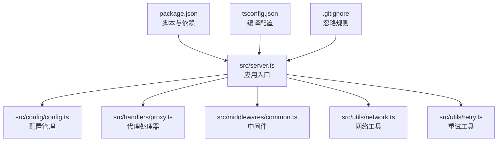
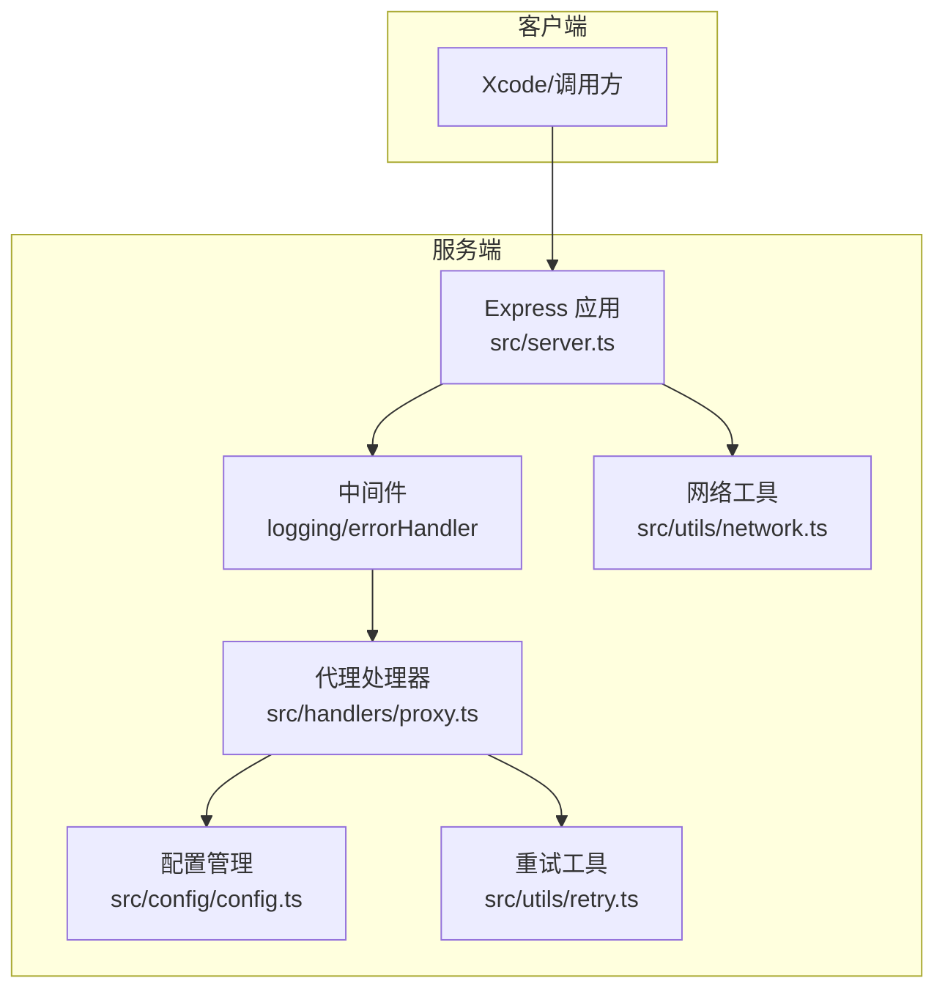
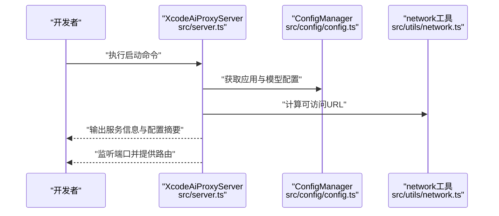
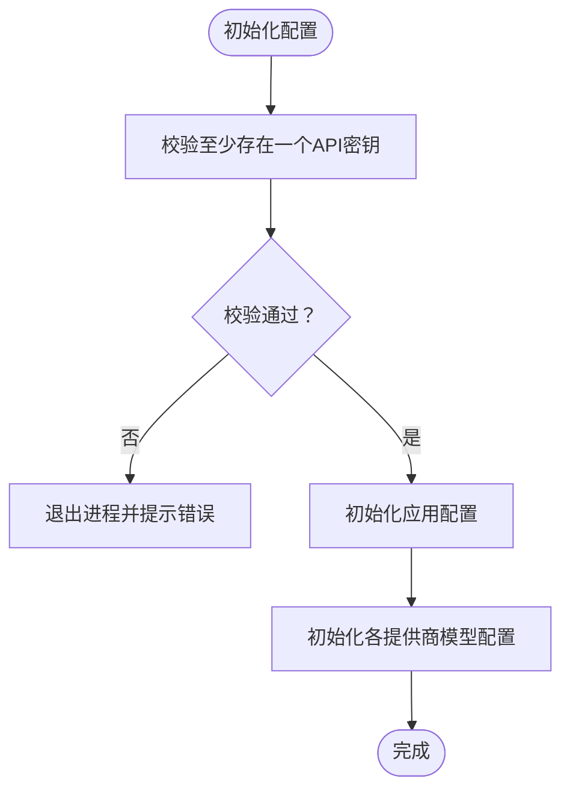
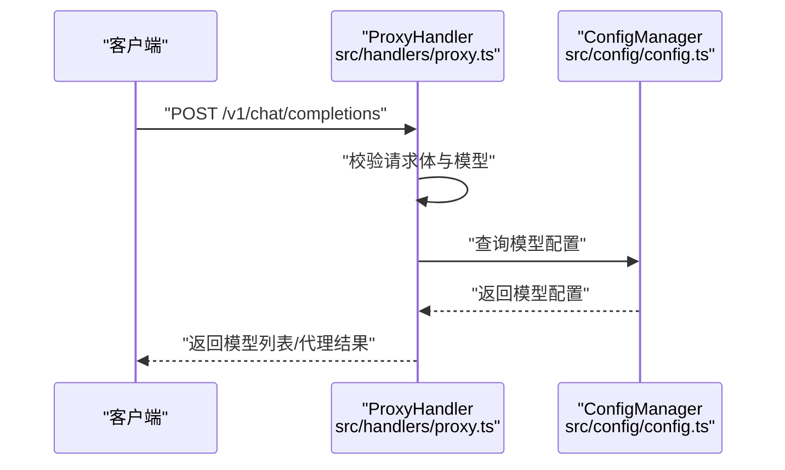
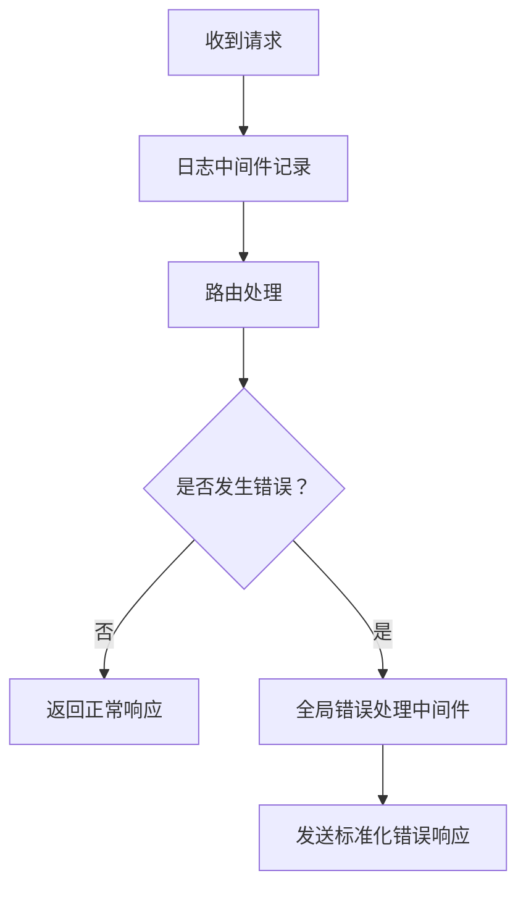
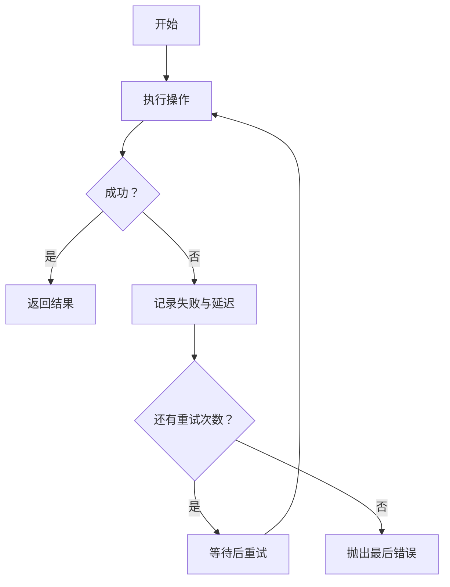
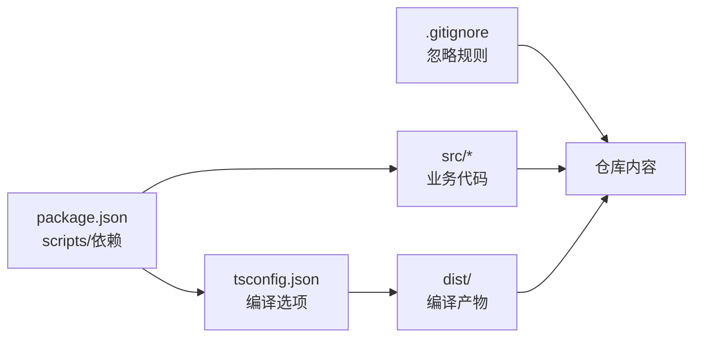

# 贡献流程

<cite>
**本文引用的文件**
- [package.json](file://package.json)
- [tsconfig.json](file://tsconfig.json)
- [.gitignore](file://.gitignore)
- [src/server.ts](file://src/server.ts)
- [src/config/config.ts](file://src/config/config.ts)
- [src/config/index.ts](file://src/config/index.ts)
- [src/handlers/proxy.ts](file://src/handlers/proxy.ts)
- [src/middlewares/common.ts](file://src/middlewares/common.ts)
- [src/utils/network.ts](file://src/utils/network.ts)
- [src/utils/retry.ts](file://src/utils/retry.ts)
</cite>

## 目录
1. [简介](#简介)
2. [项目结构](#项目结构)
3. [核心组件](#核心组件)
4. [架构总览](#架构总览)
5. [详细组件分析](#详细组件分析)
6. [依赖关系分析](#依赖关系分析)
7. [性能考虑](#性能考虑)
8. [故障排查指南](#故障排查指南)
9. [结论](#结论)
10. [附录](#附录)

## 简介
本文件为 xcode-ai-proxy 的贡献流程与开发协作指南，面向首次贡献者与长期维护者，覆盖从 Fork/Clone 到代码审查、版本发布、问题与功能请求提交等全流程。项目采用 TypeScript + Express 构建，提供统一的 AI 模型代理服务端点，支持多提供商模型聚合与可配置重试机制。

## 项目结构
- 核心源码位于 src/ 下，按职责划分为配置、处理器、中间件、工具与类型定义。
- 构建与运行脚本由 package.json 提供；TypeScript 编译配置由 tsconfig.json 定义；.gitignore 控制版本控制忽略项。

图表来源
- [package.json:1-30](file://package.json#L1-L30)
- [tsconfig.json:1-35](file://tsconfig.json#L1-L35)
- [.gitignore:1-52](file://.gitignore#L1-L52)
- [src/server.ts:1-88](file://src/server.ts#L1-L88)
- [src/config/config.ts:1-123](file://src/config/config.ts#L1-L123)
- [src/handlers/proxy.ts:1-66](file://src/handlers/proxy.ts#L1-L66)
- [src/middlewares/common.ts:1-25](file://src/middlewares/common.ts#L1-L25)
- [src/utils/network.ts:1-51](file://src/utils/network.ts#L1-L51)
- [src/utils/retry.ts:1-34](file://src/utils/retry.ts#L1-L34)

章节来源
- [package.json:1-30](file://package.json#L1-L30)
- [tsconfig.json:1-35](file://tsconfig.json#L1-L35)
- [.gitignore:1-52](file://.gitignore#L1-L52)
- [src/server.ts:1-88](file://src/server.ts#L1-L88)

## 核心组件
- 应用入口与路由：负责初始化 Express 应用、注册中间件、挂载路由与错误处理，并在启动时输出服务信息与配置摘要。
- 配置管理：集中读取环境变量，校验必要密钥，初始化应用与模型配置，提供查询接口。
- 代理处理器：统一接收请求，校验模型合法性，转发至具体 API 处理器，并返回标准响应或错误。
- 中间件：提供通用日志与全局错误处理。
- 工具模块：网络地址解析与重试逻辑，支撑服务发现与容错能力。

章节来源
- [src/server.ts:1-88](file://src/server.ts#L1-L88)
- [src/config/config.ts:1-123](file://src/config/config.ts#L1-L123)
- [src/handlers/proxy.ts:1-66](file://src/handlers/proxy.ts#L1-L66)
- [src/middlewares/common.ts:1-25](file://src/middlewares/common.ts#L1-L25)
- [src/utils/network.ts:1-51](file://src/utils/network.ts#L1-L51)
- [src/utils/retry.ts:1-34](file://src/utils/retry.ts#L1-L34)

## 架构总览
下图展示从客户端到服务端的典型交互路径，以及关键组件之间的依赖关系。

图表来源
- [src/server.ts:1-88](file://src/server.ts#L1-L88)
- [src/middlewares/common.ts:1-25](file://src/middlewares/common.ts#L1-L25)
- [src/handlers/proxy.ts:1-66](file://src/handlers/proxy.ts#L1-L66)
- [src/config/config.ts:1-123](file://src/config/config.ts#L1-L123)
- [src/utils/network.ts:1-51](file://src/utils/network.ts#L1-L51)
- [src/utils/retry.ts:1-34](file://src/utils/retry.ts#L1-L34)

## 详细组件分析

### 应用入口与启动流程
- 初始化 Express 实例，注入 CORS、JSON 解析与日志中间件。
- 注册健康检查、模型列表与聊天补全等路由。
- 错误处理中间件统一捕获异常并返回标准错误结构。
- 启动时打印服务访问地址、支持的模型、重试与超时配置，并输出 Xcode 配置示例。

图表来源
- [src/server.ts:1-88](file://src/server.ts#L1-L88)
- [src/config/config.ts:1-123](file://src/config/config.ts#L1-L123)
- [src/utils/network.ts:1-51](file://src/utils/network.ts#L1-L51)

章节来源
- [src/server.ts:1-88](file://src/server.ts#L1-L88)

### 配置管理策略
- 环境变量校验：要求至少配置一个提供商的 API 密钥，否则终止进程并提示支持的变量名。
- 应用配置：端口、主机、最大重试次数、重试延迟、请求超时、自定义系统提示等。
- 模型配置：按提供商初始化模型映射，统一对外暴露查询接口。

图表来源
- [src/config/config.ts:1-123](file://src/config/config.ts#L1-L123)

章节来源
- [src/config/config.ts:1-123](file://src/config/config.ts#L1-L123)

### 代理处理器与路由
- 路由层：提供 /health、/v1/models、/v1/chat/completions、/api/v1/chat/completions、/v1/messages 等端点。
- 代理层：校验请求体与模型合法性，将请求交由 API 处理器处理，并返回统一响应结构。

图表来源
- [src/handlers/proxy.ts:1-66](file://src/handlers/proxy.ts#L1-L66)
- [src/config/config.ts:1-123](file://src/config/config.ts#L1-L123)

章节来源
- [src/handlers/proxy.ts:1-66](file://src/handlers/proxy.ts#L1-L66)

### 中间件与错误处理
- 日志中间件：记录请求方法与路径，便于调试与审计。
- 全局错误处理：捕获未处理异常，返回标准化错误对象，避免重复设置响应头。

图表来源
- [src/middlewares/common.ts:1-25](file://src/middlewares/common.ts#L1-L25)

章节来源
- [src/middlewares/common.ts:1-25](file://src/middlewares/common.ts#L1-L25)

### 网络与重试工具
- 网络工具：自动识别本机可用 IPv4 地址，生成可访问 URL 列表，支持监听所有接口时的多地址展示。
- 重试工具：指数退避重试，记录每次尝试与延迟，最终抛出最后一次错误。

图表来源
- [src/utils/retry.ts:1-34](file://src/utils/retry.ts#L1-L34)
- [src/utils/network.ts:1-51](file://src/utils/network.ts#L1-L51)

章节来源
- [src/utils/retry.ts:1-34](file://src/utils/retry.ts#L1-L34)
- [src/utils/network.ts:1-51](file://src/utils/network.ts#L1-L51)

## 依赖关系分析
- 构建与运行：通过 package.json 的 scripts 字段提供构建、开发、类型检查等命令；TypeScript 编译严格模式确保类型安全。
- 版本控制：.gitignore 忽略 node_modules、日志、临时文件与 IDE 相关目录，避免无关内容进入仓库。

图表来源
- [package.json:1-30](file://package.json#L1-L30)
- [tsconfig.json:1-35](file://tsconfig.json#L1-L35)
- [.gitignore:1-52](file://.gitignore#L1-L52)

章节来源
- [package.json:1-30](file://package.json#L1-L30)
- [tsconfig.json:1-35](file://tsconfig.json#L1-L35)
- [.gitignore:1-52](file://.gitignore#L1-L52)

## 性能考虑
- 启动时输出配置摘要，便于快速定位端口、主机、重试与超时参数，有助于优化网络与并发表现。
- 代理层统一校验模型与请求体，减少无效调用，降低上游提供商压力。
- 重试策略采用递增延迟，避免雪崩效应，同时限制最大重试次数以防止资源耗尽。

## 故障排查指南
- 启动失败：检查环境变量是否满足至少一个提供商密钥的要求；查看启动日志中的服务地址与模型列表。
- 路由错误：确认请求路径是否匹配已实现的端点；检查代理层对模型的校验与错误返回。
- 异常处理：若出现 500 错误，查看全局错误中间件输出的错误类型与消息；确认未重复设置响应头。
- 网络连通性：使用网络工具生成的本地与局域网访问地址进行验证；确认防火墙与端口开放情况。

章节来源
- [src/config/config.ts:1-123](file://src/config/config.ts#L1-L123)
- [src/handlers/proxy.ts:1-66](file://src/handlers/proxy.ts#L1-L66)
- [src/middlewares/common.ts:1-25](file://src/middlewares/common.ts#L1-L25)
- [src/utils/network.ts:1-51](file://src/utils/network.ts#L1-L51)

## 结论
本贡献流程文档基于现有代码结构与配置，明确了从 Fork/Clone 到代码审查与发布的协作方式。建议在实际使用中结合团队约定补充 PR 模板、检查清单与发布流程细节，以提升协作效率与质量。

## 附录

### Fork 与 Clone 步骤
- 在代码托管平台执行 Fork 操作，随后在本地克隆仓库。
- 使用项目提供的脚本进行开发与构建（参考 [package.json:6-12](file://package.json#L6-L12)）。

章节来源
- [package.json:1-30](file://package.json#L1-L30)

### 分支管理策略
- 主分支保护：建议启用保护分支策略，禁止直接推送，强制通过合并请求。
- 功能分支命名：建议采用 feature/主题、fix/问题描述、docs/文档等前缀，保持清晰语义。
- 合并请求流程：提交 PR 前确保通过类型检查与本地测试，关联问题编号，等待至少一名维护者审查。

### Pull Request 模板与检查清单
- 模板建议字段：背景与动机、改动范围、测试方案、兼容性影响、升级指引。
- 检查清单：通过类型检查、新增/更新单元测试、更新文档、清理无用代码、避免引入新依赖。

### 代码审查流程与反馈处理
- 审查要点：代码风格一致性、类型安全、错误处理完整性、性能与可维护性。
- 反馈处理：逐条回复审查意见，必要时提供解释或修改；保持讨论尊重与高效。

### 版本发布流程与变更日志维护
- 发布流程：在稳定分支上打标签并发布，遵循语义化版本；更新变更日志记录重大变更与修复。
- 变更日志：按版本分节，记录新增、修复、破坏性变更与迁移说明。

### 社区行为准则与沟通指南
- 行为准则：尊重、包容、友善，禁止骚扰与歧视；维护开放与友好的社区氛围。
- 沟通指南：使用清晰简洁的语言，优先在公开渠道沟通；遇到冲突时寻求建设性解决方案。

### 贡献者许可协议与知识产权说明
- 贡献者许可协议：默认采用项目指定的开源许可证；贡献即表示同意遵守该许可证条款。
- 知识产权：贡献者保留其版权，授予项目使用与分发的权利；涉及第三方代码需注明来源与许可证。

### 问题报告与功能请求提交流程
- 问题报告：提供环境信息、复现步骤、期望与实际结果；附带日志与错误信息以便定位。
- 功能请求：描述使用场景、预期行为与收益；评估对现有功能的影响与兼容性。