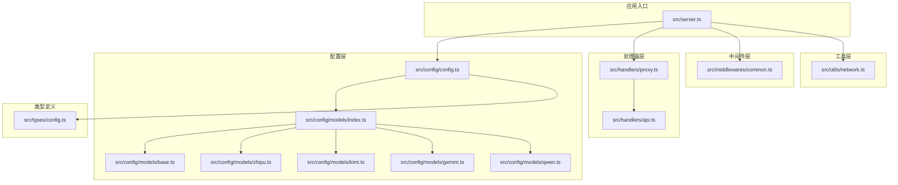
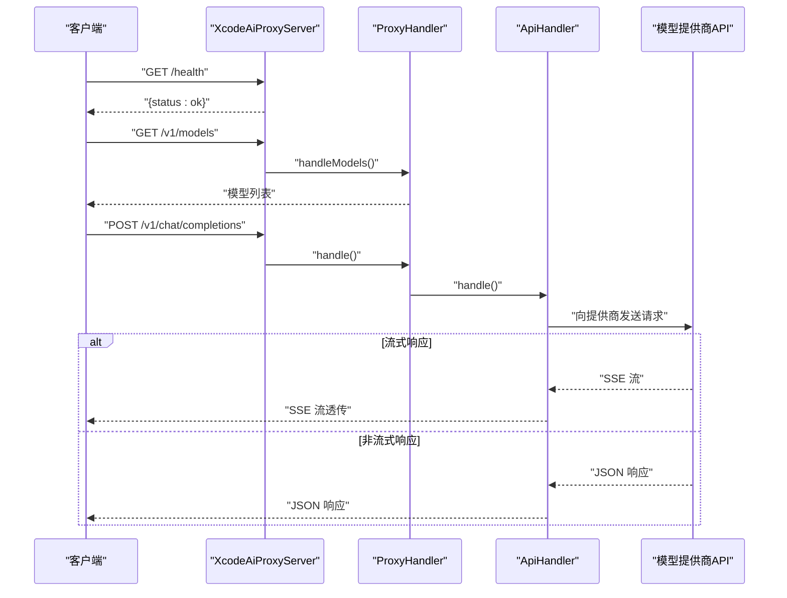

# 快速开始

<cite>
**本文引用的文件**
- [package.json](file://package.json)
- [tsconfig.json](file://tsconfig.json)
- [src/server.ts](file://src/server.ts)
- [src/config/config.ts](file://src/config/config.ts)
- [src/config/models/index.ts](file://src/config/models/index.ts)
- [src/config/models/base.ts](file://src/config/models/base.ts)
- [src/config/models/zhipu.ts](file://src/config/models/zhipu.ts)
- [src/config/models/gemini.ts](file://src/config/models/gemini.ts)
- [src/config/models/qwen.ts](file://src/config/models/qwen.ts)
- [src/config/models/kimi.ts](file://src/config/models/kimi.ts)
- [src/handlers/api.ts](file://src/handlers/api.ts)
- [src/handlers/proxy.ts](file://src/handlers/proxy.ts)
- [src/middlewares/common.ts](file://src/middlewares/common.ts)
- [src/utils/network.ts](file://src/utils/network.ts)
- [src/types/config.ts](file://src/types/config.ts)
</cite>

## 目录
1. [简介](#简介)
2. [项目结构](#项目结构)
3. [核心组件](#核心组件)
4. [架构总览](#架构总览)
5. [详细组件分析](#详细组件分析)
6. [依赖分析](#依赖分析)
7. [性能考虑](#性能考虑)
8. [故障排除指南](#故障排除指南)
9. [结论](#结论)
10. [附录](#附录)

## 简介
本指南面向初学者与进阶用户，帮助你在本地快速搭建并运行 xcode-ai-proxy 代理服务，完成在 Xcode 中配置代理以统一访问多个 AI 模型提供商（智谱、Kimi、Gemini、通义千问）。你将学到：
- 环境要求与安装步骤
- 依赖安装与构建流程
- 完整配置项说明（环境变量、API 密钥、服务器参数）
- 基本使用示例（启动服务、发送首个聊天请求、在 Xcode 中配置代理）
- 常见问题与排障建议

## 项目结构
该仓库采用按功能分层的组织方式：
- 配置层：集中管理应用配置与各模型提供商的配置
- 处理器层：负责路由与请求转发
- 中间件层：统一日志与错误处理
- 工具层：网络地址解析等辅助能力
- 类型定义：统一的数据结构与配置接口

图表来源
- [src/server.ts:1-88](file://src/server.ts#L1-L88)
- [src/config/config.ts:1-121](file://src/config/config.ts#L1-L121)
- [src/config/models/index.ts:1-5](file://src/config/models/index.ts#L1-L5)
- [src/config/models/base.ts:1-13](file://src/config/models/base.ts#L1-L13)
- [src/config/models/zhipu.ts:1-34](file://src/config/models/zhipu.ts#L1-L34)
- [src/config/models/kimi.ts:1-34](file://src/config/models/kimi.ts#L1-L34)
- [src/config/models/gemini.ts:1-34](file://src/config/models/gemini.ts#L1-L34)
- [src/config/models/qwen.ts:1-35](file://src/config/models/qwen.ts#L1-L35)
- [src/handlers/proxy.ts:1-66](file://src/handlers/proxy.ts#L1-L66)
- [src/handlers/api.ts:1-191](file://src/handlers/api.ts#L1-L191)
- [src/middlewares/common.ts:1-25](file://src/middlewares/common.ts#L1-L25)
- [src/utils/network.ts:1-51](file://src/utils/network.ts#L1-L51)
- [src/types/config.ts:1-48](file://src/types/config.ts#L1-L48)

章节来源
- [src/server.ts:1-88](file://src/server.ts#L1-L88)
- [package.json:1-30](file://package.json#L1-L30)
- [tsconfig.json:1-35](file://tsconfig.json#L1-L35)

## 核心组件
- 应用服务器：初始化 Express、注册中间件与路由、暴露健康检查、模型列表与聊天补全接口
- 配置管理：加载环境变量、校验必要密钥、初始化各模型提供商配置
- 代理处理器：根据请求模型选择对应提供商，统一走 API 处理器
- API 处理器：构造 OpenAI 兼容请求、注入中文交流指令与自定义系统提示、支持流式与非流式响应、带重试机制
- 中间件：统一日志与错误处理
- 网络工具：自动计算可访问的服务地址，便于在 Xcode 中配置代理

章节来源
- [src/server.ts:8-84](file://src/server.ts#L8-L84)
- [src/config/config.ts:7-121](file://src/config/config.ts#L7-L121)
- [src/handlers/proxy.ts:6-66](file://src/handlers/proxy.ts#L6-L66)
- [src/handlers/api.ts:8-191](file://src/handlers/api.ts#L8-L191)
- [src/middlewares/common.ts:4-25](file://src/middlewares/common.ts#L4-L25)
- [src/utils/network.ts:35-51](file://src/utils/network.ts#L35-L51)

## 架构总览
下图展示了从客户端到各模型提供商的请求链路，以及代理服务如何统一流式与非流式响应。

图表来源
- [src/server.ts:29-44](file://src/server.ts#L29-L44)
- [src/handlers/proxy.ts:9-37](file://src/handlers/proxy.ts#L9-L37)
- [src/handlers/api.ts:30-191](file://src/handlers/api.ts#L30-L191)

## 详细组件分析

### 服务器启动与路由
- 初始化 Express 应用，启用 CORS、JSON 解析与日志中间件
- 注册健康检查、模型列表与多条聊天补全路径
- 启动监听，打印服务地址、支持的模型与重试配置，并给出 Xcode 配置提示

章节来源
- [src/server.ts:23-52](file://src/server.ts#L23-L52)
- [src/server.ts:54-83](file://src/server.ts#L54-L83)

### 配置管理与模型提供商
- 加载 .env 并校验至少配置一个 API 密钥
- 初始化应用配置（端口、主机、最大重试、重试延迟、请求超时、自定义系统提示）
- 逐个初始化模型提供商，生成统一的模型配置字典
- 提供查询支持的模型列表与单个模型配置的能力

章节来源
- [src/config/config.ts:27-49](file://src/config/config.ts#L27-L49)
- [src/config/config.ts:51-65](file://src/config/config.ts#L51-L65)
- [src/config/config.ts:67-97](file://src/config/config.ts#L67-L97)
- [src/config/config.ts:99-121](file://src/config/config.ts#L99-L121)

### 代理处理器与 API 处理器
- 代理处理器根据请求中的模型 ID 查找配置，统一交由 API 处理器处理
- API 处理器：
  - 校验请求并记录模型与是否流式
  - 为所有模型注入中文交流指令与自定义系统提示（仅在首个系统消息后插入一次）
  - 统一使用 OpenAI 兼容格式发送请求，设置 Authorization: Bearer
  - 对 Kimi 使用 HTTPS Agent 并设置超时
  - 支持流式与非流式响应，透传 SSE 或直接返回 JSON
  - 带重试逻辑与错误透传，允许 4xx 通过以便调试

章节来源
- [src/handlers/proxy.ts:9-37](file://src/handlers/proxy.ts#L9-L37)
- [src/handlers/api.ts:9-28](file://src/handlers/api.ts#L9-L28)
- [src/handlers/api.ts:30-191](file://src/handlers/api.ts#L30-L191)

### 中间件与网络工具
- 日志中间件：记录每个请求的方法与路径
- 错误处理中间件：捕获未处理异常并返回统一错误结构
- 网络工具：自动识别本机 IP、生成可访问的 URL 列表，便于在 Xcode 中配置代理

章节来源
- [src/middlewares/common.ts:4-25](file://src/middlewares/common.ts#L4-L25)
- [src/utils/network.ts:35-51](file://src/utils/network.ts#L35-L51)

### 模型提供商配置
- 智谱（GLM-4.5）
- Kimi（Kimi K2）
- Gemini（Gemini 2.5 Pro）
- 通义千问（Qwen Max）

章节来源
- [src/config/models/zhipu.ts:20-33](file://src/config/models/zhipu.ts#L20-L33)
- [src/config/models/kimi.ts:20-33](file://src/config/models/kimi.ts#L20-L33)
- [src/config/models/gemini.ts:20-33](file://src/config/models/gemini.ts#L20-L33)
- [src/config/models/qwen.ts:20-34](file://src/config/models/qwen.ts#L20-L34)

## 依赖分析
- 运行时依赖：Express、Axios、CORS、dotenv
- 开发依赖：TypeScript、ts-node、nodemon、rimraf、@types/* 等
- 构建与脚本：TypeScript 编译、开发模式（ts-node/nodemon）、清理 dist

章节来源
- [package.json:14-28](file://package.json#L14-L28)
- [package.json:6-12](file://package.json#L6-L12)
- [tsconfig.json:2-26](file://tsconfig.json#L2-L26)

## 性能考虑
- 请求超时与重试：可通过环境变量调整最大重试次数、重试延迟与请求超时，平衡稳定性与响应速度
- 流式响应：SSE 透传减少内存占用，适合长对话
- 日志级别：生产环境建议降低日志量或接入结构化日志系统
- 网络与并发：注意上游提供商限流与并发限制，必要时增加节流策略

## 故障排除指南
- 启动时报错“至少需要配置一个API密钥”
  - 确保至少设置以下任一环境变量：ZHIPU_API_KEY、KIMI_API_KEY、GEMINI_API_KEY、QWEN_API_KEY
  - 参考章节来源
- 无法访问服务或 Xcode 无法连通
  - 查看启动日志中列出的访问地址，确认主机绑定与防火墙设置
  - 若监听 0.0.0.0，会输出本机与局域网地址；若绑定特定主机名/IP，请使用对应地址
  - 参考章节来源
- 流式响应无输出或中断
  - 检查上游提供商是否支持 SSE；确认网络稳定与代理链路未截断
  - 参考章节来源
- 4xx 错误频繁
  - API 处理器允许 4xx 通过以便调试，建议检查模型 ID、API 密钥与提供商端点
  - 参考章节来源
- 代理处理器报“不支持的模型”
  - 确认请求中的 model 是否在支持列表中；可通过 GET /v1/models 获取当前支持的模型
  - 参考章节来源
- 重试过多导致延迟
  - 调整 MAX_RETRIES 与 RETRY_DELAY；适当提高 REQUEST_TIMEOUT
  - 参考章节来源

章节来源
- [src/config/config.ts:27-49](file://src/config/config.ts#L27-L49)
- [src/server.ts:54-83](file://src/server.ts#L54-L83)
- [src/handlers/api.ts:118-159](file://src/handlers/api.ts#L118-L159)
- [src/handlers/proxy.ts:14-24](file://src/handlers/proxy.ts#L14-L24)

## 结论
通过本指南，你已经完成了环境准备、安装构建、配置密钥与服务器参数，并成功启动了代理服务。你可以使用提供的示例请求在本地验证功能，随后在 Xcode 中按启动日志提示配置代理即可开始使用。

## 附录

### 环境要求与安装步骤
- 环境要求
  - Node.js：推荐使用长期支持版本（LTS），与 TypeScript 5.x 兼容
  - 包管理器：npm 或 yarn
- 安装步骤
  - 克隆仓库后进入目录
  - 安装依赖：使用 npm 或 yarn
  - 构建项目：执行编译脚本
  - 启动服务：开发模式或生产模式
- 参考章节来源
  - [package.json:6-12](file://package.json#L6-L12)
  - [tsconfig.json:2-26](file://tsconfig.json#L2-L26)

### 配置指南（环境变量与服务器参数）
- 必需环境变量
  - 至少配置一个 API 密钥：ZHIPU_API_KEY、KIMI_API_KEY、GEMINI_API_KEY、QWEN_API_KEY
- 可选环境变量
  - ZHIPU_API_URL、KIMI_API_URL、GEMINI_API_URL、QWEN_API_URL：覆盖默认提供商端点
  - CUSTOM_SYSTEM_PROMPT：为所有模型注入额外系统提示
  - PORT、HOST：服务端口与绑定主机
  - MAX_RETRIES、RETRY_DELAY、REQUEST_TIMEOUT：重试次数、重试延迟（毫秒）、请求超时（毫秒）
- 参考章节来源
  - [src/config/config.ts:27-49](file://src/config/config.ts#L27-L49)
  - [src/config/config.ts:51-65](file://src/config/config.ts#L51-L65)
  - [src/types/config.ts:33-48](file://src/types/config.ts#L33-L48)

### 基本使用示例
- 启动服务器
  - 开发模式：使用开发脚本启动并热更新
  - 生产模式：先构建再运行
- 发送第一个聊天请求
  - 访问健康检查端点确认服务可用
  - 获取模型列表
  - 发送聊天补全请求（支持多路径：/v1/chat/completions、/api/v1/chat/completions、/v1/messages）
- 在 Xcode 中配置代理
  - 根据启动日志中的“局域网访问”地址设置 Xcode 的代理环境变量（例如 ANTHROPIC_BASE_URL 与 ANTHROPIC_AUTH_TOKEN）
- 参考章节来源
  - [src/server.ts:29-44](file://src/server.ts#L29-L44)
  - [src/server.ts:54-83](file://src/server.ts#L54-L83)

### 常见配置选项与参数说明
- 应用配置（AppConfig）
  - port：服务端口
  - host：绑定主机
  - maxRetries：最大重试次数
  - retryDelay：重试延迟（毫秒）
  - requestTimeout：请求超时（毫秒）
  - customSystemPrompt：自定义系统提示
- 模型配置（ApiModelConfig）
  - apiUrl：提供商端点
  - apiKey：API 密钥
  - provider：提供商标识（zhipu、kimi、google、qwen）
  - model：实际使用的模型名称
  - name：展示名称
  - 其他可选字段：maxTokens、temperature
- 参考章节来源
  - [src/types/config.ts:24-31](file://src/types/config.ts#L24-L31)
  - [src/types/config.ts:8-16](file://src/types/config.ts#L8-L16)