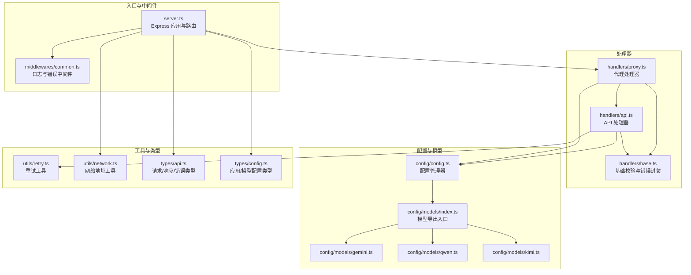
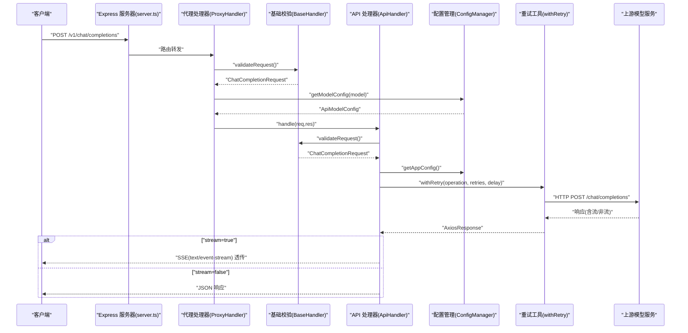
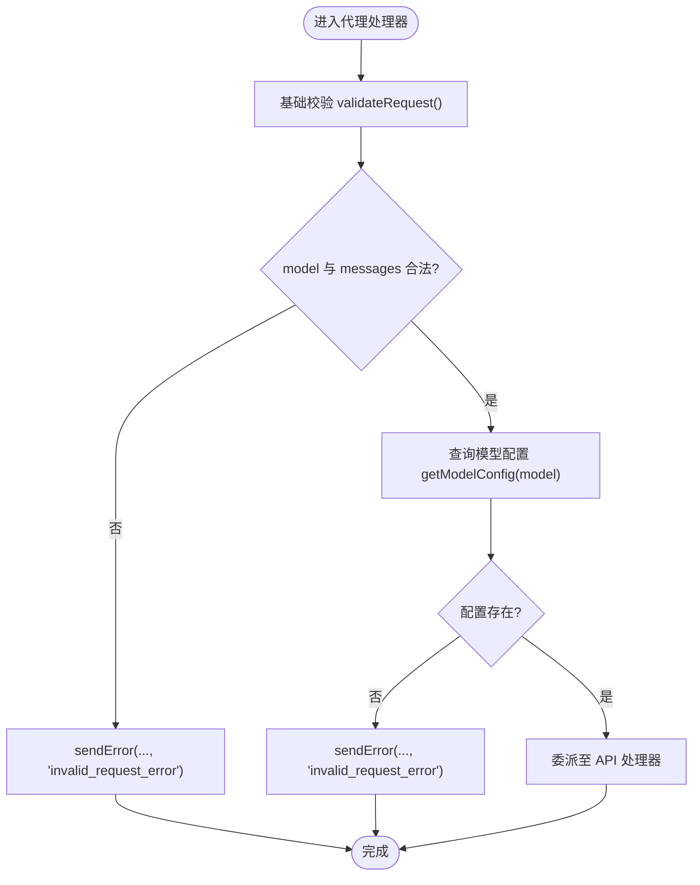
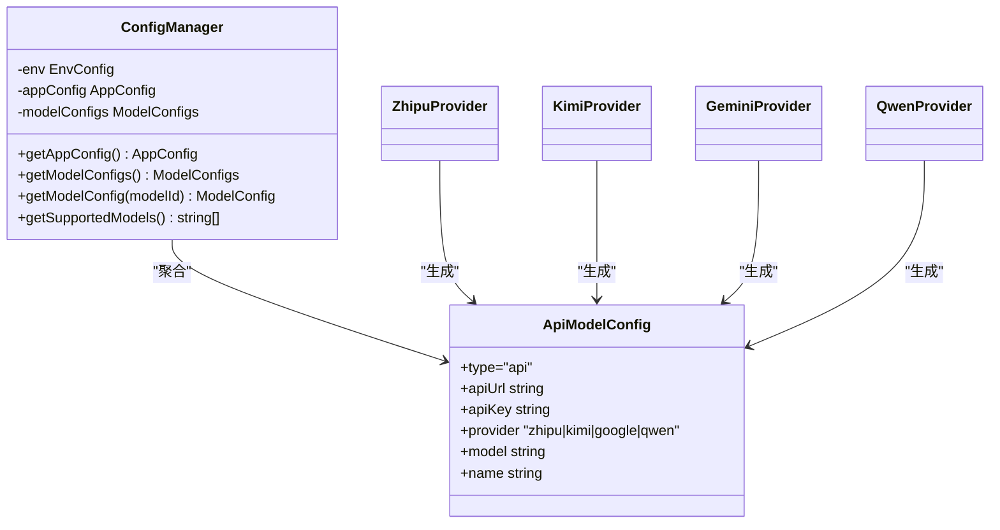
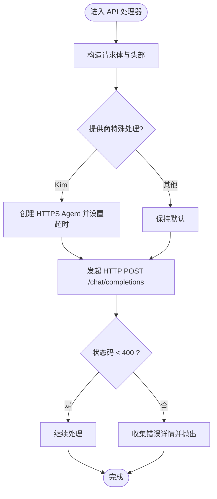
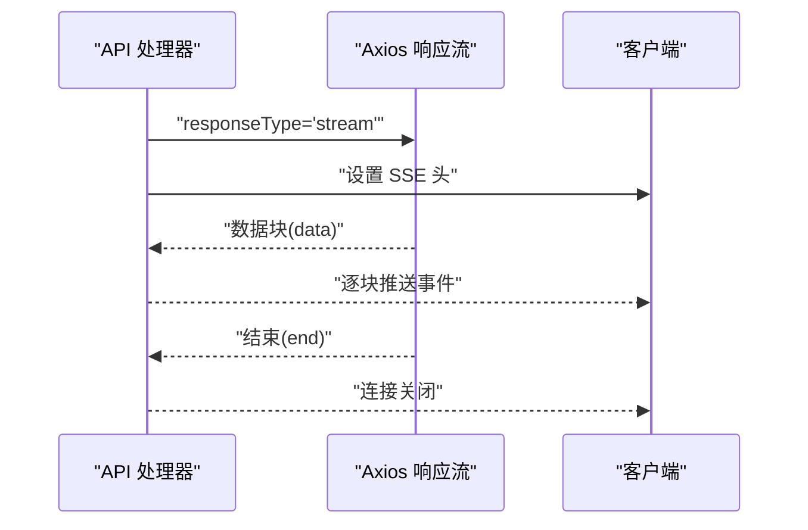
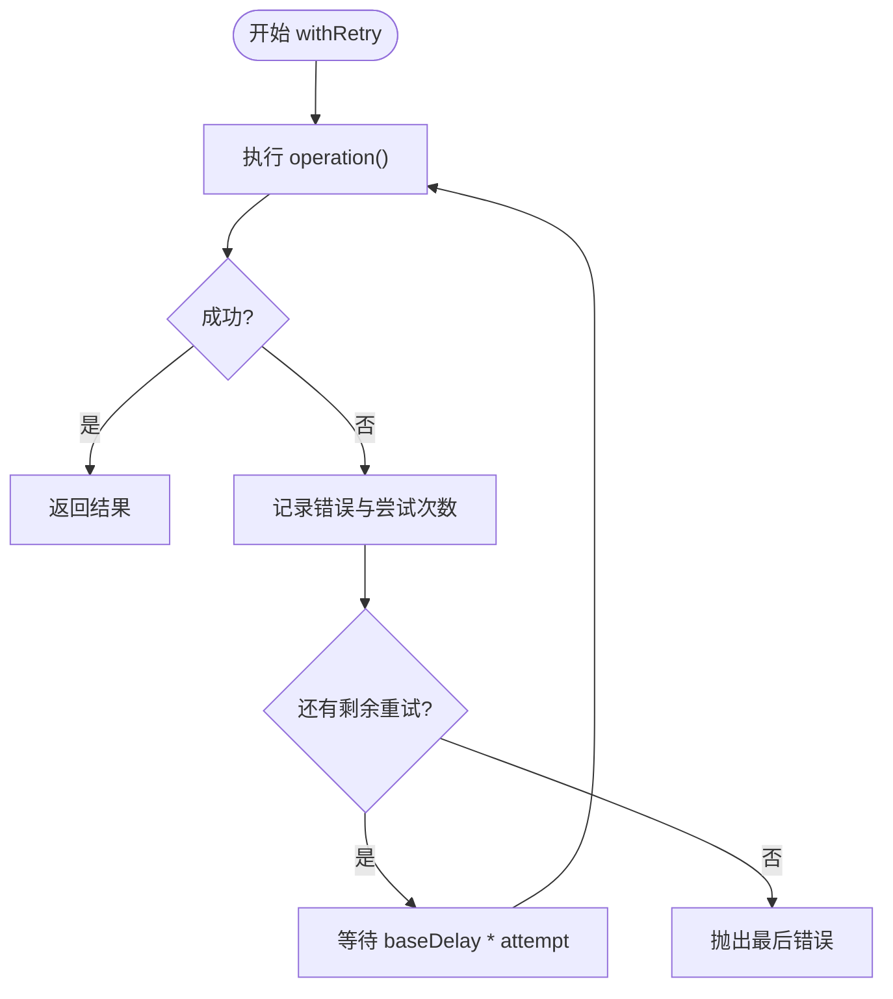
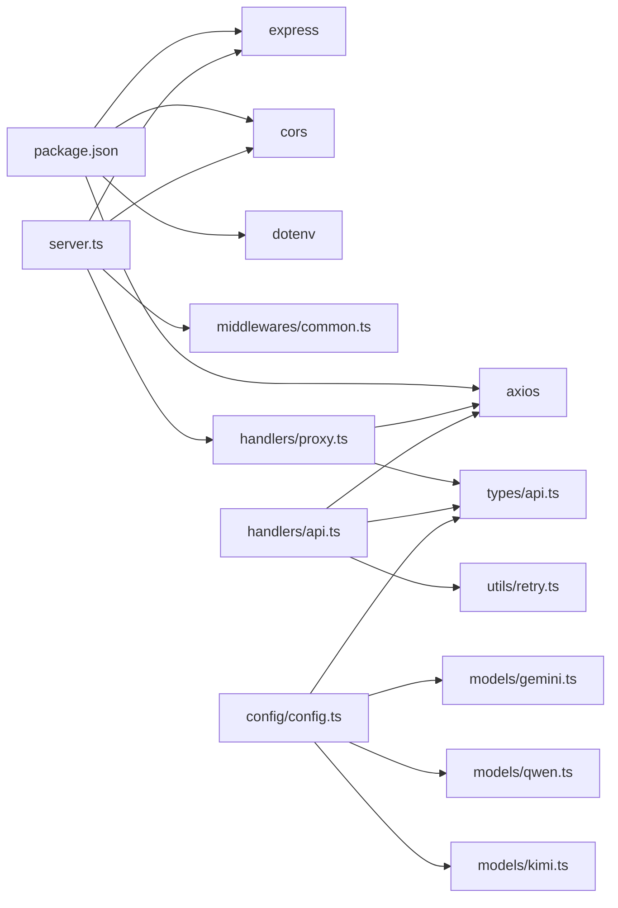

# 数据流

<cite>
**本文引用的文件**
- [src/server.ts](file://src/server.ts)
- [src/handlers/proxy.ts](file://src/handlers/proxy.ts)
- [src/handlers/api.ts](file://src/handlers/api.ts)
- [src/handlers/base.ts](file://src/handlers/base.ts)
- [src/middlewares/common.ts](file://src/middlewares/common.ts)
- [src/utils/retry.ts](file://src/utils/retry.ts)
- [src/utils/network.ts](file://src/utils/network.ts)
- [src/config/config.ts](file://src/config/config.ts)
- [src/config/models/index.ts](file://src/config/models/index.ts)
- [src/config/models/gemini.ts](file://src/config/models/gemini.ts)
- [src/config/models/qwen.ts](file://src/config/models/qwen.ts)
- [src/config/models/kimi.ts](file://src/config/models/kimi.ts)
- [src/types/api.ts](file://src/types/api.ts)
- [src/types/config.ts](file://src/types/config.ts)
- [package.json](file://package.json)
</cite>

## 目录
1. [简介](#简介)
2. [项目结构](#项目结构)
3. [核心组件](#核心组件)
4. [架构总览](#架构总览)
5. [详细组件分析](#详细组件分析)
6. [依赖关系分析](#依赖关系分析)
7. [性能考量](#性能考量)
8. [故障排查指南](#故障排查指南)
9. [结论](#结论)
10. [附录](#附录)

## 简介
本文件面向 xcode-ai-proxy 的数据流与处理机制，覆盖从客户端请求进入、请求解析与参数校验、模型选择、上游调用、流式响应（SSE）透传、错误恢复与重试、以及配置驱动的模型管理。文档同时给出关键路径的数据变化图示，并讨论异步场景下的数据一致性与并发控制要点。

## 项目结构
项目采用按职责分层组织：入口服务负责路由与中间件装配；处理器负责业务编排与调用；配置模块负责应用与模型配置；工具模块提供网络与重试能力；类型模块统一数据契约。

图表来源
- [src/server.ts:1-88](file://src/server.ts#L1-L88)
- [src/middlewares/common.ts:1-25](file://src/middlewares/common.ts#L1-L25)
- [src/handlers/proxy.ts:1-66](file://src/handlers/proxy.ts#L1-L66)
- [src/handlers/api.ts:1-196](file://src/handlers/api.ts#L1-L196)
- [src/handlers/base.ts:1-40](file://src/handlers/base.ts#L1-L40)
- [src/config/config.ts:1-123](file://src/config/config.ts#L1-L123)
- [src/config/models/index.ts:1-5](file://src/config/models/index.ts#L1-L5)
- [src/config/models/gemini.ts:1-34](file://src/config/models/gemini.ts#L1-L34)
- [src/config/models/qwen.ts:1-35](file://src/config/models/qwen.ts#L1-L35)
- [src/config/models/kimi.ts:1-34](file://src/config/models/kimi.ts#L1-L34)
- [src/utils/retry.ts:1-34](file://src/utils/retry.ts#L1-L34)
- [src/utils/network.ts:1-51](file://src/utils/network.ts#L1-L51)
- [src/types/api.ts:1-58](file://src/types/api.ts#L1-L58)
- [src/types/config.ts:1-48](file://src/types/config.ts#L1-L48)

章节来源
- [src/server.ts:1-88](file://src/server.ts#L1-L88)
- [src/handlers/proxy.ts:1-66](file://src/handlers/proxy.ts#L1-L66)
- [src/handlers/api.ts:1-196](file://src/handlers/api.ts#L1-L196)
- [src/handlers/base.ts:1-40](file://src/handlers/base.ts#L1-L40)
- [src/config/config.ts:1-123](file://src/config/config.ts#L1-L123)
- [src/utils/retry.ts:1-34](file://src/utils/retry.ts#L1-L34)
- [src/utils/network.ts:1-51](file://src/utils/network.ts#L1-L51)
- [src/types/api.ts:1-58](file://src/types/api.ts#L1-L58)
- [src/types/config.ts:1-48](file://src/types/config.ts#L1-L48)

## 核心组件
- 服务器与路由：初始化 Express 应用，注册 CORS、JSON 解析、日志中间件与统一错误处理；挂载健康检查、模型列表与聊天补全等路由。
- 代理处理器：接收请求，进行基础参数校验，查询模型配置，将 API 类模型请求委派给 API 处理器。
- API 处理器：执行请求体校验、模型配置解析、上游请求构造与发送、SSE 流式透传或非流式 JSON 返回、错误收集与抛出。
- 基础处理器：统一的请求校验与错误响应封装。
- 配置管理器：加载环境变量，校验必要密钥，初始化应用配置与模型配置，提供查询接口。
- 重试工具：指数退避重试，记录尝试与延迟，最终抛出最后一次错误。
- 网络工具：计算可访问地址，辅助启动日志输出。
- 类型系统：统一请求、响应、错误与配置的数据结构。

章节来源
- [src/server.ts:1-88](file://src/server.ts#L1-L88)
- [src/handlers/proxy.ts:1-66](file://src/handlers/proxy.ts#L1-L66)
- [src/handlers/api.ts:1-196](file://src/handlers/api.ts#L1-L196)
- [src/handlers/base.ts:1-40](file://src/handlers/base.ts#L1-L40)
- [src/config/config.ts:1-123](file://src/config/config.ts#L1-L123)
- [src/utils/retry.ts:1-34](file://src/utils/retry.ts#L1-L34)
- [src/utils/network.ts:1-51](file://src/utils/network.ts#L1-L51)
- [src/types/api.ts:1-58](file://src/types/api.ts#L1-L58)
- [src/types/config.ts:1-48](file://src/types/config.ts#L1-L48)

## 架构总览
下图展示从客户端到上游模型服务的完整数据路径，包含请求解析、参数验证、模型选择、请求构建、重试与响应透传。

图表来源
- [src/server.ts:29-44](file://src/server.ts#L29-L44)
- [src/handlers/proxy.ts:9-37](file://src/handlers/proxy.ts#L9-L37)
- [src/handlers/base.ts:10-22](file://src/handlers/base.ts#L10-L22)
- [src/handlers/api.ts:8-28](file://src/handlers/api.ts#L8-L28)
- [src/config/config.ts:101-115](file://src/config/config.ts#L101-L115)
- [src/utils/retry.ts:1-26](file://src/utils/retry.ts#L1-L26)

## 详细组件分析

### 请求解析与参数验证
- 代理处理器在进入具体模型处理前，先进行基础参数校验，确保存在 model 与合法 messages 数组。
- API 处理器再次校验请求体，保证后续构建上游请求时不会出现缺失字段。
- 错误统一通过基础处理器封装为标准错误响应，避免重复逻辑。

图表来源
- [src/handlers/proxy.ts:10-24](file://src/handlers/proxy.ts#L10-L24)
- [src/handlers/base.ts:10-22](file://src/handlers/base.ts#L10-L22)

章节来源
- [src/handlers/proxy.ts:10-24](file://src/handlers/proxy.ts#L10-L24)
- [src/handlers/base.ts:10-22](file://src/handlers/base.ts#L10-L22)

### 模型选择与配置加载
- 配置管理器在单例初始化时加载环境变量，校验至少存在一个 API 密钥；随后初始化应用配置与模型配置。
- 模型配置由各 Provider 提供，统一以 ApiModelConfig 形式注册，代理处理器据此选择对应上游服务。
- 支持的模型可通过 /v1/models 接口返回，便于客户端发现。

图表来源
- [src/config/config.ts:7-123](file://src/config/config.ts#L7-L123)
- [src/config/models/gemini.ts:20-33](file://src/config/models/gemini.ts#L20-L33)
- [src/config/models/qwen.ts:20-33](file://src/config/models/qwen.ts#L20-L33)
- [src/config/models/kimi.ts:20-33](file://src/config/models/kimi.ts#L20-L33)
- [src/types/config.ts:8-16](file://src/types/config.ts#L8-L16)

章节来源
- [src/config/config.ts:29-67](file://src/config/config.ts#L29-L67)
- [src/config/config.ts:69-99](file://src/config/config.ts#L69-L99)
- [src/config/models/gemini.ts:20-33](file://src/config/models/gemini.ts#L20-L33)
- [src/config/models/qwen.ts:20-33](file://src/config/models/qwen.ts#L20-L33)
- [src/config/models/kimi.ts:20-33](file://src/config/models/kimi.ts#L20-L33)
- [src/types/config.ts:8-16](file://src/types/config.ts#L8-L16)

### 请求构建与上游调用
- API 处理器根据模型配置构造上游请求，统一使用 OpenAI 兼容格式；针对不同提供商做特殊处理（如 Kimi 使用 HTTPS Agent）。
- 对于 Qwen，若 tools 为空数组则删除该字段以满足其 API 约束。
- 请求头统一注入 Authorization: Bearer，并根据是否流式设置 responseType。
- 请求超时与状态码校验由配置决定，允许 4xx 通过以便调试。

图表来源
- [src/handlers/api.ts:30-121](file://src/handlers/api.ts#L30-L121)
- [src/config/config.ts:53-61](file://src/config/config.ts#L53-L61)

章节来源
- [src/handlers/api.ts:30-121](file://src/handlers/api.ts#L30-L121)
- [src/config/config.ts:53-61](file://src/config/config.ts#L53-L61)

### 流式响应（SSE）实现与数据推送
- 当客户端请求 stream=true 时，API 处理器设置响应头为 text/event-stream，并将上游流直接 pipe 到客户端响应。
- 对于非流式请求，直接返回 JSON 响应。
- 该模式下无需在代理层进行额外的数据拼接或格式转换，降低延迟与内存占用。

图表来源
- [src/handlers/api.ts:176-194](file://src/handlers/api.ts#L176-L194)

章节来源
- [src/handlers/api.ts:176-194](file://src/handlers/api.ts#L176-L194)

### 错误恢复与重试机制
- 重试工具以指数退避方式执行最多 N 次尝试，每次记录尝试序号与延迟时间；最后一次失败抛出原始错误。
- API 处理器在调用上游时包裹重试逻辑，确保瞬时网络抖动或上游限流导致的失败具备恢复能力。
- 对于 4xx/5xx 响应，API 处理器会尝试读取流式错误体并解析为结构化错误数据，便于上层处理。

图表来源
- [src/utils/retry.ts:1-26](file://src/utils/retry.ts#L1-L26)
- [src/handlers/api.ts:117-121](file://src/handlers/api.ts#L117-L121)
- [src/handlers/api.ts:131-164](file://src/handlers/api.ts#L131-L164)

章节来源
- [src/utils/retry.ts:1-26](file://src/utils/retry.ts#L1-L26)
- [src/handlers/api.ts:117-164](file://src/handlers/api.ts#L117-L164)

### 缓存策略、数据转换与格式化
- 代理层未实现应用级缓存；上游响应头透传，SSE 模式下保持长连接与逐块推送。
- 请求体转换遵循 OpenAI 兼容格式，针对特定提供商插入系统提示与修正字段（如 Qwen 的 tools 字段清理）。
- 响应格式保持与上游一致，非流式直接返回 JSON，流式透传事件流。

章节来源
- [src/handlers/api.ts:58-100](file://src/handlers/api.ts#L58-L100)
- [src/handlers/api.ts:168-194](file://src/handlers/api.ts#L168-L194)

### 异步操作与并发控制
- 流式响应采用事件流透传，避免在代理层累积大量中间数据，降低内存峰值。
- 非流式响应直接返回 JSON，无额外异步状态管理。
- 并发方面，每个请求独立建立上游连接与下游响应通道；未见全局锁或共享状态，遵循“每请求隔离”的设计。

章节来源
- [src/handlers/api.ts:176-194](file://src/handlers/api.ts#L176-L194)

### 安全过滤与性能优化
- 安全过滤：统一注入 Bearer 认证头，避免明文传输；仅透传必要的响应头，减少跨域限制。
- 性能优化：SSE 透传避免额外序列化/反序列化；Kimi 使用 HTTPS Agent 以复用连接；请求超时与重试参数可配置；日志级别适中，避免生产环境过度 IO。

章节来源
- [src/handlers/api.ts:46-56](file://src/handlers/api.ts#L46-L56)
- [src/config/config.ts:53-61](file://src/config/config.ts#L53-L61)
- [src/server.ts:24-26](file://src/server.ts#L24-L26)

## 依赖关系分析
- 运行时依赖：Express、CORS、Axios、Dotenv。
- 开发依赖：TypeScript、ts-node、Nodemon、类型声明等。
- 代码耦合：处理器依赖配置管理器；API 处理器依赖重试工具；服务器装配中间件与路由；类型模块被广泛使用。

图表来源
- [package.json:14-28](file://package.json#L14-L28)
- [src/server.ts:1-7](file://src/server.ts#L1-L7)
- [src/handlers/proxy.ts:1-7](file://src/handlers/proxy.ts#L1-L7)
- [src/handlers/api.ts:1-7](file://src/handlers/api.ts#L1-L7)
- [src/config/config.ts:1-5](file://src/config/config.ts#L1-L5)

章节来源
- [package.json:14-28](file://package.json#L14-L28)
- [src/server.ts:1-7](file://src/server.ts#L1-L7)
- [src/handlers/proxy.ts:1-7](file://src/handlers/proxy.ts#L1-L7)
- [src/handlers/api.ts:1-7](file://src/handlers/api.ts#L1-L7)
- [src/config/config.ts:1-5](file://src/config/config.ts#L1-L5)

## 性能考量
- 流式透传显著降低延迟与内存占用，适合长文本生成与实时反馈场景。
- 重试与超时参数可调，建议结合上游 SLA 与客户端容忍度进行权衡。
- 日志输出在开发/调试阶段有助于定位问题，生产环境建议降低日志级别以减少 IO。

## 故障排查指南
- 健康检查：访问 /health 获取服务状态与模型数量。
- 模型列表：访问 /v1/models 获取可用模型清单。
- 常见错误：
  - 缺少必需参数：确认请求体包含 model 与合法 messages。
  - 不支持的模型：核对模型 ID 是否在支持列表中。
  - 上游错误：查看代理日志中的错误详情与状态码；对于流式错误，代理会尝试读取并解析错误体。
  - 认证失败：确认对应提供商的 API Key 已正确配置。

章节来源
- [src/handlers/proxy.ts:39-65](file://src/handlers/proxy.ts#L39-L65)
- [src/handlers/base.ts:24-34](file://src/handlers/base.ts#L24-L34)
- [src/handlers/api.ts:124-164](file://src/handlers/api.ts#L124-L164)

## 结论
xcode-ai-proxy 通过清晰的分层与配置驱动，实现了从请求解析、模型选择、上游调用到响应透传的完整数据流。SSE 透传与可配置的重试机制在保证低延迟的同时提升了鲁棒性；类型系统与中间件进一步增强了可维护性与可观测性。建议在生产环境中合理设置超时与重试参数，并关注上游配额与速率限制。

## 附录
- 启动与访问：服务器启动后打印本地与局域网访问地址、支持的模型与重试配置；Xcode 可参考输出的环境变量提示进行配置。
- 模型扩展：新增提供商只需实现 Provider 并在配置管理器中注册，即可无缝接入代理层。

章节来源
- [src/server.ts:54-83](file://src/server.ts#L54-L83)
- [src/config/config.ts:69-99](file://src/config/config.ts#L69-L99)