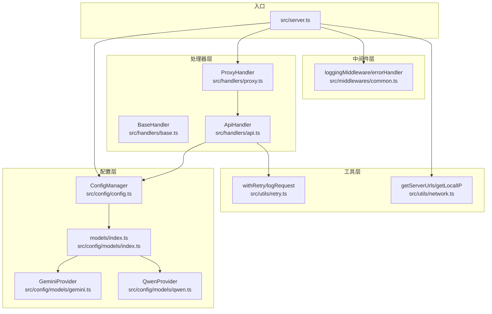
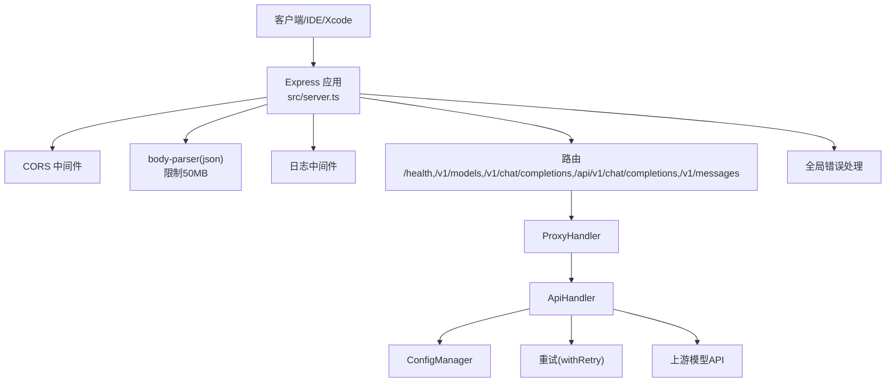
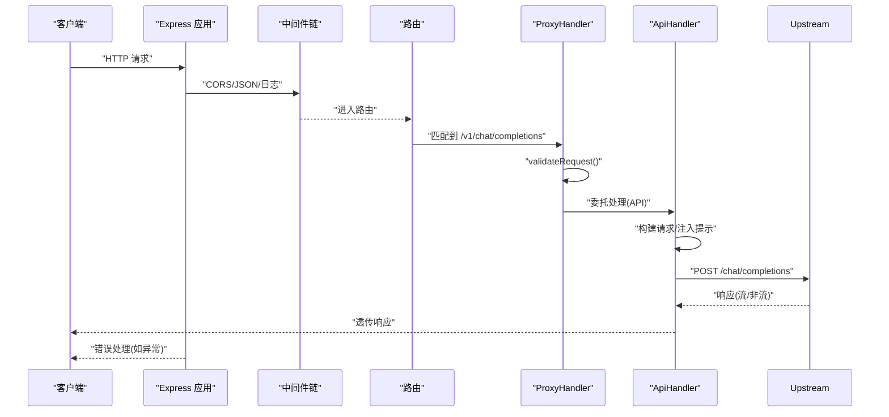
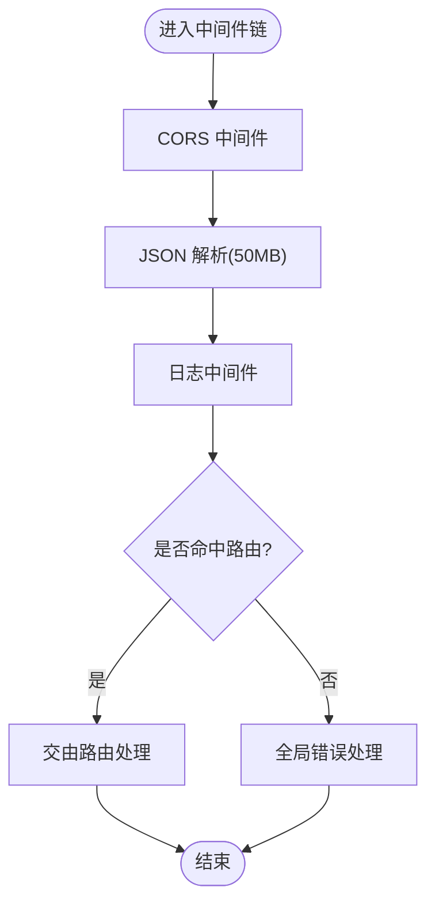
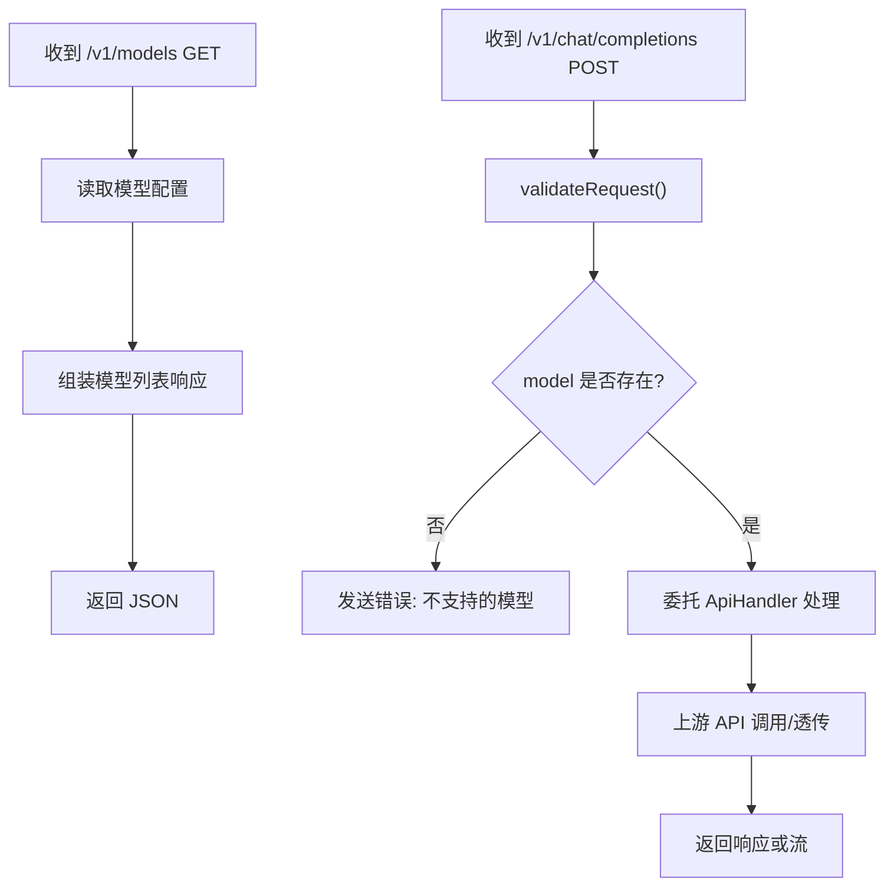
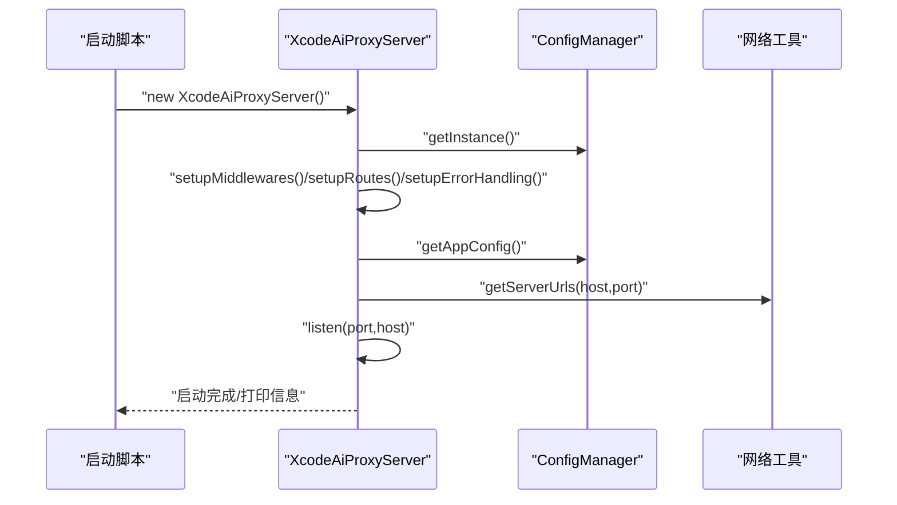
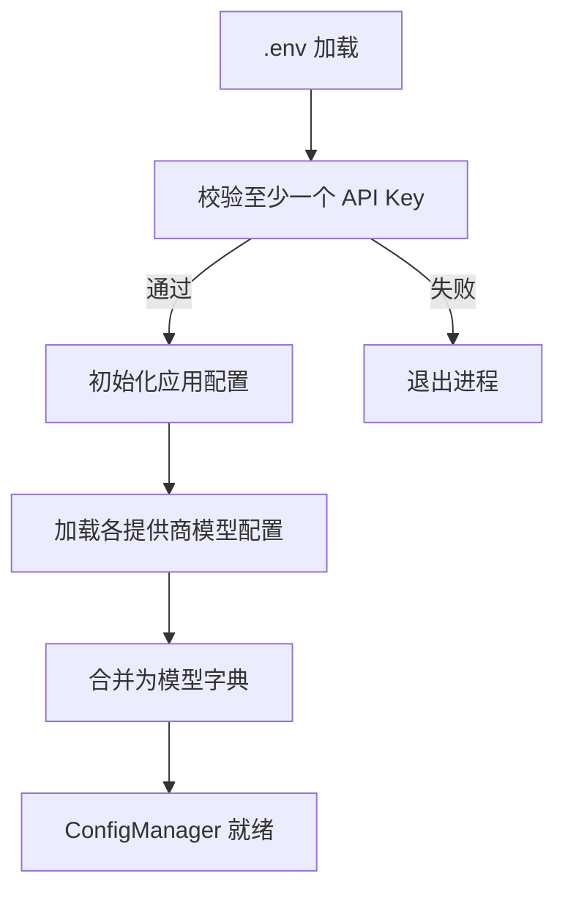
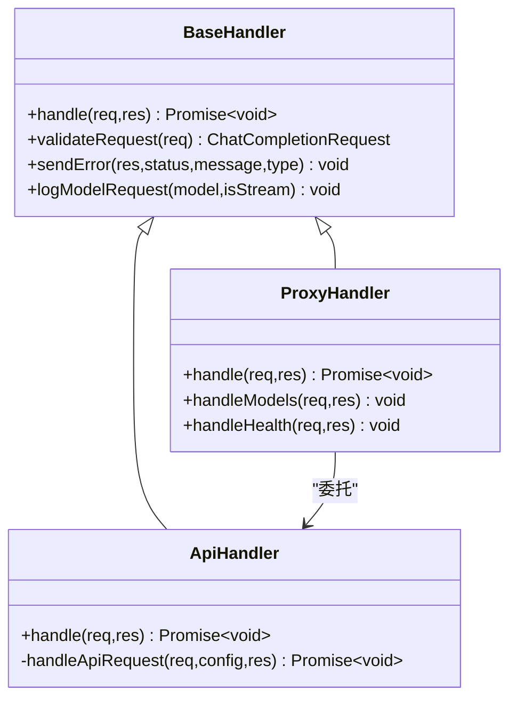
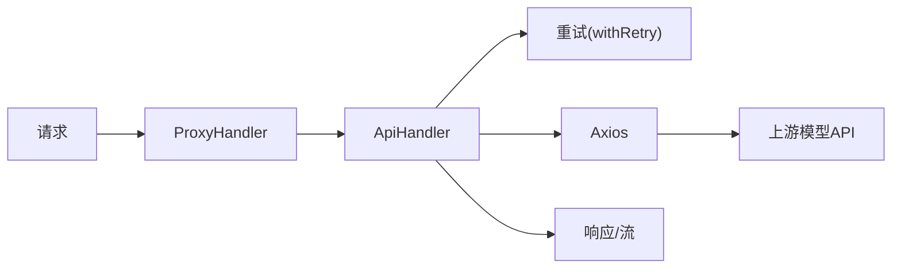
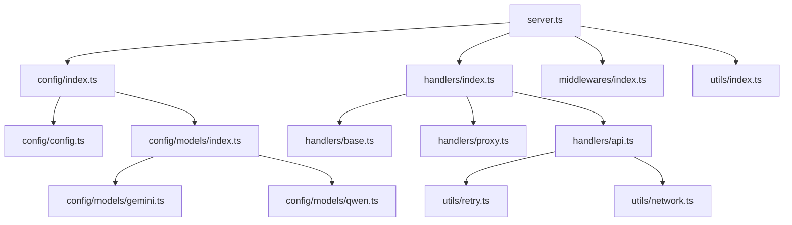

# 整体架构

<cite>
**本文档引用的文件**
- [package.json](file://package.json)
- [tsconfig.json](file://tsconfig.json)
- [src/server.ts](file://src/server.ts)
- [src/config/index.ts](file://src/config/index.ts)
- [src/config/config.ts](file://src/config/config.ts)
- [src/config/models/index.ts](file://src/config/models/index.ts)
- [src/config/models/gemini.ts](file://src/config/models/gemini.ts)
- [src/config/models/qwen.ts](file://src/config/models/qwen.ts)
- [src/handlers/index.ts](file://src/handlers/index.ts)
- [src/handlers/base.ts](file://src/handlers/base.ts)
- [src/handlers/proxy.ts](file://src/handlers/proxy.ts)
- [src/handlers/api.ts](file://src/handlers/api.ts)
- [src/middlewares/index.ts](file://src/middlewares/index.ts)
- [src/middlewares/common.ts](file://src/middlewares/common.ts)
- [src/utils/index.ts](file://src/utils/index.ts)
- [src/utils/network.ts](file://src/utils/network.ts)
- [src/utils/retry.ts](file://src/utils/retry.ts)
</cite>

## 目录
1. [引言](#引言)
2. [项目结构](#项目结构)
3. [核心组件](#核心组件)
4. [架构总览](#架构总览)
5. [详细组件分析](#详细组件分析)
6. [依赖分析](#依赖分析)
7. [性能考虑](#性能考虑)
8. [故障排查指南](#故障排查指南)
9. [结论](#结论)
10. [附录](#附录)

## 引言
本项目为 Xcode AI API 代理服务，采用单体应用架构，基于 Express.js 提供统一的 OpenAI 兼容接口，实现对多家国内大模型平台（智谱、Kimi、Gemini、通义千问）的代理与统一流式响应输出。系统通过配置管理器集中加载环境变量与模型配置，通过中间件系统实现通用日志与错误处理，通过处理器模块完成请求校验、模型选择与上游 API 调用，并在工具层提供网络地址解析与重试机制。

## 项目结构
项目采用按职责分层的模块化组织方式：
- 配置层：负责加载环境变量、初始化应用配置与模型配置，提供单例访问。
- 处理器层：抽象基础处理器与具体代理/API处理器，完成请求校验、模型匹配与上游调用。
- 中间件层：提供通用日志与全局错误处理。
- 工具层：提供网络地址解析、重试与请求日志等通用能力。
- 类型层：定义请求/响应与配置的类型接口。
- 入口：Express 应用启动与路由注册。

**图示来源**
- [src/server.ts:1-88](file://src/server.ts#L1-L88)
- [src/config/config.ts:1-121](file://src/config/config.ts#L1-L121)
- [src/config/models/index.ts:1-5](file://src/config/models/index.ts#L1-L5)
- [src/config/models/gemini.ts:1-34](file://src/config/models/gemini.ts#L1-L34)
- [src/config/models/qwen.ts:1-35](file://src/config/models/qwen.ts#L1-L35)
- [src/handlers/base.ts:1-40](file://src/handlers/base.ts#L1-L40)
- [src/handlers/proxy.ts:1-66](file://src/handlers/proxy.ts#L1-L66)
- [src/handlers/api.ts:1-196](file://src/handlers/api.ts#L1-L196)
- [src/middlewares/common.ts:1-25](file://src/middlewares/common.ts#L1-L25)
- [src/utils/network.ts:1-51](file://src/utils/network.ts#L1-L51)
- [src/utils/retry.ts:1-34](file://src/utils/retry.ts#L1-L34)

**章节来源**
- [src/server.ts:1-88](file://src/server.ts#L1-L88)
- [package.json:1-30](file://package.json#L1-L30)

## 核心组件
- Express 应用与启动流程
  - 应用实例化、中间件注册、路由绑定与错误处理注册均在构造函数中完成，随后在 start 方法中读取配置并监听端口。
  - 启动时打印多网卡访问地址、支持的模型列表、重试与超时配置，并给出 Xcode 配置建议。
- 配置管理器
  - 单例模式，负责验证必要环境变量、初始化应用配置（端口、主机、最大重试、重试延迟、请求超时、自定义系统提示），并聚合多家模型提供商的模型配置。
- 处理器体系
  - BaseHandler：统一请求校验与错误发送逻辑。
  - ProxyHandler：根据请求模型选择对应处理器；当前仅支持“api”类型的模型。
  - ApiHandler：对接上游 OpenAI 兼容接口，统一注入中文交流指令与可选自定义系统提示，支持流式与非流式响应透传。
- 中间件系统
  - loggingMiddleware：记录请求方法与路径。
  - errorHandler：统一捕获异常并返回标准错误响应。
- 工具模块
  - 网络工具：解析本地 IP、生成可访问 URL 列表。
  - 重试工具：指数退避重试，支持最大重试次数与基础延迟配置。

**章节来源**
- [src/server.ts:8-88](file://src/server.ts#L8-L88)
- [src/config/config.ts:7-121](file://src/config/config.ts#L7-L121)
- [src/handlers/base.ts:5-40](file://src/handlers/base.ts#L5-L40)
- [src/handlers/proxy.ts:6-66](file://src/handlers/proxy.ts#L6-L66)
- [src/handlers/api.ts:8-196](file://src/handlers/api.ts#L8-L196)
- [src/middlewares/common.ts:4-25](file://src/middlewares/common.ts#L4-L25)
- [src/utils/network.ts:35-51](file://src/utils/network.ts#L35-L51)
- [src/utils/retry.ts:1-34](file://src/utils/retry.ts#L1-L34)

## 架构总览
系统采用典型的三层架构与模块化组织：
- 表现层：Express 路由与控制器（ProxyHandler、ApiHandler）。
- 领域层：请求校验、模型选择、上游调用与响应透传。
- 基础设施层：配置加载、网络地址解析、重试与日志。

**图示来源**
- [src/server.ts:23-44](file://src/server.ts#L23-L44)
- [src/server.ts:29-40](file://src/server.ts#L29-L40)
- [src/handlers/proxy.ts:9-37](file://src/handlers/proxy.ts#L9-L37)
- [src/handlers/api.ts:30-195](file://src/handlers/api.ts#L30-L195)
- [src/utils/retry.ts:1-26](file://src/utils/retry.ts#L1-L26)

## 详细组件分析

### Express.js Web 服务器架构
- 应用生命周期
  - 构造阶段：实例化 Express、获取 ConfigManager 单例、创建 ProxyHandler、注册中间件、路由与错误处理。
  - 运行阶段：启动监听，打印启动信息与配置摘要。
- 路由策略
  - 健康检查：GET /health
  - 模型列表：GET /v1/models
  - 对话补全：POST /v1/chat/completions、/api/v1/chat/completions、/v1/messages
- 中间件链
  - CORS 允许跨域
  - JSON 解析（限制 50MB）
  - 日志中间件
  - 全局错误处理

**图示来源**
- [src/server.ts:23-44](file://src/server.ts#L23-L44)
- [src/server.ts:29-40](file://src/server.ts#L29-L40)
- [src/handlers/proxy.ts:9-37](file://src/handlers/proxy.ts#L9-L37)
- [src/handlers/api.ts:30-195](file://src/handlers/api.ts#L30-L195)

**章节来源**
- [src/server.ts:8-88](file://src/server.ts#L8-L88)

### 中间件系统设计
- loggingMiddleware：记录请求方法与路径，便于审计与排障。
- errorHandler：统一捕获未处理异常，防止进程崩溃，返回标准化错误对象。

**图示来源**
- [src/middlewares/common.ts:4-25](file://src/middlewares/common.ts#L4-L25)

**章节来源**
- [src/middlewares/common.ts:1-25](file://src/middlewares/common.ts#L1-L25)

### 路由处理机制
- 健康检查：返回服务状态、时间戳与模型数量。
- 模型列表：遍历 ConfigManager 中的模型配置，组装 OpenAI 兼容的模型列表响应。
- 对话补全：先校验请求参数，再根据 model 字段查询模型配置，最后委托 ApiHandler 完成上游调用。

**图示来源**
- [src/handlers/proxy.ts:39-65](file://src/handlers/proxy.ts#L39-L65)
- [src/handlers/proxy.ts:9-37](file://src/handlers/proxy.ts#L9-L37)

**章节来源**
- [src/handlers/proxy.ts:1-66](file://src/handlers/proxy.ts#L1-L66)

### 应用程序启动流程与运行时行为
- 启动流程
  - 实例化 XcodeAiProxyServer → 注册中间件/路由/错误处理 → 读取应用配置 → 启动监听 → 输出启动信息与配置摘要。
- 运行时行为
  - 自动解析本机与局域网可访问地址，打印支持的模型清单与重试/超时配置。
  - 为 Xcode 提供 ANTHROPIC_BASE_URL 与认证令牌的配置建议。

**图示来源**
- [src/server.ts:46-83](file://src/server.ts#L46-L83)
- [src/utils/network.ts:35-51](file://src/utils/network.ts#L35-L51)

**章节来源**
- [src/server.ts:46-88](file://src/server.ts#L46-L88)

### 配置加载机制
- 环境变量加载：通过 dotenv 加载 .env 文件。
- 必填校验：至少需配置一个模型的 API 密钥，否则终止进程。
- 应用配置：端口、主机、最大重试、重试延迟、请求超时、自定义系统提示。
- 模型配置：按提供商聚合模型清单，统一暴露给处理器使用。

**图示来源**
- [src/config/config.ts:27-97](file://src/config/config.ts#L27-L97)

**章节来源**
- [src/config/config.ts:1-121](file://src/config/config.ts#L1-L121)

### 处理器与模型适配
- BaseHandler：统一校验请求参数与错误发送。
- ProxyHandler：根据 model 选择处理器；当前仅支持“api”类型。
- ApiHandler：统一 OpenAI 兼容格式，注入中文交流指令与自定义系统提示；针对 Kimi 使用 HTTPS Agent；对 Qwen 移除空的 tools 数组；支持流式与非流式响应透传。

**图示来源**
- [src/handlers/base.ts:5-40](file://src/handlers/base.ts#L5-L40)
- [src/handlers/proxy.ts:6-66](file://src/handlers/proxy.ts#L6-L66)
- [src/handlers/api.ts:8-196](file://src/handlers/api.ts#L8-L196)

**章节来源**
- [src/handlers/base.ts:1-40](file://src/handlers/base.ts#L1-L40)
- [src/handlers/proxy.ts:1-66](file://src/handlers/proxy.ts#L1-L66)
- [src/handlers/api.ts:1-196](file://src/handlers/api.ts#L1-L196)

### 数据流向与外部依赖
- 内部数据流
  - 请求从 Express 路由进入，经 ProxyHandler 校验与模型选择，再由 ApiHandler 构建上游请求并执行重试，最终透传响应。
- 外部依赖
  - Express：Web 框架与路由。
  - Axios：HTTP 客户端，用于上游 API 调用。
  - CORS：跨域支持。
  - Dotenv：环境变量加载。
  - Node.js 内置：https、os 等。

**图示来源**
- [src/handlers/api.ts:30-195](file://src/handlers/api.ts#L30-L195)
- [src/utils/retry.ts:1-26](file://src/utils/retry.ts#L1-L26)
- [package.json:14-28](file://package.json#L14-L28)

**章节来源**
- [src/handlers/api.ts:1-196](file://src/handlers/api.ts#L1-L196)
- [package.json:14-28](file://package.json#L14-L28)

## 依赖分析
- 模块耦合
  - server.ts 依赖 config、handlers、middlewares、utils 的导出。
  - handlers 依赖 config 与 types；ApiHandler 依赖 axios 与 utils。
  - config 依赖 models 子模块与 dotenv。
- 外部依赖
  - 运行时：express、axios、cors、dotenv。
  - 开发时：@types/*、ts-node、nodemon、rimraf、typescript。

**图示来源**
- [src/server.ts:1-7](file://src/server.ts#L1-L7)
- [src/config/index.ts:1](file://src/config/index.ts#L1)
- [src/handlers/index.ts:1-3](file://src/handlers/index.ts#L1-L3)
- [src/middlewares/index.ts:1](file://src/middlewares/index.ts#L1)
- [src/utils/index.ts:1-2](file://src/utils/index.ts#L1-L2)
- [src/config/config.ts:1-5](file://src/config/config.ts#L1-L5)
- [src/config/models/index.ts:1-5](file://src/config/models/index.ts#L1-L5)

**章节来源**
- [src/server.ts:1-7](file://src/server.ts#L1-L7)
- [package.json:14-28](file://package.json#L14-L28)

## 性能考虑
- 流式响应：当客户端请求 stream=true 时，直接透传上游流，降低内存占用与延迟。
- 重试策略：指数退避重试，避免雪崩效应；可通过环境变量调整最大重试次数与延迟。
- 请求超时：统一设置请求超时，防止长时间阻塞。
- JSON 体大小：body-parser 限制为 50MB，满足大模型上下文需求。
- 并发与连接：Kimi 使用 HTTPS Agent 保持长连接，提升稳定性。

[本节为通用性能讨论，无需特定文件引用]

## 故障排查指南
- 常见错误类型
  - 缺少模型参数或消息格式无效：由 BaseHandler 校验并返回错误。
  - 不支持的模型：由 ProxyHandler 返回模型列表建议。
  - 上游 API 错误：ApiHandler 记录状态码与错误内容，必要时读取流式错误体。
  - 服务器内部错误：由 errorHandler 统一捕获并返回标准错误。
- 排查步骤
  - 查看启动日志中的模型列表与重试配置。
  - 检查环境变量是否正确加载（至少一个 API Key）。
  - 观察请求日志与错误日志，定位具体失败环节。
  - 如为流式错误，确认上游返回的错误流是否可读取。

**章节来源**
- [src/handlers/base.ts:24-34](file://src/handlers/base.ts#L24-L34)
- [src/handlers/proxy.ts:15-24](file://src/handlers/proxy.ts#L15-L24)
- [src/handlers/api.ts:124-164](file://src/handlers/api.ts#L124-L164)
- [src/middlewares/common.ts:9-25](file://src/middlewares/common.ts#L9-L25)

## 结论
本项目以单体应用形式实现了简洁高效的 Xcode AI 代理服务，具备以下优势：
- 易部署：单一可执行文件，启动即用。
- 易扩展：通过 Provider 模式新增模型提供商，配置层自动聚合。
- 易维护：清晰的分层与职责分离，中间件与工具模块复用度高。

局限性：
- 单体架构在功能持续增长时可能带来模块耦合与复杂度上升。
- 当前仅支持“api”类型的模型，后续可扩展更多类型与适配器。

演进方向建议：
- 引入插件化/适配器模式以支持更多模型类型与协议。
- 增加鉴权与速率限制中间件，提升生产可用性。
- 引入指标采集与链路追踪，增强可观测性。
- 将配置中心化，支持热更新与灰度发布。

[本节为总结性内容，无需特定文件引用]

## 附录
- 系统边界
  - 内部：Express 应用、处理器、配置管理、工具模块。
  - 外部：多家模型提供商的 OpenAI 兼容 API。
- 集成接口
  - 统一使用 OpenAI 兼容的 /v1/chat/completions 接口，支持流式与非流式响应。
  - 暴露 /v1/models 获取模型列表，/health 健康检查。

[本节为概念性内容，无需特定文件引用]