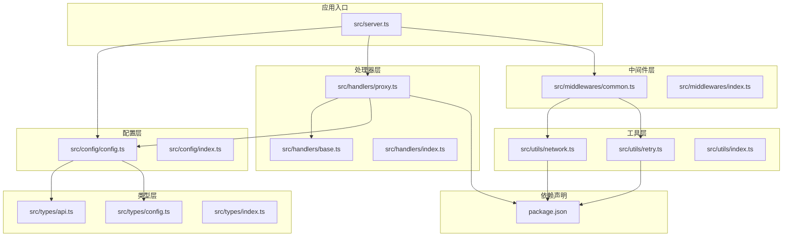
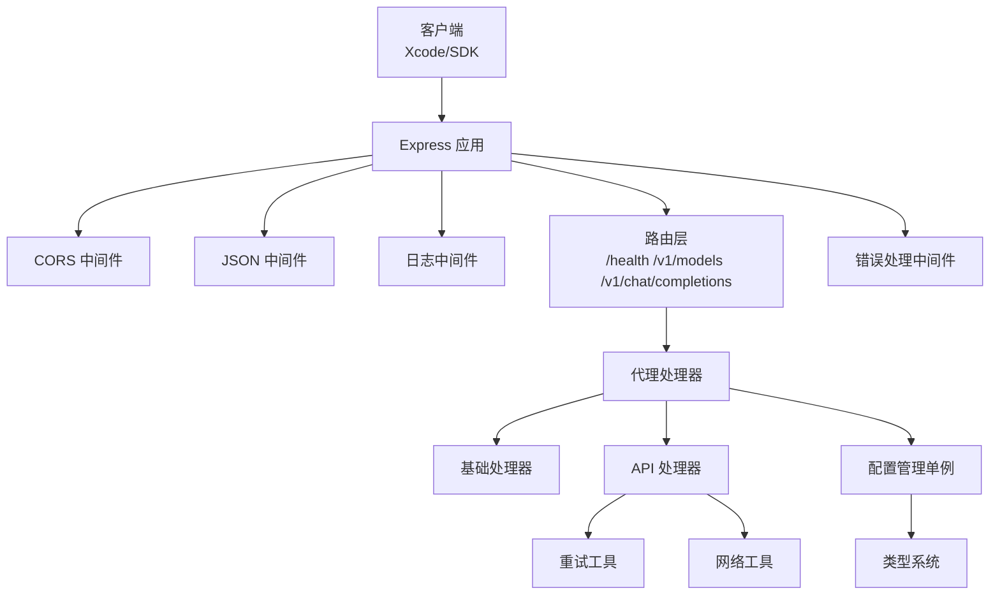
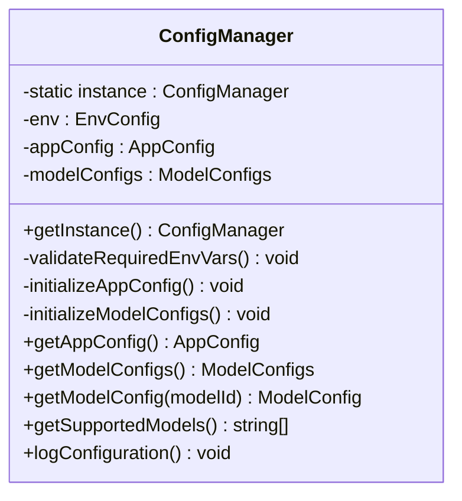
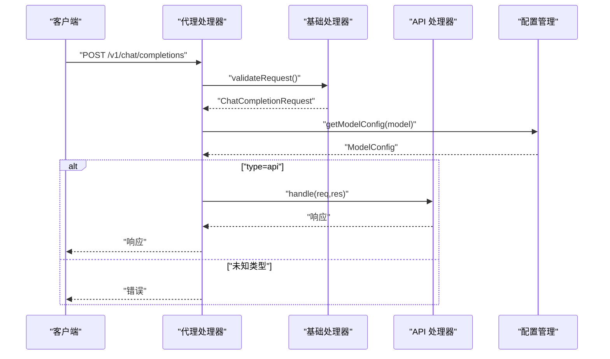
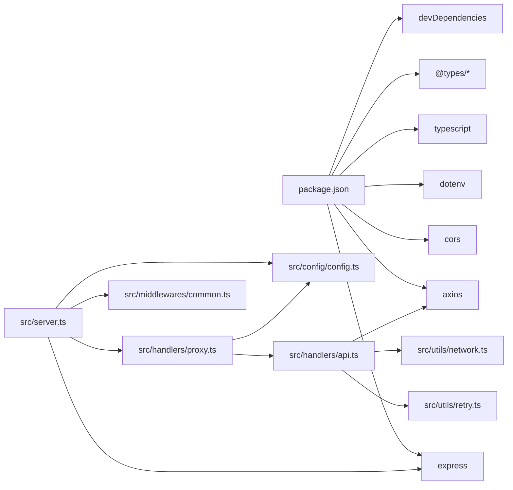
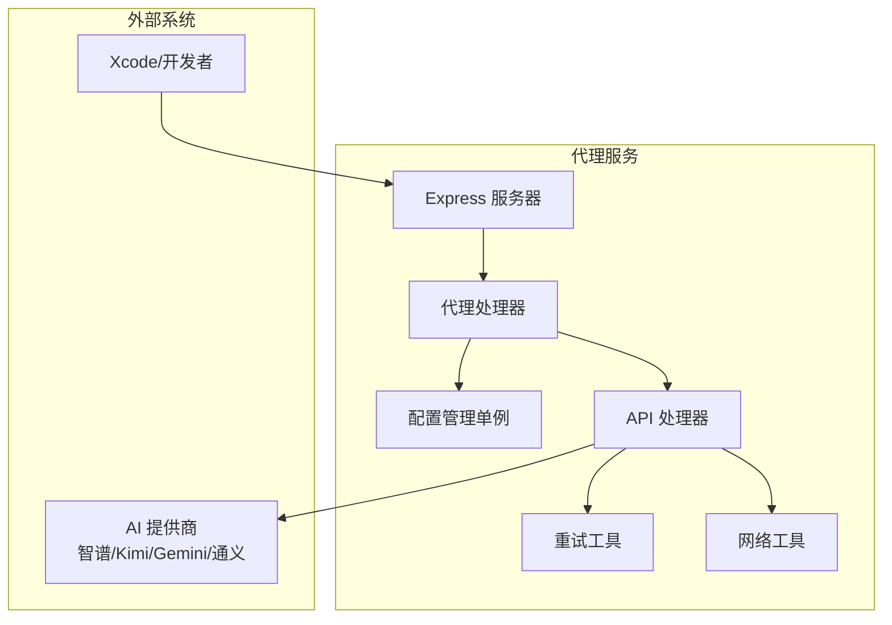

# 架构设计

<cite>
**本文引用的文件**
- [src/server.ts](file://src/server.ts)
- [src/config/config.ts](file://src/config/config.ts)
- [src/config/index.ts](file://src/config/index.ts)
- [src/handlers/base.ts](file://src/handlers/base.ts)
- [src/handlers/proxy.ts](file://src/handlers/proxy.ts)
- [src/handlers/index.ts](file://src/handlers/index.ts)
- [src/middlewares/common.ts](file://src/middlewares/common.ts)
- [src/middlewares/index.ts](file://src/middlewares/index.ts)
- [src/utils/network.ts](file://src/utils/network.ts)
- [src/utils/retry.ts](file://src/utils/retry.ts)
- [src/utils/index.ts](file://src/utils/index.ts)
- [src/types/api.ts](file://src/types/api.ts)
- [src/types/config.ts](file://src/types/config.ts)
- [src/types/index.ts](file://src/types/index.ts)
- [package.json](file://package.json)
</cite>

## 目录
1. [引言](#引言)
2. [项目结构](#项目结构)
3. [核心组件](#核心组件)
4. [架构总览](#架构总览)
5. [详细组件分析](#详细组件分析)
6. [依赖关系分析](#依赖关系分析)
7. [性能与可扩展性](#性能与可扩展性)
8. [故障排查指南](#故障排查指南)
9. [结论](#结论)
10. [附录](#附录)

## 引言
本项目为 Xcode AI 代理服务，目标是为 Xcode 提供统一的 AI 接口代理能力，屏蔽不同 AI 服务提供商的差异，实现模型聚合、统一路由、健康检查、模型列表查询与流式响应等能力。系统采用 Node.js + Express 构建，使用 TypeScript 进行类型安全控制，并通过单例模式集中管理全局配置，通过工厂模式按需初始化各模型提供方，通过策略模式在运行时选择具体模型与提供方。

## 项目结构
项目采用按职责分层与功能模块化组织方式：
- 顶层入口：Express 应用与服务器启动逻辑
- 配置层：集中读取环境变量、初始化应用与模型配置，提供单例访问
- 处理器层：基础处理器抽象、代理处理器与 API 处理器
- 中间件层：通用日志与错误处理中间件
- 工具层：网络地址解析、重试机制与日志工具
- 类型层：统一的请求/响应与配置类型定义
- 依赖声明：包管理与构建脚本

图表来源
- [src/server.ts:1-88](file://src/server.ts#L1-L88)
- [src/config/config.ts:1-121](file://src/config/config.ts#L1-L121)
- [src/handlers/proxy.ts:1-66](file://src/handlers/proxy.ts#L1-L66)
- [src/middlewares/common.ts:1-25](file://src/middlewares/common.ts#L1-L25)
- [src/utils/network.ts:1-51](file://src/utils/network.ts#L1-L51)
- [src/utils/retry.ts:1-34](file://src/utils/retry.ts#L1-L34)
- [src/types/api.ts:1-58](file://src/types/api.ts#L1-L58)
- [src/types/config.ts:1-48](file://src/types/config.ts#L1-L48)
- [package.json:1-30](file://package.json#L1-L30)

章节来源
- [src/server.ts:1-88](file://src/server.ts#L1-L88)
- [package.json:1-30](file://package.json#L1-L30)

## 核心组件
- 服务器与路由
  - Express 应用实例化、CORS、JSON 解析、日志中间件与统一错误处理注册
  - 提供健康检查、模型列表与聊天补全的路由
- 配置管理（单例）
  - 读取环境变量，校验必要密钥，初始化应用配置与模型配置
  - 提供获取应用配置、模型配置、支持模型列表与日志输出
- 处理器（策略+工厂）
  - 基类处理器负责请求校验与错误发送
  - 代理处理器根据模型 ID 查找模型配置，委派给 API 处理器执行
  - API 处理器封装对上游 AI 提供商的调用（当前仅支持 type=api 的模型）
- 中间件（横切）
  - 日志中间件与全局错误处理中间件
- 工具（横切）
  - 网络地址解析：本地 IP、主 IP、服务访问 URL
  - 重试机制：指数退避重试与请求日志
- 类型系统
  - 统一的聊天消息、请求、响应与错误类型
  - 应用配置、模型配置与环境变量类型

章节来源
- [src/server.ts:8-84](file://src/server.ts#L8-L84)
- [src/config/config.ts:7-121](file://src/config/config.ts#L7-L121)
- [src/handlers/base.ts:5-40](file://src/handlers/base.ts#L5-L40)
- [src/handlers/proxy.ts:6-66](file://src/handlers/proxy.ts#L6-L66)
- [src/middlewares/common.ts:4-25](file://src/middlewares/common.ts#L4-L25)
- [src/utils/network.ts:35-51](file://src/utils/network.ts#L35-L51)
- [src/utils/retry.ts:1-34](file://src/utils/retry.ts#L1-L34)
- [src/types/api.ts:1-58](file://src/types/api.ts#L1-L58)
- [src/types/config.ts:1-48](file://src/types/config.ts#L1-L48)

## 架构总览
系统采用“入口服务器 + 配置中心 + 处理器 + 中间件 + 工具”的分层架构，遵循单一职责与开闭原则：
- 单例模式用于配置中心，确保全局一致的配置与模型映射
- 工厂模式体现在模型提供方的构造与模型配置的聚合
- 策略模式体现在代理处理器根据模型 ID 选择对应提供方的策略
- 中间件与工具贯穿请求生命周期，提供横切关注点

图表来源
- [src/server.ts:23-44](file://src/server.ts#L23-L44)
- [src/handlers/proxy.ts:9-37](file://src/handlers/proxy.ts#L9-L37)
- [src/handlers/base.ts:10-34](file://src/handlers/base.ts#L10-L34)
- [src/config/config.ts:67-97](file://src/config/config.ts#L67-L97)
- [src/utils/retry.ts:1-26](file://src/utils/retry.ts#L1-L26)
- [src/utils/network.ts:35-51](file://src/utils/network.ts#L35-L51)
- [src/middlewares/common.ts:9-25](file://src/middlewares/common.ts#L9-L25)

## 详细组件分析

### 配置管理（单例模式）
- 设计要点
  - 私有静态实例字段与公共静态获取方法，保证全局唯一
  - 构造函数私有化，初始化阶段完成环境变量校验、应用配置与模型配置聚合
  - 模型配置聚合通过多个提供方工厂对象生成并合并到统一字典
- 关键行为
  - 环境变量校验：至少存在一个提供商的 API Key
  - 应用配置：端口、主机、最大重试次数、重试延迟、请求超时、自定义系统提示
  - 模型配置：聚合智谱、Kimi、Gemini、通义等提供方的模型映射
- 数据结构复杂度
  - 模型配置字典查找 O(1)，聚合过程与提供方数量线性相关
- 错误处理
  - 缺失必要密钥时直接退出进程；应用配置解析失败时使用默认值
- 性能影响
  - 初始化一次性开销，运行期无额外分配；模型列表查询与日志输出为常量时间

图表来源
- [src/config/config.ts:7-121](file://src/config/config.ts#L7-L121)

章节来源
- [src/config/config.ts:7-121](file://src/config/config.ts#L7-L121)

### 代理处理器（策略模式）
- 设计要点
  - 以模型 ID 为策略依据，从配置中心获取模型配置
  - 当前仅支持 type=api 的模型，委派给 API 处理器执行
  - 对未知模型或未知类型进行错误处理
- 关键流程
  - 请求体校验（model、messages 必填且格式正确）
  - 模型存在性校验与错误返回
  - 将请求委派给 API 处理器
- 复杂度
  - 校验与查询均为 O(1)，整体处理为常量时间

图表来源
- [src/handlers/proxy.ts:9-37](file://src/handlers/proxy.ts#L9-L37)
- [src/handlers/base.ts:10-22](file://src/handlers/base.ts#L10-L22)
- [src/config/config.ts:107-109](file://src/config/config.ts#L107-L109)

章节来源
- [src/handlers/proxy.ts:6-66](file://src/handlers/proxy.ts#L6-L66)
- [src/handlers/base.ts:5-40](file://src/handlers/base.ts#L5-L40)

### API 处理器（工厂模式）
- 设计要点
  - 作为具体策略的执行者，封装对上游 AI 提供商的调用细节
  - 与重试与网络工具协作，实现健壮的请求与响应
- 当前实现范围
  - 仅处理 type=api 的模型；其他类型将触发内部错误
- 可扩展性
  - 新增提供方时，在配置层聚合新提供方并返回相应模型配置即可

章节来源
- [src/handlers/proxy.ts:27-31](file://src/handlers/proxy.ts#L27-L31)

### 基础处理器（抽象基类）
- 设计要点
  - 统一请求校验逻辑与错误发送格式
  - 通过单例配置管理访问全局配置
- 关键方法
  - validateRequest：校验 model 与 messages
  - sendError：标准化错误响应
  - logModelRequest：记录模型与流式信息（预留）

章节来源
- [src/handlers/base.ts:5-40](file://src/handlers/base.ts#L5-L40)

### 中间件（横切关注点）
- 日志中间件
  - 记录请求方法与路径，便于审计与排障
- 全局错误处理
  - 捕获未处理异常，返回统一错误格式

章节来源
- [src/middlewares/common.ts:4-25](file://src/middlewares/common.ts#L4-L25)

### 工具模块（横切关注点）
- 网络工具
  - 获取本地 IP 列表、主 IP 与服务访问 URL，支持多网卡与监听所有接口场景
- 重试工具
  - 指数退避重试，支持最大重试次数与基础延迟配置
  - 请求日志与时间戳输出

章节来源
- [src/utils/network.ts:35-51](file://src/utils/network.ts#L35-L51)
- [src/utils/retry.ts:1-34](file://src/utils/retry.ts#L1-L34)

### 类型系统
- 请求/响应类型
  - ChatMessageContent、ChatMessage、ChatCompletionRequest、ChatCompletionResponse
  - ModelsResponse、ModelInfo、ErrorResponse
- 配置类型
  - ModelType、ApiModelConfig、ModelConfigs、AppConfig、EnvConfig

章节来源
- [src/types/api.ts:1-58](file://src/types/api.ts#L1-L58)
- [src/types/config.ts:1-48](file://src/types/config.ts#L1-L48)

## 依赖关系分析
- 运行时依赖
  - express：Web 框架
  - cors：跨域支持
  - axios：HTTP 客户端（用于上游调用）
  - dotenv：环境变量加载
- 开发依赖
  - @types/*：类型定义
  - ts-node/nodemon：开发与热重载
  - typescript：编译器
- 依赖耦合
  - 服务器依赖配置管理与处理器
  - 处理器依赖配置管理与工具
  - 工具依赖 Node 内置模块与第三方库

图表来源
- [package.json:14-29](file://package.json#L14-L29)
- [src/server.ts:1-7](file://src/server.ts#L1-L7)
- [src/handlers/proxy.ts:1-4](file://src/handlers/proxy.ts#L1-L4)
- [src/utils/retry.ts:1-34](file://src/utils/retry.ts#L1-L34)
- [src/utils/network.ts:1-51](file://src/utils/network.ts#L1-L51)

章节来源
- [package.json:14-29](file://package.json#L14-L29)

## 性能与可扩展性
- 性能特性
  - 配置中心单例避免重复初始化；模型配置字典查询为 O(1)
  - 代理处理器与基础处理器均为轻量逻辑，CPU 开销极低
  - 流式响应由上游提供方支持，代理层透传
- 可扩展性
  - 新增模型提供方：在配置层新增提供方工厂并聚合到模型配置字典
  - 新增模型类型：在代理处理器中增加类型判断与对应处理器委派
  - 重试策略：通过应用配置调整最大重试次数与延迟
- 部署建议
  - 单实例部署适合个人或小团队；生产建议使用容器编排与负载均衡
  - 监控指标：请求数、错误率、响应时间、上游调用成功率
  - 安全加固：限制主机与端口暴露、启用鉴权（可在上游提供方侧配置）

## 故障排查指南
- 启动失败
  - 确认至少配置一个提供商的 API Key；若缺失，进程会直接退出
  - 检查端口占用与主机绑定是否正确
- 请求错误
  - 缺少 model 或 messages 参数将触发错误返回
  - 不支持的模型 ID 将返回可用模型列表
- 上游调用失败
  - 查看重试日志与错误信息；根据最大重试次数与延迟配置评估
  - 检查网络连通性与代理工具输出的访问 URL
- 日志定位
  - 使用日志中间件输出的请求方法与路径快速定位问题

章节来源
- [src/config/config.ts:27-49](file://src/config/config.ts#L27-L49)
- [src/handlers/base.ts:10-34](file://src/handlers/base.ts#L10-L34)
- [src/utils/retry.ts:8-26](file://src/utils/retry.ts#L8-L26)
- [src/middlewares/common.ts:14-25](file://src/middlewares/common.ts#L14-L25)

## 结论
本项目通过清晰的分层与设计模式实现了对多 AI 提供商的统一代理，具备良好的可扩展性与可维护性。单例配置中心、工厂与策略模式的组合使得新增提供方与模型类型变得简单；中间件与工具模块提供了完善的横切能力。建议在生产环境中结合监控与安全策略进一步完善。

## 附录

### 系统上下文图

图表来源
- [src/server.ts:29-40](file://src/server.ts#L29-L40)
- [src/handlers/proxy.ts:6-37](file://src/handlers/proxy.ts#L6-L37)
- [src/config/config.ts:67-97](file://src/config/config.ts#L67-L97)
- [src/utils/retry.ts:1-26](file://src/utils/retry.ts#L1-L26)
- [src/utils/network.ts:35-51](file://src/utils/network.ts#L35-L51)

### 部署拓扑与基础设施要求
- 基础设施
  - 操作系统：Linux/macOS/Windows（Node.js 支持）
  - 运行时：Node.js（与 TypeScript 版本兼容见 package.json）
  - 网络：开放监听端口，允许来自 Xcode 的出站访问
- 部署拓扑
  - 单实例：适合本地开发与测试
  - 多实例：建议配合反向代理与健康检查
- 安全性
  - 在上游提供方侧配置访问令牌与 IP 白名单
  - 代理服务仅暴露必要端点，避免泄露内部信息
- 监控与灾难恢复
  - 建议接入日志收集与告警系统
  - 通过健康检查端点实现自动发现与故障转移

### 技术栈与版本兼容性
- 运行时与构建
  - Node.js（与 package.json 中 devDependencies 的 TypeScript 版本保持一致）
  - Express、CORS、Axios、Dotenv
- 类型与开发
  - TypeScript、@types/express、@types/node、nodemon、ts-node
- 兼容性建议
  - 保持 Node.js 与 TypeScript 版本稳定，避免频繁升级导致的二进制兼容问题

章节来源
- [package.json:14-29](file://package.json#L14-L29)