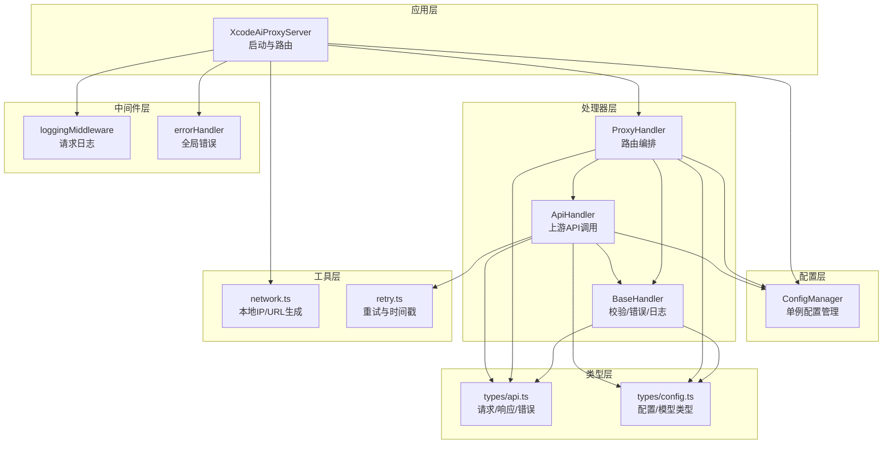
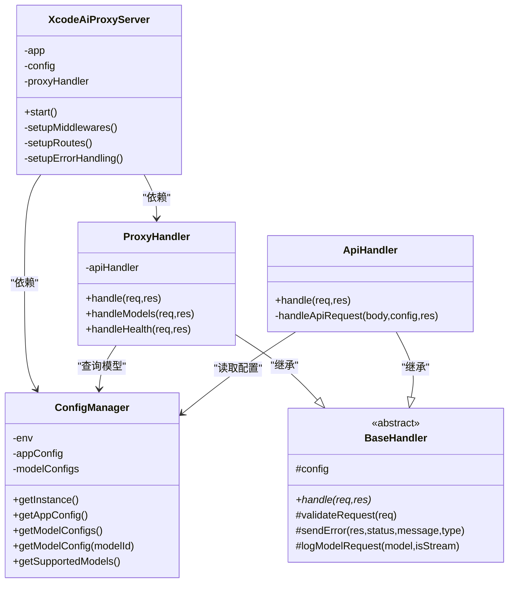

# 组件交互

<cite>
**本文档引用的文件**
- [src/server.ts](file://src/server.ts)
- [src/config/config.ts](file://src/config/config.ts)
- [src/handlers/base.ts](file://src/handlers/base.ts)
- [src/handlers/api.ts](file://src/handlers/api.ts)
- [src/handlers/proxy.ts](file://src/handlers/proxy.ts)
- [src/middlewares/common.ts](file://src/middlewares/common.ts)
- [src/utils/network.ts](file://src/utils/network.ts)
- [src/utils/retry.ts](file://src/utils/retry.ts)
- [src/types/api.ts](file://src/types/api.ts)
- [src/types/config.ts](file://src/types/config.ts)
- [package.json](file://package.json)
</cite>

## 目录
1. [简介](#简介)
2. [项目结构](#项目结构)
3. [核心组件](#核心组件)
4. [架构总览](#架构总览)
5. [详细组件分析](#详细组件分析)
6. [依赖分析](#依赖分析)
7. [性能考量](#性能考量)
8. [故障排查指南](#故障排查指南)
9. [结论](#结论)
10. [附录](#附录)

## 简介
本文件面向 xcode-ai-proxy 的组件交互与运行机制，聚焦于 XcodeAiProxyServer 如何协调 ConfigManager、ProxyHandler 与中间件系统，完成从接收 HTTP 请求到返回响应的完整生命周期。文档同时阐述组件间的依赖注入与控制反转、异步处理与错误传播、状态管理、并发与资源管理、以及性能优化策略，并以序列图展示典型请求处理流程。

## 项目结构
项目采用按职责分层的组织方式：
- 服务器入口与路由：XcodeAiProxyServer 负责初始化 Express 应用、注册中间件、挂载路由与错误处理。
- 配置层：ConfigManager 提供应用配置与模型配置的统一访问。
- 处理器层：BaseHandler 定义通用校验与错误发送逻辑；ProxyHandler 负责路由级的业务编排；ApiHandler 负责具体上游 API 的调用与响应透传。
- 中间件层：loggingMiddleware 记录请求；errorHandler 统一捕获异常并返回标准错误格式。
- 工具层：网络地址解析与重试工具。
- 类型层：统一定义请求/响应与配置的数据结构。



图表来源
- [src/server.ts:1-88](file://src/server.ts#L1-L88)
- [src/config/config.ts:1-123](file://src/config/config.ts#L1-L123)
- [src/handlers/base.ts:1-40](file://src/handlers/base.ts#L1-L40)
- [src/handlers/proxy.ts:1-66](file://src/handlers/proxy.ts#L1-L66)
- [src/handlers/api.ts:1-196](file://src/handlers/api.ts#L1-L196)
- [src/middlewares/common.ts:1-25](file://src/middlewares/common.ts#L1-L25)
- [src/utils/network.ts:1-51](file://src/utils/network.ts#L1-L51)
- [src/utils/retry.ts:1-34](file://src/utils/retry.ts#L1-L34)
- [src/types/api.ts:1-58](file://src/types/api.ts#L1-L58)
- [src/types/config.ts:1-48](file://src/types/config.ts#L1-L48)

章节来源
- [src/server.ts:1-88](file://src/server.ts#L1-L88)
- [package.json:1-30](file://package.json#L1-L30)

## 核心组件
- XcodeAiProxyServer：Express 应用的装配者，负责中间件、路由与错误处理的注册，启动监听并输出启动信息。
- ConfigManager：单例配置管理器，负责环境变量校验、应用配置与模型配置的初始化与查询。
- BaseHandler：抽象基类，提供请求校验、错误发送与日志记录等通用能力。
- ProxyHandler：路由级编排器，负责健康检查、模型列表与聊天补全的入口处理。
- ApiHandler：具体上游 API 处理器，负责构建 OpenAI 兼容请求、调用上游、处理流式/非流式响应与错误。
- loggingMiddleware：请求日志中间件。
- errorHandler：全局错误处理中间件。
- network 工具：本地 IP 解析与服务 URL 生成。
- retry 工具：带指数退避的重试封装。
- 类型定义：统一的请求/响应/错误与配置结构。

章节来源
- [src/server.ts:8-88](file://src/server.ts#L8-L88)
- [src/config/config.ts:7-123](file://src/config/config.ts#L7-L123)
- [src/handlers/base.ts:5-40](file://src/handlers/base.ts#L5-L40)
- [src/handlers/proxy.ts:6-66](file://src/handlers/proxy.ts#L6-L66)
- [src/handlers/api.ts:8-196](file://src/handlers/api.ts#L8-L196)
- [src/middlewares/common.ts:4-25](file://src/middlewares/common.ts#L4-L25)
- [src/utils/network.ts:35-51](file://src/utils/network.ts#L35-L51)
- [src/utils/retry.ts:1-34](file://src/utils/retry.ts#L1-L34)
- [src/types/api.ts:11-58](file://src/types/api.ts#L11-L58)
- [src/types/config.ts:24-48](file://src/types/config.ts#L24-L48)

## 架构总览
XcodeAiProxyServer 作为控制反转容器，持有 ConfigManager 与 ProxyHandler 实例，通过 Express 注册中间件与路由。请求进入后，先经中间件链路，再由 ProxyHandler 进行路由分发，最终由 ApiHandler 调用上游 API 并将响应返回客户端。错误在各层以统一格式传播，保证一致性。

```mermaid
sequenceDiagram
participant C as "客户端"
participant S as "XcodeAiProxyServer"
participant M as "loggingMiddleware"
participant P as "ProxyHandler"
participant A as "ApiHandler"
participant CFG as "ConfigManager"
participant U as "上游AI服务"
C->>S : "HTTP 请求"
S->>M : "进入中间件链"
M->>P : "next()"
P->>P : "validateRequest()"
P->>CFG : "getModelConfig(model)"
CFG-->>P : "返回模型配置"
P->>A : "委托处理"
A->>A : "构建OpenAI兼容请求"
A->>CFG : "读取应用配置(超时/重试)"
CFG-->>A : "返回配置"
A->>U : "POST /chat/completions"
U-->>A : "响应(流式或JSON)"
A-->>P : "透传/转换响应"
P-->>C : "返回响应"
Note over S,M,A : "异常在各层捕获并统一返回"
```

图表来源
- [src/server.ts:23-44](file://src/server.ts#L23-L44)
- [src/handlers/proxy.ts:9-37](file://src/handlers/proxy.ts#L9-L37)
- [src/handlers/api.ts:9-28](file://src/handlers/api.ts#L9-L28)
- [src/config/config.ts:101-115](file://src/config/config.ts#L101-L115)

## 详细组件分析

### XcodeAiProxyServer：应用装配与生命周期
- 职责
  - 初始化 Express 应用与单例 ConfigManager。
  - 注册 CORS、JSON 解析、日志中间件。
  - 挂载健康检查、模型列表与聊天补全路由。
  - 注册全局错误处理中间件。
  - 读取应用配置并启动监听，打印启动信息与可访问 URL 列表。
- 关键点
  - 控制反转：通过构造函数注入 ConfigManager 与 ProxyHandler，避免硬编码依赖。
  - 路由绑定：将 ProxyHandler 的方法绑定到多个兼容路径，提升易用性。
  - 启动日志：结合 network 工具输出多网卡访问地址与模型/重试配置摘要。

章节来源
- [src/server.ts:8-88](file://src/server.ts#L8-L88)
- [src/utils/network.ts:35-51](file://src/utils/network.ts#L35-L51)

### ConfigManager：配置中心与模型注册
- 职责
  - 单例模式确保全局一致的配置访问。
  - 校验至少存在一个 API 密钥，防止无凭据启动。
  - 初始化应用配置（端口、主机、最大重试、重试延迟、请求超时、自定义系统提示）。
  - 初始化模型配置：聚合多家提供商的模型映射，统一暴露给上层查询。
  - 提供查询接口：获取应用配置、模型配置、支持的模型列表与单个模型配置。
- 设计要点
  - 依赖注入：BaseHandler/ApiHandler 通过静态单例访问 ConfigManager，简化调用。
  - 可扩展性：新增模型只需在 Provider 层扩展并合并到 modelConfigs。

章节来源
- [src/config/config.ts:7-123](file://src/config/config.ts#L7-L123)

### BaseHandler：通用能力与契约
- 职责
  - 统一请求校验：要求 model 与 messages 存在且格式正确。
  - 统一错误发送：在未发送响应头时返回标准化错误结构。
  - 日志记录：记录模型与是否流式请求。
- 接口契约
  - 暴露受保护的 config 引用，子类可直接使用。
  - 子类必须实现 handle(req, res)。

章节来源
- [src/handlers/base.ts:5-40](file://src/handlers/base.ts#L5-L40)

### ProxyHandler：路由编排与模型选择
- 职责
  - 路由入口：处理健康检查、模型列表与聊天补全。
  - 编排逻辑：校验请求、查询模型配置、按模型类型分派至对应处理器。
  - 错误处理：对不支持的模型与未知类型进行明确反馈。
- 流程
  - 校验 -> 查询模型配置 -> 若类型为 api 则交由 ApiHandler 处理 -> 捕获异常并返回。

章节来源
- [src/handlers/proxy.ts:6-66](file://src/handlers/proxy.ts#L6-L66)

### ApiHandler：上游 API 调用与响应透传
- 职责
  - 构建 OpenAI 兼容请求：统一字段、替换模型名、注入中文交流指令与自定义系统提示。
  - 调用上游：根据是否流式设置 responseType，按需启用 HTTPS Agent（如 Kimi）。
  - 错误处理：对 4xx/5xx 响应进行解析与透传，支持流式错误读取。
  - 响应透传：流式场景直接 pipe，非流式场景设置跨域响应头并返回 JSON。
  - 重试机制：基于 withRetry 封装，支持指数退避与最大重试次数。
- 关键设计
  - 统一 OpenAI 兼容格式：屏蔽不同提供商差异。
  - 流式支持：透传上游流式响应，保持 SSE 头与连接属性。
  - 自定义提示：在首个系统消息后插入中文指令与用户自定义提示，增强可控性。

章节来源
- [src/handlers/api.ts:8-196](file://src/handlers/api.ts#L8-L196)
- [src/utils/retry.ts:1-34](file://src/utils/retry.ts#L1-L34)

### 中间件系统：日志与错误
- loggingMiddleware
  - 记录请求方法与路径，便于审计与排障。
- errorHandler
  - 捕获同步/异步抛出的异常，若尚未发送响应头则返回统一错误结构。

章节来源
- [src/middlewares/common.ts:4-25](file://src/middlewares/common.ts#L4-L25)

### 类型系统：接口契约与数据结构
- 请求/响应/错误
  - ChatCompletionRequest：统一的聊天补全输入结构。
  - ChatCompletionResponse：统一的聊天补全输出结构。
  - ModelsResponse/ModelInfo：模型列表结构。
  - ErrorResponse：统一错误结构。
- 配置
  - ApiModelConfig：API 类型模型配置（提供商、API 地址、密钥、可选模型名等）。
  - AppConfig：应用运行配置（端口、主机、重试、超时、自定义提示）。
  - EnvConfig：环境变量映射。

章节来源
- [src/types/api.ts:11-58](file://src/types/api.ts#L11-L58)
- [src/types/config.ts:8-48](file://src/types/config.ts#L8-L48)

## 依赖分析
- 组件耦合
  - XcodeAiProxyServer 对 ConfigManager 与 ProxyHandler 的依赖通过构造函数注入，降低紧耦合。
  - ProxyHandler 依赖 BaseHandler 与 ConfigManager，ApiHandler 依赖 BaseHandler 与 ConfigManager。
  - ApiHandler 依赖 axios 与 https（Kimi 场景），并使用 retry 工具。
- 外部依赖
  - Express/CORS/axios/dotenv 等通过 package.json 管理。
- 循环依赖
  - 未发现循环依赖：Server -> Handler -> Config；Handler -> Utils；Middleware 独立。



图表来源
- [src/server.ts:8-21](file://src/server.ts#L8-L21)
- [src/config/config.ts:22-27](file://src/config/config.ts#L22-L27)
- [src/handlers/base.ts:5-8](file://src/handlers/base.ts#L5-L8)
- [src/handlers/proxy.ts:6-7](file://src/handlers/proxy.ts#L6-L7)
- [src/handlers/api.ts:8](file://src/handlers/api.ts#L8)

章节来源
- [src/server.ts:8-21](file://src/server.ts#L8-L21)
- [src/config/config.ts:22-27](file://src/config/config.ts#L22-L27)
- [src/handlers/base.ts:5-8](file://src/handlers/base.ts#L5-L8)
- [src/handlers/proxy.ts:6-7](file://src/handlers/proxy.ts#L6-L7)
- [src/handlers/api.ts:8](file://src/handlers/api.ts#L8)

## 性能考量
- 异步与并发
  - 所有网络操作均为异步，ApiHandler 使用 Promise/async 与 axios 流式传输，避免阻塞主线程。
- 资源管理
  - 对特定提供商启用 HTTPS Agent 以复用连接，减少握手开销。
  - 流式响应直接 pipe，避免额外内存拷贝。
- 超时与重试
  - 应用配置中设置 requestTimeout，避免长时间占用连接。
  - withRetry 提供指数退避，降低上游压力与抖动影响。
- 内存与体积
  - Express JSON 解析限制为 50MB，避免异常请求导致内存膨胀。
  - 流式场景下仅透传数据，不缓存整个响应体。
- 可观测性
  - loggingMiddleware 与启动日志输出关键指标，便于定位性能瓶颈。

章节来源
- [src/server.ts:23-27](file://src/server.ts#L23-L27)
- [src/handlers/api.ts:35-121](file://src/handlers/api.ts#L35-L121)
- [src/utils/retry.ts:1-34](file://src/utils/retry.ts#L1-L34)

## 故障排查指南
- 常见错误类型
  - 请求参数缺失：BaseHandler 校验失败，返回 invalid_request_error。
  - 不支持的模型：ProxyHandler 查询不到模型配置，返回 invalid_request_error。
  - 上游 API 错误：ApiHandler 捕获 4xx/5xx 并解析错误内容，抛出 api_error。
  - 服务器内部错误：loggingMiddleware 之后的 errorHandler 捕获异常，返回 server_error。
- 排查步骤
  - 查看启动日志中的模型与重试配置摘要，确认配置加载正确。
  - 检查请求路径是否命中任一兼容路由。
  - 观察 ApiHandler 的请求体与上游 URL 输出，确认模型映射与消息注入是否符合预期。
  - 对流式场景，确认客户端正确处理 SSE 头与连接。
- 重试与超时
  - 调整 MAX_RETRIES 与 RETRY_DELAY 以平衡稳定性与延迟。
  - 调整 REQUEST_TIMEOUT 以适配慢响应上游。

章节来源
- [src/handlers/base.ts:24-34](file://src/handlers/base.ts#L24-L34)
- [src/handlers/proxy.ts:14-31](file://src/handlers/proxy.ts#L14-L31)
- [src/handlers/api.ts:124-164](file://src/handlers/api.ts#L124-L164)
- [src/middlewares/common.ts:9-25](file://src/middlewares/common.ts#L9-L25)

## 结论
该系统通过清晰的分层与依赖注入，实现了配置、路由与处理器的低耦合协作。XcodeAiProxyServer 作为装配者，将中间件、路由与处理器有机整合；ConfigManager 提供集中配置；BaseHandler 抽象出通用能力；ProxyHandler 与 ApiHandler 分别承担编排与执行职责。配合统一的错误处理、流式透传与指数退避重试，系统在易用性、可观测性与稳定性方面达到良好平衡。

## 附录
- 典型请求处理序列图（再次呈现）

```mermaid
sequenceDiagram
participant C as "客户端"
participant S as "XcodeAiProxyServer"
participant M as "loggingMiddleware"
participant P as "ProxyHandler"
participant A as "ApiHandler"
participant CFG as "ConfigManager"
participant U as "上游AI服务"
C->>S : "POST /v1/chat/completions"
S->>M : "进入中间件链"
M->>P : "next()"
P->>P : "validateRequest()"
P->>CFG : "getModelConfig(model)"
CFG-->>P : "返回模型配置"
P->>A : "委托处理"
A->>A : "构建OpenAI兼容请求"
A->>CFG : "读取应用配置(超时/重试)"
CFG-->>A : "返回配置"
A->>U : "POST /chat/completions"
U-->>A : "响应(流式或JSON)"
A-->>P : "透传/转换响应"
P-->>C : "返回响应"
Note over S,M,A : "异常在各层捕获并统一返回"
```

图表来源
- [src/server.ts:29-40](file://src/server.ts#L29-L40)
- [src/handlers/proxy.ts:9-37](file://src/handlers/proxy.ts#L9-L37)
- [src/handlers/api.ts:9-28](file://src/handlers/api.ts#L9-L28)
- [src/config/config.ts:101-115](file://src/config/config.ts#L101-L115)