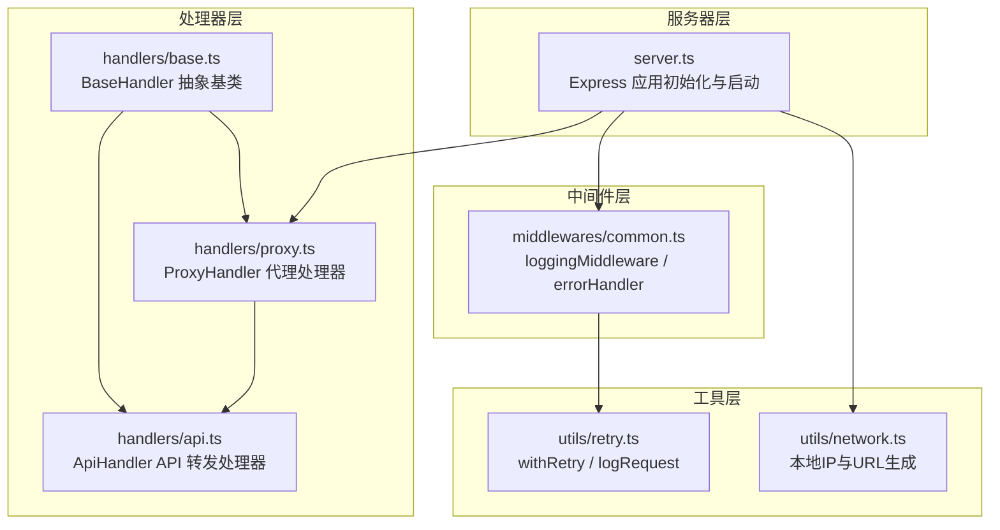
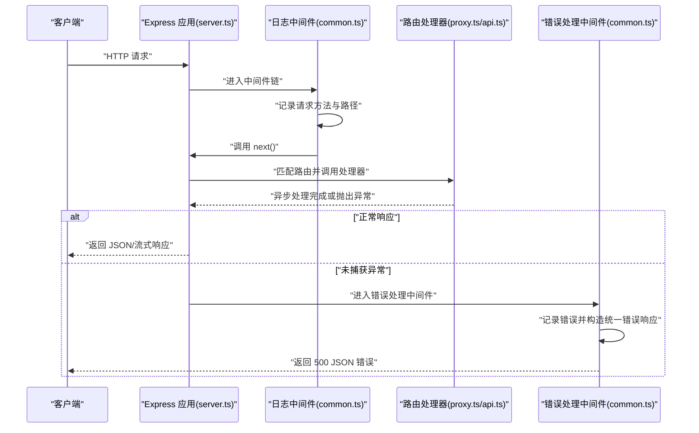
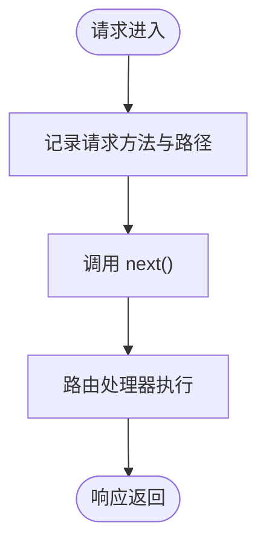
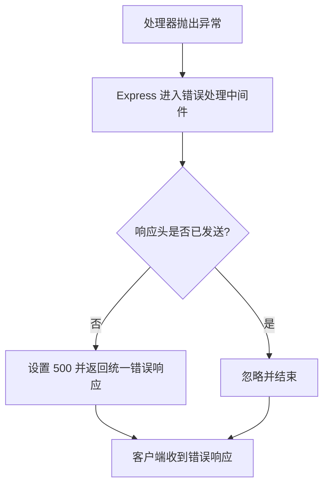
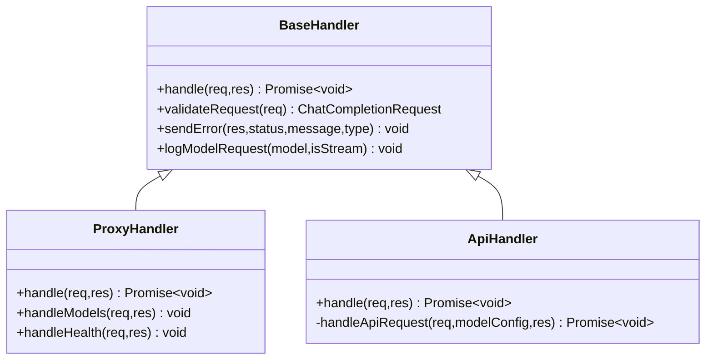
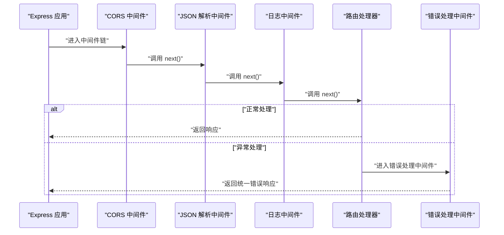
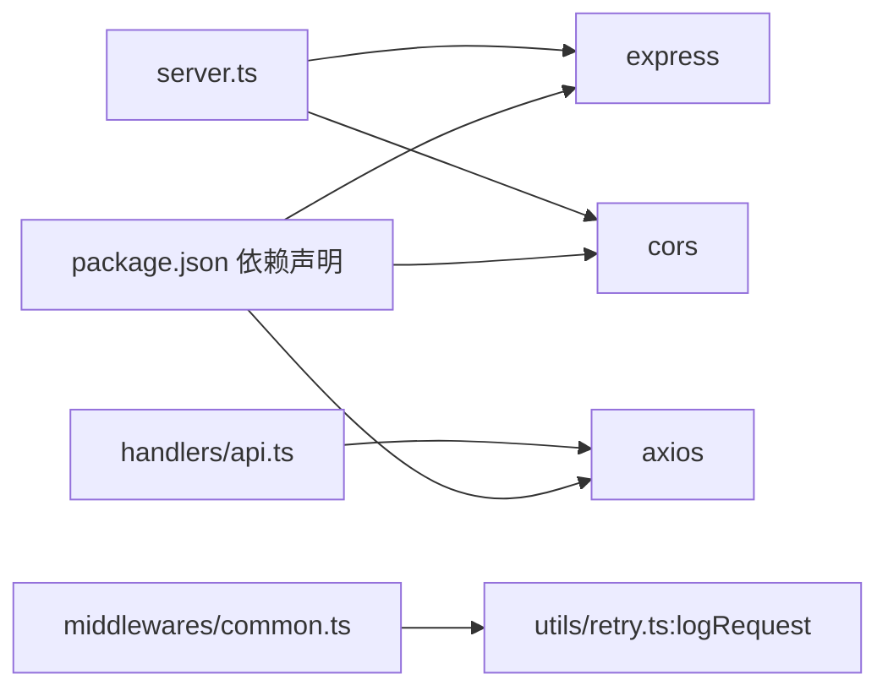

# 中间件模式

<cite>
**本文档引用的文件**
- [src/middlewares/index.ts](file://src/middlewares/index.ts)
- [src/middlewares/common.ts](file://src/middlewares/common.ts)
- [src/server.ts](file://src/server.ts)
- [src/handlers/base.ts](file://src/handlers/base.ts)
- [src/handlers/proxy.ts](file://src/handlers/proxy.ts)
- [src/handlers/api.ts](file://src/handlers/api.ts)
- [src/utils/retry.ts](file://src/utils/retry.ts)
- [src/utils/network.ts](file://src/utils/network.ts)
- [package.json](file://package.json)
</cite>

## 目录
1. [简介](#简介)
2. [项目结构](#项目结构)
3. [核心组件](#核心组件)
4. [架构总览](#架构总览)
5. [详细组件分析](#详细组件分析)
6. [依赖关系分析](#依赖关系分析)
7. [性能考量](#性能考量)
8. [故障排查指南](#故障排查指南)
9. [结论](#结论)
10. [附录](#附录)

## 简介
本文件围绕 xcode-ai-proxy 的 Express.js 中间件模式展开，重点解析日志中间件与错误处理中间件的实现与协作方式。文档从执行顺序、请求/响应管道、错误传播机制入手，结合具体代码路径示例，阐述中间件在横切关注点模块化中的优势（关注点分离、可复用性、可测试性），并总结设计原则与最佳实践（中间件链组织、性能与调试）。

## 项目结构
该项目采用分层与职责分离的组织方式：
- 服务器入口负责中间件注册、路由挂载与错误处理注册
- 中间件层提供通用横切能力（日志、错误处理）
- 处理器层封装业务逻辑（代理、API转发、健康检查、模型列表）
- 工具层提供网络与重试等通用能力

图表来源
- [src/server.ts:23-44](file://src/server.ts#L23-L44)
- [src/middlewares/common.ts:4-25](file://src/middlewares/common.ts#L4-L25)
- [src/handlers/base.ts:5-40](file://src/handlers/base.ts#L5-L40)
- [src/handlers/proxy.ts:6-66](file://src/handlers/proxy.ts#L6-L66)
- [src/handlers/api.ts:8-196](file://src/handlers/api.ts#L8-L196)
- [src/utils/retry.ts:1-34](file://src/utils/retry.ts#L1-L34)
- [src/utils/network.ts:1-51](file://src/utils/network.ts#L1-L51)

章节来源
- [src/server.ts:1-88](file://src/server.ts#L1-L88)
- [src/middlewares/index.ts:1-1](file://src/middlewares/index.ts#L1-L1)
- [src/middlewares/common.ts:1-25](file://src/middlewares/common.ts#L1-L25)
- [src/handlers/base.ts:1-40](file://src/handlers/base.ts#L1-L40)
- [src/handlers/proxy.ts:1-66](file://src/handlers/proxy.ts#L1-L66)
- [src/handlers/api.ts:1-196](file://src/handlers/api.ts#L1-L196)
- [src/utils/retry.ts:1-34](file://src/utils/retry.ts#L1-L34)
- [src/utils/network.ts:1-51](file://src/utils/network.ts#L1-L51)

## 核心组件
- 日志中间件 loggingMiddleware
  - 职责：记录每个请求的方法与路径，调用工具函数输出时间戳与请求信息
  - 关键点：调用 next() 将控制权交给下一个中间件或路由处理器
  - 代码路径：[src/middlewares/common.ts:4-7](file://src/middlewares/common.ts#L4-L7)
- 错误处理中间件 errorHandler
  - 职责：捕获未处理异常，确保响应头未发送时返回统一的 JSON 错误结构
  - 关键点：仅在 res.headersSent 为 false 时写入响应，避免重复写入
  - 代码路径：[src/middlewares/common.ts:9-25](file://src/middlewares/common.ts#L9-L25)
- 服务器初始化与中间件注册
  - 职责：注册 CORS、JSON 解析、日志中间件；挂载路由；注册全局错误处理中间件
  - 代码路径：[src/server.ts:23-44](file://src/server.ts#L23-L44)

章节来源
- [src/middlewares/common.ts:1-25](file://src/middlewares/common.ts#L1-L25)
- [src/server.ts:23-44](file://src/server.ts#L23-L44)

## 架构总览
下图展示了请求从进入服务器到最终响应的完整流程，以及中间件与处理器之间的交互关系。

图表来源
- [src/server.ts:23-44](file://src/server.ts#L23-L44)
- [src/middlewares/common.ts:4-25](file://src/middlewares/common.ts#L4-L25)
- [src/handlers/proxy.ts:9-37](file://src/handlers/proxy.ts#L9-L37)
- [src/handlers/api.ts:9-28](file://src/handlers/api.ts#L9-L28)

## 详细组件分析

### 日志中间件 loggingMiddleware
- 实现要点
  - 接收请求对象、响应对象与 next 函数
  - 使用工具函数输出请求方法与路径
  - 调用 next() 将控制权传递给下一个中间件或路由处理器
- 执行顺序
  - 在服务器初始化中注册，位于 CORS、JSON 解析之后，路由之前
  - 因此所有进入服务器的请求都会先经过日志中间件
- 代码路径
  - [src/middlewares/common.ts:4-7](file://src/middlewares/common.ts#L4-L7)
  - [src/server.ts:23-27](file://src/server.ts#L23-L27)

图表来源
- [src/middlewares/common.ts:4-7](file://src/middlewares/common.ts#L4-L7)
- [src/server.ts:23-27](file://src/server.ts#L23-L27)

章节来源
- [src/middlewares/common.ts:1-25](file://src/middlewares/common.ts#L1-L25)
- [src/server.ts:23-27](file://src/server.ts#L23-L27)

### 错误处理中间件 errorHandler
- 实现要点
  - 作为最后一个中间件注册，接收四个参数（err、req、res、next）
  - 仅在响应头未发送时写入 500 错误响应，保证幂等性
  - 输出统一的错误结构，包含 message 与 type 字段
- 错误传播机制
  - 当路由处理器或后续中间件抛出异常时，Express 会跳过常规处理流程，直接进入错误处理中间件
  - 若错误处理中间件仍未能处理，将保持默认 500 响应
- 代码路径
  - [src/middlewares/common.ts:9-25](file://src/middlewares/common.ts#L9-L25)
  - [src/server.ts:42-44](file://src/server.ts#L42-L44)

图表来源
- [src/middlewares/common.ts:9-25](file://src/middlewares/common.ts#L9-L25)
- [src/server.ts:42-44](file://src/server.ts#L42-L44)

章节来源
- [src/middlewares/common.ts:1-25](file://src/middlewares/common.ts#L1-L25)
- [src/server.ts:42-44](file://src/server.ts#L42-L44)

### 代理处理器与 API 处理器
- 代理处理器 ProxyHandler
  - 校验请求参数，查找模型配置，根据模型类型选择对应处理器
  - 对于 API 类型模型，委托 ApiHandler 处理
  - 捕获异常并调用基类错误发送方法
  - 代码路径：[src/handlers/proxy.ts:6-37](file://src/handlers/proxy.ts#L6-L37)
- API 处理器 ApiHandler
  - 继承 BaseHandler，进行请求体校验与模型日志记录
  - 构造 OpenAI 兼容请求，按需启用流式响应
  - 使用重试工具 withRetry 执行请求，处理 4xx/5xx 并抛出错误
  - 透传流式响应或返回 JSON 响应
  - 代码路径：[src/handlers/api.ts:8-196](file://src/handlers/api.ts#L8-L196)

图表来源
- [src/handlers/base.ts:5-40](file://src/handlers/base.ts#L5-L40)
- [src/handlers/proxy.ts:6-66](file://src/handlers/proxy.ts#L6-L66)
- [src/handlers/api.ts:8-196](file://src/handlers/api.ts#L8-L196)

章节来源
- [src/handlers/base.ts:1-40](file://src/handlers/base.ts#L1-L40)
- [src/handlers/proxy.ts:1-66](file://src/handlers/proxy.ts#L1-L66)
- [src/handlers/api.ts:1-196](file://src/handlers/api.ts#L1-L196)

### 请求/响应管道与执行顺序
- 中间件注册顺序
  - CORS -> JSON 解析 -> 日志中间件 -> 路由处理器 -> 错误处理中间件
- 执行顺序与控制流
  - 正常请求：日志中间件记录后调用 next()，进入路由处理器；成功返回或抛出异常
  - 异常请求：路由处理器或后续逻辑抛出异常，Express 跳过常规处理，进入错误处理中间件
- 代码路径
  - [src/server.ts:23-44](file://src/server.ts#L23-L44)

图表来源
- [src/server.ts:23-44](file://src/server.ts#L23-L44)
- [src/middlewares/common.ts:4-25](file://src/middlewares/common.ts#L4-L25)

章节来源
- [src/server.ts:23-44](file://src/server.ts#L23-L44)

## 依赖关系分析
- Express 依赖
  - 服务器使用 Express 应用实例，注册中间件与路由
  - 代码路径：[src/server.ts:1-88](file://src/server.ts#L1-L88)
- CORS 依赖
  - 用于跨域支持，提升前端访问便利性
  - 代码路径：[src/server.ts:24](file://src/server.ts#L24)
- Axios 与 HTTPS
  - ApiHandler 使用 Axios 发起外部 API 请求，并针对特定提供商配置 HTTPS Agent
  - 代码路径：[src/handlers/api.ts:2-6](file://src/handlers/api.ts#L2-L6)
- 重试与日志工具
  - withRetry 提供指数退避重试；logRequest 提供统一日志格式
  - 代码路径：[src/utils/retry.ts:1-34](file://src/utils/retry.ts#L1-L34)

图表来源
- [package.json:14-28](file://package.json#L14-L28)
- [src/server.ts:1-88](file://src/server.ts#L1-L88)
- [src/handlers/api.ts:1-196](file://src/handlers/api.ts#L1-L196)
- [src/middlewares/common.ts:1-25](file://src/middlewares/common.ts#L1-L25)
- [src/utils/retry.ts:31-34](file://src/utils/retry.ts#L31-L34)

章节来源
- [package.json:1-30](file://package.json#L1-L30)
- [src/server.ts:1-88](file://src/server.ts#L1-L88)
- [src/handlers/api.ts:1-196](file://src/handlers/api.ts#L1-L196)
- [src/middlewares/common.ts:1-25](file://src/middlewares/common.ts#L1-L25)
- [src/utils/retry.ts:1-34](file://src/utils/retry.ts#L1-L34)

## 性能考量
- 中间件链长度与顺序
  - 日志中间件无阻塞，但过多中间件会增加调用开销；建议按需注册
- 流式响应
  - ApiHandler 在流式场景下直接透传响应流，减少内存占用与拷贝
  - 代码路径：[src/handlers/api.ts:176-183](file://src/handlers/api.ts#L176-L183)
- 重试策略
  - withRetry 提供最大重试次数与递增延迟，降低瞬时故障影响
  - 代码路径：[src/utils/retry.ts:1-26](file://src/utils/retry.ts#L1-L26)
- JSON 解析大小限制
  - 服务器对 JSON 请求体设置了较大上限，满足多模态场景需求
  - 代码路径：[src/server.ts:25](file://src/server.ts#L25)

章节来源
- [src/handlers/api.ts:176-183](file://src/handlers/api.ts#L176-L183)
- [src/utils/retry.ts:1-26](file://src/utils/retry.ts#L1-L26)
- [src/server.ts:25](file://src/server.ts#L25)

## 故障排查指南
- 如何定位请求未到达处理器
  - 检查日志中间件是否被正确注册与执行
  - 代码路径：[src/server.ts:23-27](file://src/server.ts#L23-L27)，[src/middlewares/common.ts:4-7](file://src/middlewares/common.ts#L4-L7)
- 如何确认错误被统一处理
  - 确认错误处理中间件注册位置在路由之后
  - 代码路径：[src/server.ts:42-44](file://src/server.ts#L42-L44)，[src/middlewares/common.ts:9-25](file://src/middlewares/common.ts#L9-L25)
- 如何验证流式响应透传
  - 查看 ApiHandler 的流式响应头设置与 pipe 行为
  - 代码路径：[src/handlers/api.ts:176-183](file://src/handlers/api.ts#L176-L183)
- 如何查看重试行为
  - 观察 withRetry 的日志输出与延迟计算
  - 代码路径：[src/utils/retry.ts:1-26](file://src/utils/retry.ts#L1-L26)

章节来源
- [src/server.ts:23-27](file://src/server.ts#L23-L27)
- [src/middlewares/common.ts:4-25](file://src/middlewares/common.ts#L4-L25)
- [src/handlers/api.ts:176-183](file://src/handlers/api.ts#L176-L183)
- [src/utils/retry.ts:1-26](file://src/utils/retry.ts#L1-L26)

## 结论
本项目以简洁而清晰的方式实现了 Express 中间件模式：日志中间件负责横切关注点的日志记录，错误处理中间件统一兜底异常，二者与路由处理器协同工作，形成稳定的请求/响应管道。该模式具备良好的关注点分离、可复用性与可测试性，适合在复杂业务场景中扩展更多中间件与处理器。

## 附录
- 设计原则与最佳实践
  - 中间件链组织：将无副作用的中间件（如日志、CORS）置于前部，将可能抛错的中间件（如鉴权、限流）放在路由之前，确保错误能被全局错误处理中间件捕获
  - next() 使用：确保每个中间件在合适时机调用 next()，避免遗漏导致请求挂起
  - 错误处理策略：统一错误响应结构，避免重复写入响应头，必要时在处理器内提前返回
  - 性能与调试：减少中间件数量与复杂度，利用流式响应与重试策略提升稳定性，配合日志中间件与工具函数进行问题定位