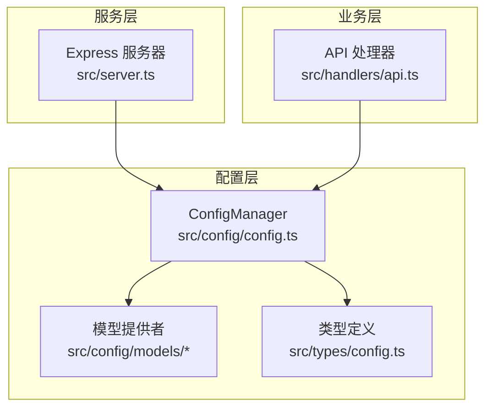
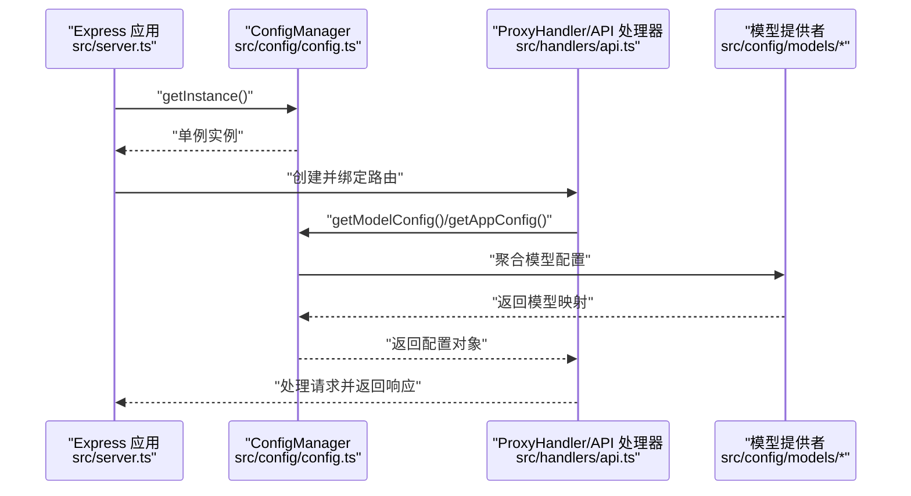
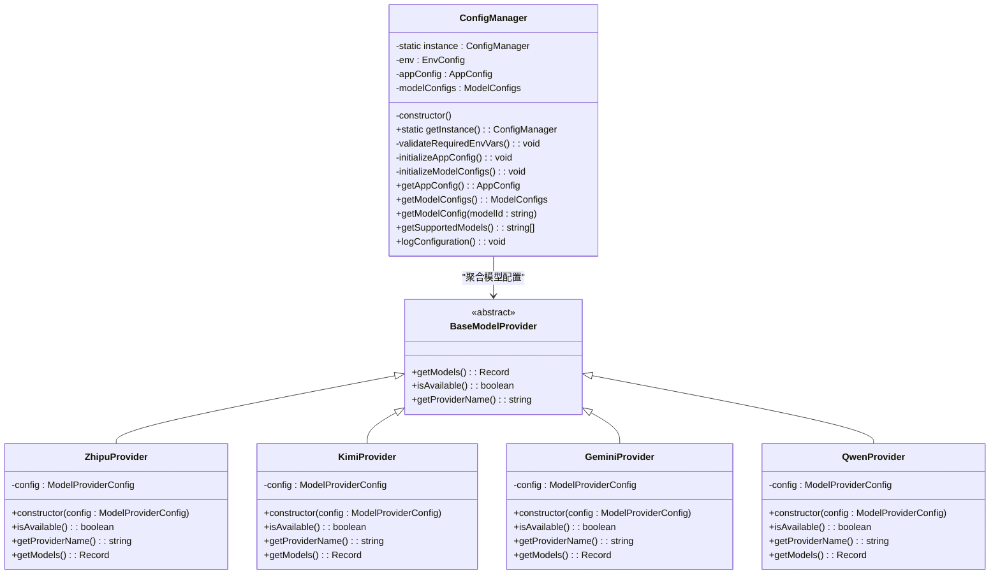
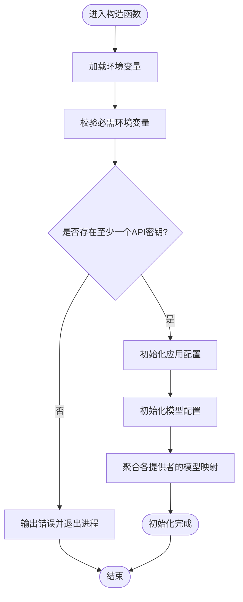
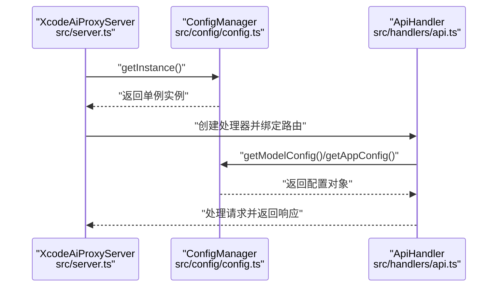
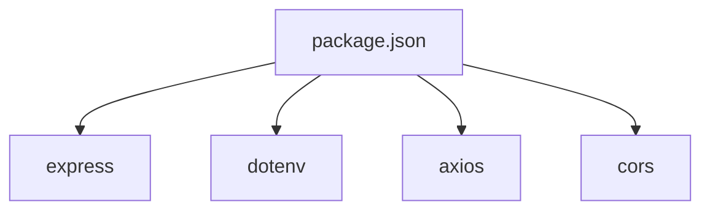

# 单例模式

<cite>
**本文引用的文件**
- [src/config/config.ts](file://src/config/config.ts)
- [src/config/index.ts](file://src/config/index.ts)
- [src/config/models/base.ts](file://src/config/models/base.ts)
- [src/config/models/gemini.ts](file://src/config/models/gemini.ts)
- [src/config/models/zhipu.ts](file://src/config/models/zhipu.ts)
- [src/config/models/kimi.ts](file://src/config/models/kimi.ts)
- [src/config/models/qwen.ts](file://src/config/models/qwen.ts)
- [src/types/config.ts](file://src/types/config.ts)
- [src/server.ts](file://src/server.ts)
- [src/handlers/api.ts](file://src/handlers/api.ts)
- [package.json](file://package.json)
</cite>

## 目录
1. [简介](#简介)
2. [项目结构](#项目结构)
3. [核心组件](#核心组件)
4. [架构总览](#架构总览)
5. [详细组件分析](#详细组件分析)
6. [依赖分析](#依赖分析)
7. [性能考量](#性能考量)
8. [故障排查指南](#故障排查指南)
9. [结论](#结论)

## 简介
本文件围绕 xcode-ai-proxy 中的 ConfigManager 类展开，系统性阐述其单例模式实现与在配置管理中的应用。我们将从实现原理、线程安全、全局访问点、状态一致性、内存效率等角度进行解析，并结合实际代码路径给出图示与最佳实践建议，帮助读者在 Express.js 应用中正确使用单例模式管理全局配置。

## 项目结构
该工程采用按功能分层的组织方式：
- 配置层：集中于 src/config，包含 ConfigManager、各模型提供商适配器与类型定义
- 业务层：src/handlers 提供 API 处理逻辑
- 服务层：src/server.ts 负责 Express 应用初始化与路由注册
- 类型层：src/types 定义配置与模型接口
- 依赖声明：package.json 明确运行时依赖

图表来源
- [src/config/config.ts:1-123](file://src/config/config.ts#L1-L123)
- [src/config/models/base.ts:1-13](file://src/config/models/base.ts#L1-L13)
- [src/types/config.ts:1-48](file://src/types/config.ts#L1-L48)
- [src/server.ts:1-88](file://src/server.ts#L1-L88)
- [src/handlers/api.ts:1-196](file://src/handlers/api.ts#L1-L196)

章节来源
- [src/config/config.ts:1-123](file://src/config/config.ts#L1-L123)
- [src/server.ts:1-88](file://src/server.ts#L1-L88)
- [package.json:1-30](file://package.json#L1-L30)

## 核心组件
- ConfigManager：全局配置管理器，负责加载环境变量、校验必要参数、初始化应用配置与模型配置，并提供统一的查询接口
- 模型提供者：ZhipuProvider、KimiProvider、GeminiProvider、QwenProvider，均继承 BaseModelProvider 抽象类，用于生成对应模型的配置映射
- 类型系统：AppConfig、ModelConfigs、ApiModelConfig、EnvConfig 等，确保配置结构的强类型约束

章节来源
- [src/config/config.ts:7-123](file://src/config/config.ts#L7-L123)
- [src/config/models/base.ts:3-13](file://src/config/models/base.ts#L3-L13)
- [src/types/config.ts:1-48](file://src/types/config.ts#L1-L48)

## 架构总览
ConfigManager 作为单例，在应用启动阶段被注入到服务器与处理器中，形成全局唯一的配置中心。下图展示了关键组件之间的交互关系与调用链。

图表来源
- [src/server.ts:13-21](file://src/server.ts#L13-L21)
- [src/config/config.ts:22-27](file://src/config/config.ts#L22-L27)
- [src/handlers/api.ts:16-22](file://src/handlers/api.ts#L16-L22)
- [src/config/models/zhipu.ts:20-33](file://src/config/models/zhipu.ts#L20-L33)
- [src/config/models/kimi.ts:20-33](file://src/config/models/kimi.ts#L20-L33)
- [src/config/models/gemini.ts:20-33](file://src/config/models/gemini.ts#L20-L33)
- [src/config/models/qwen.ts:20-33](file://src/config/models/qwen.ts#L20-L33)

## 详细组件分析

### ConfigManager 单例实现
ConfigManager 通过以下机制实现单例：
- 私有静态字段保存唯一实例
- 私有构造函数防止外部直接实例化
- 静态工厂方法 getInstance() 在首次调用时创建实例并缓存，后续调用直接返回同一实例
- 初始化流程在构造函数内完成，包括环境变量校验、应用配置与模型配置的构建

图表来源
- [src/config/config.ts:7-123](file://src/config/config.ts#L7-L123)
- [src/config/models/base.ts:3-13](file://src/config/models/base.ts#L3-L13)
- [src/config/models/zhipu.ts:4-34](file://src/config/models/zhipu.ts#L4-L34)
- [src/config/models/kimi.ts:4-34](file://src/config/models/kimi.ts#L4-L34)
- [src/config/models/gemini.ts:4-34](file://src/config/models/gemini.ts#L4-L34)
- [src/config/models/qwen.ts:4-35](file://src/config/models/qwen.ts#L4-L35)

章节来源
- [src/config/config.ts:7-27](file://src/config/config.ts#L7-L27)
- [src/config/config.ts:29-51](file://src/config/config.ts#L29-L51)
- [src/config/config.ts:53-99](file://src/config/config.ts#L53-L99)

### 单例模式实现要点与线程安全
- 实现原理
  - 私有静态字段保存唯一实例，避免外部直接 new
  - getInstance() 使用惰性初始化，仅在首次调用时创建实例
  - 构造函数内完成一次性初始化，确保配置状态在进程生命周期内稳定
- 线程安全
  - 在 Node.js 单线程事件循环模型下，JavaScript 对象的读写具有原子性，因此无需额外加锁
  - 若未来扩展到多进程或多线程场景，可在 getInstance() 中引入互斥锁或使用进程级同步原语
- 全局访问点与状态一致性
  - 通过静态工厂方法提供全局唯一访问点，避免重复创建带来的状态漂移
  - 初始化完成后，配置对象不可变（或仅通过受控接口修改），保证全局一致性

章节来源
- [src/config/config.ts:22-27](file://src/config/config.ts#L22-L27)
- [src/config/config.ts:13-20](file://src/config/config.ts#L13-L20)

### 配置状态管理与初始化流程
- 环境变量校验：要求至少存在一个 API 密钥，否则终止进程
- 应用配置：从环境变量读取端口、主机、重试次数、重试延迟、请求超时与自定义系统提示
- 模型配置：遍历各模型提供者，合并其返回的模型映射到统一字典
- 查询接口：提供按模型 ID 获取配置、列出支持模型、打印配置等能力

图表来源
- [src/config/config.ts:13-20](file://src/config/config.ts#L13-L20)
- [src/config/config.ts:29-51](file://src/config/config.ts#L29-L51)
- [src/config/config.ts:53-99](file://src/config/config.ts#L53-L99)

章节来源
- [src/config/config.ts:29-51](file://src/config/config.ts#L29-L51)
- [src/config/config.ts:53-99](file://src/config/config.ts#L53-L99)

### 在 Express.js 应用中的使用
- 服务器启动：XcodeAiProxyServer 在构造函数中通过 ConfigManager.getInstance() 获取全局配置实例，并将其注入到路由处理器中
- 处理器使用：ApiHandler 通过 ConfigManager 查询模型配置与应用配置，用于请求转发、流式响应与错误处理
- 优势体现
  - 内存效率：全局仅一份配置对象，避免重复加载与拷贝
  - 全局访问点：各模块无需自行加载配置，降低耦合
  - 状态一致性：配置在进程启动时冻结，避免并发修改导致的竞态

图表来源
- [src/server.ts:13-21](file://src/server.ts#L13-L21)
- [src/handlers/api.ts:16-22](file://src/handlers/api.ts#L16-L22)
- [src/config/config.ts:22-27](file://src/config/config.ts#L22-L27)

章节来源
- [src/server.ts:13-21](file://src/server.ts#L13-L21)
- [src/handlers/api.ts:16-22](file://src/handlers/api.ts#L16-L22)

### 单例模式的优势与适用性
- 优势
  - 内存效率：避免重复创建配置对象
  - 全局访问点：简化跨模块配置访问
  - 状态一致性：确保配置在进程生命周期内一致
- 适用性
  - 在 Express.js 单线程模型下，单例模式非常合适
  - 适合配置只读或受控更新的场景
- 与“全局变量”的区别
  - 单例通过受控的工厂方法获取实例，具备封装性与可测试性；而全局变量缺乏命名空间与生命周期管理

章节来源
- [src/config/config.ts:22-27](file://src/config/config.ts#L22-L27)
- [src/server.ts:13-21](file://src/server.ts#L13-L21)

### 最佳实践与潜在陷阱
- 最佳实践
  - 将初始化逻辑集中在构造函数中，确保幂等性
  - 使用静态工厂方法 getInstance() 统一获取实例
  - 对外暴露只读访问接口，避免内部状态被意外修改
  - 在开发与测试环境中可通过依赖注入替换单例实例，提升可测试性
- 潜在陷阱
  - 过度依赖单例：可能导致模块间隐式耦合
  - 可变状态：若配置需要热更新，需设计受控变更策略
  - 测试隔离：单例可能影响单元测试的独立性，应提供重置或替换机制
  - 多进程场景：单例仅在当前进程内生效，跨进程需另行处理

章节来源
- [src/config/config.ts:13-20](file://src/config/config.ts#L13-L20)
- [src/config/config.ts:101-115](file://src/config/config.ts#L101-L115)

## 依赖分析
- 运行时依赖
  - express：Web 服务器框架
  - dotenv：加载 .env 文件至 process.env
  - axios：HTTP 客户端
  - cors：跨域中间件
- 开发时依赖
  - @types/*：类型定义
  - nodemon/ts-node：开发热重载
  - typescript：编译工具链

图表来源
- [package.json:14-28](file://package.json#L14-L28)

章节来源
- [package.json:14-28](file://package.json#L14-L28)

## 性能考量
- 初始化成本：ConfigManager 的构造函数在进程启动时执行一次，包含环境变量读取与模型配置聚合，属于冷启动开销
- 访问成本：getInstance() 为 O(1)，后续访问直接返回缓存实例
- 内存占用：全局仅维护一份配置对象，避免重复分配
- 并发安全：Node.js 单线程模型下无锁竞争；若扩展到多线程，需考虑同步策略

章节来源
- [src/config/config.ts:13-20](file://src/config/config.ts#L13-L20)
- [src/config/config.ts:22-27](file://src/config/config.ts#L22-L27)

## 故障排查指南
- 启动失败：当未配置任何 API 密钥时，校验逻辑会输出错误并终止进程
- 配置不生效：确认 .env 文件路径与键名正确，且已在启动前调用 dotenv.config()
- 模型不可用：检查对应 Provider 的可用性判断逻辑与 API Key 是否有效
- 日志定位：使用 ConfigManager.logConfiguration() 输出已加载模型列表，辅助排查

章节来源
- [src/config/config.ts:29-51](file://src/config/config.ts#L29-L51)
- [src/config/config.ts:117-122](file://src/config/config.ts#L117-L122)

## 结论
ConfigManager 通过经典的单例模式实现了全局配置的唯一性与一致性，结合 Express.js 的单线程特性，提供了高效、稳定的配置管理方案。在保持内存效率与全局访问点的同时，应遵循受控更新与可测试性的最佳实践，避免过度耦合与隐式依赖，确保系统长期可维护性。