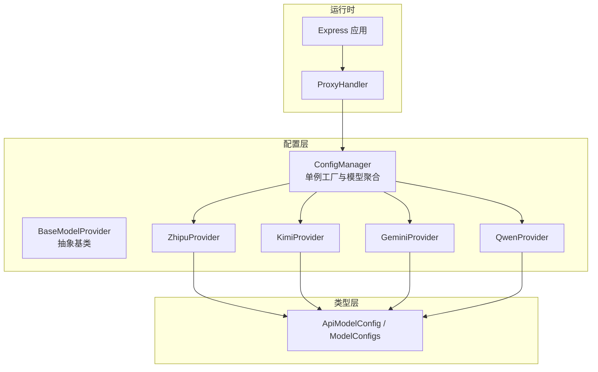
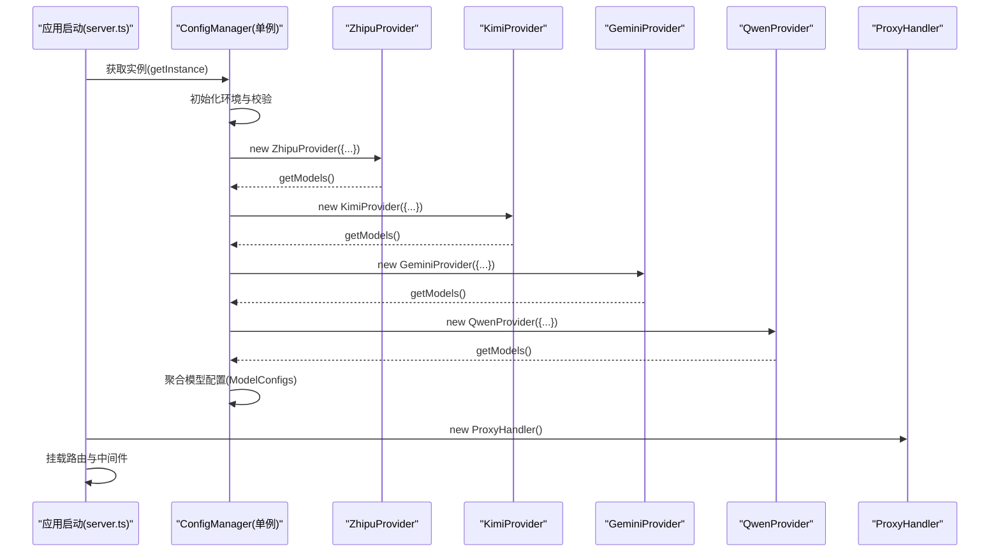
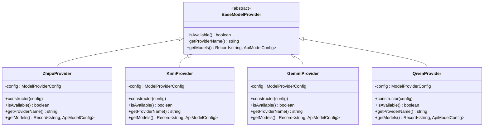
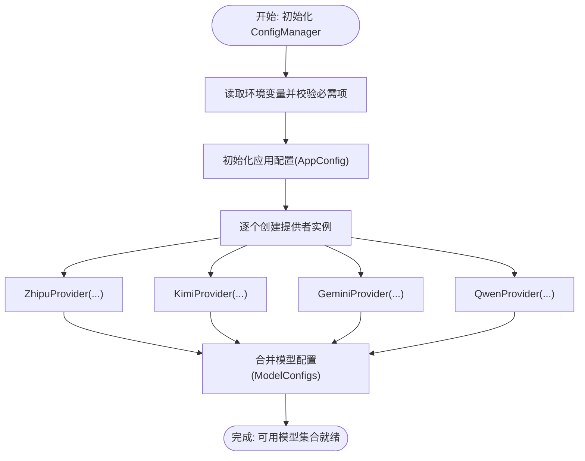
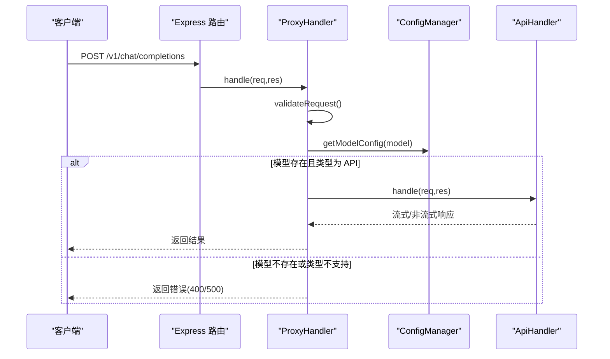
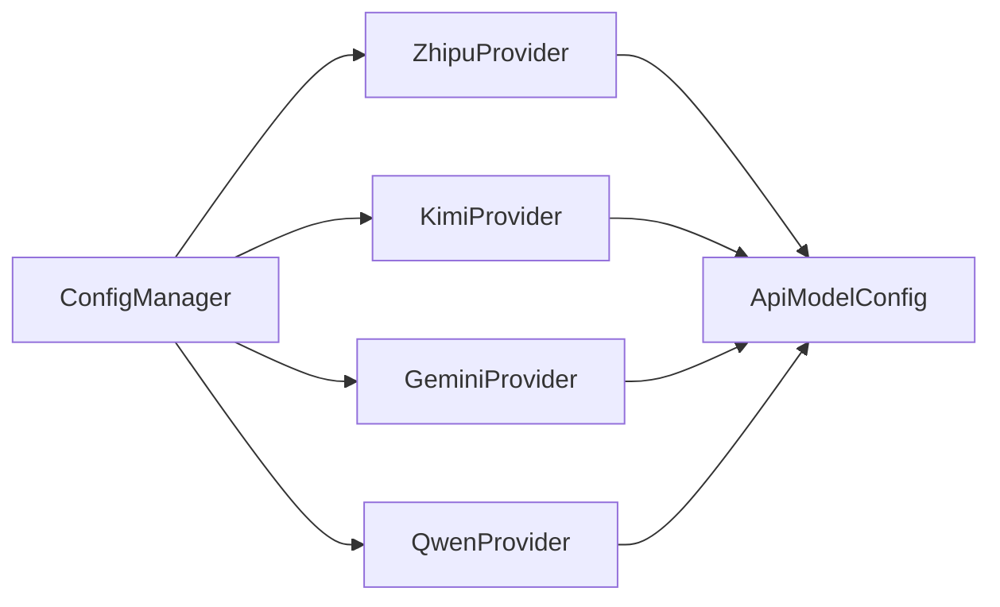

# 工厂模式

<cite>
**本文引用的文件**
- [src/config/models/base.ts](file://src/config/models/base.ts)
- [src/config/models/index.ts](file://src/config/models/index.ts)
- [src/config/models/zhipu.ts](file://src/config/models/zhipu.ts)
- [src/config/models/kimi.ts](file://src/config/models/kimi.ts)
- [src/config/models/gemini.ts](file://src/config/models/gemini.ts)
- [src/config/models/qwen.ts](file://src/config/models/qwen.ts)
- [src/config/config.ts](file://src/config/config.ts)
- [src/types/config.ts](file://src/types/config.ts)
- [src/server.ts](file://src/server.ts)
- [src/handlers/proxy.ts](file://src/handlers/proxy.ts)
- [src/middlewares/common.ts](file://src/middlewares/common.ts)
- [src/utils/network.ts](file://src/utils/network.ts)
</cite>

## 目录
1. [引言](#引言)
2. [项目结构](#项目结构)
3. [核心组件](#核心组件)
4. [架构总览](#架构总览)
5. [详细组件分析](#详细组件分析)
6. [依赖关系分析](#依赖关系分析)
7. [性能考虑](#性能考虑)
8. [故障排查指南](#故障排查指南)
9. [结论](#结论)
10. [附录：新增模型提供者步骤](#附录新增模型提供者步骤)

## 引言
本文件围绕 xcode-ai-proxy 的“模型提供者工厂模式”进行系统化文档化，重点解释以下内容：
- 抽象基类 BaseModelProvider 的职责与接口设计
- 具体模型提供者（智谱、Kimi、Google Gemini、通义千问）的实现与差异
- 工厂方法如何基于配置动态创建不同 AI 服务提供商实例
- 注册、创建与管理流程的代码级映射
- 工厂模式在多提供者支持中的优势：可扩展性、解耦与统一接口
- 设计原则与实现策略，以及如何平滑接入新的 AI 提供商

## 项目结构
该工程采用按功能分层的组织方式：
- config 层：集中管理配置与模型提供者工厂逻辑
- handlers 层：HTTP 请求处理与路由分发
- types 层：类型定义与契约约束
- utils 层：通用工具函数
- server.ts：应用入口与路由装配

图表来源
- [src/config/config.ts:69-99](file://src/config/config.ts#L69-L99)
- [src/config/models/base.ts:3-7](file://src/config/models/base.ts#L3-L7)
- [src/config/models/zhipu.ts:4-34](file://src/config/models/zhipu.ts#L4-L34)
- [src/config/models/kimi.ts:4-34](file://src/config/models/kimi.ts#L4-L34)
- [src/config/models/gemini.ts:4-34](file://src/config/models/gemini.ts#L4-L34)
- [src/config/models/qwen.ts:4-35](file://src/config/models/qwen.ts#L4-L35)
- [src/types/config.ts:8-22](file://src/types/config.ts#L8-L22)
- [src/server.ts:29-40](file://src/server.ts#L29-L40)
- [src/handlers/proxy.ts:9-37](file://src/handlers/proxy.ts#L9-L37)

章节来源
- [src/server.ts:13-44](file://src/server.ts#L13-L44)
- [src/config/config.ts:69-99](file://src/config/config.ts#L69-L99)

## 核心组件
- 抽象基类 BaseModelProvider：定义统一接口，约束子类必须实现“模型查询、可用性判断、提供者名称”等方法。
- 具体提供者：ZhipuProvider、KimiProvider、GeminiProvider、QwenProvider 分别封装各自 API 的配置与模型映射。
- 配置管理器 ConfigManager：单例工厂，负责读取环境变量、校验必要参数、实例化各提供者并聚合模型配置。
- 类型系统：ApiModelConfig、ModelConfigs 等类型确保模型配置的结构化与一致性。

章节来源
- [src/config/models/base.ts:3-13](file://src/config/models/base.ts#L3-L13)
- [src/config/models/zhipu.ts:4-34](file://src/config/models/zhipu.ts#L4-L34)
- [src/config/models/kimi.ts:4-34](file://src/config/models/kimi.ts#L4-L34)
- [src/config/models/gemini.ts:4-34](file://src/config/models/gemini.ts#L4-L34)
- [src/config/models/qwen.ts:4-35](file://src/config/models/qwen.ts#L4-L35)
- [src/config/config.ts:7-27](file://src/config/config.ts#L7-L27)
- [src/types/config.ts:8-22](file://src/types/config.ts#L8-L22)

## 架构总览
下图展示了从应用启动到请求处理的关键交互，体现工厂模式在配置阶段的集中创建与在运行时的统一调度：

图表来源
- [src/server.ts:13-21](file://src/server.ts#L13-L21)
- [src/config/config.ts:69-99](file://src/config/config.ts#L69-L99)
- [src/handlers/proxy.ts:6-37](file://src/handlers/proxy.ts#L6-L37)

## 详细组件分析

### 抽象基类 BaseModelProvider
- 角色：定义统一契约，确保所有提供者具备一致的可用性检测、提供者名称与模型清单能力。
- 关键方法：
  - isAvailable(): 判断提供者是否启用与密钥有效
  - getProviderName(): 返回提供者标识字符串
  - getModels(): 返回该提供者可用模型的字典映射

图表来源
- [src/config/models/base.ts:3-13](file://src/config/models/base.ts#L3-L13)
- [src/config/models/zhipu.ts:4-34](file://src/config/models/zhipu.ts#L4-L34)
- [src/config/models/kimi.ts:4-34](file://src/config/models/kimi.ts#L4-L34)
- [src/config/models/gemini.ts:4-34](file://src/config/models/gemini.ts#L4-L34)
- [src/config/models/qwen.ts:4-35](file://src/config/models/qwen.ts#L4-L35)

章节来源
- [src/config/models/base.ts:3-13](file://src/config/models/base.ts#L3-L13)

### 具体提供者实现要点
- ZhipuProvider：封装智谱 GLM-4.5 的模型映射与默认 API 地址。
- KimiProvider：封装 Kimi K2 的模型映射与默认 API 地址。
- GeminiProvider：封装 Google Gemini 的模型映射与默认 API 地址。
- QwenProvider：封装通义千问 Qwen Max 的模型映射与默认 API 地址。
- 可用性判断：均基于配置对象中的 apiKey 与 enabled 字段进行判定。

章节来源
- [src/config/models/zhipu.ts:4-34](file://src/config/models/zhipu.ts#L4-L34)
- [src/config/models/kimi.ts:4-34](file://src/config/models/kimi.ts#L4-L34)
- [src/config/models/gemini.ts:4-34](file://src/config/models/gemini.ts#L4-L34)
- [src/config/models/qwen.ts:4-35](file://src/config/models/qwen.ts#L4-L35)

### 工厂方法与配置聚合
- 单例工厂：ConfigManager 在构造时完成环境变量校验、应用配置初始化与模型配置聚合。
- 工厂创建：对每个提供者调用其构造函数并传入对应配置对象。
- 工厂聚合：调用各提供者的 getModels() 并使用对象合并的方式写入全局 ModelConfigs。
- 运行时使用：ProxyHandler 通过 ConfigManager 查询模型配置，实现“按模型名路由到对应提供者”的统一处理。

图表来源
- [src/config/config.ts:69-99](file://src/config/config.ts#L69-L99)

章节来源
- [src/config/config.ts:69-99](file://src/config/config.ts#L69-L99)

### 请求处理链路与工厂协作
- 路由层：Express 路由挂载在服务器启动阶段完成。
- 处理器：ProxyHandler 接收请求后，先校验请求体，再根据 model 字段查询 ConfigManager 中的模型配置。
- 分发：若模型存在且类型为 API，则委托 ApiHandler 完成实际转发；否则返回错误信息。
- 错误处理：统一通过中间件捕获异常并输出标准错误响应。

图表来源
- [src/server.ts:29-40](file://src/server.ts#L29-L40)
- [src/handlers/proxy.ts:9-37](file://src/handlers/proxy.ts#L9-L37)

章节来源
- [src/server.ts:29-44](file://src/server.ts#L29-L44)
- [src/handlers/proxy.ts:9-37](file://src/handlers/proxy.ts#L9-L37)

## 依赖关系分析
- ConfigManager 对具体提供者存在直接依赖（构造时实例化），但对外仅暴露统一的模型配置查询接口。
- BaseModelProvider 作为抽象契约，隔离了具体提供者的差异，降低耦合度。
- 类型系统 ApiModelConfig/ModelConfigs 保证了模型配置的数据结构一致性，便于工厂聚合与运行时查询。

图表来源
- [src/config/config.ts:69-99](file://src/config/config.ts#L69-L99)
- [src/types/config.ts:8-22](file://src/types/config.ts#L8-L22)

章节来源
- [src/config/config.ts:69-99](file://src/config/config.ts#L69-L99)
- [src/types/config.ts:8-22](file://src/types/config.ts#L8-L22)

## 性能考虑
- 工厂创建发生在应用启动阶段，避免在热路径重复实例化与配置解析。
- 模型配置以字典形式存储，查询复杂度为 O(1)，满足高并发场景下的快速路由。
- 通过统一的错误处理中间件减少异常传播成本，提升稳定性。

## 故障排查指南
- 环境变量缺失：ConfigManager 在初始化时会校验至少存在一个 API 密钥，若未配置将直接退出进程。
- 模型不可用：当某提供者的 apiKey 为空或 enabled 显式设为 false 时，其 getModels() 将返回空集，导致该提供者模型不在可用列表中。
- 请求模型不存在：ProxyHandler 在找不到模型配置时会返回 400，并列出当前支持的模型列表。
- 服务器错误：统一通过中间件捕获并返回标准错误结构，便于前端与 Xcode 集成端识别。

章节来源
- [src/config/config.ts:29-51](file://src/config/config.ts#L29-L51)
- [src/handlers/proxy.ts:14-24](file://src/handlers/proxy.ts#L14-L24)
- [src/middlewares/common.ts:9-25](file://src/middlewares/common.ts#L9-L25)

## 结论
本项目通过 BaseModelProvider 抽象基类与 ConfigManager 工厂模式，实现了对多 AI 提供者的统一管理与扩展。其优势体现在：
- 解耦：提供者差异被抽象基类与类型系统隔离
- 扩展：新增提供者只需实现基类接口并加入工厂聚合
- 统一：对外暴露一致的模型查询与请求处理接口

## 附录：新增模型提供者步骤
- 新建提供者类：继承 BaseModelProvider，实现 isAvailable/getProviderName/getModels
- 导出提供者：在 models/index.ts 中导出新类
- 加入工厂：在 ConfigManager.initializeModelConfigs 中创建实例并合并模型配置
- 类型补充：如需新增字段，可在 ApiModelConfig/ModelConfigs 中扩展类型定义
- 验证：启动服务后确认模型出现在 /v1/models 列表中

章节来源
- [src/config/models/base.ts:3-13](file://src/config/models/base.ts#L3-L13)
- [src/config/models/index.ts:1-5](file://src/config/models/index.ts#L1-L5)
- [src/config/config.ts:69-99](file://src/config/config.ts#L69-L99)
- [src/types/config.ts:8-22](file://src/types/config.ts#L8-L22)