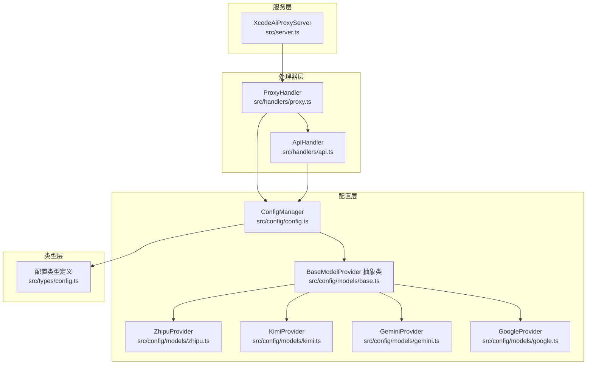
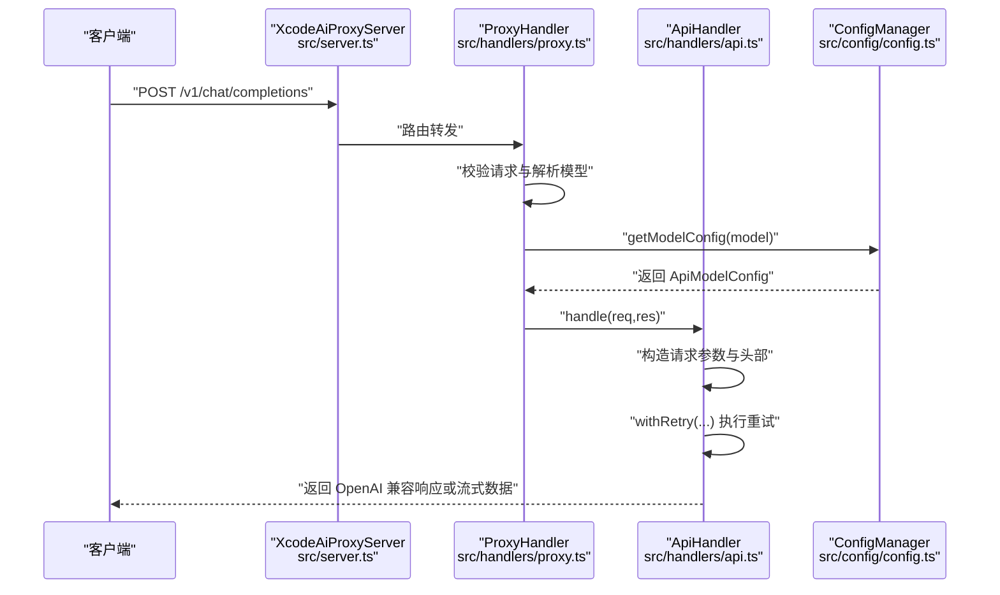
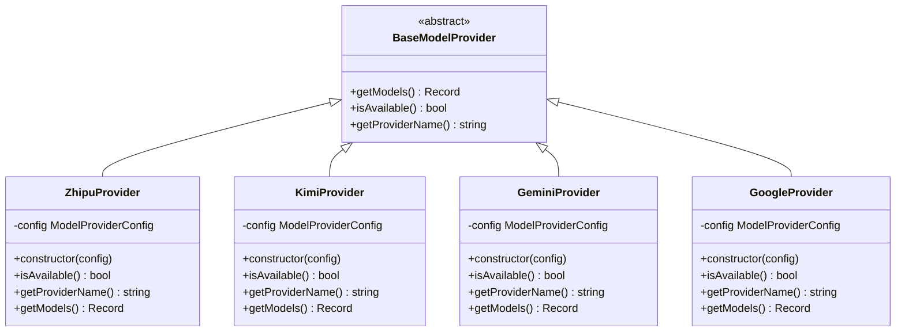
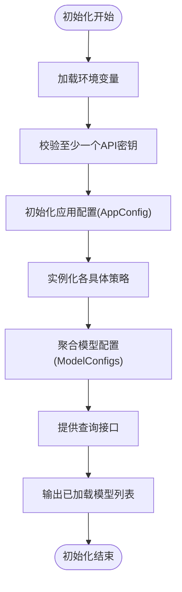
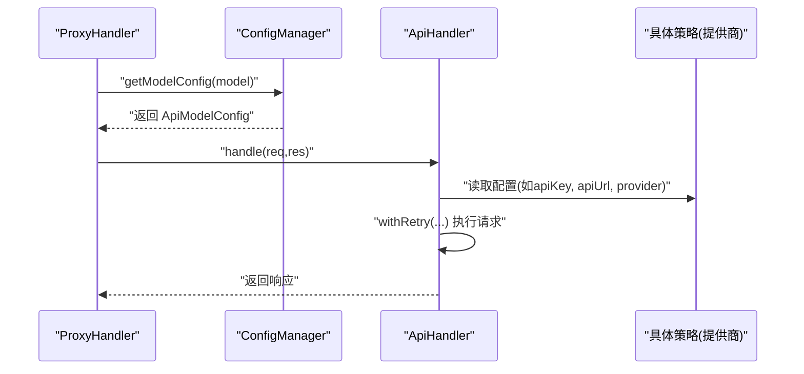
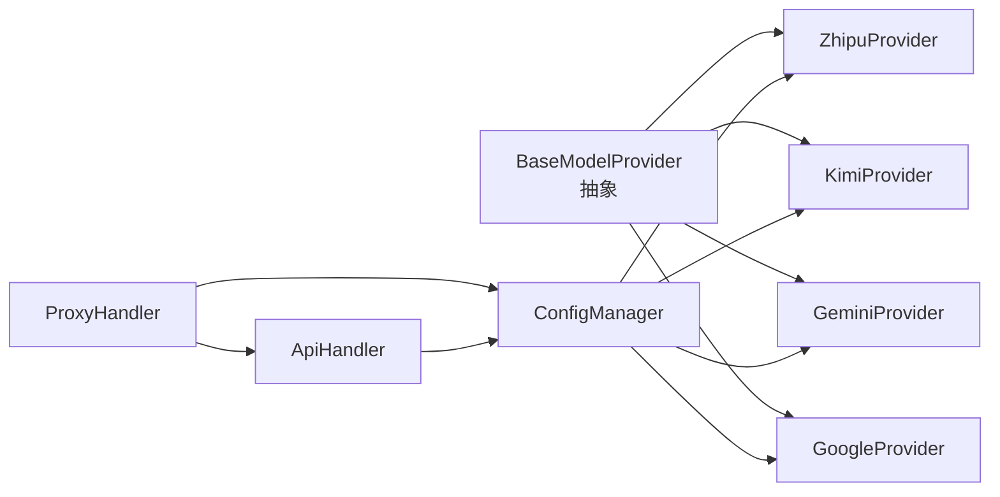

# 策略模式

<cite>
**本文引用的文件**
- [src/config/models/base.ts](file://src/config/models/base.ts)
- [src/config/models/index.ts](file://src/config/models/index.ts)
- [src/config/models/zhipu.ts](file://src/config/models/zhipu.ts)
- [src/config/models/kimi.ts](file://src/config/models/kimi.ts)
- [src/config/models/gemini.ts](file://src/config/models/gemini.ts)
- [src/config/models/google.ts](file://src/config/models/google.ts)
- [src/config/config.ts](file://src/config/config.ts)
- [src/types/config.ts](file://src/types/config.ts)
- [src/handlers/api.ts](file://src/handlers/api.ts)
- [src/handlers/proxy.ts](file://src/handlers/proxy.ts)
- [src/server.ts](file://src/server.ts)
</cite>

## 目录
1. [简介](#简介)
2. [项目结构](#项目结构)
3. [核心组件](#核心组件)
4. [架构总览](#架构总览)
5. [详细组件分析](#详细组件分析)
6. [依赖分析](#依赖分析)
7. [性能考量](#性能考量)
8. [故障排查指南](#故障排查指南)
9. [结论](#结论)
10. [附录](#附录)

## 简介
本文件围绕 xcode-ai-proxy 的“策略模式”实践展开，重点解释其在多 AI 服务提供商之间的可插拔切换机制。项目通过统一的抽象策略接口定义各提供商的行为边界，结合配置管理器按需实例化具体策略，并由处理器在运行时根据模型标识选择对应策略执行。该设计实现了灵活的提供商替换、易于扩展的新提供商接入、以及基于配置的运行时决策能力。

## 项目结构
项目采用分层与按功能组织的结构：
- config 层：集中管理模型配置与提供商策略，包含抽象策略基类与多个具体策略实现。
- handlers 层：对外暴露统一的 API 接口，内部委派给具体处理器完成业务逻辑。
- types 层：定义通用的数据模型与配置类型，确保跨模块一致的数据契约。
- server 层：应用入口，负责中间件、路由注册与服务启动。

图表来源
- [src/server.ts:1-88](file://src/server.ts#L1-L88)
- [src/handlers/proxy.ts:1-66](file://src/handlers/proxy.ts#L1-L66)
- [src/handlers/api.ts:1-196](file://src/handlers/api.ts#L1-L196)
- [src/config/config.ts:1-123](file://src/config/config.ts#L1-L123)
- [src/config/models/base.ts:1-13](file://src/config/models/base.ts#L1-L13)
- [src/config/models/zhipu.ts:1-34](file://src/config/models/zhipu.ts#L1-L34)
- [src/config/models/kimi.ts:1-34](file://src/config/models/kimi.ts#L1-L34)
- [src/config/models/gemini.ts:1-34](file://src/config/models/gemini.ts#L1-L34)
- [src/config/models/google.ts:1-34](file://src/config/models/google.ts#L1-L34)
- [src/types/config.ts:1-48](file://src/types/config.ts#L1-L48)

章节来源
- [src/server.ts:1-88](file://src/server.ts#L1-L88)
- [src/config/config.ts:1-123](file://src/config/config.ts#L1-L123)

## 核心组件
- 抽象策略基类：定义统一的策略接口，包括模型查询、可用性判断与提供商名称等方法，确保各具体策略具备一致行为契约。
- 具体策略实现：分别为智谱、Kimi、Gemini、通义千问等提供商提供独立实现，每个实现封装自身 API 密钥、URL 与模型映射。
- 配置管理器：负责从环境变量初始化各提供商配置，实例化具体策略并聚合模型配置，提供统一查询接口。
- 处理器：对外暴露统一的聊天补全与模型列表接口；在运行时依据模型标识选择对应提供商配置并调用底层 API 处理器进行转发与响应。

章节来源
- [src/config/models/base.ts:1-13](file://src/config/models/base.ts#L1-L13)
- [src/config/models/index.ts:1-5](file://src/config/models/index.ts#L1-L5)
- [src/config/config.ts:69-99](file://src/config/config.ts#L69-L99)
- [src/handlers/proxy.ts:6-37](file://src/handlers/proxy.ts#L6-L37)
- [src/handlers/api.ts:8-28](file://src/handlers/api.ts#L8-L28)

## 架构总览
下图展示了策略模式在项目中的整体应用：抽象策略定义行为，配置管理器按需构建具体策略并汇总模型清单；处理器在请求到来时根据模型 ID 查询配置并委托 API 处理器发起真实提供商调用。

图表来源
- [src/server.ts:29-40](file://src/server.ts#L29-L40)
- [src/handlers/proxy.ts:9-28](file://src/handlers/proxy.ts#L9-L28)
- [src/handlers/api.ts:30-121](file://src/handlers/api.ts#L30-L121)
- [src/config/config.ts:109-115](file://src/config/config.ts#L109-L115)

## 详细组件分析

### 抽象策略与具体策略
- 抽象策略基类定义了统一接口：查询可用模型、判断提供商是否可用、返回提供商名称。该设计保证了不同提供商的实现遵循同一契约，便于扩展与替换。
- 具体策略实现均继承自抽象基类，分别封装各自提供商的 API 密钥、默认 API 地址与模型映射。例如：
  - 智谱策略：提供特定模型 ID 及其对应的提供商信息与模型名。
  - Kimi 策略：提供 Kimi 的模型 ID 与 API 地址。
  - Gemini 策略：提供 Gemini Pro/Gemini 2.5 Pro 等模型映射。
  - 通义千问策略：提供 Qwen Max 等模型映射。
- 策略导出入口：通过索引文件统一导出，便于上层按需引入与组合。

图表来源
- [src/config/models/base.ts:3-7](file://src/config/models/base.ts#L3-L7)
- [src/config/models/zhipu.ts:4-34](file://src/config/models/zhipu.ts#L4-L34)
- [src/config/models/kimi.ts:4-34](file://src/config/models/kimi.ts#L4-L34)
- [src/config/models/gemini.ts:4-34](file://src/config/models/gemini.ts#L4-L34)
- [src/config/models/google.ts:4-34](file://src/config/models/google.ts#L4-L34)

章节来源
- [src/config/models/base.ts:1-13](file://src/config/models/base.ts#L1-L13)
- [src/config/models/zhipu.ts:1-34](file://src/config/models/zhipu.ts#L1-L34)
- [src/config/models/kimi.ts:1-34](file://src/config/models/kimi.ts#L1-L34)
- [src/config/models/gemini.ts:1-34](file://src/config/models/gemini.ts#L1-L34)
- [src/config/models/google.ts:1-34](file://src/config/models/google.ts#L1-L34)
- [src/config/models/index.ts:1-5](file://src/config/models/index.ts#L1-L5)

### 配置管理器与策略装配
- 配置管理器负责：
  - 校验至少存在一个提供商的 API 密钥；
  - 初始化应用配置（端口、主机、重试次数、超时等）；
  - 实例化各具体策略并聚合模型配置到统一字典；
  - 提供查询接口：获取单个模型配置、支持的模型列表、打印已加载配置。
- 该流程体现了“策略装配”的核心：以配置驱动策略实例化与模型聚合，从而实现运行时的可插拔与可扩展。

图表来源
- [src/config/config.ts:29-51](file://src/config/config.ts#L29-L51)
- [src/config/config.ts:53-67](file://src/config/config.ts#L53-L67)
- [src/config/config.ts:69-99](file://src/config/config.ts#L69-L99)
- [src/config/config.ts:109-122](file://src/config/config.ts#L109-L122)

章节来源
- [src/config/config.ts:1-123](file://src/config/config.ts#L1-L123)

### 处理器与策略选择
- 代理处理器：
  - 校验请求并解析模型；
  - 通过配置管理器查询模型配置；
  - 若为 API 类型，则委派给 API 处理器执行；
  - 对不支持的模型返回错误信息。
- API 处理器：
  - 校验请求、构造 OpenAI 兼容的请求体；
  - 根据模型配置设置认证头与特殊参数（如 Kimi 的 HTTPS Agent）；
  - 使用带重试的网络工具发起请求；
  - 处理流式与非流式响应并原样返回。

图表来源
- [src/handlers/proxy.ts:14-28](file://src/handlers/proxy.ts#L14-L28)
- [src/handlers/api.ts:16-22](file://src/handlers/api.ts#L16-L22)
- [src/handlers/api.ts:30-121](file://src/handlers/api.ts#L30-L121)

章节来源
- [src/handlers/proxy.ts:1-66](file://src/handlers/proxy.ts#L1-L66)
- [src/handlers/api.ts:1-196](file://src/handlers/api.ts#L1-L196)

### 数据模型与类型约束
- 类型定义确保了策略与处理器之间的契约清晰：
  - ApiModelConfig 统一了提供商、模型名、API 地址与密钥等字段；
  - ModelConfigs 将模型 ID 映射到具体配置；
  - EnvConfig 定义了环境变量键名，用于驱动策略装配。
- 这些类型约束使得策略切换与配置变更在编译期即可被发现，降低运行时风险。

章节来源
- [src/types/config.ts:1-48](file://src/types/config.ts#L1-L48)

## 依赖分析
- 抽象与实现解耦：处理器仅依赖抽象策略接口与配置类型，不直接依赖具体提供商实现，满足开闭原则。
- 配置驱动装配：配置管理器集中负责策略实例化与模型聚合，降低处理器与策略实现的耦合度。
- 运行时选择：处理器在请求阶段依据模型 ID 从配置中查找对应提供商配置，实现动态策略选择。

图表来源
- [src/config/models/base.ts:3-7](file://src/config/models/base.ts#L3-L7)
- [src/config/models/zhipu.ts:4-34](file://src/config/models/zhipu.ts#L4-L34)
- [src/config/models/kimi.ts:4-34](file://src/config/models/kimi.ts#L4-L34)
- [src/config/models/gemini.ts:4-34](file://src/config/models/gemini.ts#L4-L34)
- [src/config/models/google.ts:4-34](file://src/config/models/google.ts#L4-L34)
- [src/config/config.ts:69-99](file://src/config/config.ts#L69-L99)
- [src/handlers/proxy.ts:6-37](file://src/handlers/proxy.ts#L6-L37)
- [src/handlers/api.ts:8-28](file://src/handlers/api.ts#L8-L28)

章节来源
- [src/config/models/base.ts:1-13](file://src/config/models/base.ts#L1-L13)
- [src/config/config.ts:69-99](file://src/config/config.ts#L69-L99)
- [src/handlers/proxy.ts:1-66](file://src/handlers/proxy.ts#L1-L66)
- [src/handlers/api.ts:1-196](file://src/handlers/api.ts#L1-L196)

## 性能考量
- 重试与超时：配置管理器提供最大重试次数与重试延迟，API 处理器在请求阶段使用带重试的网络工具，提升稳定性与成功率。
- 流式响应：API 处理器支持流式传输，减少等待时间并改善用户体验。
- 平台差异：针对特定提供商（如 Kimi）设置专用的 HTTPS Agent，优化连接复用与安全性。
- 日志与可观测性：在关键节点输出请求与响应信息，便于定位性能瓶颈与异常。

章节来源
- [src/config/config.ts:57-59](file://src/config/config.ts#L57-L59)
- [src/handlers/api.ts:46-56](file://src/handlers/api.ts#L46-L56)
- [src/handlers/api.ts:176-194](file://src/handlers/api.ts#L176-L194)

## 故障排查指南
- 模型不可用：若提供商未启用或缺少 API 密钥，策略的可用性判断会返回不可用，导致模型配置为空。可通过检查环境变量与配置项确认。
- 请求失败：API 处理器在遇到错误状态码时会输出详细错误信息（含状态码、URL、响应体），并抛出带状态信息的错误对象，便于上层捕获与处理。
- 代理错误：代理处理器对不支持的模型返回明确的错误信息，包含支持的模型列表，帮助快速定位问题。

章节来源
- [src/config/models/gemini.ts:12-14](file://src/config/models/gemini.ts#L12-L14)
- [src/config/models/qwen.ts:12-14](file://src/config/models/qwen.ts#L12-L14)
- [src/config/models/kimi.ts:12-14](file://src/config/models/kimi.ts#L12-L14)
- [src/config/models/zhipu.ts:12-14](file://src/config/models/zhipu.ts#L12-L14)
- [src/handlers/api.ts:124-164](file://src/handlers/api.ts#L124-L164)
- [src/handlers/proxy.ts:15-24](file://src/handlers/proxy.ts#L15-L24)

## 结论
本项目通过策略模式实现了多 AI 服务提供商的可插拔切换与统一管理。抽象策略基类定义了统一接口，具体策略封装各自提供商的差异化配置，配置管理器以配置驱动装配策略并聚合模型清单，处理器在运行时依据模型 ID 选择对应策略执行。该设计提升了系统的灵活性、可扩展性与运行时决策能力，同时通过类型约束、重试与流式响应等机制保障了性能与可靠性。

## 附录
- 环境变量与配置项：通过环境变量驱动策略装配与应用配置，便于在不同部署环境中快速切换提供商与调整参数。
- 路由与入口：服务启动后注册健康检查、模型列表与聊天补全等路由，统一对外提供 OpenAI 兼容接口。

章节来源
- [src/types/config.ts:33-48](file://src/types/config.ts#L33-L48)
- [src/server.ts:29-40](file://src/server.ts#L29-L40)
- [src/server.ts:46-83](file://src/server.ts#L46-L83)