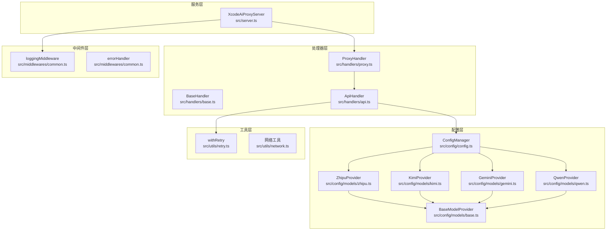
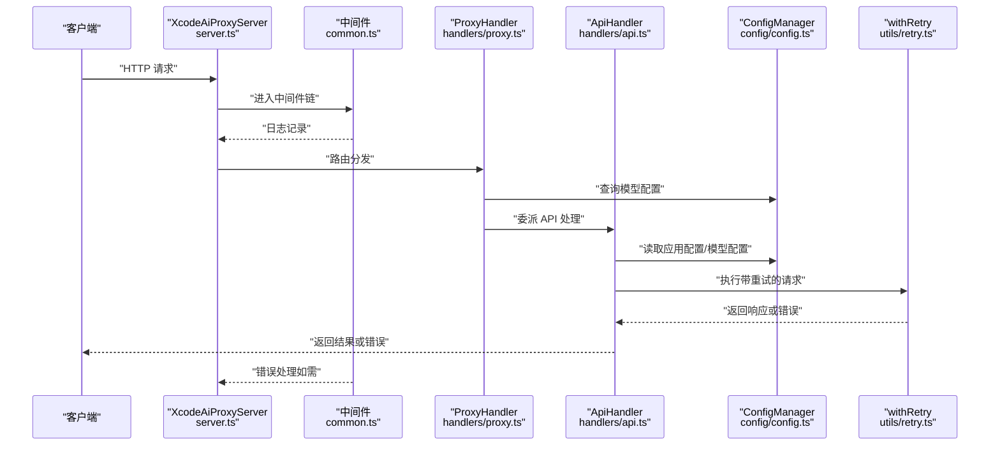
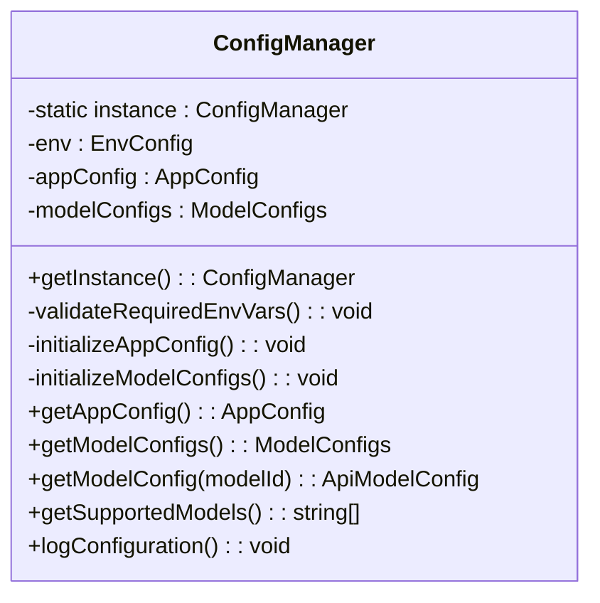
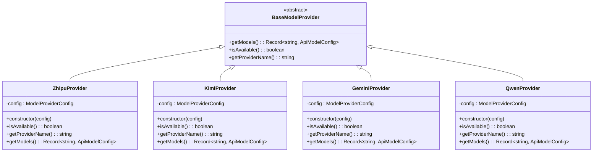
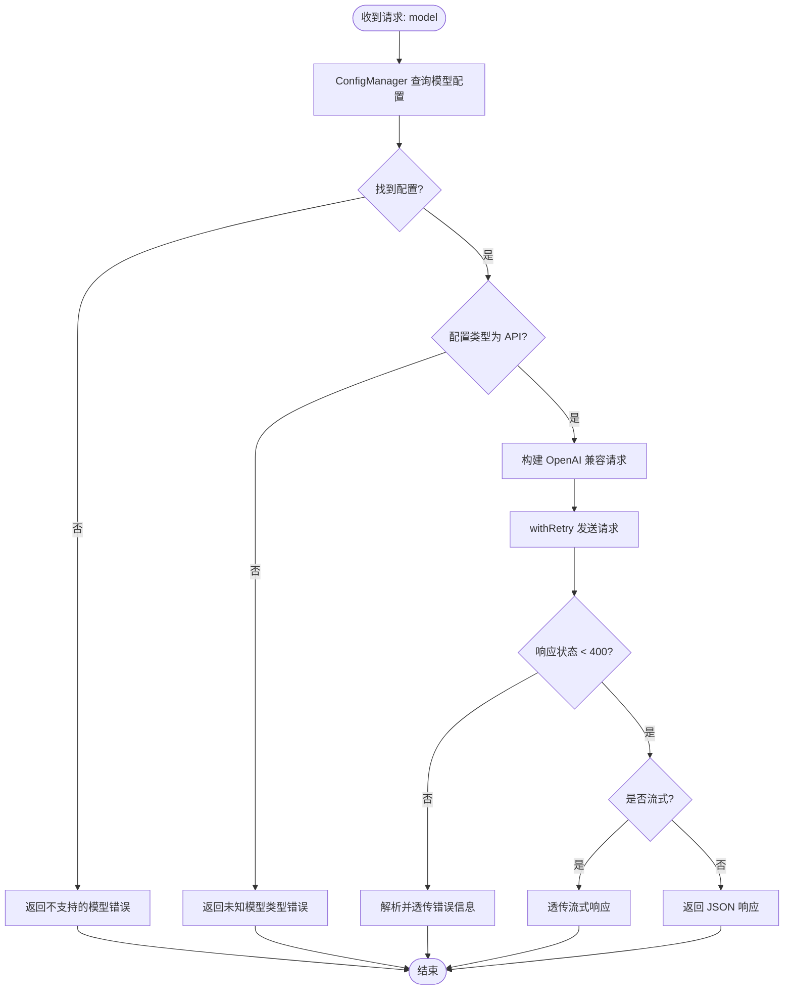
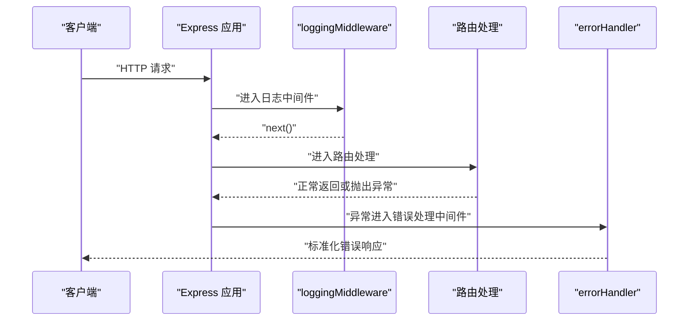
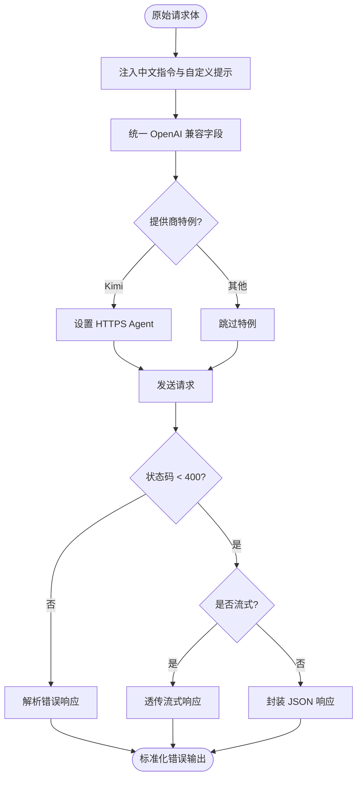
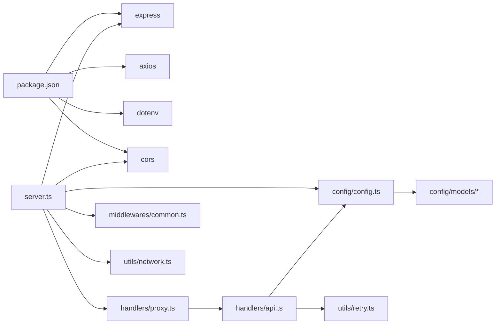

# 设计模式

<cite>
**本文引用的文件**
- [src/config/config.ts](file://src/config/config.ts)
- [src/config/models/base.ts](file://src/config/models/base.ts)
- [src/config/models/zhipu.ts](file://src/config/models/zhipu.ts)
- [src/config/models/gemini.ts](file://src/config/models/gemini.ts)
- [src/config/models/qwen.ts](file://src/config/models/qwen.ts)
- [src/config/models/kimi.ts](file://src/config/models/kimi.ts)
- [src/config/models/index.ts](file://src/config/models/index.ts)
- [src/handlers/base.ts](file://src/handlers/base.ts)
- [src/handlers/api.ts](file://src/handlers/api.ts)
- [src/handlers/proxy.ts](file://src/handlers/proxy.ts)
- [src/middlewares/common.ts](file://src/middlewares/common.ts)
- [src/server.ts](file://src/server.ts)
- [src/types/config.ts](file://src/types/config.ts)
- [src/utils/retry.ts](file://src/utils/retry.ts)
- [src/utils/network.ts](file://src/utils/network.ts)
- [package.json](file://package.json)
</cite>

## 目录
1. [引言](#引言)
2. [项目结构](#项目结构)
3. [核心组件](#核心组件)
4. [架构总览](#架构总览)
5. [详细组件分析](#详细组件分析)
6. [依赖关系分析](#依赖关系分析)
7. [性能考量](#性能考量)
8. [故障排查指南](#故障排查指南)
9. [结论](#结论)
10. [附录](#附录)

## 引言
本文件聚焦于 xcode-ai-proxy 的设计模式实现，系统梳理并解析以下核心模式在项目中的落地方式与最佳实践：
- 单例模式：ConfigManager 全局配置管理，确保唯一实例与一致性。
- 工厂模式：模型提供者系统（ZhipuProvider、KimiProvider、GeminiProvider、QwenProvider）对多 AI 服务的统一抽象与动态装配。
- 策略模式：通过模型配置选择不同的 AI 提供商，实现“按模型选择策略”的运行时切换。
- 中间件模式：Express.js 中间件实现横切关注点（日志、错误处理）的模块化。
- 适配器模式：统一 OpenAI 兼容 API 接口，屏蔽不同提供商的差异。

## 项目结构
项目采用按职责分层的组织方式：
- config：配置与模型提供者抽象及实现
- handlers：HTTP 请求处理器（基础类、代理、API）
- middlewares：Express 中间件（日志、错误处理）
- types：类型定义（配置、API）
- utils：工具函数（重试、网络）
- server.ts：服务入口，装配中间件、路由与错误处理

图表来源
- [src/server.ts:1-88](file://src/server.ts#L1-L88)
- [src/config/config.ts:1-121](file://src/config/config.ts#L1-L121)
- [src/config/models/base.ts:1-13](file://src/config/models/base.ts#L1-L13)
- [src/config/models/zhipu.ts:1-34](file://src/config/models/zhipu.ts#L1-L34)
- [src/config/models/kimi.ts:1-34](file://src/config/models/kimi.ts#L1-L34)
- [src/config/models/gemini.ts:1-34](file://src/config/models/gemini.ts#L1-L34)
- [src/config/models/qwen.ts:1-35](file://src/config/models/qwen.ts#L1-L35)
- [src/handlers/base.ts:1-40](file://src/handlers/base.ts#L1-L40)
- [src/handlers/proxy.ts:1-66](file://src/handlers/proxy.ts#L1-L66)
- [src/handlers/api.ts:1-196](file://src/handlers/api.ts#L1-L196)
- [src/middlewares/common.ts:1-25](file://src/middlewares/common.ts#L1-L25)
- [src/utils/retry.ts:1-34](file://src/utils/retry.ts#L1-L34)
- [src/utils/network.ts:1-51](file://src/utils/network.ts#L1-L51)

章节来源
- [src/server.ts:1-88](file://src/server.ts#L1-L88)
- [src/config/config.ts:1-121](file://src/config/config.ts#L1-L121)
- [src/config/models/base.ts:1-13](file://src/config/models/base.ts#L1-L13)
- [src/config/models/index.ts:1-5](file://src/config/models/index.ts#L1-L5)

## 核心组件
- ConfigManager：单例配置中心，负责环境变量校验、应用配置初始化、模型配置聚合与查询。
- BaseModelProvider 及其子类：抽象模型提供者接口，统一提供模型清单、可用性判断与提供商名称。
- BaseHandler/ProxyHandler/ApiHandler：请求处理链路，统一校验、日志与错误封装，并委派到具体 API 处理。
- Express 中间件：loggingMiddleware 与 errorHandler 实现横切关注点。
- withRetry：通用重试策略，支持指数退避与多次尝试。

章节来源
- [src/config/config.ts:7-121](file://src/config/config.ts#L7-L121)
- [src/config/models/base.ts:3-7](file://src/config/models/base.ts#L3-L7)
- [src/handlers/base.ts:5-40](file://src/handlers/base.ts#L5-L40)
- [src/handlers/proxy.ts:6-66](file://src/handlers/proxy.ts#L6-L66)
- [src/handlers/api.ts:8-196](file://src/handlers/api.ts#L8-L196)
- [src/middlewares/common.ts:4-25](file://src/middlewares/common.ts#L4-L25)
- [src/utils/retry.ts:1-34](file://src/utils/retry.ts#L1-L34)

## 架构总览
下图展示了从服务启动到请求处理的关键交互，体现单例、工厂、策略与中间件的协同：

图表来源
- [src/server.ts:23-44](file://src/server.ts#L23-L44)
- [src/middlewares/common.ts:4-25](file://src/middlewares/common.ts#L4-L25)
- [src/handlers/proxy.ts:9-37](file://src/handlers/proxy.ts#L9-L37)
- [src/handlers/api.ts:30-195](file://src/handlers/api.ts#L30-L195)
- [src/config/config.ts:99-121](file://src/config/config.ts#L99-L121)
- [src/utils/retry.ts:1-34](file://src/utils/retry.ts#L1-L34)

## 详细组件分析

### 单例模式：ConfigManager 全局配置中心
- 关键点
  - 私有静态字段保存唯一实例，构造函数私有化，提供静态工厂方法获取实例。
  - 初始化阶段完成环境变量校验、应用配置与模型配置的聚合。
  - 对外暴露查询方法，保证全局一致的配置读取入口。
- 设计要点
  - 避免重复初始化与资源浪费；在进程生命周期内共享同一份配置。
  - 将“模型提供者”实例化与“模型映射表”构建解耦，便于扩展新的提供商。
- 最佳实践
  - 在应用启动时尽早调用获取实例，确保后续组件可直接读取配置。
  - 对外仅暴露只读查询方法，防止外部修改配置导致状态不一致。

图表来源
- [src/config/config.ts:7-121](file://src/config/config.ts#L7-L121)

章节来源
- [src/config/config.ts:7-25](file://src/config/config.ts#L7-L25)
- [src/config/config.ts:27-97](file://src/config/config.ts#L27-L97)
- [src/config/config.ts:99-121](file://src/config/config.ts#L99-L121)

### 工厂模式：模型提供者系统
- 关键点
  - 抽象基类 BaseModelProvider 定义统一接口（模型清单、可用性、提供商名）。
  - 具体提供商（Zhipu/Kimi/Gemini/Qwen）实现各自的模型映射与可用性判断。
  - ConfigManager 在初始化阶段“装配”各提供商，聚合为统一的模型字典。
- 设计要点
  - 通过“配置对象 + 抽象工厂”的组合，实现“按需启用/禁用提供商”的灵活性。
  - 提供商新增时无需改动现有调用方，只需实现抽象并注册到 ConfigManager。
- 最佳实践
  - 使用接口约束统一行为，避免在上层逻辑中出现分支判断。
  - 将提供商的可用性判断前置到工厂层，简化上层调用。

图表来源
- [src/config/models/base.ts:3-7](file://src/config/models/base.ts#L3-L7)
- [src/config/models/zhipu.ts:4-34](file://src/config/models/zhipu.ts#L4-L34)
- [src/config/models/kimi.ts:4-34](file://src/config/models/kimi.ts#L4-L34)
- [src/config/models/gemini.ts:4-34](file://src/config/models/gemini.ts#L4-L34)
- [src/config/models/qwen.ts:4-35](file://src/config/models/qwen.ts#L4-L35)

章节来源
- [src/config/models/base.ts:1-13](file://src/config/models/base.ts#L1-L13)
- [src/config/models/zhipu.ts:1-34](file://src/config/models/zhipu.ts#L1-L34)
- [src/config/models/kimi.ts:1-34](file://src/config/models/kimi.ts#L1-L34)
- [src/config/models/gemini.ts:1-34](file://src/config/models/gemini.ts#L1-L34)
- [src/config/models/qwen.ts:1-35](file://src/config/models/qwen.ts#L1-L35)
- [src/config/config.ts:67-97](file://src/config/config.ts#L67-L97)

### 策略模式：不同 AI 提供商的切换机制
- 关键点
  - 模型 ID 到提供商配置的映射由 ConfigManager 聚合，ApiHandler 根据 model 参数选择对应配置。
  - 不同提供商的 API URL、认证方式、特殊参数（如 Kimi 的 HTTPS Agent）在配置与请求阶段差异化处理。
  - 通过“模型配置选择 + 请求适配”的组合实现“按模型选择策略”的动态切换。
- 设计要点
  - 上层仅关心 model 字符串，无需感知底层提供商差异。
  - 当新增提供商或调整模型映射时，只需更新工厂与配置聚合逻辑。
- 最佳实践
  - 明确区分“模型标识”与“真实后端模型名”，必要时在请求前做转换。
  - 对流式与非流式响应进行统一透传或封装，保持对外接口一致。

图表来源
- [src/handlers/proxy.ts:9-37](file://src/handlers/proxy.ts#L9-L37)
- [src/handlers/api.ts:30-195](file://src/handlers/api.ts#L30-L195)
- [src/utils/retry.ts:1-34](file://src/utils/retry.ts#L1-L34)

章节来源
- [src/handlers/proxy.ts:14-31](file://src/handlers/proxy.ts#L14-L31)
- [src/handlers/api.ts:16-22](file://src/handlers/api.ts#L16-L22)
- [src/utils/retry.ts:1-34](file://src/utils/retry.ts#L1-L34)

### 中间件模式：Express.js 横切关注点模块化
- 关键点
  - loggingMiddleware：统一记录请求方法与路径，作为第一个中间件执行。
  - errorHandler：集中捕获异常并返回标准化错误响应，避免在业务逻辑中散落错误处理。
  - 两者配合实现“日志记录—业务处理—错误兜底”的清晰流水线。
- 设计要点
  - 中间件顺序决定横切关注点的执行先后，需谨慎排列。
  - 错误中间件应置于路由之后，确保未被处理的异常被捕获。
- 最佳实践
  - 将日志、鉴权、限流等通用能力下沉为中间件，提升代码复用与可维护性。

图表来源
- [src/server.ts:23-44](file://src/server.ts#L23-L44)
- [src/middlewares/common.ts:4-25](file://src/middlewares/common.ts#L4-L25)

章节来源
- [src/server.ts:23-44](file://src/server.ts#L23-L44)
- [src/middlewares/common.ts:4-25](file://src/middlewares/common.ts#L4-L25)

### 适配器模式：API 兼容性处理
- 关键点
  - 统一以 OpenAI 兼容格式构建请求体，屏蔽不同提供商的差异。
  - 在请求阶段注入中文交流指令与自定义系统提示，增强用户体验。
  - 对特殊提供商（如 Kimi）进行额外的 HTTPS Agent 配置，保证稳定性。
  - 流式与非流式响应统一封装，对外暴露一致的接口。
- 设计要点
  - 将“适配层”与“业务层”分离，使上层仅依赖统一接口。
  - 对错误响应进行统一解析与透传，避免上层重复处理。
- 最佳实践
  - 保持“输入适配”与“输出适配”的边界清晰，便于扩展新提供商。

图表来源
- [src/handlers/api.ts:59-108](file://src/handlers/api.ts#L59-L108)
- [src/handlers/api.ts:110-195](file://src/handlers/api.ts#L110-L195)

章节来源
- [src/handlers/api.ts:59-108](file://src/handlers/api.ts#L59-L108)
- [src/handlers/api.ts:110-195](file://src/handlers/api.ts#L110-L195)

## 依赖关系分析
- 运行时依赖
  - express、cors、axios、dotenv 等用于服务、跨域、HTTP 请求与环境变量加载。
- 内部依赖
  - server.ts 依赖 ConfigManager、ProxyHandler、中间件与网络工具。
  - ProxyHandler/ApiHandler 依赖 ConfigManager 与重试工具。
  - ConfigManager 依赖各模型提供者工厂实现。

图表来源
- [package.json:14-28](file://package.json#L14-L28)
- [src/server.ts:1-88](file://src/server.ts#L1-L88)
- [src/handlers/proxy.ts:1-66](file://src/handlers/proxy.ts#L1-L66)
- [src/handlers/api.ts:1-196](file://src/handlers/api.ts#L1-L196)
- [src/config/config.ts:1-121](file://src/config/config.ts#L1-L121)
- [src/utils/retry.ts:1-34](file://src/utils/retry.ts#L1-L34)
- [src/utils/network.ts:1-51](file://src/utils/network.ts#L1-L51)

章节来源
- [package.json:14-28](file://package.json#L14-L28)
- [src/server.ts:1-88](file://src/server.ts#L1-L88)

## 性能考量
- 重试策略
  - withRetry 提供指数退避与最大重试次数控制，降低瞬时抖动对用户体验的影响。
  - 建议根据提供商 SLA 调整重试次数与延迟，避免过度重试造成资源浪费。
- 流式响应
  - ApiHandler 对流式响应进行直通透传，减少内存占用与延迟；注意在高并发场景下的连接与背压控制。
- 配置缓存
  - ConfigManager 作为单例，避免重复解析环境变量与构建模型映射，提高启动与运行效率。

## 故障排查指南
- 环境变量缺失
  - ConfigManager 在初始化阶段会校验至少存在一个 API 密钥，若缺失则直接退出进程。请检查环境变量配置。
- 模型不支持
  - ProxyHandler 会在找不到模型配置时返回支持的模型列表，核对请求中的 model 是否正确。
- 请求超时与错误
  - ApiHandler 使用 withRetry 执行请求，若仍失败会打印详细错误信息（状态码、URL、错误体）。建议结合日志定位问题。
- 中间件错误
  - errorHandler 会捕获未处理异常并返回标准错误响应，确认错误中间件是否正确挂载到最后。

章节来源
- [src/config/config.ts:27-49](file://src/config/config.ts#L27-L49)
- [src/handlers/proxy.ts:14-24](file://src/handlers/proxy.ts#L14-L24)
- [src/handlers/api.ts:124-164](file://src/handlers/api.ts#L124-L164)
- [src/middlewares/common.ts:9-25](file://src/middlewares/common.ts#L9-L25)

## 结论
本项目通过单例、工厂、策略、中间件与适配器五类设计模式，实现了配置统一、扩展灵活、横切关注点清晰与接口一致的目标。ConfigManager 作为全局配置中心，确保了系统的一致性；模型提供者工厂与策略选择机制使得多提供商接入简单可靠；Express 中间件将日志与错误处理模块化；适配器模式屏蔽了不同提供商的差异，统一对外接口。这些设计共同提升了系统的可维护性与可扩展性。

## 附录
- 类型定义概览
  - AppConfig：应用级配置（端口、主机、重试、超时、自定义提示）。
  - ApiModelConfig：模型级配置（提供商、API 地址、密钥、模型名等）。
  - EnvConfig：环境变量映射，用于运行时读取。

章节来源
- [src/types/config.ts:24-48](file://src/types/config.ts#L24-L48)