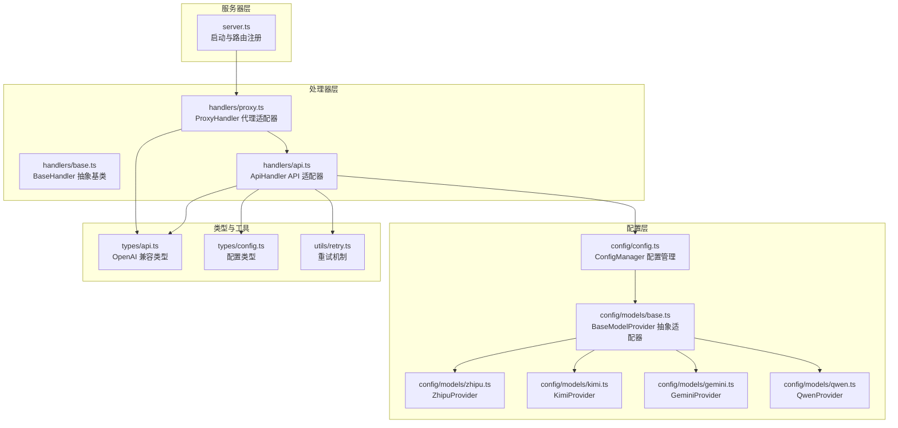
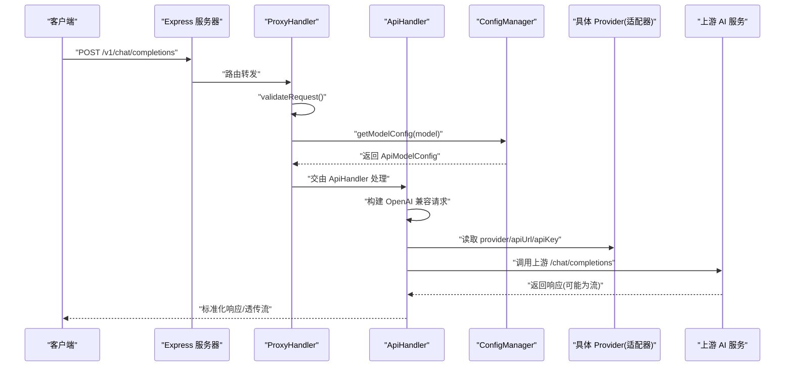
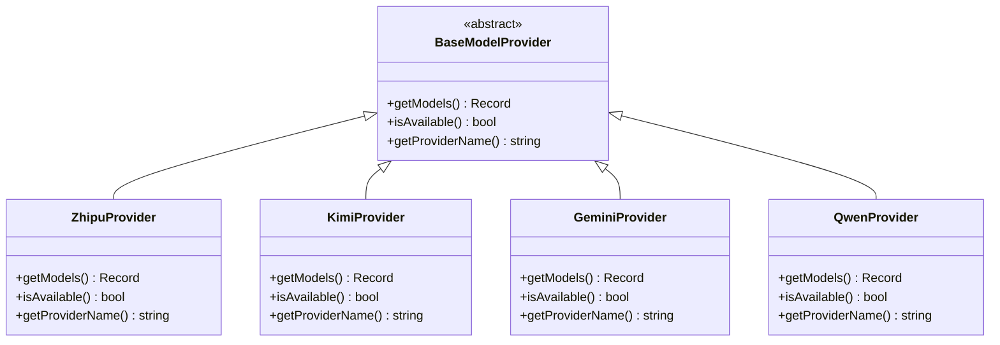
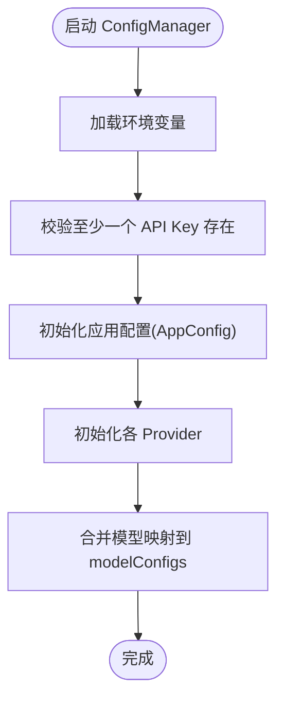
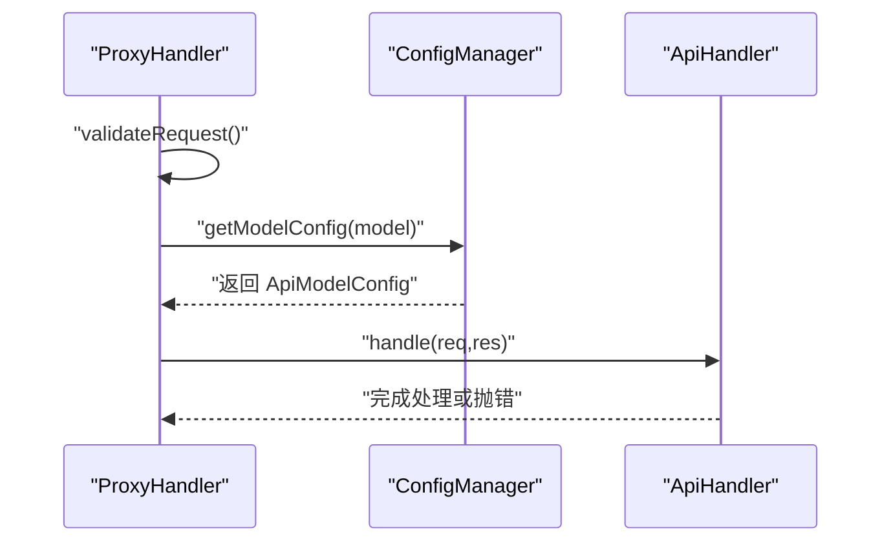
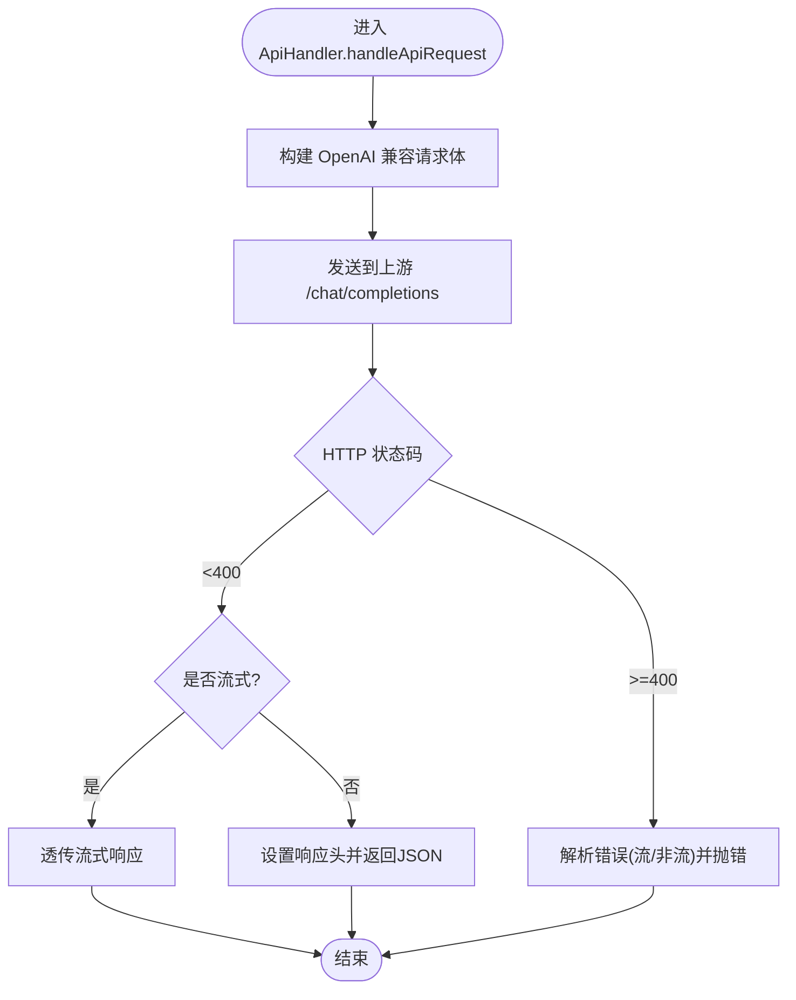
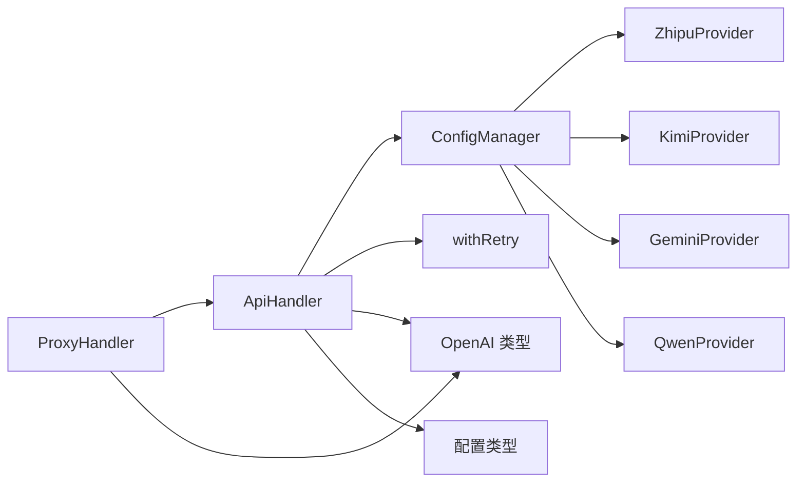

# 适配器模式

<cite>
**本文档引用的文件**
- [src/server.ts](file://src/server.ts)
- [src/handlers/base.ts](file://src/handlers/base.ts)
- [src/handlers/proxy.ts](file://src/handlers/proxy.ts)
- [src/handlers/api.ts](file://src/handlers/api.ts)
- [src/config/config.ts](file://src/config/config.ts)
- [src/config/models/base.ts](file://src/config/models/base.ts)
- [src/config/models/zhipu.ts](file://src/config/models/zhipu.ts)
- [src/config/models/gemini.ts](file://src/config/models/gemini.ts)
- [src/config/models/qwen.ts](file://src/config/models/qwen.ts)
- [src/config/models/kimi.ts](file://src/config/models/kimi.ts)
- [src/types/api.ts](file://src/types/api.ts)
- [src/types/config.ts](file://src/types/config.ts)
- [src/utils/retry.ts](file://src/utils/retry.ts)
</cite>

## 目录
1. [简介](#简介)
2. [项目结构](#项目结构)
3. [核心组件](#核心组件)
4. [架构总览](#架构总览)
5. [详细组件分析](#详细组件分析)
6. [依赖关系分析](#依赖关系分析)
7. [性能考量](#性能考量)
8. [故障排查指南](#故障排查指南)
9. [结论](#结论)
10. [附录](#附录)

## 简介
本项目通过“适配器模式”实现了多 AI 服务提供商的 API 兼容与统一。其核心思想是：对外暴露统一的 OpenAI 兼容接口，对内通过“适配器”（Provider）将不同供应商的请求格式与响应格式转换为统一的 OpenAI 标准，从而实现：
- 接口统一：客户端仅需对接 OpenAI 兼容的请求/响应格式
- 协议转换：将各供应商的私有协议转换为 OpenAI 兼容的 chat/completions
- 向后兼容：新增供应商只需实现 Provider 接口，即可无缝接入

## 项目结构
项目采用按职责分层的组织方式：
- 服务器入口与路由：负责启动 Express 应用、注册中间件与路由
- 处理器层：抽象基类与具体处理器（代理、API 适配），统一请求校验、错误处理与日志
- 配置层：集中管理应用配置与模型适配器（Provider）
- 类型层：定义统一的请求/响应与配置接口
- 工具层：网络与重试等通用能力

图表来源
- [src/server.ts:1-88](file://src/server.ts#L1-L88)
- [src/handlers/base.ts:1-40](file://src/handlers/base.ts#L1-L40)
- [src/handlers/proxy.ts:6-66](file://src/handlers/proxy.ts#L6-L66)
- [src/handlers/api.ts:1-196](file://src/handlers/api.ts#L1-L196)
- [src/config/config.ts:1-123](file://src/config/config.ts#L1-L123)
- [src/config/models/base.ts:1-13](file://src/config/models/base.ts#L1-L13)
- [src/config/models/zhipu.ts:1-34](file://src/config/models/zhipu.ts#L1-L34)
- [src/config/models/kimi.ts:1-34](file://src/config/models/kimi.ts#L1-L34)
- [src/config/models/gemini.ts:1-34](file://src/config/models/gemini.ts#L1-L34)
- [src/config/models/qwen.ts:1-35](file://src/config/models/qwen.ts#L1-L35)
- [src/types/api.ts:1-58](file://src/types/api.ts#L1-L58)
- [src/types/config.ts:1-48](file://src/types/config.ts#L1-L48)
- [src/utils/retry.ts:1-34](file://src/utils/retry.ts#L1-L34)

章节来源
- [src/server.ts:1-88](file://src/server.ts#L1-L88)
- [src/handlers/base.ts:1-40](file://src/handlers/base.ts#L1-L40)
- [src/handlers/proxy.ts:6-66](file://src/handlers/proxy.ts#L6-L66)
- [src/handlers/api.ts:1-196](file://src/handlers/api.ts#L1-L196)
- [src/config/config.ts:1-123](file://src/config/config.ts#L1-L123)
- [src/config/models/base.ts:1-13](file://src/config/models/base.ts#L1-L13)
- [src/config/models/zhipu.ts:1-34](file://src/config/models/zhipu.ts#L1-L34)
- [src/config/models/kimi.ts:1-34](file://src/config/models/kimi.ts#L1-L34)
- [src/config/models/gemini.ts:1-34](file://src/config/models/gemini.ts#L1-L34)
- [src/config/models/qwen.ts:1-35](file://src/config/models/qwen.ts#L1-L35)
- [src/types/api.ts:1-58](file://src/types/api.ts#L1-L58)
- [src/types/config.ts:1-48](file://src/types/config.ts#L1-L48)
- [src/utils/retry.ts:1-34](file://src/utils/retry.ts#L1-L34)

## 核心组件
- 适配器抽象与实现
  - 抽象适配器：定义统一的 Provider 接口，屏蔽不同供应商差异
  - 具体适配器：为智谱、Kimi、Gemini、通义分别实现适配逻辑
- 适配器管理器
  - ConfigManager 负责加载环境变量、初始化各 Provider，并将模型映射表合并到统一字典中
- 适配器处理器
  - ProxyHandler：根据 model 定位适配器，统一错误与日志
  - ApiHandler：执行 OpenAI 兼容的请求构建、发送、流式透传与响应标准化

章节来源
- [src/config/models/base.ts:1-13](file://src/config/models/base.ts#L1-L13)
- [src/config/models/zhipu.ts:1-34](file://src/config/models/zhipu.ts#L1-L34)
- [src/config/models/kimi.ts:1-34](file://src/config/models/kimi.ts#L1-L34)
- [src/config/models/gemini.ts:1-34](file://src/config/models/gemini.ts#L1-L34)
- [src/config/models/qwen.ts:1-35](file://src/config/models/qwen.ts#L1-L35)
- [src/config/config.ts:1-123](file://src/config/config.ts#L1-L123)
- [src/handlers/proxy.ts:6-66](file://src/handlers/proxy.ts#L6-L66)
- [src/handlers/api.ts:1-196](file://src/handlers/api.ts#L1-L196)

## 架构总览
下图展示了从客户端请求到上游 AI 服务的完整链路，重点体现“适配器模式”的三层角色：客户端（统一 OpenAI 接口）、代理适配器（路由与校验）、API 适配器（请求构建与响应透传）。

图表来源
- [src/server.ts:29-40](file://src/server.ts#L29-L40)
- [src/handlers/proxy.ts:9-37](file://src/handlers/proxy.ts#L9-L37)
- [src/handlers/api.ts:30-195](file://src/handlers/api.ts#L30-L195)
- [src/config/config.ts:69-99](file://src/config/config.ts#L69-L99)
- [src/config/models/base.ts:3-7](file://src/config/models/base.ts#L3-L7)

## 详细组件分析

### 适配器抽象与实现
- 抽象适配器 BaseModelProvider
  - 角色：定义统一的 Provider 接口，屏蔽不同供应商差异
  - 关键方法：getModels() 返回模型映射；isAvailable() 判定可用性；getProviderName() 返回名称
- 具体适配器
  - 智谱 ZhipuProvider：映射 glm-4.5 → 实际模型名
  - Kimi KimiProvider：映射 kimi-k2-0905-preview → 实际模型名
  - Gemini GeminiProvider：映射 gemini-2.5-pro → 实际模型名
  - 通义 QwenProvider：映射 qwen-max → 实际模型名
- 设计要点
  - 每个适配器封装 provider 名称、API 地址、密钥与模型映射
  - 可通过 enabled 控制是否启用，isAvailable() 用于运行期过滤不可用适配器

图表来源
- [src/config/models/base.ts:1-13](file://src/config/models/base.ts#L1-L13)
- [src/config/models/zhipu.ts:1-34](file://src/config/models/zhipu.ts#L1-L34)
- [src/config/models/kimi.ts:1-34](file://src/config/models/kimi.ts#L1-L34)
- [src/config/models/gemini.ts:1-34](file://src/config/models/gemini.ts#L1-L34)
- [src/config/models/qwen.ts:1-35](file://src/config/models/qwen.ts#L1-L35)

章节来源
- [src/config/models/base.ts:1-13](file://src/config/models/base.ts#L1-L13)
- [src/config/models/zhipu.ts:1-34](file://src/config/models/zhipu.ts#L1-L34)
- [src/config/models/kimi.ts:1-34](file://src/config/models/kimi.ts#L1-L34)
- [src/config/models/gemini.ts:1-34](file://src/config/models/gemini.ts#L1-L34)
- [src/config/models/qwen.ts:1-35](file://src/config/models/qwen.ts#L1-L35)

### 配置管理器与模型映射
- ConfigManager
  - 加载环境变量，校验至少存在一个 API Key
  - 初始化各 Provider 并合并模型映射到统一字典
  - 提供 getAppConfig()/getModelConfigs()/getModelConfig() 等查询接口
- 模型映射
  - 将“业务模型 ID”映射到“上游真实模型名”，并携带 provider、apiKey、apiUrl 等信息
  - 通过 Object.assign 合并多个 Provider 的映射，形成全局可用的模型表

图表来源
- [src/config/config.ts:13-99](file://src/config/config.ts#L13-L99)

章节来源
- [src/config/config.ts:1-123](file://src/config/config.ts#L1-L123)

### 代理适配器（ProxyHandler）
- 职责
  - 校验请求参数，定位模型配置
  - 将 API 类型模型请求转交给 ApiHandler 处理
  - 统一错误处理与日志输出
- 与 ApiHandler 的协作
  - 通过 BaseModelProvider 的配置，间接完成上游服务选择与参数准备

图表来源
- [src/handlers/proxy.ts:9-37](file://src/handlers/proxy.ts#L9-L37)
- [src/config/config.ts:109-115](file://src/config/config.ts#L109-L115)

章节来源
- [src/handlers/proxy.ts:6-66](file://src/handlers/proxy.ts#L6-L66)
- [src/config/config.ts:101-115](file://src/config/config.ts#L101-L115)

### API 适配器（ApiHandler）
- 请求适配
  - 统一 OpenAI 兼容的 ChatCompletionRequest 结构
  - 注入 Authorization: Bearer 与自定义系统提示（中文交流指令与用户自定义提示）
  - 特殊处理：Qwen 空 tools 数组删除；Kimi 使用 HTTPS Agent
- 响应适配
  - 流式：透传上游 SSE/流式响应
  - 非流式：设置 CORS 与 Content-Type，直接返回上游 JSON
- 错误适配
  - 对 4xx/5xx 响应进行解析与包装，区分流式与非流式错误
  - 通过 withRetry 提供指数退避重试，提升稳定性

图表来源
- [src/handlers/api.ts:30-195](file://src/handlers/api.ts#L30-L195)
- [src/utils/retry.ts:1-34](file://src/utils/retry.ts#L1-L34)

章节来源
- [src/handlers/api.ts:1-196](file://src/handlers/api.ts#L1-L196)
- [src/utils/retry.ts:1-34](file://src/utils/retry.ts#L1-L34)

### 请求适配流程（代码片段路径）
- 请求体构建与注入系统提示
  - [src/handlers/api.ts:59-95](file://src/handlers/api.ts#L59-L95)
- 特殊参数处理（Qwen 空 tools 删除）
  - [src/handlers/api.ts:97-100](file://src/handlers/api.ts#L97-L100)
- 认证头与 HTTPS Agent（Kimi）
  - [src/handlers/api.ts:46-56](file://src/handlers/api.ts#L46-L56)

### 响应转换流程（代码片段路径）
- 流式响应透传
  - [src/handlers/api.ts:176-183](file://src/handlers/api.ts#L176-L183)
- 非流式响应标准化
  - [src/handlers/api.ts:184-194](file://src/handlers/api.ts#L184-L194)

### 错误适配机制（代码片段路径）
- 错误响应解析（含流式读取）
  - [src/handlers/api.ts:131-164](file://src/handlers/api.ts#L131-L164)
- 统一错误响应格式
  - [src/handlers/base.ts:24-34](file://src/handlers/base.ts#L24-L34)

## 依赖关系分析
- 低耦合高内聚
  - ProxyHandler 仅依赖 ConfigManager 查询模型配置，不关心具体上游细节
  - ApiHandler 仅依赖统一的 ApiModelConfig，屏蔽 Provider 差异
- 可扩展性
  - 新增 Provider 仅需实现 BaseModelProvider 接口并加入 ConfigManager 初始化流程
  - 新增模型映射仅需在对应 Provider 中添加条目

图表来源
- [src/config/config.ts:69-99](file://src/config/config.ts#L69-L99)
- [src/handlers/proxy.ts:6-66](file://src/handlers/proxy.ts#L6-L66)
- [src/handlers/api.ts:1-196](file://src/handlers/api.ts#L1-L196)
- [src/utils/retry.ts:1-34](file://src/utils/retry.ts#L1-L34)
- [src/types/api.ts:1-58](file://src/types/api.ts#L1-L58)
- [src/types/config.ts:1-48](file://src/types/config.ts#L1-L48)

章节来源
- [src/config/config.ts:69-99](file://src/config/config.ts#L69-L99)
- [src/handlers/proxy.ts:6-66](file://src/handlers/proxy.ts#L6-L66)
- [src/handlers/api.ts:1-196](file://src/handlers/api.ts#L1-L196)
- [src/utils/retry.ts:1-34](file://src/utils/retry.ts#L1-L34)
- [src/types/api.ts:1-58](file://src/types/api.ts#L1-L58)
- [src/types/config.ts:1-48](file://src/types/config.ts#L1-L48)

## 性能考量
- 流式传输
  - ApiHandler 对流式响应直接透传，降低内存占用与延迟
- 重试策略
  - withRetry 提供指数退避，减少瞬时错误对用户体验的影响
- 连接优化
  - Kimi 使用 HTTPS Agent 保持长连接，减少握手开销

章节来源
- [src/handlers/api.ts:176-183](file://src/handlers/api.ts#L176-L183)
- [src/utils/retry.ts:1-34](file://src/utils/retry.ts#L1-L34)

## 故障排查指南
- 常见问题与定位
  - 模型未配置：检查 ConfigManager 是否正确加载对应 Provider
  - 认证失败：确认 Authorization 头是否正确注入 Bearer Token
  - 流式错误：查看 ApiHandler 对流式错误响应的解析与日志
  - 超时与重试：调整请求超时与重试次数配置
- 关键日志位置
  - 模型请求与流式状态打印
    - [src/handlers/base.ts:36-39](file://src/handlers/base.ts#L36-L39)
  - 上游请求详情与请求体
    - [src/handlers/api.ts:102-108](file://src/handlers/api.ts#L102-L108)
  - 错误响应详情与堆栈
    - [src/handlers/api.ts:124-164](file://src/handlers/api.ts#L124-L164)

章节来源
- [src/handlers/base.ts:36-39](file://src/handlers/base.ts#L36-L39)
- [src/handlers/api.ts:102-108](file://src/handlers/api.ts#L102-L108)
- [src/handlers/api.ts:124-164](file://src/handlers/api.ts#L124-L164)

## 结论
本项目通过“适配器模式”成功实现了多 AI 服务提供商的统一接入与 OpenAI 兼容接口暴露。其优势体现在：
- 接口统一：客户端无需关心上游差异
- 协议转换：将各供应商私有协议转换为 OpenAI 兼容格式
- 向后兼容：新增供应商与模型映射成本极低
- 易于扩展：遵循 BaseModelProvider 接口即可快速集成新提供商

## 附录

### 支持的新 AI 服务提供商适配步骤
- 步骤
  - 新建 Provider 类，继承 BaseModelProvider，实现 getModels()/isAvailable()/getProviderName()
  - 在 ConfigManager 初始化阶段实例化该 Provider，并将其模型映射合并到 modelConfigs
  - 如需特殊请求/响应处理，在 ApiHandler 中补充条件分支
- 参考实现路径
  - 抽象适配器接口
    - [src/config/models/base.ts:3-7](file://src/config/models/base.ts#L3-L7)
  - 具体适配器示例
    - [src/config/models/zhipu.ts:4-33](file://src/config/models/zhipu.ts#L4-L33)
    - [src/config/models/kimi.ts:4-33](file://src/config/models/kimi.ts#L4-L33)
    - [src/config/models/gemini.ts:4-33](file://src/config/models/gemini.ts#L4-L33)
    - [src/config/models/qwen.ts:4-34](file://src/config/models/qwen.ts#L4-L34)
  - 配置管理器集成
    - [src/config/config.ts:73-98](file://src/config/config.ts#L73-L98)

章节来源
- [src/config/models/base.ts:3-7](file://src/config/models/base.ts#L3-L7)
- [src/config/models/zhipu.ts:4-33](file://src/config/models/zhipu.ts#L4-L33)
- [src/config/models/kimi.ts:4-33](file://src/config/models/kimi.ts#L4-L33)
- [src/config/models/gemini.ts:4-33](file://src/config/models/gemini.ts#L4-L33)
- [src/config/models/qwen.ts:4-34](file://src/config/models/qwen.ts#L4-L34)
- [src/config/config.ts:73-98](file://src/config/config.ts#L73-L98)