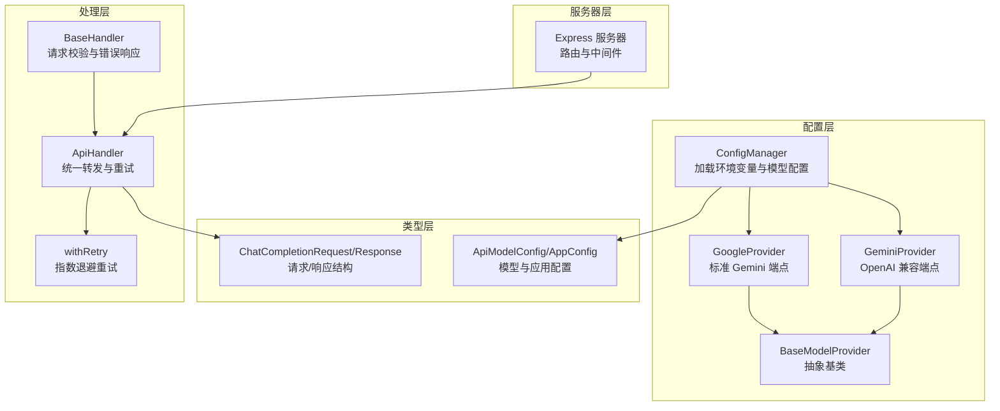
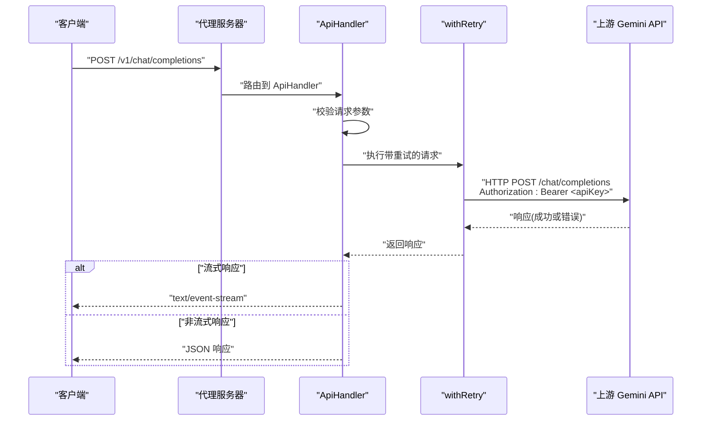
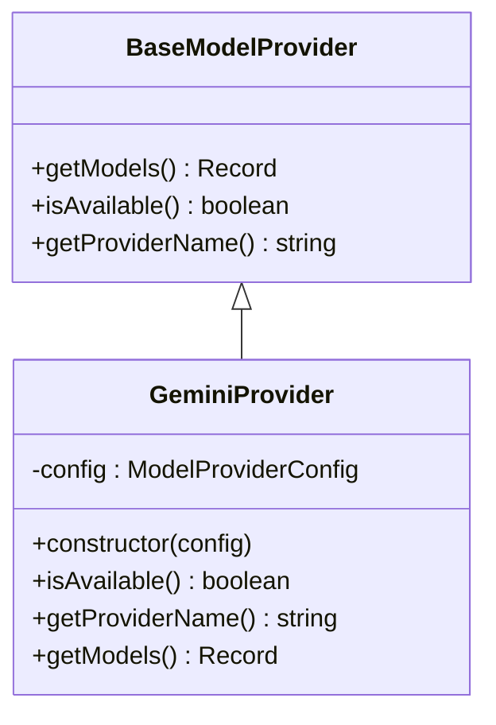
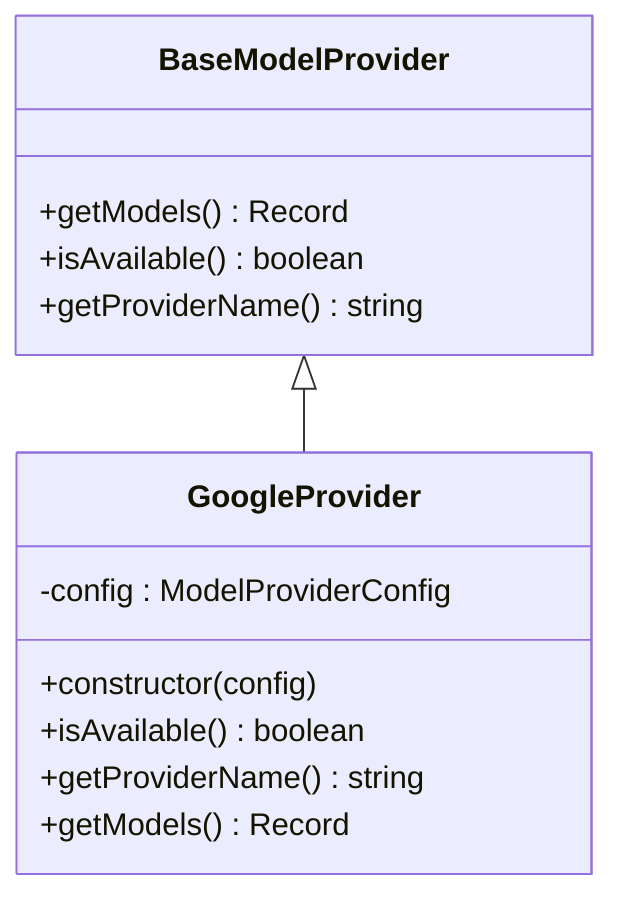
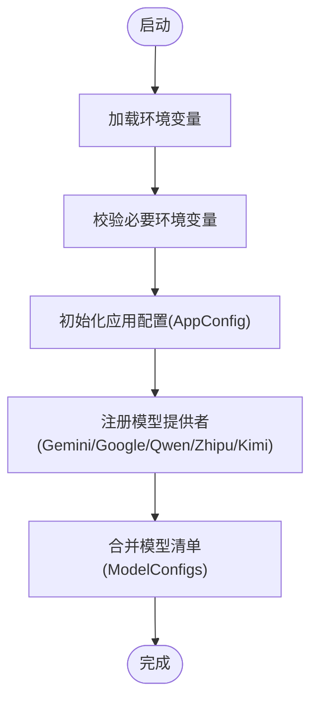
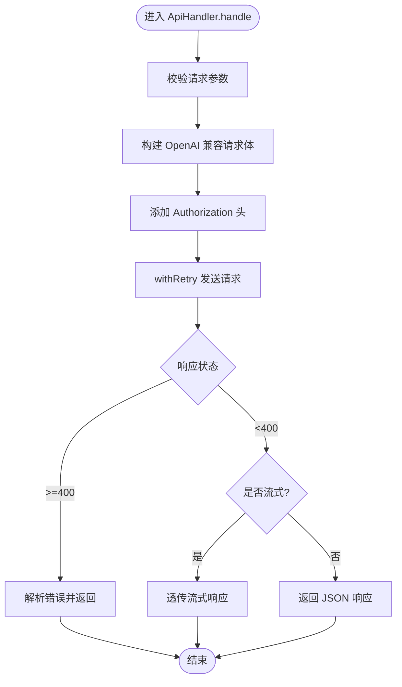
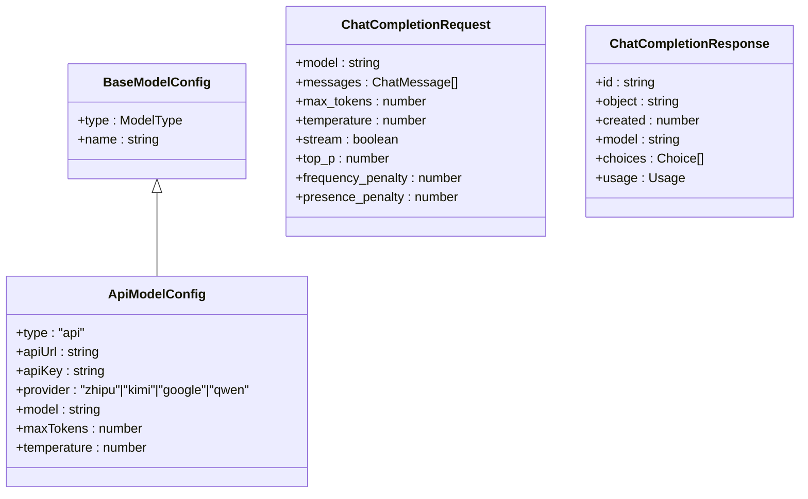
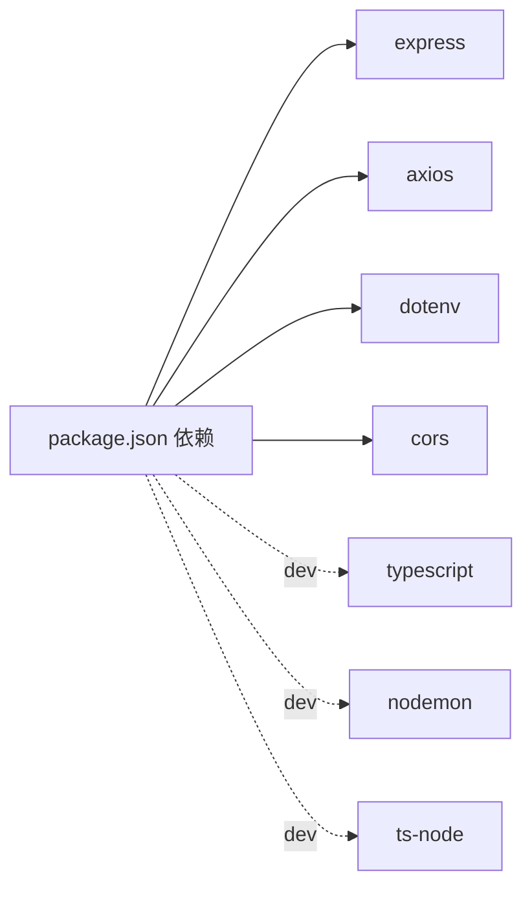

# Google Gemini 集成

<cite>
**本文引用的文件**
- [src/config/models/gemini.ts](file://src/config/models/gemini.ts)
- [src/config/models/google.ts](file://src/config/models/google.ts)
- [src/config/models/base.ts](file://src/config/models/base.ts)
- [src/config/config.ts](file://src/config/config.ts)
- [src/handlers/api.ts](file://src/handlers/api.ts)
- [src/handlers/base.ts](file://src/handlers/base.ts)
- [src/types/config.ts](file://src/types/config.ts)
- [src/types/api.ts](file://src/types/api.ts)
- [src/utils/retry.ts](file://src/utils/retry.ts)
- [src/server.ts](file://src/server.ts)
- [package.json](file://package.json)
</cite>

## 目录
1. [简介](#简介)
2. [项目结构](#项目结构)
3. [核心组件](#核心组件)
4. [架构总览](#架构总览)
5. [详细组件分析](#详细组件分析)
6. [依赖关系分析](#依赖关系分析)
7. [性能考量](#性能考量)
8. [故障排除指南](#故障排除指南)
9. [结论](#结论)
10. [附录](#附录)

## 简介
本文件面向希望在现有代理服务中集成 Google Gemini 模型的开发者，系统性说明 GeminiModelProvider 与 GoogleModelProvider 的实现细节、Google AI Studio API 的配置与认证方式、请求参数规范、多模态能力现状与限制、模型版本管理与安全过滤配置要点、以及与 Google Cloud 平台的集成注意事项、成本与配额管理建议、故障排除与性能调优实践。

当前代码库通过统一的模型提供者抽象，将 Gemini 的 OpenAI 兼容端点与标准端点分别映射为两个模型标识，从而以统一的 OpenAI 兼容协议对外提供服务。这使得在不修改上层调用逻辑的前提下，透明地接入 Gemini 的两大能力面：OpenAI 兼容聊天补全与标准 Gemini API。

## 项目结构
该代理服务采用分层设计：
- 配置层：集中管理各模型提供者的可用性、API Key、基础 URL 与模型清单
- 类型层：定义通用模型配置、应用配置与请求/响应结构
- 处理层：统一处理 OpenAI 兼容的聊天补全请求，并按模型配置转发到对应上游
- 服务器层：Express 应用，注册路由、中间件与健康检查

图表来源
- [src/config/config.ts:69-99](file://src/config/config.ts#L69-L99)
- [src/config/models/gemini.ts:4-34](file://src/config/models/gemini.ts#L4-L34)
- [src/config/models/google.ts:4-34](file://src/config/models/google.ts#L4-L34)
- [src/config/models/base.ts:3-7](file://src/config/models/base.ts#L3-L7)
- [src/types/config.ts:8-16](file://src/types/config.ts#L8-L16)
- [src/types/api.ts:11-20](file://src/types/api.ts#L11-L20)
- [src/handlers/api.ts:30-121](file://src/handlers/api.ts#L30-L121)
- [src/utils/retry.ts:1-26](file://src/utils/retry.ts#L1-L26)
- [src/server.ts:29-40](file://src/server.ts#L29-L40)

章节来源
- [src/server.ts:1-88](file://src/server.ts#L1-L88)
- [src/config/config.ts:1-123](file://src/config/config.ts#L1-L123)
- [src/config/models/base.ts:1-13](file://src/config/models/base.ts#L1-L13)
- [src/types/config.ts:1-48](file://src/types/config.ts#L1-L48)
- [src/types/api.ts:1-58](file://src/types/api.ts#L1-L58)

## 核心组件
- 模型提供者抽象与实现
  - BaseModelProvider：定义统一接口，包括 isAvailable、getProviderName、getModels
  - GeminiProvider：面向 OpenAI 兼容端点，模型标识为 gemini-2.5-pro
  - GoogleProvider：面向标准 Gemini 端点，模型标识为 gemini-pro
- 配置管理器
  - ConfigManager：从环境变量加载 API Key 与 URL，初始化各模型提供者并将模型清单合并到全局配置
- 请求处理
  - BaseHandler：统一校验请求参数与错误响应
  - ApiHandler：将请求转换为 OpenAI 兼容格式，注入 Authorization Bearer，转发至上游，支持流式与非流式响应
- 重试机制
  - withRetry：基于最大重试次数与递增延迟进行指数退避重试

章节来源
- [src/config/models/base.ts:3-13](file://src/config/models/base.ts#L3-L13)
- [src/config/models/gemini.ts:4-34](file://src/config/models/gemini.ts#L4-L34)
- [src/config/models/google.ts:4-34](file://src/config/models/google.ts#L4-L34)
- [src/config/config.ts:69-99](file://src/config/config.ts#L69-L99)
- [src/handlers/base.ts:10-22](file://src/handlers/base.ts#L10-L22)
- [src/handlers/api.ts:30-121](file://src/handlers/api.ts#L30-L121)
- [src/utils/retry.ts:1-26](file://src/utils/retry.ts#L1-L26)

## 架构总览
下图展示从客户端到上游 Gemini API 的完整调用链路，包括认证、参数转换与响应透传。

图表来源
- [src/server.ts:29-40](file://src/server.ts#L29-L40)
- [src/handlers/api.ts:30-121](file://src/handlers/api.ts#L30-L121)
- [src/utils/retry.ts:1-26](file://src/utils/retry.ts#L1-L26)

## 详细组件分析

### GeminiProvider（OpenAI 兼容端点）
- 可用性判断：当配置中存在 API Key 且未显式禁用时可用
- 提供名称：google
- 模型清单：gemini-2.5-pro
- 上游端点：默认 https://generativelanguage.googleapis.com/v1beta/openai
- 认证方式：Authorization: Bearer <apiKey>
- 参数映射：请求体保持 OpenAI 兼容格式，代理会注入模型名与消息序列

图表来源
- [src/config/models/base.ts:3-7](file://src/config/models/base.ts#L3-L7)
- [src/config/models/gemini.ts:4-34](file://src/config/models/gemini.ts#L4-L34)

章节来源
- [src/config/models/gemini.ts:4-34](file://src/config/models/gemini.ts#L4-L34)
- [src/config/config.ts:86-91](file://src/config/config.ts#L86-L91)

### GoogleProvider（标准 Gemini 端点）
- 可用性判断：当配置中存在 API Key 且未显式禁用时可用
- 提供名称：google
- 模型清单：gemini-pro
- 上游端点：默认 https://generativelanguage.googleapis.com/v1beta
- 认证方式：Authorization: Bearer <apiKey>
- 参数映射：请求体保持 OpenAI 兼容格式，代理会注入模型名与消息序列

图表来源
- [src/config/models/base.ts:3-7](file://src/config/models/base.ts#L3-L7)
- [src/config/models/google.ts:4-34](file://src/config/models/google.ts#L4-L34)

章节来源
- [src/config/models/google.ts:4-34](file://src/config/models/google.ts#L4-L34)
- [src/config/config.ts:86-91](file://src/config/config.ts#L86-L91)

### 配置管理与模型注册
- 环境变量要求：至少需配置一个提供者的 API Key；Gemini 对应 GEMINI_API_KEY
- 初始化流程：实例化 ConfigManager -> 校验必要环境变量 -> 初始化应用配置 -> 注册各模型提供者 -> 合并模型清单
- 模型注册：将 GeminiProvider 与 GoogleProvider 的模型映射合并到全局 ModelConfigs

图表来源
- [src/config/config.ts:29-99](file://src/config/config.ts#L29-L99)

章节来源
- [src/config/config.ts:29-99](file://src/config/config.ts#L29-L99)

### 请求处理与认证
- 请求校验：确保 model 与 messages 存在且格式正确
- 认证头：统一添加 Authorization: Bearer <apiKey>
- 参数转换：将请求体转换为 OpenAI 兼容格式，注入 model 字段与消息序列
- 流式支持：根据 stream 标志设置响应头并透传上游流
- 错误处理：捕获上游错误，解析流式错误内容，构造统一错误响应

图表来源
- [src/handlers/api.ts:30-196](file://src/handlers/api.ts#L30-L196)
- [src/handlers/base.ts:10-22](file://src/handlers/base.ts#L10-L22)
- [src/utils/retry.ts:1-26](file://src/utils/retry.ts#L1-L26)

章节来源
- [src/handlers/api.ts:30-196](file://src/handlers/api.ts#L30-L196)
- [src/handlers/base.ts:10-22](file://src/handlers/base.ts#L10-L22)

### 数据模型与类型约束
- ApiModelConfig：统一承载 type、apiUrl、apiKey、provider、model 等字段
- ChatCompletionRequest/Response：OpenAI 兼容的消息结构与响应结构
- BaseModelConfig：基础模型信息，ApiModelConfig 继承之

图表来源
- [src/types/config.ts:3-16](file://src/types/config.ts#L3-L16)
- [src/types/api.ts:11-37](file://src/types/api.ts#L11-L37)

章节来源
- [src/types/config.ts:1-48](file://src/types/config.ts#L1-L48)
- [src/types/api.ts:1-58](file://src/types/api.ts#L1-L58)

## 依赖关系分析
- 运行时依赖：express、axios、dotenv、cors
- 开发依赖：@types/*、ts-node、nodemon、rimraf、typescript
- 关键运行脚本：dev、build、start、dev:watch、type-check、clean

图表来源
- [package.json:14-29](file://package.json#L14-L29)

章节来源
- [package.json:1-30](file://package.json#L1-L30)

## 性能考量
- 重试策略：withRetry 实现递增延迟的指数退避，减少上游瞬时压力并提升成功率
- 超时控制：通过 AppConfig.requestTimeout 控制单次请求超时时间
- 流式传输：开启 stream 时直接透传上游流，降低内存占用与延迟
- 日志与可观测性：在关键节点输出请求/响应状态与错误详情，便于定位性能瓶颈

章节来源
- [src/utils/retry.ts:1-26](file://src/utils/retry.ts#L1-L26)
- [src/config/config.ts:53-67](file://src/config/config.ts#L53-L67)
- [src/handlers/api.ts:35-44](file://src/handlers/api.ts#L35-L44)

## 故障排除指南
- 环境变量缺失
  - 现象：启动时报错“至少需要配置一个API密钥”
  - 排查：确认 GEMINI_API_KEY 已设置；若使用自定义 URL，可设置 GEMINI_API_URL
- 模型不可用
  - 现象：模型列表中无 gemini-* 相关模型
  - 排查：检查 GEMINI_API_KEY 是否为空；确认 ConfigManager 初始化流程已执行
- 认证失败
  - 现象：上游返回 401/403
  - 排查：确认 Authorization 头是否正确添加；核对 API Key 有效性与权限范围
- 请求超时
  - 现象：日志显示超时或上游响应缓慢
  - 排查：调整 AppConfig.requestTimeout；适当增加重试次数与延迟
- 流式错误
  - 现象：流式响应中出现错误但难以解析
  - 排查：ApiHandler 已尝试读取流式错误内容并解析 JSON；检查上游返回格式与网络稳定性
- 参数不兼容
  - 现象：某些字段导致上游拒绝请求
  - 排查：GeminiProvider/GoogleProvider 使用 OpenAI 兼容格式；注意上游实际支持的字段差异

章节来源
- [src/config/config.ts:29-51](file://src/config/config.ts#L29-L51)
- [src/config/config.ts:86-91](file://src/config/config.ts#L86-L91)
- [src/handlers/api.ts:124-164](file://src/handlers/api.ts#L124-L164)

## 结论
本代理服务通过统一的模型提供者抽象与 OpenAI 兼容协议，实现了对 Google Gemini 的无缝接入。GeminiProvider 与 GoogleProvider 分别覆盖了 OpenAI 兼容端点与标准 Gemini 端点，满足不同场景下的调用需求。结合统一的认证、参数转换、流式透传与重试机制，能够在保证易用性的同时获得较好的稳定性与性能表现。

## 附录

### 配置与部署要点
- 环境变量
  - GEMINI_API_KEY：Gemini API Key
  - GEMINI_API_URL：可选，自定义上游端点（默认已内置）
  - PORT/HOST：服务监听端口与主机
  - MAX_RETRIES/RETRY_DELAY/REQUEST_TIMEOUT：重试次数、递增延迟与请求超时
- 启动与开发
  - 开发模式：npm run dev 或 npm run dev:watch
  - 生产模式：npm run build 与 npm start

章节来源
- [src/config/config.ts:29-67](file://src/config/config.ts#L29-L67)
- [package.json:6-13](file://package.json#L6-L13)

### 与 Google Cloud 平台的集成注意事项
- API Key 来源：在 Google AI Studio 或 Cloud Console 中生成并妥善保管
- 端点选择：OpenAI 兼容端点适合快速迁移；标准端点可获得更多原生能力
- 安全与配额：建议在 Google Cloud Console 中启用配额与预算告警，避免超额使用
- 成本估算：根据实际调用次数与上下文长度估算，建议开启日志与监控以便追踪

[本节为通用实践建议，无需特定文件引用]