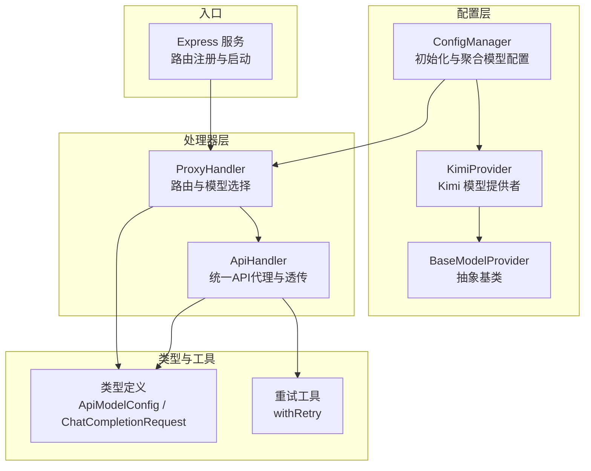
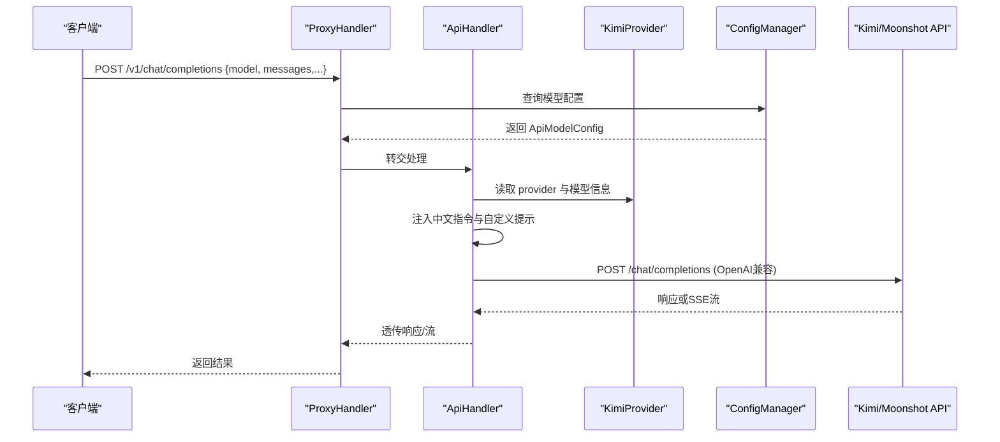
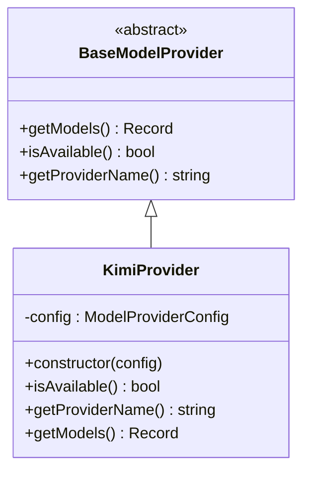
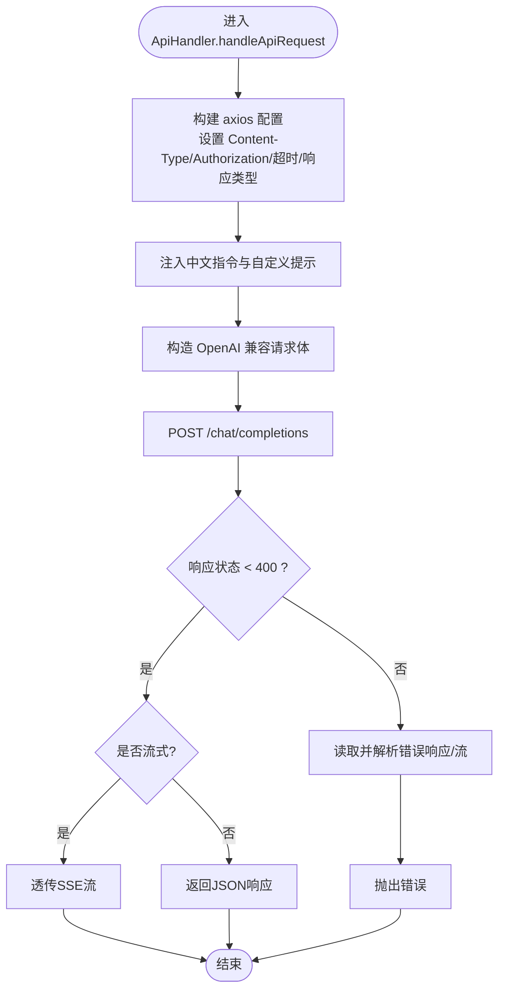
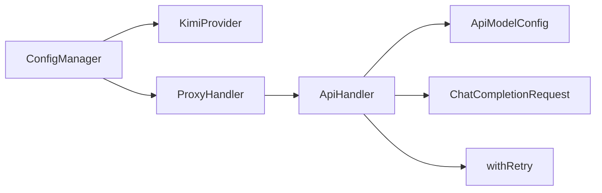

# Kimi 集成

<cite>
**本文档引用的文件**
- [src/config/models/kimi.ts](file://src/config/models/kimi.ts)
- [src/config/models/base.ts](file://src/config/models/base.ts)
- [src/config/config.ts](file://src/config/config.ts)
- [src/handlers/api.ts](file://src/handlers/api.ts)
- [src/handlers/proxy.ts](file://src/handlers/proxy.ts)
- [src/handlers/base.ts](file://src/handlers/base.ts)
- [src/types/config.ts](file://src/types/config.ts)
- [src/types/api.ts](file://src/types/api.ts)
- [src/server.ts](file://src/server.ts)
- [src/utils/retry.ts](file://src/utils/retry.ts)
- [package.json](file://package.json)
</cite>

## 目录
1. [简介](#简介)
2. [项目结构](#项目结构)
3. [核心组件](#核心组件)
4. [架构总览](#架构总览)
5. [详细组件分析](#详细组件分析)
6. [依赖关系分析](#依赖关系分析)
7. [性能考虑](#性能考虑)
8. [故障排查指南](#故障排查指南)
9. [结论](#结论)
10. [附录](#附录)

## 简介
本文件面向希望在现有代理服务中集成 Kimi（Moonshot）模型的开发者，提供从配置到调用、从认证到请求格式、从性能优化到故障排查的完整指南。重点覆盖 KimiProvider 的实现细节、Kimi API 的特殊配置要求、认证流程、请求格式规范，以及 Kimi 在长文本处理方面的优势与注意事项。

## 项目结构
该代理服务采用模块化设计，按“配置层-处理器层-类型定义-工具层-入口”组织。Kimi 集成位于配置层的 Provider 子系统，并通过统一的代理处理器完成请求转发与响应透传。

图表来源
- [src/config/config.ts:69-99](file://src/config/config.ts#L69-L99)
- [src/config/models/kimi.ts:4-34](file://src/config/models/kimi.ts#L4-L34)
- [src/handlers/proxy.ts:6-37](file://src/handlers/proxy.ts#L6-L37)
- [src/handlers/api.ts:8-28](file://src/handlers/api.ts#L8-L28)
- [src/types/config.ts:8-16](file://src/types/config.ts#L8-L16)
- [src/utils/retry.ts:1-34](file://src/utils/retry.ts#L1-L34)
- [src/server.ts:29-40](file://src/server.ts#L29-L40)

章节来源
- [src/server.ts:29-40](file://src/server.ts#L29-L40)
- [src/config/config.ts:69-99](file://src/config/config.ts#L69-L99)

## 核心组件
- KimiProvider：负责声明 Kimi 可用模型、提供模型标识与基础配置（API 地址、密钥等），并以 OpenAI 兼容格式暴露给上层。
- ConfigManager：集中加载环境变量、校验必要密钥、初始化各 Provider 并合并模型配置。
- ApiHandler：统一处理 Chat Completions 请求，注入中文交流指令与自定义系统提示，构造 OpenAI 兼容请求体，透传响应（含流式）。
- ProxyHandler：路由分发与模型选择，根据请求中的 model 字段匹配对应模型配置。
- 类型系统：统一描述模型配置、请求/响应结构与环境变量键名，确保跨 Provider 的一致性。

章节来源
- [src/config/models/kimi.ts:4-34](file://src/config/models/kimi.ts#L4-L34)
- [src/config/config.ts:69-99](file://src/config/config.ts#L69-L99)
- [src/handlers/api.ts:8-28](file://src/handlers/api.ts#L8-L28)
- [src/handlers/proxy.ts:6-37](file://src/handlers/proxy.ts#L6-L37)
- [src/types/config.ts:8-16](file://src/types/config.ts#L8-L16)

## 架构总览
下图展示 Kimi 集成在整体架构中的位置与交互流程。

图表来源
- [src/handlers/proxy.ts:9-32](file://src/handlers/proxy.ts#L9-L32)
- [src/handlers/api.ts:30-196](file://src/handlers/api.ts#L30-L196)
- [src/config/models/kimi.ts:20-33](file://src/config/models/kimi.ts#L20-L33)
- [src/config/config.ts:69-99](file://src/config/config.ts#L69-L99)

## 详细组件分析

### KimiProvider 实现细节
- 可用性判断：当配置中存在 API 密钥且未显式禁用时视为可用。
- 提供名称：固定返回提供商标识。
- 模型声明：返回单个模型标识，包含：
  - 类型：api
  - API 地址：若未显式配置则使用默认地址
  - API 密钥：来自配置
  - 提供商：kimi
  - 名称：Kimi K2
  - 模型名：moonshot-v1-8k（用于实际调用）

图表来源
- [src/config/models/base.ts:3-7](file://src/config/models/base.ts#L3-L7)
- [src/config/models/kimi.ts:4-34](file://src/config/models/kimi.ts#L4-L34)

章节来源
- [src/config/models/kimi.ts:12-33](file://src/config/models/kimi.ts#L12-L33)

### 认证流程与请求格式
- 认证方式：统一使用 Bearer Token，在请求头 Authorization 中携带。
- 请求目标：Kimi API 使用 OpenAI 兼容端点 /chat/completions。
- 请求体字段：遵循 OpenAI 兼容格式，包含 model、messages、可选参数（如 stream、temperature、max_tokens 等）。
- 特殊增强：在首个系统消息后自动注入中文交流指令与自定义系统提示（若配置了 CUSTOM_SYSTEM_PROMPT）。
- 流式输出：当客户端请求 stream=true 时，服务端保持 SSE 流并透传至客户端。

图表来源
- [src/handlers/api.ts:30-196](file://src/handlers/api.ts#L30-L196)
- [src/types/api.ts:11-20](file://src/types/api.ts#L11-L20)

章节来源
- [src/handlers/api.ts:35-114](file://src/handlers/api.ts#L35-L114)
- [src/types/api.ts:11-37](file://src/types/api.ts#L11-L37)

### 配置与环境变量
- 必需密钥：至少需配置一个 Provider 的 API 密钥（包括 KIMI_API_KEY）。
- 端口与超时：可通过环境变量设置监听地址、端口、最大重试次数、重试延迟、请求超时。
- 自定义系统提示：CUSTOM_SYSTEM_PROMPT 可注入到系统消息链中。
- 模型暴露：通过 /v1/models 接口返回已加载模型清单；通过 /health 接口进行健康检查。

章节来源
- [src/config/config.ts:29-51](file://src/config/config.ts#L29-L51)
- [src/config/config.ts:53-67](file://src/config/config.ts#L53-L67)
- [src/server.ts:29-40](file://src/server.ts#L29-L40)

### Kimi 特有功能与参数
- 模型能力：当前仅暴露 moonshot-v1-8k（标识为 kimmi-k2-0905-preview），适合长文本与复杂任务。
- 参数支持：支持 OpenAI 兼容参数（如 temperature、max_tokens、stream 等），具体行为以 Kimi API 文档为准。
- 多模态：当前实现未启用多模态输入；如需扩展，请参考 OpenAI 兼容的消息结构并在上游 API 支持时添加。

章节来源
- [src/config/models/kimi.ts:24-31](file://src/config/models/kimi.ts#L24-L31)
- [src/types/api.ts:11-20](file://src/types/api.ts#L11-L20)

### 使用示例（基于现有实现）
- 获取 API 密钥：在环境变量中设置 KIMI_API_KEY；可选设置 KIMI_API_URL。
- 启动服务：运行开发脚本或构建后启动。
- 调用示例（OpenAI 兼容格式）：
  - POST /v1/chat/completions
  - Body 包含 model、messages（数组，每项含 role 与 content）、可选 stream、temperature、max_tokens 等
- 模型查询：GET /v1/models
- 健康检查：GET /health

章节来源
- [src/config/config.ts:79-84](file://src/config/config.ts#L79-L84)
- [src/server.ts:36-40](file://src/server.ts#L36-L40)
- [src/types/api.ts:11-20](file://src/types/api.ts#L11-L20)

## 依赖关系分析
- 依赖注入：ConfigManager 在初始化阶段实例化 KimiProvider，并将其模型配置合并到全局模型字典。
- 统一代理：ProxyHandler 仅依据 model 字段选择配置，ApiHandler 负责实际请求与响应透传。
- 类型约束：ApiModelConfig 与 ChatCompletionRequest 确保跨 Provider 的兼容性。

图表来源
- [src/config/config.ts:69-99](file://src/config/config.ts#L69-L99)
- [src/handlers/proxy.ts:6-37](file://src/handlers/proxy.ts#L6-L37)
- [src/handlers/api.ts:8-28](file://src/handlers/api.ts#L8-L28)
- [src/utils/retry.ts:1-34](file://src/utils/retry.ts#L1-L34)

章节来源
- [src/config/config.ts:69-99](file://src/config/config.ts#L69-L99)
- [src/handlers/proxy.ts:6-37](file://src/handlers/proxy.ts#L6-L37)
- [src/handlers/api.ts:8-28](file://src/handlers/api.ts#L8-L28)

## 性能考虑
- 连接复用：针对 Kimi 的 HTTPS Agent 启用 keepAlive，有助于降低连接建立开销。
- 超时与重试：通过环境变量配置请求超时与重试策略；withRetry 实现带递增延迟的指数退避。
- 流式传输：在 stream=true 时保持 SSE 流式响应，减少内存占用并提升交互体验。
- 日志与可观测性：关键步骤均输出日志，便于定位性能瓶颈与异常。

章节来源
- [src/handlers/api.ts:50-56](file://src/handlers/api.ts#L50-L56)
- [src/utils/retry.ts:1-34](file://src/utils/retry.ts#L1-L34)
- [src/server.ts:49-83](file://src/server.ts#L49-L83)

## 故障排查指南
- 缺少模型或不支持的模型：检查 /v1/models 列表，确认 model 字段是否正确。
- 认证失败：确认 KIMI_API_KEY 已设置且未被覆盖为空。
- 请求超时：适当增大 REQUEST_TIMEOUT，或减少单次请求的上下文长度。
- 流式错误：当响应为流时，错误内容可能需要读取流后再解析；查看服务端日志中的错误详情。
- 重试策略：若网络不稳定，可调整 MAX_RETRIES 与 RETRY_DELAY；注意避免过度重试导致资源浪费。

章节来源
- [src/handlers/proxy.ts:14-24](file://src/handlers/proxy.ts#L14-L24)
- [src/handlers/api.ts:123-164](file://src/handlers/api.ts#L123-L164)
- [src/config/config.ts:53-67](file://src/config/config.ts#L53-L67)

## 结论
通过 KimiProvider 与统一的 ApiHandler，本代理服务实现了对 Kimi（Moonshot）模型的无缝集成。其关键优势在于：
- OpenAI 兼容的请求格式，降低迁移成本
- 自动注入中文交流指令与自定义提示，提升本地化体验
- 流式响应与可配置的重试/超时策略，兼顾性能与稳定性
- 清晰的配置与日志体系，便于运维与排障

## 附录

### 环境变量与默认值
- KIMI_API_KEY：Kimi API 密钥（必需）
- KIMI_API_URL：Kimi API 地址，默认为 Moonshot 官方地址
- CUSTOM_SYSTEM_PROMPT：自定义系统提示（可选）
- PORT/HOST：服务监听端口与主机（默认 3000/0.0.0.0）
- MAX_RETRIES/RETRY_DELAY/REQUEST_TIMEOUT：重试次数、重试延迟、请求超时（毫秒）

章节来源
- [src/config/config.ts:30-50](file://src/config/config.ts#L30-L50)
- [src/config/config.ts:53-67](file://src/config/config.ts#L53-L67)
- [src/types/config.ts:33-48](file://src/types/config.ts#L33-L48)

### 依赖与版本
- axios、express、cors、dotenv 等运行时依赖
- TypeScript 开发与编译配置

章节来源
- [package.json:14-29](file://package.json#L14-L29)