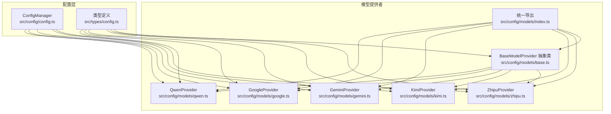
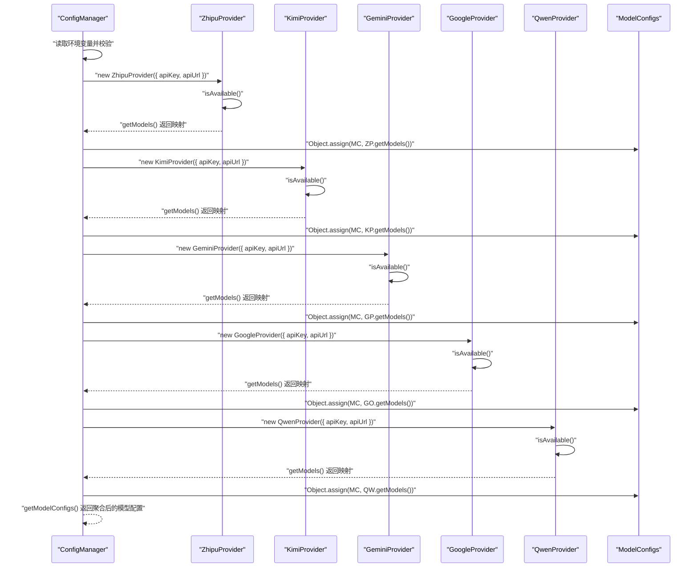
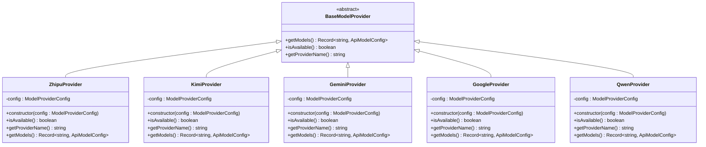
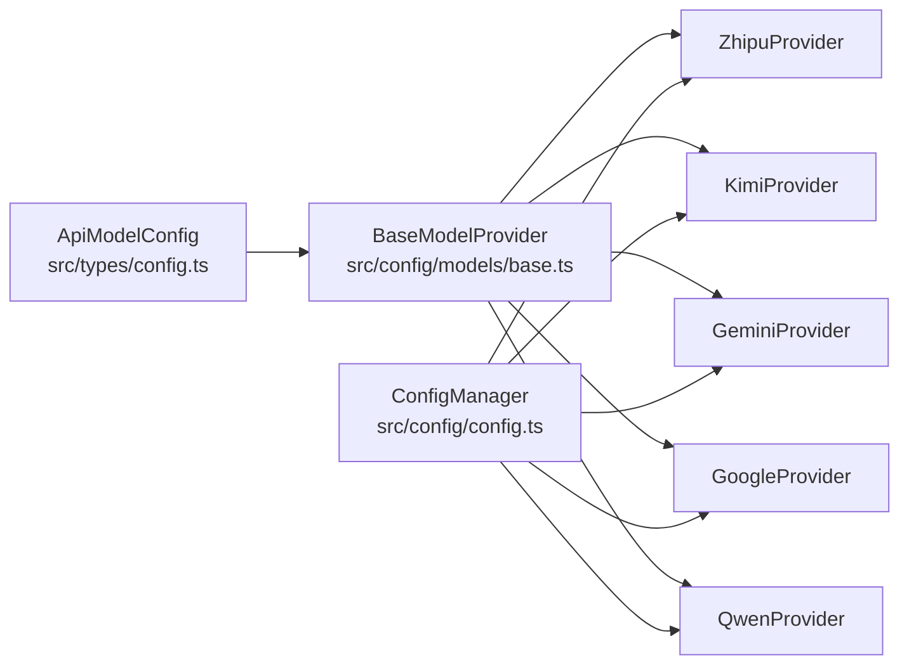

# 基础模型提供者

<cite>
**本文引用的文件**
- [src/config/models/base.ts](file://src/config/models/base.ts)
- [src/config/models/index.ts](file://src/config/models/index.ts)
- [src/config/models/gemini.ts](file://src/config/models/gemini.ts)
- [src/config/models/google.ts](file://src/config/models/google.ts)
- [src/config/models/qwen.ts](file://src/config/models/qwen.ts)
- [src/config/models/zhipu.ts](file://src/config/models/zhipu.ts)
- [src/config/models/kimi.ts](file://src/config/models/kimi.ts)
- [src/config/config.ts](file://src/config/config.ts)
- [src/types/config.ts](file://src/types/config.ts)
</cite>

## 目录
1. [简介](#简介)
2. [项目结构](#项目结构)
3. [核心组件](#核心组件)
4. [架构总览](#架构总览)
5. [详细组件分析](#详细组件分析)
6. [依赖关系分析](#依赖关系分析)
7. [性能考量](#性能考量)
8. [故障排查指南](#故障排查指南)
9. [结论](#结论)
10. [附录](#附录)

## 简介
本文件围绕 BaseModelProvider 抽象基类及其配套接口 ModelProviderConfig 进行系统化文档化，目标包括：
- 解释抽象基类的设计理念与在模型提供者体系中的核心地位
- 明确 getModels()、isAvailable()、getProviderName() 等核心抽象方法的职责与实现要求
- 详解 ModelProviderConfig 的配置项（apiKey、apiUrl、enabled）及其使用场景
- 提供最佳实践指南：如何正确继承与实现子类
- 展示正确的实现模式与常见错误避免
- 说明扩展机制与在整体配置管理中的协作方式

## 项目结构
该项目采用按功能域分层的组织方式，模型提供者相关代码集中在 src/config/models 目录下，并通过统一入口导出，配合全局配置管理器集中初始化与聚合各提供者的模型配置。

图表来源
- [src/config/config.ts:1-121](file://src/config/config.ts#L1-L121)
- [src/config/models/base.ts:1-13](file://src/config/models/base.ts#L1-L13)
- [src/config/models/index.ts:1-5](file://src/config/models/index.ts#L1-L5)
- [src/config/models/zhipu.ts:1-34](file://src/config/models/zhipu.ts#L1-L34)
- [src/config/models/kimi.ts:1-34](file://src/config/models/kimi.ts#L1-L34)
- [src/config/models/gemini.ts:1-34](file://src/config/models/gemini.ts#L1-L34)
- [src/config/models/google.ts:1-34](file://src/config/models/google.ts#L1-L34)
- [src/config/models/qwen.ts:1-35](file://src/config/models/qwen.ts#L1-L35)
- [src/types/config.ts:1-48](file://src/types/config.ts#L1-L48)

章节来源
- [src/config/models/base.ts:1-13](file://src/config/models/base.ts#L1-L13)
- [src/config/models/index.ts:1-5](file://src/config/models/index.ts#L1-L5)
- [src/config/config.ts:1-121](file://src/config/config.ts#L1-L121)
- [src/types/config.ts:1-48](file://src/types/config.ts#L1-L48)

## 核心组件
本节聚焦 BaseModelProvider 抽象基类与 ModelProviderConfig 接口，明确其职责边界与契约。

- BaseModelProvider 抽象类
  - 定义三个必须由子类实现的抽象方法：
    - getModels(): 返回模型映射表，键为模型标识符，值为 ApiModelConfig
    - isAvailable(): 判断当前提供者是否可用（通常基于 apiKey 与 enabled）
    - getProviderName(): 返回提供者名称字符串，用于标识与路由
  - 作为所有具体提供者（如 ZhipuProvider、KimiProvider、GeminiProvider、QwenProvider、GoogleProvider）的共同父类，确保统一的生命周期与能力接口

- ModelProviderConfig 接口
  - 作用：承载提供者所需的最小配置集合
  - 字段：
    - apiKey?: string；用于鉴权的密钥
    - apiUrl?: string；可选的自定义 API 地址，若未提供则使用默认地址
    - enabled?: boolean；控制提供者是否启用，默认启用
  - 使用场景：
    - 在构造函数中接收配置对象
    - 在 isAvailable() 中校验 apiKey 是否存在且 enabled 不为 false
    - 在 getModels() 中为每个模型填充 apiUrl 与 apiKey

章节来源
- [src/config/models/base.ts:3-13](file://src/config/models/base.ts#L3-L13)
- [src/types/config.ts:8-16](file://src/types/config.ts#L8-L16)

## 架构总览
BaseModelProvider 在整个系统中的定位是“抽象契约 + 统一行为”，具体提供者负责“数据源适配”。ConfigManager 负责从环境变量读取配置，实例化各提供者并聚合模型配置。

图表来源
- [src/config/config.ts:67-97](file://src/config/config.ts#L67-L97)
- [src/config/models/zhipu.ts:4-34](file://src/config/models/zhipu.ts#L4-L34)
- [src/config/models/kimi.ts:4-34](file://src/config/models/kimi.ts#L4-L34)
- [src/config/models/gemini.ts:4-34](file://src/config/models/gemini.ts#L4-L34)
- [src/config/models/google.ts:4-34](file://src/config/models/google.ts#L4-L34)
- [src/config/models/qwen.ts:4-35](file://src/config/models/qwen.ts#L4-L35)

章节来源
- [src/config/config.ts:1-121](file://src/config/config.ts#L1-L121)

## 详细组件分析

### BaseModelProvider 抽象基类
- 设计理念
  - 通过抽象方法约束子类必须提供“可用性判断”“提供者名称”“模型清单”的能力
  - 将“配置注入”与“能力实现”解耦，便于扩展新的提供者而无需修改调用方逻辑
- 方法职责
  - getModels(): 返回模型映射；当 isAvailable() 为假时应返回空映射，避免污染全局配置
  - isAvailable(): 基于 apiKey 存在性与 enabled 状态判断；建议不显式传入 enabled=false 时视为可用
  - getProviderName(): 返回稳定字符串，用于路由与日志标识
- 实现要求
  - 子类必须在构造函数中保存 ModelProviderConfig
  - getModels() 内部先调用 isAvailable()，再根据配置生成 ApiModelConfig 列表
  - ApiModelConfig 的 provider 字段需与 getProviderName() 返回值一致，便于系统识别

图表来源
- [src/config/models/base.ts:3-13](file://src/config/models/base.ts#L3-L13)
- [src/config/models/zhipu.ts:4-34](file://src/config/models/zhipu.ts#L4-L34)
- [src/config/models/kimi.ts:4-34](file://src/config/models/kimi.ts#L4-L34)
- [src/config/models/gemini.ts:4-34](file://src/config/models/gemini.ts#L4-L34)
- [src/config/models/google.ts:4-34](file://src/config/models/google.ts#L4-L34)
- [src/config/models/qwen.ts:4-35](file://src/config/models/qwen.ts#L4-L35)

章节来源
- [src/config/models/base.ts:3-13](file://src/config/models/base.ts#L3-L13)

### ModelProviderConfig 配置接口
- 字段说明
  - apiKey?: string
    - 必填字段之一；用于鉴权
    - 若为空，则 isAvailable() 应返回 false，从而阻止 getModels() 注入任何模型
  - apiUrl?: string
    - 可选；若未提供，子类应在 getModels() 中提供合理的默认地址
  - enabled?: boolean
    - 控制提供者是否启用；默认启用
    - 当显式设置为 false 时，isAvailable() 应返回 false
- 使用场景
  - ConfigManager 在初始化时从环境变量读取并构造 ModelProviderConfig
  - 各 Provider 在 getModels() 中将 apiUrl 与 apiKey 注入到 ApiModelConfig

章节来源
- [src/config/models/base.ts:9-13](file://src/config/models/base.ts#L9-L13)
- [src/config/config.ts:67-97](file://src/config/config.ts#L67-L97)

### 具体提供者实现模式
- 共同特征
  - 构造函数接收 ModelProviderConfig 并保存
  - isAvailable() 基于 apiKey 与 enabled 判断
  - getProviderName() 返回稳定字符串（与 provider 字段保持一致）
  - getModels() 先调用 isAvailable()，再返回模型映射
- 默认地址策略
  - 各 Provider 在 getModels() 中为模型填充 apiUrl，若未提供则使用默认地址
- 示例路径
  - [ZhipuProvider 实现:4-34](file://src/config/models/zhipu.ts#L4-L34)
  - [KimiProvider 实现:4-34](file://src/config/models/kimi.ts#L4-L34)
  - [GeminiProvider 实现:4-34](file://src/config/models/gemini.ts#L4-L34)
  - [GoogleProvider 实现:4-34](file://src/config/models/google.ts#L4-L34)
  - [QwenProvider 实现:4-35](file://src/config/models/qwen.ts#L4-L35)

章节来源
- [src/config/models/zhipu.ts:4-34](file://src/config/models/zhipu.ts#L4-L34)
- [src/config/models/kimi.ts:4-34](file://src/config/models/kimi.ts#L4-L34)
- [src/config/models/gemini.ts:4-34](file://src/config/models/gemini.ts#L4-L34)
- [src/config/models/google.ts:4-34](file://src/config/models/google.ts#L4-L34)
- [src/config/models/qwen.ts:4-35](file://src/config/models/qwen.ts#L4-L35)

### 配置聚合与导出
- ConfigManager
  - 从环境变量读取并校验至少一个 API 密钥
  - 依次实例化各 Provider，调用其 getModels() 并合并到全局 ModelConfigs
  - 提供 getModelConfigs()、getSupportedModels() 等查询接口
- 统一导出
  - 通过 models/index.ts 对外暴露 BaseModelProvider、ModelProviderConfig 以及各具体 Provider

章节来源
- [src/config/config.ts:1-121](file://src/config/config.ts#L1-L121)
- [src/config/models/index.ts:1-5](file://src/config/models/index.ts#L1-L5)

## 依赖关系分析
- 类型依赖
  - BaseModelProvider 依赖 ApiModelConfig（类型定义位于 types/config.ts）
  - 各 Provider 依赖 BaseModelProvider 与 ModelProviderConfig
- 运行时依赖
  - ConfigManager 依赖各 Provider 的构造与 getModels() 行为
  - Provider 的可用性由 ModelProviderConfig 的 enabled 与 apiKey 决定

图表来源
- [src/types/config.ts:8-16](file://src/types/config.ts#L8-L16)
- [src/config/models/base.ts:3-13](file://src/config/models/base.ts#L3-L13)
- [src/config/config.ts:1-121](file://src/config/config.ts#L1-L121)

章节来源
- [src/types/config.ts:1-48](file://src/types/config.ts#L1-L48)
- [src/config/models/base.ts:1-13](file://src/config/models/base.ts#L1-L13)
- [src/config/config.ts:1-121](file://src/config/config.ts#L1-L121)

## 性能考量
- 配置加载阶段
  - ConfigManager 在单例初始化时一次性构建 Provider 并聚合模型配置，避免重复 IO
- 可用性检查
  - isAvailable() 仅进行简单布尔判断，开销极低
- 模型映射
  - getModels() 返回的对象为轻量级配置映射，不包含大对象或网络请求
- 建议
  - 将 Provider 的实例缓存于 ConfigManager 内部，避免重复构造
  - 如需动态切换配置，建议在重新初始化 ConfigManager 后替换引用

## 故障排查指南
- 症状：某提供者未出现在支持列表中
  - 检查对应环境变量是否已设置（至少一个 API 密钥）
  - 检查 ModelProviderConfig.enabled 是否被显式设为 false
  - 检查 isAvailable() 的实现是否符合预期
- 症状：模型配置缺失 apiUrl
  - 确认 Provider 的 getModels() 是否在未提供 apiUrl 时提供了默认地址
- 症状：Provider 名称不一致导致路由失败
  - 确保 getProviderName() 返回值与 ApiModelConfig.provider 一致
- 症状：启动时报错“至少需要配置一个 API 密钥”
  - 检查环境变量 ZHIPU_API_KEY、KIMI_API_KEY、GEMINI_API_KEY、QWEN_API_KEY 是否至少有一个存在

章节来源
- [src/config/config.ts:27-49](file://src/config/config.ts#L27-L49)
- [src/config/models/gemini.ts:12-14](file://src/config/models/gemini.ts#L12-L14)
- [src/config/models/google.ts:12-14](file://src/config/models/google.ts#L12-L14)
- [src/config/models/qwen.ts:12-14](file://src/config/models/qwen.ts#L12-L14)
- [src/config/models/zhipu.ts:12-14](file://src/config/models/zhipu.ts#L12-L14)
- [src/config/models/kimi.ts:12-14](file://src/config/models/kimi.ts#L12-L14)

## 结论
BaseModelProvider 通过抽象契约将“可用性判断”“提供者名称”“模型清单”三要素标准化，使新增提供者只需遵循统一接口即可无缝接入。结合 ModelProviderConfig 的简洁配置与 ConfigManager 的集中聚合，系统实现了高内聚、低耦合的扩展机制。遵循本文最佳实践，可确保新提供者实现正确、健壮且易于维护。

## 附录

### 最佳实践指南
- 继承与实现
  - 在构造函数中保存 ModelProviderConfig
  - isAvailable() 仅依赖 apiKey 与 enabled，避免引入外部副作用
  - getProviderName() 返回稳定字符串，与 provider 字段保持一致
  - getModels() 先调用 isAvailable()，再返回模型映射；未启用时返回空映射
- 配置注入
  - 优先使用环境变量注入 ModelProviderConfig
  - 若未提供 apiUrl，请在 getModels() 中提供合理默认地址
- 扩展新提供者
  - 新建类继承 BaseModelProvider
  - 实现三个抽象方法
  - 在 models/index.ts 中导出新类
  - 在 ConfigManager.initializeModelConfigs() 中实例化并合并到全局配置

### 正确实现模式与常见错误避免
- 正确模式
  - 参考现有 Provider 的构造、可用性判断与模型映射实现
    - [ZhipuProvider:4-34](file://src/config/models/zhipu.ts#L4-L34)
    - [KimiProvider:4-34](file://src/config/models/kimi.ts#L4-L34)
    - [GeminiProvider:4-34](file://src/config/models/gemini.ts#L4-L34)
    - [GoogleProvider:4-34](file://src/config/models/google.ts#L4-L34)
    - [QwenProvider:4-35](file://src/config/models/qwen.ts#L4-L35)
- 常见错误
  - 忘记调用 isAvailable() 即直接返回模型映射，导致禁用的提供者仍被加入配置
  - getProviderName() 与 provider 字段不一致，导致路由或日志识别异常
  - 未处理 apiUrl 缺失的情况，导致模型配置不完整
  - 在 isAvailable() 中引入复杂逻辑（如网络请求），影响启动速度与稳定性