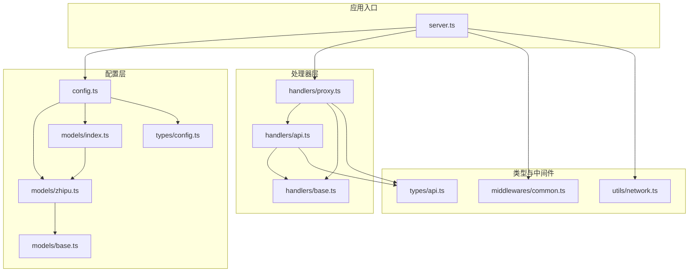
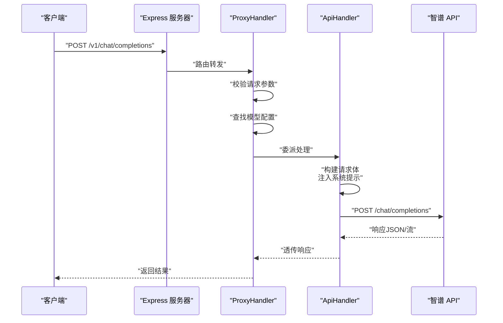
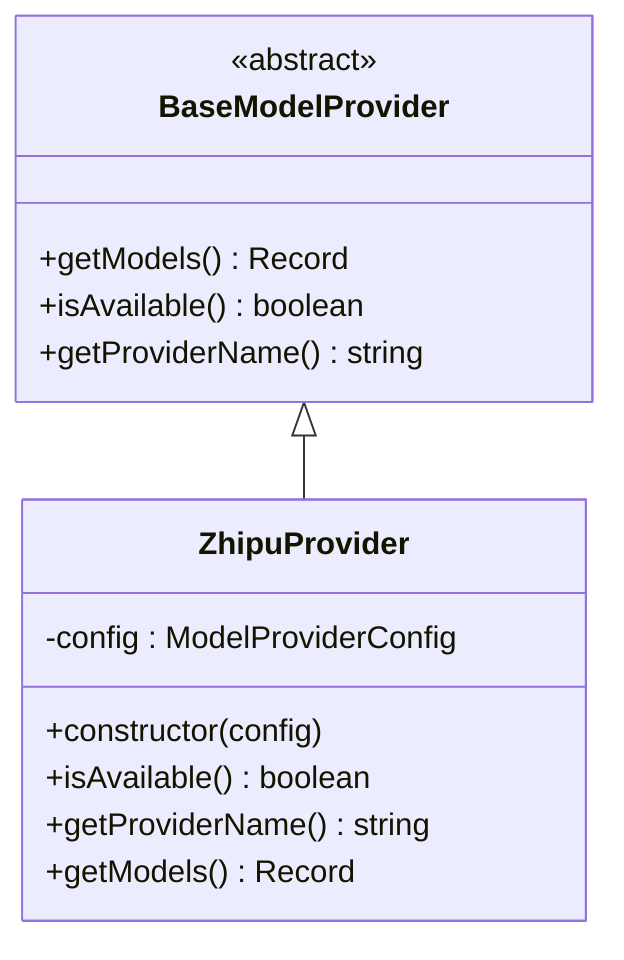
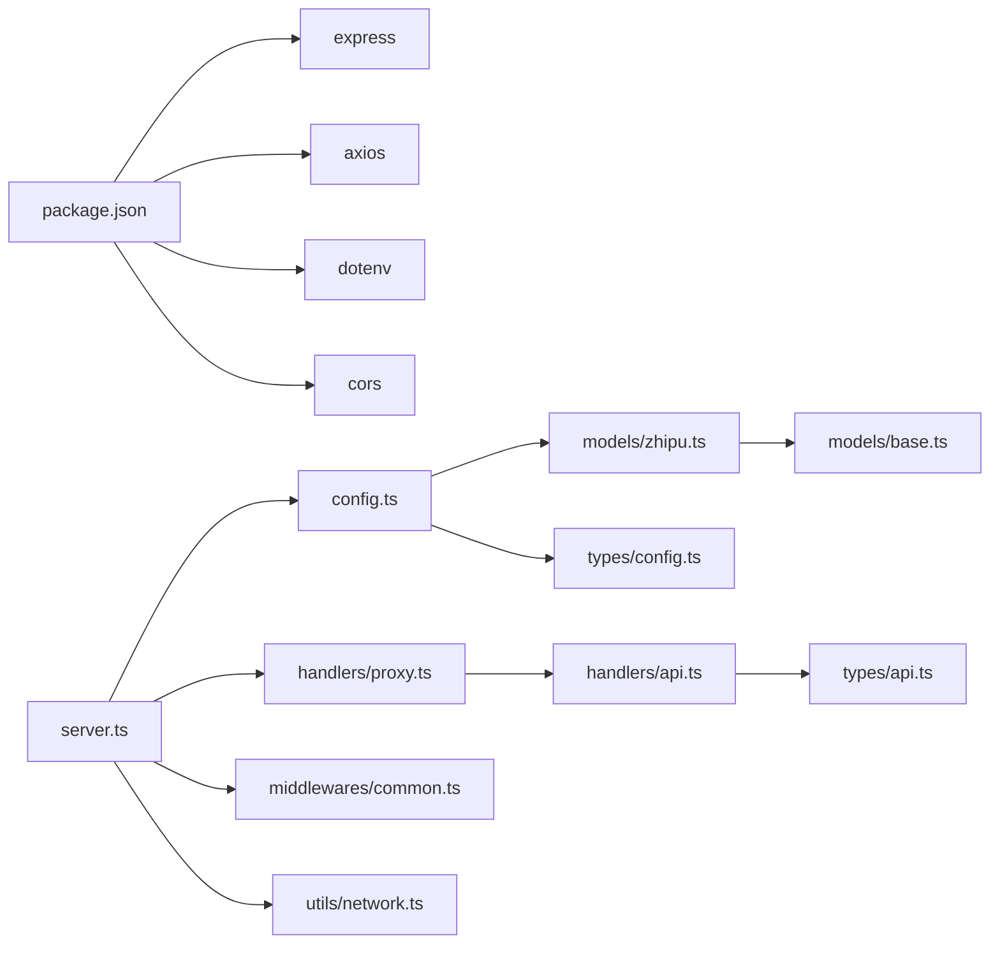

# 智谱 AI 集成

<cite>
**本文档引用的文件**
- [src/config/models/zhipu.ts](file://src/config/models/zhipu.ts)
- [src/config/models/base.ts](file://src/config/models/base.ts)
- [src/config/models/index.ts](file://src/config/models/index.ts)
- [src/config/config.ts](file://src/config/config.ts)
- [src/handlers/base.ts](file://src/handlers/base.ts)
- [src/handlers/proxy.ts](file://src/handlers/proxy.ts)
- [src/handlers/api.ts](file://src/handlers/api.ts)
- [src/types/config.ts](file://src/types/config.ts)
- [src/types/api.ts](file://src/types/api.ts)
- [src/server.ts](file://src/server.ts)
- [src/utils/network.ts](file://src/utils/network.ts)
- [src/middlewares/common.ts](file://src/middlewares/common.ts)
- [package.json](file://package.json)
</cite>

## 目录
1. [简介](#简介)
2. [项目结构](#项目结构)
3. [核心组件](#核心组件)
4. [架构总览](#架构总览)
5. [详细组件分析](#详细组件分析)
6. [依赖关系分析](#依赖关系分析)
7. [性能考虑](#性能考虑)
8. [故障排除指南](#故障排除指南)
9. [结论](#结论)
10. [附录](#附录)

## 简介
本文件面向希望在现有代理服务中集成智谱 AI（Zhipu）模型的开发者，提供从配置到实现细节的完整说明。重点覆盖：
- ZhipuProvider 的实现与可用性检测
- API 端点配置、认证机制与请求参数格式
- 模型名称映射与参数配置选项
- 响应格式处理与流式输出
- 完整配置示例与使用限制
- 故障排除与常见问题
- 与其他提供者（Kimi、Gemini、Qwen）的对比与选择建议

## 项目结构
该项目采用模块化分层设计，按功能划分为配置、处理器、类型定义、工具与中间件等层次，便于扩展新的模型提供者。

图表来源
- [src/server.ts:1-88](file://src/server.ts#L1-L88)
- [src/config/config.ts:1-123](file://src/config/config.ts#L1-L123)
- [src/config/models/zhipu.ts:1-34](file://src/config/models/zhipu.ts#L1-L34)
- [src/config/models/base.ts:1-13](file://src/config/models/base.ts#L1-L13)
- [src/config/models/index.ts:1-5](file://src/config/models/index.ts#L1-L5)
- [src/handlers/base.ts:1-40](file://src/handlers/base.ts#L1-L40)
- [src/handlers/proxy.ts:1-66](file://src/handlers/proxy.ts#L1-L66)
- [src/handlers/api.ts:1-196](file://src/handlers/api.ts#L1-L196)
- [src/types/config.ts:1-48](file://src/types/config.ts#L1-L48)
- [src/types/api.ts:1-58](file://src/types/api.ts#L1-L58)
- [src/middlewares/common.ts:1-25](file://src/middlewares/common.ts#L1-L25)
- [src/utils/network.ts:1-51](file://src/utils/network.ts#L1-L51)

章节来源
- [src/server.ts:1-88](file://src/server.ts#L1-L88)
- [src/config/config.ts:1-123](file://src/config/config.ts#L1-L123)

## 核心组件
- ZhipuProvider：实现 BaseModelProvider 抽象类，负责提供智谱 AI 的可用模型清单与可用性检测。
- ConfigManager：集中管理应用配置与各模型提供者的初始化，构建全局模型配置字典。
- ProxyHandler：统一路由入口，校验请求、选择对应模型配置并委派给 API 处理器。
- ApiHandler：执行实际的上游 API 调用，处理认证、参数转换、流式/非流式响应透传。
- 类型系统：定义模型配置、请求/响应结构与环境变量规范，确保跨提供者的一致性。

章节来源
- [src/config/models/zhipu.ts:1-34](file://src/config/models/zhipu.ts#L1-L34)
- [src/config/models/base.ts:1-13](file://src/config/models/base.ts#L1-L13)
- [src/config/config.ts:1-123](file://src/config/config.ts#L1-L123)
- [src/handlers/proxy.ts:1-66](file://src/handlers/proxy.ts#L1-L66)
- [src/handlers/api.ts:1-196](file://src/handlers/api.ts#L1-L196)
- [src/types/config.ts:1-48](file://src/types/config.ts#L1-L48)
- [src/types/api.ts:1-58](file://src/types/api.ts#L1-L58)

## 架构总览
下图展示从客户端请求到上游智谱 API 的完整调用链路，以及关键组件间的交互。

图表来源
- [src/server.ts:29-40](file://src/server.ts#L29-L40)
- [src/handlers/proxy.ts:9-37](file://src/handlers/proxy.ts#L9-L37)
- [src/handlers/api.ts:30-195](file://src/handlers/api.ts#L30-L195)

## 详细组件分析

### ZhipuProvider 实现细节
- 可用性检测：仅当配置中存在 API Key 且未显式禁用时视为可用。
- 提供者名称：固定返回 "zhipu"。
- 模型映射：当前仅暴露一个模型 ID，内部映射到智谱的具体模型名与上游 API 地址。
- 认证与端点：通过模型配置中的 apiKey 与 apiUrl 注入到请求头与目标 URL。

图表来源
- [src/config/models/base.ts:1-13](file://src/config/models/base.ts#L1-L13)
- [src/config/models/zhipu.ts:1-34](file://src/config/models/zhipu.ts#L1-L34)

章节来源
- [src/config/models/zhipu.ts:1-34](file://src/config/models/zhipu.ts#L1-L34)
- [src/config/models/base.ts:1-13](file://src/config/models/base.ts#L1-L13)

### API 端点配置与认证机制
- 端点：默认智谱 API v4 端点，可通过环境变量覆盖。
- 认证：统一使用 Bearer Token 方案，头部字段 Authorization: Bearer {apiKey}。
- 请求体：遵循 OpenAI 兼容格式，自动注入系统提示与自定义提示。
- 流式输出：根据请求体中的 stream 字段决定响应类型，透传上游流式数据。

章节来源
- [src/config/models/zhipu.ts:20-33](file://src/config/models/zhipu.ts#L20-L33)
- [src/handlers/api.ts:35-115](file://src/handlers/api.ts#L35-L115)
- [src/handlers/api.ts:168-194](file://src/handlers/api.ts#L168-L194)

### 请求参数格式与模型名称映射
- 模型 ID 映射：ZhipuProvider 将外部模型 ID 映射为内部模型名与上游模型标识。
- 参数传递：除模型 ID 外，其余参数（如 temperature、top_p 等）直接透传至上游。
- 系统提示注入：在首个系统消息后自动插入中文交流指令与可选的自定义系统提示。
- 特殊处理：若上游不接受空的 tools 数组，则删除该字段以避免错误。

章节来源
- [src/config/models/zhipu.ts:20-33](file://src/config/models/zhipu.ts#L20-L33)
- [src/handlers/api.ts:58-100](file://src/handlers/api.ts#L58-L100)
- [src/types/api.ts:11-20](file://src/types/api.ts#L11-L20)

### 响应格式处理
- 非流式：直接返回上游 JSON 响应，保持 OpenAI 兼容结构。
- 流式：设置 SSE 头部并透传上游流，便于前端实时渲染。
- 错误处理：捕获上游错误并解析错误响应体，区分流式与非流式场景。

章节来源
- [src/handlers/api.ts:168-194](file://src/handlers/api.ts#L168-L194)

### 配置示例与使用限制
- 环境变量：
  - ZHIPU_API_KEY：智谱 API 密钥
  - ZHIPU_API_URL：智谱 API 基础地址（可选，默认值见实现）
- 使用限制：
  - 至少需配置一个提供者的 API Key（包括智谱）
  - 未配置可用模型时，ZhipuProvider 返回空集合

章节来源
- [src/config/config.ts:29-51](file://src/config/config.ts#L29-L51)
- [src/config/config.ts:69-99](file://src/config/config.ts#L69-L99)
- [src/config/models/zhipu.ts:12-14](file://src/config/models/zhipu.ts#L12-L14)

### 与其他提供者的对比与选择建议
- 提供者能力概览：
  - Zhipu：当前仅暴露一个模型 ID，适合需要稳定中文对话能力的场景。
  - Kimi：支持 HTTPS Agent 优化长连接，适合高并发或长会话场景。
  - Gemini/Qwen：通过相同抽象接入，具备一致的 OpenAI 兼容接口。
- 选择建议：
  - 若侧重中文对话与稳定性，优先考虑 ZhipuProvider。
  - 若需要更强的长连接与网络优化，可考虑 KimiProvider。
  - 若需要多模型对比或混合使用，可同时启用多个提供者。

章节来源
- [src/config/config.ts:69-99](file://src/config/config.ts#L69-L99)
- [src/handlers/api.ts:49-56](file://src/handlers/api.ts#L49-L56)
- [src/config/models/index.ts:1-5](file://src/config/models/index.ts#L1-L5)

## 依赖关系分析
- 运行时依赖：Express、Axios、Dotenv、CORS 等。
- 内部依赖：配置层依赖类型系统；处理器层依赖配置层；服务器入口组合各模块。

图表来源
- [package.json:14-29](file://package.json#L14-L29)
- [src/server.ts:1-88](file://src/server.ts#L1-L88)
- [src/config/config.ts:1-123](file://src/config/config.ts#L1-L123)
- [src/handlers/proxy.ts:1-66](file://src/handlers/proxy.ts#L1-L66)
- [src/handlers/api.ts:1-196](file://src/handlers/api.ts#L1-L196)
- [src/types/api.ts:1-58](file://src/types/api.ts#L1-L58)
- [src/types/config.ts:1-48](file://src/types/config.ts#L1-L48)
- [src/config/models/zhipu.ts:1-34](file://src/config/models/zhipu.ts#L1-L34)
- [src/config/models/base.ts:1-13](file://src/config/models/base.ts#L1-L13)
- [src/middlewares/common.ts:1-25](file://src/middlewares/common.ts#L1-L25)
- [src/utils/network.ts:1-51](file://src/utils/network.ts#L1-L51)

章节来源
- [package.json:14-29](file://package.json#L14-L29)
- [src/server.ts:1-88](file://src/server.ts#L1-L88)

## 性能考虑
- 重试策略：内置指数退避重试，最大重试次数与延迟可配置。
- 超时控制：请求超时时间可配置，避免长时间阻塞。
- 流式传输：开启流式时减少内存占用，提升实时性。
- 网络优化：Kimi 提供 HTTPS Agent 优化，其他提供者可借鉴此思路进行连接池优化。

章节来源
- [src/config/config.ts:53-67](file://src/config/config.ts#L53-L67)
- [src/handlers/api.ts:117-121](file://src/handlers/api.ts#L117-L121)
- [src/handlers/api.ts:49-56](file://src/handlers/api.ts#L49-L56)

## 故障排除指南
- 缺少 API Key：至少需配置一个提供者的 API Key，否则启动即退出。
- 模型不可用：确认 ZhipuProvider 的可用性条件满足（存在 API Key 且未禁用）。
- 请求参数错误：确保请求体包含 model 与合法 messages 数组。
- 上游错误：查看错误响应体，区分流式与非流式场景下的解析方式。
- CORS 与网络：确认服务器已启用 CORS 中间件，并检查本地 IP 与访问地址。

章节来源
- [src/config/config.ts:29-51](file://src/config/config.ts#L29-L51)
- [src/config/models/zhipu.ts:12-14](file://src/config/models/zhipu.ts#L12-L14)
- [src/handlers/base.ts:10-22](file://src/handlers/base.ts#L10-L22)
- [src/handlers/api.ts:123-164](file://src/handlers/api.ts#L123-L164)
- [src/middlewares/common.ts:1-25](file://src/middlewares/common.ts#L1-L25)
- [src/utils/network.ts:35-51](file://src/utils/network.ts#L35-L51)

## 结论
本集成方案通过统一的配置与处理器抽象，实现了对智谱 AI 的无缝接入。其关键优势在于：
- OpenAI 兼容接口，降低迁移成本
- 统一的认证与参数处理流程
- 可扩展的提供者体系，便于后续新增模型
- 完善的错误处理与流式支持

建议在生产环境中结合重试与超时策略，合理配置系统提示与网络参数，以获得更稳定的体验。

## 附录

### API 端点与请求示例
- 健康检查：GET /health
- 模型列表：GET /v1/models
- 对话补全：POST /v1/chat/completions（支持 /api/v1/chat/completions 与 /v1/messages）

章节来源
- [src/server.ts:29-40](file://src/server.ts#L29-L40)

### 环境变量与默认值
- ZHIPU_API_KEY：必填
- ZHIPU_API_URL：可选，默认由 ZhipuProvider 提供
- 其他通用配置：PORT、HOST、MAX_RETRIES、RETRY_DELAY、REQUEST_TIMEOUT、CUSTOM_SYSTEM_PROMPT

章节来源
- [src/config/config.ts:13-67](file://src/config/config.ts#L13-L67)
- [src/config/models/zhipu.ts:26](file://src/config/models/zhipu.ts#L26)