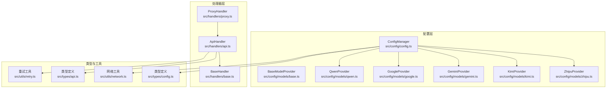
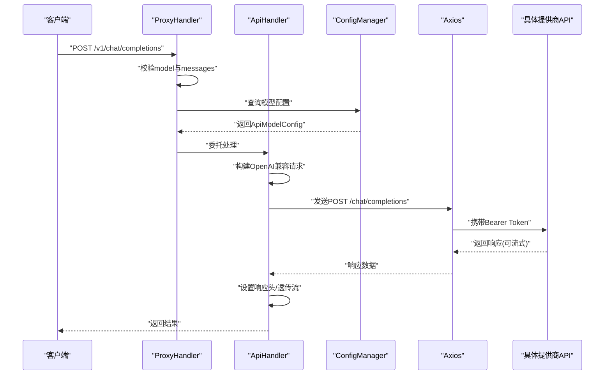
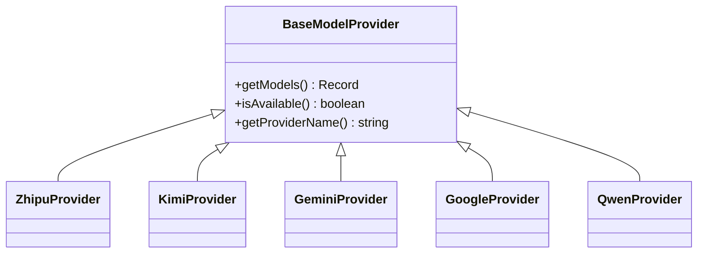
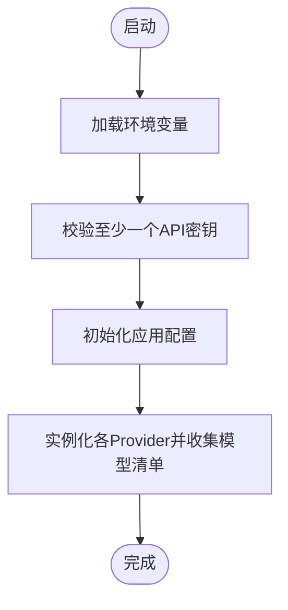
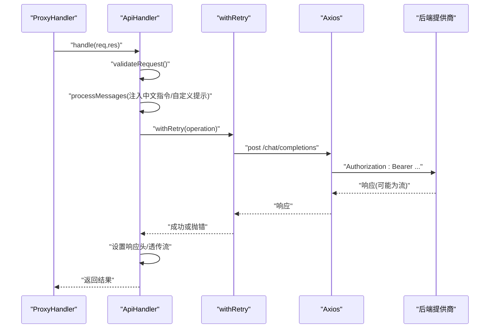
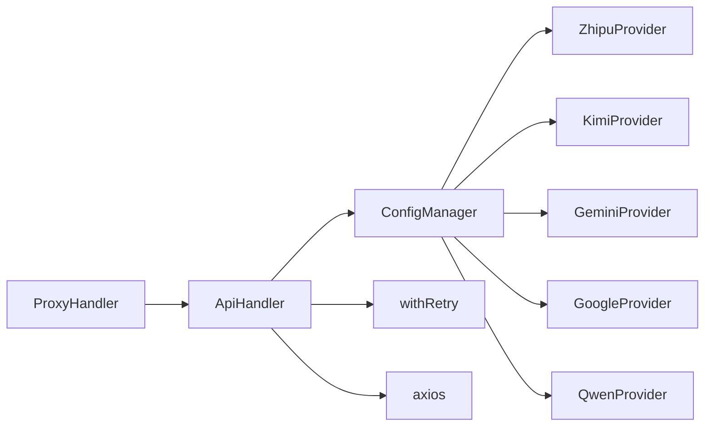

# 模型提供者系统

<cite>
**本文引用的文件**
- [src/config/models/base.ts](file://src/config/models/base.ts)
- [src/config/models/index.ts](file://src/config/models/index.ts)
- [src/config/models/zhipu.ts](file://src/config/models/zhipu.ts)
- [src/config/models/kimi.ts](file://src/config/models/kimi.ts)
- [src/config/models/gemini.ts](file://src/config/models/gemini.ts)
- [src/config/models/google.ts](file://src/config/models/google.ts)
- [src/config/models/qwen.ts](file://src/config/models/qwen.ts)
- [src/config/config.ts](file://src/config/config.ts)
- [src/types/config.ts](file://src/types/config.ts)
- [src/types/api.ts](file://src/types/api.ts)
- [src/handlers/base.ts](file://src/handlers/base.ts)
- [src/handlers/api.ts](file://src/handlers/api.ts)
- [src/handlers/proxy.ts](file://src/handlers/proxy.ts)
- [src/utils/retry.ts](file://src/utils/retry.ts)
- [src/utils/network.ts](file://src/utils/network.ts)
- [package.json](file://package.json)
</cite>

## 目录
1. [简介](#简介)
2. [项目结构](#项目结构)
3. [核心组件](#核心组件)
4. [架构总览](#架构总览)
5. [详细组件分析](#详细组件分析)
6. [依赖关系分析](#依赖关系分析)
7. [性能考量](#性能考量)
8. [故障排查指南](#故障排查指南)
9. [结论](#结论)
10. [附录](#附录)

## 简介
本文件面向 xcode-ai-proxy 的“模型提供者系统”，系统性阐述 BaseModelProvider 抽象基类的设计与实现、各具体提供者的集成方式、配置与 API 参数差异、响应格式一致性处理、扩展新提供商的步骤，以及性能、使用限制与成本相关的实践建议。文档同时给出关键流程的时序图与类图，帮助读者快速理解代码结构与交互。

## 项目结构
该系统围绕“配置层-处理器层-工具层”的分层设计组织：
- 配置层：定义模型配置类型与提供者抽象，集中初始化并聚合各提供商模型清单
- 处理器层：统一校验请求、转发到具体提供商，并处理 OpenAI 兼容格式的响应
- 工具层：重试机制、网络辅助（IP 获取、URL 展示）

**图表来源**
- [src/config/config.ts:1-121](file://src/config/config.ts#L1-L121)
- [src/config/models/base.ts:1-13](file://src/config/models/base.ts#L1-L13)
- [src/config/models/zhipu.ts:1-34](file://src/config/models/zhipu.ts#L1-L34)
- [src/config/models/kimi.ts:1-34](file://src/config/models/kimi.ts#L1-L34)
- [src/config/models/gemini.ts:1-34](file://src/config/models/gemini.ts#L1-L34)
- [src/config/models/google.ts:1-34](file://src/config/models/google.ts#L1-L34)
- [src/config/models/qwen.ts:1-35](file://src/config/models/qwen.ts#L1-L35)
- [src/handlers/proxy.ts:1-66](file://src/handlers/proxy.ts#L1-L66)
- [src/handlers/api.ts:1-196](file://src/handlers/api.ts#L1-L196)
- [src/handlers/base.ts:1-40](file://src/handlers/base.ts#L1-L40)
- [src/types/config.ts:1-48](file://src/types/config.ts#L1-L48)
- [src/types/api.ts:1-58](file://src/types/api.ts#L1-L58)
- [src/utils/retry.ts:1-34](file://src/utils/retry.ts#L1-L34)
- [src/utils/network.ts:1-51](file://src/utils/network.ts#L1-L51)

**章节来源**
- [src/config/config.ts:1-121](file://src/config/config.ts#L1-L121)
- [src/config/models/base.ts:1-13](file://src/config/models/base.ts#L1-L13)
- [src/handlers/proxy.ts:1-66](file://src/handlers/proxy.ts#L1-L66)
- [src/handlers/api.ts:1-196](file://src/handlers/api.ts#L1-L196)

## 核心组件
- BaseModelProvider 抽象基类：定义统一接口，约束子类必须实现获取模型清单、可用性判断与提供者名称
- 具体提供者：ZhipuProvider、KimiProvider、GeminiProvider、QwenProvider、GoogleProvider，均继承自 BaseModelProvider
- ConfigManager：负责从环境变量加载配置，实例化各提供者并聚合模型清单，提供查询与日志能力
- 处理器体系：BaseHandler 提供通用校验与错误封装；ProxyHandler 负责路由与模型存在性检查；ApiHandler 负责将请求转为 OpenAI 兼容格式并调用后端 API，支持重试与流式透传

**章节来源**
- [src/config/models/base.ts:1-13](file://src/config/models/base.ts#L1-L13)
- [src/config/models/index.ts:1-5](file://src/config/models/index.ts#L1-L5)
- [src/config/config.ts:1-121](file://src/config/config.ts#L1-L121)
- [src/handlers/base.ts:1-40](file://src/handlers/base.ts#L1-L40)
- [src/handlers/proxy.ts:1-66](file://src/handlers/proxy.ts#L1-L66)
- [src/handlers/api.ts:1-196](file://src/handlers/api.ts#L1-L196)

## 架构总览
下图展示了从客户端请求到后端提供商的完整链路，以及各组件之间的依赖关系：

**图表来源**
- [src/handlers/proxy.ts:9-37](file://src/handlers/proxy.ts#L9-L37)
- [src/handlers/api.ts:30-195](file://src/handlers/api.ts#L30-L195)
- [src/config/config.ts:107-113](file://src/config/config.ts#L107-L113)

## 详细组件分析

### BaseModelProvider 抽象基类
- 设计目标：统一不同提供商的模型清单暴露方式，屏蔽具体实现细节
- 关键接口
  - getModels(): 将提供商可用模型映射为统一的 ApiModelConfig 结构
  - isAvailable(): 基于 apiKey 与 enabled 标记判断是否启用
  - getProviderName(): 返回标准化的提供商标识字符串
- 通用能力
  - 通过 ModelProviderConfig 接受 apiKey、apiUrl、enabled 等基础配置
  - 子类按需覆盖默认 apiUrl，确保与提供商实际端点一致

**图表来源**
- [src/config/models/base.ts:3-7](file://src/config/models/base.ts#L3-L7)
- [src/config/models/zhipu.ts:4-34](file://src/config/models/zhipu.ts#L4-L34)
- [src/config/models/kimi.ts:4-34](file://src/config/models/kimi.ts#L4-L34)
- [src/config/models/gemini.ts:4-34](file://src/config/models/gemini.ts#L4-L34)
- [src/config/models/google.ts:4-34](file://src/config/models/google.ts#L4-L34)
- [src/config/models/qwen.ts:4-35](file://src/config/models/qwen.ts#L4-L35)

**章节来源**
- [src/config/models/base.ts:1-13](file://src/config/models/base.ts#L1-L13)

### 具体模型提供者集成

#### 智谱 AI (ZhipuProvider)
- 可用性：当配置中存在 apiKey 且 enabled 非 false 时可用
- 提供者名称：返回固定标识
- 模型清单：返回单个模型条目，包含类型、API 地址、密钥、提供商标识、展示名与实际模型 ID
- 特性：未在代码中发现特殊处理分支

**章节来源**
- [src/config/models/zhipu.ts:1-34](file://src/config/models/zhipu.ts#L1-L34)

#### Kimi (KimiProvider)
- 可用性：同上
- 提供者名称：返回固定标识
- 模型清单：返回单个模型条目，包含类型、API 地址、密钥、提供商标识、展示名与实际模型 ID
- 特性：在 ApiHandler 中对 Kimi 使用了 HTTPS Agent 并开启 keepAlive，以优化连接复用

**章节来源**
- [src/config/models/kimi.ts:1-34](file://src/config/models/kimi.ts#L1-L34)
- [src/handlers/api.ts:49-56](file://src/handlers/api.ts#L49-L56)

#### Google Gemini (GeminiProvider 与 GoogleProvider)
- 可用性：同上
- 提供者名称：返回固定标识
- 模型清单：
  - GeminiProvider：返回一个 2.5 版本模型条目
  - GoogleProvider：返回一个标准 Pro 模型条目
- 特性：两者均使用 Google Generative Language API 的公开 v1beta 端点；GeminiProvider 使用 OpenAI 兼容端点路径

**章节来源**
- [src/config/models/gemini.ts:1-34](file://src/config/models/gemini.ts#L1-L34)
- [src/config/models/google.ts:1-34](file://src/config/models/google.ts#L1-L34)

#### 通义千问 (QwenProvider)
- 可用性：同上
- 提供者名称：返回固定标识
- 模型清单：返回单个模型条目，包含类型、API 地址、密钥、提供商标识、展示名与实际模型 ID
- 特性：在请求构建阶段会移除空的 tools 数组，避免 Qwen API 报错

**章节来源**
- [src/config/models/qwen.ts:1-35](file://src/config/models/qwen.ts#L1-L35)
- [src/handlers/api.ts:97-100](file://src/handlers/api.ts#L97-L100)

### 配置与模型清单聚合
- ConfigManager 负责：
  - 校验至少存在一个提供商的 API 密钥
  - 初始化应用配置（端口、主机、重试次数、延迟、超时、自定义系统提示）
  - 实例化各 Provider 并合并其模型清单到统一字典
  - 提供查询模型配置、列出支持模型、打印配置日志的能力

**图表来源**
- [src/config/config.ts:27-97](file://src/config/config.ts#L27-L97)

**章节来源**
- [src/config/config.ts:1-121](file://src/config/config.ts#L1-L121)

### 请求处理与响应透传
- ProxyHandler
  - 校验请求参数与模型存在性
  - 将 API 类型模型请求委派给 ApiHandler
- ApiHandler
  - 统一校验与错误封装
  - 构造 OpenAI 兼容请求体（含中文交流指令与自定义系统提示注入）
  - 对 Kimi 使用 HTTPS Agent，对 Qwen 移除空 tools
  - 支持流式与非流式响应透传，设置跨域与缓存相关响应头
  - 使用 withRetry 进行指数级延迟重试

**图表来源**
- [src/handlers/proxy.ts:9-37](file://src/handlers/proxy.ts#L9-L37)
- [src/handlers/api.ts:30-195](file://src/handlers/api.ts#L30-L195)
- [src/utils/retry.ts:1-34](file://src/utils/retry.ts#L1-L34)

**章节来源**
- [src/handlers/proxy.ts:1-66](file://src/handlers/proxy.ts#L1-L66)
- [src/handlers/api.ts:1-196](file://src/handlers/api.ts#L1-L196)
- [src/utils/retry.ts:1-34](file://src/utils/retry.ts#L1-L34)

### 数据模型与类型约束
- 模型类型
  - BaseModelConfig：包含 type 与 name
  - ApiModelConfig：继承 BaseModelConfig，限定 type 为 'api'，新增 apiUrl、apiKey、provider、可选 model、maxTokens、temperature 等字段
- 请求与响应
  - ChatCompletionRequest：包含 model、messages、可选参数（如 stream、temperature、top_p 等）
  - ChatCompletionResponse：包含 id、object、created、model、choices、usage 等字段
  - ModelsResponse：包含对象列表与数据数组，用于列举可用模型
- 环境变量
  - 支持 ZHIPU_*、KIMI_*、GEMINI_*、QWEN_* 的 API Key 与 API URL，以及应用级配置项（端口、主机、重试、超时、自定义系统提示）

**章节来源**
- [src/types/config.ts:1-48](file://src/types/config.ts#L1-L48)
- [src/types/api.ts:1-58](file://src/types/api.ts#L1-L58)

## 依赖关系分析
- 内部依赖
  - ConfigManager 依赖各 Provider 类进行模型清单聚合
  - ApiHandler 依赖 ConfigManager 查询模型配置，依赖 withRetry 执行重试
  - ProxyHandler 依赖 ApiHandler 处理 API 类型模型
- 外部依赖
  - axios 用于 HTTP 请求与流式响应透传
  - dotenv 用于加载 .env 文件
  - express 提供 Web 服务器能力

**图表来源**
- [src/config/config.ts:3,67-97](file://src/config/config.ts#L3,L67-L97)
- [src/handlers/proxy.ts:7](file://src/handlers/proxy.ts#L7)
- [src/handlers/api.ts:6](file://src/handlers/api.ts#L6)
- [package.json:14-18](file://package.json#L14-L18)

**章节来源**
- [src/config/config.ts:1-121](file://src/config/config.ts#L1-L121)
- [src/handlers/proxy.ts:1-66](file://src/handlers/proxy.ts#L1-L66)
- [src/handlers/api.ts:1-196](file://src/handlers/api.ts#L1-L196)
- [package.json:14-18](file://package.json#L14-L18)

## 性能考量
- 连接复用
  - 对 Kimi 使用 HTTPS Agent 并启用 keepAlive，有助于减少握手开销，提升并发稳定性
- 重试策略
  - withRetry 提供最大重试次数与递增延迟，降低瞬时异常导致的失败率
- 流式响应
  - ApiHandler 对流式场景直接透传底层响应流，避免额外缓冲与转换，降低延迟与内存占用
- 超时与并发
  - 应用配置允许设置请求超时，避免长时间阻塞；结合重试与流式，可在弱网环境下提升用户体验

**章节来源**
- [src/handlers/api.ts:49-56](file://src/handlers/api.ts#L49-L56)
- [src/utils/retry.ts:1-34](file://src/utils/retry.ts#L1-L34)
- [src/config/config.ts:51-65](file://src/config/config.ts#L51-L65)

## 故障排查指南
- 常见错误类型
  - 缺少必需参数：模型或消息缺失
  - 不支持的模型：请求的模型不在已加载清单中
  - API 请求失败：后端返回 4xx/5xx，包含状态码、URL、错误体
- 定位步骤
  - 查看控制台输出：请求模型、是否流式、错误详情
  - 检查环境变量：确认至少配置一个提供商的 API Key
  - 检查模型配置：确认 ConfigManager 已正确聚合模型清单
  - 检查网络与代理：确认可访问提供商 API，必要时调整超时与重试
- 建议
  - 开启流式时注意客户端兼容性
  - 自定义系统提示仅在首次系统消息后注入一次，避免重复

**章节来源**
- [src/handlers/base.ts:10-39](file://src/handlers/base.ts#L10-L39)
- [src/handlers/proxy.ts:14-31](file://src/handlers/proxy.ts#L14-L31)
- [src/handlers/api.ts:124-164](file://src/handlers/api.ts#L124-L164)
- [src/config/config.ts:27-49](file://src/config/config.ts#L27-L49)

## 结论
该模型提供者系统通过抽象基类与统一配置聚合，实现了多提供商的可插拔扩展；通过 OpenAI 兼容请求格式与统一响应处理，简化了前端对接；配合重试、流式透传与连接复用等手段，在性能与可靠性方面具备良好表现。未来扩展新提供商时，只需遵循 BaseModelProvider 接口与 ApiModelConfig 规范，并在 ConfigManager 中注册即可。

## 附录

### 扩展新提供商指南
- 步骤
  - 新建类继承 BaseModelProvider，实现 isAvailable、getProviderName、getModels
  - 在 src/config/models/index.ts 中导出新类
  - 在 ConfigManager.initializeModelConfigs 中实例化并合并模型清单
  - 如需特殊处理（如 HTTPS Agent、特殊请求参数），在 ApiHandler 中补充
- 注意事项
  - 确保 getModels 返回的模型包含 provider、apiUrl、apiKey、name、model 等字段
  - 若提供商不接受某些 OpenAI 兼容字段（如空 tools），在请求构建阶段做清理
  - 在 .env 中新增对应环境变量并更新 ConfigManager 的校验逻辑

**章节来源**
- [src/config/models/base.ts:3-7](file://src/config/models/base.ts#L3-L7)
- [src/config/models/index.ts:1](file://src/config/models/index.ts#L1)
- [src/config/config.ts:67-97](file://src/config/config.ts#L67-L97)
- [src/handlers/api.ts:97-100](file://src/handlers/api.ts#L97-L100)

### 环境变量与应用配置
- 环境变量
  - ZHIPU_API_KEY、ZHIPU_API_URL
  - KIMI_API_KEY、KIMI_API_URL
  - GEMINI_API_KEY、GEMINI_API_URL
  - QWEN_API_KEY、QWEN_API_URL
  - CUSTOM_SYSTEM_PROMPT、PORT、HOST、MAX_RETRIES、RETRY_DELAY、REQUEST_TIMEOUT
- 应用配置
  - 端口、主机、最大重试次数、重试延迟、请求超时、自定义系统提示

**章节来源**
- [src/types/config.ts:33-48](file://src/types/config.ts#L33-L48)
- [src/config/config.ts:51-65](file://src/config/config.ts#L51-L65)