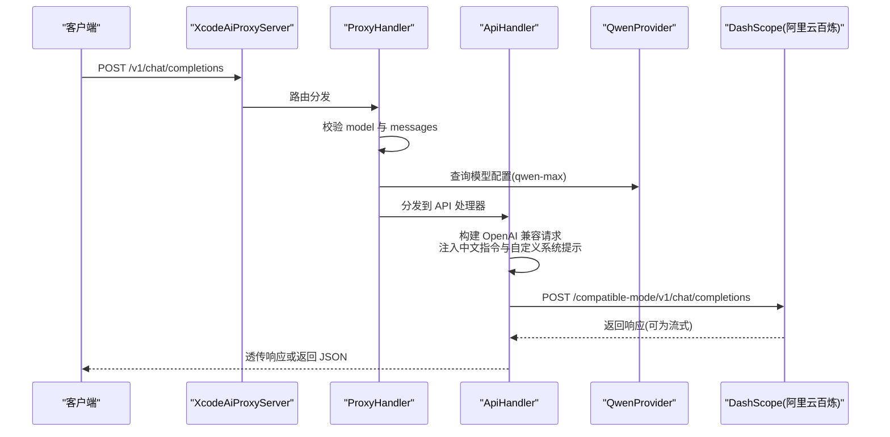
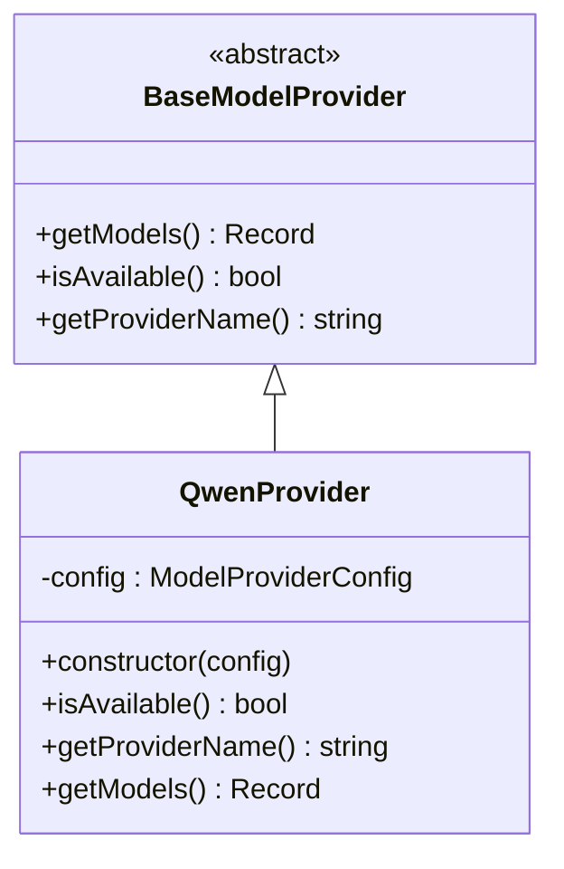
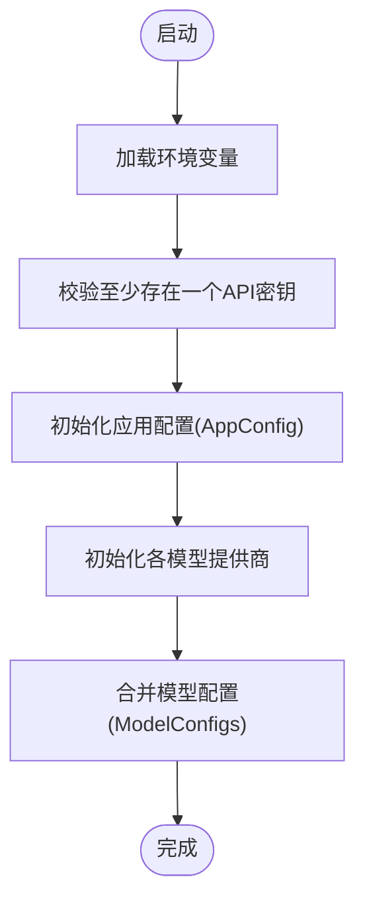
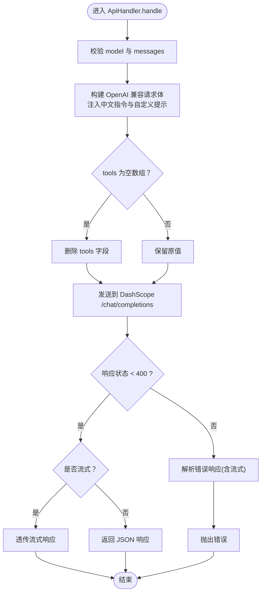
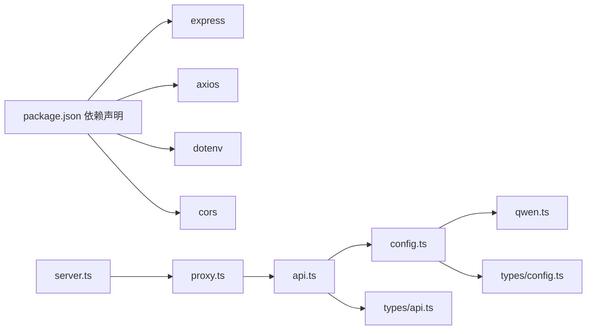

# 通义千问集成

<cite>
**本文档引用的文件**
- [src/config/models/qwen.ts](file://src/config/models/qwen.ts)
- [src/config/models/base.ts](file://src/config/models/base.ts)
- [src/config/config.ts](file://src/config/config.ts)
- [src/types/config.ts](file://src/types/config.ts)
- [src/types/api.ts](file://src/types/api.ts)
- [src/handlers/base.ts](file://src/handlers/base.ts)
- [src/handlers/api.ts](file://src/handlers/api.ts)
- [src/handlers/proxy.ts](file://src/handlers/proxy.ts)
- [src/middlewares/common.ts](file://src/middlewares/common.ts)
- [src/server.ts](file://src/server.ts)
- [package.json](file://package.json)
</cite>

## 更新摘要
**所做更改**
- 新增完整的通义千问(Qwen)模型支持实现
- 更新配置管理器以包含QwenProvider实例化
- 优化API处理器以支持Qwen的特殊需求（空tools数组处理）
- 增强中文场景支持和系统提示注入机制
- 完善错误处理和流式响应支持

## 目录
1. [简介](#简介)
2. [项目结构](#项目结构)
3. [核心组件](#核心组件)
4. [架构总览](#架构总览)
5. [详细组件分析](#详细组件分析)
6. [依赖关系分析](#依赖关系分析)
7. [性能考虑](#性能考虑)
8. [故障排除指南](#故障排除指南)
9. [结论](#结论)
10. [附录](#附录)

## 简介
本文件面向希望在现有代理服务中集成通义千问（Qwen）模型的开发者，基于仓库中的实现，系统性说明 QwenProvider 的配置与使用方式、与阿里云百炼平台 API 的对接要点、认证与请求格式处理、模型参数与响应格式、中文场景优化、与阿里云生态的集成建议、成本控制与使用限制、部署与排障方法。

**更新** 新增完整的QwenProvider实现，包括模型配置、API端点设置和特殊处理逻辑。

## 项目结构
该代理服务采用模块化设计，按"配置层-类型定义-处理器-中间件-入口"分层组织：
- 配置层：集中管理应用配置与各模型提供商的模型映射
- 类型定义：统一请求/响应/配置的数据结构
- 处理器：代理层负责路由校验与转发，API 层负责与上游模型服务通信
- 中间件：统一日志与错误处理
- 入口：Express 应用启动与路由注册

```mermaid
graph TB
subgraph "配置层"
CFG["ConfigManager<br/>加载环境变量与模型映射"]
QP["QwenProvider<br/>提供 qwen-max 模型配置"]
END
subgraph "类型定义"
TCFG["ApiModelConfig/AppConfig<br/>模型与应用配置接口"]
TAPI["ChatCompletionRequest/Response<br/>请求/响应接口"]
END
subgraph "处理器"
PH["ProxyHandler<br/>路由校验与分发"]
AH["ApiHandler<br/>上游请求构建与透传"]
END
subgraph "中间件"
LOG["loggingMiddleware"]
ERR["errorHandler"]
END
subgraph "入口"
SRV["XcodeAiProxyServer<br/>路由注册与启动"]
END
CFG --> QP
CFG --> PH
PH --> AH
AH --> SRV
LOG --> SRV
ERR --> SRV
TCFG --> CFG
TAPI --> AH
```

**图表来源**
- [src/config/config.ts:69-99](file://src/config/config.ts#L69-L99)
- [src/config/models/qwen.ts:4-34](file://src/config/models/qwen.ts#L4-L34)
- [src/handlers/proxy.ts:6-37](file://src/handlers/proxy.ts#L6-L37)
- [src/handlers/api.ts:8-28](file://src/handlers/api.ts#L8-L28)
- [src/server.ts:29-40](file://src/server.ts#L29-L40)

**章节来源**
- [src/server.ts:13-44](file://src/server.ts#L13-L44)
- [src/config/config.ts:69-99](file://src/config/config.ts#L69-L99)

## 核心组件
- QwenProvider：实现 BaseModelProvider，暴露 qwen-max 模型，使用阿里云百炼兼容端点
- ConfigManager：加载环境变量，初始化各模型提供商并合并模型配置
- ProxyHandler：接收客户端请求，校验模型可用性并分发给 ApiHandler
- ApiHandler：构建 OpenAI 兼容请求，注入中文交流指令与自定义系统提示，透传上游响应
- 类型系统：统一 ChatCompletionRequest/Response 与 ApiModelConfig/AppConfig 接口

**更新** 新增QwenProvider作为独立的模型提供者实现，支持完整的配置管理和模型暴露功能。

**章节来源**
- [src/config/models/qwen.ts:4-34](file://src/config/models/qwen.ts#L4-L34)
- [src/config/models/base.ts:3-7](file://src/config/models/base.ts#L3-L7)
- [src/config/config.ts:69-99](file://src/config/config.ts#L69-L99)
- [src/handlers/proxy.ts:6-37](file://src/handlers/proxy.ts#L6-L37)
- [src/handlers/api.ts:8-28](file://src/handlers/api.ts#L8-L28)
- [src/types/config.ts:8-16](file://src/types/config.ts#L8-L16)
- [src/types/api.ts:11-37](file://src/types/api.ts#L11-L37)

## 架构总览
下图展示从客户端到阿里云百炼 API 的完整链路，包括中文场景增强与流式透传。



**图表来源**
- [src/server.ts:29-40](file://src/server.ts#L29-L40)
- [src/handlers/proxy.ts:9-31](file://src/handlers/proxy.ts#L9-L31)
- [src/handlers/api.ts:30-195](file://src/handlers/api.ts#L30-L195)
- [src/config/models/qwen.ts:20-33](file://src/config/models/qwen.ts#L20-L33)

## 详细组件分析

### QwenProvider 实现细节
- 可用性判断：当配置中存在 apiKey 且未显式禁用时视为可用
- 提供商名称：固定返回 qwen
- 模型映射：仅暴露 qwen-max，使用阿里云百炼兼容端点，携带 provider 标识与模型名

**更新** 完整实现了QwenProvider类，包含构造函数、可用性检查、提供商名称和模型配置方法。



**图表来源**
- [src/config/models/base.ts:3-7](file://src/config/models/base.ts#L3-L7)
- [src/config/models/qwen.ts:4-34](file://src/config/models/qwen.ts#L4-L34)

**章节来源**
- [src/config/models/qwen.ts:12-33](file://src/config/models/qwen.ts#L12-L33)
- [src/config/models/base.ts:9-13](file://src/config/models/base.ts#L9-L13)

### 配置与模型加载（ConfigManager）
- 环境变量：支持 QWEN_API_KEY、QWEN_API_URL 等；若未设置则使用默认值
- 初始化顺序：校验必填项 -> 初始化应用配置 -> 初始化各模型提供商 -> 合并模型配置
- 模型聚合：将各 Provider 的模型映射合并到统一的 ModelConfigs 对象

**更新** ConfigManager已更新以包含QwenProvider的实例化和模型配置合并逻辑。



**图表来源**
- [src/config/config.ts:13-20](file://src/config/config.ts#L13-L20)
- [src/config/config.ts:29-51](file://src/config/config.ts#L29-L51)
- [src/config/config.ts:53-67](file://src/config/config.ts#L53-L67)
- [src/config/config.ts:69-99](file://src/config/config.ts#L69-L99)

**章节来源**
- [src/config/config.ts:13-20](file://src/config/config.ts#L13-L20)
- [src/config/config.ts:29-51](file://src/config/config.ts#L29-L51)
- [src/config/config.ts:69-99](file://src/config/config.ts#L69-L99)

### 请求处理与中文场景增强（ApiHandler）
- 认证：统一使用 Authorization: Bearer 方案
- 请求格式：以 OpenAI 兼容格式构造 body，自动注入中文交流指令与自定义系统提示
- 流式支持：根据 stream 参数决定响应类型，并透传上游流式数据
- 特殊处理：对空的 tools 数组进行删除，避免 Qwen API 报错
- 错误透传：对上游 4xx/5xx 响应进行解析与错误对象构造，保留状态码与响应体

**更新** API处理器已优化以支持Qwen的特殊需求，包括空tools数组的自动清理处理。



**图表来源**
- [src/handlers/api.ts:9-28](file://src/handlers/api.ts#L9-L28)
- [src/handlers/api.ts:30-195](file://src/handlers/api.ts#L30-L195)

**章节来源**
- [src/handlers/api.ts:30-195](file://src/handlers/api.ts#L30-L195)

### 代理与路由（ProxyHandler）
- 路由分发：校验模型是否存在，若为 API 类型则转交 ApiHandler 处理
- 模型列表：将内部模型配置转换为标准模型列表响应
- 健康检查：返回服务状态与模型数量

**章节来源**
- [src/handlers/proxy.ts:39-65](file://src/handlers/proxy.ts#L39-L65)

### 类型系统与数据契约
- 请求体：ChatCompletionRequest 支持 model、messages、stream、temperature、top_p 等字段
- 响应体：ChatCompletionResponse 包含 choices 与 usage 统计
- 模型配置：ApiModelConfig 定义 provider、apiUrl、apiKey、model 等字段

**章节来源**
- [src/types/api.ts:11-37](file://src/types/api.ts#L11-L37)
- [src/types/config.ts:8-16](file://src/types/config.ts#L8-L16)

## 依赖关系分析
- 运行时依赖：express、axios、dotenv、cors
- 开发依赖：@types/*、ts-node、nodemon、typescript
- 关键运行链路：server.ts -> proxy.ts -> api.ts -> config.ts -> qwen.ts

**更新** 依赖关系保持稳定，新增QwenProvider不影响现有依赖结构。



**图表来源**
- [package.json:14-28](file://package.json#L14-L28)
- [src/server.ts:1-8](file://src/server.ts#L1-L8)
- [src/handlers/proxy.ts:1-6](file://src/handlers/proxy.ts#L1-L6)
- [src/handlers/api.ts:1-8](file://src/handlers/api.ts#L1-L8)
- [src/config/config.ts:1-7](file://src/config/config.ts#L1-L7)
- [src/config/models/qwen.ts:1-2](file://src/config/models/qwen.ts#L1-L2)

**章节来源**
- [package.json:14-28](file://package.json#L14-L28)

## 性能考虑
- 重试机制：内置指数级递增重试，可通过环境变量调整最大重试次数与基础延迟
- 超时控制：请求超时可配置，默认值可按网络状况与模型响应时间调整
- 流式传输：开启 stream 时直接透传上游流，降低内存占用
- 日志与可观测性：统一日志中间件与错误处理，便于定位问题

**更新** 性能考虑保持不变，重试机制和超时控制适用于所有模型提供者。

**章节来源**
- [src/utils/retry.ts:1-34](file://src/utils/retry.ts#L1-L34)
- [src/handlers/api.ts:35-44](file://src/handlers/api.ts#L35-L44)
- [src/middlewares/common.ts:4-7](file://src/middlewares/common.ts#L4-L7)

## 故障排除指南
- 缺少 API 密钥：至少需配置一个提供商的密钥，否则启动即退出
- 模型不可用：确认模型 ID 是否存在于已加载的模型配置中
- 认证失败：确保 Authorization 头为 Bearer 方案，且 apiKey 正确
- 流式错误：当上游返回错误流时，会尝试读取并解析错误内容，查看日志中的错误响应
- 中文输出异常：代码已自动注入中文交流指令，如仍出现非中文，请检查自定义系统提示是否覆盖了中文指令
- 端口与跨域：默认监听 0.0.0.0:3000，已启用 CORS，可按需调整 HOST/PORT

**更新** 故障排除指南保持完整，新增Qwen特定的工具数组处理注意事项。

**章节来源**
- [src/config/config.ts:29-51](file://src/config/config.ts#L29-L51)
- [src/handlers/proxy.ts:14-24](file://src/handlers/proxy.ts#L14-L24)
- [src/handlers/api.ts:123-164](file://src/handlers/api.ts#L123-L164)
- [src/server.ts:46-83](file://src/server.ts#L46-L83)

## 结论
本项目通过统一的配置与类型系统，将通义千问（Qwen）以 OpenAI 兼容格式接入代理服务，具备以下优势：
- 易于扩展：新增模型只需实现 BaseModelProvider 并在 ConfigManager 中注册
- 中文优先：内置中文交流指令与自定义系统提示注入，适配中文场景
- 稳定可靠：统一错误处理、流式透传与可配置重试/超时
- 阿里云生态：直接对接 DashScope 兼容端点，便于后续扩展更多模型与能力

**更新** QwenProvider的加入进一步增强了中文场景的处理能力和阿里云生态的集成深度。

## 附录

### 配置指南（Qwen）
- 必填项
  - QWEN_API_KEY：阿里云百炼 API 密钥
  - QWEN_API_URL：阿里云百炼兼容端点（默认值已内置）
- 可选项
  - CUSTOM_SYSTEM_PROMPT：自定义系统提示，将在首个 system 消息后注入
  - PORT/HOST：服务端口与绑定地址
  - MAX_RETRIES/RETRY_DELAY/REQUEST_TIMEOUT：重试次数、递增延迟、请求超时
- 启动与验证
  - 使用开发模式启动：npm run dev
  - 访问 /v1/models 查看已加载模型
  - 访问 /health 检查服务健康状态

**更新** 配置指南保持完整，Qwen的配置与其他模型提供者完全一致。

**章节来源**
- [src/config/config.ts:13-20](file://src/config/config.ts#L13-L20)
- [src/config/config.ts:53-67](file://src/config/config.ts#L53-L67)
- [src/server.ts:29-40](file://src/server.ts#L29-L40)

### 使用示例（OpenAI 兼容）
- 请求路径：POST /v1/chat/completions
- 请求体关键字段：model、messages、stream（可选）、temperature/top_p/max_tokens（可选）
- 认证头：Authorization: Bearer YOUR_QWEN_API_KEY
- 响应格式：choices 与 usage 字段遵循 OpenAI 兼容规范

**更新** 使用示例保持不变，Qwen完全兼容OpenAI API格式。

**章节来源**
- [src/handlers/api.ts:90-100](file://src/handlers/api.ts#L90-L100)
- [src/types/api.ts:11-37](file://src/types/api.ts#L11-L37)

### 与阿里云生态集成建议
- 账号与密钥：在阿里云百炼控制台创建 API 密钥并获取 SK
- 网络与域名：确保服务器可访问 dashscope.aliyuncs.com 的兼容端点
- 成本控制：结合 MAX_RETRIES/RETRY_DELAY/REQUEST_TIMEOUT 控制资源消耗；合理设置温度与采样参数
- 使用限制：关注阿里云百炼的配额与速率限制，必要时申请提升

**更新** 集成建议保持完整，Qwen作为阿里云百炼平台的模型，完全兼容该生态的所有特性。

**章节来源**
- [src/config/models/qwen.ts:26-27](file://src/config/models/qwen.ts#L26-L27)
- [src/config/config.ts:15-16](file://src/config/config.ts#L15-L16)

### Qwen 特定配置说明
- 模型名称：qwen-max
- 提供商标识：qwen
- API 端点：https://dashscope.aliyuncs.com/compatible-mode/v1
- 特殊处理：自动清理空的 tools 数组，确保与Qwen API兼容
- 中文支持：内置中文交流指令，确保所有回复使用中文

**新增** 详细说明Qwen模型的特定配置和处理逻辑。

**章节来源**
- [src/config/models/qwen.ts:20-33](file://src/config/models/qwen.ts#L20-L33)
- [src/handlers/api.ts:97-100](file://src/handlers/api.ts#L97-L100)
- [src/handlers/api.ts:68-84](file://src/handlers/api.ts#L68-L84)