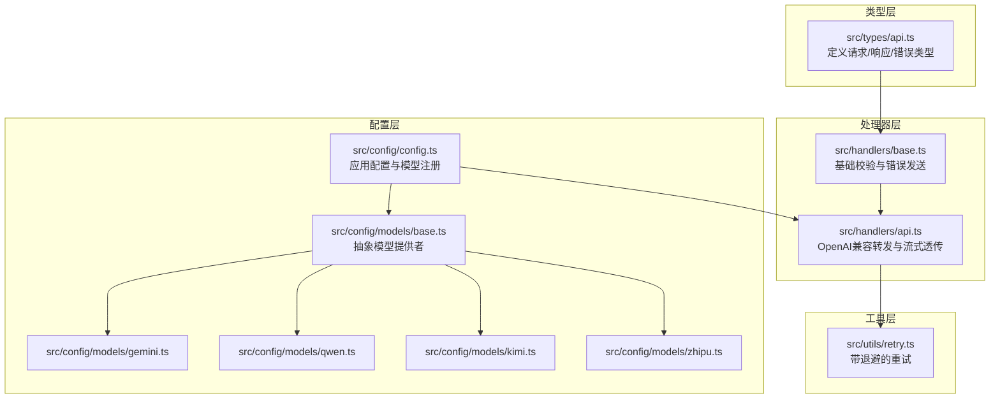
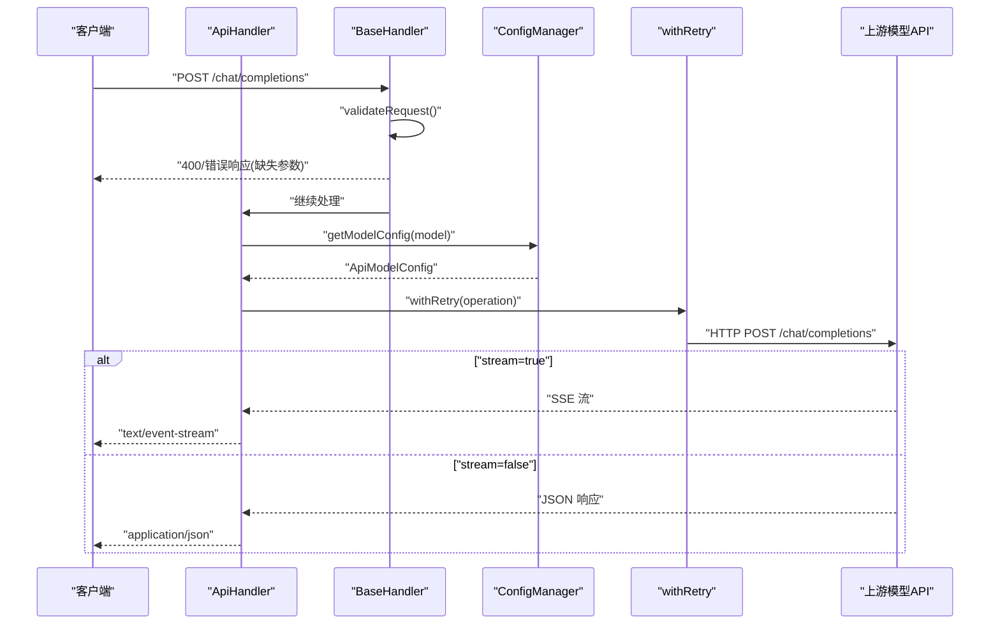
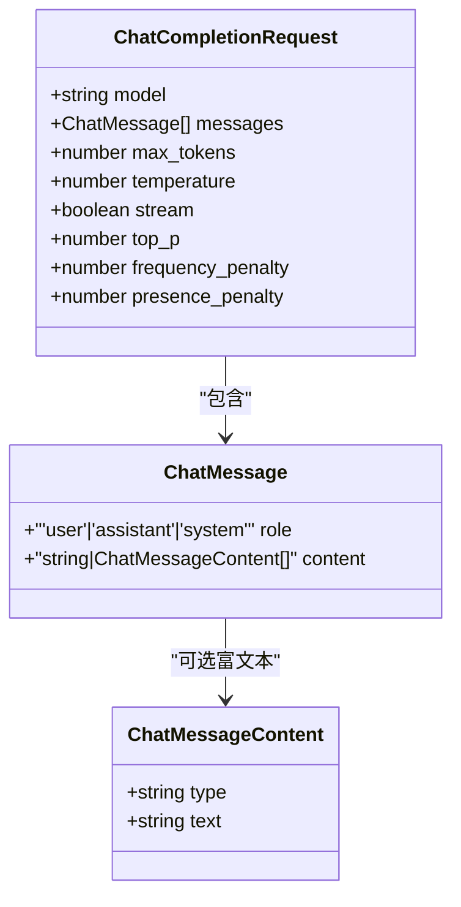
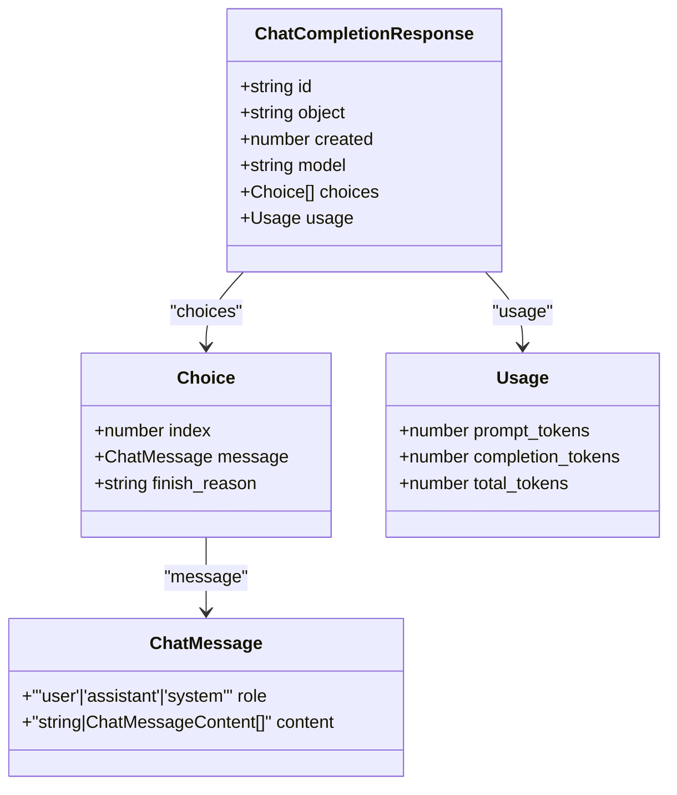
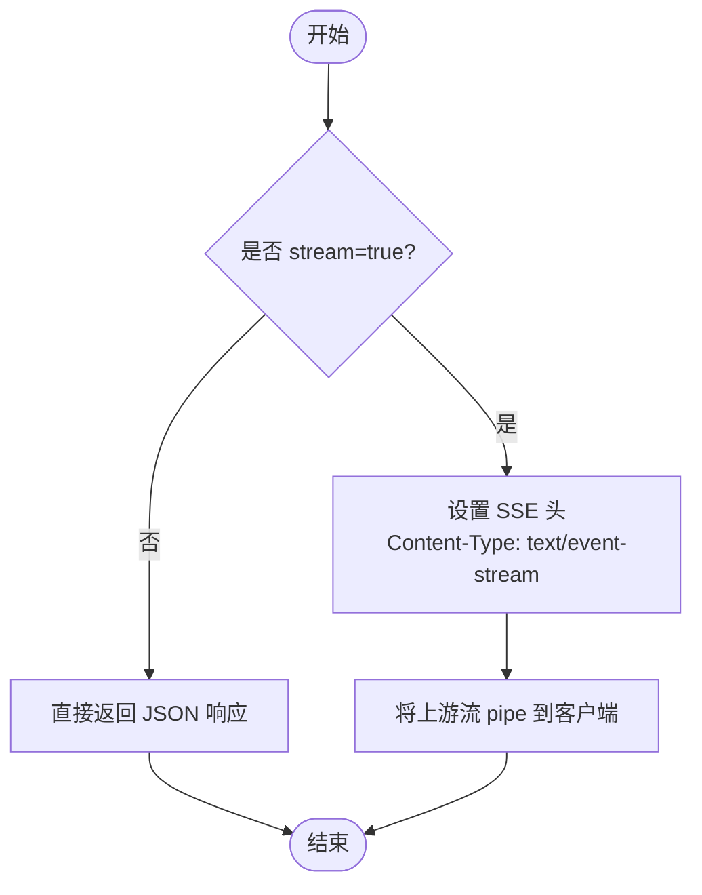
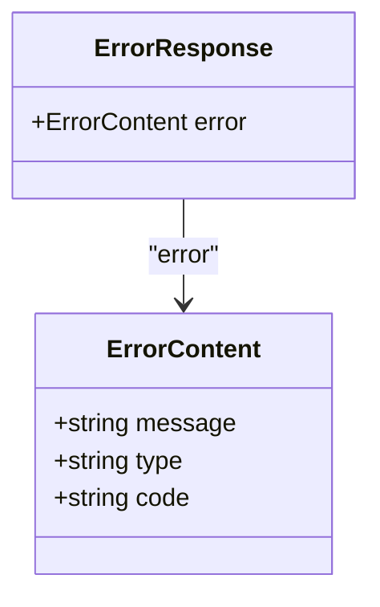
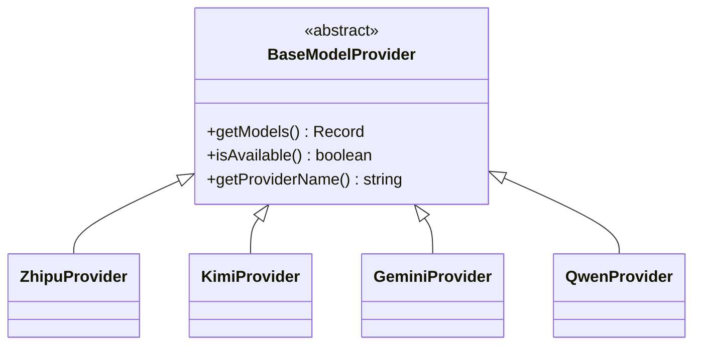
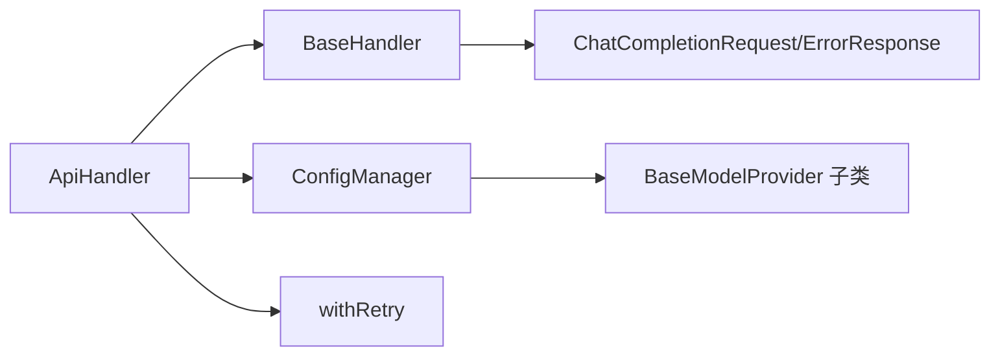

# API 类型定义

<cite>
**本文引用的文件列表**
- [src/types/api.ts](file://src/types/api.ts)
- [src/handlers/base.ts](file://src/handlers/base.ts)
- [src/handlers/api.ts](file://src/handlers/api.ts)
- [src/config/config.ts](file://src/config/config.ts)
- [src/config/models/base.ts](file://src/config/models/base.ts)
- [src/config/models/gemini.ts](file://src/config/models/gemini.ts)
- [src/config/models/qwen.ts](file://src/config/models/qwen.ts)
- [src/config/models/kimi.ts](file://src/config/models/kimi.ts)
- [src/config/models/zhipu.ts](file://src/config/models/zhipu.ts)
- [src/utils/retry.ts](file://src/utils/retry.ts)
</cite>

## 目录
1. [简介](#简介)
2. [项目结构](#项目结构)
3. [核心组件](#核心组件)
4. [架构总览](#架构总览)
5. [详细组件分析](#详细组件分析)
6. [依赖关系分析](#依赖关系分析)
7. [性能考量](#性能考量)
8. [故障排查指南](#故障排查指南)
9. [结论](#结论)
10. [附录](#附录)

## 简介
本文件面向 xcode-ai-proxy 的 API 类型系统，聚焦于 OpenAI 兼容风格的聊天补全请求与响应类型定义，以及错误响应格式。文档将：
- 逐项说明 ChatCompletionRequest 请求结构与校验规则
- 详述 ChatCompletionResponse 响应结构与字段语义
- 解释流式响应的数据格式与 SSE 事件类型
- 规范 ErrorResponse 错误响应标准与错误码类别
- 提供与 OpenAI API 的兼容性实现细节
- 给出扩展新模型与自定义消息格式的开发指南

## 项目结构
围绕类型系统的关键目录与文件如下：
- 类型定义：src/types/api.ts
- 请求校验与错误处理：src/handlers/base.ts
- API 转发与流式透传：src/handlers/api.ts
- 配置管理与模型注册：src/config/config.ts、src/config/models/*
- 重试机制：src/utils/retry.ts

**图示来源**
- [src/types/api.ts:1-58](file://src/types/api.ts#L1-L58)
- [src/handlers/base.ts:1-40](file://src/handlers/base.ts#L1-L40)
- [src/handlers/api.ts:1-196](file://src/handlers/api.ts#L1-L196)
- [src/config/config.ts:1-123](file://src/config/config.ts#L1-L123)
- [src/config/models/base.ts:1-13](file://src/config/models/base.ts#L1-L13)
- [src/config/models/gemini.ts:1-34](file://src/config/models/gemini.ts#L1-L34)
- [src/config/models/qwen.ts:1-35](file://src/config/models/qwen.ts#L1-L35)
- [src/config/models/kimi.ts:1-34](file://src/config/models/kimi.ts#L1-L34)
- [src/config/models/zhipu.ts:1-34](file://src/config/models/zhipu.ts#L1-L34)
- [src/utils/retry.ts:1-34](file://src/utils/retry.ts#L1-L34)

**章节来源**
- [src/types/api.ts:1-58](file://src/types/api.ts#L1-L58)
- [src/handlers/base.ts:1-40](file://src/handlers/base.ts#L1-L40)
- [src/handlers/api.ts:1-196](file://src/handlers/api.ts#L1-L196)
- [src/config/config.ts:1-123](file://src/config/config.ts#L1-L123)
- [src/config/models/base.ts:1-13](file://src/config/models/base.ts#L1-L13)
- [src/config/models/gemini.ts:1-34](file://src/config/models/gemini.ts#L1-L34)
- [src/config/models/qwen.ts:1-35](file://src/config/models/qwen.ts#L1-L35)
- [src/config/models/kimi.ts:1-34](file://src/config/models/kimi.ts#L1-L34)
- [src/config/models/zhipu.ts:1-34](file://src/config/models/zhipu.ts#L1-L34)
- [src/utils/retry.ts:1-34](file://src/utils/retry.ts#L1-L34)

## 核心组件
- ChatCompletionRequest：OpenAI 兼容的聊天补全请求体，包含 model、messages、可选参数如 max_tokens、temperature、stream、top_p、frequency_penalty、presence_penalty 等
- ChatCompletionResponse：OpenAI 兼容的聊天补全响应体，包含 id、object、created、model、choices 数组、usage 统计
- ErrorResponse：统一错误响应结构，包含 message、type、可选 code
- ChatMessage/ChatMessageContent：消息角色与内容结构，支持纯文本或富文本数组
- ModelInfo/ModelsResponse：模型清单对象与数据数组
- ApiHandler/BaseHandler：请求校验、错误处理、OpenAI 兼容转发与流式透传

**章节来源**
- [src/types/api.ts:1-58](file://src/types/api.ts#L1-L58)
- [src/handlers/base.ts:1-40](file://src/handlers/base.ts#L1-L40)
- [src/handlers/api.ts:1-196](file://src/handlers/api.ts#L1-L196)

## 架构总览
下图展示从请求进入、类型校验、到上游模型 API 的转发与响应透传的整体流程。

**图示来源**
- [src/handlers/base.ts:10-22](file://src/handlers/base.ts#L10-L22)
- [src/handlers/api.ts:8-28](file://src/handlers/api.ts#L8-L28)
- [src/handlers/api.ts:30-196](file://src/handlers/api.ts#L30-L196)
- [src/config/config.ts:109-115](file://src/config/config.ts#L109-L115)
- [src/utils/retry.ts:1-26](file://src/utils/retry.ts#L1-L26)

## 详细组件分析

### ChatCompletionRequest 请求类型
- 关键字段
  - model：字符串，目标模型标识符
  - messages：数组，元素为 ChatMessage，每条消息包含 role 与 content
  - 可选参数：max_tokens、temperature、stream、top_p、frequency_penalty、presence_penalty
- 校验规则
  - 必填：model、messages（且必须为数组）
  - 其他参数按需传入，由上游模型决定是否支持
- OpenAI 兼容性
  - 使用统一的 OpenAI 兼容格式进行请求构建与透传
  - 对特定模型（如 Qwen）进行特殊处理（例如移除空的 tools 数组）

**图示来源**
- [src/types/api.ts:1-20](file://src/types/api.ts#L1-L20)

**章节来源**
- [src/types/api.ts:11-20](file://src/types/api.ts#L11-L20)
- [src/handlers/base.ts:10-22](file://src/handlers/base.ts#L10-L22)
- [src/handlers/api.ts:90-100](file://src/handlers/api.ts#L90-L100)

### ChatCompletionResponse 响应类型
- 字段说明
  - id：请求唯一标识
  - object：对象类型标识
  - created：时间戳
  - model：所用模型
  - choices：数组，每项包含 index、message（与请求消息结构一致）、finish_reason
  - usage：包含 prompt_tokens、completion_tokens、total_tokens
- OpenAI 兼容性
  - 直接透传上游返回的 JSON 结构，保持字段一致

**图示来源**
- [src/types/api.ts:22-37](file://src/types/api.ts#L22-L37)

**章节来源**
- [src/types/api.ts:22-37](file://src/types/api.ts#L22-L37)
- [src/handlers/api.ts:184-194](file://src/handlers/api.ts#L184-L194)

### 流式响应与 SSE 事件类型
- 数据格式
  - 当请求设置 stream=true 时，服务端以 text/event-stream 形式透传上游流
  - 客户端以 SSE 接收，事件类型通常为 data、error、done 等
- 实现要点
  - 设置 Content-Type 为 text/event-stream，并附加必要的 CORS 头
  - 将上游响应流直接 pipe 到客户端
- 错误处理
  - 若上游返回 4xx/5xx，会读取错误流并构造统一错误响应

**图示来源**
- [src/handlers/api.ts:176-194](file://src/handlers/api.ts#L176-L194)

**章节来源**
- [src/handlers/api.ts:176-194](file://src/handlers/api.ts#L176-L194)

### ErrorResponse 错误响应
- 结构
  - error: { message: string, type: string, code?: string }
- 发送方式
  - BaseHandler.sendError 统一构造并返回 4xx/5xx 状态码
- 常见类型
  - invalid_request_error：请求参数非法或缺失
  - api_error：上游 API 调用异常
  - request_error：通用请求错误

**图示来源**
- [src/types/api.ts:52-58](file://src/types/api.ts#L52-L58)
- [src/handlers/base.ts:24-34](file://src/handlers/base.ts#L24-L34)

**章节来源**
- [src/types/api.ts:52-58](file://src/types/api.ts#L52-L58)
- [src/handlers/base.ts:24-34](file://src/handlers/base.ts#L24-L34)
- [src/handlers/api.ts:18-27](file://src/handlers/api.ts#L18-L27)

### OpenAI API 兼容性实现细节
- 请求格式
  - 统一使用 OpenAI 兼容的 chat.completions 接口
  - 自动注入 Authorization: Bearer {apiKey}
  - 对部分模型（如 Qwen）进行特殊字段处理（如移除空的 tools 数组）
- 响应格式
  - 直接透传上游 JSON，保持字段与结构一致
- 流式响应
  - 透传 text/event-stream，事件类型由上游决定
- 错误透传
  - 上游 4xx/5xx 时读取错误流并构造统一错误响应

**章节来源**
- [src/handlers/api.ts:36-47](file://src/handlers/api.ts#L36-L47)
- [src/handlers/api.ts:90-100](file://src/handlers/api.ts#L90-L100)
- [src/handlers/api.ts:124-164](file://src/handlers/api.ts#L124-L164)
- [src/handlers/api.ts:176-194](file://src/handlers/api.ts#L176-L194)

### API 类型扩展与自定义消息格式开发指南
- 新增模型步骤
  - 在 src/config/models 下新增 Provider 类，继承 BaseModelProvider，实现 getModels 与 isAvailable
  - 在 src/config/models/index.ts 中导出新 Provider
  - 在 src/config/config.ts 中实例化并合并到 modelConfigs
  - 在对应 Provider 的 getModels 中返回 ApiModelConfig，确保 type='api'、provider、apiUrl、apiKey、model 等字段齐全
- 自定义消息格式
  - 支持 ChatMessageContent 的富文本数组形式，可在请求中插入多段内容
  - 可在 ApiHandler.handleApiRequest 中对 messages 进行预处理（如插入系统提示），但需保持 OpenAI 兼容的消息结构
- 参数与行为扩展
  - 如需支持新的 OpenAI 参数（如 top_k、logprobs 等），可在 ChatCompletionRequest 中添加相应字段，并在构建请求体时传递给上游
  - 注意上游模型的支持范围，必要时在 Provider 层做兼容性裁剪

**图示来源**
- [src/config/models/base.ts:3-7](file://src/config/models/base.ts#L3-L7)
- [src/config/models/zhipu.ts:4-34](file://src/config/models/zhipu.ts#L4-L34)
- [src/config/models/kimi.ts:4-34](file://src/config/models/kimi.ts#L4-L34)
- [src/config/models/gemini.ts:4-34](file://src/config/models/gemini.ts#L4-L34)
- [src/config/models/qwen.ts:4-35](file://src/config/models/qwen.ts#L4-L35)

**章节来源**
- [src/config/models/base.ts:1-13](file://src/config/models/base.ts#L1-L13)
- [src/config/models/zhipu.ts:1-34](file://src/config/models/zhipu.ts#L1-L34)
- [src/config/models/kimi.ts:1-34](file://src/config/models/kimi.ts#L1-L34)
- [src/config/models/gemini.ts:1-34](file://src/config/models/gemini.ts#L1-L34)
- [src/config/models/qwen.ts:1-35](file://src/config/models/qwen.ts#L1-L35)
- [src/config/config.ts:69-99](file://src/config/config.ts#L69-L99)
- [src/config/config.ts:109-115](file://src/config/config.ts#L109-L115)

## 依赖关系分析
- 类型依赖
  - ApiHandler 依赖 ChatCompletionRequest、ErrorResponse
  - BaseHandler 依赖 ChatCompletionRequest、ErrorResponse
- 配置依赖
  - ConfigManager 提供模型配置与应用配置，ApiHandler 通过其获取模型 API 地址与密钥
- 重试依赖
  - ApiHandler 使用 withRetry 包裹上游调用，提升稳定性

**图示来源**
- [src/handlers/base.ts:1-40](file://src/handlers/base.ts#L1-L40)
- [src/handlers/api.ts:1-196](file://src/handlers/api.ts#L1-L196)
- [src/config/config.ts:1-123](file://src/config/config.ts#L1-L123)
- [src/utils/retry.ts:1-34](file://src/utils/retry.ts#L1-L34)

**章节来源**
- [src/handlers/base.ts:1-40](file://src/handlers/base.ts#L1-L40)
- [src/handlers/api.ts:1-196](file://src/handlers/api.ts#L1-L196)
- [src/config/config.ts:1-123](file://src/config/config.ts#L1-L123)
- [src/utils/retry.ts:1-34](file://src/utils/retry.ts#L1-L34)

## 性能考量
- 超时与重试
  - 通过 ConfigManager 的 requestTimeout 控制请求超时；withRetry 提供指数级延迟重试，降低上游瞬时压力
- 流式传输
  - 流式场景下直接 pipe 上游流，避免额外内存占用与序列化开销
- 日志与可观测性
  - 关键路径打印请求与响应摘要，便于定位问题

**章节来源**
- [src/config/config.ts:53-61](file://src/config/config.ts#L53-L61)
- [src/utils/retry.ts:1-26](file://src/utils/retry.ts#L1-L26)
- [src/handlers/api.ts:176-194](file://src/handlers/api.ts#L176-L194)

## 故障排查指南
- 常见错误与定位
  - 缺少 model 或 messages：触发 BaseHandler 的校验逻辑，返回 400
  - 不支持的 API 模型：ApiHandler 校验 modelConfig.type，返回 400
  - 上游 API 错误：读取错误流并构造统一错误响应，包含 message、type、可选 code
- 建议排查步骤
  - 检查环境变量与模型配置是否正确加载
  - 查看请求体是否符合 ChatCompletionRequest 结构
  - 开启流式时确认客户端正确解析 SSE
  - 使用 withRetry 的重试策略观察上游波动

**章节来源**
- [src/handlers/base.ts:10-22](file://src/handlers/base.ts#L10-L22)
- [src/handlers/api.ts:17-20](file://src/handlers/api.ts#L17-L20)
- [src/handlers/api.ts:124-164](file://src/handlers/api.ts#L124-L164)

## 结论
本类型系统以 OpenAI 兼容风格为核心，通过明确的请求/响应类型定义与严格的校验流程，实现了对多模型提供商的统一封装。流式与非流式响应均采用直通策略，配合统一错误响应与重试机制，兼顾易用性与稳定性。开发者可基于 BaseModelProvider 体系快速扩展新模型，并在保持兼容的前提下定制消息与参数。

## 附录
- 示例与数据结构图表
  - 请求体结构参考 ChatCompletionRequest 与 ChatMessage
  - 响应体结构参考 ChatCompletionResponse 与 Choice/Usage
  - 错误体结构参考 ErrorResponse
- 兼容性要点
  - 统一使用 OpenAI 兼容的 chat.completions 接口
  - 流式响应透传 text/event-stream
  - 错误响应统一为 { error: { message, type, code? } }