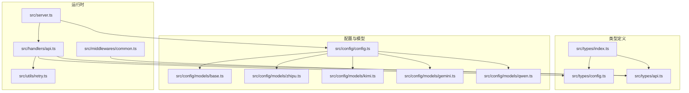
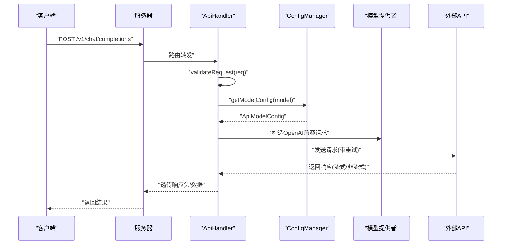
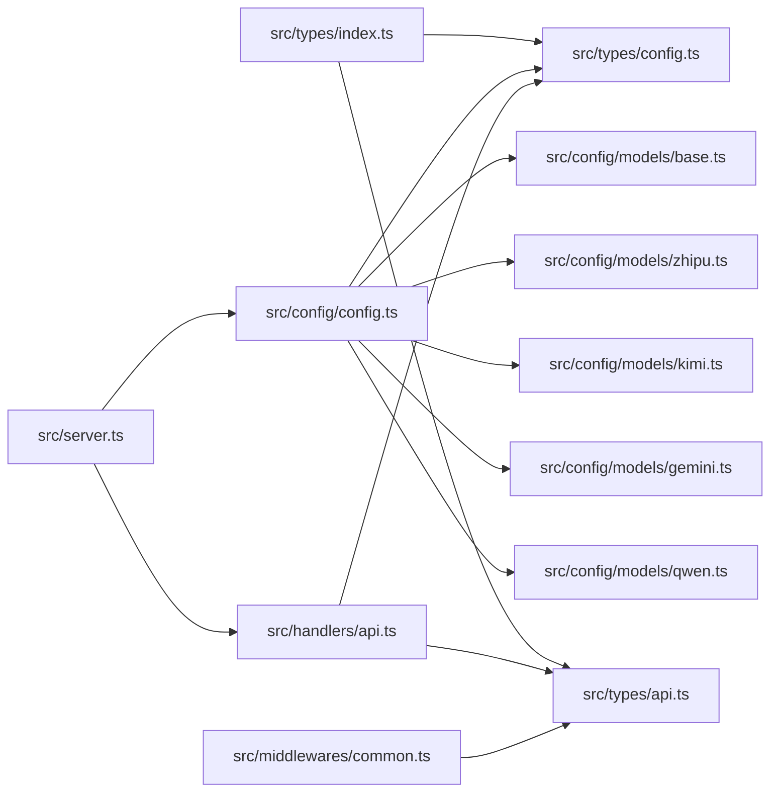

# 类型定义

<cite>
**本文档引用的文件**
- [src/types/config.ts](file://src/types/config.ts)
- [src/types/api.ts](file://src/types/api.ts)
- [src/types/index.ts](file://src/types/index.ts)
- [src/config/config.ts](file://src/config/config.ts)
- [src/config/models/base.ts](file://src/config/models/base.ts)
- [src/config/models/zhipu.ts](file://src/config/models/zhipu.ts)
- [src/config/models/gemini.ts](file://src/config/models/gemini.ts)
- [src/config/models/kimi.ts](file://src/config/models/kimi.ts)
- [src/config/models/qwen.ts](file://src/config/models/qwen.ts)
- [src/handlers/api.ts](file://src/handlers/api.ts)
- [src/middlewares/common.ts](file://src/middlewares/common.ts)
- [src/utils/retry.ts](file://src/utils/retry.ts)
- [src/server.ts](file://src/server.ts)
- [package.json](file://package.json)
- [tsconfig.json](file://tsconfig.json)
</cite>

## 目录
1. [简介](#简介)
2. [项目结构](#项目结构)
3. [核心组件](#核心组件)
4. [架构总览](#架构总览)
5. [详细组件分析](#详细组件分析)
6. [依赖分析](#依赖分析)
7. [性能考虑](#性能考虑)
8. [故障排查指南](#故障排查指南)
9. [结论](#结论)
10. [附录](#附录)

## 简介
本文件系统性梳理 xcode-ai-proxy 的类型定义体系，覆盖配置类型（如 ApiConfig、ApiModelConfig、ModelProviderConfig 等）与 API 类型（如 ChatCompletionRequest、ChatCompletionResponse、ErrorResponse 等），并结合实际代码说明类型在运行时的验证与使用方式。文档同时给出最佳实践、扩展指南以及类型系统与运行时验证的关系。

## 项目结构
类型定义主要位于 src/types 目录，配置与模型提供者位于 src/config，处理器与中间件位于 src/handlers 与 src/middlewares，工具函数位于 src/utils，入口服务位于 src/server。

图表来源
- [src/types/index.ts:1-2](file://src/types/index.ts#L1-L2)
- [src/config/config.ts:1-121](file://src/config/config.ts#L1-L121)
- [src/handlers/api.ts:1-196](file://src/handlers/api.ts#L1-L196)
- [src/server.ts:1-88](file://src/server.ts#L1-L88)

章节来源
- [src/types/index.ts:1-2](file://src/types/index.ts#L1-L2)
- [src/server.ts:29-44](file://src/server.ts#L29-L44)

## 核心组件
本节聚焦于类型定义的核心接口与它们在运行时的职责边界。

- 配置类型
  - ModelType：模型类型枚举，限定为 'api'
  - BaseModelConfig：基础模型配置，包含 type 与 name
  - ApiModelConfig：API 模型配置，继承基础配置，新增 apiUrl、apiKey、provider、可选 model、maxTokens、temperature 等
  - ModelConfig：当前版本等价于 ApiModelConfig
  - ModelConfigs：模型 ID 到模型配置的映射
  - AppConfig：应用级配置，包含端口、主机、最大重试次数、重试延迟、请求超时、可选自定义系统提示
  - EnvConfig：环境变量键集合，用于运行时校验与初始化

- API 类型
  - ChatMessageContent：消息内容项，限定 type 为 'text'，包含 text 字段
  - ChatMessage：消息对象，role 取值为 'user'|'assistant'|'system'，content 为字符串或 ChatMessageContent[]
  - ChatCompletionRequest：聊天补全请求，包含 model、messages、可选参数（max_tokens、temperature、stream、top_p、frequency_penalty、presence_penalty）
  - ChatCompletionResponse：聊天补全响应，包含 id、object、created、model、choices（含 message 与 finish_reason）、usage（prompt_tokens、completion_tokens、total_tokens）
  - ModelInfo：模型信息对象，包含 id、object、created、owned_by、可选 name
  - ModelsResponse：模型列表响应，包含 object 与 data（ModelInfo[]）
  - ErrorResponse：错误响应，包含 error 对象（message、type、可选 code）

章节来源
- [src/types/config.ts:1-48](file://src/types/config.ts#L1-L48)
- [src/types/api.ts:1-58](file://src/types/api.ts#L1-L58)

## 架构总览
类型定义贯穿配置加载、请求处理与响应透传的全流程。配置管理器负责从环境变量构建 AppConfig 与 ModelConfigs；处理器根据请求体中的 model 字段选择对应 ApiModelConfig，构造 OpenAI 兼容请求并进行重试与流式透传。

图表来源
- [src/handlers/api.ts:8-28](file://src/handlers/api.ts#L8-L28)
- [src/config/config.ts:107-113](file://src/config/config.ts#L107-L113)
- [src/server.ts:36-40](file://src/server.ts#L36-L40)

## 详细组件分析

### 配置类型定义与验证
- ModelType 与 BaseModelConfig
  - 作用：统一模型类型标识与基础元信息
  - 关系：ApiModelConfig 继承自 BaseModelConfig，并以字面量类型固定 type 为 'api'

- ApiModelConfig
  - 字段：type 固定为 'api'，apiUrl、apiKey 必填，provider 限定为 'zhipu'|'kimi'|'google'|'qwen'，其余为可选
  - 用途：作为具体模型的运行时配置载体，被处理器读取并构造上游请求

- ModelConfigs 与 ModelConfig
  - ModelConfigs：模型 ID 到 ApiModelConfig 的映射
  - ModelConfig：当前版本等价于 ApiModelConfig

- AppConfig
  - 字段：port、host、maxRetries、retryDelay、requestTimeout、customSystemPrompt?
  - 初始化：ConfigManager 从 EnvConfig 解析字符串并转换为数字，支持可选 customSystemPrompt

- EnvConfig
  - 字段：各平台 API 密钥与 URL、自定义系统提示、服务端口、主机、重试与超时等
  - 校验：ConfigManager 在构造时检查至少存在一个 API 密钥，否则终止进程

- 运行时验证要点
  - 环境变量必需性：至少一个 API 密钥必须存在
  - 应用配置默认值：未设置时采用默认值
  - 模型可用性：Provider 的 isAvailable 由 apiKey 与 enabled 控制

章节来源
- [src/types/config.ts:1-48](file://src/types/config.ts#L1-L48)
- [src/config/config.ts:27-97](file://src/config/config.ts#L27-L97)
- [src/config/models/base.ts:3-7](file://src/config/models/base.ts#L3-L7)
- [src/config/models/zhipu.ts:12-14](file://src/config/models/zhipu.ts#L12-L14)
- [src/config/models/gemini.ts:12-14](file://src/config/models/gemini.ts#L12-L14)
- [src/config/models/kimi.ts:12-14](file://src/config/models/kimi.ts#L12-L14)
- [src/config/models/qwen.ts:12-14](file://src/config/models/qwen.ts#L12-L14)

### API 类型定义与使用
- ChatMessageContent 与 ChatMessage
  - 作用：描述单条消息的内容结构，支持纯文本或富文本数组
  - 使用：处理器在构造请求前对 messages 进行预处理，插入系统提示

- ChatCompletionRequest
  - 作用：统一的聊天补全请求体，字段与 OpenAI 兼容
  - 使用：处理器直接透传至上游，仅做必要字段修正（如 Qwen 的 tools 空数组清理）

- ChatCompletionResponse 与 ModelsResponse
  - 作用：统一响应结构，便于下游兼容
  - 使用：处理器在非流式场景直接返回上游响应，在流式场景透传流

- ErrorResponse
  - 作用：统一错误响应格式
  - 使用：处理器在上游返回错误时构造并返回该结构

章节来源
- [src/types/api.ts:1-58](file://src/types/api.ts#L1-L58)
- [src/handlers/api.ts:59-100](file://src/handlers/api.ts#L59-L100)
- [src/handlers/api.ts:124-164](file://src/handlers/api.ts#L124-L164)

### 错误类型与异常处理机制
- 中间件错误处理
  - errorHandler：捕获未处理异常，输出日志并返回统一 ErrorResponse 结构
- 处理器错误处理
  - ApiHandler：捕获内部异常并返回统一错误；对上游 4xx/5xx 响应进行解析与透传
  - 流式错误：读取错误流内容并解析为 JSON 或回退为文本
- 重试机制
  - withRetry：按递增延迟重试，最多 maxRetries 次，最终抛出最后一次错误

章节来源
- [src/middlewares/common.ts:9-25](file://src/middlewares/common.ts#L9-L25)
- [src/handlers/api.ts:24-28](file://src/handlers/api.ts#L24-L28)
- [src/handlers/api.ts:132-164](file://src/handlers/api.ts#L132-L164)
- [src/utils/retry.ts:1-34](file://src/utils/retry.ts#L1-L34)

### 类型系统在项目中的应用
- 强类型约束
  - tsconfig 启用严格模式（strict、strictNullChecks、noImplicitReturns 等），确保编译期发现潜在问题
- 接口一致性
  - 所有配置与请求响应均以接口形式定义，保证跨模块契约清晰
- 运行时与编译时协同
  - 编译期通过接口约束参数与返回值；运行时通过 ConfigManager 与处理器逻辑完成环境变量解析与请求转发

章节来源
- [tsconfig.json:8-26](file://tsconfig.json#L8-L26)
- [package.json:14-28](file://package.json#L14-L28)

### 类型扩展与自定义开发指南
- 新增模型提供者
  - 步骤：实现 BaseModelProvider 抽象类，提供 getModels、isAvailable、getProviderName；在 ConfigManager.initializeModelConfigs 中注册
  - 参考：现有 ZhipuProvider、KimiProvider、GeminiProvider、QwenProvider 的实现模式
- 新增配置项
  - 在 EnvConfig 中添加新键；在 ConfigManager.initializeAppConfig 中解析并赋值到 AppConfig
  - 若涉及模型配置，可在 ApiModelConfig 中扩展字段，并在 Provider 的 getModels 中填充
- 新增请求/响应字段
  - 在对应的接口中扩展字段；在处理器中处理新字段（如透传、修正、清理）
  - 注意保持与 OpenAI 兼容的字段命名与语义

章节来源
- [src/config/models/base.ts:3-7](file://src/config/models/base.ts#L3-L7)
- [src/config/models/zhipu.ts:20-33](file://src/config/models/zhipu.ts#L20-L33)
- [src/config/models/kimi.ts:20-33](file://src/config/models/kimi.ts#L20-L33)
- [src/config/models/gemini.ts:20-33](file://src/config/models/gemini.ts#L20-L33)
- [src/config/models/qwen.ts:20-34](file://src/config/models/qwen.ts#L20-L34)
- [src/config/config.ts:67-97](file://src/config/config.ts#L67-L97)

### 类型定义与运行时验证的关系
- 编译期验证
  - 通过接口与类型约束，确保调用方与被调用方遵循一致的数据结构
- 运行时验证
  - ConfigManager 校验环境变量必需性与默认值；处理器校验 model 是否为 'api' 类型；上游响应状态码与流式错误解析
- 协同策略
  - 类型定义提供契约，运行时逻辑提供容错与兼容（如插入系统提示、清理空数组、透传流式响应）

章节来源
- [src/config/config.ts:27-97](file://src/config/config.ts#L27-L97)
- [src/handlers/api.ts:16-22](file://src/handlers/api.ts#L16-L22)
- [src/handlers/api.ts:59-100](file://src/handlers/api.ts#L59-L100)

## 依赖分析
类型定义之间的导出与导入关系如下：

图表来源
- [src/types/index.ts:1-2](file://src/types/index.ts#L1-L2)
- [src/config/config.ts:1-5](file://src/config/config.ts#L1-L5)
- [src/handlers/api.ts:5-6](file://src/handlers/api.ts#L5-L6)
- [src/server.ts:3-6](file://src/server.ts#L3-L6)

章节来源
- [src/types/index.ts:1-2](file://src/types/index.ts#L1-L2)
- [src/config/config.ts:1-5](file://src/config/config.ts#L1-L5)
- [src/handlers/api.ts:5-6](file://src/handlers/api.ts#L5-L6)
- [src/server.ts:3-6](file://src/server.ts#L3-L6)

## 性能考虑
- 重试策略：withRetry 采用递增延迟，避免雪崩效应，同时限制最大重试次数
- 超时控制：请求超时由 AppConfig.requestTimeout 控制，防止长时间阻塞
- 流式响应：在流式场景下直接透传，减少中间层拷贝与转换
- 日志与可观测性：关键节点输出日志，便于定位性能瓶颈

章节来源
- [src/utils/retry.ts:1-34](file://src/utils/retry.ts#L1-L34)
- [src/config/config.ts:51-65](file://src/config/config.ts#L51-L65)
- [src/handlers/api.ts:176-194](file://src/handlers/api.ts#L176-L194)

## 故障排查指南
- 环境变量缺失
  - 现象：启动即退出
  - 处理：确保至少配置一个平台的 API 密钥与 URL
- 模型不可用
  - 现象：请求返回无效模型错误
  - 处理：确认模型 ID 存在于已加载的 ModelConfigs 中，且 Provider 的 isAvailable 返回 true
- 上游错误响应
  - 现象：返回 4xx/5xx
  - 处理：查看处理器日志中的错误详情，必要时调整请求参数或上游配置
- 流式错误
  - 现象：流中断或解析失败
  - 处理：检查网络与上游稳定性，确认流式响应头设置正确

章节来源
- [src/config/config.ts:27-49](file://src/config/config.ts#L27-L49)
- [src/handlers/api.ts:16-22](file://src/handlers/api.ts#L16-L22)
- [src/handlers/api.ts:124-164](file://src/handlers/api.ts#L124-L164)

## 结论
本类型定义体系以强类型接口为契约，配合运行时的环境变量解析与请求处理逻辑，实现了多模型提供者的统一接入与兼容。通过严格的编译期约束与运行时验证，既保证了系统的稳定性，也为后续扩展提供了清晰的边界与路径。

## 附录
- 使用示例与最佳实践
  - 请求体示例：参考 ChatCompletionRequest 的字段定义，确保包含 model 与 messages
  - 响应处理：非流式场景直接解析 JSON；流式场景透传 SSE 数据流
  - 错误处理：统一使用 ErrorResponse 结构，便于前端与 Xcode 集成
- 开发建议
  - 新增字段时优先扩展接口并在处理器中显式处理
  - 保持与 OpenAI 兼容的字段命名，降低迁移成本
  - 为每个 Provider 提供 isAvailable 的明确判断逻辑