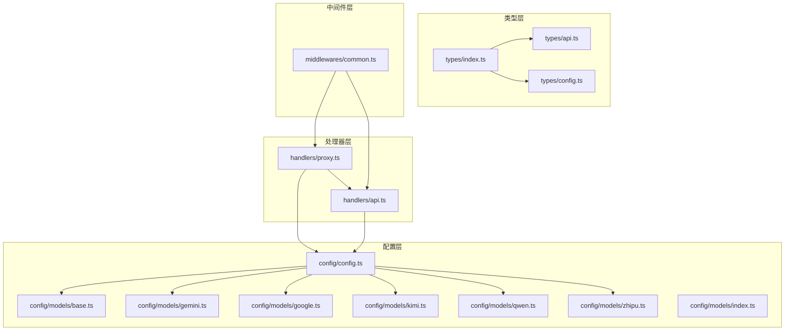
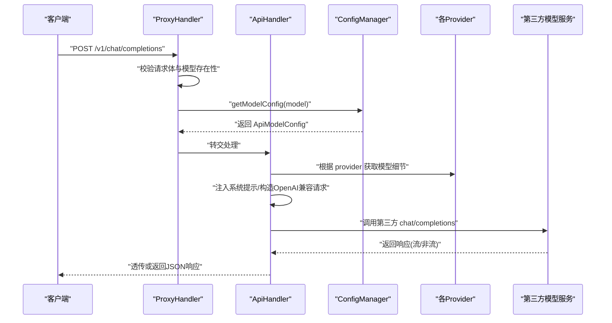
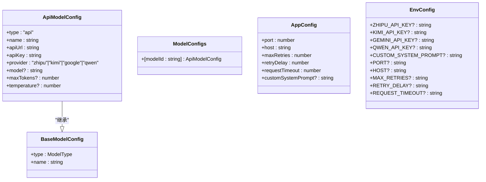
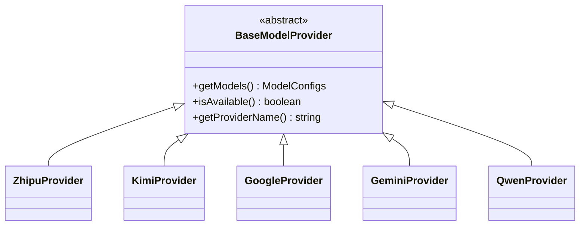
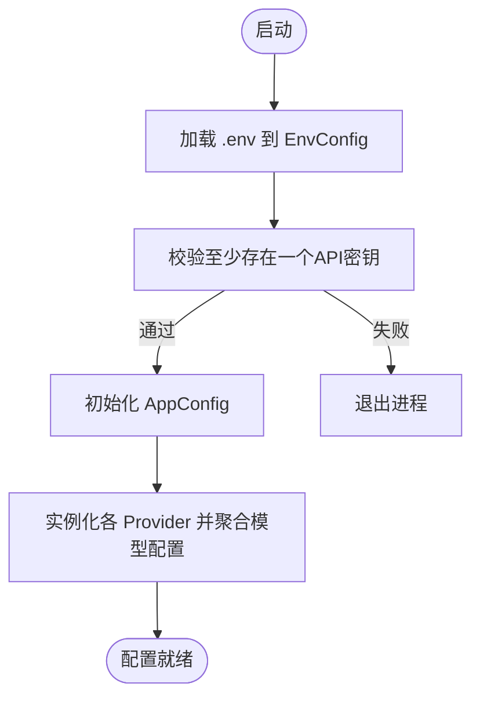
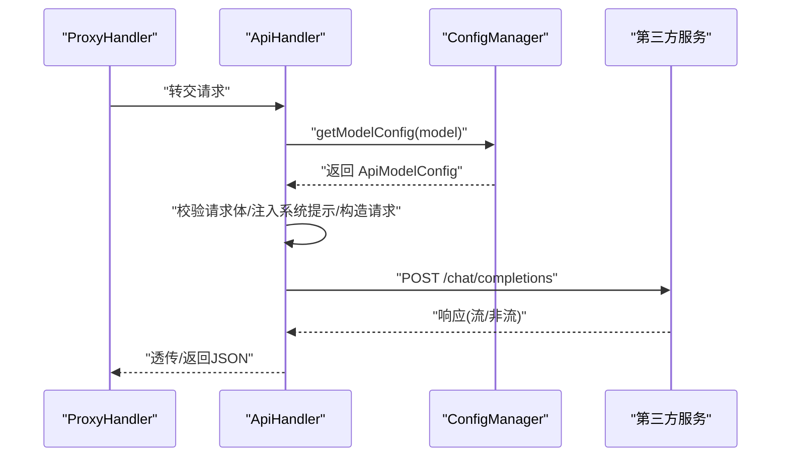
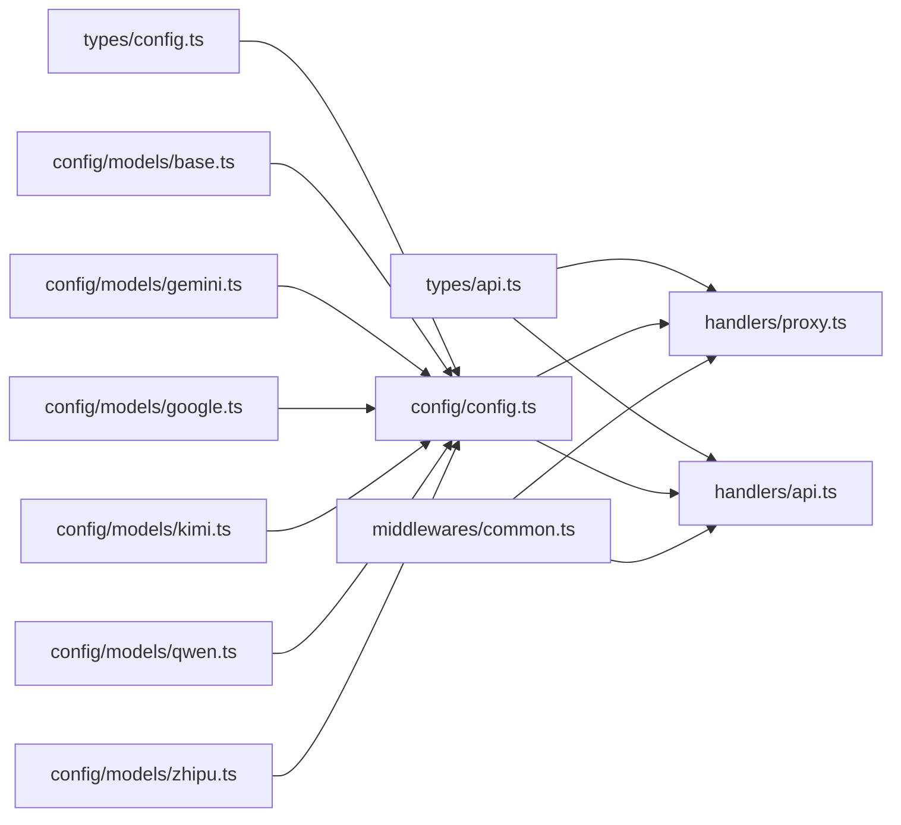

# 类型系统集成

<cite>
**本文档引用的文件**
- [src/types/index.ts](file://src/types/index.ts)
- [src/types/api.ts](file://src/types/api.ts)
- [src/types/config.ts](file://src/types/config.ts)
- [src/config/models/base.ts](file://src/config/models/base.ts)
- [src/config/models/gemini.ts](file://src/config/models/gemini.ts)
- [src/config/models/google.ts](file://src/config/models/google.ts)
- [src/config/models/kimi.ts](file://src/config/models/kimi.ts)
- [src/config/models/qwen.ts](file://src/config/models/qwen.ts)
- [src/config/models/zhipu.ts](file://src/config/models/zhipu.ts)
- [src/config/models/index.ts](file://src/config/models/index.ts)
- [src/config/config.ts](file://src/config/config.ts)
- [src/handlers/api.ts](file://src/handlers/api.ts)
- [src/handlers/proxy.ts](file://src/handlers/proxy.ts)
- [src/middlewares/common.ts](file://src/middlewares/common.ts)
</cite>

## 目录
1. [引言](#引言)
2. [项目结构](#项目结构)
3. [核心组件](#核心组件)
4. [架构总览](#架构总览)
5. [详细组件分析](#详细组件分析)
6. [依赖关系分析](#依赖关系分析)
7. [性能考量](#性能考量)
8. [故障排查指南](#故障排查指南)
9. [结论](#结论)
10. [附录](#附录)

## 引言
本文件围绕 xcode-ai-proxy 的类型系统集成进行系统化说明，重点阐述类型定义在项目架构中的作用与落地方式，以及其与配置管理、API 处理器、中间件系统的协同机制。文档同时总结类型推导与泛型的最佳实践，解释运行时类型验证与编译时类型检查的关系，并给出类型安全的开发模式、常见类型错误的解决思路、提升可读性与可维护性的方法、性能优化建议，以及在测试与调试中如何有效利用类型定义。

## 项目结构
项目采用按领域分层的组织方式：
- types 层：集中定义跨模块共享的接口与类型，确保各模块在契约层面保持一致。
- config 层：负责配置加载、校验与聚合，提供统一的模型配置与应用配置。
- handlers 层：封装 API 代理与具体模型调用逻辑，面向 Express 的请求/响应处理。
- middlewares 层：提供通用中间件（如日志与错误处理）。
- models 子模块：以 Provider 抽象为核心，按不同供应商实现模型配置工厂。

图表来源
- [src/types/index.ts:1-2](file://src/types/index.ts#L1-L2)
- [src/types/api.ts:1-58](file://src/types/api.ts#L1-L58)
- [src/types/config.ts:1-48](file://src/types/config.ts#L1-L48)
- [src/config/config.ts:1-123](file://src/config/config.ts#L1-L123)
- [src/config/models/base.ts:1-13](file://src/config/models/base.ts#L1-L13)
- [src/config/models/gemini.ts:1-34](file://src/config/models/gemini.ts#L1-L34)
- [src/config/models/google.ts:1-34](file://src/config/models/google.ts#L1-L34)
- [src/config/models/kimi.ts:1-34](file://src/config/models/kimi.ts#L1-L34)
- [src/config/models/qwen.ts:1-35](file://src/config/models/qwen.ts#L1-L35)
- [src/config/models/zhipu.ts:1-34](file://src/config/models/zhipu.ts#L1-L34)
- [src/handlers/proxy.ts:1-66](file://src/handlers/proxy.ts#L1-L66)
- [src/handlers/api.ts:1-196](file://src/handlers/api.ts#L1-L196)
- [src/middlewares/common.ts:1-25](file://src/middlewares/common.ts#L1-L25)

章节来源
- [src/types/index.ts:1-2](file://src/types/index.ts#L1-L2)
- [src/types/api.ts:1-58](file://src/types/api.ts#L1-L58)
- [src/types/config.ts:1-48](file://src/types/config.ts#L1-L48)
- [src/config/config.ts:1-123](file://src/config/config.ts#L1-L123)
- [src/config/models/base.ts:1-13](file://src/config/models/base.ts#L1-L13)
- [src/config/models/gemini.ts:1-34](file://src/config/models/gemini.ts#L1-L34)
- [src/config/models/google.ts:1-34](file://src/config/models/google.ts#L1-L34)
- [src/config/models/kimi.ts:1-34](file://src/config/models/kimi.ts#L1-L34)
- [src/config/models/qwen.ts:1-35](file://src/config/models/qwen.ts#L1-L35)
- [src/config/models/zhipu.ts:1-34](file://src/config/models/zhipu.ts#L1-L34)
- [src/handlers/proxy.ts:1-66](file://src/handlers/proxy.ts#L1-L66)
- [src/handlers/api.ts:1-196](file://src/handlers/api.ts#L1-L196)
- [src/middlewares/common.ts:1-25](file://src/middlewares/common.ts#L1-L25)

## 核心组件
- 类型定义层
  - API 类型：ChatMessageContent、ChatMessage、ChatCompletionRequest、ChatCompletionResponse、ModelInfo、ModelsResponse、ErrorResponse，统一 OpenAI 兼容风格的数据结构。
  - 配置类型：ModelType、BaseModelConfig、ApiModelConfig、ModelConfigs、AppConfig、EnvConfig，覆盖模型配置、应用配置与环境变量映射。
- Provider 抽象层
  - BaseModelProvider 抽象类定义统一接口：getModels、isAvailable、getProviderName；ModelProviderConfig 定义可选的 apiKey、apiUrl、enabled。
  - 各供应商（Zhipu、Kimi、Google/Gemini、Qwen）实现 getModels，返回键为模型 ID、值为 ApiModelConfig 的对象。
- 配置管理层
  - ConfigManager 单例：加载 .env，校验必要环境变量，初始化 AppConfig 与 ModelConfigs；聚合各 Provider 的模型配置；提供查询与日志能力。
- 处理器层
  - ProxyHandler：路由入口，校验模型存在性与类型，将 API 类型请求转交 ApiHandler。
  - ApiHandler：解析请求、注入系统提示、构造 OpenAI 兼容请求体、调用第三方 API、透传或返回响应。
- 中间件层
  - loggingMiddleware：统一日志记录。
  - errorHandler：统一错误响应。

章节来源
- [src/types/api.ts:1-58](file://src/types/api.ts#L1-L58)
- [src/types/config.ts:1-48](file://src/types/config.ts#L1-L48)
- [src/config/models/base.ts:1-13](file://src/config/models/base.ts#L1-L13)
- [src/config/models/zhipu.ts:1-34](file://src/config/models/zhipu.ts#L1-L34)
- [src/config/models/kimi.ts:1-34](file://src/config/models/kimi.ts#L1-L34)
- [src/config/models/google.ts:1-34](file://src/config/models/google.ts#L1-L34)
- [src/config/models/gemini.ts:1-34](file://src/config/models/gemini.ts#L1-L34)
- [src/config/models/qwen.ts:1-35](file://src/config/models/qwen.ts#L1-L35)
- [src/config/config.ts:1-123](file://src/config/config.ts#L1-L123)
- [src/handlers/proxy.ts:1-66](file://src/handlers/proxy.ts#L1-L66)
- [src/handlers/api.ts:1-196](file://src/handlers/api.ts#L1-L196)
- [src/middlewares/common.ts:1-25](file://src/middlewares/common.ts#L1-L25)

## 架构总览
类型系统贯穿于配置加载、模型发现、请求处理与响应返回的全链路，确保：
- 编译期约束：接口与类型定义在编译期阻止不匹配的字段访问与参数传递。
- 运行期校验：在关键路径（模型可用性、请求体合法性、响应状态）进行运行时检查，结合类型断言与条件分支保证健壮性。
- 可扩展性：通过 BaseModelProvider 抽象与 ApiModelConfig，新增供应商只需实现 getModels 并返回符合契约的对象。

图表来源
- [src/handlers/proxy.ts:9-37](file://src/handlers/proxy.ts#L9-L37)
- [src/handlers/api.ts:30-196](file://src/handlers/api.ts#L30-L196)
- [src/config/config.ts:109-115](file://src/config/config.ts#L109-L115)
- [src/config/models/gemini.ts:20-33](file://src/config/models/gemini.ts#L20-L33)
- [src/config/models/kimi.ts:20-33](file://src/config/models/kimi.ts#L20-L33)
- [src/config/models/google.ts:20-33](file://src/config/models/google.ts#L20-L33)
- [src/config/models/qwen.ts:20-33](file://src/config/models/qwen.ts#L20-L33)
- [src/config/models/zhipu.ts:20-33](file://src/config/models/zhipu.ts#L20-L33)

## 详细组件分析

### 类型定义与契约
- API 类型
  - ChatMessageContent、ChatMessage、ChatCompletionRequest/Response：统一消息结构与响应结构，支持多模态内容数组与 OpenAI 兼容字段。
  - ModelsResponse/ModelInfo：模型列表与单个模型信息，便于前端或工具展示。
  - ErrorResponse：标准化错误结构，便于统一处理。
- 配置类型
  - ModelType/BaseModelConfig/ApiModelConfig：通过联合类型与字面量类型限定 provider 与字段约束。
  - ModelConfigs：以模型 ID 为键的映射，便于快速查找。
  - AppConfig/EnvConfig：应用级配置与环境变量映射，含超时、重试等参数。

图表来源
- [src/types/config.ts:1-48](file://src/types/config.ts#L1-L48)
- [src/types/api.ts:1-58](file://src/types/api.ts#L1-L58)

章节来源
- [src/types/api.ts:1-58](file://src/types/api.ts#L1-L58)
- [src/types/config.ts:1-48](file://src/types/config.ts#L1-L48)

### Provider 抽象与实现
- BaseModelProvider：抽象出模型可用性判断、名称标识与模型清单获取。
- 各 Provider 实现：在 getModels 中返回固定键（模型 ID）与 ApiModelConfig 值，包含 provider、apiUrl、apiKey、model、name 等字段。
- ConfigManager 聚合：通过实例化各 Provider 并合并其返回的模型映射，形成全局可用的 ModelConfigs。

图表来源
- [src/config/models/base.ts:3-7](file://src/config/models/base.ts#L3-L7)
- [src/config/models/zhipu.ts:4-33](file://src/config/models/zhipu.ts#L4-L33)
- [src/config/models/kimi.ts:4-33](file://src/config/models/kimi.ts#L4-L33)
- [src/config/models/google.ts:4-33](file://src/config/models/google.ts#L4-L33)
- [src/config/models/gemini.ts:4-33](file://src/config/models/gemini.ts#L4-L33)
- [src/config/models/qwen.ts:4-34](file://src/config/models/qwen.ts#L4-L34)

章节来源
- [src/config/models/base.ts:1-13](file://src/config/models/base.ts#L1-L13)
- [src/config/models/zhipu.ts:1-34](file://src/config/models/zhipu.ts#L1-L34)
- [src/config/models/kimi.ts:1-34](file://src/config/models/kimi.ts#L1-L34)
- [src/config/models/google.ts:1-34](file://src/config/models/google.ts#L1-L34)
- [src/config/models/gemini.ts:1-34](file://src/config/models/gemini.ts#L1-L34)
- [src/config/models/qwen.ts:1-35](file://src/config/models/qwen.ts#L1-L35)

### 配置管理与类型协作
- 环境变量校验：ConfigManager 在构造阶段校验至少存在一个 API 密钥，否则终止进程。
- 应用配置初始化：从 EnvConfig 解析数值型与字符串型配置，生成 AppConfig。
- 模型配置聚合：逐个 Provider 调用 getModels 并合并到 ModelConfigs；最终由 ProxyHandler/ApiHandler 查询使用。

图表来源
- [src/config/config.ts:29-99](file://src/config/config.ts#L29-L99)

章节来源
- [src/config/config.ts:1-123](file://src/config/config.ts#L1-L123)

### API 处理器与类型协作
- 请求校验与模型选择：ProxyHandler 校验模型存在性与类型，ApiHandler 校验请求体并解析模型配置。
- OpenAI 兼容请求构建：统一注入系统提示、修正特殊字段（如 Qwen 的空 tools），并透传流式响应。
- 错误处理：对 4xx/5xx 响应进行降级与错误对象增强，便于上层捕获与统一处理。

图表来源
- [src/handlers/proxy.ts:9-37](file://src/handlers/proxy.ts#L9-L37)
- [src/handlers/api.ts:9-28](file://src/handlers/api.ts#L9-L28)
- [src/config/config.ts:109-115](file://src/config/config.ts#L109-L115)

章节来源
- [src/handlers/proxy.ts:1-66](file://src/handlers/proxy.ts#L1-L66)
- [src/handlers/api.ts:1-196](file://src/handlers/api.ts#L1-L196)
- [src/config/config.ts:109-115](file://src/config/config.ts#L109-L115)

### 中间件与类型协作
- 日志中间件：统一记录请求方法与路径，便于定位类型相关问题（如请求体结构异常）。
- 错误处理中间件：统一捕获未处理异常，输出标准化错误响应，避免类型泄漏到外部。

章节来源
- [src/middlewares/common.ts:1-25](file://src/middlewares/common.ts#L1-L25)

## 依赖关系分析
- types 层被 config、handlers、middlewares 广泛依赖，作为契约层稳定各模块交互。
- config 层依赖 models 子模块，聚合 Provider 的模型配置。
- handlers 层依赖 config 层提供的配置与 models 层的模型信息。
- middlewares 层独立于业务逻辑，仅依赖 Express 类型。

图表来源
- [src/types/api.ts:1-58](file://src/types/api.ts#L1-L58)
- [src/types/config.ts:1-48](file://src/types/config.ts#L1-L48)
- [src/config/config.ts:1-123](file://src/config/config.ts#L1-L123)
- [src/config/models/base.ts:1-13](file://src/config/models/base.ts#L1-L13)
- [src/config/models/gemini.ts:1-34](file://src/config/models/gemini.ts#L1-L34)
- [src/config/models/google.ts:1-34](file://src/config/models/google.ts#L1-L34)
- [src/config/models/kimi.ts:1-34](file://src/config/models/kimi.ts#L1-L34)
- [src/config/models/qwen.ts:1-35](file://src/config/models/qwen.ts#L1-L35)
- [src/config/models/zhipu.ts:1-34](file://src/config/models/zhipu.ts#L1-L34)
- [src/handlers/proxy.ts:1-66](file://src/handlers/proxy.ts#L1-L66)
- [src/handlers/api.ts:1-196](file://src/handlers/api.ts#L1-L196)
- [src/middlewares/common.ts:1-25](file://src/middlewares/common.ts#L1-L25)

章节来源
- [src/types/index.ts:1-2](file://src/types/index.ts#L1-L2)
- [src/config/models/index.ts:1-5](file://src/config/models/index.ts#L1-L5)

## 性能考量
- 类型检查成本：在大型项目中，过多的交叉类型与深层嵌套可能增加编译时间。建议：
  - 将高频使用的简单类型拆分为独立模块，减少重复导入。
  - 对复杂对象使用局部类型别名，避免在多处重复展开。
- 运行时开销：
  - Provider 的 getModels 返回的是纯对象映射，查找为 O(1)，适合热路径。
  - 流式响应透传时避免额外的 JSON 解析与序列化，直接 pipe 可降低 CPU 与内存占用。
- 配置加载：
  - ConfigManager 使用单例与惰性初始化，避免重复 IO；建议在启动阶段完成配置校验，减少运行时分支判断。

## 故障排查指南
- 编译期错误
  - 字段缺失：当向 ChatCompletionRequest 或 ApiModelConfig 注入新字段时，若未满足接口定义，TS 将报错。解决：补充接口字段或使用可选属性。
  - 联合类型不匹配：provider 必须为限定集合之一，赋值为其他值会触发类型错误。解决：严格遵循枚举值或添加类型守卫。
- 运行期错误
  - 模型不可用：isAvailable 返回 false 时，getModels 返回空映射，导致查询不到配置。解决：检查环境变量与 enabled 标记。
  - 请求体非法：ProxyHandler/ApiHandler 会在模型不存在或类型不符时返回错误。解决：确认客户端发送的 model 是否存在于已加载的模型列表。
  - 第三方响应异常：ApiHandler 对 4xx/5xx 做降级处理并增强错误对象，便于定位。解决：查看日志中的错误响应内容与状态码。
- 调试技巧
  - 使用中间件记录请求方法与路径，结合类型注解定位问题范围。
  - 在关键函数（如 handleApiRequest）打印请求体与响应头，核对 OpenAI 兼容字段是否正确。

章节来源
- [src/handlers/proxy.ts:14-31](file://src/handlers/proxy.ts#L14-L31)
- [src/handlers/api.ts:124-164](file://src/handlers/api.ts#L124-L164)
- [src/middlewares/common.ts:4-24](file://src/middlewares/common.ts#L4-L24)

## 结论
本项目通过清晰的类型定义与 Provider 抽象，实现了配置、请求与响应在编译期与运行期的双重约束。类型系统不仅提升了代码可读性与可维护性，也为扩展新的模型提供商提供了稳定的契约基础。配合统一的中间件与严格的错误处理，整体具备良好的稳定性与可观测性。

## 附录

### 类型推导与泛型最佳实践
- 推导优先：尽量让 TS 自动推导返回值类型，减少手动声明。
- 泛型约束：在需要复用的工具函数中使用泛型，限制输入输出类型边界。
- 条件类型：对可选字段使用条件类型，避免在下游做冗余的空值判断。

### 运行时类型验证与编译时类型检查
- 编译期：通过接口与字面量类型在编译阶段拦截错误。
- 运行期：在配置加载、请求解析、响应处理等关键节点进行显式校验与断言，确保与接口定义一致。

### 类型安全的开发模式
- 将“契约”前置：先写类型定义，再实现逻辑。
- 分层隔离：类型层不依赖运行时实现，运行时模块依赖类型层。
- 最小暴露：对外只暴露必要的类型别名与接口，隐藏实现细节。

### 在测试与调试中的应用
- 单元测试：针对 ApiModelConfig 与 ChatCompletionRequest 的构造与转换编写用例，确保类型一致性。
- 集成测试：模拟不同 Provider 的返回，验证 ProxyHandler/ApiHandler 的分支逻辑与错误处理。
- 调试：利用中间件日志与类型注解，快速定位请求体结构、响应头与第三方错误信息。