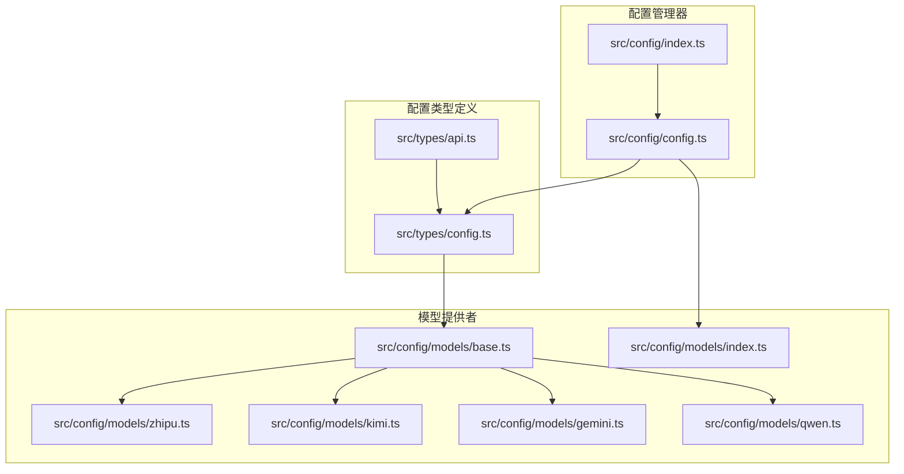
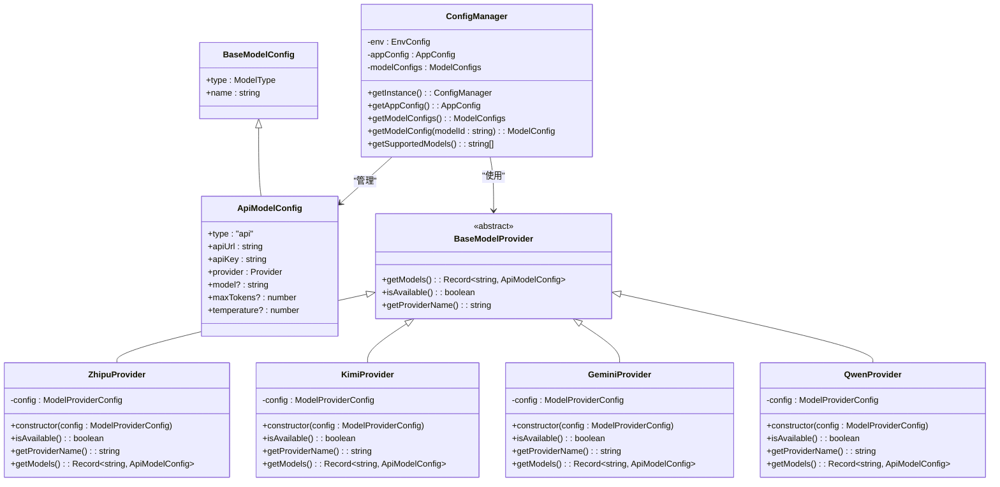
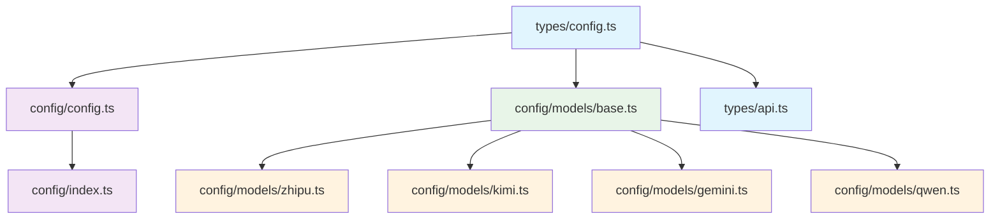

# 配置类型定义

<cite>
**本文档引用的文件**
- [src/types/config.ts](file://src/types/config.ts)
- [src/config/models/base.ts](file://src/config/models/base.ts)
- [src/config/models/zhipu.ts](file://src/config/models/zhipu.ts)
- [src/config/models/kimi.ts](file://src/config/models/kimi.ts)
- [src/config/models/gemini.ts](file://src/config/models/gemini.ts)
- [src/config/models/qwen.ts](file://src/config/models/qwen.ts)
- [src/config/models/index.ts](file://src/config/models/index.ts)
- [src/config/config.ts](file://src/config/config.ts)
- [src/types/api.ts](file://src/types/api.ts)
- [src/config/index.ts](file://src/config/index.ts)
</cite>

## 目录
1. [简介](#简介)
2. [项目结构](#项目结构)
3. [核心组件](#核心组件)
4. [架构概览](#架构概览)
5. [详细组件分析](#详细组件分析)
6. [依赖分析](#依赖分析)
7. [性能考虑](#性能考虑)
8. [故障排除指南](#故障排除指南)
9. [结论](#结论)
10. [附录](#附录)

## 简介

xcode-ai-proxy 是一个基于 TypeScript 的 AI 代理服务，提供了统一的配置类型系统来管理不同 AI 提供商的模型配置。本文档深入解析配置类型系统的完整架构，包括基础配置接口、模型配置、应用配置和环境变量配置的设计与实现。

该系统采用面向对象的设计模式，通过抽象基类和具体实现类来支持多个 AI 提供商（智谱、Kimi、Gemini、通义千问），并提供了灵活的配置管理和验证机制。

## 项目结构

配置类型系统主要分布在以下目录结构中：



**图表来源**
- [src/types/config.ts:1-48](file://src/types/config.ts#L1-L48)
- [src/config/models/base.ts:1-13](file://src/config/models/base.ts#L1-L13)
- [src/config/config.ts:1-121](file://src/config/config.ts#L1-L121)

**章节来源**
- [src/types/config.ts:1-48](file://src/types/config.ts#L1-L48)
- [src/config/models/index.ts:1-5](file://src/config/models/index.ts#L1-L5)

## 核心组件

### 基础配置接口

配置类型系统的核心是类型安全的接口设计，确保所有配置都遵循统一的结构规范。

#### BaseModelConfig 基础配置接口
- **type**: ModelType 类型，固定为 'api'
- **name**: string 类型，模型的显示名称
- **作用**: 作为所有模型配置的基础接口，提供最小化的配置要求

#### ApiModelConfig 接口扩展
ApiModelConfig 继承自 BaseModelConfig，增加了特定于 API 调用的配置项：
- **apiUrl**: string 类型，AI 服务的 API 端点地址
- **apiKey**: string 类型，访问 API 所需的认证密钥
- **provider**: 枚举类型，支持 'zhipu' | 'kimi' | 'google' | 'qwen'
- **model**: 可选 string 类型，具体的模型标识符
- **maxTokens**: 可选 number 类型，最大生成令牌数
- **temperature**: 可选 number 类型，采样温度参数

**章节来源**
- [src/types/config.ts:3-16](file://src/types/config.ts#L3-L16)

### 配置集合结构

#### ModelConfigs 接口
```typescript
export interface ModelConfigs {
  [modelId: string]: ModelConfig;
}
```
- 使用字符串索引的字典结构
- 键为模型 ID（如 'glm-4.5', 'gemini-2.5-pro'）
- 值为对应的 ApiModelConfig 实例

#### AppConfig 应用配置
- **port**: number 类型，默认 3000
- **host**: string 类型，默认 '0.0.0.0'
- **maxRetries**: number 类型，默认 3
- **retryDelay**: number 类型，默认 1000ms
- **requestTimeout**: number 类型，默认 60000ms
- **customSystemPrompt**: 可选 string 类型，自定义系统提示

#### EnvConfig 环境变量配置
环境变量采用键值对映射，支持以下配置：
- **API 密钥**: ZHIPU_API_KEY, KIMI_API_KEY, GEMINI_API_KEY, QWEN_API_KEY
- **API 地址**: ZHIPU_API_URL, KIMI_API_URL, GEMINI_API_URL, QWEN_API_URL
- **应用配置**: PORT, HOST, MAX_RETRIES, RETRY_DELAY, REQUEST_TIMEOUT
- **自定义提示**: CUSTOM_SYSTEM_PROMPT

**章节来源**
- [src/types/config.ts:18-48](file://src/types/config.ts#L18-L48)

## 架构概览

配置类型系统采用分层架构设计，从底层的类型定义到上层的配置管理器形成完整的配置体系：



**图表来源**
- [src/types/config.ts:3-48](file://src/types/config.ts#L3-L48)
- [src/config/models/base.ts:3-13](file://src/config/models/base.ts#L3-L13)
- [src/config/models/zhipu.ts:4-34](file://src/config/models/zhipu.ts#L4-L34)
- [src/config/models/kimi.ts:4-34](file://src/config/models/kimi.ts#L4-L34)
- [src/config/models/gemini.ts:4-34](file://src/config/models/gemini.ts#L4-L34)
- [src/config/models/qwen.ts:4-35](file://src/config/models/qwen.ts#L4-L35)
- [src/config/config.ts:7-121](file://src/config/config.ts#L7-L121)

## 详细组件分析

### BaseModelProvider 抽象基类

BaseModelProvider 定义了所有 AI 提供商的通用接口：

#### 核心方法
- **getModels()**: 返回模型配置字典
- **isAvailable()**: 检查提供器是否可用
- **getProviderName()**: 返回提供器名称

#### ModelProviderConfig 接口
- **apiKey**: 可选 API 密钥
- **apiUrl**: 可选 API 地址
- **enabled**: 可选启用状态，默认 true

**章节来源**
- [src/config/models/base.ts:3-13](file://src/config/models/base.ts#L3-L13)

### 具体提供器实现

每个 AI 提供商都有专门的实现类，负责生成对应的服务配置。

#### 智谱提供器 (ZhipuProvider)
- **模型 ID**: 'glm-4.5'
- **模型名称**: GLM-4.5
- **默认 API 地址**: https://open.bigmodel.cn/api/paas/v4
- **默认模型标识**: glm-4-0520

#### Kimi 提供器 (KimiProvider)
- **模型 ID**: 'kimi-k2-0905-preview'
- **模型名称**: Kimi K2
- **默认 API 地址**: https://api.moonshot.cn/v1
- **默认模型标识**: moonshot-v1-8k

#### Gemini 提供器 (GeminiProvider)
- **模型 ID**: 'gemini-2.5-pro'
- **模型名称**: Gemini 2.5 Pro
- **默认 API 地址**: https://generativelanguage.googleapis.com/v1beta/openai
- **默认模型标识**: gemini-2.5-pro

#### 通义千问提供器 (QwenProvider)
- **模型 ID**: 'qwen-max'
- **模型名称**: Qwen Max
- **默认 API 地址**: https://dashscope.aliyuncs.com/compatible-mode/v1
- **默认模型标识**: qwen-max

**章节来源**
- [src/config/models/zhipu.ts:20-33](file://src/config/models/zhipu.ts#L20-L33)
- [src/config/models/kimi.ts:20-33](file://src/config/models/kimi.ts#L20-L33)
- [src/config/models/gemini.ts:20-33](file://src/config/models/gemini.ts#L20-L33)
- [src/config/models/qwen.ts:20-33](file://src/config/models/qwen.ts#L20-L33)

### ConfigManager 配置管理器

ConfigManager 是整个配置系统的核心，负责配置的初始化、验证和管理：

#### 初始化流程
1. **环境变量加载**: 通过 dotenv 加载 .env 文件
2. **必需环境变量验证**: 确保至少配置一个 API 密钥
3. **应用配置初始化**: 解析 PORT、HOST、重试等参数
4. **模型配置初始化**: 创建各提供器实例并合并模型配置

#### 关键方法
- **getAppConfig()**: 获取应用配置
- **getModelConfigs()**: 获取所有模型配置
- **getModelConfig(modelId)**: 按 ID 获取特定模型配置
- **getSupportedModels()**: 获取支持的模型列表

#### 验证规则
- 至少需要配置一个 API 密钥
- 端口必须为有效数字
- 重试次数和延迟必须为正整数
- 超时时间必须为正整数

**章节来源**
- [src/config/config.ts:7-121](file://src/config/config.ts#L7-L121)

## 依赖分析

配置类型系统具有清晰的依赖关系，形成了稳定的层次结构：



**图表来源**
- [src/types/config.ts:1-48](file://src/types/config.ts#L1-L48)
- [src/config/config.ts:1-121](file://src/config/config.ts#L1-L121)
- [src/config/models/base.ts:1-13](file://src/config/models/base.ts#L1-L13)

### 组件耦合度分析

- **低耦合**: 类型定义与实现分离，提供器之间相互独立
- **高内聚**: 每个提供器专注于单一 AI 服务的配置管理
- **可扩展性**: 新增提供器只需实现 BaseModelProvider 接口

**章节来源**
- [src/config/models/index.ts:1-5](file://src/config/models/index.ts#L1-L5)
- [src/config/config.ts:67-97](file://src/config/config.ts#L67-L97)

## 性能考虑

配置系统在设计时考虑了以下性能因素：

### 内存优化
- 配置信息在进程启动时一次性加载
- 使用对象字典存储模型配置，查找复杂度为 O(1)
- 避免重复创建相同的配置实例

### 启动性能
- 环境变量验证在启动时完成
- 模型配置合并操作在初始化阶段执行
- 减少运行时的配置计算开销

### 缓存策略
- ConfigManager 使用单例模式避免重复实例化
- 模型配置结果缓存在内存中

## 故障排除指南

### 常见配置错误

#### 环境变量配置错误
- **问题**: 至少需要配置一个 API 密钥
- **解决方案**: 确保至少设置 ZHIPU_API_KEY、KIMI_API_KEY、GEMINI_API_KEY 或 QWEN_API_KEY 中的一个

#### 端口配置错误
- **问题**: 端口必须为有效数字
- **解决方案**: 检查 PORT 环境变量，确保其为 1-65535 之间的整数

#### API 地址格式错误
- **问题**: API 地址必须为有效的 URL
- **解决方案**: 确保 API 地址以 http:// 或 https:// 开头

### 调试技巧

#### 启用调试日志
- 配置管理器会在启动时输出已加载的模型配置列表
- 自定义系统提示配置会显示相应的日志信息

#### 验证配置有效性
- 使用 `getSupportedModels()` 方法检查可用的模型列表
- 通过 `getModelConfig(modelId)` 验证特定模型配置

**章节来源**
- [src/config/config.ts:27-49](file://src/config/config.ts#L27-L49)
- [src/config/config.ts:115-121](file://src/config/config.ts#L115-L121)

## 结论

xcode-ai-proxy 的配置类型系统展现了良好的软件工程实践：

### 设计优势
- **类型安全**: 完全的 TypeScript 类型定义确保编译时错误检测
- **扩展性强**: 易于添加新的 AI 提供商和模型配置
- **配置灵活**: 支持环境变量和硬编码配置的混合使用
- **验证完善**: 运行时配置验证确保系统稳定性

### 最佳实践建议
1. **配置分离**: 将敏感信息（API 密钥）放在环境变量中
2. **版本控制**: 在 .gitignore 中排除配置文件，避免泄露敏感信息
3. **文档维护**: 为新增的配置选项编写相应的文档注释
4. **测试覆盖**: 为配置验证逻辑编写单元测试

## 附录

### 配置使用示例

#### 基本配置示例
```typescript
// 环境变量配置
ZHIPU_API_KEY=your_zhipu_api_key
PORT=3000
MAX_RETRIES=3
REQUEST_TIMEOUT=60000
```

#### 高级配置示例
```typescript
// 自定义 API 地址
ZHIPU_API_URL=https://custom.zhipu.ai/v4
CUSTOM_SYSTEM_PROMPT=你是一个专业的程序员助手
```

### 配置验证规则

#### 必需字段验证
- 至少一个 API 密钥必须配置
- 端口必须在有效范围内
- 重试参数必须为非负整数

#### 可选字段验证
- API 地址必须为有效的 URL 格式
- 超时时间必须为正整数
- 温度参数必须在 0-2 范围内

### 扩展开发指南

#### 添加新的 AI 提供商
1. 创建新的提供器类，继承 BaseModelProvider
2. 实现 getModels() 方法返回模型配置
3. 在 models/index.ts 中导出新提供器
4. 更新 ConfigManager 中的初始化逻辑

#### 自定义配置验证
1. 在 ConfigManager 中添加新的验证规则
2. 更新 EnvConfig 接口定义
3. 添加相应的错误处理逻辑

**章节来源**
- [src/config/config.ts:27-65](file://src/config/config.ts#L27-L65)
- [src/config/models/index.ts:1-5](file://src/config/models/index.ts#L1-L5)