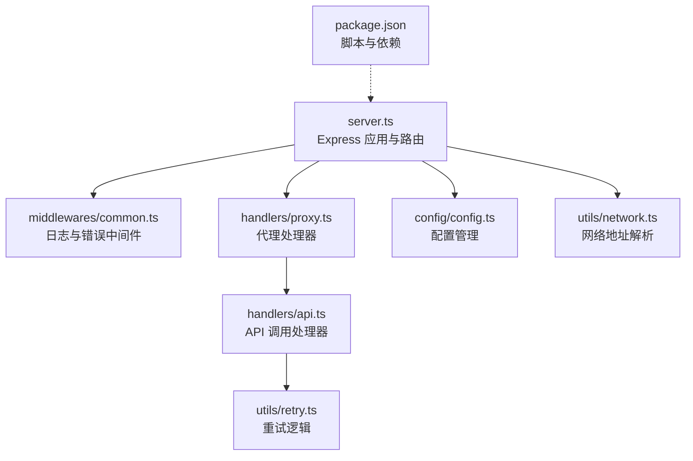
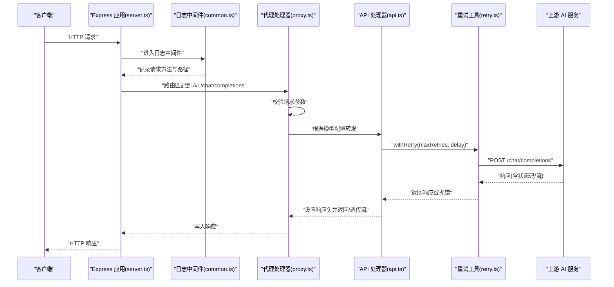
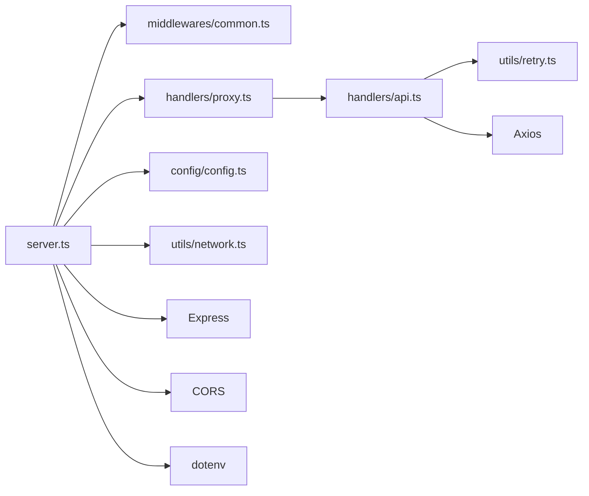

# 性能监控

<cite>
**本文引用的文件**
- [src/server.ts](file://src/server.ts)
- [src/middlewares/common.ts](file://src/middlewares/common.ts)
- [src/handlers/proxy.ts](file://src/handlers/proxy.ts)
- [src/handlers/api.ts](file://src/handlers/api.ts)
- [src/handlers/base.ts](file://src/handlers/base.ts)
- [src/config/config.ts](file://src/config/config.ts)
- [src/utils/retry.ts](file://src/utils/retry.ts)
- [src/utils/network.ts](file://src/utils/network.ts)
- [package.json](file://package.json)
- [.gitignore](file://.gitignore)
</cite>

## 目录
1. [简介](#简介)
2. [项目结构](#项目结构)
3. [核心组件](#核心组件)
4. [架构总览](#架构总览)
5. [详细组件分析](#详细组件分析)
6. [依赖分析](#依赖分析)
7. [性能考量](#性能考量)
8. [故障排查指南](#故障排查指南)
9. [结论](#结论)
10. [附录](#附录)

## 简介
本文件面向 xcode-ai-proxy 的性能监控与可观测性建设，聚焦以下目标：
- 关键性能指标监控：响应时间、吞吐量、内存使用率、并发连接数
- 日志配置与分析：访问日志、错误日志、性能日志的格式与解读
- 系统监控工具集成：Prometheus、Grafana、ELK Stack 的配置思路
- 性能瓶颈识别与优化策略：数据库查询优化、缓存策略、资源限制
- 告警配置与通知机制：阈值设置、告警规则、通知渠道

当前代码库以 Express 为基础，提供 OpenAI 兼容的代理路由，并通过中间件与处理器实现请求接入、模型选择、上游 API 调用与重试控制。由于项目未内置 Prometheus/Grafana/ELK 集成或内置指标导出，本文在“系统监控工具集成”部分提供通用配置建议与对接思路。

## 项目结构
项目采用按职责分层的组织方式：
- 服务器入口与路由注册：server.ts
- 中间件：日志与错误处理
- 处理器：代理与 API 调用
- 配置管理：环境变量解析、应用配置、模型配置
- 工具：重试、网络地址解析
- 包管理：脚本与依赖

图表来源
- [src/server.ts:1-88](file://src/server.ts#L1-L88)
- [src/middlewares/common.ts:1-25](file://src/middlewares/common.ts#L1-L25)
- [src/handlers/proxy.ts:1-66](file://src/handlers/proxy.ts#L1-L66)
- [src/handlers/api.ts:1-196](file://src/handlers/api.ts#L1-L196)
- [src/utils/retry.ts:1-34](file://src/utils/retry.ts#L1-L34)
- [src/config/config.ts:1-123](file://src/config/config.ts#L1-L123)
- [src/utils/network.ts:1-51](file://src/utils/network.ts#L1-L51)
- [package.json:1-30](file://package.json#L1-L30)

章节来源
- [src/server.ts:1-88](file://src/server.ts#L1-L88)
- [package.json:1-30](file://package.json#L1-L30)

## 核心组件
- 服务器与路由：负责启动 Express 应用、注册健康检查、模型列表、聊天补全等路由，并挂载日志与错误中间件。
- 代理处理器：校验请求、选择模型配置、转发到 API 处理器。
- API 处理器：构建上游请求、执行带重试的调用、透传流式响应或返回 JSON 响应。
- 配置管理：从环境变量读取应用与模型配置，包含请求超时、最大重试次数、重试间隔等。
- 重试工具：指数退避重试，支持最大重试次数与基础延迟。
- 网络工具：解析本地 IP、生成可访问 URL，辅助诊断与部署定位。

章节来源
- [src/server.ts:1-88](file://src/server.ts#L1-L88)
- [src/handlers/proxy.ts:1-66](file://src/handlers/proxy.ts#L1-L66)
- [src/handlers/api.ts:1-196](file://src/handlers/api.ts#L1-L196)
- [src/config/config.ts:1-123](file://src/config/config.ts#L1-L123)
- [src/utils/retry.ts:1-34](file://src/utils/retry.ts#L1-L34)
- [src/utils/network.ts:1-51](file://src/utils/network.ts#L1-L51)

## 架构总览
下图展示从客户端到上游 AI 服务的关键调用链路与性能相关节点。

图表来源
- [src/server.ts:29-44](file://src/server.ts#L29-L44)
- [src/middlewares/common.ts:4-7](file://src/middlewares/common.ts#L4-L7)
- [src/handlers/proxy.ts:9-37](file://src/handlers/proxy.ts#L9-L37)
- [src/handlers/api.ts:30-196](file://src/handlers/api.ts#L30-L196)
- [src/utils/retry.ts:1-26](file://src/utils/retry.ts#L1-L26)

## 详细组件分析

### 服务器与路由（响应时间、吞吐量、并发连接数）
- 响应时间：由上游 AI 服务决定，代理层在请求阶段仅做参数校验与路由转发；实际耗时主要来自 withRetry 的重试与上游响应。
- 吞吐量：受请求超时、最大重试次数、并发请求数影响；Express 默认行为在高并发下需结合进程/容器资源评估。
- 并发连接数：可通过系统级工具（如 netstat/ss/lsof）与容器监控采集；Express 本身不暴露并发计数指标。

章节来源
- [src/server.ts:29-44](file://src/server.ts#L29-L44)
- [src/config/config.ts:53-67](file://src/config/config.ts#L53-L67)

### 日志中间件（访问日志）
- 访问日志格式：包含时间戳、HTTP 方法与路径，便于追踪请求来源与热点路径。
- 日志位置：标准输出，适合容器化日志收集（stdout/stderr）。

章节来源
- [src/middlewares/common.ts:4-7](file://src/middlewares/common.ts#L4-L7)
- [src/utils/retry.ts:32-34](file://src/utils/retry.ts#L32-L34)

### 错误处理中间件（错误日志）
- 错误日志格式：统一输出错误信息与错误类型，便于快速定位问题。
- 响应格式：标准化错误响应，包含 message 与 type 字段。

章节来源
- [src/middlewares/common.ts:9-25](file://src/middlewares/common.ts#L9-L25)

### 代理处理器（模型选择与路由）
- 参数校验：确保 model 与 messages 存在且格式正确。
- 模型选择：依据配置管理中的模型映射进行路由。
- 错误处理：对不支持的模型与未知类型返回标准化错误。

章节来源
- [src/handlers/proxy.ts:9-37](file://src/handlers/proxy.ts#L9-L37)
- [src/handlers/proxy.ts:39-66](file://src/handlers/proxy.ts#L39-L66)

### API 处理器（上游调用、流式透传、重试）
- 上游请求构建：统一使用 OpenAI 兼容格式，注入 Authorization、Content-Type 等头部。
- 流式响应：当请求开启 stream 时，直接透传上游 SSE/流式响应至客户端。
- 非流式响应：设置跨域与内容类型响应头后返回 JSON。
- 错误处理：对 4xx/5xx 响应进行日志记录与错误抛出，必要时读取流式错误内容以便诊断。
- 重试机制：基于 withRetry 实现带退避的多次尝试，受应用配置控制。

章节来源
- [src/handlers/api.ts:8-28](file://src/handlers/api.ts#L8-L28)
- [src/handlers/api.ts:30-196](file://src/handlers/api.ts#L30-L196)

### 重试工具（重试策略与性能影响）
- 重试策略：线性/递增延迟（示例中为 baseDelay * attempt），在请求超时与网络抖动场景提升成功率。
- 性能影响：增加总等待时间与上游调用次数，需结合业务 SLA 与上游配额权衡。

章节来源
- [src/utils/retry.ts:1-26](file://src/utils/retry.ts#L1-L26)

### 配置管理（资源限制与超时）
- 应用配置：端口、主机、最大重试次数、重试延迟、请求超时、自定义系统提示。
- 模型配置：聚合多个提供商的模型映射，供代理处理器选择。

章节来源
- [src/config/config.ts:53-67](file://src/config/config.ts#L53-L67)
- [src/config/config.ts:69-99](file://src/config/config.ts#L69-L99)

### 网络工具（部署与连通性）
- 本地 IP 解析：用于生成可访问 URL，辅助诊断与多网卡部署。
- 主机名/端口组合：在启动日志中输出多种访问地址，便于不同网络环境访问。

章节来源
- [src/utils/network.ts:1-51](file://src/utils/network.ts#L1-L51)
- [src/server.ts:54-83](file://src/server.ts#L54-L83)

## 依赖分析
- Express：提供 Web 服务器能力，路由、中间件、错误处理。
- Axios：发起上游 HTTP 请求，支持流式与 JSON 响应。
- CORS：跨域支持。
- dotenv：环境变量加载。

图表来源
- [src/server.ts:1-88](file://src/server.ts#L1-L88)
- [src/middlewares/common.ts:1-25](file://src/middlewares/common.ts#L1-L25)
- [src/handlers/proxy.ts:1-66](file://src/handlers/proxy.ts#L1-L66)
- [src/handlers/api.ts:1-196](file://src/handlers/api.ts#L1-L196)
- [src/utils/retry.ts:1-34](file://src/utils/retry.ts#L1-L34)
- [src/config/config.ts:1-123](file://src/config/config.ts#L1-L123)
- [src/utils/network.ts:1-51](file://src/utils/network.ts#L1-L51)
- [package.json:14-29](file://package.json#L14-L29)

章节来源
- [package.json:14-29](file://package.json#L14-L29)

## 性能考量
- 响应时间
  - 上游调用：由上游 AI 服务决定，代理层不做额外计算。
  - 重试开销：withRetry 会增加总等待时间，需结合业务 SLA 调整 maxRetries 与 retryDelay。
  - 超时控制：requestTimeout 控制单次请求上限，避免长时间占用连接。
- 吞吐量
  - 单进程限制：默认单进程，高并发场景建议使用集群/容器编排与负载均衡。
  - 流式透传：开启 stream 可降低内存峰值，但需注意上游流异常的读取与日志记录。
- 内存使用率
  - 流式响应：透传流避免将完整响应载入内存。
  - 非流式响应：JSON 响应可能占用较多内存，建议控制请求体大小与响应体大小。
- 并发连接数
  - 系统与容器资源：受 ulimit、内核参数与容器 CPU/内存限制影响。
  - Keep-Alive：Kimi 提供商使用 https.Agent 并启用 keepAlive，有助于复用连接。
- 数据库与缓存
  - 当前代码库未发现数据库访问逻辑；若后续引入缓存（如 Redis），建议对热点模型与配置进行缓存，并设置合理的 TTL 与失效策略。
- 资源限制
  - 通过环境变量与配置管理调整 requestTimeout、maxRetries、retryDelay，避免资源被长时间占用。

章节来源
- [src/handlers/api.ts:30-196](file://src/handlers/api.ts#L30-L196)
- [src/utils/retry.ts:1-26](file://src/utils/retry.ts#L1-L26)
- [src/config/config.ts:53-67](file://src/config/config.ts#L53-L67)

## 故障排查指南
- 访问日志
  - 作用：定位请求来源、路径与时间，配合错误日志定位问题。
  - 输出：中间件统一记录时间戳、方法与路径。
- 错误日志
  - 作用：统一错误类型与消息，便于快速定位。
  - 输出：错误中间件统一返回 { message, type }。
- 性能日志
  - 作用：记录上游请求、响应状态、流式错误读取等，辅助性能分析。
  - 输出：API 处理器在关键节点打印请求与响应状态、错误详情。
- 常见问题
  - 模型不可用：确认模型 ID 是否在配置中，或是否为 API 类型。
  - 请求超时：适当提高 requestTimeout，检查上游服务可用性。
  - 流式错误：关注流式错误读取与日志输出，避免因读取失败导致诊断困难。

章节来源
- [src/middlewares/common.ts:4-25](file://src/middlewares/common.ts#L4-L25)
- [src/handlers/proxy.ts:9-37](file://src/handlers/proxy.ts#L9-L37)
- [src/handlers/api.ts:124-164](file://src/handlers/api.ts#L124-L164)

## 结论
- 当前代码库具备基础的日志与错误处理能力，能够满足基本的性能观测需求。
- 建议在生产环境中补充系统监控工具集成（Prometheus、Grafana、ELK），并结合业务 SLA 设定告警阈值。
- 通过合理配置 requestTimeout、maxRetries、retryDelay，可在稳定性与性能之间取得平衡。

## 附录

### 日志配置与分析方法
- 访问日志
  - 格式：时间戳 + 方法 + 路径
  - 采集：容器 stdout/stderr，结合日志收集系统（如 Fluent Bit/Filebeat）统一存储
  - 分析：按路径统计请求量、按方法分类、识别热点端点
- 错误日志
  - 格式：统一错误类型与消息
  - 采集：stdout/stderr + 结构化日志
  - 分析：按错误类型统计占比、定位高频错误与错误堆栈
- 性能日志
  - 格式：上游请求 URL、模型、流式状态、响应状态
  - 采集：stdout/stderr + 结构化日志
  - 分析：上游响应时间分布、流式错误占比、失败原因归类

章节来源
- [src/middlewares/common.ts:4-25](file://src/middlewares/common.ts#L4-L25)
- [src/handlers/api.ts:102-109](file://src/handlers/api.ts#L102-L109)
- [src/handlers/api.ts:124-164](file://src/handlers/api.ts#L124-L164)

### 系统监控工具集成（通用配置思路）
- Prometheus
  - 导出指标：建议在应用中增加指标导出（如 HTTP 请求耗时直方图、错误计数、并发连接数等），或通过外部探针采集
  - 抓取配置：在 Prometheus 中配置抓取任务，指向应用的指标端点
- Grafana
  - 数据源：添加 Prometheus 作为数据源
  - 仪表盘：创建面板展示响应时间、吞吐量、错误率、并发连接数、内存使用率
- ELK Stack
  - Logstash/Beats：采集 stdout/stderr 日志，解析访问/错误/性能日志
  - Kibana：可视化日志趋势、错误分布、慢请求分析

说明：上述为通用集成思路，需在应用中扩展指标导出与日志结构化处理。

### 性能瓶颈识别与优化策略
- 数据库查询优化
  - 当前无数据库访问逻辑；若引入，建议对热点查询建立索引、拆分读写、使用连接池
- 缓存策略
  - 对模型配置、常用响应进行缓存，设置 TTL 与失效策略，减少上游调用
- 资源限制
  - 通过环境变量与配置管理调整 requestTimeout、maxRetries、retryDelay
  - 容器层面设置 CPU/内存限制，避免资源争用

### 告警配置与通知机制
- 阈值设置
  - 响应时间：P95/P99 超过 SLA
  - 错误率：错误占比超过阈值
  - 并发连接数：接近系统/容器限制
  - 内存使用率：持续升高或接近上限
- 告警规则
  - 使用 PromQL 或日志规则表达式定义告警条件
- 通知渠道
  - 邮件、企业微信、钉钉、Slack 等，结合团队沟通工具