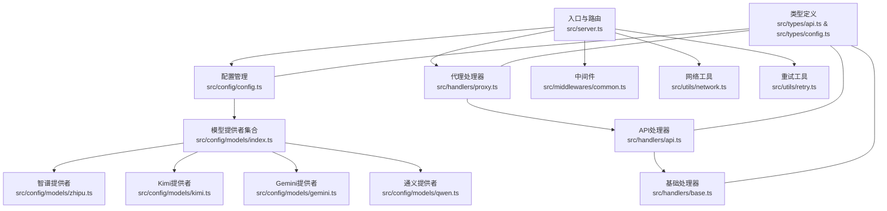
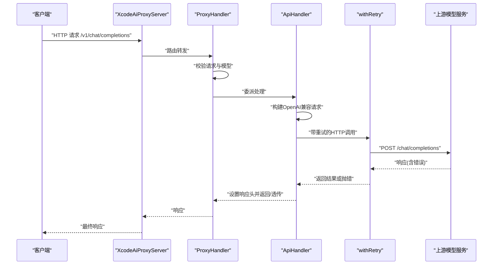

# 故障排除指南

<cite>
**本文引用的文件**
- [package.json](file://package.json)
- [src/server.ts](file://src/server.ts)
- [src/config/config.ts](file://src/config/config.ts)
- [src/config/models/index.ts](file://src/config/models/index.ts)
- [src/config/models/zhipu.ts](file://src/config/models/zhipu.ts)
- [src/config/models/kimi.ts](file://src/config/models/kimi.ts)
- [src/config/models/gemini.ts](file://src/config/models/gemini.ts)
- [src/config/models/qwen.ts](file://src/config/models/qwen.ts)
- [src/handlers/base.ts](file://src/handlers/base.ts)
- [src/handlers/api.ts](file://src/handlers/api.ts)
- [src/handlers/proxy.ts](file://src/handlers/proxy.ts)
- [src/middlewares/common.ts](file://src/middlewares/common.ts)
- [src/utils/network.ts](file://src/utils/network.ts)
- [src/utils/retry.ts](file://src/utils/retry.ts)
- [src/types/api.ts](file://src/types/api.ts)
- [src/types/config.ts](file://src/types/config.ts)
</cite>

## 目录
1. [简介](#简介)
2. [项目结构](#项目结构)
3. [核心组件](#核心组件)
4. [架构总览](#架构总览)
5. [详细组件分析](#详细组件分析)
6. [依赖分析](#依赖分析)
7. [性能考虑](#性能考虑)
8. [故障排除指南](#故障排除指南)
9. [结论](#结论)
10. [附录](#附录)

## 简介
本指南面向 xcode-ai-proxy 的运维与开发人员，聚焦于启动失败、连接超时、API 调用错误、内存泄漏等常见问题的诊断与修复。文档提供可操作的诊断命令、日志分析要点、网络与性能排查方法，并给出错误码与对应解决步骤、调试技巧与最佳实践，以及紧急处理与回滚策略。

## 项目结构
项目采用按职责分层的组织方式：入口与路由在服务器层；配置管理集中于配置层；业务逻辑在处理器层；中间件负责通用能力；工具模块提供网络与重试等通用能力；类型定义统一约束请求/响应与配置结构。

图表来源
- [src/server.ts:1-88](file://src/server.ts#L1-L88)
- [src/config/config.ts:1-123](file://src/config/config.ts#L1-L123)
- [src/config/models/index.ts:1-5](file://src/config/models/index.ts#L1-L5)
- [src/handlers/proxy.ts:1-66](file://src/handlers/proxy.ts#L1-L66)
- [src/handlers/api.ts:1-196](file://src/handlers/api.ts#L1-L196)
- [src/middlewares/common.ts:1-25](file://src/middlewares/common.ts#L1-L25)
- [src/utils/network.ts:1-51](file://src/utils/network.ts#L1-L51)
- [src/utils/retry.ts:1-34](file://src/utils/retry.ts#L1-L34)
- [src/types/api.ts:1-58](file://src/types/api.ts#L1-L58)
- [src/types/config.ts:1-48](file://src/types/config.ts#L1-L48)

章节来源
- [src/server.ts:1-88](file://src/server.ts#L1-L88)
- [src/config/config.ts:1-123](file://src/config/config.ts#L1-L123)
- [src/config/models/index.ts:1-5](file://src/config/models/index.ts#L1-L5)

## 核心组件
- 服务器与路由：负责启动、注册健康检查、模型列表、聊天补全等路由，并挂载通用中间件与错误处理。
- 配置管理：从环境变量加载应用与模型配置，校验必要密钥，初始化各模型提供者。
- 代理处理器：解析请求、选择模型、转发到 API 处理器。
- API 处理器：构建 OpenAI 兼容请求、注入系统提示、执行带重试的 HTTP 调用、透传或返回响应。
- 中间件：统一日志与错误处理。
- 工具模块：网络地址解析、重试机制、请求日志。

章节来源
- [src/server.ts:1-88](file://src/server.ts#L1-L88)
- [src/config/config.ts:1-123](file://src/config/config.ts#L1-L123)
- [src/handlers/proxy.ts:1-66](file://src/handlers/proxy.ts#L1-L66)
- [src/handlers/api.ts:1-196](file://src/handlers/api.ts#L1-L196)
- [src/middlewares/common.ts:1-25](file://src/middlewares/common.ts#L1-L25)
- [src/utils/retry.ts:1-34](file://src/utils/retry.ts#L1-L34)
- [src/utils/network.ts:1-51](file://src/utils/network.ts#L1-L51)

## 架构总览
下图展示从客户端到上游模型服务的调用链路，包含本地重试与错误透传。

图表来源
- [src/server.ts:29-44](file://src/server.ts#L29-L44)
- [src/handlers/proxy.ts:9-37](file://src/handlers/proxy.ts#L9-L37)
- [src/handlers/api.ts:30-195](file://src/handlers/api.ts#L30-L195)
- [src/utils/retry.ts:1-26](file://src/utils/retry.ts#L1-L26)

## 详细组件分析

### 服务器与路由
- 注册健康检查、模型列表、多路径聊天补全接口。
- 使用 CORS、JSON 解析、日志中间件与全局错误处理。
- 启动时打印服务访问地址、支持模型、重试与超时配置，以及 Xcode 配置示例。

章节来源
- [src/server.ts:29-83](file://src/server.ts#L29-L83)

### 配置管理
- 从环境变量加载应用配置（端口、主机、最大重试、重试延迟、请求超时、自定义系统提示）。
- 校验至少存在一个 API 密钥，否则直接退出。
- 初始化各模型提供者，聚合模型配置。
- 提供查询模型配置与支持模型列表的能力。

章节来源
- [src/config/config.ts:29-123](file://src/config/config.ts#L29-L123)

### 代理处理器
- 校验请求参数与模型可用性。
- 将请求委派给 API 处理器统一处理。
- 提供模型列表与健康检查接口。

章节来源
- [src/handlers/proxy.ts:9-66](file://src/handlers/proxy.ts#L9-L66)

### API 处理器
- 校验请求、定位模型配置、构建 OpenAI 兼容请求体。
- 注入中文交流指令与自定义系统提示（仅在首个系统消息后插入一次）。
- 对 Qwen 做特殊处理（移除空 tools 数组）。
- 使用 withRetry 执行带指数退避的重试。
- 对上游错误进行日志记录与错误对象增强（保留状态码、URL、原始数据），支持流式错误响应读取。
- 流式响应时透传上游流，非流式时设置标准响应头并返回 JSON。

章节来源
- [src/handlers/api.ts:8-196](file://src/handlers/api.ts#L8-L196)

### 重试机制
- 基于尝试次数与基础延迟进行递增等待。
- 记录每次尝试与失败原因，最终抛出最后一次错误。

章节来源
- [src/utils/retry.ts:1-26](file://src/utils/retry.ts#L1-L26)

### 网络工具
- 获取本机 IPv4 地址、优先私有网段地址、生成服务访问 URL 列表。

章节来源
- [src/utils/network.ts:1-51](file://src/utils/network.ts#L1-L51)

### 类型定义
- 定义聊天消息、请求、响应、模型列表与错误响应结构。
- 定义应用配置与模型配置接口，约束字段与可选值。

章节来源
- [src/types/api.ts:1-58](file://src/types/api.ts#L1-L58)
- [src/types/config.ts:1-48](file://src/types/config.ts#L1-L48)

## 依赖分析
- 运行时依赖：Express、Axios、CORS、Dotenv。
- 开发依赖：TypeScript、ts-node、nodemon、rimraf 等。
- 服务器启动脚本与开发脚本用于构建与运行。

章节来源
- [package.json:14-28](file://package.json#L14-L28)
- [package.json:6-12](file://package.json#L6-L12)

## 性能考虑
- JSON 体大小限制：默认 50MB，避免过大请求导致内存压力。
- 请求超时：可配置，默认约 60 秒，建议根据上游服务稳定性调整。
- 重试策略：默认最多 3 次，延迟递增，避免对上游造成雪崩。
- 流式响应：透传上游流，减少中间缓冲与转换开销。
- 日志级别：生产环境建议降低日志量，避免 I/O 影响。

章节来源
- [src/server.ts:24-26](file://src/server.ts#L24-L26)
- [src/config/config.ts:53-67](file://src/config/config.ts#L53-L67)
- [src/utils/retry.ts:8-20](file://src/utils/retry.ts#L8-L20)
- [src/handlers/api.ts:176-194](file://src/handlers/api.ts#L176-L194)

## 故障排除指南

### 一、启动失败
常见症状
- 进程启动即退出或无法监听端口
- 控制台输出“至少需要配置一个API密钥”并退出

排查步骤
1. 检查环境变量是否正确设置（至少一个模型 API Key 必填）
   - 参考路径：[src/config/config.ts:29-51](file://src/config/config.ts#L29-L51)
2. 检查端口占用与权限
   - 使用 netstat/ss/lsof 查看端口占用
   - Linux/macOS 示例：ss -tuln | grep <端口号>
3. 检查主机绑定
   - 若 host=0.0.0.0，确认防火墙允许外部访问
   - 参考路径：[src/utils/network.ts:35-51](file://src/utils/network.ts#L35-L51)
4. 查看启动日志
   - 启动后会打印服务访问地址、支持模型、重试与超时配置
   - 参考路径：[src/server.ts:54-83](file://src/server.ts#L54-L83)

章节来源
- [src/config/config.ts:29-51](file://src/config/config.ts#L29-L51)
- [src/server.ts:54-83](file://src/server.ts#L54-L83)
- [src/utils/network.ts:35-51](file://src/utils/network.ts#L35-L51)

### 二、连接超时
常见症状
- 请求在本地等待较久后超时
- 上游服务返回 4xx/5xx，但被 withRetry 重试

排查步骤
1. 调整请求超时与重试配置
   - 修改 REQUEST_TIMEOUT、MAX_RETRIES、RETRY_DELAY
   - 参考路径：[src/config/config.ts:53-67](file://src/config/config.ts#L53-L67)
2. 检查网络连通性
   - 使用 curl 或浏览器访问上游 API 端点验证连通性
   - 参考路径：[src/handlers/api.ts:110-115](file://src/handlers/api.ts#L110-L115)
3. 观察重试日志
   - withRetry 会记录每次尝试与延迟
   - 参考路径：[src/utils/retry.ts:8-20](file://src/utils/retry.ts#L8-L20)
4. 临时禁用重试验证上游稳定性
   - 将 MAX_RETRIES 设为 0 并观察上游返回

章节来源
- [src/config/config.ts:53-67](file://src/config/config.ts#L53-L67)
- [src/utils/retry.ts:8-20](file://src/utils/retry.ts#L8-L20)
- [src/handlers/api.ts:110-115](file://src/handlers/api.ts#L110-L115)

### 三、API 调用错误
常见症状
- 返回 4xx/5xx，错误信息来自上游
- 流式响应中出现异常中断

排查步骤
1. 查看错误日志
   - API 处理器会记录上游状态码、URL、错误响应内容
   - 参考路径：[src/handlers/api.ts:124-164](file://src/handlers/api.ts#L124-L164)
2. 识别错误类型
   - invalid_request_error：请求参数缺失或模型不可用
   - api_error：上游服务异常
   - proxy_error：代理层异常
   - server_error：服务器内部异常
   - 参考路径：[src/handlers/proxy.ts:17-36](file://src/handlers/proxy.ts#L17-L36)、[src/middlewares/common.ts:15-24](file://src/middlewares/common.ts#L15-L24)
3. 验证模型可用性
   - 通过 /v1/models 接口确认模型是否加载
   - 参考路径：[src/handlers/proxy.ts:39-57](file://src/handlers/proxy.ts#L39-L57)
4. 流式错误读取
   - 当上游返回流式错误时，会尝试读取错误内容并记录
   - 参考路径：[src/handlers/api.ts:131-155](file://src/handlers/api.ts#L131-L155)

章节来源
- [src/handlers/api.ts:124-164](file://src/handlers/api.ts#L124-L164)
- [src/handlers/proxy.ts:17-36](file://src/handlers/proxy.ts#L17-L36)
- [src/middlewares/common.ts:15-24](file://src/middlewares/common.ts#L15-L24)
- [src/handlers/proxy.ts:39-57](file://src/handlers/proxy.ts#L39-L57)

### 四、内存泄漏
常见症状
- 进程 RSS 持续增长，重启后短暂缓解
- 长时间运行后 CPU 占用升高

排查步骤
1. 使用进程监控工具
   - Linux：top、htop、pidstat
   - macOS：Activity Monitor、samples
2. 关注流式处理
   - 确保上游流被正确 pipe 到下游响应，避免累积缓冲
   - 参考路径：[src/handlers/api.ts:176-183](file://src/handlers/api.ts#L176-L183)
3. 检查 HTTPS Agent（Kimi）
   - 长连接可能造成资源未释放，建议在高负载场景下评估 keepAlive
   - 参考路径：[src/handlers/api.ts:50-56](file://src/handlers/api.ts#L50-L56)
4. 限制请求体大小
   - 防止异常大请求导致内存峰值
   - 参考路径：[src/server.ts:25](file://src/server.ts#L25)

章节来源
- [src/handlers/api.ts:176-183](file://src/handlers/api.ts#L176-L183)
- [src/handlers/api.ts:50-56](file://src/handlers/api.ts#L50-L56)
- [src/server.ts:25](file://src/server.ts#L25)

### 五、日志分析与诊断命令
- 启动日志
  - 启动后打印服务访问地址、支持模型、重试与超时配置
  - 参考路径：[src/server.ts:54-83](file://src/server.ts#L54-L83)
- 请求日志
  - 中间件统一记录请求方法与路径
  - 参考路径：[src/middlewares/common.ts:4-7](file://src/middlewares/common.ts#L4-L7)
- 错误日志
  - 服务器错误中间件统一返回 500 并记录错误信息
  - 参考路径：[src/middlewares/common.ts:15-24](file://src/middlewares/common.ts#L15-L24)
- 诊断命令示例
  - 健康检查：curl http://localhost:<port>/health
  - 模型列表：curl http://localhost:<port>/v1/models
  - 聊天补全（非流式）：curl -N -X POST http://localhost:<port>/v1/chat/completions -H "Content-Type: application/json" -d '{...}'
  - 参考路径：[src/server.ts:30-40](file://src/server.ts#L30-L40)

章节来源
- [src/server.ts:54-83](file://src/server.ts#L54-L83)
- [src/middlewares/common.ts:4-7](file://src/middlewares/common.ts#L4-L7)
- [src/middlewares/common.ts:15-24](file://src/middlewares/common.ts#L15-L24)
- [src/server.ts:30-40](file://src/server.ts#L30-L40)

### 六、网络诊断
- 本机地址与访问 URL
  - 当 host=0.0.0.0 时，会列出 localhost 与所有可用 IPv4 地址
  - 参考路径：[src/utils/network.ts:35-51](file://src/utils/network.ts#L35-L51)
- 防火墙与端口
  - 使用 ss/netstat 检查端口占用与监听状态
- DNS 与代理
  - 确认上游 API 域名可解析，必要时配置系统代理

章节来源
- [src/utils/network.ts:35-51](file://src/utils/network.ts#L35-L51)

### 七、性能分析工具
- Node.js 分析
  - 使用 --inspect 启动，结合 Chrome DevTools 或 clinic doctor
- 压力测试
  - 使用 wrk/ab 对 /v1/chat/completions 进行基准测试
- 指标采集
  - 监控 CPU、内存、网络 I/O、连接数与错误率

[本节为通用指导，无需特定文件引用]

### 八、错误代码与解决步骤
- invalid_request_error
  - 原因：缺少 model 或 messages，或模型不可用
  - 步骤：检查请求体、确认模型已在配置中加载
  - 参考路径：[src/handlers/proxy.ts:17-24](file://src/handlers/proxy.ts#L17-L24)
- api_error
  - 原因：上游服务返回错误
  - 步骤：查看日志中的状态码与错误内容，必要时降低重试或调整超时
  - 参考路径：[src/handlers/api.ts:124-164](file://src/handlers/api.ts#L124-L164)
- proxy_error
  - 原因：代理层异常
  - 步骤：查看服务器错误中间件日志，定位具体处理器
  - 参考路径：[src/handlers/proxy.ts:33-36](file://src/handlers/proxy.ts#L33-L36)
- server_error
  - 原因：服务器内部异常
  - 步骤：查看中间件错误日志，检查依赖与配置
  - 参考路径：[src/middlewares/common.ts:15-24](file://src/middlewares/common.ts#L15-L24)

章节来源
- [src/handlers/proxy.ts:17-36](file://src/handlers/proxy.ts#L17-L36)
- [src/handlers/api.ts:124-164](file://src/handlers/api.ts#L124-L164)
- [src/middlewares/common.ts:15-24](file://src/middlewares/common.ts#L15-L24)

### 九、调试技巧与最佳实践
- 启用详细日志
  - 保持默认日志即可覆盖大部分问题；如需更细粒度，可在处理器中增加局部日志
- 重现问题
  - 使用相同请求体与模型复现；关注上游返回与重试行为
- 收集诊断信息
  - 请求日志、错误日志、/health 与 /v1/models 输出
- 最佳实践
  - 合理设置 REQUEST_TIMEOUT 与 MAX_RETRIES
  - 避免发送异常大的请求体
  - 对流式响应保持长连接稳定

章节来源
- [src/utils/retry.ts:8-20](file://src/utils/retry.ts#L8-L20)
- [src/server.ts:25](file://src/server.ts#L25)
- [src/handlers/api.ts:176-194](file://src/handlers/api.ts#L176-L194)

### 十、紧急处理流程与回滚策略
- 紧急处理
  - 降低 MAX_RETRIES 与 REQUEST_TIMEOUT，快速失败
  - 临时移除自定义系统提示，简化请求体
  - 仅暴露内网地址（host=127.0.0.1），关闭外网访问
- 回滚策略
  - 使用版本化部署，回退到上一个稳定版本
  - 清理环境变量，恢复默认配置
- 预防措施
  - 增加健康检查与告警
  - 对上游服务进行容量与 SLA 评估

[本节为通用指导，无需特定文件引用]

## 结论
通过理解系统架构、掌握日志与网络诊断方法、合理配置重试与超时、遵循调试与回滚流程，可以高效定位并解决 xcode-ai-proxy 的常见问题。建议在生产环境中持续监控关键指标，并定期演练回滚流程以提升应急响应能力。

## 附录

### A. 关键配置项速查
- 应用配置
  - PORT、HOST、MAX_RETRIES、RETRY_DELAY、REQUEST_TIMEOUT、CUSTOM_SYSTEM_PROMPT
  - 参考路径：[src/config/config.ts:53-67](file://src/config/config.ts#L53-L67)
- 模型配置
  - ZHIPU_API_KEY/ZHIPU_API_URL、KIMI_API_KEY/KIMI_API_URL、GEMINI_API_KEY/GEMINI_API_URL、QWEN_API_KEY/QWEN_API_URL
  - 参考路径：[src/config/config.ts:13-19](file://src/config/config.ts#L13-L19)

### B. 常用命令
- 启动
  - 生产：npm run start
  - 开发：npm run dev 或 npm run dev:watch
  - 参考路径：[package.json:6-12](file://package.json#L6-L12)
- 健康检查
  - curl http://localhost:<port>/health
- 模型列表
  - curl http://localhost:<port>/v1/models
- 聊天补全
  - curl -N -X POST http://localhost:<port>/v1/chat/completions -H "Content-Type: application/json" -d '{...}'

章节来源
- [package.json:6-12](file://package.json#L6-L12)
- [src/server.ts:30-40](file://src/server.ts#L30-L40)