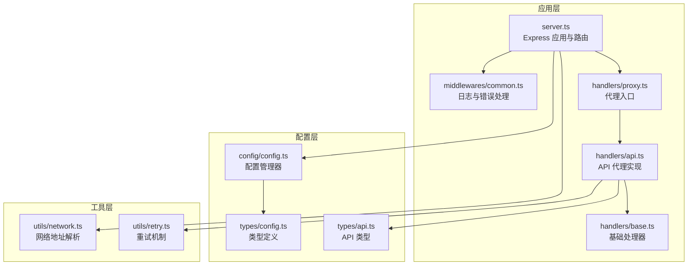
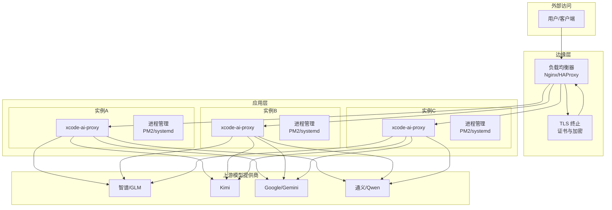
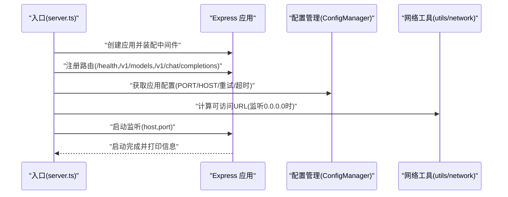
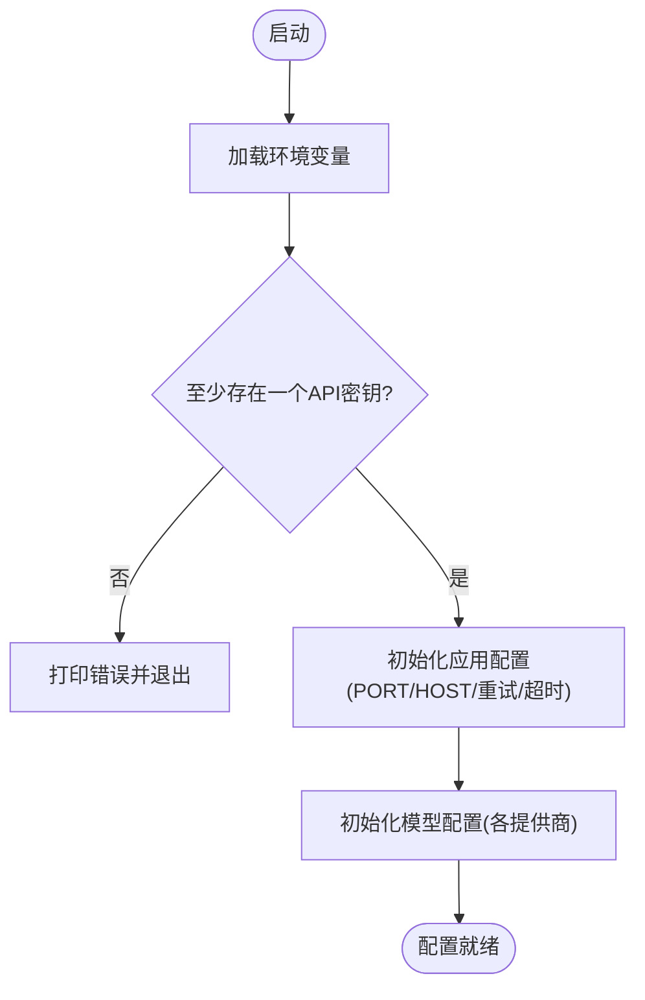
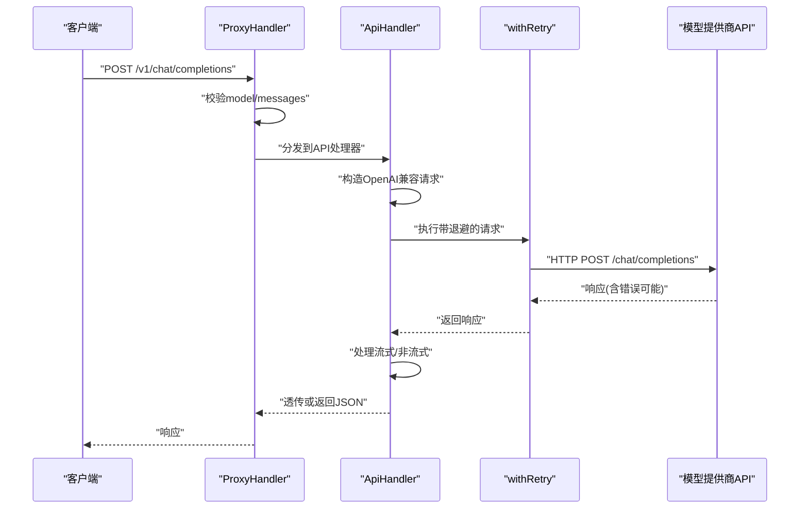
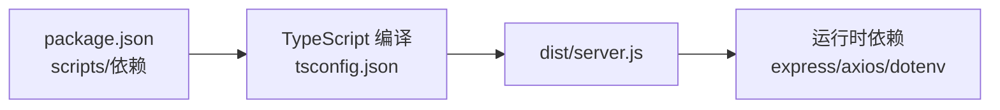

# 生产环境部署

<cite>
**本文引用的文件**
- [package.json](file://package.json)
- [tsconfig.json](file://tsconfig.json)
- [src/server.ts](file://src/server.ts)
- [src/config/config.ts](file://src/config/config.ts)
- [src/config/index.ts](file://src/config/index.ts)
- [src/types/config.ts](file://src/types/config.ts)
- [src/types/api.ts](file://src/types/api.ts)
- [src/utils/network.ts](file://src/utils/network.ts)
- [src/utils/retry.ts](file://src/utils/retry.ts)
- [src/middlewares/common.ts](file://src/middlewares/common.ts)
- [src/handlers/base.ts](file://src/handlers/base.ts)
- [src/handlers/api.ts](file://src/handlers/api.ts)
- [src/handlers/proxy.ts](file://src/handlers/proxy.ts)
</cite>

## 目录
1. [简介](#简介)
2. [项目结构](#项目结构)
3. [核心组件](#核心组件)
4. [架构总览](#架构总览)
5. [详细组件分析](#详细组件分析)
6. [依赖关系分析](#依赖关系分析)
7. [性能考量](#性能考量)
8. [故障排查指南](#故障排查指南)
9. [结论](#结论)
10. [附录](#附录)

## 简介
本指南面向生产环境部署 xcode-ai-proxy，目标是帮助运维团队在稳定、安全、可扩展的前提下完成从服务器准备到上线运行的全流程。文档覆盖以下要点：
- 服务器硬件与操作系统建议
- Node.js 版本要求与构建流程
- 环境准备、依赖安装与配置文件设置
- 进程管理（PM2 与 systemd）配置要点
- 安全配置最佳实践（防火墙、SSL/TLS、API 密钥管理）
- 容器化部署（Docker）与编排（Kubernetes）方案
- 负载均衡与高可用部署策略

## 项目结构
该应用采用 Express + TypeScript 的服务端架构，核心模块职责清晰：
- 服务器入口负责路由注册、中间件装配与启动日志输出
- 配置模块负责读取环境变量、校验必填项并初始化各模型提供商配置
- 处理器模块负责请求校验、模型选择与上游 API 代理
- 工具模块提供网络地址解析、重试机制与日志辅助
- 中间件模块提供统一日志与错误处理

**图示来源**
- [src/server.ts:1-88](file://src/server.ts#L1-L88)
- [src/middlewares/common.ts:1-25](file://src/middlewares/common.ts#L1-L25)
- [src/handlers/proxy.ts:1-66](file://src/handlers/proxy.ts#L1-L66)
- [src/handlers/api.ts:1-196](file://src/handlers/api.ts#L1-L196)
- [src/handlers/base.ts:1-40](file://src/handlers/base.ts#L1-L40)
- [src/config/config.ts:1-121](file://src/config/config.ts#L1-L121)
- [src/types/config.ts:1-48](file://src/types/config.ts#L1-L48)
- [src/types/api.ts:1-58](file://src/types/api.ts#L1-L58)
- [src/utils/network.ts:1-51](file://src/utils/network.ts#L1-L51)
- [src/utils/retry.ts:1-34](file://src/utils/retry.ts#L1-L34)

**章节来源**
- [src/server.ts:1-88](file://src/server.ts#L1-L88)
- [src/config/config.ts:1-121](file://src/config/config.ts#L1-L121)
- [src/handlers/proxy.ts:1-66](file://src/handlers/proxy.ts#L1-L66)
- [src/handlers/api.ts:1-196](file://src/handlers/api.ts#L1-L196)
- [src/middlewares/common.ts:1-25](file://src/middlewares/common.ts#L1-L25)
- [src/utils/network.ts:1-51](file://src/utils/network.ts#L1-L51)
- [src/utils/retry.ts:1-34](file://src/utils/retry.ts#L1-L34)
- [src/types/config.ts:1-48](file://src/types/config.ts#L1-L48)
- [src/types/api.ts:1-58](file://src/types/api.ts#L1-L58)

## 核心组件
- 服务器与路由
  - Express 应用在入口文件中创建，注册健康检查、模型列表与聊天补全等路由，并启用 CORS、JSON 解析与日志中间件。
  - 启动时打印服务访问地址、支持的模型与重试配置，便于客户端配置对接。

- 配置管理
  - 通过单例模式加载环境变量，校验至少存在一个模型 API 密钥；初始化应用配置（端口、主机、重试、超时、自定义系统提示）与模型配置（智谱、Kimi、Gemini、通义）。
  - 提供查询方法以供处理器使用。

- 处理器链路
  - 代理处理器负责请求校验、模型选择与分发至 API 处理器。
  - API 处理器负责构造 OpenAI 兼容请求、注入中文交流指令与自定义系统提示、按需移除空 tools 字段、执行带退避的重试、透传或返回响应。

- 中间件与工具
  - 日志中间件统一记录请求方法与路径；错误中间件统一返回 500 与标准错误结构。
  - 网络工具用于解析本地 IP 与生成访问地址；重试工具提供指数退避重试逻辑。

**章节来源**
- [src/server.ts:23-52](file://src/server.ts#L23-L52)
- [src/config/config.ts:27-97](file://src/config/config.ts#L27-L97)
- [src/handlers/proxy.ts:9-37](file://src/handlers/proxy.ts#L9-L37)
- [src/handlers/api.ts:8-28](file://src/handlers/api.ts#L8-L28)
- [src/middlewares/common.ts:4-25](file://src/middlewares/common.ts#L4-L25)
- [src/utils/network.ts:35-51](file://src/utils/network.ts#L35-L51)
- [src/utils/retry.ts:1-34](file://src/utils/retry.ts#L1-L34)

## 架构总览
下图展示生产部署中的典型拓扑：反向代理（Nginx/HAProxy）前置，承载 TLS 终止与静态资源；后端由多个 xcode-ai-proxy 实例组成，通过负载均衡分发流量；各实例通过环境变量配置不同模型提供商的 API 密钥与端点。

[此图为概念性架构示意，无需“图示来源”标注]

## 详细组件分析

### 服务器与启动流程
- Express 应用创建与中间件装配
  - 注册 CORS、JSON 解析（限制 50MB）、日志中间件
  - 注册健康检查、模型列表、聊天补全路由
  - 统一错误处理中间件
- 启动日志
  - 输出服务访问地址（支持监听所有网卡时列出多地址）
  - 列出支持的模型与重试配置
  - 输出 Xcode 客户端配置提示（BASE_URL 与鉴权）

**图示来源**
- [src/server.ts:23-52](file://src/server.ts#L23-L52)
- [src/utils/network.ts:35-51](file://src/utils/network.ts#L35-L51)

**章节来源**
- [src/server.ts:23-52](file://src/server.ts#L23-L52)
- [src/utils/network.ts:35-51](file://src/utils/network.ts#L35-L51)

### 配置管理与模型提供商
- 环境变量校验
  - 至少配置一个模型 API 密钥（智谱、Kimi、Gemini、通义），否则直接退出
- 应用配置
  - 端口、主机、最大重试次数、重试延迟、请求超时、自定义系统提示
- 模型配置
  - 为每个提供商创建 Provider 并合并到统一模型字典，供代理处理器查询

**图示来源**
- [src/config/config.ts:27-65](file://src/config/config.ts#L27-L65)

**章节来源**
- [src/config/config.ts:27-97](file://src/config/config.ts#L27-L97)
- [src/types/config.ts:24-48](file://src/types/config.ts#L24-L48)

### 代理与上游调用
- 请求校验
  - 校验 model 与 messages 必填及格式
- 模型选择
  - 依据 modelId 查询配置，若不存在则返回错误
- 上游调用
  - 统一使用 Bearer 认证，透传或返回响应
  - 流式场景透传 SSE，非流式直接返回 JSON
  - 自定义系统提示与中文交流指令自动注入
  - 对空 tools 字段进行清理

**图示来源**
- [src/handlers/proxy.ts:9-37](file://src/handlers/proxy.ts#L9-L37)
- [src/handlers/api.ts:30-196](file://src/handlers/api.ts#L30-L196)
- [src/utils/retry.ts:1-34](file://src/utils/retry.ts#L1-L34)

**章节来源**
- [src/handlers/proxy.ts:9-37](file://src/handlers/proxy.ts#L9-L37)
- [src/handlers/api.ts:30-196](file://src/handlers/api.ts#L30-L196)
- [src/utils/retry.ts:1-34](file://src/utils/retry.ts#L1-L34)

### 错误处理与日志
- 日志中间件
  - 记录请求方法与路径
- 错误处理中间件
  - 统一 500 错误与标准错误结构
- 控制台日志
  - 启动信息、模型列表、重试配置、Xcode 配置提示
  - 请求/响应与错误详情

**章节来源**
- [src/middlewares/common.ts:4-25](file://src/middlewares/common.ts#L4-L25)
- [src/server.ts:54-83](file://src/server.ts#L54-L83)

## 依赖关系分析
- 运行时依赖
  - express、cors、axios、dotenv
- 开发与构建依赖
  - TypeScript、ts-node、nodemon、rimraf 等
- 编译配置
  - 目标 ES2020，CommonJS 模块，严格类型检查

**图示来源**
- [package.json:1-30](file://package.json#L1-L30)
- [tsconfig.json:1-35](file://tsconfig.json#L1-L35)

**章节来源**
- [package.json:14-28](file://package.json#L14-L28)
- [tsconfig.json:1-35](file://tsconfig.json#L1-L35)

## 性能考量
- 请求体大小
  - JSON 解析限制为 50MB，满足大模型对话场景
- 超时与重试
  - 可配置请求超时与最大重试次数、重试延迟（指数退避）
- 流式响应
  - 对上游流式响应进行透传，降低内存占用
- 网络与并发
  - 建议配合反向代理与多实例部署提升吞吐与稳定性

[本节为通用指导，无需“章节来源”]

## 故障排查指南
- 常见问题定位
  - 启动阶段：确认至少配置一个模型 API 密钥；检查端口占用与主机绑定
  - 运行阶段：查看日志中间件输出与错误中间件返回的统一错误结构
  - 上游调用：关注 withRetry 的重试日志与 4xx/5xx 响应详情
- 建议排查步骤
  - 检查环境变量是否正确加载
  - 使用健康检查端点验证服务可用性
  - 逐步缩小范围：先验证上游提供商连通性，再检查代理逻辑

**章节来源**
- [src/config/config.ts:27-49](file://src/config/config.ts#L27-L49)
- [src/middlewares/common.ts:9-25](file://src/middlewares/common.ts#L9-L25)
- [src/utils/retry.ts:8-26](file://src/utils/retry.ts#L8-L26)

## 结论
通过明确的组件职责、严格的配置校验与统一的错误处理，xcode-ai-proxy 能够在生产环境中稳定运行。结合反向代理、多实例与进程管理工具，可实现高可用与可扩展的部署形态。

[本节为总结性内容，无需“章节来源”]

## 附录

### 服务器硬件与操作系统建议
- 硬件建议
  - CPU：根据并发与模型复杂度评估，建议至少 2 核起步
  - 内存：建议 2GB+，流式场景建议更高
  - 存储：SSD 20GB+ 可用空间
- 操作系统
  - Linux（如 Ubuntu 20.04+/CentOS 7+）推荐
  - macOS/Windows 仅用于开发与测试，不建议用于生产

[本节为通用建议，无需“章节来源”]

### Node.js 版本要求
- 目标运行时：Node.js 18+（与 ES2020 目标一致）
- 建议版本：Node.js 18.x 或 20.x
- 构建工具：TypeScript 与 ts-node 用于开发与热重载

**章节来源**
- [tsconfig.json:3-4](file://tsconfig.json#L3-L4)
- [package.json:20-27](file://package.json#L20-L27)

### 环境准备与依赖安装
- 步骤概要
  - 安装 Node.js 与包管理器
  - 克隆仓库并安装依赖
  - 编译 TypeScript 产物
  - 准备环境变量文件（dotenv）
- 关键命令参考
  - 安装依赖：npm ci
  - 构建：npm run build
  - 启动：npm start
  - 开发：npm run dev 或 npm run dev:watch

**章节来源**
- [package.json:6-12](file://package.json#L6-L12)
- [tsconfig.json:1-35](file://tsconfig.json#L1-L35)

### 配置文件设置
- 必填项
  - 至少配置一个模型 API 密钥（ZHIPU_API_KEY、KIMI_API_KEY、GEMINI_API_KEY、QWEN_API_KEY）
- 可选项
  - 端口、主机、最大重试次数、重试延迟、请求超时、自定义系统提示
- 配置加载
  - 通过 dotenv 加载，启动时会打印当前模型列表与重试配置

**章节来源**
- [src/config/config.ts:27-65](file://src/config/config.ts#L27-L65)
- [src/config/config.ts:115-121](file://src/config/config.ts#L115-L121)

### 进程管理（PM2 与 systemd）
- PM2 推荐
  - 使用 ecosystem.config.js 管理多实例与日志
  - 配置自动重启、CPU/内存监控与日志轮转
- systemd 推荐
  - 使用服务单元文件托管进程，设置 Restart=always
  - 将环境变量写入服务文件或使用 EnvironmentFile
  - 配置用户权限与工作目录

[本节为通用实践建议，无需“章节来源”]

### 安全配置最佳实践
- 防火墙
  - 仅开放反向代理暴露的端口（如 80/443），关闭对应用端口的外网直连
- SSL/TLS
  - 在反向代理层终止 TLS，使用强密码套件与最新协议版本
- API 密钥管理
  - 使用只读最小权限的密钥
  - 通过环境变量注入，避免硬编码与提交到版本库
  - 定期轮换密钥并审计访问日志

[本节为通用安全建议，无需“章节来源”]

### Docker 容器化部署
- 构建镜像
  - 基于 Node.js 官方镜像，复制依赖与源码，执行安装与构建
  - 运行时使用非 root 用户
- 运行容器
  - 映射必要端口与挂载配置文件
  - 通过环境变量传递密钥与配置
- 健康检查
  - 使用 /health 端点进行探针检查

[本节为通用容器化建议，无需“章节来源”]

### Kubernetes 部署配置
- Deployment
  - 多副本部署，设置资源请求与限制
  - 使用滚动更新策略
- Service
  - ClusterIP/LoadBalancer 暴露服务
- Ingress
  - 配置 TLS 证书与路径转发规则
- ConfigMap/Secret
  - 将环境变量与密钥分别放入 Secret 与 ConfigMap

[本节为通用编排建议，无需“章节来源”]

### 负载均衡与高可用
- 负载均衡
  - 使用 Nginx/HAProxy/云厂商 LB，开启健康检查与会话亲和（可选）
- 高可用
  - 多实例部署于不同节点，结合进程管理与自动重启
  - 使用反向代理与 DNS/SLB 实现故障切换

[本节为通用高可用建议，无需“章节来源”]