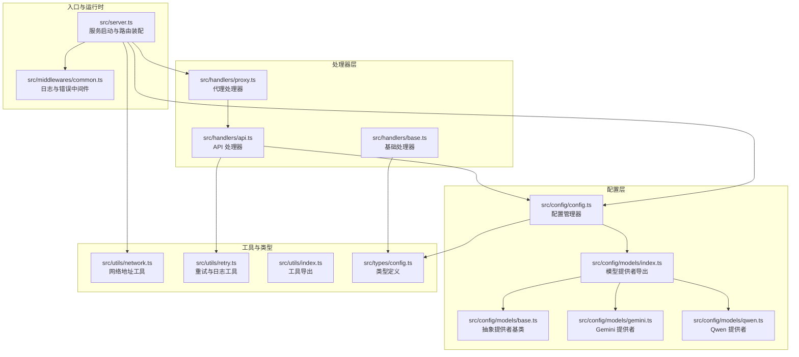
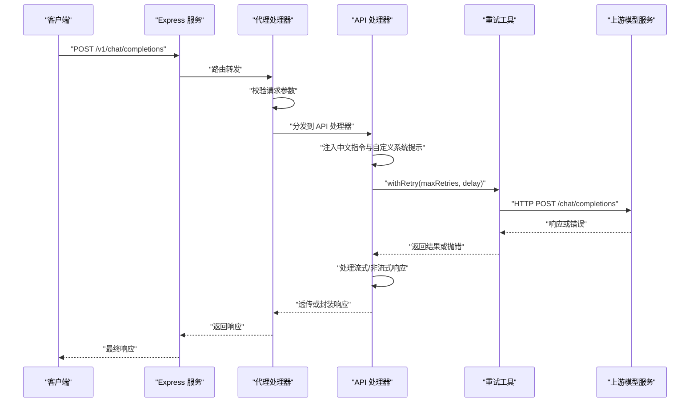
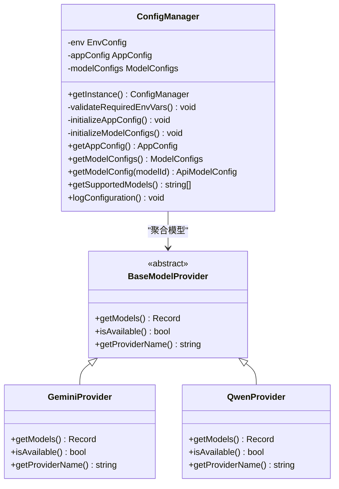
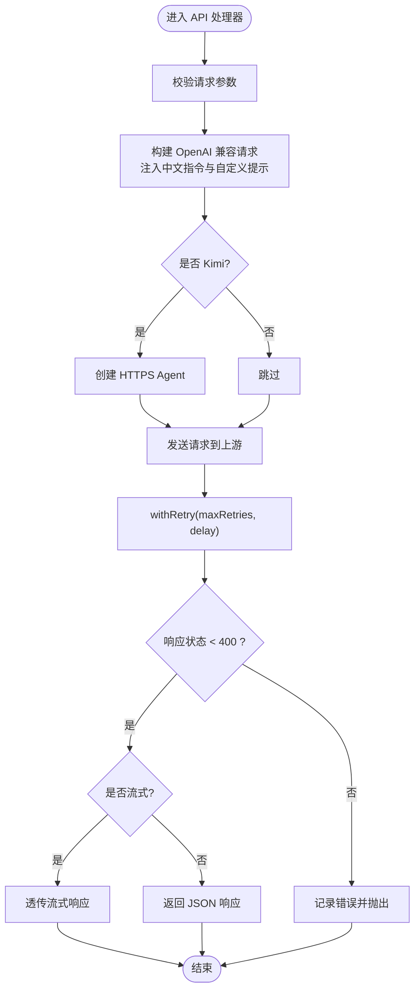
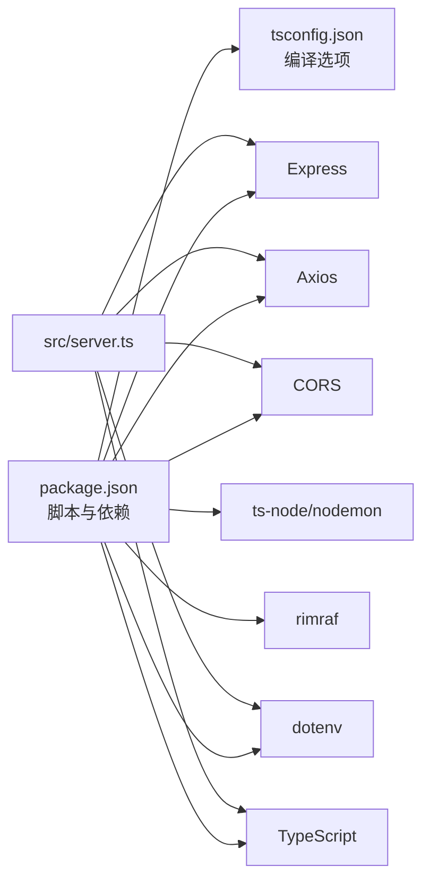

# 维护与升级

<cite>
**本文档引用的文件**
- [package.json](file://package.json)
- [tsconfig.json](file://tsconfig.json)
- [src/server.ts](file://src/server.ts)
- [src/config/config.ts](file://src/config/config.ts)
- [src/config/models/index.ts](file://src/config/models/index.ts)
- [src/config/models/base.ts](file://src/config/models/base.ts)
- [src/config/models/gemini.ts](file://src/config/models/gemini.ts)
- [src/config/models/qwen.ts](file://src/config/models/qwen.ts)
- [src/handlers/base.ts](file://src/handlers/base.ts)
- [src/handlers/api.ts](file://src/handlers/api.ts)
- [src/handlers/proxy.ts](file://src/handlers/proxy.ts)
- [src/middlewares/common.ts](file://src/middlewares/common.ts)
- [src/utils/network.ts](file://src/utils/network.ts)
- [src/utils/retry.ts](file://src/utils/retry.ts)
- [src/utils/index.ts](file://src/utils/index.ts)
- [src/types/config.ts](file://src/types/config.ts)
</cite>

## 目录
1. [简介](#简介)
2. [项目结构](#项目结构)
3. [核心组件](#核心组件)
4. [架构总览](#架构总览)
5. [详细组件分析](#详细组件分析)
6. [依赖分析](#依赖分析)
7. [性能考虑](#性能考虑)
8. [维护与升级流程](#维护与升级流程)
9. [备份与恢复策略](#备份与恢复策略)
10. [热更新与零停机部署](#热更新与零停机部署)
11. [维护窗口规划与变更管理](#维护窗口规划与变更管理)
12. [灾难恢复与业务连续性](#灾难恢复与业务连续性)
13. [故障排查指南](#故障排查指南)
14. [结论](#结论)

## 简介
本文件面向 xcode-ai-proxy 的运维与开发团队，提供一套完整的维护与升级操作手册。内容覆盖日常维护任务（日志轮转、磁盘清理、配置备份）、版本升级流程（依赖更新、配置迁移、兼容性检查）、备份与恢复策略（配置文件、外部服务配置、应用层数据）、热更新与零停机部署方案、维护窗口与变更管理流程，以及灾难恢复与业务连续性策略。文档以代码为依据，结合实际运行环境给出可执行的操作步骤与最佳实践。

## 项目结构
项目采用分层架构：入口服务负责路由与中间件装配；配置模块负责环境变量解析与模型配置聚合；处理器层负责请求校验、模型选择与上游调用；工具层提供网络与重试等通用能力；类型定义统一约束配置与请求响应结构。

**图表来源**
- [src/server.ts:1-88](file://src/server.ts#L1-L88)
- [src/config/config.ts:1-123](file://src/config/config.ts#L1-L123)
- [src/config/models/index.ts:1-5](file://src/config/models/index.ts#L1-L5)
- [src/config/models/base.ts:1-13](file://src/config/models/base.ts#L1-L13)
- [src/config/models/gemini.ts:1-34](file://src/config/models/gemini.ts#L1-L34)
- [src/config/models/qwen.ts:1-35](file://src/config/models/qwen.ts#L1-L35)
- [src/handlers/base.ts:1-40](file://src/handlers/base.ts#L1-L40)
- [src/handlers/proxy.ts:1-66](file://src/handlers/proxy.ts#L1-L66)
- [src/handlers/api.ts:1-196](file://src/handlers/api.ts#L1-L196)
- [src/middlewares/common.ts:1-25](file://src/middlewares/common.ts#L1-L25)
- [src/utils/network.ts:1-51](file://src/utils/network.ts#L1-L51)
- [src/utils/retry.ts:1-34](file://src/utils/retry.ts#L1-L34)
- [src/utils/index.ts:1-2](file://src/utils/index.ts#L1-L2)
- [src/types/config.ts:1-48](file://src/types/config.ts#L1-L48)

**章节来源**
- [src/server.ts:1-88](file://src/server.ts#L1-L88)
- [src/config/config.ts:1-123](file://src/config/config.ts#L1-L123)
- [src/handlers/proxy.ts:1-66](file://src/handlers/proxy.ts#L1-L66)
- [src/handlers/api.ts:1-196](file://src/handlers/api.ts#L1-L196)
- [src/middlewares/common.ts:1-25](file://src/middlewares/common.ts#L1-L25)
- [src/utils/network.ts:1-51](file://src/utils/network.ts#L1-L51)
- [src/utils/retry.ts:1-34](file://src/utils/retry.ts#L1-L34)
- [src/types/config.ts:1-48](file://src/types/config.ts#L1-L48)

## 核心组件
- 服务启动与路由装配：负责初始化 Express 应用、注册 CORS、JSON 解析、日志中间件、错误处理，并暴露健康检查、模型列表、聊天补全等路由。
- 配置管理器：从环境变量加载配置，校验必要密钥，初始化应用级配置（端口、主机、重试、超时、自定义系统提示）与模型配置（智谱、Kimi、Gemini、通义），并提供查询与日志输出。
- 处理器层：基础处理器负责请求校验与错误封装；代理处理器根据模型类型分发到 API 处理器；API 处理器对接上游 OpenAI 兼容接口，支持流式与非流式响应、重试、Kimi 专用 HTTPS Agent、中文交流指令注入与自定义系统提示注入。
- 中间件：统一日志记录与错误捕获，保证一致的可观测性与错误响应格式。
- 工具层：网络工具用于获取本地 IP 与服务访问地址；重试工具提供指数退避重试逻辑与请求日志。

**章节来源**
- [src/server.ts:1-88](file://src/server.ts#L1-L88)
- [src/config/config.ts:1-123](file://src/config/config.ts#L1-L123)
- [src/handlers/base.ts:1-40](file://src/handlers/base.ts#L1-L40)
- [src/handlers/proxy.ts:1-66](file://src/handlers/proxy.ts#L1-L66)
- [src/handlers/api.ts:1-196](file://src/handlers/api.ts#L1-L196)
- [src/middlewares/common.ts:1-25](file://src/middlewares/common.ts#L1-L25)
- [src/utils/network.ts:1-51](file://src/utils/network.ts#L1-L51)
- [src/utils/retry.ts:1-34](file://src/utils/retry.ts#L1-L34)

## 架构总览
下图展示从客户端到上游模型服务的调用链路，以及关键控制点（配置、重试、错误处理）。

**图表来源**
- [src/server.ts:29-44](file://src/server.ts#L29-L44)
- [src/handlers/proxy.ts:9-37](file://src/handlers/proxy.ts#L9-L37)
- [src/handlers/api.ts:30-195](file://src/handlers/api.ts#L30-L195)
- [src/utils/retry.ts:1-34](file://src/utils/retry.ts#L1-L34)

## 详细组件分析

### 配置管理器（ConfigManager）
- 单例模式：全局唯一实例，确保配置一致性。
- 环境变量校验：至少需配置一个模型密钥（智谱、Kimi、Gemini、通义），否则进程退出。
- 应用配置：端口、主机、最大重试次数、重试延迟、请求超时、自定义系统提示。
- 模型配置：按提供者聚合模型清单，支持多模型并存。
- 日志输出：启动时打印支持的模型与重试配置，便于运维核对。

**图表来源**
- [src/config/config.ts:7-123](file://src/config/config.ts#L7-L123)
- [src/config/models/base.ts:3-7](file://src/config/models/base.ts#L3-L7)
- [src/config/models/gemini.ts:4-34](file://src/config/models/gemini.ts#L4-L34)
- [src/config/models/qwen.ts:4-35](file://src/config/models/qwen.ts#L4-L35)

**章节来源**
- [src/config/config.ts:1-123](file://src/config/config.ts#L1-L123)
- [src/config/models/base.ts:1-13](file://src/config/models/base.ts#L1-L13)
- [src/config/models/gemini.ts:1-34](file://src/config/models/gemini.ts#L1-L34)
- [src/config/models/qwen.ts:1-35](file://src/config/models/qwen.ts#L1-L35)

### 代理与 API 处理器
- 代理处理器：校验模型是否受支持，统一调度至 API 处理器。
- API 处理器：构建 OpenAI 兼容请求，注入中文交流指令与自定义系统提示；针对 Kimi 使用专用 HTTPS Agent；支持流式与非流式响应；通过 withRetry 实现指数退避重试；错误时透传上游状态与内容以便诊断。

**图表来源**
- [src/handlers/proxy.ts:9-37](file://src/handlers/proxy.ts#L9-L37)
- [src/handlers/api.ts:30-195](file://src/handlers/api.ts#L30-L195)
- [src/utils/retry.ts:1-34](file://src/utils/retry.ts#L1-L34)

**章节来源**
- [src/handlers/proxy.ts:1-66](file://src/handlers/proxy.ts#L1-L66)
- [src/handlers/api.ts:1-196](file://src/handlers/api.ts#L1-L196)

### 中间件与日志
- 日志中间件：记录每次请求的方法与路径，便于审计与问题定位。
- 错误中间件：统一捕获未处理异常，返回标准错误响应，避免泄露内部细节。

**章节来源**
- [src/middlewares/common.ts:1-25](file://src/middlewares/common.ts#L1-L25)

### 网络与重试工具
- 网络工具：获取本地 IPv4 地址、主内网 IP、生成服务访问 URL 列表，辅助运维在多网卡环境下快速定位服务地址。
- 重试工具：提供带指数退避的重试机制与请求时间戳日志，便于观测重试行为与性能。

**章节来源**
- [src/utils/network.ts:1-51](file://src/utils/network.ts#L1-L51)
- [src/utils/retry.ts:1-34](file://src/utils/retry.ts#L1-L34)

## 依赖分析
- 运行时依赖：Express 提供 Web 服务，Axios 用于 HTTP 请求，CORS 支持跨域，dotenv 加载环境变量。
- 开发依赖：TypeScript 编译与类型检查，ts-node/ nodemon 支持开发调试，rimraf 清理构建目录。
- 类型与配置：通过 types/config.ts 定义应用配置、模型配置与环境变量键值，确保配置项明确且可追踪。

**图表来源**
- [package.json:1-30](file://package.json#L1-L30)
- [tsconfig.json:1-35](file://tsconfig.json#L1-L35)
- [src/server.ts:1-88](file://src/server.ts#L1-L88)

**章节来源**
- [package.json:1-30](file://package.json#L1-L30)
- [tsconfig.json:1-35](file://tsconfig.json#L1-L35)

## 性能考虑
- 流式响应：上游支持流式时，直接透传流，降低内存占用与延迟。
- 重试策略：指数退避减少上游压力峰值，提升整体成功率。
- 请求超时：可配置的请求超时避免长时间挂起影响吞吐。
- 日志级别：生产环境建议降低日志量，仅保留关键信息，避免 I/O 影响。

[本节为通用指导，无需“章节来源”]

## 维护与升级流程

### 日常维护任务
- 日志轮转
  - 将服务 stdout 重定向到文件并配合系统日志轮转工具（如 systemd/journald、logrotate）进行轮转与压缩，设置保留周期与大小阈值。
  - 关注关键日志：启动信息（模型列表、重试配置）、请求日志（方法与路径）、错误日志（状态码、错误详情）。
- 磁盘清理
  - 清理构建产物与临时文件：执行清理脚本移除构建目录，避免无用文件占用空间。
  - 定期扫描日志文件夹，删除超过保留期的日志归档。
- 配置备份
  - 备份环境变量文件与配置文件（如 .env），确保密钥与服务参数可追溯。
  - 记录当前生效的配置快照（可通过启动日志汇总），作为回滚依据。

**章节来源**
- [src/server.ts:54-83](file://src/server.ts#L54-L83)
- [src/middlewares/common.ts:4-7](file://src/middlewares/common.ts#L4-L7)
- [package.json:11](file://package.json#L11)

### 版本升级流程
- 依赖更新
  - 更新包管理依赖，确保兼容性；优先使用语义化版本范围，避免破坏性变更。
  - 编译并运行类型检查，修复类型错误后再进行部署。
- 配置迁移
  - 新增配置项时，先在环境变量中添加默认值，逐步替换旧配置键。
  - 对模型配置进行兼容性检查，确保提供者名称与模型 ID 保持稳定。
- 兼容性检查
  - 在测试环境验证上游 API 变更（如认证方式、请求字段）对代理层的影响。
  - 验证流式与非流式响应的一致性，确保错误透传逻辑不变。

**章节来源**
- [package.json:14-28](file://package.json#L14-L28)
- [tsconfig.json:2-26](file://tsconfig.json#L2-L26)
- [src/config/config.ts:29-51](file://src/config/config.ts#L29-L51)
- [src/config/models/index.ts:1-5](file://src/config/models/index.ts#L1-L5)

## 备份与恢复策略

### 配置文件备份
- 环境变量与密钥：备份 .env 文件与系统环境变量导出，确保密钥与服务地址可恢复。
- 应用配置快照：通过启动日志记录当前模型列表与重试配置，形成可比对的配置快照。

**章节来源**
- [src/server.ts:54-83](file://src/server.ts#L54-L83)
- [src/config/config.ts:117-122](file://src/config/config.ts#L117-L122)

### 数据库与外部服务
- 本项目为 API 代理，不直接持久化业务数据；若存在外部依赖（如缓存、会话存储），需按其官方备份策略执行。
- 对于上游模型服务（智谱、Kimi、Gemini、通义），关注其服务可用性与配额变化，必要时准备备用密钥与模型。

[本节为通用指导，无需“章节来源”]

### 完整系统备份
- 包含：源代码、构建产物、依赖、配置文件、日志与系统服务配置。
- 建议：定期打包并异地存储，验证可恢复性。

[本节为通用指导，无需“章节来源”]

## 热更新与零停机部署

### 零停机部署方案
- 蓝绿部署：准备两套实例，先在备用实例上部署新版本并进行健康检查，确认无误后切换流量。
- 滚动更新：逐批重启容器或进程，确保始终有可用实例处理请求。
- 健康检查：利用内置健康端点进行探活，失败时自动回滚。

**章节来源**
- [src/handlers/proxy.ts:59-65](file://src/handlers/proxy.ts#L59-L65)

### 热更新策略
- 配置热加载：在不重启服务的前提下，通过环境变量或配置中心刷新配置（需评估是否支持热更新）。
- 代码热替换：适用于开发阶段，生产环境建议通过容器编排或进程管理器进行平滑重启。

[本节为通用指导，无需“章节来源”]

## 维护窗口规划与变更管理

### 维护窗口
- 选择业务低峰时段进行部署与升级，提前通知相关方。
- 准备回滚预案与应急联系人，确保问题可快速处置。

### 变更管理
- 变更审批：重大变更需经评审与批准。
- 变更记录：记录变更内容、影响范围、测试结果与回滚措施。
- 回滚流程：一旦发现问题，立即回滚至上一稳定版本并复盘。

[本节为通用指导，无需“章节来源”]

## 灾难恢复与业务连续性

### 灾难恢复计划
- 快速恢复：优先恢复核心服务（健康检查与模型列表），再逐步恢复其他功能。
- 数据恢复：按备份策略恢复配置与密钥，重新加载配置并验证连通性。
- 业务连续性：准备备用上游密钥与模型，确保在单一上游不可用时仍可提供服务。

**章节来源**
- [src/handlers/proxy.ts:59-65](file://src/handlers/proxy.ts#L59-L65)
- [src/config/config.ts:29-51](file://src/config/config.ts#L29-L51)

## 故障排查指南

### 常见问题定位
- 启动失败：检查至少配置一个模型密钥，查看启动日志中的模型列表与重试配置。
- 请求错误：查看代理处理器与 API 处理器的日志，关注状态码与错误详情；对于流式错误，检查错误流读取与解析。
- 网络问题：确认服务绑定的主机与端口，使用网络工具获取可用访问地址。

**章节来源**
- [src/config/config.ts:42-50](file://src/config/config.ts#L42-L50)
- [src/server.ts:54-83](file://src/server.ts#L54-L83)
- [src/handlers/api.ts:124-164](file://src/handlers/api.ts#L124-L164)
- [src/utils/network.ts:35-51](file://src/utils/network.ts#L35-L51)

### 重试与超时
- 调整最大重试次数与重试延迟，观察日志中的重试行为与耗时。
- 合理设置请求超时，避免长时间阻塞影响吞吐。

**章节来源**
- [src/config/config.ts:53-67](file://src/config/config.ts#L53-L67)
- [src/utils/retry.ts:8-26](file://src/utils/retry.ts#L8-L26)

## 结论
本维护与升级文档基于代码实现与运行特性，提供了可操作的日常维护、升级流程、备份恢复、热更新与零停机部署、维护窗口与变更管理以及灾难恢复策略。建议在生产环境中结合自身监控与告警体系，持续优化日志轮转、重试策略与健康检查，确保系统的稳定性与可维护性。