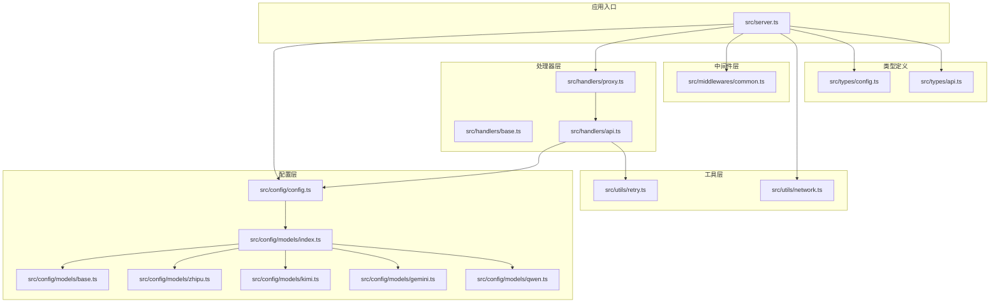
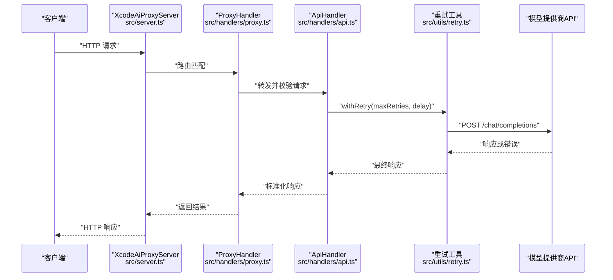
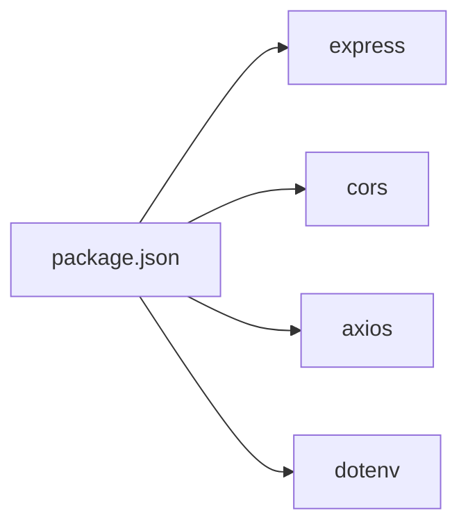
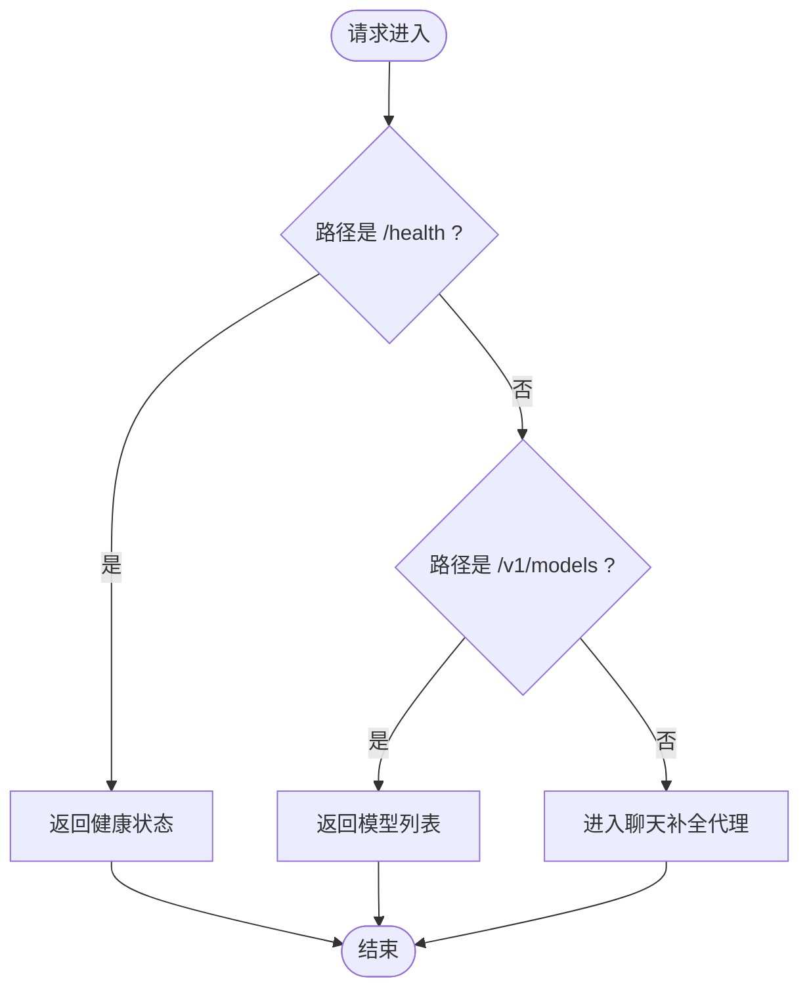

# 部署与运维

<cite>
**本文引用的文件**
- [package.json](file://package.json)
- [tsconfig.json](file://tsconfig.json)
- [.gitignore](file://.gitignore)
- [src/server.ts](file://src/server.ts)
- [src/config/config.ts](file://src/config/config.ts)
- [src/config/index.ts](file://src/config/index.ts)
- [src/config/models/index.ts](file://src/config/models/index.ts)
- [src/config/models/base.ts](file://src/config/models/base.ts)
- [src/config/models/zhipu.ts](file://src/config/models/zhipu.ts)
- [src/config/models/kimi.ts](file://src/config/models/kimi.ts)
- [src/config/models/gemini.ts](file://src/config/models/gemini.ts)
- [src/config/models/qwen.ts](file://src/config/models/qwen.ts)
- [src/handlers/base.ts](file://src/handlers/base.ts)
- [src/handlers/api.ts](file://src/handlers/api.ts)
- [src/handlers/proxy.ts](file://src/handlers/proxy.ts)
- [src/middlewares/common.ts](file://src/middlewares/common.ts)
- [src/utils/network.ts](file://src/utils/network.ts)
- [src/utils/retry.ts](file://src/utils/retry.ts)
- [src/types/config.ts](file://src/types/config.ts)
- [src/types/api.ts](file://src/types/api.ts)
</cite>

## 目录
1. [简介](#简介)
2. [项目结构](#项目结构)
3. [核心组件](#核心组件)
4. [架构总览](#架构总览)
5. [详细组件分析](#详细组件分析)
6. [依赖分析](#依赖分析)
7. [性能考虑](#性能考虑)
8. [故障排除指南](#故障排除指南)
9. [结论](#结论)
10. [附录](#附录)

## 简介
本文件面向生产环境的部署与运维，围绕 xcode-ai-proxy 的服务器要求、环境变量、安全配置、性能优化、监控与日志、故障排除、备份与恢复、升级与维护以及容器化与云平台部署进行系统化说明。文档以代码库为依据，结合实际实现细节，提供可操作的配置与运维建议。

## 项目结构
项目采用按功能分层的组织方式：
- 配置层：集中管理应用配置与各模型提供商配置
- 处理器层：统一入口代理与具体 API 处理逻辑
- 中间件层：通用日志与错误处理
- 工具层：网络地址解析、重试机制、请求日志
- 类型层：请求/响应与配置的数据契约
- 服务入口：Express 应用与路由注册

图表来源
- [src/server.ts:1-88](file://src/server.ts#L1-L88)
- [src/config/config.ts:1-121](file://src/config/config.ts#L1-L121)
- [src/config/models/index.ts:1-5](file://src/config/models/index.ts#L1-L5)
- [src/config/models/base.ts:1-13](file://src/config/models/base.ts#L1-L13)
- [src/config/models/zhipu.ts:1-34](file://src/config/models/zhipu.ts#L1-L34)
- [src/config/models/kimi.ts:1-34](file://src/config/models/kimi.ts#L1-L34)
- [src/config/models/gemini.ts:1-34](file://src/config/models/gemini.ts#L1-L34)
- [src/config/models/qwen.ts:1-35](file://src/config/models/qwen.ts#L1-L35)
- [src/handlers/base.ts:1-40](file://src/handlers/base.ts#L1-L40)
- [src/handlers/proxy.ts:1-66](file://src/handlers/proxy.ts#L1-L66)
- [src/handlers/api.ts:1-196](file://src/handlers/api.ts#L1-L196)
- [src/middlewares/common.ts:1-25](file://src/middlewares/common.ts#L1-L25)
- [src/utils/network.ts:1-51](file://src/utils/network.ts#L1-L51)
- [src/utils/retry.ts:1-34](file://src/utils/retry.ts#L1-L34)
- [src/types/config.ts:1-48](file://src/types/config.ts#L1-L48)
- [src/types/api.ts:1-58](file://src/types/api.ts#L1-L58)

章节来源
- [src/server.ts:1-88](file://src/server.ts#L1-L88)
- [package.json:1-30](file://package.json#L1-L30)

## 核心组件
- 应用服务器：基于 Express，提供健康检查、模型列表查询、聊天补全代理等路由；内置 CORS、JSON 解析与日志中间件；错误处理中间件统一输出标准错误响应。
- 配置管理：集中读取环境变量，校验必要密钥，初始化应用配置与模型配置；支持多提供商模型聚合与动态日志输出。
- 处理器链路：BaseHandler 提供请求校验与错误发送；ProxyHandler 路由到 ApiHandler；ApiHandler 负责构建 OpenAI 兼容请求、注入系统提示、处理流式与非流式响应，并集成重试。
- 工具与中间件：网络工具用于获取本地 IP 与访问地址；重试工具实现指数退避重试；通用中间件负责请求日志与全局错误捕获。

章节来源
- [src/server.ts:1-88](file://src/server.ts#L1-L88)
- [src/config/config.ts:1-121](file://src/config/config.ts#L1-L121)
- [src/handlers/base.ts:1-40](file://src/handlers/base.ts#L1-L40)
- [src/handlers/proxy.ts:1-66](file://src/handlers/proxy.ts#L1-L66)
- [src/handlers/api.ts:1-196](file://src/handlers/api.ts#L1-L196)
- [src/middlewares/common.ts:1-25](file://src/middlewares/common.ts#L1-L25)
- [src/utils/network.ts:1-51](file://src/utils/network.ts#L1-L51)
- [src/utils/retry.ts:1-34](file://src/utils/retry.ts#L1-L34)

## 架构总览
下图展示从客户端到上游模型提供商的调用链，以及关键的配置与错误处理节点。

图表来源
- [src/server.ts:29-44](file://src/server.ts#L29-L44)
- [src/handlers/proxy.ts:9-37](file://src/handlers/proxy.ts#L9-L37)
- [src/handlers/api.ts:30-195](file://src/handlers/api.ts#L30-L195)
- [src/utils/retry.ts:1-34](file://src/utils/retry.ts#L1-L34)

## 详细组件分析

### 配置管理与环境变量
- 必需环境变量
  - 至少配置一个提供商的 API 密钥：ZHIPU_API_KEY、KIMI_API_KEY、GEMINI_API_KEY、QWEN_API_KEY
  - 可选：CUSTOM_SYSTEM_PROMPT（自定义系统提示）、PORT、HOST、MAX_RETRIES、RETRY_DELAY、REQUEST_TIMEOUT
- 应用配置项
  - 端口与监听地址、最大重试次数、重试延迟（毫秒）、请求超时（毫秒）、自定义系统提示
- 模型配置
  - 智谱、Kimi、Gemini、通义四家提供商，每家默认提供一个模型标识与对应 API 地址与模型名映射
- 日志输出
  - 启动时打印支持的模型、重试配置、Xcode 配置示例与完整配置清单

章节来源
- [src/config/config.ts:27-97](file://src/config/config.ts#L27-L97)
- [src/config/config.ts:115-121](file://src/config/config.ts#L115-L121)
- [src/server.ts:54-83](file://src/server.ts#L54-L83)
- [src/types/config.ts:24-48](file://src/types/config.ts#L24-L48)

### 处理器与路由
- 路由
  - GET /health：健康检查
  - GET /v1/models：返回模型列表
  - POST /v1/chat/completions、/api/v1/chat/completions、/v1/messages：聊天补全代理
- 代理处理
  - 校验请求参数与模型可用性
  - 将请求转交给 ApiHandler
- API 处理
  - 校验请求、注入中文交流指令与自定义系统提示
  - 构造 OpenAI 兼容请求体，禁用压缩便于调试
  - 流式响应透传，非流式响应直接返回 JSON
  - 对上游错误进行解析与透传，保留状态码与 URL 信息

章节来源
- [src/server.ts:29-40](file://src/server.ts#L29-L40)
- [src/handlers/proxy.ts:9-37](file://src/handlers/proxy.ts#L9-L37)
- [src/handlers/api.ts:9-28](file://src/handlers/api.ts#L9-L28)
- [src/handlers/api.ts:30-195](file://src/handlers/api.ts#L30-L195)

### 中间件与日志
- 日志中间件：记录请求方法与路径
- 错误处理中间件：统一输出 JSON 错误响应，避免重复写入响应头

章节来源
- [src/middlewares/common.ts:4-25](file://src/middlewares/common.ts#L4-L25)

### 网络与地址解析
- 获取本机 IPv4 地址、主地址与服务访问 URL 列表，支持监听 0.0.0.0 时输出多地址

章节来源
- [src/utils/network.ts:1-51](file://src/utils/network.ts#L1-L51)
- [src/server.ts:54-83](file://src/server.ts#L54-L83)

### 重试机制
- 指数退避重试：第 n 次延迟为 baseDelay × n
- 最多重试次数与失败兜底

章节来源
- [src/utils/retry.ts:1-34](file://src/utils/retry.ts#L1-L34)
- [src/handlers/api.ts:117-121](file://src/handlers/api.ts#L117-L121)

### 数据模型与类型
- 请求/响应结构遵循 OpenAI 兼容格式
- 配置类型定义清晰区分应用配置与模型配置

章节来源
- [src/types/api.ts:1-58](file://src/types/api.ts#L1-L58)
- [src/types/config.ts:1-48](file://src/types/config.ts#L1-L48)

## 依赖分析
- 运行时依赖
  - express：Web 服务器与路由
  - cors：跨域支持
  - axios：HTTP 客户端
  - dotenv：环境变量加载
- 开发依赖
  - TypeScript、ts-node、nodemon、rimraf 等

图表来源
- [package.json:14-28](file://package.json#L14-L28)

章节来源
- [package.json:1-30](file://package.json#L1-30)

## 性能考虑
- 并发与连接
  - 默认启用 Keep-Alive（针对特定提供商）以复用连接，降低握手开销
  - 流式响应透传上游数据流，避免额外缓冲
- 超时与重试
  - 可配置请求超时与最大重试次数及延迟，建议根据上游 SLA 调整
- 内存与负载
  - JSON 解析限制大小，避免过大请求导致内存压力
  - 流式场景建议客户端具备背压处理能力
- 缓存策略
  - 当前未实现服务端缓存；如需可引入轻量缓存（如 LRU）以减少重复请求，注意键空间设计与失效策略
- 监控指标建议
  - 请求数、成功率、P95/P99 延迟、上游错误率、重试次数、流式传输速率、内存与 CPU 使用率

章节来源
- [src/server.ts:23-27](file://src/server.ts#L23-L27)
- [src/handlers/api.ts:46-56](file://src/handlers/api.ts#L46-L56)
- [src/handlers/api.ts:168-194](file://src/handlers/api.ts#L168-L194)
- [src/utils/retry.ts:1-34](file://src/utils/retry.ts#L1-L34)

## 故障排除指南
- 启动失败
  - 现象：启动即退出
  - 排查：至少配置一个提供商 API 密钥；查看控制台输出的密钥校验提示
- 访问异常
  - 现象：无法访问或仅本机可访问
  - 排查：确认 HOST 与 PORT；若监听 0.0.0.0，查看启动日志中的多地址列表
- 上游错误
  - 现象：返回 4xx/5xx 或流式错误
  - 排查：查看错误日志中状态码、URL 与错误体；确认 Authorization 头是否正确；检查自定义系统提示是否影响对话
- 重试失败
  - 现象：多次重试后仍失败
  - 排查：调整 MAX_RETRIES 与 RETRY_DELAY；检查 REQUEST_TIMEOUT；确认上游限流与配额
- 流式响应中断
  - 现象：客户端接收中断或乱码
  - 排查：确保客户端支持 SSE；检查网络稳定性与代理链路；确认上游响应头与编码

章节来源
- [src/config/config.ts:27-49](file://src/config/config.ts#L27-L49)
- [src/server.ts:54-83](file://src/server.ts#L54-L83)
- [src/handlers/api.ts:124-164](file://src/handlers/api.ts#L124-L164)
- [src/utils/retry.ts:1-34](file://src/utils/retry.ts#L1-L34)

## 结论
本项目以简洁的 Express 服务承载多提供商 OpenAI 兼容代理，具备良好的扩展性与可观测性。生产部署建议完善安全基线、监控告警与容量规划，并结合业务场景优化重试与缓存策略。

## 附录

### 生产环境配置清单
- 服务器要求
  - 操作系统：Linux/Windows/macOS（推荐 Linux）
  - 运行时：Node.js（与项目类型配置一致）
  - 端口：确保对外暴露的端口未被占用
- 环境变量
  - 必填：至少一个 PROVIDER_API_KEY（如 ZHIPU_API_KEY）
  - 可选：PROVIDER_API_URL（覆盖默认上游地址）、CUSTOM_SYSTEM_PROMPT、PORT、HOST、MAX_RETRIES、RETRY_DELAY、REQUEST_TIMEOUT
- 安全配置
  - 限制访问源（CORS 默认允许所有源，生产建议精确配置）
  - 通过反向代理启用 HTTPS 与证书校验
  - 严格管理 API 密钥，避免泄露
  - 限制请求体大小与超时，防止资源滥用
- 监控与日志
  - 日志级别：建议将应用日志接入统一日志平台，区分 INFO/ERROR
  - 指标：请求数、错误率、P95/P99 延迟、上游调用耗时、重试次数
  - 告警：对错误率突增、上游不可用、重试耗尽等阈值触发告警
- 备份与恢复
  - 配置备份：定期导出环境变量与配置文件；在 CI/CD 中管理密钥
  - 数据保护：不存储用户对话；如需审计日志，遵循最小化原则与合规要求
  - 灾难恢复：准备多副本与蓝绿发布策略，确保快速回滚
- 升级与维护
  - 版本升级：先在预生产验证，再滚动更新；记录变更与回滚点
  - 配置迁移：通过环境变量与配置文件演进，避免硬编码
  - 兼容性检查：关注上游 API 变更与 SDK 更新
- 容器化与云平台
  - Docker：构建镜像、暴露端口、挂载配置卷与日志目录
  - Kubernetes：Deployment/Service/HPA/ConfigMap/Secret；健康检查与就绪探针
  - 云平台：AWS/GCP/Azure 上的托管容器服务或无服务器方案，结合平台监控与告警

### 关键流程图：健康检查与模型列表

图表来源
- [src/server.ts:31-39](file://src/server.ts#L31-L39)
- [src/handlers/proxy.ts:39-65](file://src/handlers/proxy.ts#L39-L65)