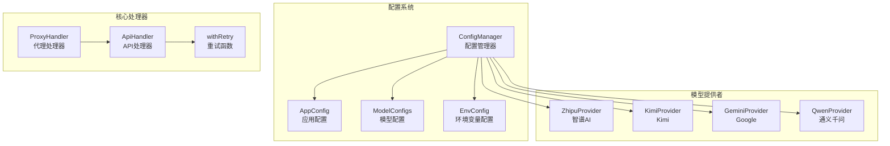
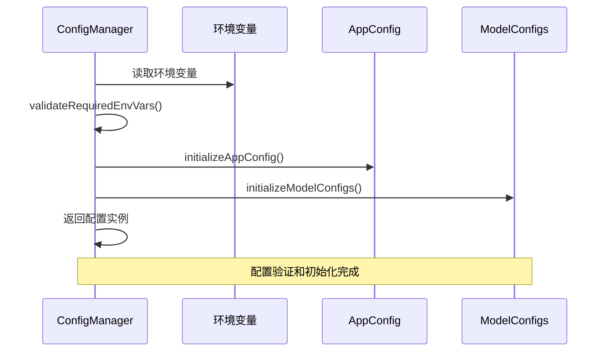
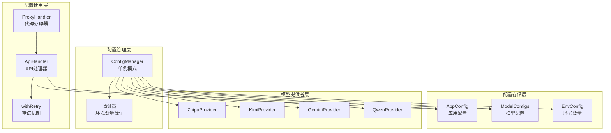
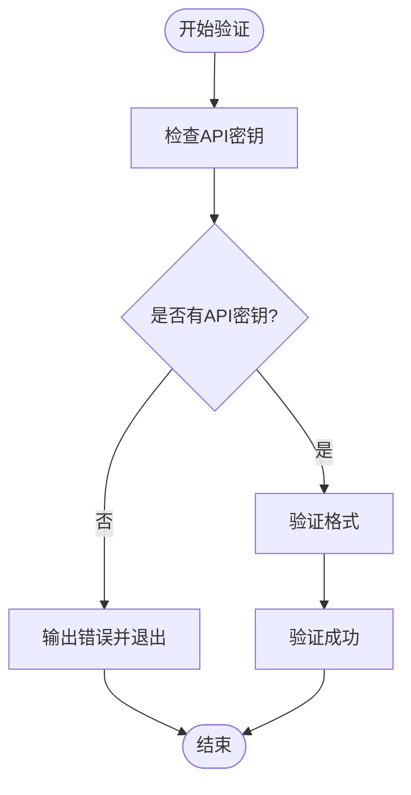
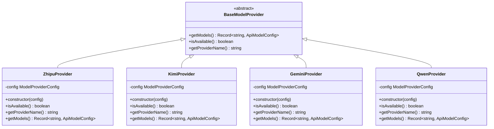
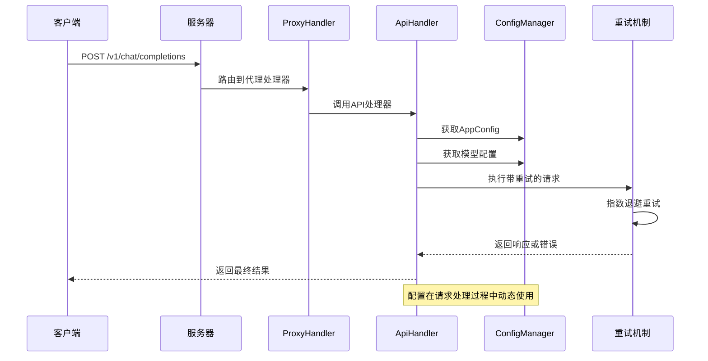
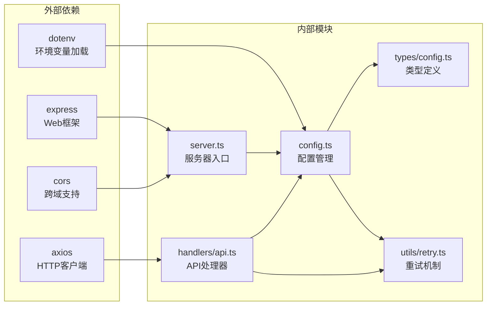

# 应用配置详解

<cite>
**本文档引用的文件**
- [src/config/config.ts](file://src/config/config.ts)
- [src/types/config.ts](file://src/types/config.ts)
- [src/utils/retry.ts](file://src/utils/retry.ts)
- [src/server.ts](file://src/server.ts)
- [src/handlers/api.ts](file://src/handlers/api.ts)
- [src/config/models/base.ts](file://src/config/models/base.ts)
- [src/config/models/zhipu.ts](file://src/config/models/zhipu.ts)
- [src/config/models/gemini.ts](file://src/config/models/gemini.ts)
- [package.json](file://package.json)
</cite>

## 目录
1. [简介](#简介)
2. [项目结构](#项目结构)
3. [核心组件](#核心组件)
4. [架构概览](#架构概览)
5. [详细组件分析](#详细组件分析)
6. [依赖关系分析](#依赖关系分析)
7. [性能考虑](#性能考虑)
8. [故障排除指南](#故障排除指南)
9. [结论](#结论)
10. [附录](#附录)

## 简介

Xcode AI 代理服务是一个基于 Node.js 的 AI API 代理服务器，支持多个主流 AI 模型提供商。本文档深入解析应用配置系统，特别是 AppConfig 结构中的所有配置项，包括服务器端口和主机绑定、请求超时设置、重试机制配置、自定义系统提示等功能。

该系统采用单例模式的配置管理器，通过环境变量进行配置，并提供了灵活的模型配置和重试机制。配置系统支持开发、测试和生产环境的不同需求，并针对高并发场景进行了优化。

## 项目结构

应用配置系统主要分布在以下模块中：



**图表来源**
- [src/config/config.ts:1-121](file://src/config/config.ts#L1-L121)
- [src/types/config.ts:24-48](file://src/types/config.ts#L24-L48)

**章节来源**
- [src/config/config.ts:1-121](file://src/config/config.ts#L1-L121)
- [src/types/config.ts:1-48](file://src/types/config.ts#L1-L48)

## 核心组件

### AppConfig 结构详解

AppConfig 是应用的核心配置对象，定义了服务器运行所需的所有参数：

| 配置项 | 类型 | 默认值 | 必填 | 描述 |
|--------|------|--------|------|------|
| port | number | 3000 | 否 | 服务器监听端口号 |
| host | string | '0.0.0.0' | 否 | 服务器绑定的主机地址 |
| maxRetries | number | 3 | 否 | 最大重试次数 |
| retryDelay | number | 1000 | 否 | 基础重试延迟时间(ms) |
| requestTimeout | number | 60000 | 否 | 请求超时时间(ms) |
| customSystemPrompt | string | undefined | 否 | 自定义系统提示语 |

### 配置初始化流程



**图表来源**
- [src/config/config.ts:27-65](file://src/config/config.ts#L27-L65)

**章节来源**
- [src/config/config.ts:51-65](file://src/config/config.ts#L51-L65)
- [src/types/config.ts:24-31](file://src/types/config.ts#L24-L31)

## 架构概览

应用配置系统采用分层架构设计，确保配置的灵活性和可维护性：



**图表来源**
- [src/config/config.ts:7-121](file://src/config/config.ts#L7-L121)
- [src/handlers/api.ts:8-28](file://src/handlers/api.ts#L8-L28)

## 详细组件分析

### 配置管理器(ConfigManager)

ConfigManager 是应用配置系统的核心，采用单例模式确保全局唯一性：

#### 主要职责
- 环境变量验证和转换
- AppConfig 初始化
- ModelConfigs 配置管理
- 配置信息的日志输出

#### 关键方法分析

**环境变量验证**


**图表来源**
- [src/config/config.ts:27-49](file://src/config/config.ts#L27-L49)

**AppConfig 初始化**
- 端口配置：默认 3000，支持环境变量覆盖
- 主机绑定：默认 '0.0.0.0'，允许外部访问
- 重试机制：最大重试 3 次，基础延迟 1000ms
- 请求超时：默认 60000ms (1分钟)
- 自定义提示：可选配置项

**章节来源**
- [src/config/config.ts:7-25](file://src/config/config.ts#L7-L25)
- [src/config/config.ts:27-65](file://src/config/config.ts#L27-L65)

### 重试机制(withRetry)

重试机制实现了指数退避策略，提高网络请求的稳定性：

#### 重试算法
- **重试次数**：由 maxRetries 参数控制，默认 3 次
- **延迟计算**：第 n 次重试延迟 = baseDelay × n
- **总等待时间**：约 (maxRetries² + maxRetries) / 2 × baseDelay

#### 性能特性
- **内存占用**：O(1) - 固定大小的状态变量
- **CPU 开销**：O(maxRetries) - 线性增长
- **网络开销**：最多 maxRetries 次额外请求

**章节来源**
- [src/utils/retry.ts:1-26](file://src/utils/retry.ts#L1-L26)

### 模型配置系统

系统支持四个主要的 AI 模型提供商，每个都有独立的配置类：

#### 模型提供者架构



**图表来源**
- [src/config/models/base.ts:3-13](file://src/config/models/base.ts#L3-L13)
- [src/config/models/zhipu.ts:4-34](file://src/config/models/zhipu.ts#L4-L34)

#### 模型配置特点

| 提供商 | 模型ID | API端点 | 认证方式 | 特殊配置 |
|--------|--------|---------|----------|----------|
| 智谱AI | glm-4.5 | open.bigmodel.cn | Bearer Token | 标准 OpenAI 兼容 |
| Kimi | kimi-moonshot | api.kimichat | Bearer Token | HTTPS Agent |
| Google | gemini-2.5-pro | generativelanguage.googleapis.com | Bearer Token | OpenAI 兼容端点 |
| 通义千问 | qwen-plus | dashscope.aliyuncs.com | Bearer Token | 空工具数组处理 |

**章节来源**
- [src/config/models/zhipu.ts:20-33](file://src/config/models/zhipu.ts#L20-L33)
- [src/config/models/gemini.ts:20-33](file://src/config/models/gemini.ts#L20-L33)

### 配置使用流程

#### 请求处理中的配置应用



**图表来源**
- [src/handlers/proxy.ts:9-37](file://src/handlers/proxy.ts#L9-L37)
- [src/handlers/api.ts:30-121](file://src/handlers/api.ts#L30-L121)

**章节来源**
- [src/handlers/proxy.ts:9-37](file://src/handlers/proxy.ts#L9-L37)
- [src/handlers/api.ts:30-121](file://src/handlers/api.ts#L30-L121)

## 依赖关系分析

### 配置系统依赖图



**图表来源**
- [package.json:14-19](file://package.json#L14-L19)
- [src/config/config.ts:1-3](file://src/config/config.ts#L1-L3)

### 配置耦合度分析

配置系统具有良好的内聚性和低耦合性：

- **ConfigManager** 作为单一职责的配置中心
- **类型定义** 与实现分离，便于测试和维护
- **模型提供者** 独立扩展，符合开闭原则
- **重试机制** 可复用，不依赖具体业务逻辑

**章节来源**
- [src/config/config.ts:1-5](file://src/config/config.ts#L1-L5)
- [src/types/config.ts:1-48](file://src/types/config.ts#L1-L48)

## 性能考虑

### 配置对性能的影响

#### 内存使用
- **配置对象**：AppConfig ~ 200 bytes，ModelConfigs ~ O(n) bytes
- **重试状态**：每次重试 ~ 100 bytes 状态信息
- **模型缓存**：模型配置在内存中持久化，避免重复初始化

#### CPU 开销
- **配置初始化**：O(m) 时间复杂度，m 为模型数量
- **重试算法**：O(k) 时间复杂度，k 为重试次数
- **JSON 解析**：仅在必要时进行，避免不必要的开销

#### 网络性能
- **连接复用**：Kimi 提供商使用 HTTPS Agent 进行连接复用
- **超时控制**：统一的请求超时设置，防止长时间阻塞
- **流式传输**：支持流式响应，减少内存占用

### 性能优化建议

#### 开发环境配置
```bash
# 开发环境推荐配置
PORT=3000
HOST=127.0.0.1
MAX_RETRIES=2
RETRY_DELAY=500
REQUEST_TIMEOUT=30000
```

#### 生产环境配置
```bash
# 生产环境推荐配置
PORT=8080
HOST=0.0.0.0
MAX_RETRIES=3
RETRY_DELAY=1000
REQUEST_TIMEOUT=60000
```

#### 高并发场景配置
```bash
# 高并发场景推荐配置
PORT=8080
HOST=0.0.0.0
MAX_RETRIES=2
RETRY_DELAY=500
REQUEST_TIMEOUT=30000
```

## 故障排除指南

### 常见配置问题

#### 环境变量配置错误
**症状**：启动时立即退出
**原因**：缺少必要的 API 密钥
**解决方案**：
1. 检查至少配置一个 API 密钥
2. 确认环境变量名称正确
3. 验证 API 密钥格式

#### 端口占用问题
**症状**：服务器无法启动
**原因**：端口已被其他进程占用
**解决方案**：
1. 更改 PORT 环境变量
2. 使用 `lsof -i :port` 查找占用进程
3. 杀死占用进程或选择其他端口

#### 超时配置不当
**症状**：请求经常超时或响应缓慢
**原因**：REQUEST_TIMEOUT 设置不合理
**解决方案**：
1. 根据网络状况调整超时时间
2. 对于高延迟网络，适当增加超时时间
3. 监控响应时间，找到平衡点

### 调试技巧

#### 启动日志分析
服务器启动时会输出详细的配置信息：
- 服务器地址和端口
- 支持的模型列表
- 重试配置详情
- Xcode 配置建议

#### 请求追踪
API 处理器会在关键节点输出日志：
- 请求验证结果
- 模型选择过程
- 重试执行情况
- 错误处理流程

**章节来源**
- [src/config/config.ts:44-48](file://src/config/config.ts#L44-L48)
- [src/server.ts:54-83](file://src/server.ts#L54-L83)

## 结论

Xcode AI 代理服务的配置系统设计精良，具有以下特点：

1. **模块化设计**：配置管理器、类型定义、重试机制分离，职责清晰
2. **灵活性强**：支持多种环境配置，易于扩展新的模型提供商
3. **性能优化**：合理的默认值和指数退避重试策略
4. **易用性好**：完善的错误处理和日志输出

通过合理配置这些参数，可以满足从开发到生产的各种使用场景需求。建议根据实际部署环境和业务特点，选择合适的配置组合，并定期监控系统性能进行优化。

## 附录

### 环境变量参考表

| 环境变量 | 类型 | 默认值 | 用途 |
|----------|------|--------|------|
| PORT | number | 3000 | 服务器端口号 |
| HOST | string | '0.0.0.0' | 主机绑定地址 |
| MAX_RETRIES | number | 3 | 最大重试次数 |
| RETRY_DELAY | number | 1000 | 重试延迟(ms) |
| REQUEST_TIMEOUT | number | 60000 | 请求超时(ms) |
| CUSTOM_SYSTEM_PROMPT | string | undefined | 自定义系统提示 |
| ZHIPU_API_KEY | string | required | 智谱AI API密钥 |
| KIMI_API_KEY | string | required | Kimi API密钥 |
| GEMINI_API_KEY | string | required | Google Gemini API密钥 |
| QWEN_API_KEY | string | required | 通义千问 API密钥 |

### 推荐配置模板

#### 开发环境
```bash
# 开发环境配置
NODE_ENV=development
PORT=3000
HOST=127.0.0.1
MAX_RETRIES=2
RETRY_DELAY=500
REQUEST_TIMEOUT=30000
```

#### 生产环境
```bash
# 生产环境配置
NODE_ENV=production
PORT=8080
HOST=0.0.0.0
MAX_RETRIES=3
RETRY_DELAY=1000
REQUEST_TIMEOUT=60000
```

#### 高并发环境
```bash
# 高并发配置
NODE_ENV=production
PORT=8080
HOST=0.0.0.0
MAX_RETRIES=2
RETRY_DELAY=500
REQUEST_TIMEOUT=30000
```