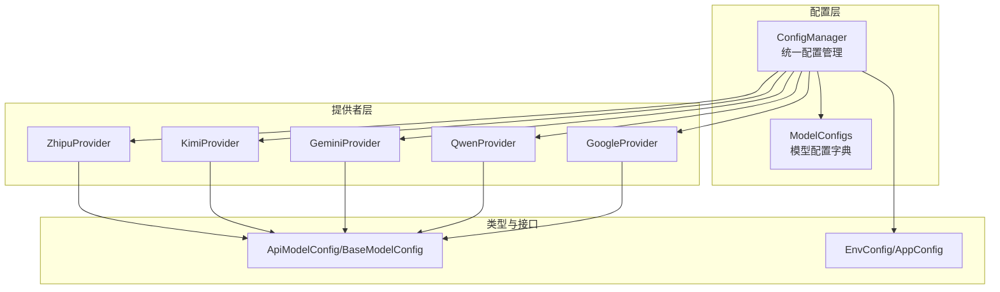
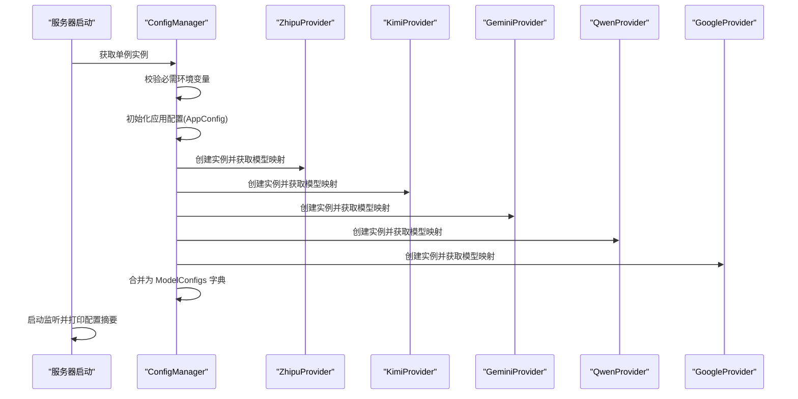
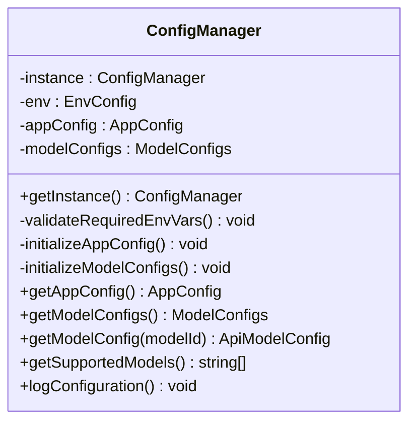
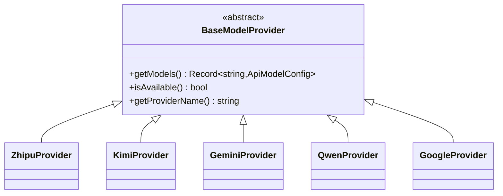
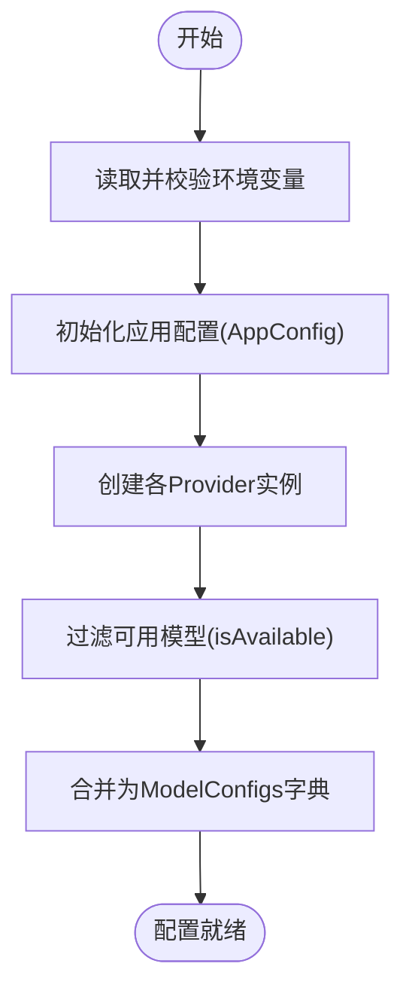
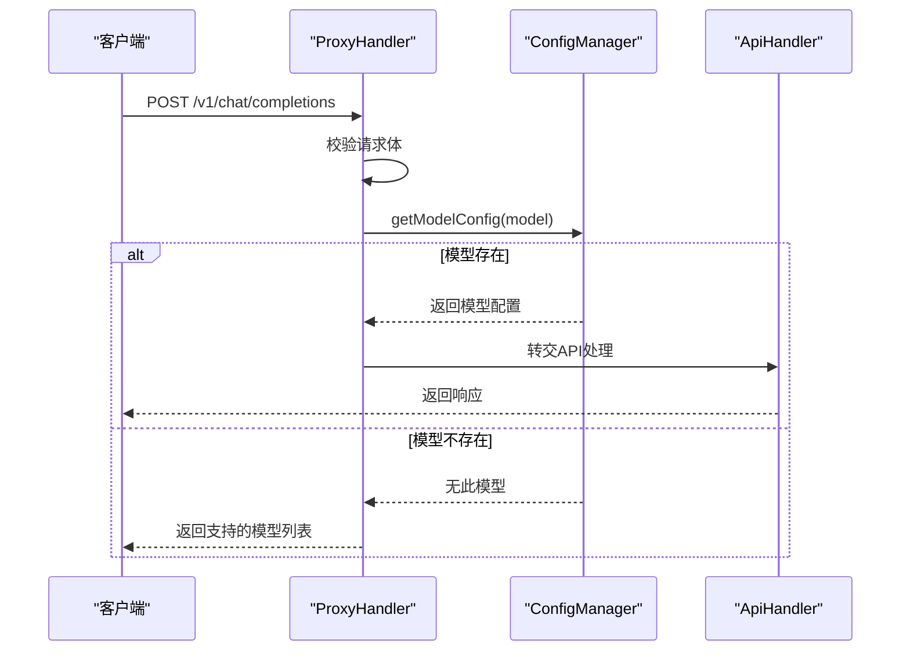
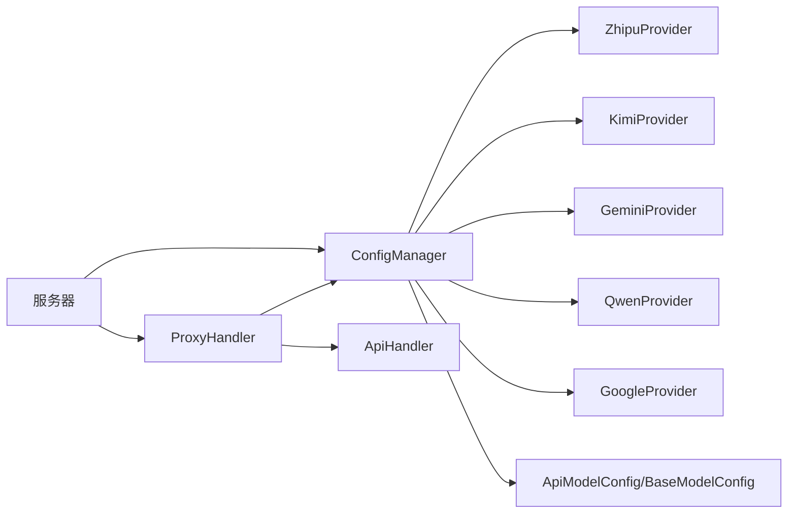

# 模型配置管理

<cite>
**本文档引用的文件**
- [src/config/config.ts](file://src/config/config.ts)
- [src/config/index.ts](file://src/config/index.ts)
- [src/config/models/base.ts](file://src/config/models/base.ts)
- [src/config/models/index.ts](file://src/config/models/index.ts)
- [src/config/models/zhipu.ts](file://src/config/models/zhipu.ts)
- [src/config/models/kimi.ts](file://src/config/models/kimi.ts)
- [src/config/models/gemini.ts](file://src/config/models/gemini.ts)
- [src/config/models/qwen.ts](file://src/config/models/qwen.ts)
- [src/config/models/google.ts](file://src/config/models/google.ts)
- [src/types/config.ts](file://src/types/config.ts)
- [src/types/api.ts](file://src/types/api.ts)
- [src/server.ts](file://src/server.ts)
- [src/handlers/proxy.ts](file://src/handlers/proxy.ts)
- [src/middlewares/common.ts](file://src/middlewares/common.ts)
- [package.json](file://package.json)
</cite>

## 目录
1. [简介](#简介)
2. [项目结构](#项目结构)
3. [核心组件](#核心组件)
4. [架构总览](#架构总览)
5. [详细组件分析](#详细组件分析)
6. [依赖关系分析](#依赖关系分析)
7. [性能考虑](#性能考虑)
8. [故障排查指南](#故障排查指南)
9. [结论](#结论)
10. [附录](#附录)

## 简介
本文件围绕模型配置管理展开，系统性阐述以下内容：
- 模型配置的组织结构与数据模型
- 通过 ConfigManager 统一管理多 AI 服务提供商（智谱、Kimi、Gemini、Qwen）的模型配置
- 模型 ID 的命名规则与配置项设计
- 模型提供者的注册与扩展机制
- 模型配置的初始化、加载与运行时可用性控制
- 配置验证、错误处理与性能优化最佳实践
- 调试与监控方法

## 项目结构
该模块采用“配置中心 + 提供者工厂”的分层设计：
- 配置中心：集中读取环境变量、构建应用配置与模型配置字典
- 提供者层：每个 AI 服务以 Provider 类封装，暴露统一接口并返回模型映射
- 类型系统：通过 TypeScript 定义模型配置与应用配置的结构
- 服务集成：在服务器启动时完成配置加载，并在路由中按需查询模型配置



图表来源
- [src/config/config.ts:1-123](file://src/config/config.ts#L1-L123)
- [src/config/models/base.ts:1-13](file://src/config/models/base.ts#L1-L13)
- [src/config/models/zhipu.ts:1-34](file://src/config/models/zhipu.ts#L1-L34)
- [src/config/models/kimi.ts:1-34](file://src/config/models/kimi.ts#L1-L34)
- [src/config/models/gemini.ts:1-34](file://src/config/models/gemini.ts#L1-L34)
- [src/config/models/qwen.ts:1-35](file://src/config/models/qwen.ts#L1-L35)
- [src/config/models/google.ts:1-34](file://src/config/models/google.ts#L1-L34)
- [src/types/config.ts:1-48](file://src/types/config.ts#L1-L48)

章节来源
- [src/config/config.ts:1-123](file://src/config/config.ts#L1-L123)
- [src/config/models/index.ts:1-5](file://src/config/models/index.ts#L1-L5)
- [src/types/config.ts:1-48](file://src/types/config.ts#L1-L48)

## 核心组件
- ConfigManager：单例配置管理器，负责环境变量校验、应用配置初始化、模型配置聚合与导出
- BaseModelProvider 及各具体 Provider：抽象提供者接口，统一返回模型映射；每个 Provider 封装特定服务的 API 地址与密钥
- 类型系统：ApiModelConfig、BaseModelConfig、ModelConfigs、AppConfig、EnvConfig 等，确保配置结构一致性和可维护性

章节来源
- [src/config/config.ts:7-123](file://src/config/config.ts#L7-L123)
- [src/config/models/base.ts:3-7](file://src/config/models/base.ts#L3-L7)
- [src/types/config.ts:3-48](file://src/types/config.ts#L3-L48)

## 架构总览
下图展示从服务器启动到请求处理的配置加载与使用流程：



图表来源
- [src/server.ts:13-83](file://src/server.ts#L13-L83)
- [src/config/config.ts:29-99](file://src/config/config.ts#L29-L99)

## 详细组件分析

### ConfigManager 组件分析
- 单例模式：getInstance 确保全局唯一配置实例
- 环境变量校验：要求至少配置一个 API 密钥，否则终止进程
- 应用配置初始化：从环境变量读取端口、主机、重试次数、重试延迟、请求超时、自定义系统提示等
- 模型配置初始化：依次创建各 Provider 实例，调用其 getModels 并合并到统一字典
- 查询接口：提供 getAppConfig、getModelConfigs、getModelConfig、getSupportedModels、logConfiguration 等



图表来源
- [src/config/config.ts:7-123](file://src/config/config.ts#L7-L123)

章节来源
- [src/config/config.ts:7-123](file://src/config/config.ts#L7-L123)

### 模型提供者注册与扩展机制
- 抽象基类：BaseModelProvider 定义统一接口（getModels、isAvailable、getProviderName）
- 具体提供者：ZhipuProvider、KimiProvider、GeminiProvider、QwenProvider、GoogleProvider 分别封装各自服务的模型映射
- 注册方式：在 ConfigManager.initializeModelConfigs 中逐一创建并合并模型映射
- 扩展建议：新增提供者时，实现 BaseModelProvider 接口并在 ConfigManager 中注册即可



图表来源
- [src/config/models/base.ts:3-7](file://src/config/models/base.ts#L3-L7)
- [src/config/models/zhipu.ts:4-34](file://src/config/models/zhipu.ts#L4-L34)
- [src/config/models/kimi.ts:4-34](file://src/config/models/kimi.ts#L4-L34)
- [src/config/models/gemini.ts:4-34](file://src/config/models/gemini.ts#L4-L34)
- [src/config/models/qwen.ts:4-35](file://src/config/models/qwen.ts#L4-L35)
- [src/config/models/google.ts:4-34](file://src/config/models/google.ts#L4-L34)

章节来源
- [src/config/models/base.ts:3-7](file://src/config/models/base.ts#L3-L7)
- [src/config/models/zhipu.ts:4-34](file://src/config/models/zhipu.ts#L4-L34)
- [src/config/models/kimi.ts:4-34](file://src/config/models/kimi.ts#L4-L34)
- [src/config/models/gemini.ts:4-34](file://src/config/models/gemini.ts#L4-L34)
- [src/config/models/qwen.ts:4-35](file://src/config/models/qwen.ts#L4-L35)
- [src/config/models/google.ts:4-34](file://src/config/models/google.ts#L4-L34)

### 模型配置数据结构与命名规则
- 数据结构
  - BaseModelConfig：type、name
  - ApiModelConfig：继承 BaseModelConfig，增加 apiUrl、apiKey、provider、model、maxTokens、temperature
  - ModelConfigs：以 modelId 为键的映射
  - AppConfig：应用级配置（端口、主机、重试、超时、自定义提示）
  - EnvConfig：环境变量键集合
- 命名规则
  - modelId 建议使用服务提供者缩写+模型标识的形式，例如 "glm-4.5"、"kimi-k2-0905-preview"、"gemini-2.5-pro"、"qwen-max"
  - provider 字段限定为受支持的服务枚举值
  - name 字段用于人类可读名称，便于日志与 UI 展示

```mermaid
erDiagram
BASE_MODEL_CONFIG {
string type
string name
}
API_MODEL_CONFIG {
string type
string name
string apiUrl
string apiKey
string provider
string model
number maxTokens
number temperature
}
MODEL_CONFIGS {
string modelId
}
APP_CONFIG {
number port
string host
number maxRetries
number retryDelay
number requestTimeout
string customSystemPrompt
}
ENV_CONFIG {
string ZHIPU_API_KEY
string ZHIPU_API_URL
string KIMI_API_KEY
string KIMI_API_URL
string GEMINI_API_KEY
string GEMINI_API_URL
string QWEN_API_KEY
string QWEN_API_URL
string CUSTOM_SYSTEM_PROMPT
string PORT
string HOST
string MAX_RETRIES
string RETRY_DELAY
string REQUEST_TIMEOUT
}
BASE_MODEL_CONFIG <|-- API_MODEL_CONFIG
MODEL_CONFIGS ||--o{ API_MODEL_CONFIG : "包含"
```

图表来源
- [src/types/config.ts:3-48](file://src/types/config.ts#L3-L48)

章节来源
- [src/types/config.ts:3-48](file://src/types/config.ts#L3-L48)

### 模型配置的动态加载与更新流程
- 加载时机：ConfigManager 在构造函数中一次性完成环境变量校验、应用配置与模型配置初始化
- 运行时可用性：Provider 的 isAvailable 基于 apiKey 与 enabled 标记判断；未满足条件的模型不会被加入最终字典
- 更新策略：当前实现为静态初始化；若需动态更新，可在 ConfigManager 中增加刷新逻辑（如重新读取环境变量、重建 Provider、合并新旧配置）



图表来源
- [src/config/config.ts:29-99](file://src/config/config.ts#L29-L99)
- [src/config/models/base.ts:12-14](file://src/config/models/base.ts#L12-L14)

章节来源
- [src/config/config.ts:29-99](file://src/config/config.ts#L29-L99)
- [src/config/models/base.ts:12-14](file://src/config/models/base.ts#L12-L14)

### 请求处理中的模型配置使用
- 模型校验：ProxyHandler 在处理请求前，先从 ConfigManager 查询 modelId 对应配置，不存在则返回支持的模型列表
- 路由集成：/v1/models 返回可用模型清单；/v1/chat/completions 等路由交由 ApiHandler 处理实际请求



图表来源
- [src/handlers/proxy.ts:9-37](file://src/handlers/proxy.ts#L9-L37)
- [src/config/config.ts:109-115](file://src/config/config.ts#L109-L115)

章节来源
- [src/handlers/proxy.ts:9-37](file://src/handlers/proxy.ts#L9-L37)
- [src/config/config.ts:109-115](file://src/config/config.ts#L109-L115)

## 依赖关系分析
- 内部依赖
  - ConfigManager 依赖各 Provider 与类型定义
  - ProxyHandler 依赖 ConfigManager 与 ApiHandler
  - 服务器启动时依赖 ConfigManager 完成配置加载
- 外部依赖
  - dotenv：读取 .env 文件
  - express：HTTP 服务框架
  - cors：跨域支持
  - axios：HTTP 请求（在 ApiHandler 中使用）



图表来源
- [src/config/config.ts:3-3](file://src/config/config.ts#L3-L3)
- [src/handlers/proxy.ts:3-4](file://src/handlers/proxy.ts#L3-L4)
- [src/server.ts:3-5](file://src/server.ts#L3-L5)
- [package.json:14-28](file://package.json#L14-L28)

章节来源
- [src/config/config.ts:3-3](file://src/config/config.ts#L3-L3)
- [src/handlers/proxy.ts:3-4](file://src/handlers/proxy.ts#L3-L4)
- [src/server.ts:3-5](file://src/server.ts#L3-L5)
- [package.json:14-28](file://package.json#L14-L28)

## 性能考虑
- 配置加载成本：ConfigManager 初始化为一次性操作，避免重复解析与网络请求
- 模型查询复杂度：ModelConfigs 为对象字典，查询为 O(1)，开销极低
- 重试与超时：通过 AppConfig 控制最大重试次数与延迟，建议根据服务端限流策略调整
- 日志与可观测性：启动时输出配置摘要，运行时通过中间件记录请求日志，便于定位问题

## 故障排查指南
- 环境变量缺失
  - 现象：启动即退出
  - 排查：确认至少配置一个 API 密钥（ZHIPU_API_KEY、KIMI_API_KEY、GEMINI_API_KEY、QWEN_API_KEY）
- 模型不可用
  - 现象：/v1/models 不显示或 /chat/completions 返回不支持的模型
  - 排查：检查对应 Provider 的 apiKey 是否有效，enabled 标记是否为 true
- 请求错误
  - 现象：代理层抛出错误
  - 排查：查看中间件错误处理输出，确认请求体结构与模型 ID 是否匹配
- 服务器错误
  - 现象：500 错误
  - 排查：检查 errorHandler 输出的日志，定位异常堆栈

章节来源
- [src/config/config.ts:29-51](file://src/config/config.ts#L29-L51)
- [src/handlers/proxy.ts:14-36](file://src/handlers/proxy.ts#L14-L36)
- [src/middlewares/common.ts:9-25](file://src/middlewares/common.ts#L9-L25)

## 结论
本项目通过 ConfigManager 将多服务模型配置统一管理，配合 Provider 抽象实现了良好的扩展性与可维护性。模型配置采用强类型定义，结合严格的环境变量校验与运行时可用性过滤，确保系统稳定运行。建议在生产环境中结合日志与监控完善可观测性，并在需要时引入动态配置刷新能力。

## 附录

### 模型 ID 命名规范与示例
- 命名建议：服务缩写 + 模型标识，如 "glm-4.5"、"kimi-k2-0905-preview"、"gemini-2.5-pro"、"qwen-max"
- provider 限定：zhipu、kimi、google、qwen
- name：人类可读名称，便于日志与 UI 展示

章节来源
- [src/config/models/zhipu.ts:24-31](file://src/config/models/zhipu.ts#L24-L31)
- [src/config/models/kimi.ts:24-31](file://src/config/models/kimi.ts#L24-L31)
- [src/config/models/gemini.ts:24-31](file://src/config/models/gemini.ts#L24-L31)
- [src/config/models/qwen.ts:24-31](file://src/config/models/qwen.ts#L24-L31)
- [src/config/models/google.ts:24-31](file://src/config/models/google.ts#L24-L31)

### 配置验证与错误处理清单
- 必需环境变量：至少一个 API 密钥
- 应用配置：端口、主机、重试、超时等数值化字段
- 模型可用性：Provider 的 isAvailable 判定
- 请求处理：模型存在性校验与错误返回

章节来源
- [src/config/config.ts:29-67](file://src/config/config.ts#L29-L67)
- [src/config/models/base.ts:12-14](file://src/config/models/base.ts#L12-L14)
- [src/handlers/proxy.ts:14-24](file://src/handlers/proxy.ts#L14-L24)