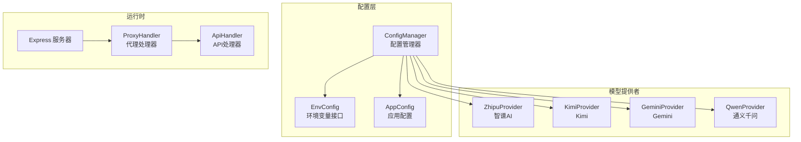
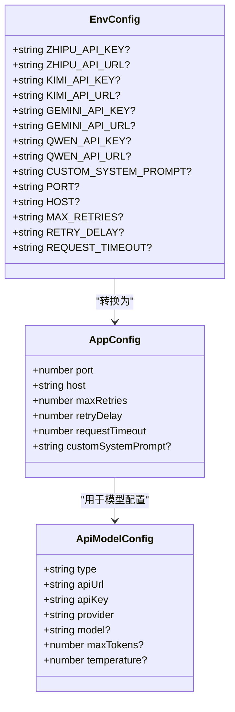
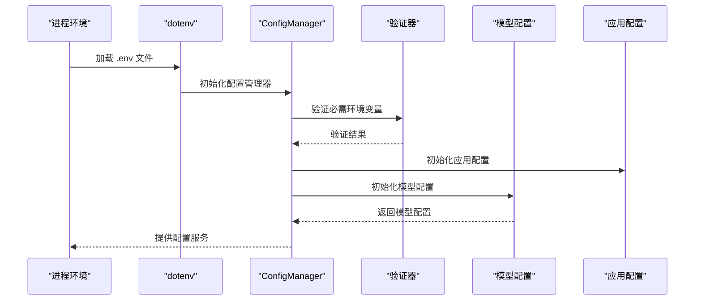
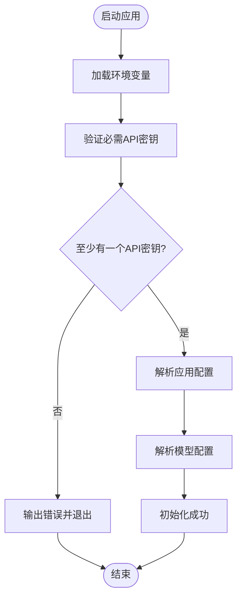
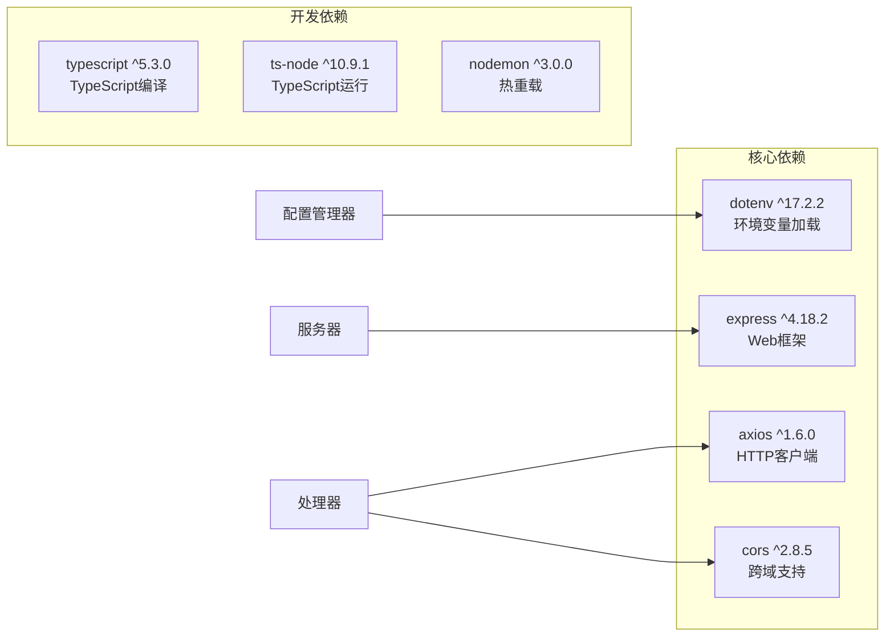
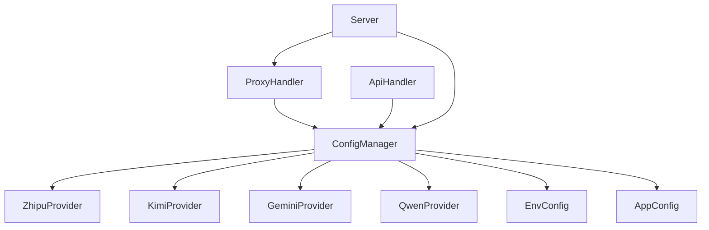
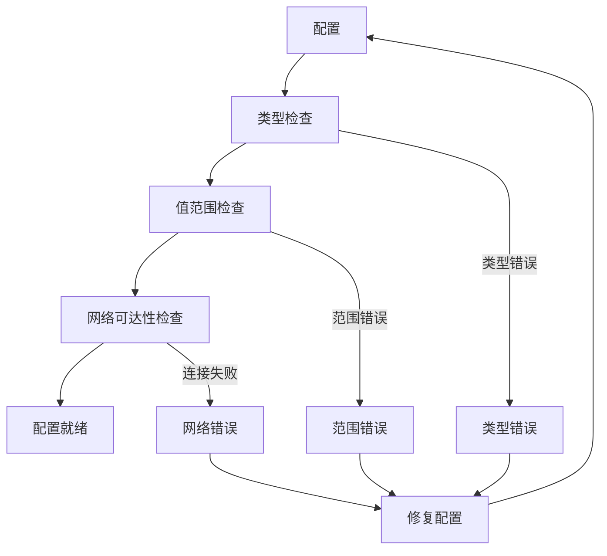

# 环境变量配置

<cite>
**本文档引用的文件**
- [src/config/config.ts](file://src/config/config.ts)
- [src/types/config.ts](file://src/types/config.ts)
- [src/config/models/zhipu.ts](file://src/config/models/zhipu.ts)
- [src/config/models/kimi.ts](file://src/config/models/kimi.ts)
- [src/config/models/gemini.ts](file://src/config/models/gemini.ts)
- [src/config/models/qwen.ts](file://src/config/models/qwen.ts)
- [src/config/models/google.ts](file://src/config/models/google.ts)
- [src/config/models/base.ts](file://src/config/models/base.ts)
- [src/handlers/api.ts](file://src/handlers/api.ts)
- [src/server.ts](file://src/server.ts)
- [package.json](file://package.json)
</cite>

## 目录
1. [简介](#简介)
2. [项目结构](#项目结构)
3. [核心组件](#核心组件)
4. [架构概览](#架构概览)
5. [详细组件分析](#详细组件分析)
6. [依赖关系分析](#依赖关系分析)
7. [性能考虑](#性能考虑)
8. [故障排除指南](#故障排除指南)
9. [结论](#结论)
10. [附录](#附录)

## 简介

本文件详细说明 xcode-ai-proxy 项目的环境变量配置系统。该系统支持多个 AI 模型提供商的 API 密钥配置，并提供了完整的应用配置参数。文档涵盖了所有支持的环境变量、数据类型、取值范围、默认值以及配置优先级和验证机制。

## 项目结构

该项目采用模块化架构设计，环境变量配置主要集中在以下关键组件中：



**图表来源**
- [src/config/config.ts:1-121](file://src/config/config.ts#L1-L121)
- [src/types/config.ts:1-48](file://src/types/config.ts#L1-L48)

**章节来源**
- [src/config/config.ts:1-121](file://src/config/config.ts#L1-L121)
- [src/types/config.ts:1-48](file://src/types/config.ts#L1-L48)

## 核心组件

### 环境变量配置接口

系统定义了完整的环境变量类型安全接口，确保配置的正确性和可维护性：



**图表来源**
- [src/types/config.ts:24-48](file://src/types/config.ts#L24-L48)

**章节来源**
- [src/types/config.ts:1-48](file://src/types/config.ts#L1-L48)

## 架构概览

系统采用单例模式的配置管理器来集中管理所有环境变量配置：



**图表来源**
- [src/config/config.ts:5-49](file://src/config/config.ts#L5-L49)

**章节来源**
- [src/config/config.ts:1-121](file://src/config/config.ts#L1-L121)

## 详细组件分析

### 必需 API 密钥配置

系统要求至少配置一个 API 密钥，支持以下四个主要提供商：

#### 智谱 AI (ZHIPU_API_KEY)

| 属性 | 类型 | 默认值 | 取值范围 | 描述 |
|------|------|--------|----------|------|
| ZHIPU_API_KEY | string | 必需 | 有效 API 密钥 | 智谱 AI 的认证密钥 |
| ZHIPU_API_URL | string | https://open.bigmodel.cn/api/paas/v4 | 有效的 HTTPS URL | 智谱 AI API 端点 |

#### Kimi (KIMI_API_KEY)

| 属性 | 类型 | 默认值 | 取值范围 | 描述 |
|------|------|--------|----------|------|
| KIMI_API_KEY | string | 必需 | 有效 API 密钥 | Moonshot AI 的认证密钥 |
| KIMI_API_URL | string | https://api.moonshot.cn/v1 | 有效的 HTTPS URL | Kimi API 端点 |

#### Gemini (GEMINI_API_KEY)

| 属性 | 类型 | 默认值 | 取值范围 | 描述 |
|------|------|--------|----------|------|
| GEMINI_API_KEY | string | 必需 | 有效 API 密钥 | Google Gemini 的认证密钥 |
| GEMINI_API_URL | string | https://generativelanguage.googleapis.com/v1beta | 有效的 HTTPS URL | Gemini API 端点 |

#### 通义千问 (QWEN_API_KEY)

| 属性 | 类型 | 默认值 | 取值范围 | 描述 |
|------|------|--------|----------|------|
| QWEN_API_KEY | string | 必需 | 有效 API 密钥 | 阿里云 DashScope 的认证密钥 |
| QWEN_API_URL | string | https://dashscope.aliyuncs.com/compatible-mode/v1 | 有效的 HTTPS URL | Qwen API 端点 |

**章节来源**
- [src/config/config.ts:27-49](file://src/config/config.ts#L27-L49)
- [src/config/models/zhipu.ts:20-33](file://src/config/models/zhipu.ts#L20-L33)
- [src/config/models/kimi.ts:20-33](file://src/config/models/kimi.ts#L20-L33)
- [src/config/models/gemini.ts:20-33](file://src/config/models/gemini.ts#L20-L33)
- [src/config/models/qwen.ts:20-33](file://src/config/models/qwen.ts#L20-L33)

### 应用配置参数

#### 基础网络配置

| 参数 | 类型 | 默认值 | 取值范围 | 描述 |
|------|------|--------|----------|------|
| PORT | number | 3000 | 1-65535 | 服务器监听端口 |
| HOST | string | 0.0.0.0 | 有效的 IP 地址或域名 | 服务器绑定地址 |

#### 重试机制配置

| 参数 | 类型 | 默认值 | 取值范围 | 描述 |
|------|------|--------|----------|------|
| MAX_RETRIES | number | 3 | 0-10 | 最大重试次数 |
| RETRY_DELAY | number | 1000 | 100-60000 | 初始重试延迟毫秒数 |

#### 超时配置

| 参数 | 类型 | 默认值 | 取值范围 | 描述 |
|------|------|--------|----------|------|
| REQUEST_TIMEOUT | number | 60000 | 5000-300000 | 请求超时毫秒数 |

#### 自定义系统提示

| 参数 | 类型 | 默认值 | 取值范围 | 描述 |
|------|------|--------|----------|------|
| CUSTOM_SYSTEM_PROMPT | string | undefined | 任意字符串 | 自定义系统提示内容 |

**章节来源**
- [src/config/config.ts:51-65](file://src/config/config.ts#L51-L65)
- [src/types/config.ts:24-31](file://src/types/config.ts#L24-L31)

### 配置验证机制

系统实现了多层次的配置验证：



**图表来源**
- [src/config/config.ts:27-49](file://src/config/config.ts#L27-L49)

**章节来源**
- [src/config/config.ts:27-49](file://src/config/config.ts#L27-L49)

## 依赖关系分析

### 外部依赖

系统依赖以下关键包来实现环境变量功能：



**图表来源**
- [package.json:14-28](file://package.json#L14-L28)

**章节来源**
- [package.json:1-30](file://package.json#L1-L30)

### 内部组件依赖



**图表来源**
- [src/config/config.ts:7-18](file://src/config/config.ts#L7-L18)
- [src/server.ts:3-16](file://src/server.ts#L3-L16)

**章节来源**
- [src/config/config.ts:1-121](file://src/config/config.ts#L1-L121)
- [src/server.ts:1-88](file://src/server.ts#L1-L88)

## 性能考虑

### 配置加载优化

1. **单例模式**: ConfigManager 使用单例模式避免重复初始化
2. **延迟加载**: 模型配置按需初始化
3. **类型安全**: 编译时类型检查减少运行时错误

### 运行时性能

1. **连接复用**: Kimi 提供者启用 HTTP/HTTPS 连接复用
2. **超时控制**: 统一的请求超时配置
3. **重试策略**: 指数退避重试机制

## 故障排除指南

### 常见配置问题

#### 1. API 密钥验证失败

**症状**: 应用启动时报错并退出
**原因**: 未配置任何 API 密钥
**解决方案**: 
- 配置至少一个 API 密钥
- 确保 API 密钥格式正确
- 验证网络连接正常

#### 2. 端口占用问题

**症状**: 服务器无法启动
**原因**: PORT 端口被占用
**解决方案**:
- 更改 PORT 环境变量
- 使用 `lsof -i :<port>` 查找占用进程
- 使用系统默认端口范围

#### 3. 网络连接超时

**症状**: API 请求频繁超时
**原因**: REQUEST_TIMEOUT 设置过小
**解决方案**:
- 增加 REQUEST_TIMEOUT 值
- 检查网络连接稳定性
- 考虑增加 MAX_RETRIES

### 配置验证工具

系统提供了以下内置验证功能：



**章节来源**
- [src/config/config.ts:27-49](file://src/config/config.ts#L27-L49)

## 结论

本环境变量配置系统提供了完整、类型安全且易于维护的配置管理方案。通过单例模式的 ConfigManager 和严格的验证机制，确保了系统的稳定性和可靠性。系统支持多个主流 AI 模型提供商，具有良好的扩展性。

## 附录

### 完整 .env 文件示例

```env
# 必需的 API 密钥配置
ZHIPU_API_KEY=your_zhipu_api_key_here
KIMI_API_KEY=your_kimi_api_key_here
GEMINI_API_KEY=your_gemini_api_key_here
QWEN_API_KEY=your_qwen_api_key_here

# 可选的 API 端点覆盖
ZHIPU_API_URL=https://open.bigmodel.cn/api/paas/v4
KIMI_API_URL=https://api.moonshot.cn/v1
GEMINI_API_URL=https://generativelanguage.googleapis.com/v1beta
QWEN_API_URL=https://dashscope.aliyuncs.com/compatible-mode/v1

# 应用配置
PORT=3000
HOST=0.0.0.0
MAX_RETRIES=3
RETRY_DELAY=1000
REQUEST_TIMEOUT=60000
CUSTOM_SYSTEM_PROMPT=你是一个专业的技术助手，请用中文回答问题
```

### 配置优先级说明

1. **环境变量优先级**: 运行时环境变量 > .env 文件 > 默认值
2. **配置加载顺序**: 
   - 首先加载 .env 文件
   - 然后读取系统环境变量
   - 最后应用默认值
3. **类型转换**: 数字类型的配置会自动进行字符串到数字的转换

### 最佳实践建议

1. **安全性**: 
   - 将 .env 文件添加到 .gitignore
   - 使用强密码和定期轮换
   - 限制 API 密钥权限范围

2. **性能优化**:
   - 根据网络状况调整 REQUEST_TIMEOUT
   - 合理设置 MAX_RETRIES 和 RETRY_DELAY
   - 监控服务器资源使用情况

3. **监控和日志**:
   - 启用详细的日志记录
   - 定期检查配置变更
   - 建立配置变更审批流程