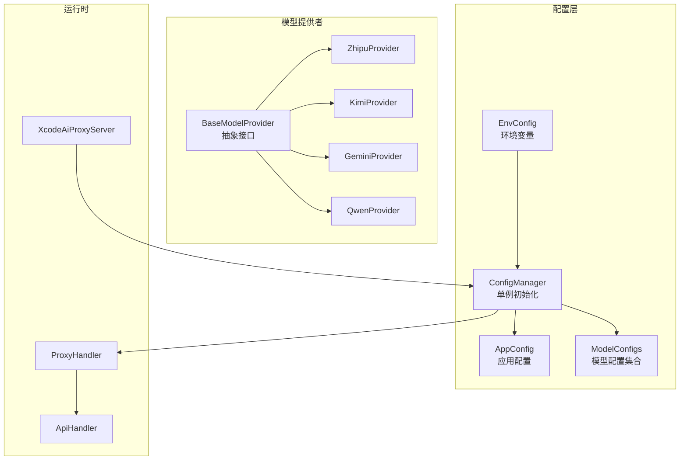
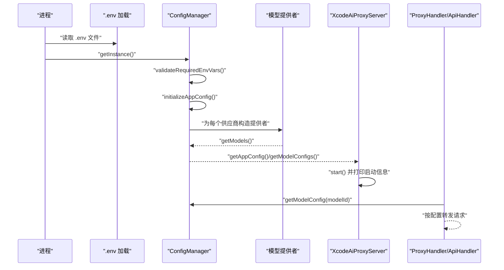
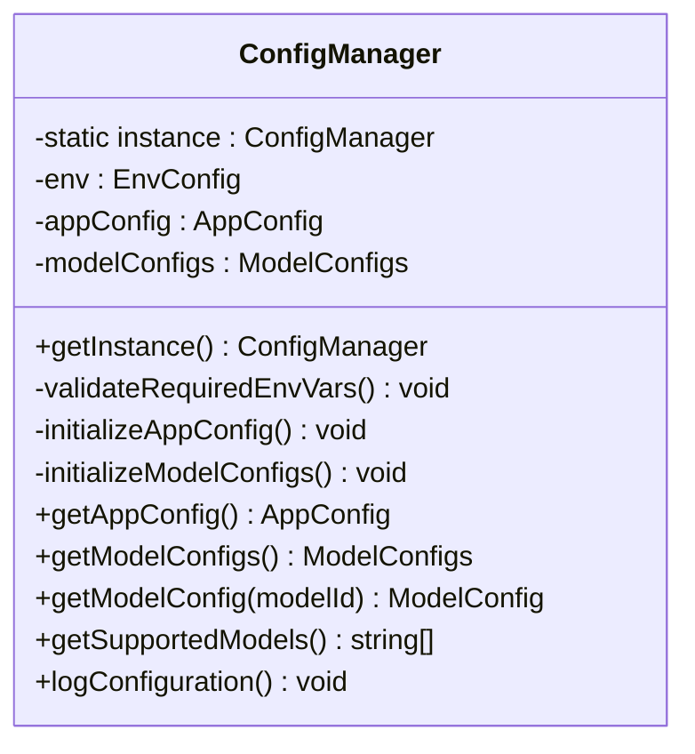
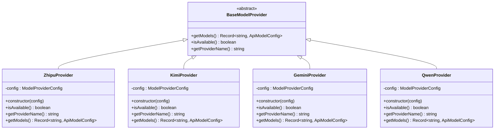
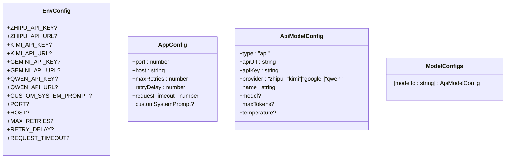
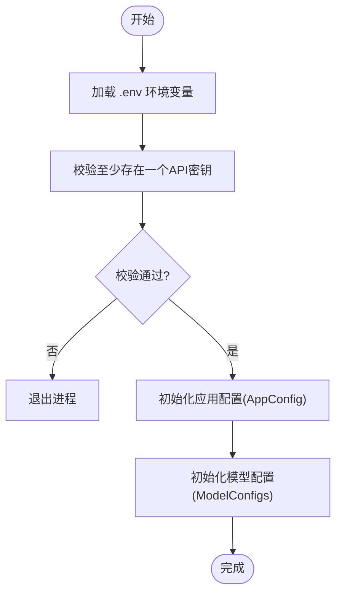
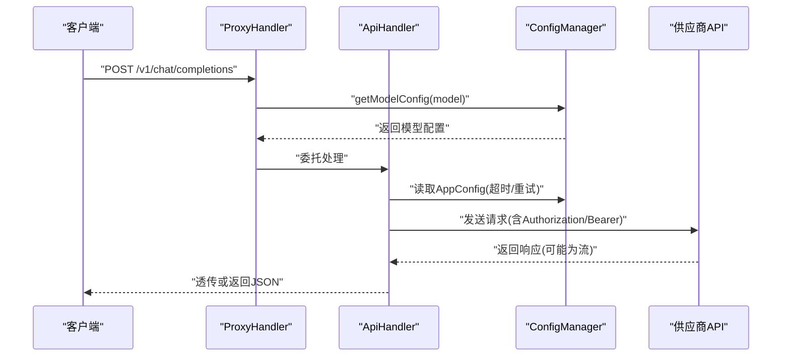
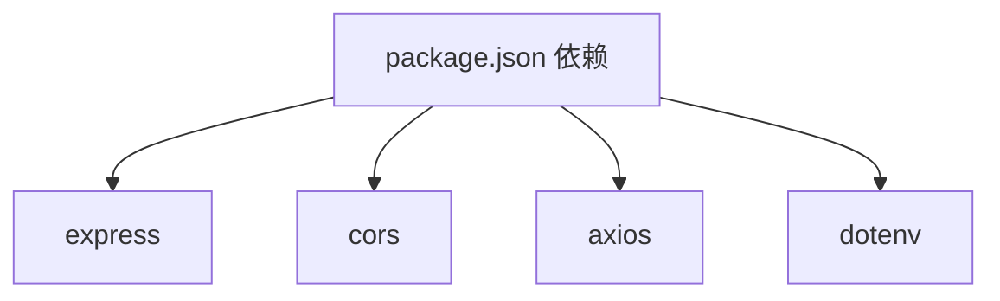

# 配置管理

<cite>
**本文档引用的文件**
- [src/config/config.ts](file://src/config/config.ts)
- [src/config/index.ts](file://src/config/index.ts)
- [src/config/models/base.ts](file://src/config/models/base.ts)
- [src/config/models/zhipu.ts](file://src/config/models/zhipu.ts)
- [src/config/models/kimi.ts](file://src/config/models/kimi.ts)
- [src/config/models/gemini.ts](file://src/config/models/gemini.ts)
- [src/config/models/qwen.ts](file://src/config/models/qwen.ts)
- [src/config/models/index.ts](file://src/config/models/index.ts)
- [src/types/config.ts](file://src/types/config.ts)
- [src/types/api.ts](file://src/types/api.ts)
- [src/utils/retry.ts](file://src/utils/retry.ts)
- [src/server.ts](file://src/server.ts)
- [src/handlers/api.ts](file://src/handlers/api.ts)
- [src/handlers/proxy.ts](file://src/handlers/proxy.ts)
- [src/middlewares/common.ts](file://src/middlewares/common.ts)
- [package.json](file://package.json)
</cite>

## 目录
1. [简介](#简介)
2. [项目结构](#项目结构)
3. [核心组件](#核心组件)
4. [架构总览](#架构总览)
5. [详细组件分析](#详细组件分析)
6. [依赖关系分析](#依赖关系分析)
7. [性能考量](#性能考量)
8. [故障排查指南](#故障排查指南)
9. [结论](#结论)
10. [附录](#附录)

## 简介
本文件系统性阐述 xcode-ai-proxy 的配置管理系统，重点覆盖以下方面：
- 环境变量配置机制与加载顺序
- 应用配置项与默认值
- 模型配置管理与提供者抽象
- ConfigManager 单例模式的实现、加载、校验与查询流程
- 可用配置项清单、优先级与覆盖规则
- 配置变更影响分析与热重载建议
- 面向不同使用场景的配置模板与最佳实践

## 项目结构
配置相关代码主要位于 src/config 与 src/types 下，并在运行时由服务器入口加载。核心职责划分如下：
- 配置加载与单例：ConfigManager 负责从环境变量初始化应用配置与模型配置
- 类型定义：统一约束应用配置、模型配置与环境变量结构
- 模型提供者：按供应商抽象模型映射，支持启用/禁用与默认参数
- 运行时使用：服务器启动时读取配置，处理器在请求处理中按需查询模型配置

图表来源
- [src/config/config.ts:7-121](file://src/config/config.ts#L7-L121)
- [src/config/models/base.ts:3-7](file://src/config/models/base.ts#L3-L7)
- [src/config/models/zhipu.ts:4-34](file://src/config/models/zhipu.ts#L4-L34)
- [src/config/models/kimi.ts:4-34](file://src/config/models/kimi.ts#L4-L34)
- [src/config/models/gemini.ts:4-34](file://src/config/models/gemini.ts#L4-L34)
- [src/config/models/qwen.ts:4-35](file://src/config/models/qwen.ts#L4-L35)
- [src/server.ts:8-88](file://src/server.ts#L8-L88)
- [src/handlers/proxy.ts:6-37](file://src/handlers/proxy.ts#L6-L37)
- [src/handlers/api.ts:8-28](file://src/handlers/api.ts#L8-L28)

章节来源
- [src/config/config.ts:1-121](file://src/config/config.ts#L1-L121)
- [src/types/config.ts:1-48](file://src/types/config.ts#L1-L48)
- [src/config/models/index.ts:1-5](file://src/config/models/index.ts#L1-L5)
- [src/server.ts:1-88](file://src/server.ts#L1-L88)

## 核心组件
- ConfigManager 单例：负责加载与校验环境变量、初始化应用配置与模型配置、提供查询接口
- 模型提供者抽象：BaseModelProvider 定义统一接口；各供应商实现 getModels、isAvailable、getProviderName
- 应用配置与模型配置类型：通过 TypeScript 类型约束配置结构与字段
- 运行时使用：服务器启动时读取配置并打印启动信息；处理器在请求处理中按模型 ID 查询配置

章节来源
- [src/config/config.ts:7-121](file://src/config/config.ts#L7-L121)
- [src/config/models/base.ts:3-7](file://src/config/models/base.ts#L3-L7)
- [src/types/config.ts:24-48](file://src/types/config.ts#L24-L48)
- [src/server.ts:46-83](file://src/server.ts#L46-L83)

## 架构总览
下图展示配置加载到请求处理的关键流程：

图表来源
- [src/config/config.ts:5-97](file://src/config/config.ts#L5-L97)
- [src/config/models/zhipu.ts:20-33](file://src/config/models/zhipu.ts#L20-L33)
- [src/config/models/kimi.ts:20-33](file://src/config/models/kimi.ts#L20-L33)
- [src/config/models/gemini.ts:20-33](file://src/config/models/gemini.ts#L20-L33)
- [src/config/models/qwen.ts:20-33](file://src/config/models/qwen.ts#L20-L33)
- [src/server.ts:46-83](file://src/server.ts#L46-L83)
- [src/handlers/proxy.ts:9-37](file://src/handlers/proxy.ts#L9-L37)
- [src/handlers/api.ts:16-28](file://src/handlers/api.ts#L16-L28)

## 详细组件分析

### ConfigManager 单例与配置加载
- 单例实现：私有静态实例与公共 getInstance 方法确保全局唯一
- 初始化流程：
  - 读取环境变量并进行必需 API 密钥校验
  - 初始化应用配置（端口、主机、最大重试、重试延迟、请求超时、自定义系统提示）
  - 初始化模型配置：为每个供应商构造提供者并合并其模型映射
- 查询接口：
  - getAppConfig/getModelConfigs/getModelConfig/getSupportedModels/logConfiguration

图表来源
- [src/config/config.ts:7-121](file://src/config/config.ts#L7-L121)

章节来源
- [src/config/config.ts:7-121](file://src/config/config.ts#L7-L121)

### 模型提供者抽象与实现
- 抽象接口 BaseModelProvider：定义 getModels、isAvailable、getProviderName
- 各供应商实现：
  - ZhipuProvider：返回模型 ID 与名称、默认 API 地址、提供商标识
  - KimiProvider：返回模型 ID 与名称、默认 API 地址、提供商标识
  - GeminiProvider：返回模型 ID 与名称、默认 API 地址、提供商标识
  - QwenProvider：返回模型 ID 与名称、默认 API 地址、提供商标识
- 可用性判断：基于 apiKey 是否存在且未显式禁用

图表来源
- [src/config/models/base.ts:3-7](file://src/config/models/base.ts#L3-L7)
- [src/config/models/zhipu.ts:4-34](file://src/config/models/zhipu.ts#L4-L34)
- [src/config/models/kimi.ts:4-34](file://src/config/models/kimi.ts#L4-L34)
- [src/config/models/gemini.ts:4-34](file://src/config/models/gemini.ts#L4-L34)
- [src/config/models/qwen.ts:4-35](file://src/config/models/qwen.ts#L4-L35)

章节来源
- [src/config/models/base.ts:1-13](file://src/config/models/base.ts#L1-L13)
- [src/config/models/zhipu.ts:1-34](file://src/config/models/zhipu.ts#L1-L34)
- [src/config/models/kimi.ts:1-34](file://src/config/models/kimi.ts#L1-L34)
- [src/config/models/gemini.ts:1-34](file://src/config/models/gemini.ts#L1-L34)
- [src/config/models/qwen.ts:1-35](file://src/config/models/qwen.ts#L1-L35)

### 应用配置与模型配置类型
- 应用配置（AppConfig）：端口、主机、最大重试、重试延迟、请求超时、可选自定义系统提示
- 模型配置（ApiModelConfig）：类型、名称、API 地址、API 密钥、提供商、可选模型名、可选参数（如 maxTokens、temperature）
- 环境变量（EnvConfig）：各供应商 API 密钥与可选自定义系统提示、服务器参数、重试与超时配置

图表来源
- [src/types/config.ts:24-48](file://src/types/config.ts#L24-L48)

章节来源
- [src/types/config.ts:1-48](file://src/types/config.ts#L1-L48)

### 配置加载与校验流程
- 环境变量加载：通过 dotenv 在模块初始化阶段读取 .env
- 必需校验：至少存在一个供应商的 API 密钥，否则终止进程
- 应用配置初始化：从环境变量解析数值与字符串，设置默认值
- 模型配置初始化：遍历供应商提供者，调用 getModels 合并到统一字典

图表来源
- [src/config/config.ts:5-97](file://src/config/config.ts#L5-L97)

章节来源
- [src/config/config.ts:27-97](file://src/config/config.ts#L27-L97)

### 请求处理中的配置使用
- 代理处理器根据请求体中的 model 字段查询模型配置
- API 处理器按配置构造请求头（统一 Bearer 认证）、超时、响应类型（流式/JSON），并执行带退避的重试
- 流式响应时透传底层供应商的流输出，非流式则直接返回 JSON

图表来源
- [src/handlers/proxy.ts:9-37](file://src/handlers/proxy.ts#L9-L37)
- [src/handlers/api.ts:30-195](file://src/handlers/api.ts#L30-L195)
- [src/config/config.ts:99-113](file://src/config/config.ts#L99-L113)

章节来源
- [src/handlers/proxy.ts:1-66](file://src/handlers/proxy.ts#L1-L66)
- [src/handlers/api.ts:1-196](file://src/handlers/api.ts#L1-L196)
- [src/config/config.ts:99-113](file://src/config/config.ts#L99-L113)

## 依赖关系分析
- 运行时依赖：Express、CORS、Axios、dotenv
- 内部依赖：ConfigManager 作为全局配置中心，被服务器与处理器使用；模型提供者被 ConfigManager 初始化时装配

图表来源
- [package.json:14-28](file://package.json#L14-L28)

章节来源
- [package.json:1-30](file://package.json#L1-L30)

## 性能考量
- 重试策略：withRetry 提供递增延迟的重试，最大重试次数与基础延迟来自应用配置
- 超时控制：请求超时来自应用配置，避免长时间阻塞
- 流式响应：当上游供应商返回流时，直接透传，减少内存占用
- 日志与可观测性：启动时打印关键配置，请求过程中记录关键事件，便于定位问题

章节来源
- [src/utils/retry.ts:1-34](file://src/utils/retry.ts#L1-L34)
- [src/handlers/api.ts:35-121](file://src/handlers/api.ts#L35-L121)
- [src/server.ts:54-83](file://src/server.ts#L54-L83)

## 故障排查指南
- 启动失败：若未配置任何供应商 API 密钥，程序会记录错误并退出
- 模型不可用：确认对应供应商的 API 密钥已配置且提供者处于可用状态
- 请求失败：检查应用配置中的重试次数与延迟、请求超时；查看处理器对 4xx/5xx 响应的处理与日志
- 流式错误：处理器会尝试读取流式错误内容并记录，便于定位上游错误

章节来源
- [src/config/config.ts:44-48](file://src/config/config.ts#L44-L48)
- [src/handlers/api.ts:124-164](file://src/handlers/api.ts#L124-L164)
- [src/middlewares/common.ts:9-25](file://src/middlewares/common.ts#L9-L25)

## 结论
本配置系统通过 ConfigManager 单例集中管理应用与模型配置，结合 dotenv 的环境变量加载与模型提供者抽象，实现了灵活、可扩展的配置体系。应用配置与模型配置均以类型约束保障一致性，运行时通过处理器按需查询并执行带退避的请求转发。

## 附录

### 可用配置项与默认值
- 应用配置（AppConfig）
  - 端口：默认 3000
  - 主机：默认 0.0.0.0
  - 最大重试：默认 3
  - 重试延迟：默认 1000ms（递增）
  - 请求超时：默认 60000ms
  - 自定义系统提示：可选
- 模型配置（ApiModelConfig）
  - 类型：固定为 api
  - 提供商：zhipu、kimi、google、qwen
  - 名称：各供应商模型名称
  - API 地址：各供应商默认地址（可覆盖）
  - API 密钥：必填
  - 模型名：可选（若与请求体不一致，将被覆盖）
  - 其他参数：maxTokens、temperature 等（可选）

章节来源
- [src/types/config.ts:24-48](file://src/types/config.ts#L24-L48)
- [src/config/config.ts:51-97](file://src/config/config.ts#L51-L97)
- [src/config/models/zhipu.ts:20-33](file://src/config/models/zhipu.ts#L20-L33)
- [src/config/models/kimi.ts:20-33](file://src/config/models/kimi.ts#L20-L33)
- [src/config/models/gemini.ts:20-33](file://src/config/models/gemini.ts#L20-L33)
- [src/config/models/qwen.ts:20-33](file://src/config/models/qwen.ts#L20-L33)

### 配置优先级与覆盖规则
- 环境变量优先：所有配置来源于 process.env，ConfigManager 在初始化时读取并解析
- 模型覆盖：当请求体中的 model 与模型配置不一致时，API 处理器会使用模型配置中的 model 字段
- 自定义系统提示：在首个系统消息后注入中文交流指令与用户自定义提示（若配置）
- 供应商默认地址：若未配置 API 地址，则使用各供应商默认地址

章节来源
- [src/config/config.ts:51-97](file://src/config/config.ts#L51-L97)
- [src/handlers/api.ts:58-100](file://src/handlers/api.ts#L58-L100)

### 配置变更的影响分析
- 应用配置变更：端口/主机影响监听地址；重试与超时影响请求稳定性与耗时；自定义系统提示影响对话行为
- 模型配置变更：API 地址与密钥直接影响上游请求；模型名覆盖影响实际调用模型
- 热重载建议：当前实现为一次性加载，重启服务以应用新配置；可在生产环境中通过进程管理器（如 PM2）实现平滑重启

章节来源
- [src/server.ts:46-52](file://src/server.ts#L46-L52)
- [src/config/config.ts:13-18](file://src/config/config.ts#L13-L18)

### 使用场景与配置模板
- 本地开发
  - 端口：3000
  - 主机：127.0.0.1 或 0.0.0.0
  - 重试：3 次
  - 超时：60000ms
  - 自定义系统提示：可选
- 多供应商混合
  - 同时配置多个供应商的 API 密钥，系统将合并其模型映射
- 流式响应
  - 在请求体中开启 stream，处理器将透传上游流式响应

章节来源
- [src/server.ts:46-83](file://src/server.ts#L46-L83)
- [src/handlers/api.ts:176-194](file://src/handlers/api.ts#L176-L194)