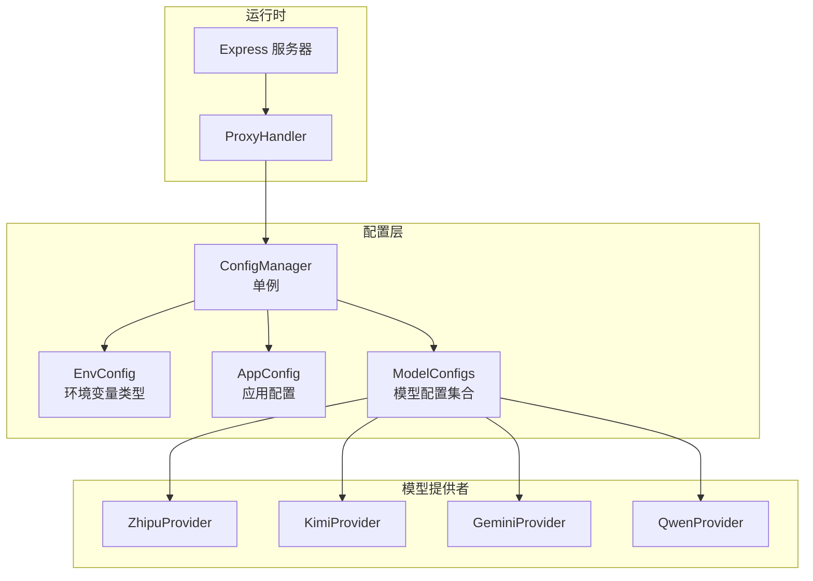
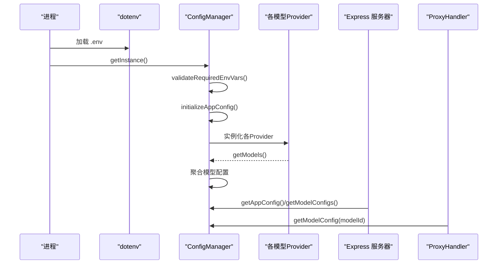
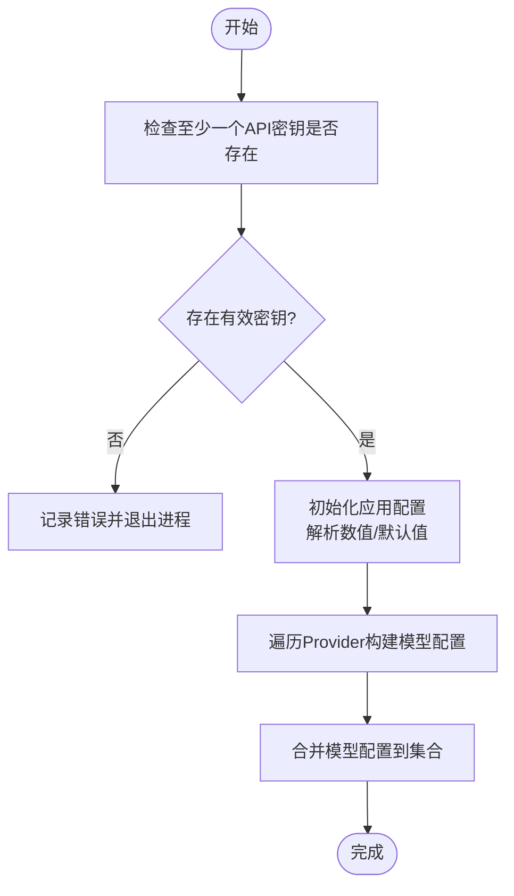
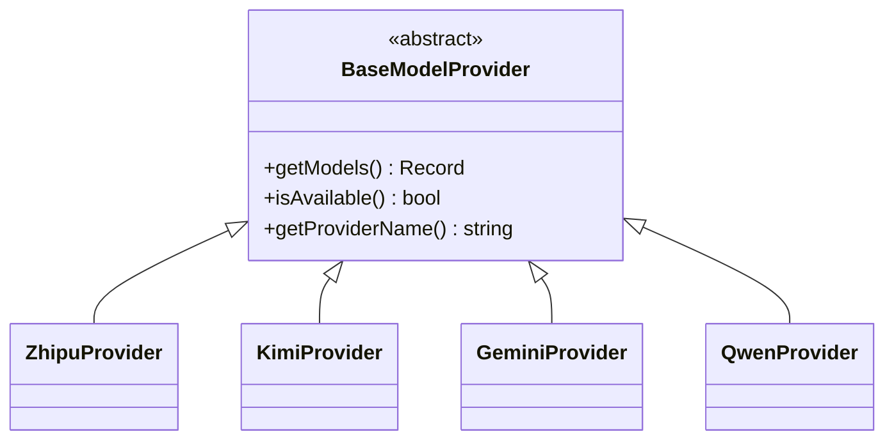
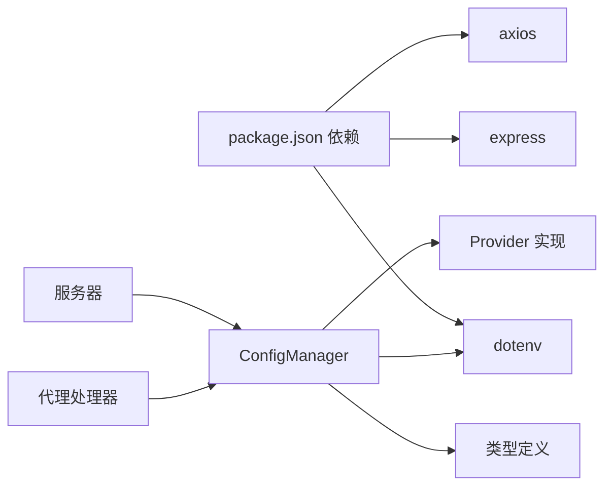

# 配置验证与错误处理

<cite>
**本文档引用的文件**
- [src/config/config.ts](file://src/config/config.ts)
- [src/config/index.ts](file://src/config/index.ts)
- [src/types/config.ts](file://src/types/config.ts)
- [src/config/models/base.ts](file://src/config/models/base.ts)
- [src/config/models/gemini.ts](file://src/config/models/gemini.ts)
- [src/config/models/google.ts](file://src/config/models/google.ts)
- [src/config/models/kimi.ts](file://src/config/models/kimi.ts)
- [src/config/models/qwen.ts](file://src/config/models/qwen.ts)
- [src/config/models/zhipu.ts](file://src/config/models/zhipu.ts)
- [src/server.ts](file://src/server.ts)
- [src/handlers/proxy.ts](file://src/handlers/proxy.ts)
- [src/middlewares/common.ts](file://src/middlewares/common.ts)
- [src/utils/retry.ts](file://src/utils/retry.ts)
- [package.json](file://package.json)
</cite>

## 目录
1. [简介](#简介)
2. [项目结构](#项目结构)
3. [核心组件](#核心组件)
4. [架构总览](#架构总览)
5. [详细组件分析](#详细组件分析)
6. [依赖关系分析](#依赖关系分析)
7. [性能考量](#性能考量)
8. [故障排查指南](#故障排查指南)
9. [结论](#结论)
10. [附录](#附录)

## 简介
本文件聚焦于配置验证与错误处理，围绕 ConfigManager 的配置加载、校验与容错机制展开，涵盖以下主题：
- 必需环境变量的检查策略
- 配置值有效性与可用性验证
- 配置冲突检测与处理
- 配置错误类型与对应处理策略
- 配置加载失败时的回退与容错
- 诊断方法、最佳实践与常见陷阱

## 项目结构
该模块采用“单例 + Provider 架构”组织配置加载与模型注册，核心流程为：初始化 ConfigManager → 校验必需环境变量 → 初始化应用配置 → 初始化各模型 Provider → 聚合模型配置对外提供查询。

图表来源
- [src/config/config.ts:7-20](file://src/config/config.ts#L7-L20)
- [src/config/models/zhipu.ts:4-34](file://src/config/models/zhipu.ts#L4-L34)
- [src/config/models/kimi.ts:4-34](file://src/config/models/kimi.ts#L4-L34)
- [src/config/models/gemini.ts:4-34](file://src/config/models/gemini.ts#L4-L34)
- [src/config/models/qwen.ts:4-35](file://src/config/models/qwen.ts#L4-L35)
- [src/server.ts:8-21](file://src/server.ts#L8-L21)

章节来源
- [src/config/config.ts:1-123](file://src/config/config.ts#L1-L123)
- [src/config/index.ts:1-1](file://src/config/index.ts#L1-L1)
- [src/types/config.ts:1-48](file://src/types/config.ts#L1-L48)
- [src/config/models/base.ts:1-13](file://src/config/models/base.ts#L1-L13)
- [src/config/models/gemini.ts:1-34](file://src/config/models/gemini.ts#L1-L34)
- [src/config/models/google.ts:1-34](file://src/config/models/google.ts#L1-L34)
- [src/config/models/kimi.ts:1-34](file://src/config/models/kimi.ts#L1-L34)
- [src/config/models/qwen.ts:1-35](file://src/config/models/qwen.ts#L1-L35)
- [src/config/models/zhipu.ts:1-34](file://src/config/models/zhipu.ts#L1-L34)
- [src/server.ts:1-88](file://src/server.ts#L1-L88)

## 核心组件
- ConfigManager：负责加载与校验环境变量、初始化应用配置与模型配置，并提供查询接口。
- 模型 Provider：基于统一抽象类，按各自提供商生成可用模型配置；通过 isAvailable 控制是否纳入配置集合。
- 应用配置与环境变量类型：约束端口、主机、重试、超时等参数与环境变量键名。
- 运行时集成：服务器启动时读取配置并打印启动信息；代理处理器在路由层按模型 ID 查询配置。

章节来源
- [src/config/config.ts:7-27](file://src/config/config.ts#L7-L27)
- [src/config/models/base.ts:3-7](file://src/config/models/base.ts#L3-L7)
- [src/types/config.ts:24-48](file://src/types/config.ts#L24-L48)
- [src/server.ts:46-83](file://src/server.ts#L46-L83)
- [src/handlers/proxy.ts:9-37](file://src/handlers/proxy.ts#L9-L37)

## 架构总览
下图展示配置加载与使用的关键调用序列：

图表来源
- [src/config/config.ts:1-20](file://src/config/config.ts#L1-L20)
- [src/config/config.ts:69-99](file://src/config/config.ts#L69-L99)
- [src/server.ts:46-52](file://src/server.ts#L46-L52)
- [src/handlers/proxy.ts:14-24](file://src/handlers/proxy.ts#L14-L24)

## 详细组件分析

### ConfigManager 配置验证机制
- 必需环境变量检查
  - 目标：确保至少存在一个有效 API 密钥（支持的提供商包括智谱、Kimi、Gemini、通义）。
  - 行为：若无任一密钥，输出错误日志并终止进程。
  - 关注点：当前实现对密钥存在性进行布尔检查，未进一步校验密钥格式或有效期。
- 应用配置初始化
  - 将字符串型环境变量解析为数值（端口、最大重试次数、重试延迟、请求超时），并设置默认值。
  - 自定义系统提示存在时记录日志。
- 模型配置初始化
  - 为每个提供商创建 Provider 实例，调用其 getModels() 并合并到统一集合。
  - Provider 的 isAvailable() 决定是否加入配置集合（当 apiKey 存在且 enabled 非 false 时可用）。

图表来源
- [src/config/config.ts:29-51](file://src/config/config.ts#L29-L51)
- [src/config/config.ts:53-67](file://src/config/config.ts#L53-L67)
- [src/config/config.ts:69-99](file://src/config/config.ts#L69-L99)

章节来源
- [src/config/config.ts:29-99](file://src/config/config.ts#L29-L99)
- [src/types/config.ts:33-48](file://src/types/config.ts#L33-L48)

### 模型 Provider 可用性与配置聚合
- Provider 抽象
  - BaseModelProvider 定义 getModels()、isAvailable()、getProviderName()。
- Provider 实现要点
  - isAvailable() 基于 apiKey 是否存在以及 enabled 是否非 false。
  - getModels() 在可用时返回具体模型配置，否则返回空对象。
  - ConfigManager 通过 Object.assign 将各 Provider 的结果合并到统一集合。
- 冲突检测
  - 当多个 Provider 提供相同 modelId 时，后加入的会覆盖先前的同名项；当前未显式检测重复键冲突。
  - 若某 Provider 不可用，则不会产生对应模型条目，从而避免“不可用配置污染”。

图表来源
- [src/config/models/base.ts:3-7](file://src/config/models/base.ts#L3-L7)
- [src/config/models/zhipu.ts:4-34](file://src/config/models/zhipu.ts#L4-L34)
- [src/config/models/kimi.ts:4-34](file://src/config/models/kimi.ts#L4-L34)
- [src/config/models/gemini.ts:4-34](file://src/config/models/gemini.ts#L4-L34)
- [src/config/models/qwen.ts:4-35](file://src/config/models/qwen.ts#L4-L35)

章节来源
- [src/config/models/base.ts:1-13](file://src/config/models/base.ts#L1-L13)
- [src/config/models/zhipu.ts:12-33](file://src/config/models/zhipu.ts#L12-L33)
- [src/config/models/kimi.ts:12-33](file://src/config/models/kimi.ts#L12-L33)
- [src/config/models/gemini.ts:12-33](file://src/config/models/gemini.ts#L12-L33)
- [src/config/models/qwen.ts:12-34](file://src/config/models/qwen.ts#L12-L34)
- [src/config/config.ts:69-99](file://src/config/config.ts#L69-L99)

### 配置错误类型与处理策略
- 缺少必需 API 密钥
  - 触发条件：至少一个提供商的 apiKey 不存在。
  - 处理策略：立即记录错误并终止进程，避免后续流程因缺配置而产生难以定位的异常。
  - 建议：在 CI/CD 中强制注入密钥，或在本地提供 .env 示例文件。
- 数值型配置解析失败
  - 触发条件：PORT/MAX_RETRIES/RETRY_DELAY/REQUEST_TIMEOUT 为非数值字符串。
  - 处理策略：parseInt 将返回 NaN，可能导致运行时行为异常。
  - 建议：增加显式的 NaN/范围校验与兜底逻辑。
- Provider 不可用导致模型缺失
  - 触发条件：apiKey 为空或 enabled 为 false。
  - 处理策略：该 Provider 不会向集合中添加模型；路由层在找不到模型时返回 400。
  - 建议：在日志中标注哪些 Provider 被忽略及其原因。
- 模型 ID 冲突
  - 触发条件：不同 Provider 返回相同 modelId。
  - 处理策略：后加入的覆盖先加入的；当前未检测冲突。
  - 建议：在聚合阶段进行冲突检测并报错或命名空间化。

章节来源
- [src/config/config.ts:29-51](file://src/config/config.ts#L29-L51)
- [src/config/config.ts:53-67](file://src/config/config.ts#L53-L67)
- [src/config/config.ts:69-99](file://src/config/config.ts#L69-L99)
- [src/handlers/proxy.ts:14-24](file://src/handlers/proxy.ts#L14-L24)

### 配置加载失败的回退与容错
- 进程级回退
  - ConfigManager 在缺少必需密钥时直接退出，属于“快速失败”，避免静默错误。
- 运行时容错
  - 服务器启动后，若某些 Provider 不可用，仅影响对应模型的可用性，不影响其他模型。
  - 路由层在请求模型不存在时返回明确的 400 错误与支持列表。
- 重试与超时
  - 应用配置提供重试次数与延迟参数；实际网络调用可结合通用重试工具进行增强。

章节来源
- [src/config/config.ts:46-50](file://src/config/config.ts#L46-L50)
- [src/config/config.ts:53-67](file://src/config/config.ts#L53-L67)
- [src/handlers/proxy.ts:14-24](file://src/handlers/proxy.ts#L14-L24)
- [src/utils/retry.ts:1-34](file://src/utils/retry.ts#L1-L34)

### 诊断方法与解决方案
- 诊断步骤
  - 检查 .env 文件是否正确加载（dotenv 已在模块顶部调用）。
  - 使用 ConfigManager 的日志输出能力确认已加载模型清单。
  - 启动服务器后观察控制台输出的模型列表与重试配置。
  - 对照错误码与错误消息，定位是配置缺失还是网络/权限问题。
- 解决方案
  - 缺少密钥：补齐对应 PROVIDER_API_KEY。
  - 数值解析异常：确保相关环境变量为合法数字字符串。
  - 模型不可用：检查对应 Provider 的 enabled 字段与 apiKey。
  - 模型不存在：确认请求的 modelId 是否在支持列表中。

章节来源
- [src/config/config.ts:117-122](file://src/config/config.ts#L117-L122)
- [src/server.ts:54-83](file://src/server.ts#L54-L83)
- [src/handlers/proxy.ts:14-24](file://src/handlers/proxy.ts#L14-L24)

### 最佳实践与常见陷阱
- 最佳实践
  - 在开发环境提供 .env 示例，明确列出所有支持的 PROVIDER_API_KEY。
  - 为每个 Provider 显式声明启用/禁用开关，便于灰度与排障。
  - 在聚合阶段增加模型 ID 唯一性校验与冲突告警。
  - 对数值型配置增加边界检查与默认值校验。
- 常见陷阱
  - 仅检查 apiKey 是否存在，未校验格式与有效期。
  - 忽略 Provider 不可用导致的模型缺失，造成用户困惑。
  - 未检测模型 ID 冲突，导致配置覆盖难以追踪。
  - 缺少对 dotenv 加载失败的显式检查与提示。

章节来源
- [src/config/config.ts:29-51](file://src/config/config.ts#L29-L51)
- [src/config/config.ts:69-99](file://src/config/config.ts#L69-L99)
- [src/config/models/base.ts:12-13](file://src/config/models/base.ts#L12-L13)

## 依赖关系分析
- 外部依赖
  - dotenv：用于加载 .env 文件至 process.env。
  - express/cors：服务器框架与跨域中间件。
  - axios：HTTP 客户端（在 API 处理器中使用，与配置加载相关联）。
- 内部依赖
  - ConfigManager 依赖各 Provider 与类型定义。
  - 服务器与代理处理器依赖 ConfigManager 提供的配置。

图表来源
- [package.json:14-28](file://package.json#L14-L28)
- [src/config/config.ts:1-5](file://src/config/config.ts#L1-L5)
- [src/server.ts:1-6](file://src/server.ts#L1-L6)
- [src/handlers/proxy.ts:1-4](file://src/handlers/proxy.ts#L1-L4)

章节来源
- [package.json:1-30](file://package.json#L1-L30)
- [src/config/config.ts:1-5](file://src/config/config.ts#L1-L5)
- [src/server.ts:1-6](file://src/server.ts#L1-L6)
- [src/handlers/proxy.ts:1-4](file://src/handlers/proxy.ts#L1-L4)

## 性能考量
- 配置加载成本低，主要为字符串解析与对象合并，开销可忽略。
- Provider 的 isAvailable() 与 getModels() 为轻量计算，聚合阶段注意避免重复合并与深拷贝。
- 日志输出在开发阶段有助于诊断，生产环境建议降低日志级别或按需输出。

## 故障排查指南
- 启动即退出
  - 现象：进程在启动早期退出。
  - 排查：检查是否配置了至少一个 API 密钥；查看控制台错误日志。
- 模型不可用
  - 现象：/v1/models 列表中缺少期望模型。
  - 排查：确认对应 Provider 的 apiKey 是否存在且 enabled 非 false；检查 apiUrl 是否可达。
- 请求模型不存在
  - 现象：返回 400，提示不支持的模型。
  - 排查：核对请求的 modelId 是否拼写正确；查看支持列表。
- 服务器错误
  - 现象：500 错误响应。
  - 排查：查看中间件错误处理器输出；结合 API 层错误处理定位具体提供商错误。

章节来源
- [src/config/config.ts:46-50](file://src/config/config.ts#L46-L50)
- [src/handlers/proxy.ts:14-24](file://src/handlers/proxy.ts#L14-L24)
- [src/middlewares/common.ts:9-25](file://src/middlewares/common.ts#L9-L25)

## 结论
ConfigManager 通过“必需密钥校验 + Provider 可用性过滤”的组合，实现了基础但有效的配置验证与容错。建议在现有基础上补充：
- 明确的数值校验与边界检查
- 模型 ID 唯一性与冲突检测
- 更丰富的 Provider 可用性诊断日志
- 对 dotenv 加载失败的显式处理

这些改进将显著提升系统的健壮性与可观测性。

## 附录
- 关键接口与职责
  - ConfigManager.getInstance：获取单例实例，触发完整配置加载。
  - ConfigManager.getModelConfig/modelIds：路由层查询模型配置。
  - BaseModelProvider.getModels/isAvailable：决定模型是否可用。
- 典型环境变量
  - ZHIPU_API_KEY/KIMI_API_KEY/GEMINI_API_KEY/QWEN_API_KEY
  - PORT/HOST/MAX_RETRIES/RETRY_DELAY/REQUEST_TIMEOUT/CUSTOM_SYSTEM_PROMPT
  - 各 Provider 的 API_URL（如未设置则使用默认地址）

章节来源
- [src/config/config.ts:22-27](file://src/config/config.ts#L22-L27)
- [src/config/config.ts:109-115](file://src/config/config.ts#L109-L115)
- [src/config/models/base.ts:3-7](file://src/config/models/base.ts#L3-L7)
- [src/types/config.ts:33-48](file://src/types/config.ts#L33-L48)