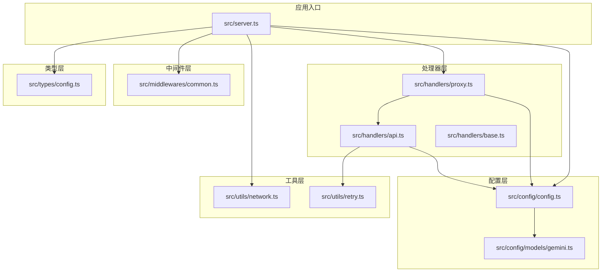
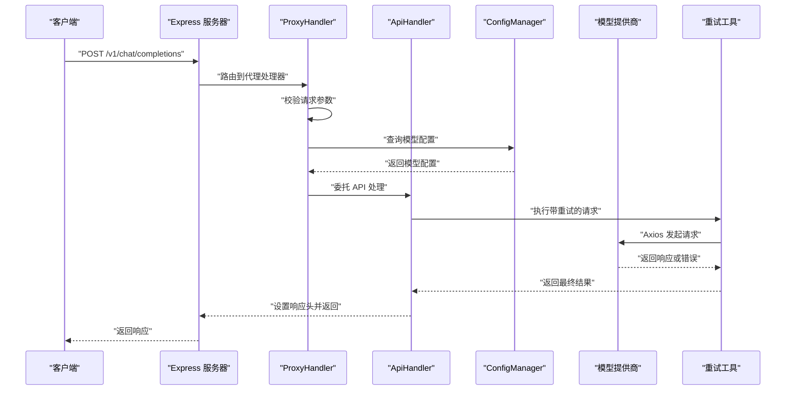
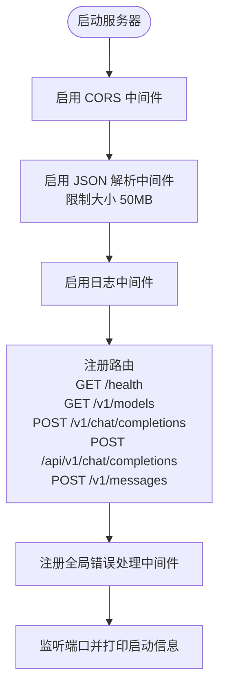
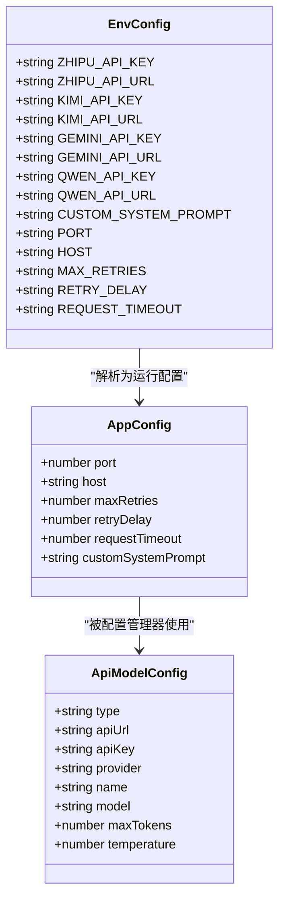
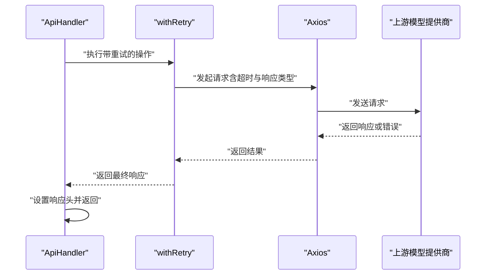
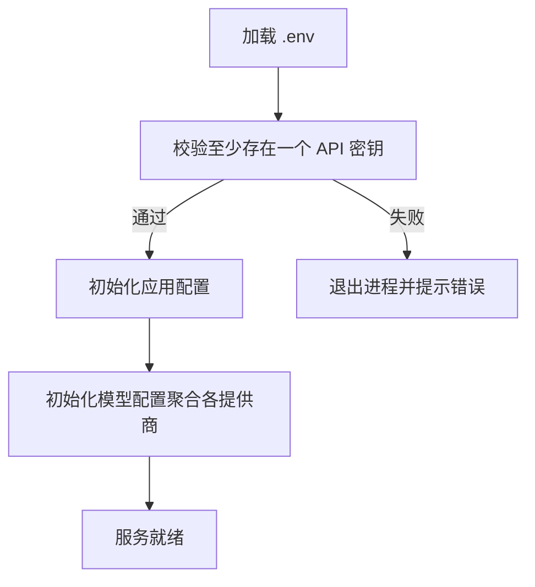
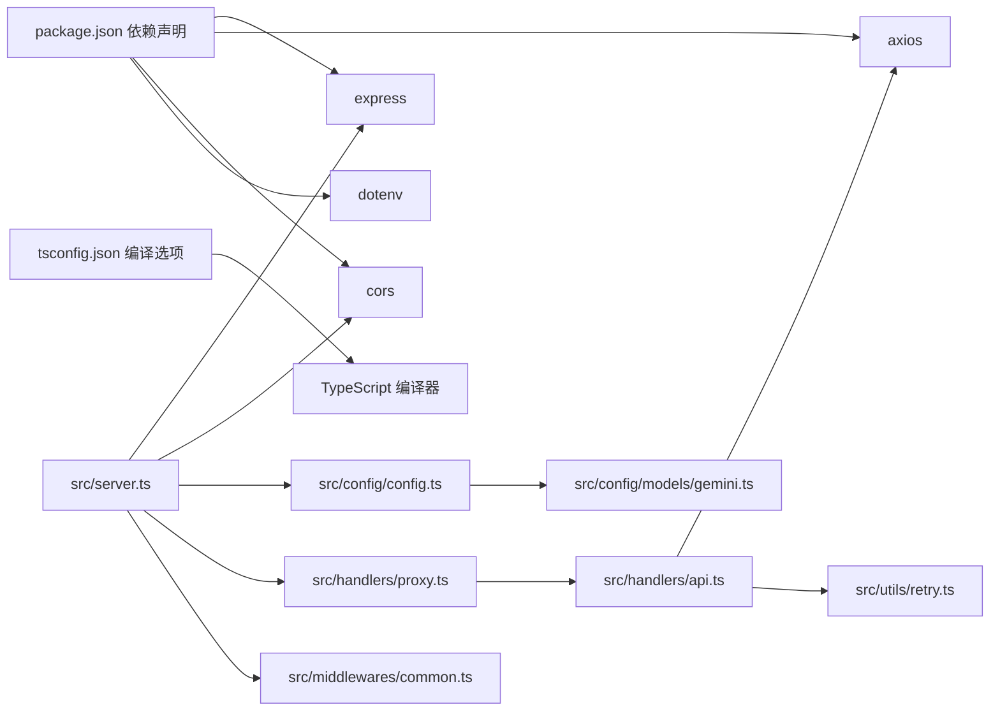

# 技术栈

<cite>
**本文档引用的文件**
- [package.json](file://package.json)
- [tsconfig.json](file://tsconfig.json)
- [src/server.ts](file://src/server.ts)
- [src/config/config.ts](file://src/config/config.ts)
- [src/config/models/gemini.ts](file://src/config/models/gemini.ts)
- [src/handlers/proxy.ts](file://src/handlers/proxy.ts)
- [src/handlers/api.ts](file://src/handlers/api.ts)
- [src/handlers/base.ts](file://src/handlers/base.ts)
- [src/middlewares/common.ts](file://src/middlewares/common.ts)
- [src/utils/network.ts](file://src/utils/network.ts)
- [src/utils/retry.ts](file://src/utils/retry.ts)
- [src/types/config.ts](file://src/types/config.ts)
</cite>

## 目录
1. [简介](#简介)
2. [项目结构](#项目结构)
3. [核心组件](#核心组件)
4. [架构总览](#架构总览)
5. [详细组件分析](#详细组件分析)
6. [依赖关系分析](#依赖关系分析)
7. [性能考量](#性能考量)
8. [故障排查指南](#故障排查指南)
9. [结论](#结论)

## 简介
本项目为 Xcode AI API 代理服务，采用 Node.js 运行时与 TypeScript 类型系统构建，结合 Express.js Web 框架、Axios HTTP 客户端、CORS 跨域支持与 dotenv 环境变量管理，形成一套面向多模型提供商（智谱、Kimi、Gemini、通义千问）的统一代理与路由转发服务。技术选型旨在兼顾开发效率、可维护性与运行稳定性，并通过严格的类型约束与中间件机制保障请求处理的一致性与可观测性。

## 项目结构
项目采用按功能域分层的组织方式：
- src/config：集中式配置管理与模型提供商适配
- src/handlers：业务处理器（代理与 API 转发）
- src/middlewares：通用中间件（日志与错误处理）
- src/utils：工具函数（网络地址解析、重试策略、日志）
- src/types：类型定义（配置、请求/响应结构）
- 根目录：构建与运行脚本、类型编译配置

图表来源
- [src/server.ts:1-88](file://src/server.ts#L1-L88)
- [src/config/config.ts:1-123](file://src/config/config.ts#L1-L123)
- [src/config/models/gemini.ts:1-34](file://src/config/models/gemini.ts#L1-L34)
- [src/handlers/proxy.ts:1-66](file://src/handlers/proxy.ts#L1-L66)
- [src/handlers/api.ts:1-196](file://src/handlers/api.ts#L1-L196)
- [src/handlers/base.ts:1-40](file://src/handlers/base.ts#L1-L40)
- [src/middlewares/common.ts:1-25](file://src/middlewares/common.ts#L1-L25)
- [src/utils/network.ts:1-51](file://src/utils/network.ts#L1-L51)
- [src/utils/retry.ts:1-34](file://src/utils/retry.ts#L1-L34)
- [src/types/config.ts:1-48](file://src/types/config.ts#L1-L48)

章节来源
- [src/server.ts:1-88](file://src/server.ts#L1-L88)
- [package.json:1-30](file://package.json#L1-L30)
- [tsconfig.json:1-35](file://tsconfig.json#L1-L35)

## 核心组件
- Node.js 运行时：提供事件驱动、非阻塞 I/O 的高性能运行环境，适合高并发的 API 代理场景。
- TypeScript 类型系统：在编译期进行类型检查，显著降低运行时错误概率，提升重构安全性与 IDE 智能提示质量。
- Express.js Web 框架：以简洁的中间件与路由机制快速搭建 REST API，配合严格类型定义实现端到端类型安全。
- Axios HTTP 客户端：提供 Promise 化的 HTTP 请求能力，支持流式响应与超时控制，便于与多模型提供商的 OpenAI 兼容接口对接。
- CORS 跨域支持：默认启用跨域允许，便于前端或本地调试环境访问代理服务。
- dotenv 环境变量管理：集中管理 API 密钥与运行参数，支持不同环境的灵活切换与安全隔离。

章节来源
- [package.json:14-28](file://package.json#L14-L28)
- [tsconfig.json:8-26](file://tsconfig.json#L8-L26)
- [src/server.ts:23-44](file://src/server.ts#L23-L44)
- [src/config/config.ts:1-123](file://src/config/config.ts#L1-L123)

## 架构总览
整体架构围绕“配置中心 + 处理器 + 中间件 + 工具”的分层设计展开。服务启动后注册中间件与路由，根据请求模型选择对应处理器；处理器通过配置中心获取模型提供商信息，借助 Axios 访问上游 API，并通过重试策略与流式传输增强鲁棒性与用户体验。

图表来源
- [src/server.ts:29-40](file://src/server.ts#L29-L40)
- [src/handlers/proxy.ts:9-37](file://src/handlers/proxy.ts#L9-L37)
- [src/handlers/api.ts:8-28](file://src/handlers/api.ts#L8-L28)
- [src/config/config.ts:101-115](file://src/config/config.ts#L101-L115)
- [src/utils/retry.ts:1-26](file://src/utils/retry.ts#L1-L26)

## 详细组件分析

### Express.js Web 框架
- 中间件注册：统一启用 CORS、JSON 解析（限制 50MB）、日志中间件，确保跨域访问与请求体解析能力。
- 路由设计：提供健康检查、模型列表查询与多条兼容路径的聊天补全接口，满足不同客户端的调用习惯。
- 错误处理：全局错误中间件捕获未处理异常，输出标准化错误响应，避免服务崩溃。

图表来源
- [src/server.ts:23-52](file://src/server.ts#L23-L52)
- [src/middlewares/common.ts:9-25](file://src/middlewares/common.ts#L9-L25)

章节来源
- [src/server.ts:23-52](file://src/server.ts#L23-L52)
- [src/middlewares/common.ts:1-25](file://src/middlewares/common.ts#L1-L25)

### TypeScript 类型系统
- 编译选项：启用严格模式、禁止隐式 any、严格空值检查、严格函数类型等，减少潜在运行时问题。
- 类型定义：明确模型配置、应用配置、环境变量与请求/响应结构，保证处理器与配置层之间的契约清晰。
- 实践收益：在编译期发现类型不匹配、缺失字段等问题，提升代码质量与可维护性。

图表来源
- [src/types/config.ts:24-48](file://src/types/config.ts#L24-L48)
- [src/config/config.ts:53-67](file://src/config/config.ts#L53-L67)

章节来源
- [tsconfig.json:8-26](file://tsconfig.json#L8-L26)
- [src/types/config.ts:1-48](file://src/types/config.ts#L1-L48)
- [src/config/config.ts:13-20](file://src/config/config.ts#L13-L20)

### Axios HTTP 客户端
- 流式与非流式响应：根据请求是否开启流式，设置相应响应类型与头信息，实现 SSE/流式数据透传。
- 超时与验证：统一设置请求超时，允许 4xx 错误通过以便调试，便于快速定位上游问题。
- 认证与代理：统一使用 Bearer Token 认证，针对特定提供商（如 Kimi）启用 HTTPS Agent 以优化连接复用与安全。
- 错误处理：对上游错误进行解析与透传，支持从流中读取错误内容并转换为结构化错误对象。

图表来源
- [src/handlers/api.ts:30-195](file://src/handlers/api.ts#L30-L195)
- [src/utils/retry.ts:1-26](file://src/utils/retry.ts#L1-L26)

章节来源
- [src/handlers/api.ts:30-195](file://src/handlers/api.ts#L30-L195)

### CORS 跨域支持
- 默认启用：服务端直接使用 CORS 中间件，允许任意来源访问，便于本地开发与跨域调试。
- 响应头：在非流式响应中显式设置允许来源、方法与头部，确保浏览器侧跨域请求成功。

章节来源
- [src/server.ts:24](file://src/server.ts#L24)
- [src/handlers/api.ts:169-190](file://src/handlers/api.ts#L169-L190)

### dotenv 环境变量管理
- 加载时机：在配置模块初始化前加载 .env 文件，确保后续配置读取到最新环境变量。
- 必填校验：至少需配置一个模型的 API 密钥，否则终止进程并提示支持的环境变量。
- 运行参数：端口、主机、最大重试次数、重试延迟、请求超时与自定义系统提示等均可通过环境变量配置。

图表来源
- [src/config/config.ts:5-51](file://src/config/config.ts#L5-L51)
- [src/config/config.ts:53-99](file://src/config/config.ts#L53-L99)

章节来源
- [src/config/config.ts:1-123](file://src/config/config.ts#L1-L123)

### 配置中心与模型提供商适配
- 单例模式：ConfigManager 作为全局配置中心，提供应用配置与模型配置的统一访问。
- 模型聚合：通过各提供商类（如 GeminiProvider）返回模型映射，统一暴露给代理层使用。
- 日志与可视化：启动时打印支持的模型清单、重试与超时配置，以及 Xcode 使用建议的环境变量。

章节来源
- [src/config/config.ts:7-27](file://src/config/config.ts#L7-L27)
- [src/config/config.ts:69-99](file://src/config/config.ts#L69-L99)
- [src/config/models/gemini.ts:1-34](file://src/config/models/gemini.ts#L1-L34)
- [src/server.ts:54-83](file://src/server.ts#L54-L83)

### 处理器与基础抽象
- 基类职责：统一参数校验、错误响应封装与日志记录，避免重复逻辑。
- 代理层：根据请求中的模型 ID 查询配置，选择合适的处理器（当前仅支持 API 类型）。
- API 层：负责与上游模型提供商交互，处理流式与非流式响应，统一返回 OpenAI 兼容格式。

章节来源
- [src/handlers/base.ts:1-40](file://src/handlers/base.ts#L1-L40)
- [src/handlers/proxy.ts:6-66](file://src/handlers/proxy.ts#L6-L66)
- [src/handlers/api.ts:8-196](file://src/handlers/api.ts#L8-L196)

### 中间件与工具
- 日志中间件：记录请求方法与路径，便于审计与排障。
- 错误处理中间件：统一捕获异常并返回标准错误结构，避免泄露内部细节。
- 网络工具：自动识别本机 IP 与可访问地址，便于在多网卡环境下快速定位服务地址。
- 重试工具：指数退避重试策略，提升对外部服务不稳定情况的容忍度。

章节来源
- [src/middlewares/common.ts:1-25](file://src/middlewares/common.ts#L1-L25)
- [src/utils/network.ts:1-51](file://src/utils/network.ts#L1-L51)
- [src/utils/retry.ts:1-34](file://src/utils/retry.ts#L1-L34)

## 依赖关系分析
- 运行时依赖：Express 提供 Web 服务能力，Axios 提供 HTTP 请求能力，CORS 提供跨域支持，dotenv 提供环境变量加载。
- 开发时依赖：TypeScript 提供类型系统与编译能力，ts-node/nodemon 支持开发与热重载，rimraf 清理构建产物。
- 内聚与耦合：配置中心与处理器解耦，通过类型契约传递数据；工具层独立于业务逻辑，便于复用。

图表来源
- [package.json:14-28](file://package.json#L14-L28)
- [tsconfig.json:2-26](file://tsconfig.json#L2-L26)
- [src/server.ts:1-7](file://src/server.ts#L1-L7)
- [src/handlers/api.ts:1-7](file://src/handlers/api.ts#L1-L7)
- [src/utils/retry.ts:1-34](file://src/utils/retry.ts#L1-L34)
- [src/config/models/gemini.ts:1-34](file://src/config/models/gemini.ts#L1-L34)

章节来源
- [package.json:14-28](file://package.json#L14-L28)
- [tsconfig.json:2-26](file://tsconfig.json#L2-L26)

## 性能考量
- 流式响应：在支持的场景下启用流式传输，降低首字节延迟，改善用户体验。
- 重试策略：指数退避重试可有效缓解上游瞬时抖动，但需注意最大重试次数与延迟配置，避免放大请求压力。
- 请求体大小：JSON 解析限制为 50MB，适用于大体积请求场景，但需结合实际业务合理设置。
- 超时控制：统一请求超时时间，防止长时间占用连接资源，影响吞吐量。
- 并发与连接：针对特定提供商启用 HTTPS Agent 可提升连接复用与稳定性。

## 故障排查指南
- 环境变量缺失：若未配置任何模型 API 密钥，服务会直接退出并提示支持的环境变量，请检查 .env 文件。
- 路由不匹配：确认请求路径是否符合支持的格式（如 /v1/chat/completions、/api/v1/chat/completions、/v1/messages）。
- 模型不可用：当请求的模型不在支持列表时，会返回错误信息，检查模型 ID 与配置中心输出的日志。
- 上游错误：查看 API 层对上游错误的解析与透传，必要时开启更详细的日志或调整超时与重试参数。
- 跨域问题：若浏览器端无法访问，请确认 CORS 中间件已启用且响应头正确设置。

章节来源
- [src/config/config.ts:29-51](file://src/config/config.ts#L29-L51)
- [src/server.ts:29-40](file://src/server.ts#L29-L40)
- [src/handlers/proxy.ts:14-24](file://src/handlers/proxy.ts#L14-L24)
- [src/handlers/api.ts:124-164](file://src/handlers/api.ts#L124-L164)
- [src/middlewares/common.ts:9-25](file://src/middlewares/common.ts#L9-L25)

## 结论
本项目通过 Node.js + TypeScript + Express 的组合，辅以 Axios、CORS 与 dotenv，构建了一个类型安全、易于扩展且具备良好可观测性的 AI 代理服务。严格的类型约束与中间件机制提升了开发体验与运行稳定性；统一的配置中心与模型提供商适配使得新增模型更加便捷；流式响应与重试策略进一步增强了用户体验与健壮性。对于希望接入多模型提供商并统一对外接口的团队，该技术栈提供了清晰的参考范式。